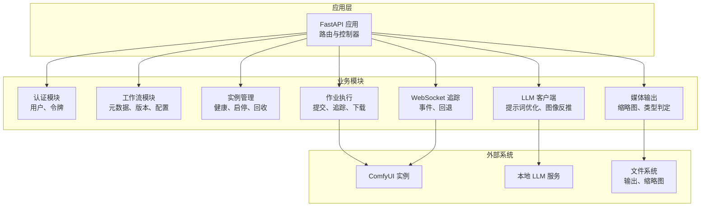
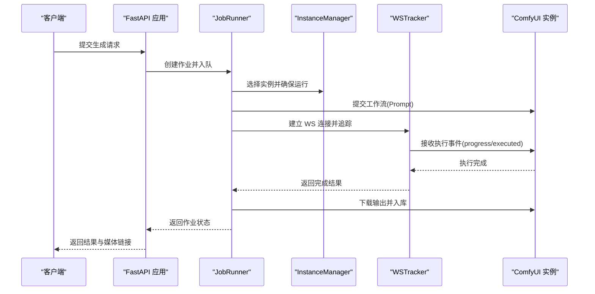
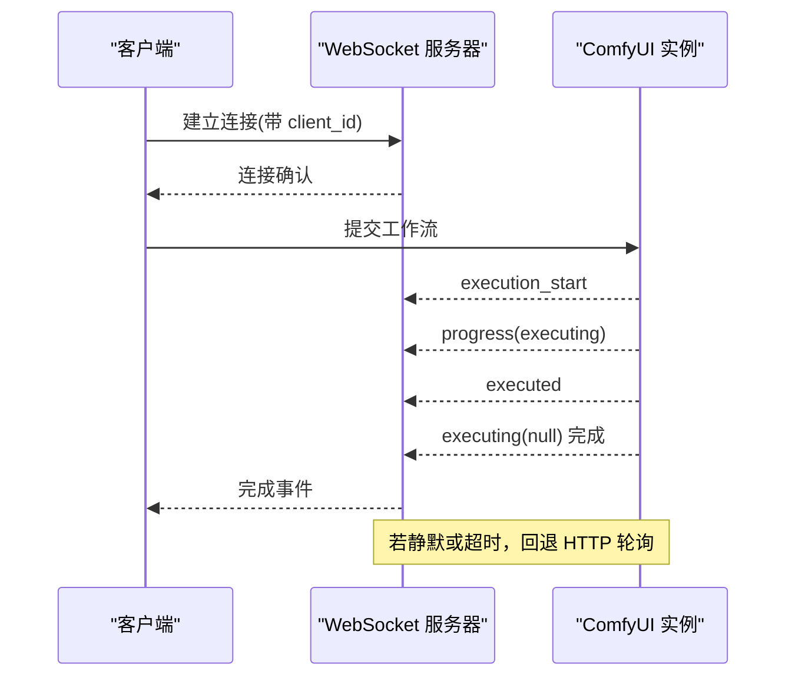
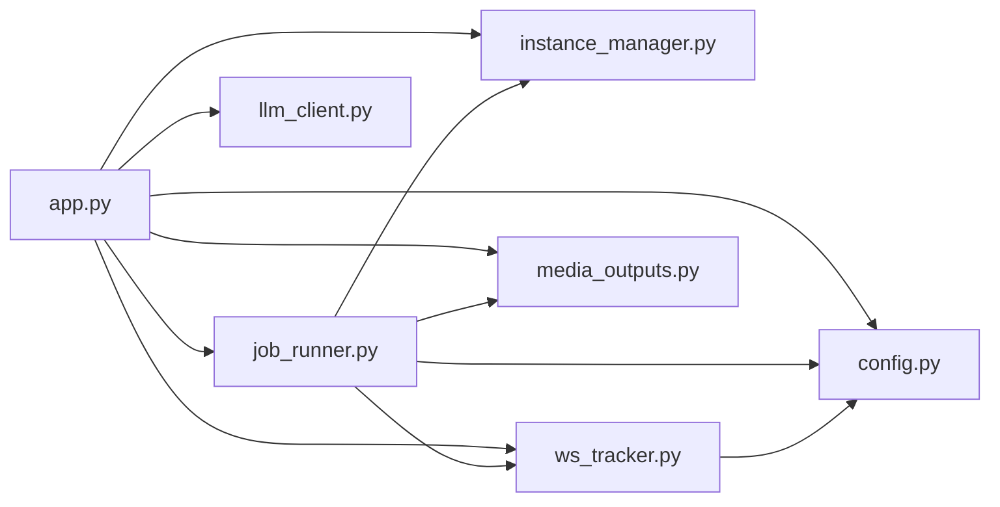

# API 接口文档

<cite>
**本文档引用的文件**
- [app.py](file://app.py)
- [modules/config.py](file://modules/config.py)
- [modules/llm_client.py](file://modules/llm_client.py)
- [modules/media_outputs.py](file://modules/media_outputs.py)
- [modules/instance_manager.py](file://modules/instance_manager.py)
- [modules/job_runner.py](file://modules/job_runner.py)
- [modules/ws_tracker.py](file://modules/ws_tracker.py)
</cite>

## 目录
1. [简介](#简介)
2. [项目结构](#项目结构)
3. [核心组件](#核心组件)
4. [架构总览](#架构总览)
5. [详细组件分析](#详细组件分析)
6. [依赖关系分析](#依赖关系分析)
7. [性能考量](#性能考量)
8. [故障排查指南](#故障排查指南)
9. [结论](#结论)
10. [附录](#附录)

## 简介
本文件为 Ez ComfyUI Showcase 的完整 API 接口文档，覆盖认证与用户管理、工作流管理、实例管理、作业执行、LLM 客户端、媒体输出、WebSocket 实时通信等模块。文档以“RESTful API + WebSocket”为主线，提供端点定义、请求参数、响应格式、状态码说明、错误处理、安全与性能建议。

## 项目结构
应用基于 FastAPI 构建，核心逻辑集中在 app.py 中，业务能力通过 modules 子模块拆分，包括：
- 认证与用户：JWT 登录、登出、个人信息、改密
- 工作流：工作流元数据、版本、配置、查找最近匹配
- 实例：健康检查、启停、空闲回收、死实例检测
- 作业：提交、状态查询、进度追踪、批量操作
- LLM 客户端：提示词优化、图像反推、翻译等
- 媒体输出：生成结果存储、缩略图、下载
- WebSocket：实时进度、断线重连、HTTP 回退

图表来源
- [app.py](file://app.py)
- [modules/instance_manager.py](file://modules/instance_manager.py)
- [modules/job_runner.py](file://modules/job_runner.py)
- [modules/ws_tracker.py](file://modules/ws_tracker.py)
- [modules/llm_client.py](file://modules/llm_client.py)
- [modules/media_outputs.py](file://modules/media_outputs.py)

章节来源
- [app.py](file://app.py)

## 核心组件
- 认证与用户：JWT 登录、登出、个人信息、修改密码、速率限制、CSRF 校验
- 工作流：工作流元数据、版本管理、配置、查找最近匹配
- 实例管理：健康检查、启停、强制重启、空闲回收、死实例检测
- 作业执行：提交、状态流转、进度追踪（WS/HTTP 回退）、下载输出、批量操作
- LLM 客户端：OpenAI 兼容接口封装、错误处理、响应格式
- 媒体输出：媒体类型判定、首选输出收集、缩略图生成
- WebSocket：连接、事件处理、断线回退、超时控制

章节来源
- [app.py](file://app.py)
- [modules/config.py](file://modules/config.py)
- [modules/llm_client.py](file://modules/llm_client.py)
- [modules/media_outputs.py](file://modules/media_outputs.py)
- [modules/instance_manager.py](file://modules/instance_manager.py)
- [modules/job_runner.py](file://modules/job_runner.py)
- [modules/ws_tracker.py](file://modules/ws_tracker.py)

## 架构总览
应用采用“单体 FastAPI + 模块化业务”的设计，核心流程如下：
- 认证：客户端携带 JWT Cookie/Headers，后端校验并返回用户信息
- 工作流：前端上传/选择工作流，后端进行元数据与版本管理
- 实例：按健康度、队列、模型亲和性选择实例，必要时冷启动
- 作业：提交至 ComfyUI，优先使用 WebSocket 实时追踪，失败回退 HTTP 轮询
- 媒体：生成结果写入输出目录，生成缩略图，提供下载与清理

图表来源
- [modules/job_runner.py](file://modules/job_runner.py)
- [modules/ws_tracker.py](file://modules/ws_tracker.py)
- [modules/instance_manager.py](file://modules/instance_manager.py)
- [app.py](file://app.py)

## 详细组件分析

### 认证与用户 API
- 登录
  - 方法与路径：POST /auth/login
  - 请求体：用户名、密码
  - 成功响应：用户信息 + JWT 令牌（设置 Cookie）
  - 状态码：200 成功；400 参数缺失；401 密码错误；403 用户禁用；404 用户不存在
  - 安全：速率限制、CSRF 校验
- 登出
  - 方法与路径：POST /auth/logout
  - 响应：{"ok": true}
  - 状态码：200
- 我的信息
  - 方法与路径：GET /auth/me
  - 需要认证：是
  - 响应：用户基本信息
  - 状态码：200；401 未认证；404 用户不存在
- 修改密码
  - 方法与路径：POST /auth/change-password
  - 请求体：当前密码、新密码（≥6位）
  - 状态码：200 成功；400 新密码过短；403 当前密码错误；404 用户不存在
- 用户列表（管理员）
  - 方法与路径：GET /api/users
  - 需要认证：是；需要管理员角色
  - 响应：用户列表
  - 状态码：200；403 非管理员

章节来源
- [app.py](file://app.py)

### 工作流管理 API
- 工作流元数据
  - 获取：GET /api/workflows/meta
  - 响应：工作流元数据列表（名称、标签、版本、来源等）
- 版本管理
  - 获取版本：GET /api/workflows/{filename}/versions
  - 设置活动版本：POST /api/workflows/{filename}/versions/set-active
  - 删除版本：DELETE /api/workflows/{filename}/versions/{version}
- 配置
  - 获取编辑器配置：GET /api/workflows/{filename}/editor-config
  - 更新编辑器配置：POST /api/workflows/{filename}/editor-config
- 查找最近匹配
  - POST /api/workflows/find-closest
  - 输入：工作流名称关键词
  - 输出：最接近的可用工作流

章节来源
- [app.py](file://app.py)

### 实例管理 API
- 健康检查
  - GET /api/instances/health
  - 响应：实例健康快照（up、model_group、pid、checked_at）
- 启动/停止/重启
  - POST /api/instances/start
  - POST /api/instances/stop
  - POST /api/instances/restart
  - POST /api/instances/force-restart
- 空闲回收
  - GET /api/instances/idle-reap
  - 触发空闲实例回收
- 死实例检测
  - GET /api/instances/dead-check
  - 触发死实例检测并自动重启

章节来源
- [modules/instance_manager.py](file://modules/instance_manager.py)
- [app.py](file://app.py)

### 作业执行 API
- 提交生成
  - POST /api/generate
  - 请求体：工作流路径、字段映射、种子、尺寸、用户ID、偏好实例/节点
  - 响应：作业ID
- 作业状态
  - GET /api/jobs/{job_id}
  - 响应：作业状态、进度、消息、运行时监控
- 批量操作
  - POST /api/jobs/batch-cancel
  - POST /api/jobs/batch-delete
- 历史记录
  - GET /api/history
  - GET /api/history/{id}
  - DELETE /api/history/{id}
  - POST /api/history/batch-delete
  - POST /api/history/batch-download

章节来源
- [modules/job_runner.py](file://modules/job_runner.py)
- [modules/ws_tracker.py](file://modules/ws_tracker.py)
- [app.py](file://app.py)

### LLM 客户端 API
- 聊天补全
  - POST /api/llm/chat
  - 请求体：messages、model、温度、最大token、响应格式
  - 响应：模型回复内容
- 文本模式
  - POST /api/llm/text
  - 请求体：messages、model、温度、最大token、响应格式
  - 响应：纯文本
- 设置
  - GET /api/llm/settings
  - PUT /api/llm/settings
  - 响应：LLM 客户端配置（含禁用思考、超时等）

章节来源
- [modules/llm_client.py](file://modules/llm_client.py)
- [app.py](file://app.py)

### 媒体输出 API
- 媒体类型判定
  - GET /api/media/type
  - 输入：文件名
  - 输出：image 或 video
- 首选输出收集
  - GET /api/media/preferred-outputs
  - 输入：输出引用集合
  - 输出：首选媒体引用列表
- 缩略图
  - GET /api/media/thumbnail
  - 输入：媒体相对路径
  - 输出：缩略图文件或占位
- 下载
  - GET /api/media/download/{rel_path}
  - 输入：相对路径
  - 响应：文件流

章节来源
- [modules/media_outputs.py](file://modules/media_outputs.py)
- [app.py](file://app.py)

### WebSocket API
- 连接
  - ws://host:port/ws?clientId={client_id}
  - 事件类型：
    - execution_start：工作流开始
    - progress：节点进度（value/max）
    - executed：节点执行完成
    - executing：当前执行节点
    - execution_error：执行错误
- 超时与回退
  - WS 无消息超过阈值（静默超时）自动回退 HTTP 轮询
  - Prompt 提交后超过阈值未开始执行，触发 PromptStartTimeout
- 断线重连
  - 支持 resume 模式，复用 client_id 重连已有 prompt

图表来源
- [modules/ws_tracker.py](file://modules/ws_tracker.py)
- [app.py](file://app.py)

## 依赖关系分析
- 模块耦合
  - app.py 作为入口，依赖各模块功能；模块间通过函数注入与数据类交互
  - JobRunner 依赖 InstanceManager、WSTracker、StepCalculator、MediaOutputs
  - WSTracker 依赖 NodeStatus 映射与时间估算器
- 外部依赖
  - ComfyUI 实例 API（/prompt、/history、/queue、/system_stats）
  - 本地 LLM 服务（/v1/chat/completions）
  - 文件系统（输出、缩略图、工作流）

图表来源
- [app.py](file://app.py)
- [modules/instance_manager.py](file://modules/instance_manager.py)
- [modules/job_runner.py](file://modules/job_runner.py)
- [modules/ws_tracker.py](file://modules/ws_tracker.py)
- [modules/media_outputs.py](file://modules/media_outputs.py)
- [modules/config.py](file://modules/config.py)
- [modules/llm_client.py](file://modules/llm_client.py)

## 性能考量
- 实例选择与亲和性：按模型组与队列大小选择实例，减少跨实例切换
- 冷启动与防御期：首次启动设置冷却时间，避免频繁重启
- WS 优先与回退：优先使用 WS 实时事件，静默或超时回退 HTTP 轮询
- 进度计算：基于节点权重与时长估算，提升进度预测准确性
- 历史与缩略图：延迟生成缩略图，避免阻塞主线程

## 故障排查指南
- 认证失败
  - 401 未认证：检查 Authorization/Token/Cookie
  - 403 用户禁用：检查用户状态
  - 429 速率限制：等待冷却或降低请求频率
- 实例问题
  - 404 实例不可达：确认 /system_stats 可访问
  - 启动超时：查看冷启动日志与强制重启
- 作业问题
  - 提交后无响应：触发自动纠错，清理队列与中断
  - 超时：检查 WS 连接、静默超时、PromptStartTimeout
- 媒体问题
  - 下载 400：检查相对路径合法性
  - 类型识别异常：确认扩展名与媒体类型映射

章节来源
- [app.py](file://app.py)
- [modules/instance_manager.py](file://modules/instance_manager.py)
- [modules/job_runner.py](file://modules/job_runner.py)
- [modules/ws_tracker.py](file://modules/ws_tracker.py)

## 结论
本文档提供了 Ez ComfyUI Showcase 的完整 API 规范，涵盖认证、工作流、实例、作业、LLM、媒体与 WebSocket 等模块。建议在生产环境启用 HTTPS、CSRF 保护、速率限制与审计日志，并结合实例健康监控与自动回收机制保障稳定性。

## 附录
- 环境变量与常量
  - EZ_COMFYUI_VERSION、JWT_SECRET_KEY、EZ_COMFYUI_PORT、COMFYUI_URL、WORKFLOW_DIR、OUTPUT_DIR、HISTORY_DIR、WF_META_FILE、WF_DIRS_FILE、WF_CONFIG_DIR、WF_THUMB_DIR、JOBS_FILE、CANCELLED_PROMPTS_FILE、SYSTEM_SETTINGS_FILE
- 安全建议
  - 使用 HTTPS 传输
  - CSRF Token 校验
  - 速率限制与账户锁定
  - 令牌过期与刷新策略
- 性能优化
  - 实例亲和性与队列均衡
  - WS 与 HTTP 回退策略
  - 延迟生成缩略图
  - 历史记录分页与缓存