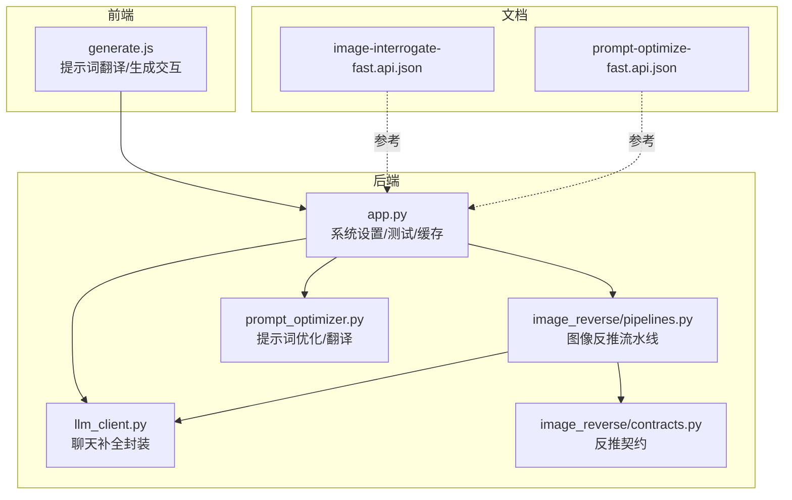
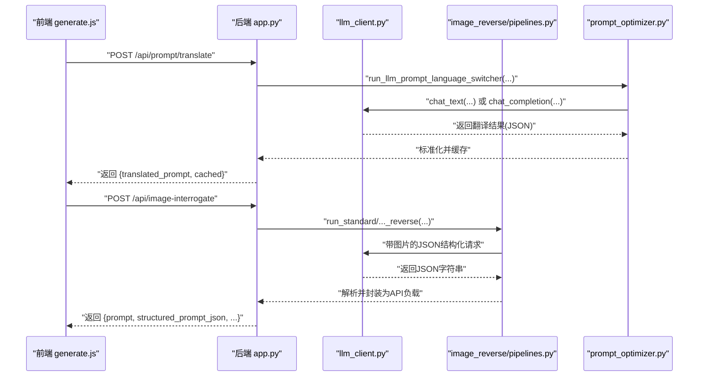
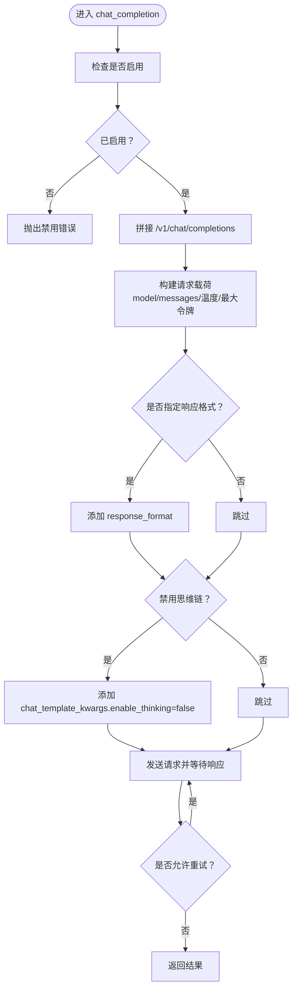
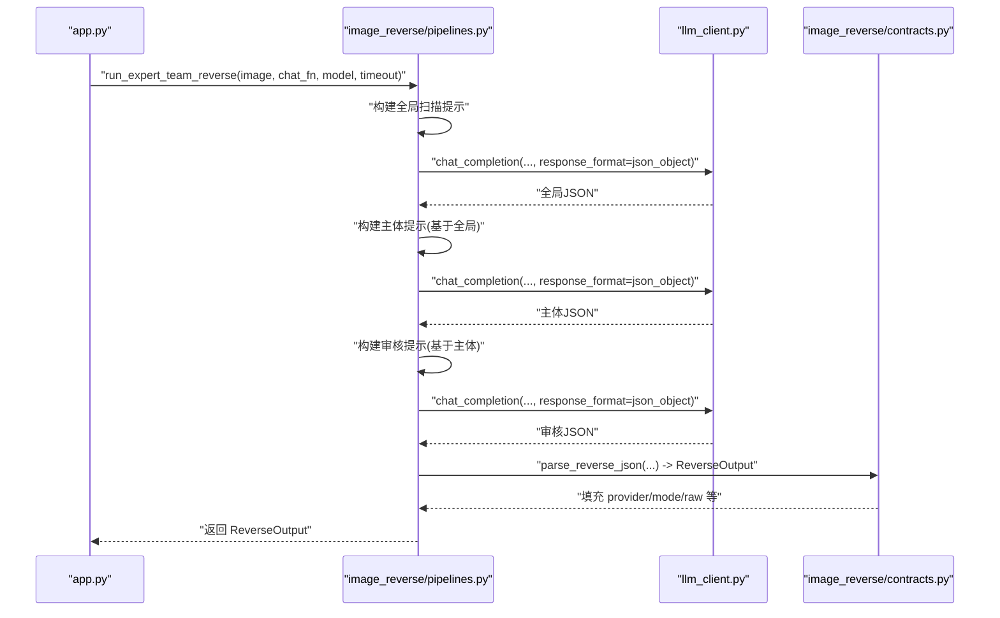
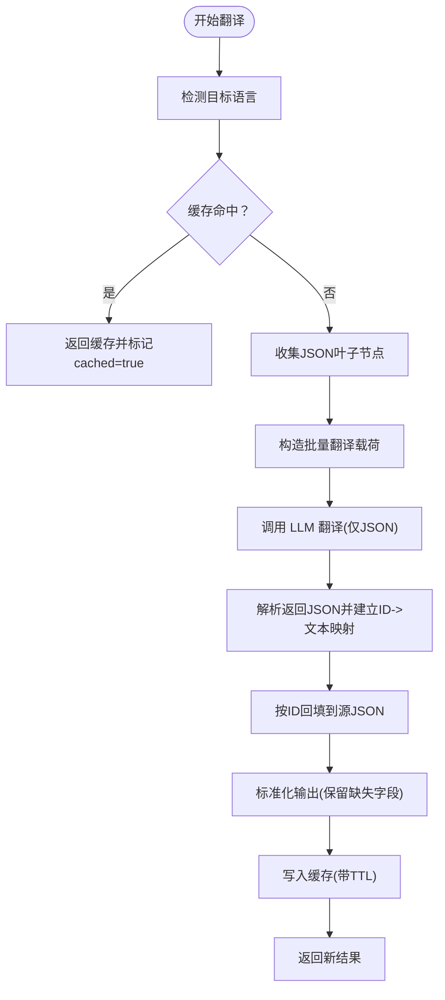
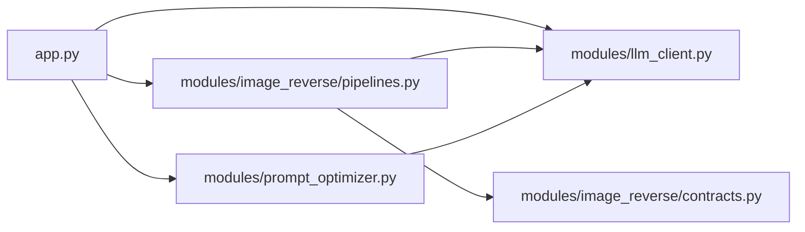

# LLM API

<cite>
**本文引用的文件**
- [app.py](file://app.py)
- [llm_client.py](file://modules/llm_client.py)
- [image_reverse/pipelines.py](file://modules/image_reverse/pipelines.py)
- [image_reverse/contracts.py](file://modules/image_reverse/contracts.py)
- [prompt_optimizer.py](file://modules/prompt_optimizer.py)
- [generate.js](file://static/js/modules/generate.js)
- [image-interrogate-fast.api.json](file://docs/system-workflows/image-interrogate-fast.api.json)
- [prompt-optimize-fast.api.json](file://docs/system-workflows/prompt-optimize-fast.api.json)
- [test_llm_client.py](file://tests/test_llm_client.py)
- [test_prompt_optimizer.py](file://tests/test_prompt_optimizer.py)
- [test_system_settings_api.py](file://tests/test_system_settings_api.py)
</cite>

## 目录
1. [简介](#简介)
2. [项目结构](#项目结构)
3. [核心组件](#核心组件)
4. [架构总览](#架构总览)
5. [详细组件分析](#详细组件分析)
6. [依赖关系分析](#依赖关系分析)
7. [性能考量](#性能考量)
8. [故障排查指南](#故障排查指南)
9. [结论](#结论)
10. [附录](#附录)

## 简介
本文件为 Ez ComfyUI Showcase 的 LLM 客户端 API 接口文档，覆盖以下能力：
- 提示词优化与翻译：支持将提示词在中英文之间互译，并保持 JSON 结构一致性；提供缓存与速率限制保障。
- 图像反推（Image Reverse）：通过多阶段对话流程从图像生成结构化提示词，支持标准、专家与专家团队三种模式。
- LLM 提供商配置与模型选择：支持多配置文件、启用/禁用、超时、能力标签等；提供在线连通性测试。
- 参数与行为控制：温度、最大输出长度、响应格式、思维链开关等。
- 多语言支持与上下文管理：自动识别目标语言、构建系统提示、结构化解析。
- 认证与安全：管理员权限的系统设置修改、认证尝试限流。
- 性能优化建议：缓存命中、分阶段处理、合理设置超时与令牌上限。

## 项目结构
围绕 LLM API 的关键模块与文件如下：
- 后端服务入口与路由：app.py
- LLM 客户端封装：modules/llm_client.py
- 图像反推流水线与契约：modules/image_reverse/*
- 提示词优化与翻译：modules/prompt_optimizer.py
- 前端交互示例：static/js/modules/generate.js
- 系统工作流接口定义：docs/system-workflows/*.api.json
- 单元测试：tests/test_*.py

图表来源
- [app.py](file://app.py)
- [llm_client.py](file://modules/llm_client.py)
- [image_reverse/pipelines.py](file://modules/image_reverse/pipelines.py)
- [image_reverse/contracts.py](file://modules/image_reverse/contracts.py)
- [prompt_optimizer.py](file://modules/prompt_optimizer.py)
- [image-interrogate-fast.api.json](file://docs/system-workflows/image-interrogate-fast.api.json)
- [prompt-optimize-fast.api.json](file://docs/system-workflows/prompt-optimize-fast.api.json)

章节来源
- [app.py](file://app.py)
- [llm_client.py](file://modules/llm_client.py)
- [image_reverse/pipelines.py](file://modules/image_reverse/pipelines.py)
- [image_reverse/contracts.py](file://modules/image_reverse/contracts.py)
- [prompt_optimizer.py](file://modules/prompt_optimizer.py)
- [image-interrogate-fast.api.json](file://docs/system-workflows/image-interrogate-fast.api.json)
- [prompt-optimize-fast.api.json](file://docs/system-workflows/prompt-optimize-fast.api.json)

## 核心组件
- LLM 客户端封装：统一 /v1/chat/completions 调用，支持禁用思维链、响应格式、重试策略、运行时配置与默认值。
- 图像反推流水线：标准/专家/专家团队三模式，按阶段调用 LLM 并解析 JSON 输出，最终产出结构化提示词。
- 提示词优化与翻译：提取 JSON 字面量叶子节点，构造翻译任务，回填缺失字段，支持缓存与双向翻译。
- 系统设置与测试：多提供商配置、激活、在线测试连通性；管理员权限保护。
- 前端交互：提供提示词翻译按钮与缓存逻辑，调用后端 /api/prompt/translate。

章节来源
- [llm_client.py](file://modules/llm_client.py)
- [image_reverse/pipelines.py](file://modules/image_reverse/pipelines.py)
- [prompt_optimizer.py](file://modules/prompt_optimizer.py)
- [app.py](file://app.py)
- [generate.js](file://static/js/modules/generate.js)

## 架构总览
下图展示 LLM API 在系统中的位置与交互路径。

图表来源
- [generate.js](file://static/js/modules/generate.js)
- [app.py](file://app.py)
- [llm_client.py](file://modules/llm_client.py)
- [image_reverse/pipelines.py](file://modules/image_reverse/pipelines.py)
- [prompt_optimizer.py](file://modules/prompt_optimizer.py)

## 详细组件分析

### LLM 客户端封装（chat_completion）
- 功能要点
  - 默认端点：/v1/chat/completions
  - 运行时配置：启用状态、基础地址、模型、超时、禁用思维链等
  - 请求参数：消息列表、温度、最大令牌数、响应格式、模板参数
  - 行为特性：禁用思维链以避免推理占满输出预算；支持响应格式 JSON 对象；具备重试策略
- 关键参数
  - messages：消息数组，支持系统/用户/助手角色
  - model/base_url/api_key：可覆盖运行时默认值
  - temperature/max_tokens：采样与长度控制
  - response_format：强制 JSON 输出
  - timeout：请求超时
- 错误处理
  - 禁用状态下抛出客户端错误
  - 服务器异常通过上层捕获并映射为 HTTP 502

图表来源
- [llm_client.py](file://modules/llm_client.py)

章节来源
- [llm_client.py](file://modules/llm_client.py)

### 图像反推（Image Reverse）
- 模式与流程
  - 标准模式：单轮 JSON 结构化请求
  - 专家模式：更高预算与更严格温度
  - 专家团队模式：全局扫描 → 主体细化 → 审核复核三阶段串联
- 数据契约
  - ReverseOutput：包含模式、提供商、正向提示词、负面提示词、视觉规格、原始数据、专家询问配置、耗时等
  - to_api_payload：导出兼容的 API 负载，含结构化 JSON 字段
- 关键调用
  - 将图片编码为 data URL，作为多模态输入
  - 使用系统提示约束只返回有效 JSON
  - 解析 JSON 并填充到契约对象

图表来源
- [image_reverse/pipelines.py](file://modules/image_reverse/pipelines.py)
- [image_reverse/contracts.py](file://modules/image_reverse/contracts.py)
- [llm_client.py](file://modules/llm_client.py)

章节来源
- [image_reverse/pipelines.py](file://modules/image_reverse/pipelines.py)
- [image_reverse/contracts.py](file://modules/image_reverse/contracts.py)

### 提示词优化与翻译（Prompt Optimization & Translation）
- 语言切换流程
  - 收集 JSON 中所有非空字符串叶子节点，构造批量翻译载荷
  - 发送翻译请求，限定只返回 JSON 对象
  - 解析返回并按 ID 回填，缺失字段保留源值
  - 标准化输出：确保字段完整性与一致性
- 缓存机制
  - 基于提示词与目标语言的键，带 TTL 的内存缓存
  - 命中则直接返回并标记 cached=true
- 前端集成
  - 自动检测目标语言
  - 调用 /api/prompt/translate，支持缓存命中与加载态反馈

图表来源
- [prompt_optimizer.py](file://modules/prompt_optimizer.py)
- [app.py](file://app.py)
- [generate.js](file://static/js/modules/generate.js)

章节来源
- [prompt_optimizer.py](file://modules/prompt_optimizer.py)
- [app.py](file://app.py)
- [generate.js](file://static/js/modules/generate.js)

### 系统设置与 LLM 提供商配置
- 配置项
  - id/name：唯一标识与显示名
  - enabled：是否启用
  - base_url/model/api_key：连接与凭据
  - timeout：超时秒数
  - capabilities：能力标签（如 text/vision）
  - notes：备注
- 规范化与校验
  - id 去除非字母数字与特定符号并去重
  - capabilities 缺省为 ["text"]
  - 去除尾随斜杠，清理空白
- 在线测试
  - POST /api/system-settings/llm/test：使用提交的 llm_api 字段发起一次简短聊天，返回提供商名称、模型、回复摘要等

章节来源
- [app.py](file://app.py)
- [test_system_settings_api.py](file://tests/test_system_settings_api.py)

### 认证与安全
- 管理员权限：系统设置修改与 LLM 测试需管理员身份
- 认证尝试限流：同一窗口期内超过阈值触发 429 Too Many Requests
- 前端交互：翻译按钮在无输入或缓存命中时有即时反馈

章节来源
- [app.py](file://app.py)
- [generate.js](file://static/js/modules/generate.js)

## 依赖关系分析
- 组件耦合
  - app.py 作为统一入口，协调 LLM 客户端、图像反推与提示词优化
  - image_reverse/pipelines.py 依赖 llm_client.py 与 contracts.py
  - prompt_optimizer.py 依赖 llm_client.py 的聊天函数
- 外部依赖
  - OpenAI 兼容的 /v1/chat/completions 接口
  - 前端 fetch 或带鉴权的 apiFetch

图表来源
- [app.py](file://app.py)
- [llm_client.py](file://modules/llm_client.py)
- [image_reverse/pipelines.py](file://modules/image_reverse/pipelines.py)
- [image_reverse/contracts.py](file://modules/image_reverse/contracts.py)
- [prompt_optimizer.py](file://modules/prompt_optimizer.py)

章节来源
- [app.py](file://app.py)
- [llm_client.py](file://modules/llm_client.py)
- [image_reverse/pipelines.py](file://modules/image_reverse/pipelines.py)
- [image_reverse/contracts.py](file://modules/image_reverse/contracts.py)
- [prompt_optimizer.py](file://modules/prompt_optimizer.py)

## 性能考量
- 缓存策略
  - 提示词翻译：命中即返回，减少重复请求与成本
  - 建议：对高频提示词进行预热缓存
- 分阶段处理
  - 图像反推采用三阶段，降低单次长上下文负担
  - 建议：根据硬件能力调整各阶段 max_tokens 与温度
- 超时与重试
  - 为不同模式设置合理 timeout，避免长时间阻塞
  - 响应格式与思维链禁用可提升稳定性
- 令牌预算
  - 依据模式设定 token 预算，避免超出模型上下文
- 前端体验
  - 加载态与缓存命中提示，改善用户感知

## 故障排查指南
- LLM API 测试失败
  - 症状：/api/system-settings/llm/test 返回 502
  - 排查：确认 base_url、model、api_key 正确；检查网络连通性与超时设置
- 翻译结果为空或不完整
  - 症状：返回 JSON 不符合预期
  - 排查：确保 LLM 支持 response_format=json_object；检查禁用思维链设置
- 图像反推报错
  - 症状：解析 JSON 失败或字段缺失
  - 排查：确认系统提示仅返回 JSON；检查各阶段 max_tokens 是否足够
- 缓存未生效
  - 症状：重复请求未命中
  - 排查：确认键一致（提示词+目标语言）与 TTL 设置

章节来源
- [app.py](file://app.py)
- [llm_client.py](file://modules/llm_client.py)
- [image_reverse/pipelines.py](file://modules/image_reverse/pipelines.py)
- [prompt_optimizer.py](file://modules/prompt_optimizer.py)

## 结论
本 LLM API 通过统一的客户端封装与多阶段处理，实现了提示词优化、翻译与图像反推等核心能力。配合系统设置与测试接口，便于多提供商接入与运维验证。建议在生产环境结合缓存、分阶段处理与合理的超时/令牌预算，以获得稳定且高性能的用户体验。

## 附录

### 接口定义与示例

- 提示词翻译
  - 方法与路径：POST /api/prompt/translate
  - 请求体字段
    - prompt：待翻译提示词（必填）
    - target_language：目标语言（"en" 或 "zh"，可选，默认自动检测）
  - 响应字段
    - ok：布尔
    - translated_prompt：翻译后的提示词
    - target_language：目标语言
    - cached：是否来自缓存
    - provider：提供商标识
  - 示例（请求）
    - {"prompt": "切成片的西瓜", "target_language": "en"}
  - 示例（响应）
    - {"ok": true, "translated_prompt": "sliced watermelon", "target_language": "en", "cached": false, "provider": "llm-gemma-..."}
  - 前端调用参考
    - [generate.js](file://static/js/modules/generate.js)

- 图像反推（快速）
  - 方法与路径：POST /api/image-interrogate
  - 请求体字段
    - image：图片（二进制或上传字段，视后端实现而定）
    - mode：反推模式（"standard"/"expert"/"expert_team"，可选）
  - 响应字段
    - ok：布尔
    - prompt：正向提示词
    - prompt_zh：中文提示词别名
    - negative_prompt：负面提示词（逗号分隔）
    - structured_prompt：结构化规格字典
    - structured_prompt_json：结构化规格 JSON 字符串
    - provider：提供商
    - expert_interrogate：专家询问配置（可选）
    - interrogate_elapsed_seconds：耗时（可选）
  - 示例（响应）
    - {"ok": true, "prompt": "...", "prompt_zh": "...", "negative_prompt": "...", "structured_prompt": {...}, "structured_prompt_json": "{...}", "provider": "..."}

- LLM 提供商配置与测试
  - 方法与路径：POST /api/system-settings/llm/test
  - 请求体字段
    - llm_api：包含 base_url、model、api_key、timeout 等
  - 响应字段
    - ok：布尔
    - provider：提供商名称
    - base_url：实际使用的基础地址
    - model：实际使用的模型
    - reply：简短回复内容
  - 示例（响应）
    - {"ok": true, "provider": "llm-gemma-q5", "base_url": "http://host:port", "model": "gemma-q5", "reply": "pong"}

- 系统工作流参考
  - 快速图像反推接口定义：[image-interrogate-fast.api.json](file://docs/system-workflows/image-interrogate-fast.api.json)
  - 快速提示词优化接口定义：[prompt-optimize-fast.api.json](file://docs/system-workflows/prompt-optimize-fast.api.json)

章节来源
- [app.py](file://app.py)
- [generate.js](file://static/js/modules/generate.js)
- [image-interrogate-fast.api.json](file://docs/system-workflows/image-interrogate-fast.api.json)
- [prompt-optimize-fast.api.json](file://docs/system-workflows/prompt-optimize-fast.api.json)