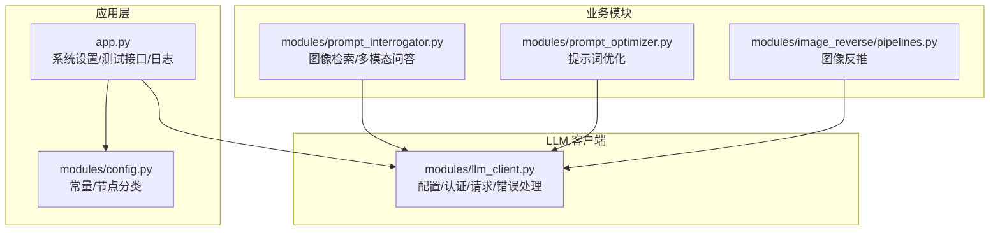
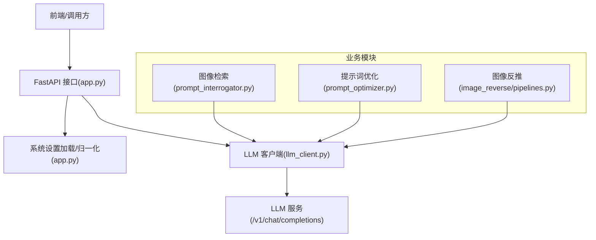
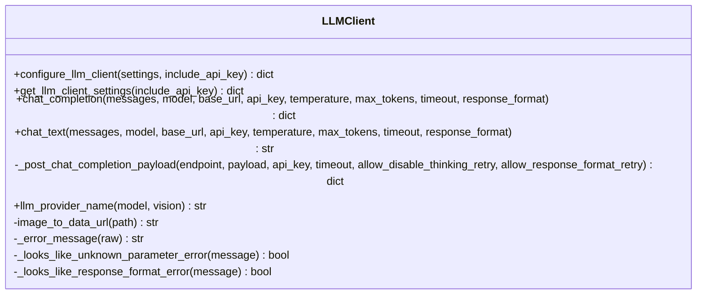
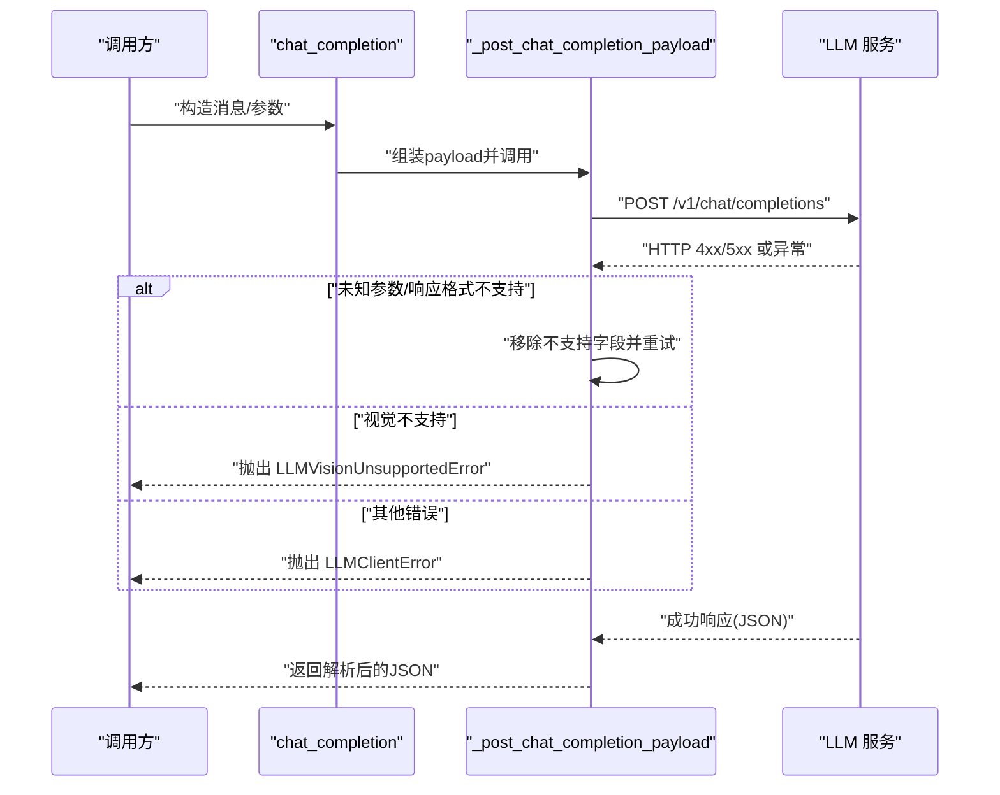
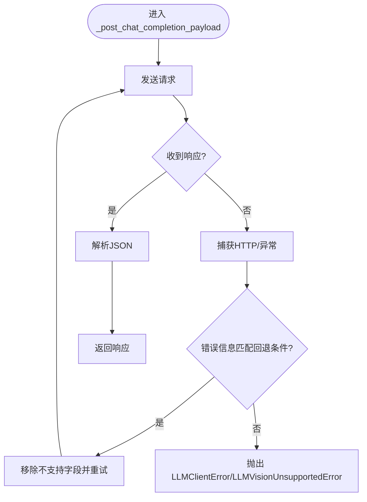
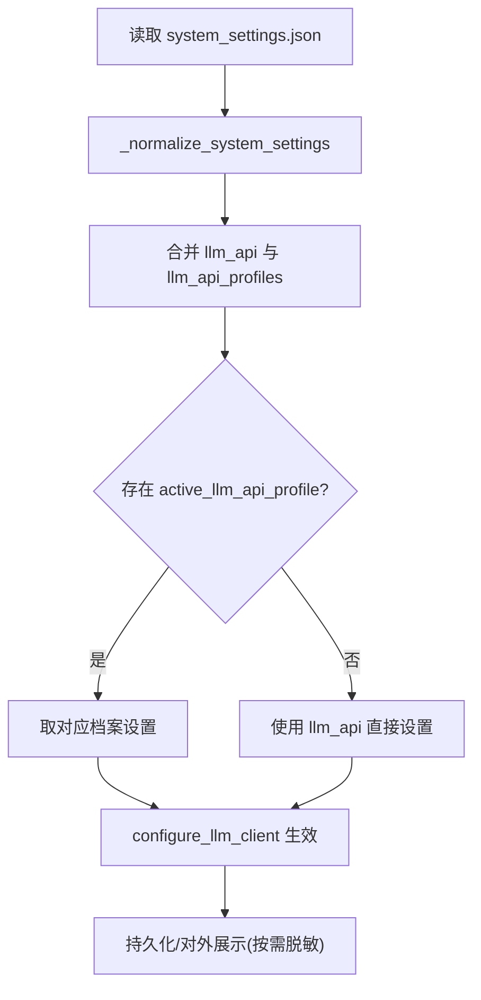
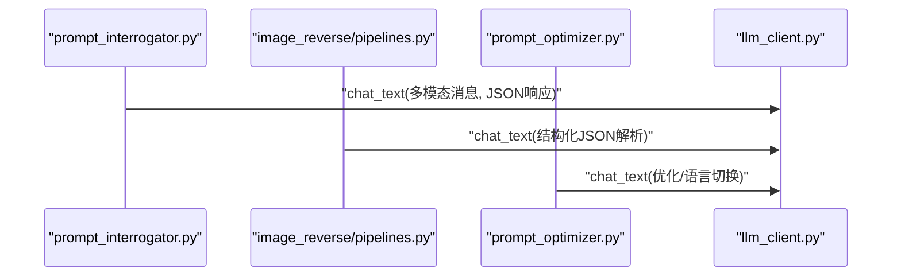
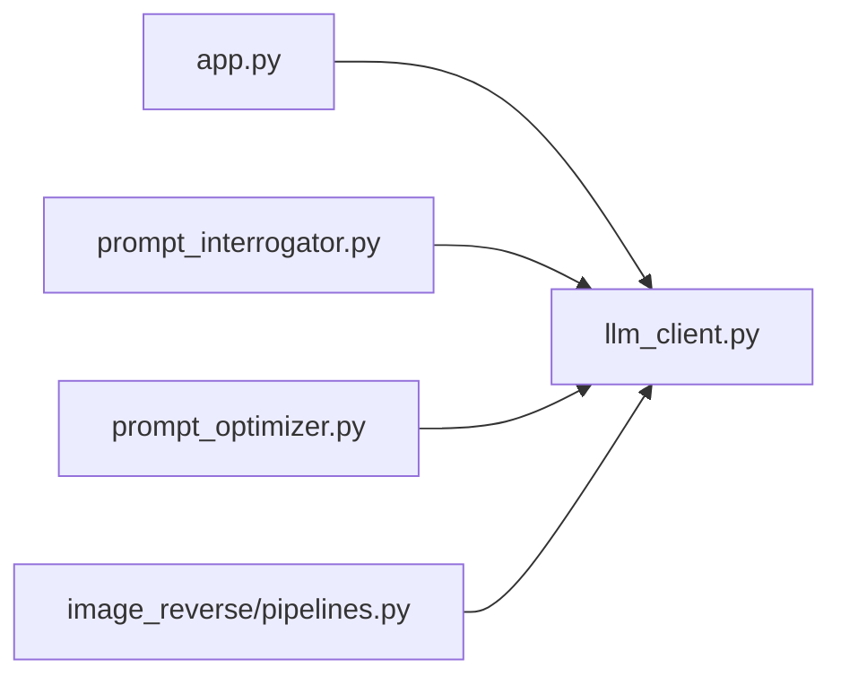

# LLM 客户端集成

<cite>
**本文引用的文件**
- [modules/llm_client.py](file://modules/llm_client.py)
- [app.py](file://app.py)
- [modules/config.py](file://modules/config.py)
- [modules/prompt_interrogator.py](file://modules/prompt_interrogator.py)
- [modules/prompt_optimizer.py](file://modules/prompt_optimizer.py)
- [modules/image_reverse/pipelines.py](file://modules/image_reverse/pipelines.py)
- [tests/test_llm_client.py](file://tests/test_llm_client.py)
</cite>

## 目录
1. [简介](#简介)
2. [项目结构](#项目结构)
3. [核心组件](#核心组件)
4. [架构总览](#架构总览)
5. [详细组件分析](#详细组件分析)
6. [依赖分析](#依赖分析)
7. [性能考虑](#性能考虑)
8. [故障排除指南](#故障排除指南)
9. [结论](#结论)
10. [附录](#附录)

## 简介
本文件面向 LLM 客户端集成模块，系统化阐述以下主题：
- LLM 提供商配置与模型选择策略
- API 密钥管理与认证机制
- 客户端初始化、连接与请求路由
- 多供应商支持、负载均衡与故障转移能力现状与扩展建议
- 运营功能：配额控制、成本计算与日志监控
- 配置示例、集成指南与故障排除方法
- 性能监控、日志记录与安全防护措施

该模块以轻量的 OpenAI 兼容接口封装本地/远程 LLM 服务，提供文本对话与图像多模态问答能力，并在上层应用中作为提示优化、图像反推等技能的核心依赖。

## 项目结构
围绕 LLM 客户端集成的关键文件与职责如下：
- modules/llm_client.py：LLM 客户端核心实现，负责配置、认证、请求发送与错误处理
- app.py：系统入口与业务编排，负责系统设置加载、LLM 配置生效、测试接口与日志记录
- modules/config.py：系统常量与节点分类，为工作流路由与实例亲和提供基础
- modules/prompt_interrogator.py：图像检索与提示词解释，调用 LLM 客户端进行多模态问答
- modules/prompt_optimizer.py：提示词优化与语言切换，调用 LLM 客户端进行文本优化
- modules/image_reverse/pipelines.py：图像反推流程，调用 LLM 客户端进行结构化解析
- tests/test_llm_client.py：针对响应格式兼容性的单元测试

**图表来源**
- [app.py:43-44](file://app.py#L43-L44)
- [modules/llm_client.py:53-76](file://modules/llm_client.py#L53-L76)
- [modules/prompt_interrogator.py:28](file://modules/prompt_interrogator.py#L28)
- [modules/prompt_optimizer.py:16](file://modules/prompt_optimizer.py#L16)
- [modules/image_reverse/pipelines.py:6](file://modules/image_reverse/pipelines.py#L6)

**章节来源**
- [modules/llm_client.py:1-272](file://modules/llm_client.py#L1-L272)
- [app.py:1319-1551](file://app.py#L1319-L1551)

## 核心组件
- LLM 客户端配置与运行时设置
  - 默认基地址、模型、超时、禁用思考模式等通过环境变量与运行时字典合并
  - 支持启用/禁用、覆盖基地址、模型、API 密钥、超时与“禁用思考”策略
- 认证与密钥管理
  - 支持在请求头中附加 Bearer Token；内部对密钥进行脱敏显示
- 请求与响应处理
  - 统一走 /v1/chat/completions 接口，支持温度、最大令牌数、响应格式
  - 自动回退策略：当服务器不识别参数时自动移除参数重试
- 错误处理
  - 将 HTTP 错误与通用异常统一包装为 LLMClientError
  - 对视觉不支持场景抛出专用异常 LLMVisionUnsupportedError

**章节来源**
- [modules/llm_client.py:14-28](file://modules/llm_client.py#L14-L28)
- [modules/llm_client.py:53-83](file://modules/llm_client.py#L53-L83)
- [modules/llm_client.py:93-128](file://modules/llm_client.py#L93-L128)
- [modules/llm_client.py:131-198](file://modules/llm_client.py#L131-L198)
- [modules/llm_client.py:31-37](file://modules/llm_client.py#L31-L37)

## 架构总览
下图展示 LLM 客户端在系统中的位置与交互关系：

**图表来源**
- [app.py:1417-1431](file://app.py#L1417-L1431)
- [modules/llm_client.py:93-128](file://modules/llm_client.py#L93-L128)
- [modules/prompt_interrogator.py:4214-4250](file://modules/prompt_interrogator.py#L4214-L4250)
- [modules/prompt_optimizer.py:1260-1305](file://modules/prompt_optimizer.py#L1260-L1305)
- [modules/image_reverse/pipelines.py:80-150](file://modules/image_reverse/pipelines.py#L80-L150)

## 详细组件分析

### LLM 客户端类与方法概览
- 配置函数：configure_llm_client
  - 合并传入设置与默认值，限制超时范围，更新运行时设置并返回当前配置（可选隐藏密钥）
- 查询函数：get_llm_client_settings
  - 返回当前运行时配置，按需脱敏密钥
- 文本对话：chat_completion
  - 构造消息体，附加禁用思考参数与响应格式，调用底层发送逻辑
- 文本抽取：chat_text
  - 从聊天响应中提取最终内容，必要时回退至 reasoning_content（仅 JSON 模式且为合法对象）
- 底层发送：_post_chat_completion_payload
  - 组装请求头与体，发送请求，处理 HTTP 错误与异常，支持参数回退与视觉不支持错误识别
- 辅助函数：llm_provider_name、图像转 dataURL、错误消息解析、参数兼容性判断

**图表来源**
- [modules/llm_client.py:53-83](file://modules/llm_client.py#L53-L83)
- [modules/llm_client.py:93-128](file://modules/llm_client.py#L93-L128)
- [modules/llm_client.py:131-198](file://modules/llm_client.py#L131-L198)
- [modules/llm_client.py:38-41](file://modules/llm_client.py#L38-L41)
- [modules/llm_client.py:86-90](file://modules/llm_client.py#L86-L90)
- [modules/llm_client.py:238-271](file://modules/llm_client.py#L238-L271)

**章节来源**
- [modules/llm_client.py:38-41](file://modules/llm_client.py#L38-L41)
- [modules/llm_client.py:53-83](file://modules/llm_client.py#L53-L83)
- [modules/llm_client.py:93-128](file://modules/llm_client.py#L93-L128)
- [modules/llm_client.py:131-198](file://modules/llm_client.py#L131-L198)
- [modules/llm_client.py:238-271](file://modules/llm_client.py#L238-L271)

### 请求路由与错误回退序列
下图展示 chat_completion 的调用链与参数兼容性回退逻辑：

**图表来源**
- [modules/llm_client.py:93-128](file://modules/llm_client.py#L93-L128)
- [modules/llm_client.py:131-198](file://modules/llm_client.py#L131-L198)
- [modules/llm_client.py:149-191](file://modules/llm_client.py#L149-L191)

**章节来源**
- [modules/llm_client.py:93-128](file://modules/llm_client.py#L93-L128)
- [modules/llm_client.py:131-198](file://modules/llm_client.py#L131-L198)

### 参数兼容性与回退流程
当服务器不识别某些参数（如 chat_template_kwargs、response_format）时，客户端会自动移除对应字段并重试，提升兼容性。

**图表来源**
- [modules/llm_client.py:131-198](file://modules/llm_client.py#L131-L198)
- [modules/llm_client.py:238-271](file://modules/llm_client.py#L238-L271)

**章节来源**
- [modules/llm_client.py:131-198](file://modules/llm_client.py#L131-L198)
- [modules/llm_client.py:238-271](file://modules/llm_client.py#L238-L271)

### 系统设置与多供应商配置
- 系统设置归一化：app.py 中的 _normalize_system_settings 将 llm_api 与 llm_api_profiles 合并为当前有效设置，并调用 configure_llm_client 生效
- 多供应商配置：llm_api_profiles 支持多个供应商档案，每个档案包含 id/name/base_url/model/api_key/timeout/capabilities/notes 等字段
- 活跃档案：active_llm_api_profile 指定当前使用的供应商档案，未指定时使用 llm_api 的直接配置
- 设置持久化：系统设置写入 data/system_settings.json，支持增量补丁更新

**图表来源**
- [app.py:1417-1431](file://app.py#L1417-L1431)
- [app.py:1434-1490](file://app.py#L1434-L1490)
- [app.py:1493-1551](file://app.py#L1493-L1551)

**章节来源**
- [app.py:1417-1431](file://app.py#L1417-L1431)
- [app.py:1434-1490](file://app.py#L1434-L1490)
- [app.py:1493-1551](file://app.py#L1493-L1551)

### 上层业务模块集成
- 图像检索：prompt_interrogator.py 使用 chat_text 发送多模态消息（文本+图片），要求最终输出为 JSON 对象
- 提示词优化：prompt_optimizer.py 使用 chat_text 进行提示词改写与语言切换
- 图像反推：image_reverse/pipelines.py 使用 chat_text 解析结构化 JSON 输出

**图表来源**
- [modules/prompt_interrogator.py:4214-4250](file://modules/prompt_interrogator.py#L4214-L4250)
- [modules/prompt_optimizer.py:1260-1305](file://modules/prompt_optimizer.py#L1260-L1305)
- [modules/image_reverse/pipelines.py:80-150](file://modules/image_reverse/pipelines.py#L80-L150)

**章节来源**
- [modules/prompt_interrogator.py:4214-4250](file://modules/prompt_interrogator.py#L4214-L4250)
- [modules/prompt_optimizer.py:1260-1305](file://modules/prompt_optimizer.py#L1260-L1305)
- [modules/image_reverse/pipelines.py:80-150](file://modules/image_reverse/pipelines.py#L80-L150)

## 依赖分析
- 内部依赖
  - app.py 依赖 llm_client 的配置与测试接口
  - 业务模块（prompt_interrogator、prompt_optimizer、image_reverse/pipelines）依赖 llm_client 的 chat_text 与 llm_provider_name
- 外部依赖
  - 通过 /v1/chat/completions 与 OpenAI 兼容的 LLM 服务通信
  - 日志系统由 app.py 提供，便于定位 LLM 请求与错误

**图表来源**
- [app.py:43-44](file://app.py#L43-L44)
- [modules/prompt_interrogator.py:28](file://modules/prompt_interrogator.py#L28)
- [modules/prompt_optimizer.py:16](file://modules/prompt_optimizer.py#L16)
- [modules/image_reverse/pipelines.py:6](file://modules/image_reverse/pipelines.py#L6)

**章节来源**
- [app.py:43-44](file://app.py#L43-L44)
- [modules/prompt_interrogator.py:28](file://modules/prompt_interrogator.py#L28)
- [modules/prompt_optimizer.py:16](file://modules/prompt_optimizer.py#L16)
- [modules/image_reverse/pipelines.py:6](file://modules/image_reverse/pipelines.py#L6)

## 性能考虑
- 超时控制：客户端对超时进行上下限约束，避免极端配置影响稳定性
- 参数兼容性：自动移除不被识别的参数，减少因版本差异导致的失败
- 响应格式回退：当服务器不支持 response_format 时自动降级，提升成功率
- 日志与监控：应用层提供日志缓冲与持久化，便于观测 LLM 请求与错误

**章节来源**
- [modules/llm_client.py:60-64](file://modules/llm_client.py#L60-L64)
- [modules/llm_client.py:156-188](file://modules/llm_client.py#L156-L188)
- [app.py:116-176](file://app.py#L116-L176)

## 故障排除指南
- 常见错误类型
  - LLMClientError：通用 LLM 请求错误，包含服务端错误消息或网络异常
  - LLMVisionUnsupportedError：服务端不支持视觉输入（如缺少 mmproj）
- 定位步骤
  - 使用 /api/system-settings/llm/test 接口进行连通性测试，确认 base_url、model、api_key、timeout 配置正确
  - 查看应用日志，定位具体阶段与错误信息
  - 若出现参数不支持，检查服务器版本与参数兼容性
- 单元测试参考
  - tests/test_llm_client.py 展示了响应格式回退的测试用例，可据此验证兼容性问题

**章节来源**
- [modules/llm_client.py:31-37](file://modules/llm_client.py#L31-L37)
- [app.py:8649-8676](file://app.py#L8649-L8676)
- [tests/test_llm_client.py:9-40](file://tests/test_llm_client.py#L9-L40)

## 结论
本 LLM 客户端集成模块以最小实现提供稳定的 OpenAI 兼容接口，具备：
- 明确的配置与密钥管理策略
- 健壮的错误处理与参数兼容性回退
- 与上层业务模块的清晰边界与良好耦合
对于多供应商、负载均衡与故障转移等高级特性，当前实现以单一配置为主；可在现有配置体系基础上扩展为多档案轮询/权重策略，以满足生产级高可用需求。

## 附录

### 配置示例与集成指南
- 环境变量（优先于运行时设置）
  - EZ_LLM_BASE_URL：LLM 服务基地址
  - EZ_LLM_MODEL：默认模型名称
  - EZ_LLM_TIMEOUT：默认超时（秒）
  - EZ_LLM_API_KEY：API 密钥
- 运行时设置字段
  - enabled：是否启用
  - base_url：服务基地址
  - model：模型名称
  - api_key：API 密钥
  - timeout：超时（1–1800 秒）
  - disable_thinking：禁用思考模式（防止输出被占满）
- 多供应商档案
  - llm_api_profiles：供应商档案列表，每项包含 id/name/base_url/model/api_key/timeout/capabilities/notes
  - active_llm_api_profile：当前活跃档案 ID
- 集成步骤
  - 在系统设置中配置 llm_api 或 llm_api_profiles，并设置 active_llm_api_profile
  - 使用 /api/system-settings/llm/test 进行连通性测试
  - 在业务模块中调用 chat_text 或 chat_completion 获取结果

**章节来源**
- [modules/llm_client.py:14-28](file://modules/llm_client.py#L14-L28)
- [modules/llm_client.py:53-83](file://modules/llm_client.py#L53-L83)
- [app.py:1417-1431](file://app.py#L1417-L1431)
- [app.py:1434-1490](file://app.py#L1434-L1490)
- [app.py:8649-8676](file://app.py#L8649-L8676)

### 安全与合规建议
- 密钥管理
  - 通过环境变量注入密钥，避免硬编码
  - 使用系统设置持久化时注意脱敏显示
- 日志与审计
  - 利用应用日志记录 LLM 请求与错误，保留必要的审计线索
- 输入输出校验
  - 对多模态输入进行类型与大小校验，避免异常输入导致服务端错误
- 网络与访问控制
  - 限制 LLM 服务可达范围，结合防火墙与代理策略

**章节来源**
- [modules/llm_client.py:21-28](file://modules/llm_client.py#L21-L28)
- [app.py:116-176](file://app.py#L116-L176)