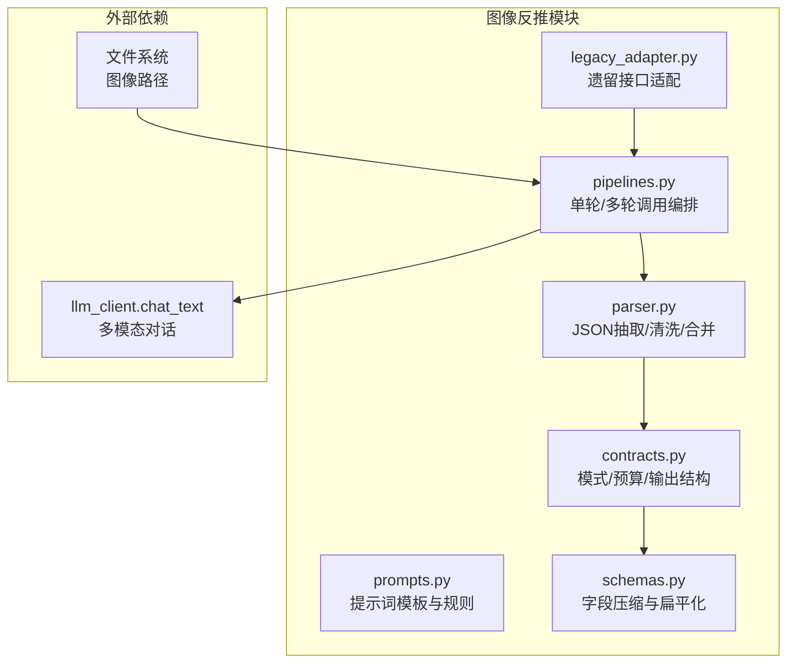
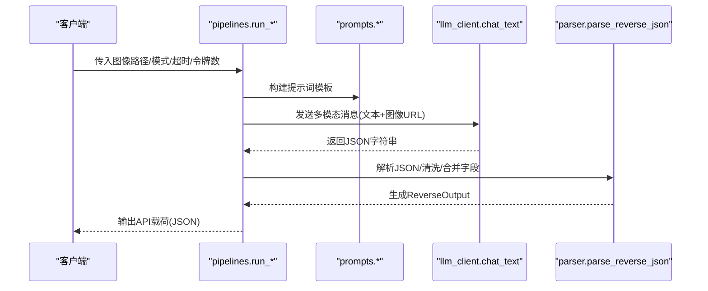
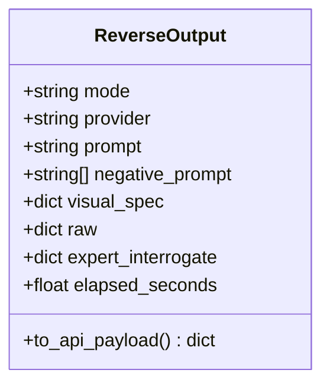
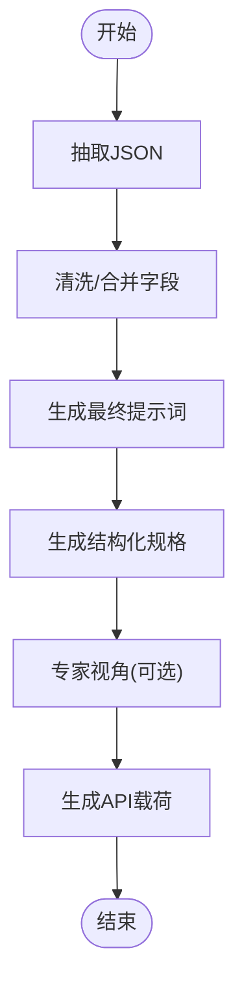
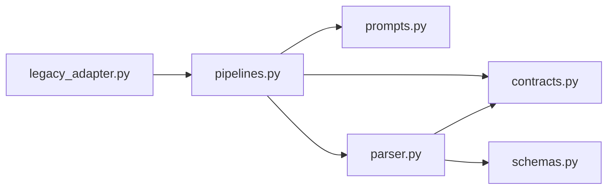

# 图像反推 API

<cite>
**本文引用的文件**   
- [modules/image_reverse/__init__.py](file://modules/image_reverse/__init__.py)
- [modules/image_reverse/contracts.py](file://modules/image_reverse/contracts.py)
- [modules/image_reverse/pipelines.py](file://modules/image_reverse/pipelines.py)
- [modules/image_reverse/prompts.py](file://modules/image_reverse/prompts.py)
- [modules/image_reverse/parser.py](file://modules/image_reverse/parser.py)
- [modules/image_reverse/schemas.py](file://modules/image_reverse/schemas.py)
- [modules/image_reverse/legacy_adapter.py](file://modules/image_reverse/legacy_adapter.py)
- [docs/system-workflows/image-interrogate-fast.api.json](file://docs/system-workflows/image-interrogate-fast.api.json)
</cite>

## 目录
1. [简介](#简介)
2. [项目结构](#项目结构)
3. [核心组件](#核心组件)
4. [架构总览](#架构总览)
5. [详细组件分析](#详细组件分析)
6. [依赖分析](#依赖分析)
7. [性能考虑](#性能考虑)
8. [故障排查指南](#故障排查指南)
9. [结论](#结论)
10. [附录](#附录)

## 简介
本文件为“图像反推”能力的完整 API 文档，聚焦于将图像转换为可直接用于图像生成模型的高质量提示词与结构化视觉规格书。系统支持三种模式：
- 标准模式：快速生成稳定的复刻提示词，强调主体、构图、空间、光色与材质。
- 加强/专家模式：单次多模态读取，输出高精度视觉规格书，包含人体姿态、关节角度、镜头倾斜、光色风格等。
- 专家团队模式：三阶段多轮对话，先整体扫描，再主体深挖，最后复核修正，确保规格书完整性与一致性。

系统提供统一的输出载荷，兼容现有前端与工作流体系，支持负向提示、专家视角、原始 JSON、耗时统计等扩展字段。

## 项目结构
图像反推模块采用分层设计：
- 合同层：定义模式常量、等级映射、令牌预算、输出结构与序列化。
- 提示层：构建不同模式下的提示词模板与规则集。
- 管道层：封装多模态调用、超时与温度控制、多轮流程编排。
- 解析层：抽取 JSON、清洗与合并字段、生成最终提示词与结构化规格。
- 架构适配层：提供遗留接口适配，便于与既有系统集成。

**图表来源**
- [modules/image_reverse/contracts.py:1-95](file://modules/image_reverse/contracts.py#L1-L95)
- [modules/image_reverse/prompts.py:1-415](file://modules/image_reverse/prompts.py#L1-L415)
- [modules/image_reverse/pipelines.py:1-202](file://modules/image_reverse/pipelines.py#L1-L202)
- [modules/image_reverse/parser.py:1-297](file://modules/image_reverse/parser.py#L1-L297)
- [modules/image_reverse/schemas.py:1-48](file://modules/image_reverse/schemas.py#L1-L48)
- [modules/image_reverse/legacy_adapter.py:1-58](file://modules/image_reverse/legacy_adapter.py#L1-L58)

**章节来源**
- [modules/image_reverse/__init__.py:1-28](file://modules/image_reverse/__init__.py#L1-L28)
- [modules/image_reverse/contracts.py:1-95](file://modules/image_reverse/contracts.py#L1-L95)
- [modules/image_reverse/prompts.py:1-415](file://modules/image_reverse/prompts.py#L1-L415)
- [modules/image_reverse/pipelines.py:1-202](file://modules/image_reverse/pipelines.py#L1-L202)
- [modules/image_reverse/parser.py:1-297](file://modules/image_reverse/parser.py#L1-L297)
- [modules/image_reverse/schemas.py:1-48](file://modules/image_reverse/schemas.py#L1-L48)
- [modules/image_reverse/legacy_adapter.py:1-58](file://modules/image_reverse/legacy_adapter.py#L1-L58)

## 核心组件
- 模式与预算
  - 模式常量：标准、专家、专家团队。
  - 模式等级与令牌预算：用于动态控制响应长度与成本。
  - 模式归一化：兼容输入别名与历史模式名。
- 输出结构
  - 统一的 API 载荷包含：提示词、结构化规格、负向提示、专家视角、原始 JSON、耗时等。
- 提示词模板
  - 标准：聚焦主体、构图、空间、光色与材质。
  - 专家：加入人体姿态、关节角度、镜头倾斜、NSFW 规则、量化规则等。
  - 专家团队：三阶段提示词，包含全局扫描、主体深挖与复核修正。
- 管道编排
  - 单轮：一次多模态请求，解析 JSON，生成输出。
  - 多轮：全局扫描 → 主体深挖 → 复核修正，合并复核结果。
- 解析与清洗
  - JSON 抽取：容忍 Markdown 包裹与片段，提取有效对象。
  - 字段清洗：去重、合并、扁平化，生成最终提示词与结构化规格。
- 字段压缩
  - 将嵌套字典/列表压缩为 UI 友好的扁平键值，保留完整句子。

**章节来源**
- [modules/image_reverse/contracts.py:8-56](file://modules/image_reverse/contracts.py#L8-L56)
- [modules/image_reverse/contracts.py:58-95](file://modules/image_reverse/contracts.py#L58-L95)
- [modules/image_reverse/prompts.py:301-327](file://modules/image_reverse/prompts.py#L301-L327)
- [modules/image_reverse/prompts.py:330-383](file://modules/image_reverse/prompts.py#L330-L383)
- [modules/image_reverse/prompts.py:386-414](file://modules/image_reverse/prompts.py#L386-L414)
- [modules/image_reverse/pipelines.py:80-133](file://modules/image_reverse/pipelines.py#L80-L133)
- [modules/image_reverse/pipelines.py:136-202](file://modules/image_reverse/pipelines.py#L136-L202)
- [modules/image_reverse/parser.py:127-147](file://modules/image_reverse/parser.py#L127-L147)
- [modules/image_reverse/parser.py:234-257](file://modules/image_reverse/parser.py#L234-L257)
- [modules/image_reverse/schemas.py:22-47](file://modules/image_reverse/schemas.py#L22-L47)

## 架构总览
图像反推的端到端流程如下：

**图表来源**
- [modules/image_reverse/pipelines.py:23-57](file://modules/image_reverse/pipelines.py#L23-L57)
- [modules/image_reverse/prompts.py:301-327](file://modules/image_reverse/prompts.py#L301-L327)
- [modules/image_reverse/parser.py:260-296](file://modules/image_reverse/parser.py#L260-L296)

## 详细组件分析

### 接口规范

- 标准模式
  - 函数签名：run_standard_reverse(image_path, chat_fn=..., timeout=180.0, max_new_tokens=None, model=None)
  - 输入参数
    - image_path: 图像本地路径
    - chat_fn: 多模态对话函数，默认使用 llm_client.chat_text
    - timeout: 请求超时秒数
    - max_new_tokens: 最大新令牌数（将被预算裁剪）
    - model: 模型标识
  - 输出：API 载荷（包含提示词、结构化规格、负向提示、耗时等）

- 专家模式
  - 函数签名：run_expert_reverse(...)
  - 参数与标准模式一致，但提示词模板更复杂，包含人体姿态、镜头倾斜、量化规则等
  - 输出：API 载荷（包含专家视角字段）

- 专家团队模式
  - 函数签名：run_expert_team_reverse(image_path, ..., review_enabled=True)
  - 三阶段流程：全局扫描 → 主体深挖 → 复核修正
  - 输出：API 载荷（包含专家视角字段，包含各轮原始 JSON）

- 遗留适配接口
  - run_llm_image_interrogator(...)：标准模式适配
  - run_llm_expert_image_interrogator(..., expert_team=False/True)：专家/专家团队适配

**章节来源**
- [modules/image_reverse/pipelines.py:80-133](file://modules/image_reverse/pipelines.py#L80-L133)
- [modules/image_reverse/pipelines.py:136-202](file://modules/image_reverse/pipelines.py#L136-L202)
- [modules/image_reverse/legacy_adapter.py:10-57](file://modules/image_reverse/legacy_adapter.py#L10-L57)

### 数据模型与输出载荷

- 字段说明
  - mode/provider：模式与供应商标识
  - prompt：最终提示词
  - negative_prompt：负向提示列表，序列化为逗号分隔字符串
  - visual_spec：结构化画面描述（扁平化）
  - raw：原始解析结果
  - expert_interrogate：专家视角（专家/专家团队模式）
  - elapsed_seconds：反推耗时（毫秒级）

**图表来源**
- [modules/image_reverse/contracts.py:58-95](file://modules/image_reverse/contracts.py#L58-L95)

**章节来源**
- [modules/image_reverse/contracts.py:58-95](file://modules/image_reverse/contracts.py#L58-L95)

### 处理流程与规则

- JSON 抽取与清洗
  - 支持去除 Markdown 代码块包裹，提取首个 JSON 对象
  - 清洗空值、合并重复、扁平化嵌套结构
- 最终提示词生成
  - 优先取显式 final_prompt 字段
  - 否则按字段顺序拼接句子，保证可执行性与完整性
- 专家视角
  - 专家模式：记录专家观点、原始 JSON
  - 专家团队模式：记录三轮原始 JSON 与复核结论

**图表来源**
- [modules/image_reverse/parser.py:127-147](file://modules/image_reverse/parser.py#L127-L147)
- [modules/image_reverse/parser.py:193-231](file://modules/image_reverse/parser.py#L193-L231)
- [modules/image_reverse/parser.py:234-257](file://modules/image_reverse/parser.py#L234-L257)
- [modules/image_reverse/parser.py:260-296](file://modules/image_reverse/parser.py#L260-L296)

**章节来源**
- [modules/image_reverse/parser.py:127-231](file://modules/image_reverse/parser.py#L127-L231)
- [modules/image_reverse/parser.py:234-296](file://modules/image_reverse/parser.py#L234-L296)

### 提示词模板与规则

- 标准模式
  - 强制可见性规则、空间九宫格规则、命名规则、肢体左右参照规则、文字规则、JSON 结构规则
  - 输出字段：整体描述、背景、前景、主体、构图镜头、细节、可见文字、最终提示词、负面约束
- 专家模式
  - 在标准基础上增加摄影镜头规则、人物规则、NSFW 规则、量化规则、最终提示词净化规则
  - 输出字段：结构化视觉规格书、最终提示词、负面约束
- 专家团队模式
  - 第1轮：整体扫描，决定专家计划
  - 第2轮：主体深挖，输出专家观点与最终规格
  - 第3轮：复核修正，输出复核结论与最终提示词

**章节来源**
- [modules/image_reverse/prompts.py:7-84](file://modules/image_reverse/prompts.py#L7-L84)
- [modules/image_reverse/prompts.py:102-294](file://modules/image_reverse/prompts.py#L102-L294)
- [modules/image_reverse/prompts.py:330-383](file://modules/image_reverse/prompts.py#L330-L383)
- [modules/image_reverse/prompts.py:386-414](file://modules/image_reverse/prompts.py#L386-L414)

### 多模态输入与上下文理解
- 多模态消息结构：系统提示 + 用户消息（文本 + 图像 URL）
- 图像编码：将本地图像路径转换为 data URL，随文本一同发送
- 上下文控制：通过提示词模板与规则约束输出结构与内容，避免臆测与碎片化

**章节来源**
- [modules/image_reverse/pipelines.py:23-37](file://modules/image_reverse/pipelines.py#L23-L37)
- [modules/image_reverse/pipelines.py:70-77](file://modules/image_reverse/pipelines.py#L70-L77)

### 输出格式控制
- API 载荷字段
  - ok、provider、prompt_id、prompt、promptgen、prompt_zh、wd14_tags
  - structured_raw、structured_prompt、structured_prompt_json
  - negative_prompt（存在时）、expert_interrogate（存在时）、interrogate_elapsed_seconds（存在时）
- 结构化规格
  - 通过 schemas.compact_two_level_dict 将嵌套结构扁平化，便于 UI 展示

**章节来源**
- [modules/image_reverse/contracts.py:69-94](file://modules/image_reverse/contracts.py#L69-L94)
- [modules/image_reverse/schemas.py:22-47](file://modules/image_reverse/schemas.py#L22-L47)

### 高级功能接口说明
- 图像质量评估
  - 当前实现未提供专用接口；可在最终提示词中通过“清晰度、锐度、颗粒感、柔和感、高清感”等字段间接反映
- 相似度匹配
  - 当前实现未提供专用接口；可通过外部检索系统对接最终提示词或结构化规格
- 元数据提取
  - 通过 negative_prompt 字段输出“可见文字/Logo/水印”等元信息；结构化规格中包含“可见文字”字段

**章节来源**
- [modules/image_reverse/parser.py:276-286](file://modules/image_reverse/parser.py#L276-L286)
- [modules/image_reverse/parser.py:239-249](file://modules/image_reverse/parser.py#L239-L249)

### 调用示例与参数配置
- 示例：标准模式
  - 输入：图像路径、超时、最大新令牌数、模型
  - 输出：API 载荷（包含提示词、结构化规格、负向提示）
- 示例：专家团队模式
  - 输入：图像路径、超时、最大新令牌数、模型、是否启用二次复核
  - 输出：API 载荷（包含专家视角，包含三轮原始 JSON 与复核结论）

**章节来源**
- [modules/image_reverse/pipelines.py:80-105](file://modules/image_reverse/pipelines.py#L80-L105)
- [modules/image_reverse/pipelines.py:136-201](file://modules/image_reverse/pipelines.py#L136-L201)
- [modules/image_reverse/legacy_adapter.py:19-57](file://modules/image_reverse/legacy_adapter.py#L19-L57)

## 依赖分析

**图表来源**
- [modules/image_reverse/pipelines.py:9-17](file://modules/image_reverse/pipelines.py#L9-L17)
- [modules/image_reverse/parser.py:7-8](file://modules/image_reverse/parser.py#L7-L8)
- [modules/image_reverse/schemas.py:1-48](file://modules/image_reverse/schemas.py#L1-L48)
- [modules/image_reverse/legacy_adapter.py:7-7](file://modules/image_reverse/legacy_adapter.py#L7-L7)

**章节来源**
- [modules/image_reverse/pipelines.py:1-202](file://modules/image_reverse/pipelines.py#L1-L202)
- [modules/image_reverse/parser.py:1-297](file://modules/image_reverse/parser.py#L1-L297)
- [modules/image_reverse/schemas.py:1-48](file://modules/image_reverse/schemas.py#L1-L48)
- [modules/image_reverse/legacy_adapter.py:1-58](file://modules/image_reverse/legacy_adapter.py#L1-L58)

## 性能考虑
- 令牌预算与温度
  - 标准/专家/专家团队模式分别有固定预算上限，实际使用会裁剪至合理范围
  - 专家团队模式三阶段温度逐步降低，提升稳定性
- 超时与分阶段
  - 专家团队模式将总超时按阶段分配，避免单点阻塞
- 输出载荷体积
  - 结构化规格经扁平化处理，减少 UI 展示与传输负担
- 建议
  - 根据图像复杂度选择模式；复杂图像优先专家团队模式
  - 控制 max_new_tokens 与超时，平衡质量与延迟

**章节来源**
- [modules/image_reverse/contracts.py:26-31](file://modules/image_reverse/contracts.py#L26-L31)
- [modules/image_reverse/pipelines.py:88-104](file://modules/image_reverse/pipelines.py#L88-L104)
- [modules/image_reverse/pipelines.py:147-156](file://modules/image_reverse/pipelines.py#L147-L156)
- [modules/image_reverse/pipelines.py:163-179](file://modules/image_reverse/pipelines.py#L163-L179)
- [modules/image_reverse/schemas.py:22-47](file://modules/image_reverse/schemas.py#L22-L47)

## 故障排查指南
- JSON 解析失败
  - 现象：最终提示词为空，回退到原始文本
  - 排查：检查提示词模板是否严格返回 JSON；确认 LLM 返回格式
- 字段缺失或为空
  - 现象：结构化规格中某些字段缺失
  - 排查：确认图像中是否存在对应可见事实；检查提示词规则是否过于严格
- 专家视角未返回
  - 现象：expert_interrogate 字段缺失
  - 排查：仅专家/专家团队模式会生成专家视角；确认模式选择
- 负向提示异常
  - 现象：负向提示为空或格式异常
  - 排查：确认 JSON 中是否存在“负面约束/禁止项”字段；检查清洗逻辑

**章节来源**
- [modules/image_reverse/parser.py:260-296](file://modules/image_reverse/parser.py#L260-L296)
- [modules/image_reverse/parser.py:127-147](file://modules/image_reverse/parser.py#L127-L147)
- [modules/image_reverse/parser.py:149-154](file://modules/image_reverse/parser.py#L149-L154)

## 结论
图像反推 API 通过标准化的模式、严格的提示词规则与稳健的解析流程，实现了从图像到高质量提示词与结构化规格书的自动化转换。标准/专家/专家团队三层能力覆盖不同质量需求，配合扁平化输出与专家视角，既满足生成模型的可执行性，又便于前端与工作流集成。

## 附录

### 与系统工作流的衔接
- 快速图像提示工作流（ComfyUI）
  - 包含 WD14 标签器与 Florence-2 的组合工作流，可作为图像描述与提示词生成的参考实现
  - 适用于本地快速预览与对比

**章节来源**
- [docs/system-workflows/image-interrogate-fast.api.json:1-91](file://docs/system-workflows/image-interrogate-fast.api.json#L1-L91)