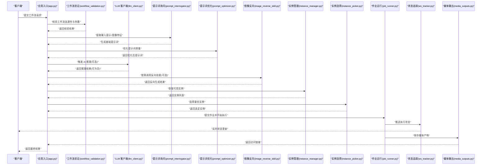
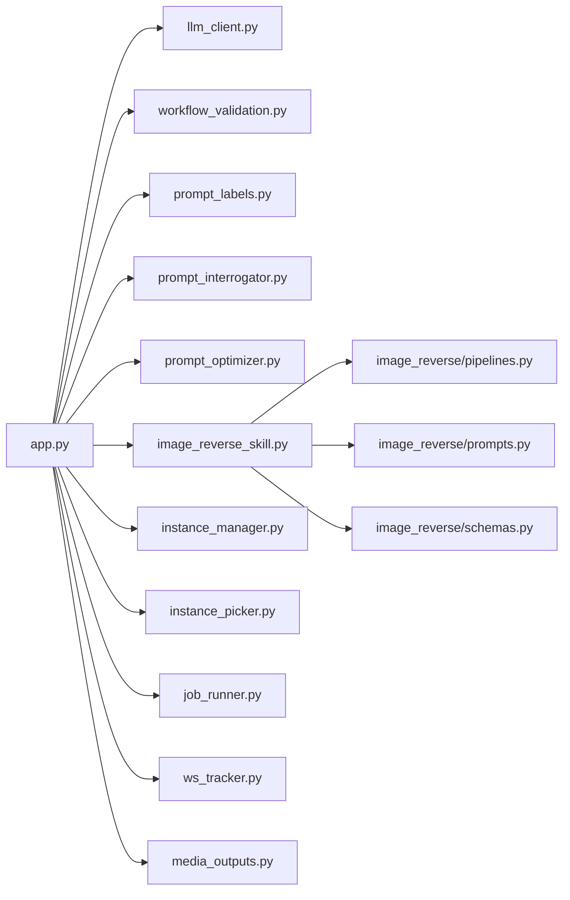

# 工作流 AI 集成

<cite>
**本文引用的文件**
- [app.py](file://app.py)
- [modules/llm_client.py](file://modules/llm_client.py)
- [modules/workflow_validation.py](file://modules/workflow_validation.py)
- [modules/prompt_labels.py](file://modules/prompt_labels.py)
- [modules/prompt_interrogator.py](file://modules/prompt_interrogator.py)
- [modules/prompt_optimizer.py](file://modules/prompt_optimizer.py)
- [modules/image_reverse_skill.py](file://modules/image_reverse_skill.py)
- [modules/image_reverse/pipelines.py](file://modules/image_reverse/pipelines.py)
- [modules/image_reverse/prompts.py](file://modules/image_reverse/prompts.py)
- [modules/image_reverse/schemas.py](file://modules/image_reverse/schemas.py)
- [modules/instance_manager.py](file://modules/instance_manager.py)
- [modules/instance_picker.py](file://modules/instance_picker.py)
- [modules/job_runner.py](file://modules/job_runner.py)
- [modules/ws_tracker.py](file://modules/ws_tracker.py)
- [modules/media_outputs.py](file://modules/media_outputs.py)
- [data/wf_meta.json](file://data/wf_meta.json)
- [data/wf_configs/](file://data/wf_configs/)
- [docs/system-workflows/](file://docs/system-workflows/)
- [scripts/gen_wf_configs.py](file://scripts/gen_wf_configs.py)
</cite>

## 目录
1. [简介](#简介)
2. [项目结构](#项目结构)
3. [核心组件](#核心组件)
4. [架构总览](#架构总览)
5. [详细组件分析](#详细组件分析)
6. [依赖关系分析](#依赖关系分析)
7. [性能考虑](#性能考虑)
8. [故障排查指南](#故障排查指南)
9. [结论](#结论)
10. [附录](#附录)

## 简介
本文件面向工作流中的 AI 功能集成，围绕提示词标签管理、工作流验证、AI 功能触发、参数注入与动态配置、条件执行、混合执行（AI 与传统工作流）、状态同步与错误处理、模板配置与最佳实践、以及性能优化与运维监控等方面，提供系统化接口文档与实现参考。文档以仓库现有模块与数据结构为基础，结合实际文件路径进行说明，帮助开发者快速理解并扩展工作流 AI 能力。

## 项目结构
该工程采用“模块化功能 + 数据配置”的组织方式：核心应用入口负责路由与调度；各功能模块封装具体能力（如 LLM 客户端、提示词处理、工作流校验、实例管理、作业执行等）；data 目录存放工作流元数据与配置模板；docs 提供系统级工作流规范；scripts 提供生成与导入工具。

```mermaid
graph TB
A["应用入口<br/>app.py"] --> B["LLM 客户端<br/>modules/llm_client.py"]
A --> C["工作流验证<br/>modules/workflow_validation.py"]
A --> D["提示词标签管理<br/>modules/prompt_labels.py"]
A --> E["提示词询问器<br/>modules/prompt_interrogator.py"]
A --> F["提示词优化器<br/>modules/prompt_optimizer.py"]
A --> G["图像反向技能<br/>modules/image_reverse_skill.py"]
G --> G1["反向流水线<br/>modules/image_reverse/pipelines.py"]
G --> G2["反向提示词<br/>modules/image_reverse/prompts.py"]
G --> G3["反向模式定义<br/>modules/image_reverse/schemas.py"]
A --> H["实例管理<br/>modules/instance_manager.py"]
A --> I["实例选择器<br/>modules/instance_picker.py"]
A --> J["作业运行器<br/>modules/job_runner.py"]
A --> K["WebSocket 追踪<br/>modules/ws_tracker.py"]
A --> L["媒体输出<br/>modules/media_outputs.py"]
A --> M["工作流元数据<br/>data/wf_meta.json"]
A --> N["工作流配置模板<br/>data/wf_configs/*.json"]
A --> O["系统工作流规范<br/>docs/system-workflows/*.api.json"]
A --> P["配置生成脚本<br/>scripts/gen_wf_configs.py"]
```

图表来源
- [app.py](file://app.py)
- [modules/llm_client.py](file://modules/llm_client.py)
- [modules/workflow_validation.py](file://modules/workflow_validation.py)
- [modules/prompt_labels.py](file://modules/prompt_labels.py)
- [modules/prompt_interrogator.py](file://modules/prompt_interrogator.py)
- [modules/prompt_optimizer.py](file://modules/prompt_optimizer.py)
- [modules/image_reverse_skill.py](file://modules/image_reverse_skill.py)
- [modules/image_reverse/pipelines.py](file://modules/image_reverse/pipelines.py)
- [modules/image_reverse/prompts.py](file://modules/image_reverse/prompts.py)
- [modules/image_reverse/schemas.py](file://modules/image_reverse/schemas.py)
- [modules/instance_manager.py](file://modules/instance_manager.py)
- [modules/instance_picker.py](file://modules/instance_picker.py)
- [modules/job_runner.py](file://modules/job_runner.py)
- [modules/ws_tracker.py](file://modules/ws_tracker.py)
- [modules/media_outputs.py](file://modules/media_outputs.py)
- [data/wf_meta.json](file://data/wf_meta.json)
- [data/wf_configs/](file://data/wf_configs/)
- [docs/system-workflows/](file://docs/system-workflows/)
- [scripts/gen_wf_configs.py](file://scripts/gen_wf_configs.py)

章节来源
- [app.py](file://app.py)
- [data/wf_meta.json](file://data/wf_meta.json)
- [data/wf_configs/](file://data/wf_configs/)
- [docs/system-workflows/](file://docs/system-workflows/)
- [scripts/gen_wf_configs.py](file://scripts/gen_wf_configs.py)

## 核心组件
- LLM 客户端：封装外部大模型调用，支持消息格式化、流式响应与错误重试策略。
- 工作流验证：对工作流节点连通性、参数合法性、必要节点存在性进行检查。
- 提示词标签管理：维护标签集合、标签过滤与关联规则，支撑提示词的分类与检索。
- 提示词询问器：从输入图像或文本中抽取关键语义特征，生成可执行的提示词。
- 提示词优化器：基于规则或模型反馈对提示词进行改写与增强。
- 图像反向技能：面向特定任务的反向生成流程，包含流水线、提示词与模式定义。
- 实例管理与选择器：管理可用计算实例、负载均衡与实例池调度。
- 作业运行器：编排工作流执行，协调节点间数据传递与状态更新。
- WebSocket 追踪：提供实时状态推送与事件通知。
- 媒体输出：统一处理生成结果的存储、缩略图与访问链接。

章节来源
- [modules/llm_client.py](file://modules/llm_client.py)
- [modules/workflow_validation.py](file://modules/workflow_validation.py)
- [modules/prompt_labels.py](file://modules/prompt_labels.py)
- [modules/prompt_interrogator.py](file://modules/prompt_interrogator.py)
- [modules/prompt_optimizer.py](file://modules/prompt_optimizer.py)
- [modules/image_reverse_skill.py](file://modules/image_reverse_skill.py)
- [modules/image_reverse/pipelines.py](file://modules/image_reverse/pipelines.py)
- [modules/image_reverse/prompts.py](file://modules/image_reverse/prompts.py)
- [modules/image_reverse/schemas.py](file://modules/image_reverse/schemas.py)
- [modules/instance_manager.py](file://modules/instance_manager.py)
- [modules/instance_picker.py](file://modules/instance_picker.py)
- [modules/job_runner.py](file://modules/job_runner.py)
- [modules/ws_tracker.py](file://modules/ws_tracker.py)
- [modules/media_outputs.py](file://modules/media_outputs.py)

## 架构总览
下图展示从请求到执行再到状态回传的整体链路，涵盖 AI 功能触发、参数注入、动态配置与混合执行的关键节点。

图表来源
- [app.py](file://app.py)
- [modules/workflow_validation.py](file://modules/workflow_validation.py)
- [modules/prompt_interrogator.py](file://modules/prompt_interrogator.py)
- [modules/prompt_optimizer.py](file://modules/prompt_optimizer.py)
- [modules/llm_client.py](file://modules/llm_client.py)
- [modules/image_reverse_skill.py](file://modules/image_reverse_skill.py)
- [modules/instance_manager.py](file://modules/instance_manager.py)
- [modules/instance_picker.py](file://modules/instance_picker.py)
- [modules/job_runner.py](file://modules/job_runner.py)
- [modules/ws_tracker.py](file://modules/ws_tracker.py)
- [modules/media_outputs.py](file://modules/media_outputs.py)

## 详细组件分析

### 提示词标签管理
- 功能职责：维护标签集合、标签过滤与关联规则，支持在工作流中按标签选择节点或参数。
- 关键接口与行为：
  - 标签集合维护：新增、删除、批量导入导出标签。
  - 标签过滤：根据标签集合筛选节点或参数，支持 AND/OR 组合。
  - 标签与提示词绑定：将标签附加到提示词条目，便于检索与复用。
- 复杂度与性能：标签过滤通常为 O(n) 遍历，建议对常用标签建立索引以降低查询成本。
- 错误处理：重复标签名冲突、非法字符、空标签等场景需抛出明确异常并记录上下文。

章节来源
- [modules/prompt_labels.py](file://modules/prompt_labels.py)

### 工作流验证
- 功能职责：在提交执行前对工作流进行静态分析，确保节点连通、参数合法、必要节点存在。
- 关键接口与行为：
  - 连通性检查：从起始节点深度遍历，检测断点与环路。
  - 参数合法性：校验必填字段、类型匹配、范围约束。
  - 必要节点存在性：针对 AI 触发或反向技能，检查相关节点是否存在。
- 复杂度与性能：遍历复杂度近似 O(V+E)，建议缓存中间结果以提升批量校验效率。
- 错误处理：对缺失节点、参数类型不匹配、循环依赖等情况返回结构化错误信息。

章节来源
- [modules/workflow_validation.py](file://modules/workflow_validation.py)

### AI 功能触发（LLM 客户端）
- 功能职责：封装外部大模型调用，支持消息格式化、流式响应与错误重试。
- 关键接口与行为：
  - 消息构建：将提示词、历史对话、系统指令组装为模型输入。
  - 流式输出：按块推送生成内容，便于前端实时渲染。
  - 错误重试：网络异常、服务不可达时自动重试并记录日志。
- 复杂度与性能：流式输出避免一次性内存峰值；重试策略应指数退避并设置上限。
- 错误处理：区分可恢复与不可恢复错误，对不可恢复错误及时中断并上报。

章节来源
- [modules/llm_client.py](file://modules/llm_client.py)

### 提示词询问与优化
- 功能职责：从输入中抽取语义特征并生成/优化提示词，为后续节点提供高质量输入。
- 关键接口与行为：
  - 询问器：支持图像描述、文本摘要、关键词抽取等。
  - 优化器：基于规则或反馈迭代优化提示词，提升生成质量。
- 复杂度与性能：询问与优化过程可能引入额外延迟，建议异步化与缓存热点提示词。
- 错误处理：输入为空、模型返回异常、格式不符等情况需降级处理。

章节来源
- [modules/prompt_interrogator.py](file://modules/prompt_interrogator.py)
- [modules/prompt_optimizer.py](file://modules/prompt_optimizer.py)

### 图像反向技能
- 功能职责：面向特定任务的反向生成流程，包含流水线、提示词与模式定义。
- 关键接口与行为：
  - 流水线执行：按预设步骤串联节点，支持参数注入与条件跳过。
  - 提示词与模式：定义输入输出格式与约束，保证与上游/下游兼容。
- 复杂度与性能：流水线长度与节点复杂度决定整体耗时，建议分段执行与并发优化。
- 错误处理：节点失败时回滚至最近稳定状态或跳过非关键步骤。

章节来源
- [modules/image_reverse_skill.py](file://modules/image_reverse_skill.py)
- [modules/image_reverse/pipelines.py](file://modules/image_reverse/pipelines.py)
- [modules/image_reverse/prompts.py](file://modules/image_reverse/prompts.py)
- [modules/image_reverse/schemas.py](file://modules/image_reverse/schemas.py)

### 实例管理与选择
- 功能职责：管理可用计算实例、负载均衡与实例池调度，保障执行稳定性与吞吐。
- 关键接口与行为：
  - 实例注册与健康检查：动态发现与剔除异常实例。
  - 选择策略：基于负载、距离、优先级等维度选择最优实例。
- 复杂度与性能：选择算法复杂度低，但需要持续监控实例状态以保持准确性。
- 错误处理：实例不可用时自动切换备用实例并记录切换原因。

章节来源
- [modules/instance_manager.py](file://modules/instance_manager.py)
- [modules/instance_picker.py](file://modules/instance_picker.py)

### 作业运行与状态同步
- 功能职责：编排工作流执行，协调节点间数据传递与状态更新，通过 WebSocket 推送实时状态。
- 关键接口与行为：
  - 执行编排：按拓扑顺序执行节点，支持条件分支与并行聚合。
  - 状态同步：将进度、日志、错误码等写入追踪系统并向客户端广播。
- 复杂度与性能：编排复杂度取决于节点数量与依赖关系；建议分片执行与增量状态持久化。
- 错误处理：节点超时、内存不足、模型异常等均需捕获并进入容错流程。

章节来源
- [modules/job_runner.py](file://modules/job_runner.py)
- [modules/ws_tracker.py](file://modules/ws_tracker.py)

### 媒体输出与访问
- 功能职责：统一处理生成结果的存储、缩略图与访问链接，支持多格式导出。
- 关键接口与行为：
  - 存储策略：本地/对象存储，支持压缩与去重。
  - 访问链接：生成短期有效链接，支持鉴权与权限控制。
- 复杂度与性能：I/O 密集，建议异步写入与批量上传。
- 错误处理：存储失败、链接生成异常时回退至本地副本或占位资源。

章节来源
- [modules/media_outputs.py](file://modules/media_outputs.py)

### 工作流参数注入与动态配置
- 参数注入：在工作流执行前，将提示词、标签、实例选择结果、时间戳等动态参数注入到目标节点。
- 动态配置：根据工作流模板与用户输入，动态启用/禁用节点、调整权重与阈值。
- 条件执行：基于前置节点输出或外部条件（如标签匹配、阈值判断）决定是否执行某分支。
- 最佳实践：参数命名规范化、默认值清晰、注入点集中管理、配置变更可审计。

章节来源
- [app.py](file://app.py)
- [modules/workflow_validation.py](file://modules/workflow_validation.py)
- [modules/prompt_labels.py](file://modules/prompt_labels.py)
- [modules/instance_picker.py](file://modules/instance_picker.py)

### 混合执行（AI 与传统工作流）
- 混合策略：在传统节点之间插入 AI 触发点（询问/优化/推理/反向），形成“AI 增强型”工作流。
- 状态同步：AI 步骤的中间结果与最终结果均通过追踪系统广播，保证 UI 与后端一致。
- 错误处理：AI 步骤失败不影响后续传统步骤，或可回退至安全路径。
- 性能优化：对 AI 步骤进行缓存与批量化，减少重复调用。

章节来源
- [app.py](file://app.py)
- [modules/llm_client.py](file://modules/llm_client.py)
- [modules/prompt_interrogator.py](file://modules/prompt_interrogator.py)
- [modules/prompt_optimizer.py](file://modules/prompt_optimizer.py)
- [modules/image_reverse_skill.py](file://modules/image_reverse_skill.py)
- [modules/ws_tracker.py](file://modules/ws_tracker.py)

### 工作流模板配置与最佳实践
- 模板结构：模板文件位于数据目录，包含节点定义、参数默认值、标签与条件分支。
- 配置生成：通过脚本自动生成/导入模板，确保一致性与可追溯性。
- 最佳实践：
  - 明确 AI 步骤边界，避免过度耦合。
  - 使用标签驱动的条件执行，提高灵活性。
  - 对关键节点设置超时与重试，增强鲁棒性。
  - 将媒体输出与访问链接标准化，便于集成。

章节来源
- [data/wf_meta.json](file://data/wf_meta.json)
- [data/wf_configs/](file://data/wf_configs/)
- [docs/system-workflows/](file://docs/system-workflows/)
- [scripts/gen_wf_configs.py](file://scripts/gen_wf_configs.py)

## 依赖关系分析
- 模块内聚：各功能模块职责清晰，提示词相关模块独立于执行引擎，便于替换与扩展。
- 模块耦合：应用入口作为编排中心，向上游模块发起调用，向下通过追踪与输出模块完成闭环。
- 外部依赖：LLM 客户端依赖外部服务；实例管理依赖底层资源池；媒体输出依赖存储服务。
- 循环依赖：未见明显循环依赖，但需注意在新增模块时避免跨层引用。

图表来源
- [app.py](file://app.py)
- [modules/llm_client.py](file://modules/llm_client.py)
- [modules/workflow_validation.py](file://modules/workflow_validation.py)
- [modules/prompt_labels.py](file://modules/prompt_labels.py)
- [modules/prompt_interrogator.py](file://modules/prompt_interrogator.py)
- [modules/prompt_optimizer.py](file://modules/prompt_optimizer.py)
- [modules/image_reverse_skill.py](file://modules/image_reverse_skill.py)
- [modules/image_reverse/pipelines.py](file://modules/image_reverse/pipelines.py)
- [modules/image_reverse/prompts.py](file://modules/image_reverse/prompts.py)
- [modules/image_reverse/schemas.py](file://modules/image_reverse/schemas.py)
- [modules/instance_manager.py](file://modules/instance_manager.py)
- [modules/instance_picker.py](file://modules/instance_picker.py)
- [modules/job_runner.py](file://modules/job_runner.py)
- [modules/ws_tracker.py](file://modules/ws_tracker.py)
- [modules/media_outputs.py](file://modules/media_outputs.py)

章节来源
- [app.py](file://app.py)
- [modules/llm_client.py](file://modules/llm_client.py)
- [modules/workflow_validation.py](file://modules/workflow_validation.py)
- [modules/prompt_labels.py](file://modules/prompt_labels.py)
- [modules/prompt_interrogator.py](file://modules/prompt_interrogator.py)
- [modules/prompt_optimizer.py](file://modules/prompt_optimizer.py)
- [modules/image_reverse_skill.py](file://modules/image_reverse_skill.py)
- [modules/image_reverse/pipelines.py](file://modules/image_reverse/pipelines.py)
- [modules/image_reverse/prompts.py](file://modules/image_reverse/prompts.py)
- [modules/image_reverse/schemas.py](file://modules/image_reverse/schemas.py)
- [modules/instance_manager.py](file://modules/instance_manager.py)
- [modules/instance_picker.py](file://modules/instance_picker.py)
- [modules/job_runner.py](file://modules/job_runner.py)
- [modules/ws_tracker.py](file://modules/ws_tracker.py)
- [modules/media_outputs.py](file://modules/media_outputs.py)

## 性能考虑
- 缓存策略：对热点提示词、标签过滤结果、实例选择决策进行缓存，降低重复计算。
- 异步化：将 I/O 密集与长耗时步骤（如模型推理、媒体存储）异步化，提升吞吐。
- 并行执行：在满足依赖的前提下对无冲突节点进行并行执行，缩短总时延。
- 资源控制：限制并发数、内存占用与超时时间，防止资源枯竭；对失败节点进行隔离与降级。
- 监控告警：通过追踪系统收集关键指标（成功率、时延、错误分布），设置阈值告警。

## 故障排查指南
- 工作流验证失败：检查节点连通性、参数类型与必填项；查看校验返回的详细错误。
- AI 推理异常：确认模型服务可用性、输入格式正确性与重试策略生效。
- 实例选择失败：检查实例池状态与负载情况，确认选择策略参数合理。
- 媒体输出异常：核对存储配置与权限，检查链接生成逻辑与访问策略。
- 状态不同步：检查 WebSocket 连接与追踪系统日志，定位推送失败环节。

章节来源
- [modules/workflow_validation.py](file://modules/workflow_validation.py)
- [modules/llm_client.py](file://modules/llm_client.py)
- [modules/instance_picker.py](file://modules/instance_picker.py)
- [modules/media_outputs.py](file://modules/media_outputs.py)
- [modules/ws_tracker.py](file://modules/ws_tracker.py)

## 结论
本项目通过模块化设计实现了工作流与 AI 能力的有机融合：提示词标签管理与优化为 AI 输入提供高质量基础；工作流验证与实例调度保障执行稳定性；WebSocket 追踪与媒体输出完善了状态与产物管理。遵循本文的最佳实践与接口规范，可在不破坏现有架构的前提下，持续扩展与优化 AI 驱动的工作流能力。

## 附录
- 模板生成脚本：用于批量生成/导入工作流配置，建议在 CI 中自动化执行以保证一致性。
- 系统工作流规范：提供标准 API 定义与示例，便于第三方集成与扩展。

章节来源
- [scripts/gen_wf_configs.py](file://scripts/gen_wf_configs.py)
- [docs/system-workflows/](file://docs/system-workflows/)