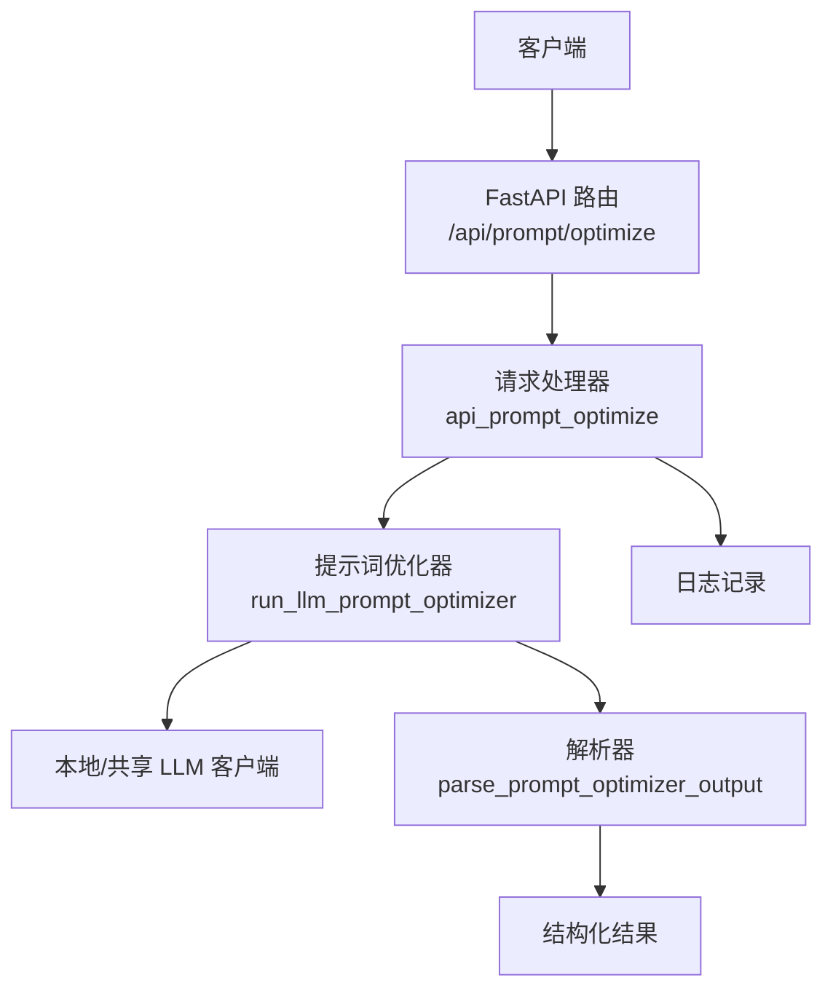
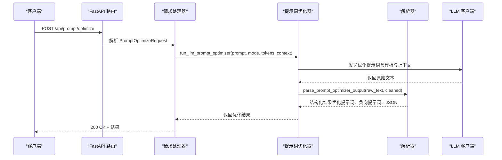
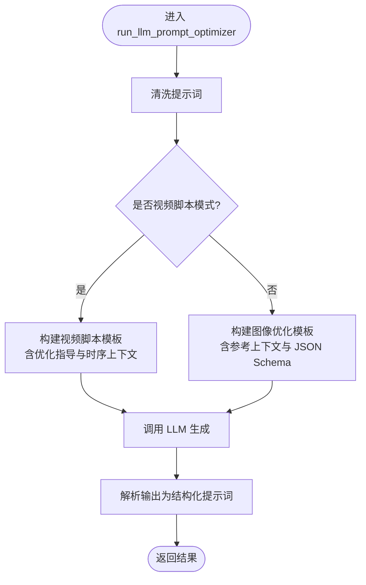
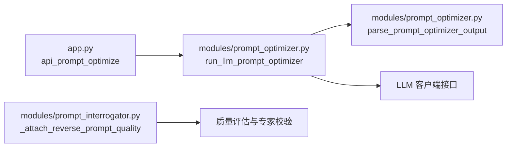

# 提示词优化 API

<cite>
**本文引用的文件**
- [app.py](file://app.py)
- [prompt_optimizer.py](file://modules/prompt_optimizer.py)
- [prompt_interrogator.py](file://modules/prompt_interrogator.py)
- [test_prompt_optimizer.py](file://tests/test_prompt_optimizer.py)
- [SPECIFICATION.md](file://docs/SPECIFICATION.md)
</cite>

## 目录
1. [简介](#简介)
2. [项目结构](#项目结构)
3. [核心组件](#核心组件)
4. [架构总览](#架构总览)
5. [详细组件分析](#详细组件分析)
6. [依赖关系分析](#依赖关系分析)
7. [性能考虑](#性能考虑)
8. [故障排查指南](#故障排查指南)
9. [结论](#结论)
10. [附录](#附录)

## 简介
本文件为“提示词优化 API”的权威技术文档，覆盖以下能力：
- 提示词增强与润色
- 风格转换与内容优化
- 多轮对话优化与上下文管理
- 领域特定优化（图像与视频脚本）
- 提示词质量评估与专家校验
- 与 LLM 客户端的集成方式与最佳实践

文档基于仓库中的实际实现进行编写，确保接口定义、参数约束、返回结构、错误处理与调用流程均以源码为准。

## 项目结构
与提示词优化相关的后端实现主要分布在以下模块：
- 应用入口与路由：app.py
- 提示词优化器：modules/prompt_optimizer.py
- 图像反推与质量评估：modules/prompt_interrogator.py
- 接口规范与 API 列表：docs/SPECIFICATION.md
- 单元测试与行为验证：tests/test_prompt_optimizer.py

图表来源
- [app.py:7302-7328](file://app.py#L7302-L7328)
- [prompt_optimizer.py:1224-1671](file://modules/prompt_optimizer.py#L1224-L1671)

章节来源
- [SPECIFICATION.md:578-584](file://docs/SPECIFICATION.md#L578-L584)
- [app.py:7302-7328](file://app.py#L7302-L7328)

## 核心组件
- FastAPI 路由与请求模型
  - 路由：POST /api/prompt/optimize
  - 请求模型：PromptOptimizeRequest（包含 prompt、mode、max_new_tokens、prompt_context 等字段）
- 提示词优化器
  - run_llm_prompt_optimizer：执行优化流程，支持图像与视频脚本两种模式
  - parse_prompt_optimizer_output：解析 LLM 输出，生成结构化提示词与 JSON
- 日志与错误处理
  - 统一捕获超时与运行时异常，并返回标准 HTTP 错误码
- 质量评估与专家校验
  - 反推质量附加函数：_attach_reverse_prompt_quality
  - 结合专家结果与视觉证据进行质量报告

章节来源
- [app.py:6209](file://app.py#L6209)
- [app.py:7302-7328](file://app.py#L7302-L7328)
- [prompt_optimizer.py:851-879](file://modules/prompt_optimizer.py#L851-L879)
- [prompt_optimizer.py:1224-1671](file://modules/prompt_optimizer.py#L1224-L1671)
- [prompt_interrogator.py:4139-4159](file://modules/prompt_interrogator.py#L4139-L4159)

## 架构总览
提示词优化 API 的端到端调用链如下：

图表来源
- [app.py:7302-7328](file://app.py#L7302-L7328)
- [prompt_optimizer.py:1224-1671](file://modules/prompt_optimizer.py#L1224-L1671)
- [prompt_optimizer.py:851-879](file://modules/prompt_optimizer.py#L851-L879)

## 详细组件分析

### API：提示词优化（POST /api/prompt/optimize）
- 功能概述
  - 对用户输入的自然语言提示词进行清洗、增强与结构化输出
  - 支持图像与视频脚本两种模式；视频脚本模式可传入时序上下文
- 请求路径
  - POST /api/prompt/optimize
- 认证与权限
  - 使用当前登录用户上下文（依赖认证中间件）
- 请求体（PromptOptimizeRequest）
  - 字段
    - prompt: 字符串，必填，用户输入的提示词
    - mode: 字符串，可选，默认 image；支持 video、video_script、script 识别为视频脚本模式
    - max_new_tokens: 整数，可选，控制 LLM 生成长度（范围限制在 96~4096）
    - prompt_context: 对象，可选，仅在视频脚本模式下生效，包含时序与帧率等上下文
- 响应体（优化结果）
  - ok: 布尔值，成功标志
  - provider: 字符串，提供者标识
  - original_prompt: 字符串，原始提示词
  - cleaned_prompt: 字符串，清洗后的提示词
  - optimized_prompt: 字符串，优化后的提示词
  - negative_prompt: 字符串，负向提示词（如存在）
  - structured_prompt: 对象，结构化提示词（包含主题、风格、细节等键）
  - structured_prompt_json: 字符串，结构化提示词的 JSON 字符串
  - prompt_mode: 字符串，最终使用的模式（image 或 video_script）
  - instance: 字符串，实例标识（固定为 LLM）
- 错误处理
  - 400：prompt 为空
  - 504：优化超时（默认超时 300 秒）
  - 500：其他运行时错误
- 调用示例（路径）
  - 成功场景：参见单元测试中对 api_prompt_optimize 的断言与构造
    - [tests/test_prompt_optimizer.py:691-727](file://tests/test_prompt_optimizer.py#L691-L727)
  - 视频脚本模式：参见单元测试中对视频脚本模式的断言与构造
    - [tests/test_prompt_optimizer.py:729-767](file://tests/test_prompt_optimizer.py#L729-L767)

章节来源
- [SPECIFICATION.md:582](file://docs/SPECIFICATION.md#L582)
- [app.py:6209](file://app.py#L6209)
- [app.py:7302-7328](file://app.py#L7302-L7328)
- [tests/test_prompt_optimizer.py:691-767](file://tests/test_prompt_optimizer.py#L691-L767)

### 提示词优化器（run_llm_prompt_optimizer）
- 功能概述
  - 清洗用户提示词
  - 根据模式选择模板（图像或视频脚本）
  - 控制生成长度与温度
  - 调用 LLM 并解析输出
- 关键参数
  - prompt: 输入提示词
  - chat_fn: LLM 聊天接口（默认 chat_text）
  - timeout: 超时时间（秒）
  - max_new_tokens: 最大新 token 数（96~4096）
  - prompt_mode: 模式（image 或 video_script）
  - prompt_context: 视频脚本上下文（时长、帧率等）
  - model: 指定模型（可选）
- 输出结构
  - 包含上述“响应体”字段
  - 若 ComfyUI 流水线完成但未产出文本，将抛出运行时错误
- 超时与错误
  - 超时抛出 TimeoutError，统一映射为 504
  - 运行时错误映射为 500

图表来源
- [prompt_optimizer.py:1224-1671](file://modules/prompt_optimizer.py#L1224-L1671)

章节来源
- [prompt_optimizer.py:1224-1671](file://modules/prompt_optimizer.py#L1224-L1671)

### 解析器（parse_prompt_optimizer_output）
- 功能概述
  - 将 LLM 输出标准化
  - 提取结构化提示词对象与 JSON
  - 优先使用结构化提示词生成纯文本版本（若更丰富则回退到优化文本）
- 输出字段
  - optimized_prompt、negative_prompt、structured_prompt、structured_prompt_json

章节来源
- [prompt_optimizer.py:851-879](file://modules/prompt_optimizer.py#L851-L879)

### 图像反推质量评估与专家校验
- 功能概述
  - 在反推结果上附加质量报告
  - 可选专家结果与视觉证据参与评估
- 关键函数
  - _attach_reverse_prompt_quality：将质量报告写入结果与专家数据
- 适用场景
  - 图像反推后对提示词质量进行评估与可视化证据标注

章节来源
- [prompt_interrogator.py:4139-4159](file://modules/prompt_interrogator.py#L4139-L4159)

## 依赖关系分析
- 路由层依赖
  - app.py 的 api_prompt_optimize 路由依赖 PromptOptimizeRequest 模型与 run_llm_prompt_optimizer
- 优化器依赖
  - run_llm_prompt_optimizer 依赖 LLM 客户端接口（chat_text）、模板与解析器
- 解析器依赖
  - parse_prompt_optimizer_output 依赖内部规范化与提取逻辑
- 质量评估依赖
  - _attach_reverse_prompt_quality 依赖 validate_reverse_prompt_quality 与图像尺寸信息

图表来源
- [app.py:7302-7328](file://app.py#L7302-L7328)
- [prompt_optimizer.py:1224-1671](file://modules/prompt_optimizer.py#L1224-L1671)
- [prompt_optimizer.py:851-879](file://modules/prompt_optimizer.py#L851-L879)
- [prompt_interrogator.py:4139-4159](file://modules/prompt_interrogator.py#L4139-L4159)

章节来源
- [app.py:7302-7328](file://app.py#L7302-L7328)
- [prompt_optimizer.py:1224-1671](file://modules/prompt_optimizer.py#L1224-L1671)
- [prompt_optimizer.py:851-879](file://modules/prompt_optimizer.py#L851-L879)
- [prompt_interrogator.py:4139-4159](file://modules/prompt_interrogator.py#L4139-L4159)

## 性能考虑
- 生成长度控制
  - max_new_tokens 限制在 96~4096，避免过长生成导致延迟与成本上升
- 超时策略
  - 默认超时 300 秒；根据任务复杂度适当调整
- 模板与上下文
  - 视频脚本模式需提供 prompt_context（时长、帧率），有助于减少无效生成
- LLM 选择
  - 通过 model 参数指定模型；在稳定性和速度间权衡
- 日志与可观测性
  - 统一记录错误与成功事件，便于定位慢查询与失败原因

## 故障排查指南
- 常见错误与处理
  - 400：prompt 为空 → 检查前端输入与序列化
  - 504：优化超时 → 增加 timeout、降低 max_new_tokens、检查 LLM 服务可用性
  - 500：运行时错误 → 查看日志中的错误消息，确认 LLM 返回格式与解析器兼容性
- 日志定位
  - 错误与成功日志均会记录 provider 与用户信息，便于审计
- 单元测试参考
  - 通过测试用例验证请求构造、模式切换与结果字段一致性

章节来源
- [app.py:7302-7328](file://app.py#L7302-L7328)
- [tests/test_prompt_optimizer.py:691-767](file://tests/test_prompt_optimizer.py#L691-L767)

## 结论
提示词优化 API 通过清晰的请求模型、稳定的解析器与完善的错误处理，实现了从自然语言到结构化提示词的高质量转换。结合视频脚本模式与上下文，可满足多模态生成场景的需求。建议在生产环境中配合合理的超时与长度限制、完善的日志与监控，以及专家质量评估流程，持续提升提示词质量与用户体验。

## 附录

### API 定义与调用示例
- 路由与方法
  - POST /api/prompt/optimize
- 请求体字段
  - prompt: 字符串，必填
  - mode: 字符串，可选（image/video_script/script）
  - max_new_tokens: 整数，可选（96~4096）
  - prompt_context: 对象，可选（视频脚本模式）
- 响应体字段
  - 见“核心组件”中的“响应体（优化结果）”
- 调用示例（路径）
  - 图像优化示例：[tests/test_prompt_optimizer.py:691-727](file://tests/test_prompt_optimizer.py#L691-L727)
  - 视频脚本优化示例：[tests/test_prompt_optimizer.py:729-767](file://tests/test_prompt_optimizer.py#L729-L767)

章节来源
- [SPECIFICATION.md:582](file://docs/SPECIFICATION.md#L582)
- [tests/test_prompt_optimizer.py:691-767](file://tests/test_prompt_optimizer.py#L691-L767)