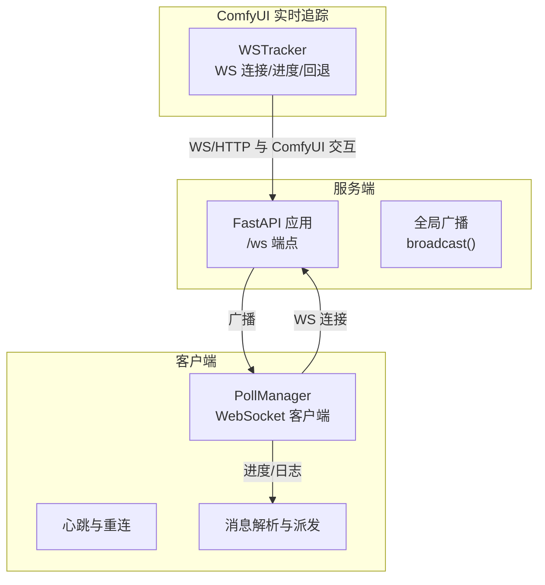
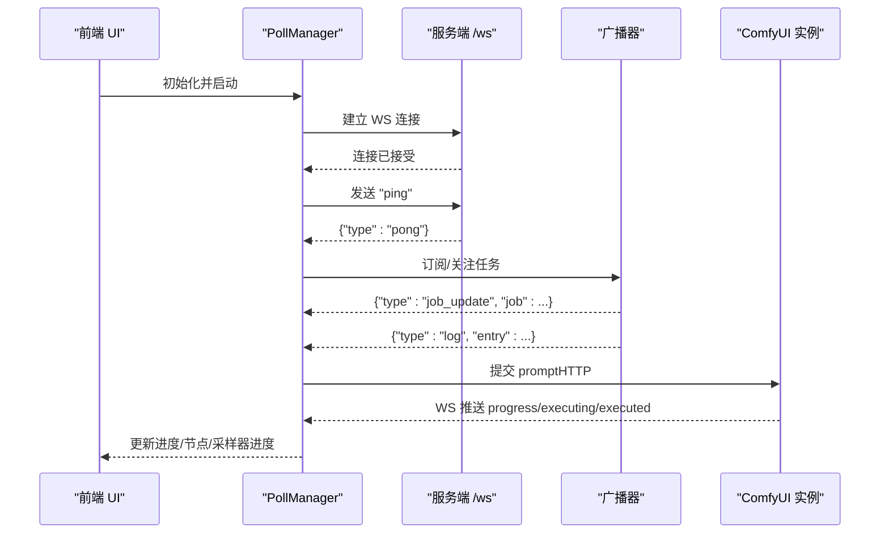
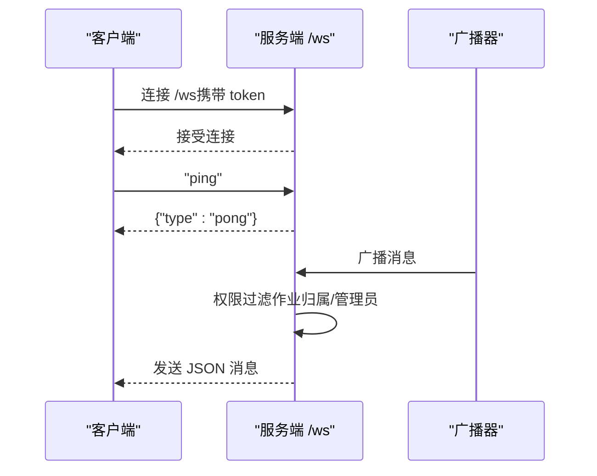
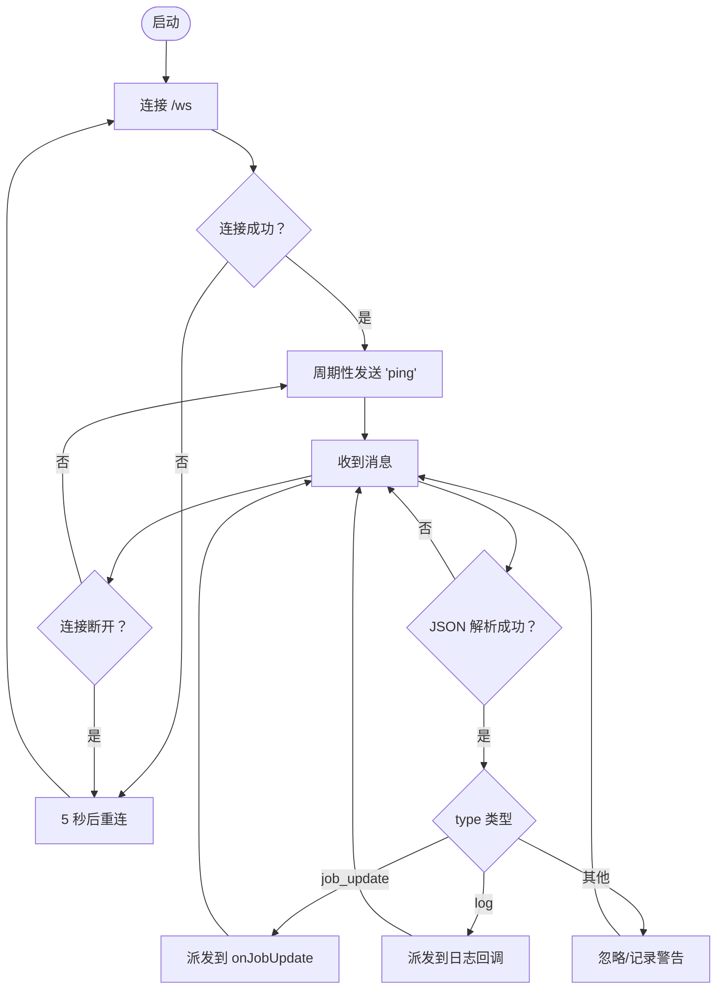
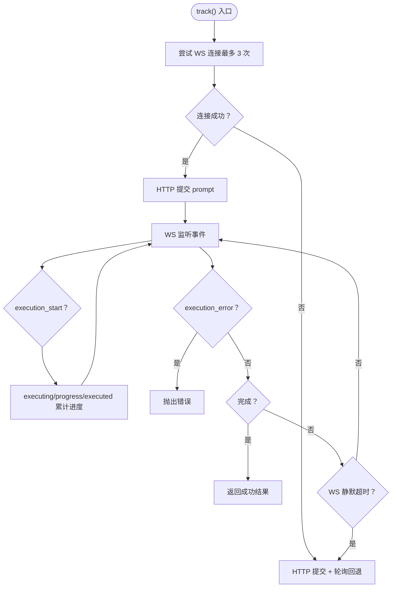
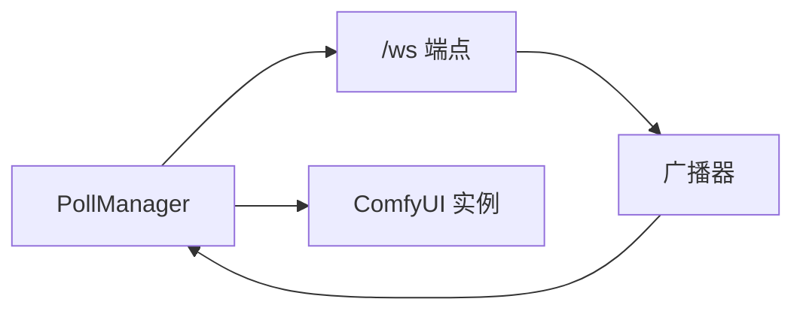

# WebSocket API

<cite>
**本文引用的文件**
- [app.py](file://app.py)
- [ws_tracker.py](file://modules/ws_tracker.py)
- [poll_manager.js](file://static/js/modules/poll_manager.js)
</cite>

## 目录
1. [引言](#引言)
2. [项目结构](#项目结构)
3. [核心组件](#核心组件)
4. [架构总览](#架构总览)
5. [详细组件分析](#详细组件分析)
6. [依赖分析](#依赖分析)
7. [性能考虑](#性能考虑)
8. [故障排查指南](#故障排查指南)
9. [结论](#结论)
10. [附录](#附录)

## 引言
本文件为 Ez ComfyUI Showcase 的 WebSocket 实时通信 API 协议文档，覆盖连接建立、消息格式、事件类型、状态同步、客户端连接管理、心跳与断线重连策略、进度跟踪、状态广播、日志推送、订阅与权限控制、事件生命周期、错误处理与性能优化等主题，并提供客户端集成示例与调试工具使用指南。本文严格基于仓库中的实际实现进行说明，避免臆测。

## 项目结构
与 WebSocket 相关的关键位置如下：
- 服务端 WebSocket 端点与广播：位于应用主文件中，提供 /ws 端点与全局广播能力。
- 客户端 WebSocket 客户端：位于前端模块中，负责连接、心跳、消息解析与断线重连。
- ComfyUI 实时追踪器：位于模块文件中，负责与 ComfyUI 实例的 WebSocket 交互、进度计算与 HTTP 回退。

图表来源
- [app.py:8805-8824](file://app.py#L8805-L8824)
- [poll_manager.js:16-58](file://static/js/modules/poll_manager.js#L16-L58)
- [ws_tracker.py:160-406](file://modules/ws_tracker.py#L160-L406)

章节来源
- [app.py:8805-8824](file://app.py#L8805-L8824)
- [poll_manager.js:16-58](file://static/js/modules/poll_manager.js#L16-L58)
- [ws_tracker.py:160-406](file://modules/ws_tracker.py#L160-L406)

## 核心组件
- 服务端 WebSocket 端点与广播
  - 端点：/ws，支持从 Cookie 或查询参数中提取令牌以识别用户，接受连接后维护客户端列表与用户映射。
  - 心跳：客户端发送 "ping" 文本，服务端返回 {"type":"pong"} JSON。
  - 广播：按用户权限过滤后向在线客户端推送 JSON 消息。
- 客户端 WebSocket 客户端（PollManager）
  - 自动连接 /ws，解析消息类型，派发到 onJobUpdate 或日志回调。
  - 心跳：周期性 ping，断线自动重连。
  - 回退：当 WS 不可用时，HTTP 3 秒轮询兜底。
- ComfyUI 实时追踪器（WSTracker）
  - 与 ComfyUI 实例建立 WS 连接，提交 prompt，监听执行事件，计算进度，异常时回退到 HTTP 轮询。

章节来源
- [app.py:8805-8824](file://app.py#L8805-L8824)
- [app.py:5081-5094](file://app.py#L5081-L5094)
- [poll_manager.js:16-58](file://static/js/modules/poll_manager.js#L16-L58)
- [poll_manager.js:175-209](file://static/js/modules/poll_manager.js#L175-L209)
- [ws_tracker.py:160-406](file://modules/ws_tracker.py#L160-L406)

## 架构总览
下图展示从客户端到服务端再到 ComfyUI 实例的完整链路，包括 WS 与 HTTP 回退路径。

图表来源
- [app.py:8805-8824](file://app.py#L8805-L8824)
- [poll_manager.js:175-209](file://static/js/modules/poll_manager.js#L175-L209)
- [ws_tracker.py:282-366](file://modules/ws_tracker.py#L282-L366)

## 详细组件分析

### 服务端 WebSocket 端点与广播
- 连接建立
  - 端点：/ws
  - 认证：从 Cookie 或查询参数中读取令牌，解析为用户上下文并保存到客户端映射。
  - 接受连接后加入在线客户端列表。
- 心跳机制
  - 客户端发送文本 "ping"，服务端返回 JSON {"type":"pong"}。
- 消息广播
  - 广播前对消息进行增强（例如补充来源/时间戳等）。
  - 按消息类型与作业归属进行权限过滤，仅向拥有相应权限的客户端发送。
  - 对发送异常的客户端进行清理（移除离线连接）。

图表来源
- [app.py:8805-8824](file://app.py#L8805-L8824)
- [app.py:5081-5094](file://app.py#L5081-L5094)

章节来源
- [app.py:8805-8824](file://app.py#L8805-L8824)
- [app.py:5081-5094](file://app.py#L5081-L5094)

### 客户端 WebSocket 客户端（PollManager）
- 连接与目标
  - 自动根据页面基地址推导 WS 地址（http/https -> ws/wss），连接 /ws。
- 心跳与断线重连
  - 周期性发送 "ping"，在 onclose/onerror 时延迟 5 秒重连。
- 消息解析与派发
  - 解析 JSON，识别消息类型：
    - job_update：派发到 onJobUpdate 回调。
    - log：派发到日志回调（若存在）。
- 回退机制
  - 当 WS 不可用时，HTTP 3 秒轮询兜底，保持进度与状态可见。

图表来源
- [poll_manager.js:175-209](file://static/js/modules/poll_manager.js#L175-L209)
- [poll_manager.js:41-58](file://static/js/modules/poll_manager.js#L41-L58)

章节来源
- [poll_manager.js:16-58](file://static/js/modules/poll_manager.js#L16-L58)
- [poll_manager.js:175-209](file://static/js/modules/poll_manager.js#L175-L209)

### ComfyUI 实时追踪器（WSTracker）
- 连接与回退
  - 尝试建立 WS 连接（最多 3 次重试），失败则回退到 HTTP 提交与轮询。
- 提交与追踪
  - 通过 HTTP 提交 prompt，获得 prompt_id。
  - 在 WS 上监听执行事件：execution_start、executing、progress、executed、execution_error。
  - 根据节点权重与进度事件累计完成单元，计算百分比。
- 超时与异常
  - 若超过静默阈值或提示未开始执行，则触发回退或超时异常。
  - execution_error 事件直接抛出错误。
- 恢复追踪
  - 支持使用已有 prompt_id 重连 WS，仅恢复事件监听，不重复提交。

图表来源
- [ws_tracker.py:282-366](file://modules/ws_tracker.py#L282-L366)
- [ws_tracker.py:424-564](file://modules/ws_tracker.py#L424-L564)
- [ws_tracker.py:588-631](file://modules/ws_tracker.py#L588-L631)

章节来源
- [ws_tracker.py:160-406](file://modules/ws_tracker.py#L160-L406)
- [ws_tracker.py:282-366](file://modules/ws_tracker.py#L282-L366)
- [ws_tracker.py:424-564](file://modules/ws_tracker.py#L424-L564)
- [ws_tracker.py:588-631](file://modules/ws_tracker.py#L588-L631)

## 依赖分析
- 服务端 /ws 依赖认证上下文与广播过滤逻辑，确保消息只推送给有权看到该作业的用户。
- 客户端 PollManager 依赖服务端 /ws 与心跳协议，同时具备 HTTP 轮询回退能力。
- WSTracker 依赖 ComfyUI 实例的 WS/HTTP 接口，负责进度计算与异常处理。

图表来源
- [app.py:8805-8824](file://app.py#L8805-L8824)
- [poll_manager.js:175-209](file://static/js/modules/poll_manager.js#L175-L209)
- [ws_tracker.py:160-406](file://modules/ws_tracker.py#L160-L406)

章节来源
- [app.py:8805-8824](file://app.py#L8805-L8824)
- [poll_manager.js:175-209](file://static/js/modules/poll_manager.js#L175-L209)
- [ws_tracker.py:160-406](file://modules/ws_tracker.py#L160-L406)

## 性能考虑
- WS 连接重试与退避：WS 连接失败时进行有限次重试，避免频繁抖动。
- WS 静默超时回退：若长时间无消息，自动切换到 HTTP 轮询，保证进度可见性。
- 进度计算优化：基于节点权重与 progress 事件增量累计，避免全量扫描。
- 心跳与断线重连：客户端定期 ping，断线后指数退避重连，降低服务器压力。
- 广播过滤：服务端按作业归属与管理员权限过滤消息，减少无效推送。

章节来源
- [ws_tracker.py:177-188](file://modules/ws_tracker.py#L177-L188)
- [ws_tracker.py:464-507](file://modules/ws_tracker.py#L464-L507)
- [poll_manager.js:175-209](file://static/js/modules/poll_manager.js#L175-L209)
- [app.py:5081-5094](file://app.py#L5081-L5094)

## 故障排查指南
- 无法连接 /ws
  - 检查网络连通性与代理配置。
  - 查看客户端日志中“WS 创建失败”与“WS 错误/关闭”的输出。
  - 确认服务端 /ws 是否正常运行。
- 心跳失效
  - 确认客户端是否持续发送 "ping"。
  - 检查服务端是否返回 {"type":"pong"}。
- 进度不更新
  - 确认 ComfyUI 实例 WS 是否推送 executing/progress/executed。
  - 若 WS 静默超时，确认是否触发了 HTTP 轮询回退。
- 权限相关问题
  - 确认消息类型与作业归属是否匹配。
  - 管理员可接收所有消息，普通用户仅接收其作业的消息。

章节来源
- [poll_manager.js:175-209](file://static/js/modules/poll_manager.js#L175-L209)
- [ws_tracker.py:464-507](file://modules/ws_tracker.py#L464-L507)
- [app.py:5081-5094](file://app.py#L5081-L5094)

## 结论
本协议文档基于仓库中的实际实现，明确了服务端 /ws 端点、客户端 PollManager、ComfyUI 实时追踪器之间的协作方式。通过 WS 优先与 HTTP 回退、心跳与断线重连、权限过滤与进度计算等机制，系统在复杂场景下仍能保持稳定与可观测性。建议在生产环境中结合心跳与回退策略，合理设置超时与重试参数，并在客户端侧做好异常与重连处理。

## 附录

### WebSocket 协议规范

- 端点与握手
  - 端点：/ws
  - 认证：从 Cookie 或查询参数读取令牌，解析为用户上下文。
  - 握手：接受连接后维持客户端列表与用户映射。

- 心跳与保活
  - 客户端发送 "ping" 文本。
  - 服务端返回 {"type":"pong"}。
  - 客户端周期性发送心跳，断线后 5 秒重连。

- 消息格式与事件类型
  - job_update
    - 用途：推送作业状态变更（进度、当前节点、采样器进度等）。
    - 字段要点：包含作业对象，客户端据此更新 UI。
  - log
    - 用途：推送日志条目。
    - 字段要点：包含日志条目对象，客户端将其渲染到日志面板。
  - pong
    - 用途：服务端对客户端 "ping" 的响应。

- 广播与订阅
  - 广播：服务端对在线客户端进行权限过滤后推送消息。
  - 订阅：客户端通过连接 /ws 获取实时更新；若 WS 不可用，采用 HTTP 3 秒轮询兜底。

- 进度与状态同步
  - 服务端聚合进度字段（百分比、当前节点、采样器进度等），并在作业状态变化时触发广播。
  - 客户端接收后更新 UI，保持与 ComfyUI 实例一致的进度体验。

- 权限控制
  - 服务端根据消息类型与作业归属判断是否允许某用户接收消息。
  - 管理员可接收所有消息，普通用户仅接收其作业的消息。

- 错误处理与回退
  - WS 连接失败：重试有限次数后回退到 HTTP 提交与轮询。
  - WS 静默超时：自动回退到 HTTP 轮询。
  - execution_error：立即终止并上报错误。

- 客户端集成步骤
  - 推导 WS 地址（http/https -> ws/wss），连接 /ws。
  - 周期性发送 "ping"，处理 {"type":"pong"}。
  - 解析 job_update/log 并更新 UI。
  - 若 WS 不可用，启用 HTTP 3 秒轮询作为兜底。

- 调试工具与建议
  - 浏览器开发者工具 Network 面板观察 WS 连接与消息。
  - 控制台输出中留意 WS 创建失败、WS 错误/关闭、WS 解析错误等日志。
  - 如需定位服务端广播问题，检查权限过滤逻辑与在线客户端列表。

章节来源
- [app.py:8805-8824](file://app.py#L8805-L8824)
- [poll_manager.js:175-209](file://static/js/modules/poll_manager.js#L175-L209)
- [ws_tracker.py:282-366](file://modules/ws_tracker.py#L282-L366)