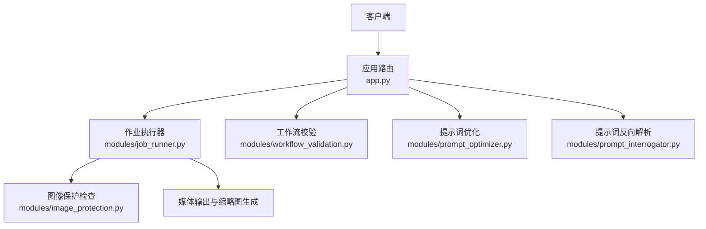
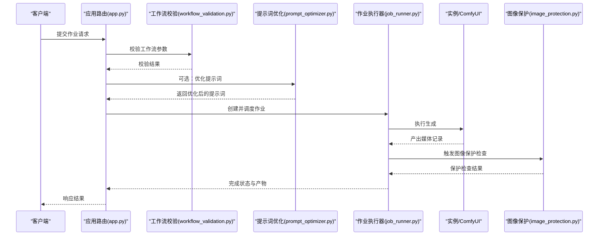
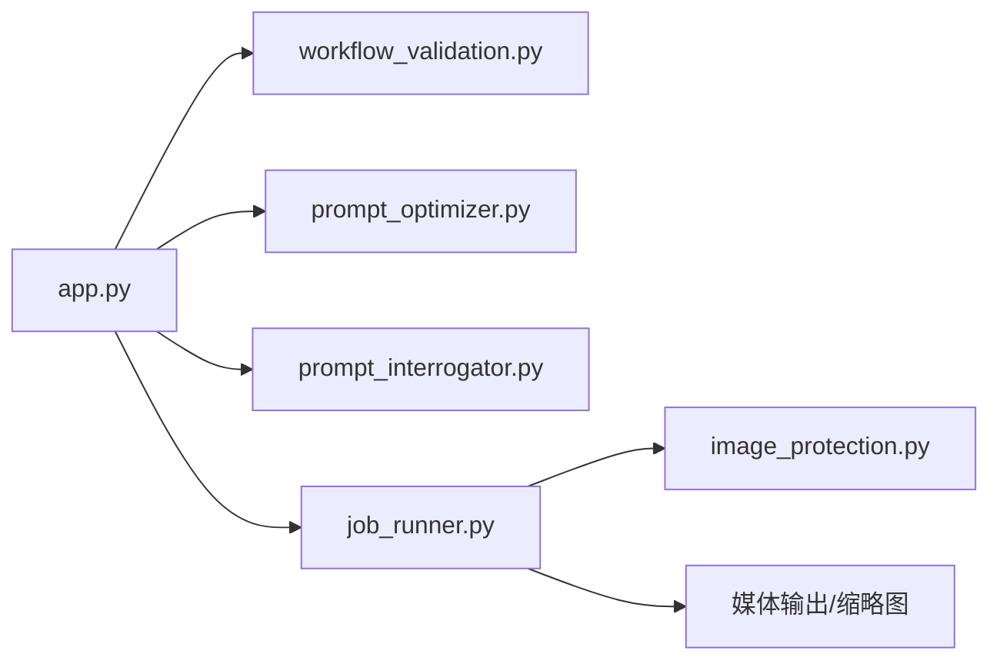

# 任务提交与参数验证

<cite>
**本文引用的文件**
- [app.py](file://app.py)
- [modules/job_runner.py](file://modules/job_runner.py)
- [modules/image_protection.py](file://modules/image_protection.py)
- [modules/prompt_optimizer.py](file://modules/prompt_optimizer.py)
- [modules/prompt_interrogator.py](file://modules/prompt_interrogator.py)
- [modules/workflow_validation.py](file://modules/workflow_validation.py)
- [tests/test_jobs_api.py](file://tests/test_jobs_api.py)
- [tests/test_workflow_validation.py](file://tests/test_workflow_validation.py)
- [tests/test_image_protection.py](file://tests/test_image_protection.py)
</cite>

## 目录
1. [简介](#简介)
2. [项目结构](#项目结构)
3. [核心组件](#核心组件)
4. [架构总览](#架构总览)
5. [详细组件分析](#详细组件分析)
6. [依赖关系分析](#依赖关系分析)
7. [性能考量](#性能考量)
8. [故障排查指南](#故障排查指南)
9. [结论](#结论)
10. [附录](#附录)

## 简介
本文件面向 Ez ComfyUI Showcase 的“作业提交”API，系统性梳理任务提交的 HTTP 接口、请求参数、参数验证与前置处理流程（工作流参数校验、提示词优化、图像保护检查），并给出参数必填项、可选项、默认值与范围限制、请求示例、响应格式、错误码说明，以及高级功能如作业优先级与实例偏好、批量提交等。

## 项目结构
围绕作业提交的关键模块与文件：
- 应用入口与路由：app.py 中定义了作业相关 API 路由与业务逻辑
- 作业执行器：modules/job_runner.py 负责作业调度、批量产出与保护检查集成
- 图像保护：modules/image_protection.py 提供内容安全检查能力
- 提示词优化与反向解析：modules/prompt_optimizer.py、modules/prompt_interrogator.py
- 工作流参数校验：modules/workflow_validation.py

图表来源
- [app.py](file://app.py)
- [modules/job_runner.py](file://modules/job_runner.py)
- [modules/image_protection.py](file://modules/image_protection.py)
- [modules/prompt_optimizer.py](file://modules/prompt_optimizer.py)
- [modules/prompt_interrogator.py](file://modules/prompt_interrogator.py)
- [modules/workflow_validation.py](file://modules/workflow_validation.py)

章节来源
- [app.py](file://app.py)
- [modules/job_runner.py](file://modules/job_runner.py)

## 核心组件
- 作业提交与管理 API（在 app.py 中定义）
- 作业执行器（在 modules/job_runner.py 中实现）
- 工作流参数校验（在 modules/workflow_validation.py 中实现）
- 提示词优化与反向解析（在 modules/prompt_optimizer.py、modules/prompt_interrogator.py 中实现）
- 图像保护检查（在 modules/image_protection.py 中实现）

章节来源
- [app.py](file://app.py)
- [modules/job_runner.py](file://modules/job_runner.py)
- [modules/workflow_validation.py](file://modules/workflow_validation.py)
- [modules/prompt_optimizer.py](file://modules/prompt_optimizer.py)
- [modules/prompt_interrogator.py](file://modules/prompt_interrogator.py)
- [modules/image_protection.py](file://modules/image_protection.py)

## 架构总览
作业提交从客户端发起，经应用路由进入业务层，进行工作流参数校验与提示词优化，随后交由作业执行器调度到实例运行。生成完成后，执行图像保护检查，并返回最终结果。

图表来源
- [app.py](file://app.py)
- [modules/workflow_validation.py](file://modules/workflow_validation.py)
- [modules/prompt_optimizer.py](file://modules/prompt_optimizer.py)
- [modules/job_runner.py](file://modules/job_runner.py)
- [modules/image_protection.py](file://modules/image_protection.py)

## 详细组件分析

### 1) 作业提交与管理 API（app.py）
- 作业查询与详情
  - GET /api/jobs：列出当前用户可见的作业列表
  - GET /api/jobs/{job_id}：获取指定作业详情
- 作业操作
  - DELETE /api/jobs/{job_id}：取消作业（仅限生成中）
  - DELETE /api/jobs/{job_id}/dismiss：丢弃失败或重试中的作业（仅限本人）
  - POST /api/jobs/{job_id}/retry：重试失败的作业（仅限本人）
- 作业状态与保护字段
  - 完成后返回字段包含：图片/视频路径、缩略图、批次信息、耗时、保护状态与分数等

章节来源
- [app.py](file://app.py)

### 2) 工作流参数校验（modules/workflow_validation.py）
- 校验目标：确保工作流是可提交的 ComfyUI API Prompt，避免 UI 导出链接与占位符
- 校验内容：缺失节点、占位符、不兼容的节点连接等
- 错误描述：将校验问题转换为可读的错误信息，便于前端展示

章节来源
- [modules/workflow_validation.py](file://modules/workflow_validation.py)
- [tests/test_workflow_validation.py](file://tests/test_workflow_validation.py)

### 3) 提示词优化与反向解析（modules/prompt_optimizer.py、modules/prompt_interrogator.py）
- 提示词优化：对输入提示词进行优化，提升生成质量
- 提示词反向解析：从生成结果回溯提示词，用于后续复用或调试

章节来源
- [modules/prompt_optimizer.py](file://modules/prompt_optimizer.py)
- [modules/prompt_interrogator.py](file://modules/prompt_interrogator.py)

### 4) 图像保护检查（modules/image_protection.py）
- 检查策略：遍历候选图片（原图与缩略图），调用保护检查器判断是否违规
- 结果融合：若任一候选为“受保护”，则整体判定为受保护；否则保留“安全”或“未知”的回退结果
- 后续处理：将保护状态、分数、原因、来源写入历史记录，并更新作业状态

章节来源
- [modules/image_protection.py](file://modules/image_protection.py)
- [app.py](file://app.py)
- [tests/test_image_protection.py](file://tests/test_image_protection.py)

### 5) 作业执行器与批量提交（modules/job_runner.py）
- 批量产出：支持多条媒体记录聚合，统一返回批次信息
- 保护检查集成：在生成完成后触发保护检查流程
- 状态推进：生成中 → 内容校验中 → 完成，期间广播作业状态变更

章节来源
- [modules/job_runner.py](file://modules/job_runner.py)
- [app.py](file://app.py)

## 依赖关系分析
作业提交涉及的模块间依赖如下：

图表来源
- [app.py](file://app.py)
- [modules/workflow_validation.py](file://modules/workflow_validation.py)
- [modules/prompt_optimizer.py](file://modules/prompt_optimizer.py)
- [modules/prompt_interrogator.py](file://modules/prompt_interrogator.py)
- [modules/job_runner.py](file://modules/job_runner.py)
- [modules/image_protection.py](file://modules/image_protection.py)

章节来源
- [app.py](file://app.py)
- [modules/job_runner.py](file://modules/job_runner.py)

## 性能考量
- 工作流校验与提示词优化在提交阶段执行，建议控制输入规模以减少等待时间
- 图像保护检查为异步线程执行，避免阻塞主线程
- 批量提交时，合并媒体记录可降低状态广播频率，提高吞吐

## 故障排查指南
- 工作流校验失败
  - 现象：返回 400，提示工作流不是可提交的 ComfyUI API Prompt
  - 处理：检查工作流中是否存在 UI 导出链接、占位符或缺失节点
- 图像保护检查异常
  - 现象：保护状态为错误，记录包含本地错误原因
  - 处理：确认候选图片存在且可访问，检查保护模型加载情况
- 作业状态错误
  - 取消失败：仅允许取消“生成中”的作业
  - 丢弃失败：仅允许丢弃“失败”或“重试中”的作业
  - 重试失败：仅允许重试“失败”的作业，且需为本人作业

章节来源
- [app.py](file://app.py)
- [tests/test_jobs_api.py](file://tests/test_jobs_api.py)
- [tests/test_workflow_validation.py](file://tests/test_workflow_validation.py)
- [tests/test_image_protection.py](file://tests/test_image_protection.py)

## 结论
本文档梳理了 Ez ComfyUI Showcase 的作业提交 API，明确了接口、参数、校验与前置处理流程，并提供了错误排查与性能建议。通过工作流校验、提示词优化与图像保护检查，系统在保证合规与质量的同时，提供了稳定的批量与实例偏好支持。

## 附录

### A. 作业提交 API 规范（概要）
- 路由与方法
  - GET /api/jobs：获取作业列表
  - GET /api/jobs/{job_id}：获取作业详情
  - DELETE /api/jobs/{job_id}：取消作业
  - DELETE /api/jobs/{job_id}/dismiss：丢弃失败或重试中的作业
  - POST /api/jobs/{job_id}/retry：重试失败的作业
- 请求参数与验证要点
  - 必填项：作业 ID（路径参数）、当前用户身份（鉴权中间件）
  - 可选项：工作流字段（由工作流校验决定是否需要）
  - 验证规则：工作流必须为可提交的 ComfyUI API Prompt；提示词可选优化；生成完成后进行图像保护检查
- 参数范围与默认值
  - 未在路由中显式声明的参数，遵循工作流内部节点的默认值
- 响应格式
  - 成功：返回 ok 或作业详情；失败：返回错误码与错误信息
- 错误码
  - 400：参数或状态错误（如不可取消、不可丢弃、不可重试）
  - 403：权限不足（非本人作业）
  - 404：资源不存在（作业或工作流版本）
- 高级功能
  - 优先级与实例偏好：通过作业字段传递实例偏好与节点偏好，由执行器选择合适实例
  - 批量提交：一次提交可生成多条媒体记录，返回批次 ID 与计数

章节来源
- [app.py](file://app.py)
- [modules/workflow_validation.py](file://modules/workflow_validation.py)
- [modules/prompt_optimizer.py](file://modules/prompt_optimizer.py)
- [modules/job_runner.py](file://modules/job_runner.py)
- [modules/image_protection.py](file://modules/image_protection.py)