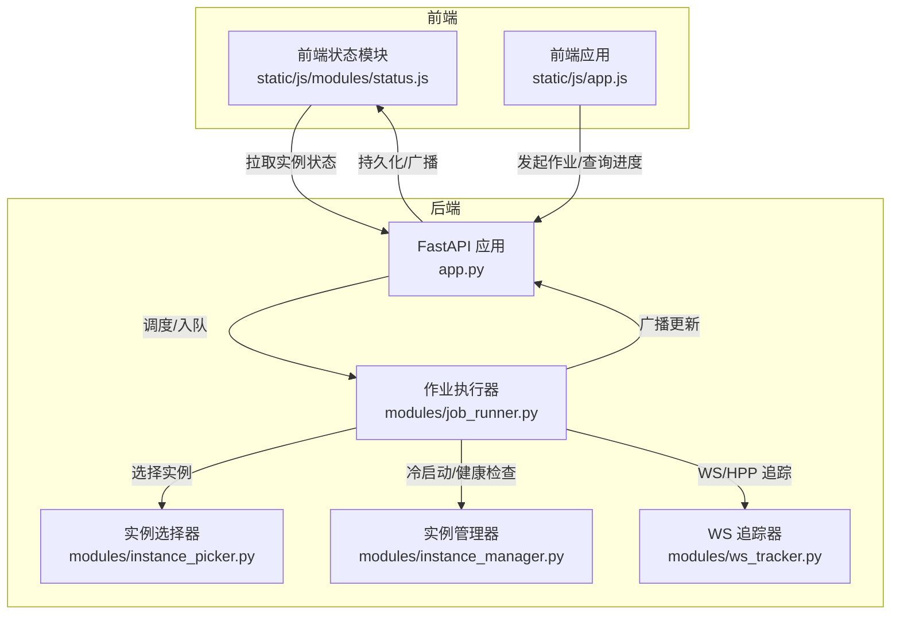
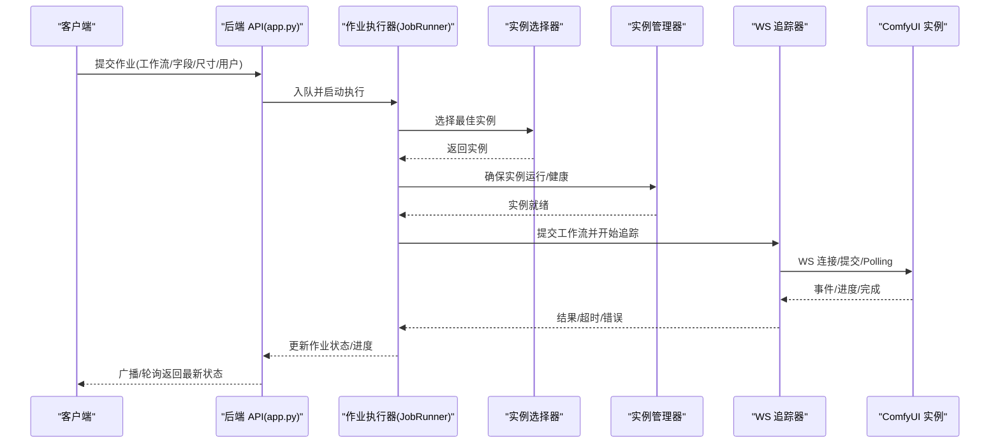
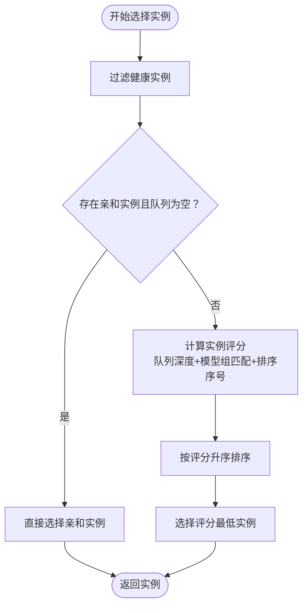
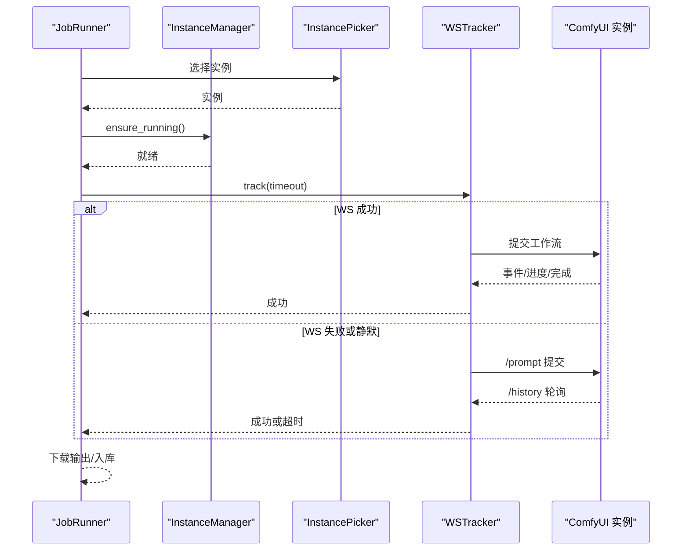
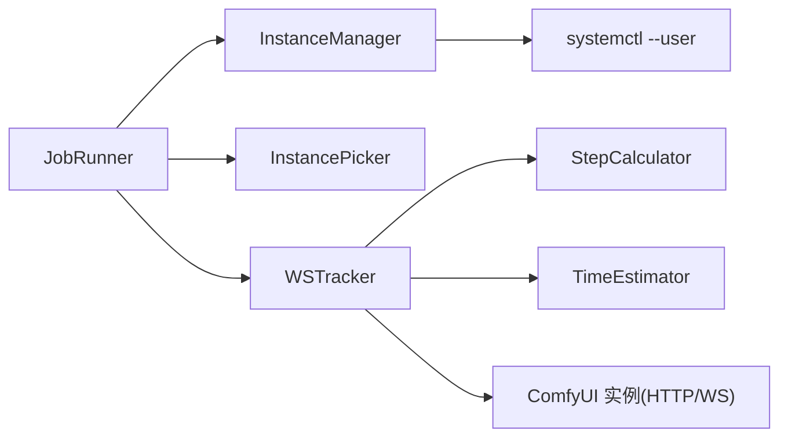

# 作业 API

<cite>
**本文档引用的文件**
- [app.py](file://app.py)
- [modules/job_runner.py](file://modules/job_runner.py)
- [modules/instance_manager.py](file://modules/instance_manager.py)
- [modules/instance_picker.py](file://modules/instance_picker.py)
- [modules/ws_tracker.py](file://modules/ws_tracker.py)
- [tests/test_jobs_api.py](file://tests/test_jobs_api.py)
- [tests/test_job_resume.py](file://tests/test_job_resume.py)
- [tests/test_global_generation_queue.py](file://tests/test_global_generation_queue.py)
- [tests/test_instance_picker.py](file://tests/test_instance_picker.py)
- [static/js/modules/status.js](file://static/js/modules/status.js)
- [static/js/app.js](file://static/js/app.js)
</cite>

## 目录
1. [简介](#简介)
2. [项目结构](#项目结构)
3. [核心组件](#核心组件)
4. [架构总览](#架构总览)
5. [详细组件分析](#详细组件分析)
6. [依赖关系分析](#依赖关系分析)
7. [性能考量](#性能考量)
8. [故障排查指南](#故障排查指南)
9. [结论](#结论)
10. [附录](#附录)

## 简介
本文件为 Ez ComfyUI Showcase 的“作业执行 API”提供完整接口文档与实现解析，覆盖以下主题：
- 作业提交、状态查询、进度跟踪、批量操作
- 作业调度算法、实例选择策略、并发控制机制
- 作业生命周期管理、状态转换、超时处理
- 作业监控、性能统计、资源使用情况查询
- 作业参数验证、错误处理、重试机制
- 请求/响应格式与错误码说明

## 项目结构
作业相关能力主要由后端 FastAPI 应用与一组模块协作完成：
- 后端路由与作业管理：app.py 中定义作业相关 API、全局队列、广播与持久化
- 作业执行编排：modules/job_runner.py 负责实例选择、信号量、WS/HPP 跟踪、下载与历史入库
- 实例管理：modules/instance_manager.py 负责实例健康检查、冷启动、空闲回收与后台监控
- 实例选择：modules/instance_picker.py 负责基于工作流类型与队列的实例优选
- WebSocket 追踪：modules/ws_tracker.py 负责 WS 连接、进度事件、HTTP 回退与超时处理
- 前端状态展示：static/js/modules/status.js 与 static/js/app.js 展示实例状态与作业进度

图表来源
- [app.py](file://app.py)
- [modules/job_runner.py](file://modules/job_runner.py)
- [modules/instance_manager.py](file://modules/instance_manager.py)
- [modules/instance_picker.py](file://modules/instance_picker.py)
- [modules/ws_tracker.py](file://modules/ws_tracker.py)
- [static/js/modules/status.js](file://static/js/modules/status.js)
- [static/js/app.js](file://static/js/app.js)

章节来源
- [app.py](file://app.py)
- [modules/job_runner.py](file://modules/job_runner.py)
- [modules/instance_manager.py](file://modules/instance_manager.py)
- [modules/instance_picker.py](file://modules/instance_picker.py)
- [modules/ws_tracker.py](file://modules/ws_tracker.py)
- [static/js/modules/status.js](file://static/js/modules/status.js)
- [static/js/app.js](file://static/js/app.js)

## 核心组件
- 作业执行器 JobRunner：封装一次完整出图流程，包括实例选择、信号量、WS/HPP 追踪、下载与历史入库，并处理提交停滞重试与错误回退
- 实例管理器 InstanceManager：负责实例健康检查、冷启动、空闲回收与后台监控
- 实例选择器 InstancePicker：基于工作流类型、队列深度与模型组进行实例优选
- WebSocket 追踪器 WSTracker：负责 WS 连接、事件处理、HTTP 回退与超时控制
- 前端状态模块：负责实例卡片渲染、作业进度聚合与展示

章节来源
- [modules/job_runner.py](file://modules/job_runner.py)
- [modules/instance_manager.py](file://modules/instance_manager.py)
- [modules/instance_picker.py](file://modules/instance_picker.py)
- [modules/ws_tracker.py](file://modules/ws_tracker.py)
- [static/js/modules/status.js](file://static/js/modules/status.js)

## 架构总览
作业执行的端到端流程如下：

图表来源
- [app.py](file://app.py)
- [modules/job_runner.py](file://modules/job_runner.py)
- [modules/instance_manager.py](file://modules/instance_manager.py)
- [modules/instance_picker.py](file://modules/instance_picker.py)
- [modules/ws_tracker.py](file://modules/ws_tracker.py)

## 详细组件分析

### 作业 API 路由与行为
- 作业提交
  - 方法与路径：POST /api/jobs
  - 请求体字段：workflow（工作流名称）、fields（字段映射）、width/height（图像尺寸）、preferred_instance/preferred_node_id（可选偏好）
  - 返回：作业对象（含 id、status、message、progress 等）
  - 权限：需登录用户，作业归属 user_id
- 作业详情
  - 方法与路径：GET /api/jobs/{job_id}
  - 返回：单个作业对象
  - 权限：仅作业所属用户或管理员可见
- 作业列表
  - 方法与路径：GET /api/jobs
  - 返回：当前用户活跃作业快照（测试显示使用快照避免遍历期间变更）
  - 权限：仅当前用户可见
- 作业取消
  - 方法与路径：DELETE /api/jobs/{job_id}/cancel
  - 行为：向实例发送中断，释放信号量，更新状态
  - 权限：仅作业所属用户
- 作业重试
  - 方法与路径：POST /api/jobs/{job_id}/retry
  - 行为：复制原作业字段，生成新 job_id，必要时移除旧失败作业
  - 权限：仅作业所属用户
- 作业丢弃
  - 方法与路径：DELETE /api/jobs/{job_id}/dismiss
  - 行为：仅允许失败或重试中的作业被丢弃
  - 权限：仅作业所属用户

章节来源
- [app.py](file://app.py)
- [tests/test_jobs_api.py](file://tests/test_jobs_api.py)
- [tests/test_job_resume.py](file://tests/test_job_resume.py)

### 作业调度与实例选择策略
- 实例选择
  - 优先考虑工作流类型偏好（如 T2I/I2I/视频/放大等固定路由）
  - 结合远端队列与本地等待队列综合评估
  - 同模型组优先，避免热点实例过载
  - 支持严格首选实例与亲和性匹配
- 实例管理
  - 健康检查：/system_stats 可达即视为健康
  - 冷启动：systemctl --user 控制，支持强制重启与防御期
  - 空闲回收：超过阈值自动停止
  - 死实例检测：服务 active 但健康失败时自动重启
- 并发控制
  - 实例级信号量：每个实例拥有独立信号量，保障串行生成
  - 全局队列：全局 worker 协程串行取出作业，避免跨实例并发冲突

图表来源
- [modules/instance_picker.py](file://modules/instance_picker.py)
- [modules/instance_manager.py](file://modules/instance_manager.py)
- [tests/test_instance_picker.py](file://tests/test_instance_picker.py)

章节来源
- [modules/instance_picker.py](file://modules/instance_picker.py)
- [modules/instance_manager.py](file://modules/instance_manager.py)
- [tests/test_instance_picker.py](file://tests/test_instance_picker.py)

### 作业执行与进度追踪
- 执行阶段
  - 实例选择与信号量获取
  - vLLM 管理（如需）
  - 实例冷启动与就绪检查
  - 工作流注入种子与字段、校验与图片预检
  - WS 追踪（事件驱动）或 HTTP 回退（轮询 /history）
  - 下载输出并入库历史
- 进度计算
  - 基于节点权重与采样器进度的加权累计
  - 时长推算节点的延迟刷新
  - 下载阶段进度归一化至 98%+（前端逻辑）
- 超时与重试
  - WS 无事件静默超时退化为 HTTP 轮询
  - Prompt 提交后启动超时触发自动纠错与实例重启
  - 提交停滞最大重试次数限制

图表来源
- [modules/job_runner.py](file://modules/job_runner.py)
- [modules/ws_tracker.py](file://modules/ws_tracker.py)
- [modules/instance_manager.py](file://modules/instance_manager.py)
- [modules/instance_picker.py](file://modules/instance_picker.py)

章节来源
- [modules/job_runner.py](file://modules/job_runner.py)
- [modules/ws_tracker.py](file://modules/ws_tracker.py)
- [modules/instance_manager.py](file://modules/instance_manager.py)
- [modules/instance_picker.py](file://modules/instance_picker.py)

### 作业生命周期与状态转换
- 状态集合：dispatching、queued、starting_comfyui、preparing、submitting、generating、downloading、done、error、cancelled、retrying
- 转换规则
  - 提交后：dispatching → queued（等待实例信号量）
  - 获取信号量：queued → starting_comfyui（冷启动）
  - 就绪：starting_comfyui → preparing → submitting → generating（WS 事件）
  - 完成：generating → downloading → done
  - 失败：任意阶段 → error
  - 取消：任意阶段 → cancelled
  - 重试：error → retrying → dispatching（新作业）
- 前端进度聚合
  - 选取非终止状态中进度最高的作业
  - 下载阶段进度最小化为 ≥98%

章节来源
- [modules/job_runner.py](file://modules/job_runner.py)
- [static/js/modules/status.js](file://static/js/modules/status.js)

### 错误处理与重试机制
- 传输瞬时错误（连接被拒、超时、连接重置等）被视为可重试
- Prompt 提交后无响应：自动清理队列、中断、重启实例并重试
- WS 静默超时：退化为 HTTP 轮询兜底
- 保存历史超时：统一捕获并转为超时错误
- 丢弃失败/重试中的作业：仅限该类状态且作业归属用户

章节来源
- [modules/job_runner.py](file://modules/job_runner.py)
- [modules/ws_tracker.py](file://modules/ws_tracker.py)
- [tests/test_job_resume.py](file://tests/test_job_resume.py)

### 监控、性能统计与资源使用
- GPU 使用：后端提供 GPU 与进程查询接口，前端用于展示实例状态卡片
- 实例健康：/system_stats 健康检查、服务状态检测、进程 PID 获取
- 性能统计：WSTracker 记录节点时长分布，用于后续估算优化

章节来源
- [app.py](file://app.py)
- [modules/instance_manager.py](file://modules/instance_manager.py)
- [modules/ws_tracker.py](file://modules/ws_tracker.py)
- [static/js/app.js](file://static/js/app.js)

## 依赖关系分析
- 模块耦合
  - JobRunner 依赖 InstanceManager、InstancePicker、WSTracker、StepCalculator、媒体输出工具
  - WSTracker 依赖 StepCalculator、TimeEstimator
  - InstanceManager 依赖 systemd 与健康检查端点
- 外部依赖
  - ComfyUI 实例（HTTP/WS 端点）
  - systemd 用户服务（启动/停止/重启）
  - 前端 WebSocket 广播与轮询

图表来源
- [modules/job_runner.py](file://modules/job_runner.py)
- [modules/instance_manager.py](file://modules/instance_manager.py)
- [modules/instance_picker.py](file://modules/instance_picker.py)
- [modules/ws_tracker.py](file://modules/ws_tracker.py)

章节来源
- [modules/job_runner.py](file://modules/job_runner.py)
- [modules/instance_manager.py](file://modules/instance_manager.py)
- [modules/instance_picker.py](file://modules/instance_picker.py)
- [modules/ws_tracker.py](file://modules/ws_tracker.py)

## 性能考量
- 实例级信号量确保串行生成，避免显存争用
- 全局队列串行化作业，降低跨实例竞争
- WS 优先，HTTP 回退兜底，平衡实时性与稳定性
- 时长推算节点延迟刷新，减少频繁计算
- 健康检查与空闲回收降低资源占用

## 故障排查指南
- 作业长时间停留在“排队等待”或“启动实例”
  - 检查实例健康与 systemd 状态
  - 查看冷启动超时与强制重启日志
- WS 连接失败或静默
  - 观察 WS 重试与 HTTP 回退日志
  - 检查实例网络连通性与防火墙
- 提交后无响应
  - 触发自动纠错：清理队列、中断、重启实例
  - 检查实例是否卡死或内存不足
- 保存历史超时
  - 检查输出目录权限与磁盘空间
- 丢弃失败/重试中的作业失败
  - 确认作业状态与归属用户

章节来源
- [modules/job_runner.py](file://modules/job_runner.py)
- [modules/ws_tracker.py](file://modules/ws_tracker.py)
- [modules/instance_manager.py](file://modules/instance_manager.py)
- [tests/test_job_resume.py](file://tests/test_job_resume.py)

## 结论
本作业 API 以模块化设计实现高可靠、可观测的生成流水线：通过实例选择与信号量控制保障并发安全，通过 WS 事件与 HTTP 回退兼顾实时性与鲁棒性，结合健康检查与空闲回收提升资源利用率。建议在生产环境配合完善的监控与告警体系，持续优化实例路由与超时策略。

## 附录

### API 定义与示例

- 提交作业
  - 方法：POST /api/jobs
  - 请求体字段
    - workflow: string（工作流名称）
    - fields: object（字段映射，键形如 "nid::field"）
    - width/height: number（图像尺寸）
    - preferred_instance: string（可选）
    - preferred_node_id: string（可选）
  - 响应：作业对象（包含 id、status、message、progress、instance、target_url 等）
  - 权限：登录用户
- 查询作业
  - 方法：GET /api/jobs/{job_id}
  - 响应：作业对象
  - 权限：作业所属用户或管理员
- 查询作业列表
  - 方法：GET /api/jobs
  - 响应：当前用户活跃作业数组（快照）
  - 权限：当前用户
- 取消作业
  - 方法：DELETE /api/jobs/{job_id}/cancel
  - 响应：{"ok": true}
  - 权限：作业所属用户
- 重试作业
  - 方法：POST /api/jobs/{job_id}/retry
  - 响应：{"ok": true, "job_id": string, "dismissed_job_id": string}
  - 权限：作业所属用户
- 丢弃作业
  - 方法：DELETE /api/jobs/{job_id}/dismiss
  - 响应：{"ok": true}
  - 权限：作业所属用户（仅失败或重试中）

章节来源
- [app.py](file://app.py)
- [tests/test_jobs_api.py](file://tests/test_jobs_api.py)
- [tests/test_job_resume.py](file://tests/test_job_resume.py)

### 状态与进度字段说明
- 状态
  - dispatching：派发中
  - queued：排队等待
  - starting_comfyui：启动实例
  - preparing：准备中
  - submitting：提交中
  - generating：生成中
  - downloading：下载中
  - done：完成
  - error：错误
  - cancelled：已取消
  - retrying：重试中
- 进度
  - progress.pct：百分比（0~100）
  - progress.current_node：当前节点类别
  - progress.sampler_cur/sampler_total：采样器进度
- 前端进度归一化
  - 下载阶段进度最小化为 ≥98%

章节来源
- [modules/job_runner.py](file://modules/job_runner.py)
- [static/js/modules/status.js](file://static/js/modules/status.js)

### 错误码与语义
- 400：参数非法、状态不允许（如丢弃非失败/重试中作业、重试非失败作业）
- 403：权限不足（非作业所属用户）
- 404：作业不存在
- 504：超时（WS 静默、提交超时、保存历史超时）
- 其他：内部错误或传输错误

章节来源
- [app.py](file://app.py)
- [modules/job_runner.py](file://modules/job_runner.py)
- [modules/ws_tracker.py](file://modules/ws_tracker.py)