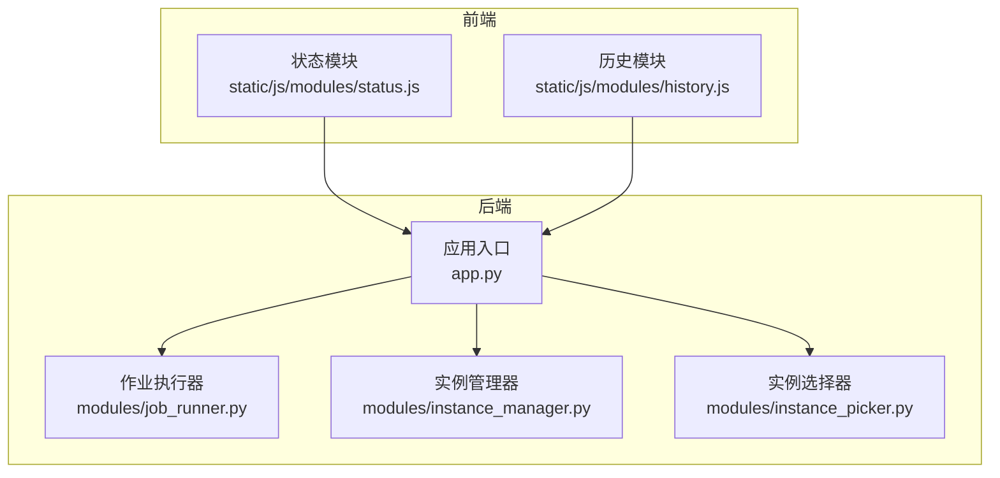
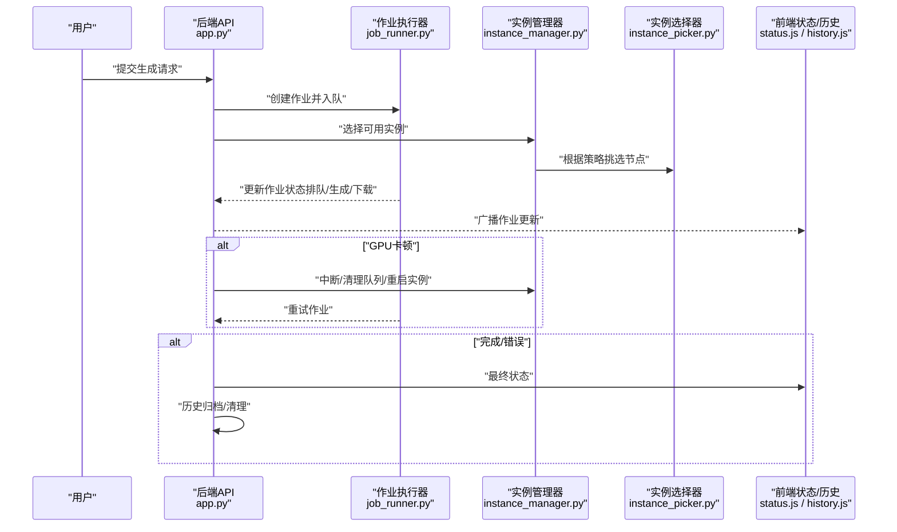
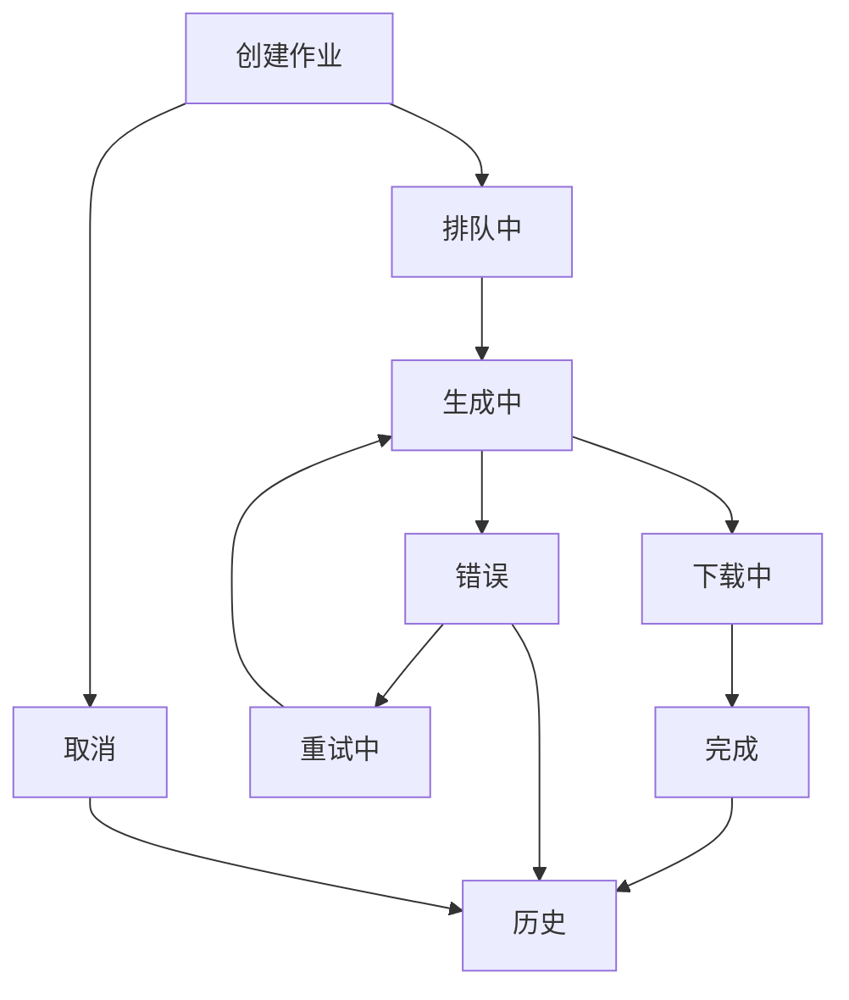
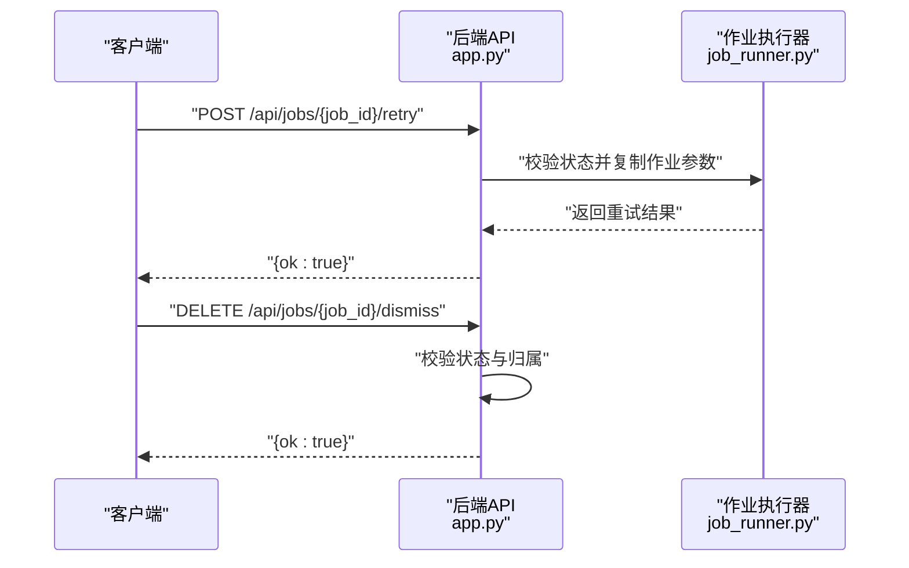
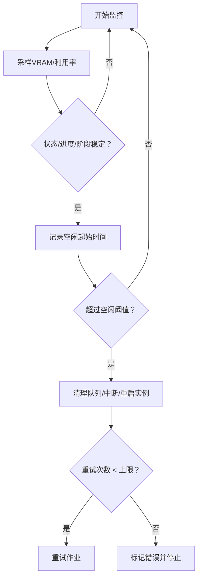
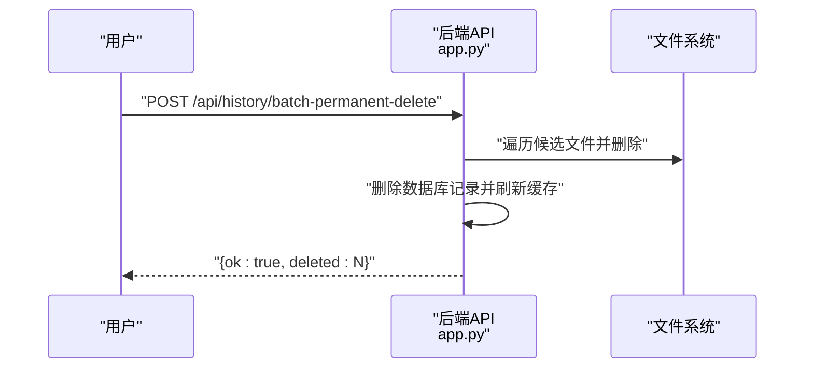
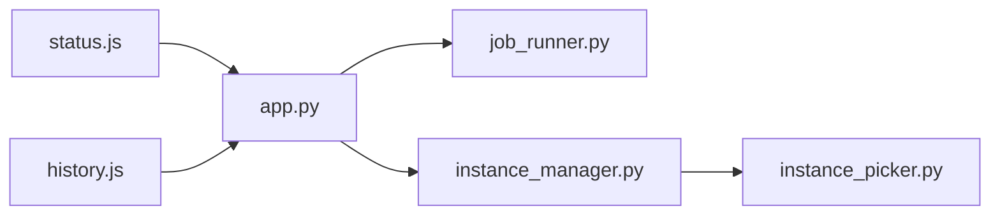

# 作业生命周期管理

<cite>
**本文引用的文件**
- [app.py](file://app.py)
- [job_runner.py](file://modules/job_runner.py)
- [instance_manager.py](file://modules/instance_manager.py)
- [instance_picker.py](file://modules/instance_picker.py)
- [status.js](file://static/js/modules/status.js)
- [history.js](file://static/js/modules/history.js)
- [test_jobs_api.py](file://tests/test_jobs_api.py)
- [test_job_resume.py](file://tests/test_job_resume.py)
- [test_history_api.py](file://tests/test_history_api.py)
- [test_instance_idle_guard.py](file://tests/test_instance_idle_guard.py)
</cite>

## 目录
1. [简介](#简介)
2. [项目结构](#项目结构)
3. [核心组件](#核心组件)
4. [架构总览](#架构总览)
5. [详细组件分析](#详细组件分析)
6. [依赖关系分析](#依赖关系分析)
7. [性能考量](#性能考量)
8. [故障排查指南](#故障排查指南)
9. [结论](#结论)
10. [附录](#附录)

## 简介
本文件面向 Ez ComfyUI Showcase 的“作业生命周期管理”接口，系统性梳理从创建到完成的全链路状态流转，覆盖调度、排队、执行、下载、取消、中断、重试、超时与卡顿检测、自动重启、历史查询与清理归档、以及高级管理能力（如优先级与实例重新分配）等。文档以接口定义与实现行为为依据，辅以流程图与时序图帮助理解。

## 项目结构
围绕作业生命周期的关键代码分布在后端应用入口与前端状态展示模块中：
- 后端核心：在应用入口集中定义作业相关 API，并在内部模块中实现作业执行、实例选择与管理、GPU 卡顿检测与自动重启等逻辑。
- 前端展示：通过状态模块与历史模块对作业状态进行排序、显示与交互。

图表来源
- [app.py](file://app.py)
- [job_runner.py](file://modules/job_runner.py)
- [instance_manager.py](file://modules/instance_manager.py)
- [instance_picker.py](file://modules/instance_picker.py)
- [status.js](file://static/js/modules/status.js)
- [history.js](file://static/js/modules/history.js)

章节来源
- [app.py](file://app.py)
- [status.js](file://static/js/modules/status.js)
- [history.js](file://static/js/modules/history.js)

## 核心组件
- 作业状态机与生命周期
  - 关键状态：排队中、生成中、下载中、完成、错误、重试中、取消、历史（归档态）等。
  - 状态转换由后端作业执行器与实例管理器驱动，前端负责展示与交互。
- 作业管理 API
  - 创建、取消、中断、重试、丢弃失败/重试记录等。
- GPU 卡顿检测与自动重启
  - 基于显存使用、利用率与进度/阶段稳定性判断是否卡顿，触发中断、队列清理与实例重启，并限制最大重试次数。
- 历史记录管理
  - 支持软删除、批量恢复、永久删除（含文件清理）、分页与筛选。
- 实例与优先级
  - 通过实例选择器与实例管理器支持实例重新分配；前端按状态与时间戳排序作业卡片。

章节来源
- [app.py](file://app.py)
- [job_runner.py](file://modules/job_runner.py)
- [instance_manager.py](file://modules/instance_manager.py)
- [instance_picker.py](file://modules/instance_picker.py)
- [status.js](file://static/js/modules/status.js)
- [history.js](file://static/js/modules/history.js)

## 架构总览
下图展示了作业从创建到完成的典型路径，以及异常处理与历史归档的关键节点。

图表来源
- [app.py](file://app.py)
- [job_runner.py](file://modules/job_runner.py)
- [instance_manager.py](file://modules/instance_manager.py)
- [instance_picker.py](file://modules/instance_picker.py)
- [status.js](file://static/js/modules/status.js)
- [history.js](file://static/js/modules/history.js)

## 详细组件分析

### 作业生命周期与状态机
- 状态定义与转换
  - 排队中：作业已创建并等待实例资源。
  - 生成中：实例开始执行工作流。
  - 下载中：生成结果准备或正在下载。
  - 完成：作业成功结束。
  - 错误：执行过程中发生异常。
  - 重试中：因错误触发自动或手动重试。
  - 取消：用户主动取消。
  - 历史：归档态，不参与实时计算。
- 前端排序与展示
  - 前端按状态优先级与时间戳对作业卡片进行排序，便于用户快速定位当前活跃作业。

图表来源
- [status.js](file://static/js/modules/status.js)
- [history.js](file://static/js/modules/history.js)

章节来源
- [status.js](file://static/js/modules/status.js)
- [history.js](file://static/js/modules/history.js)

### 作业管理 API 规范
- 创建与入队
  - 提交生成请求后，作业进入排队中，随后由实例管理器与选择器分配实例与节点。
- 取消与中断
  - 用户可取消作业；后端会清理队列并广播更新。
  - 中断用于在运行中强制终止当前执行。
- 重试
  - 仅允许对“错误”状态的作业发起重试；重试时会保留原始参数并生成新种子。
- 丢弃失败/重试记录
  - 仅允许丢弃处于“错误”或“重试中”的记录，且需为本人作业。

图表来源
- [app.py](file://app.py)
- [job_runner.py](file://modules/job_runner.py)

章节来源
- [app.py](file://app.py)
- [test_job_resume.py](file://tests/test_job_resume.py)

### GPU 卡顿检测与自动重启
- 检测条件
  - 仅对特定作业状态启用监控；基于显存使用量与 GPU 利用率采样，要求在窗口期内无波动且进度/阶段未变化。
  - 首次判定后设置“空闲起始时间”，超过阈值则判定卡顿。
- 处理动作
  - 清理对应提示词队列、发送中断指令、重启实例服务、取消执行任务并重试作业。
  - 若超过最大重试次数，标记为错误并停止。
- 阈值与限制
  - 最大重试次数受配置限制；前端状态模块会显示实例停止等提示消息。

图表来源
- [app.py](file://app.py)
- [test_instance_idle_guard.py](file://tests/test_instance_idle_guard.py)

章节来源
- [app.py](file://app.py)
- [test_instance_idle_guard.py](file://tests/test_instance_idle_guard.py)

### 历史记录查询、清理与归档
- 查询与分页
  - 支持按范围、状态与用户过滤；前端历史模块提供排序与焦点管理。
- 软删除与恢复
  - 删除后进入回收站，支持批量恢复。
- 永久删除与文件清理
  - 永久删除会移除数据库记录与相关输出文件（含缩略图与输入引用），并同步更新内存历史缓存。
- 批量操作
  - 支持批量恢复与批量永久删除，接口对权限与参数进行校验。

图表来源
- [app.py](file://app.py)
- [test_history_api.py](file://tests/test_history_api.py)

章节来源
- [app.py](file://app.py)
- [test_history_api.py](file://tests/test_history_api.py)
- [history.js](file://static/js/modules/history.js)

### 高级管理能力
- 优先级与排序
  - 前端根据作业状态优先级与时间戳对作业卡片进行排序，确保活跃作业优先可见。
- 实例重新分配
  - 通过实例选择器与实例管理器在不同节点间重新分配作业，以优化负载与资源利用。
- 权限控制
  - 作业与工作流的元数据修改、共享与删除均受权限校验保护，管理员拥有更高权限。

章节来源
- [status.js](file://static/js/modules/status.js)
- [instance_picker.py](file://modules/instance_picker.py)
- [instance_manager.py](file://modules/instance_manager.py)
- [app.py](file://app.py)

## 依赖关系分析
- 后端模块耦合
  - 应用入口依赖作业执行器与实例管理器；实例选择器作为策略组件被实例管理器调用。
- 前端交互
  - 状态模块负责作业进度与实例状态展示；历史模块负责历史记录的排序与交互。
- 测试验证
  - 单元测试覆盖作业重试、丢弃规则、历史删除与文件清理、GPU 卡顿检测阈值等关键行为。

图表来源
- [app.py](file://app.py)
- [job_runner.py](file://modules/job_runner.py)
- [instance_manager.py](file://modules/instance_manager.py)
- [instance_picker.py](file://modules/instance_picker.py)
- [status.js](file://static/js/modules/status.js)
- [history.js](file://static/js/modules/history.js)

章节来源
- [app.py](file://app.py)
- [job_runner.py](file://modules/job_runner.py)
- [instance_manager.py](file://modules/instance_manager.py)
- [instance_picker.py](file://modules/instance_picker.py)
- [status.js](file://static/js/modules/status.js)
- [history.js](file://static/js/modules/history.js)

## 性能考量
- GPU 卡顿检测窗口期设计避免误判，减少不必要的重启与重试。
- 重试上限控制防止无限循环，保障系统稳定性。
- 前端按状态优先级排序，降低用户查找成本，间接提升整体交互效率。
- 历史记录的批量操作与文件清理减少磁盘占用与冗余数据。

## 故障排查指南
- 无法重试作业
  - 仅“错误”状态可重试；确认作业状态与归属。
- 无法丢弃记录
  - 仅“错误”或“重试中”的记录可丢弃；确认状态与登录用户。
- 历史删除后文件未清理
  - 永久删除才会清理文件；检查是否执行了批量永久删除。
- GPU 卡顿时反复重启
  - 检查是否超过最大重试次数；关注实例日志与中断动作是否生效。
- 作业长时间无进度
  - 结合前端状态面板查看实例队列与进度；必要时手动中断并重试。

章节来源
- [test_jobs_api.py](file://tests/test_jobs_api.py)
- [test_job_resume.py](file://tests/test_job_resume.py)
- [test_history_api.py](file://tests/test_history_api.py)
- [test_instance_idle_guard.py](file://tests/test_instance_idle_guard.py)

## 结论
Ez ComfyUI Showcase 的作业生命周期管理通过清晰的状态机、完善的 API 与前端交互、以及稳健的 GPU 卡顿检测与自动重启机制，实现了从创建到完成的全链路可观测与可控。配合历史记录的软删除与批量清理，系统在可用性与运维效率之间取得平衡。建议在生产环境中结合实例容量与重试策略进行容量规划与阈值调优。

## 附录
- 关键接口速览（示例）
  - 取消作业：DELETE /api/jobs/{job_id}
  - 丢弃失败/重试记录：DELETE /api/jobs/{job_id}/dismiss
  - 重试作业：POST /api/jobs/{job_id}/retry
  - 历史批量永久删除：POST /api/history/batch-permanent-delete
  - 历史批量恢复：POST /api/history/batch-restore