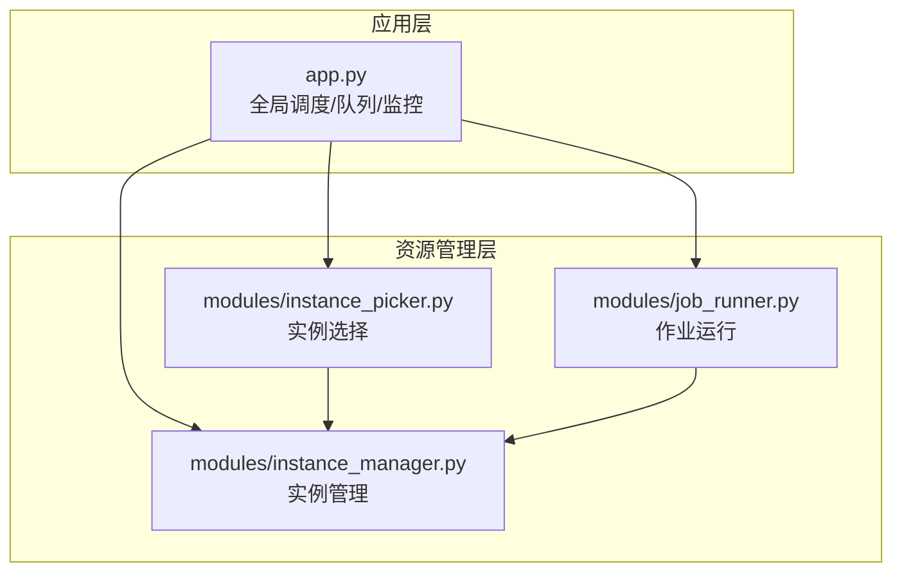
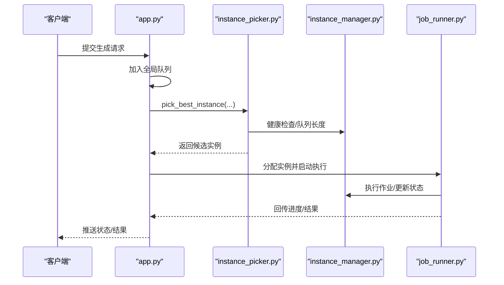
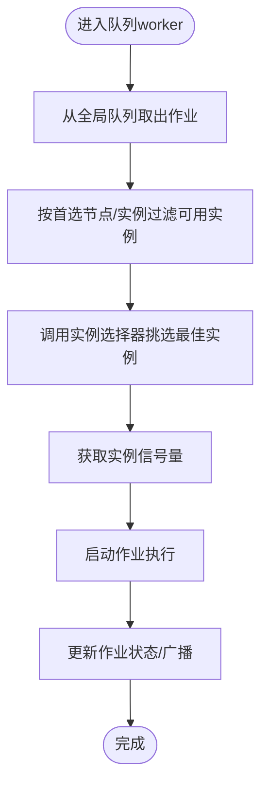
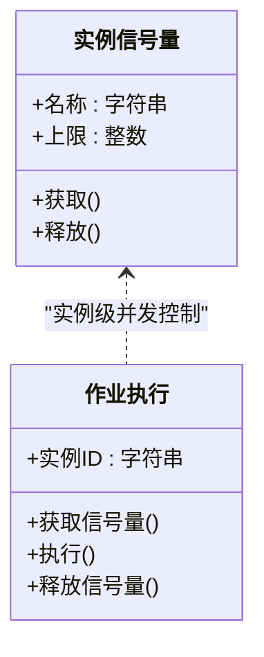
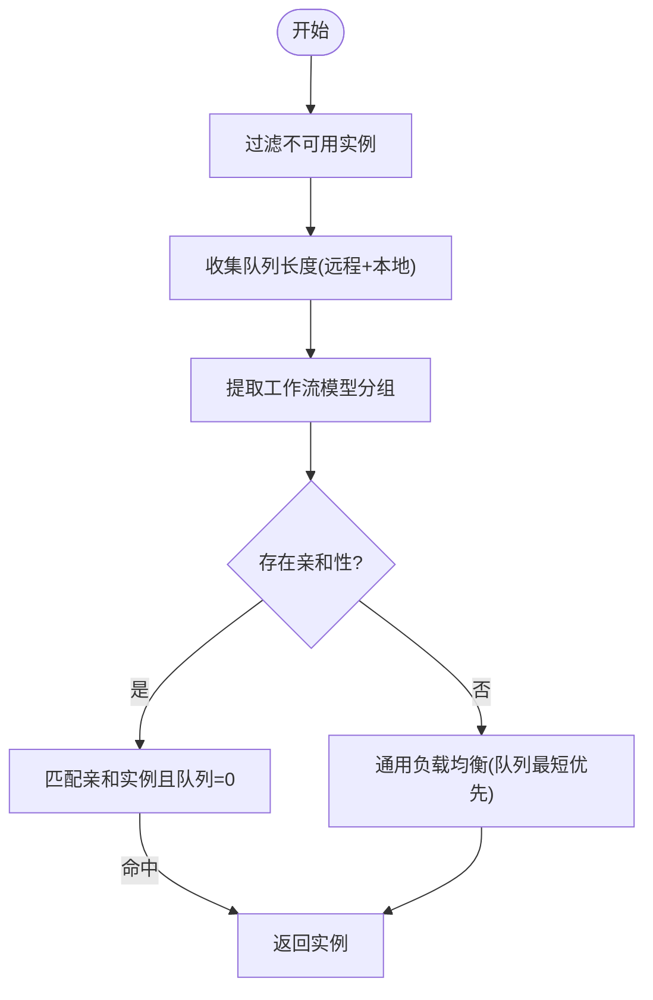
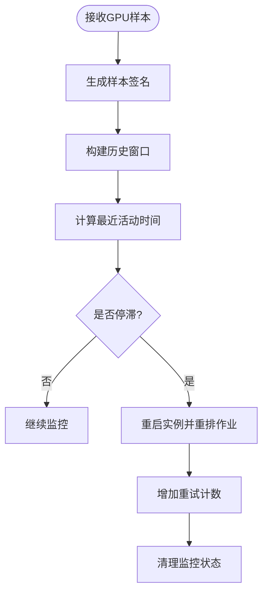
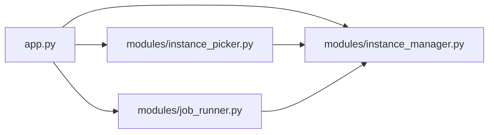

# 并发控制与资源管理

<cite>
**本文引用的文件**
- [app.py](file://app.py)
- [modules/instance_manager.py](file://modules/instance_manager.py)
- [modules/instance_picker.py](file://modules/instance_picker.py)
- [modules/job_runner.py](file://modules/job_runner.py)
- [tests/test_instance_picker.py](file://tests/test_instance_picker.py)
- [tests/test_instance_idle_guard.py](file://tests/test_instance_idle_guard.py)
- [tests/test_job_runner_queue.py](file://tests/test_job_runner_queue.py)
</cite>

## 目录
1. [简介](#简介)
2. [项目结构](#项目结构)
3. [核心组件](#核心组件)
4. [架构总览](#架构总览)
5. [详细组件分析](#详细组件分析)
6. [依赖关系分析](#依赖关系分析)
7. [性能考量](#性能考量)
8. [故障排查指南](#故障排查指南)
9. [结论](#结论)
10. [附录](#附录)

## 简介
本文件面向 Ez ComfyUI Showcase 的并发控制与资源管理接口，系统性阐述全局并发限制、实例级并发控制与作业队列管理机制；记录资源使用监控、GPU 内存管理、CPU 资源分配的技术实现；说明负载均衡算法、实例选择策略与资源抢占机制；提供并发配置参数、动态调整策略与性能优化建议，并给出资源使用报告查询与容量规划指导。

## 项目结构
该系统围绕应用入口与三个核心模块协作：
- 应用入口负责全局调度、队列管理、实例选择、GPU 活动监控与重启策略
- 实例管理器负责实例生命周期、连接状态与健康检查
- 实例选择器负责基于亲和性、队列长度与分组的负载均衡
- 作业运行器负责具体作业执行与状态推进

图表来源
- [app.py](file://app.py)
- [modules/instance_manager.py](file://modules/instance_manager.py)
- [modules/instance_picker.py](file://modules/instance_picker.py)
- [modules/job_runner.py](file://modules/job_runner.py)

章节来源
- [app.py](file://app.py)
- [modules/instance_manager.py](file://modules/instance_manager.py)
- [modules/instance_picker.py](file://modules/instance_picker.py)
- [modules/job_runner.py](file://modules/job_runner.py)

## 核心组件
- 全局生成调度器：单线程全局队列，串行派发作业，避免跨实例竞争
- 实例选择器：按亲和性、队列长度、模型分组进行负载均衡
- 实例管理器：维护实例健康状态、连接与可用性
- 作业运行器：封装作业执行细节，推进状态与结果回传
- GPU 活动监控：检测 GPU 工作状态，判定空闲/停滞并触发重启策略

章节来源
- [app.py](file://app.py)
- [modules/instance_manager.py](file://modules/instance_manager.py)
- [modules/instance_picker.py](file://modules/instance_picker.py)
- [modules/job_runner.py](file://modules/job_runner.py)

## 架构总览
系统采用“全局调度 + 实例选择 + 实例管理 + 作业执行”的分层架构。全局调度器保证生成作业的串行化，实例选择器在可用实例中挑选最优目标，实例管理器保障实例健康，作业运行器完成实际工作流执行。

图表来源
- [app.py](file://app.py)
- [modules/instance_picker.py](file://modules/instance_picker.py)
- [modules/instance_manager.py](file://modules/instance_manager.py)
- [modules/job_runner.py](file://modules/job_runner.py)

## 详细组件分析

### 全局并发限制与队列管理
- 全局仅保留一个生成调度器，确保所有生成作业串行派发，避免跨实例并发冲突
- 使用异步队列承载待处理作业，支持优先实例/节点过滤与去重
- 队列 worker 从全局队列取出作业后，调用实例选择器挑选目标实例，随后为该实例分配信号量以实现实例级并发控制

图表来源
- [app.py](file://app.py)

章节来源
- [app.py](file://app.py)

### 实例级并发控制
- 每个实例维护独立信号量，用于限制同时在该实例上运行的作业数
- 信号量名称可按实例名或 ID 匹配，若未找到则回退到默认值
- 通过信号量实现实例内并发隔离，避免资源争用

图表来源
- [app.py](file://app.py)

章节来源
- [app.py](file://app.py)

### 实例选择策略与负载均衡
- 亲和性匹配：根据工作流名称提取模型分组，优先选择具备相同亲和性的实例
- 队列长度评估：结合远程队列长度与本地活跃作业数，计算综合负载
- 健康检查：仅在可用实例中进行选择
- 分组策略：支持按实例分组进行同组内优选

图表来源
- [modules/instance_picker.py](file://modules/instance_picker.py)
- [app.py](file://app.py)

章节来源
- [modules/instance_picker.py](file://modules/instance_picker.py)
- [app.py](file://app.py)

### GPU 活动监控与资源抢占
- GPU 活动采样：周期性采集 GPU 利用率/显存使用等指标，形成签名
- 空闲/停滞判定：若连续多轮无变化或长时间无活动，则标记为停滞
- 抢占与重启：对停滞作业触发实例重启与作业重排，避免资源卡死
- 重试计数：记录 GPU 停滞重试次数，防止无限循环

图表来源
- [app.py](file://app.py)

章节来源
- [app.py](file://app.py)

### 作业队列与状态推进
- 作业状态：排队、生成中、完成、失败等
- 排队超时：对特定状态设置非过期窗口，保证恢复能力
- 队列操作：支持删除指定 prompt、批量清理等
- 广播推送：作业状态变更通过广播通知前端

章节来源
- [app.py](file://app.py)

### 资源使用监控与报告
- GPU 指标：利用率、显存占用、活动时间等
- CPU 资源：通过系统指标采集（如进程级 CPU/内存）
- 报告维度：实例级别、作业级别、时间窗口聚合
- 可视化建议：折线图展示 GPU 利用率/显存趋势，柱状图对比不同实例负载

章节来源
- [app.py](file://app.py)

## 依赖关系分析
- app.py 作为中枢，依赖实例选择器与实例管理器进行实例筛选与健康检查，依赖作业运行器推进执行
- 实例选择器依赖实例管理器提供的健康状态与队列长度
- 作业运行器依赖实例管理器进行连接与执行
- 测试覆盖包括实例选择、队列调度与 GPU 停滞处理

图表来源
- [app.py](file://app.py)
- [modules/instance_picker.py](file://modules/instance_picker.py)
- [modules/instance_manager.py](file://modules/instance_manager.py)
- [modules/job_runner.py](file://modules/job_runner.py)

章节来源
- [app.py](file://app.py)
- [modules/instance_picker.py](file://modules/instance_picker.py)
- [modules/instance_manager.py](file://modules/instance_manager.py)
- [modules/job_runner.py](file://modules/job_runner.py)

## 性能考量
- 并发策略
  - 全局仅保留一个调度器，避免跨实例竞争，适合高负载场景下的稳定性
  - 实例级信号量按实例名或 ID 自动匹配，确保细粒度并发控制
- 调度优化
  - 亲和性优先：尽量在同一实例上复用模型，减少加载开销
  - 综合队列长度：同时考虑远程队列与本地活跃作业，避免误判
- 监控与自愈
  - GPU 停滞检测与自动重启，降低长尾卡死风险
  - 重试计数与监控清理，防止状态泄漏
- 容量规划
  - 基于 GPU 利用率与显存峰值，估算实例吞吐与并发上限
  - 通过历史报告识别高峰时段与热点工作流，提前扩容

[本节为通用性能建议，不直接分析具体文件]

## 故障排查指南
- 实例无可用
  - 现象：无法选择实例，抛出“无健康实例”错误
  - 排查：确认实例健康检查与连接状态，检查网络连通性
- GPU 停滞导致作业阻塞
  - 现象：作业长时间无进展，最终被重启
  - 排查：查看 GPU 活动历史与重试计数，检查驱动/显存压力
- 队列堆积
  - 现象：全局队列持续增长
  - 排查：检查实例负载、亲和性匹配情况与信号量上限
- 作业状态异常
  - 现象：状态不更新或重复提交
  - 排查：核对广播推送逻辑与去重策略

章节来源
- [tests/test_instance_idle_guard.py](file://tests/test_instance_idle_guard.py)
- [tests/test_instance_picker.py](file://tests/test_instance_picker.py)
- [tests/test_job_runner_queue.py](file://tests/test_job_runner_queue.py)
- [app.py](file://app.py)

## 结论
本系统通过“全局串行调度 + 实例选择器 + 实例级并发控制 + GPU 活动监控”的组合，实现了稳定高效的并发控制与资源管理。亲和性与队列长度的综合评估提升了负载均衡效果，GPU 停滞自愈机制有效降低了长尾风险。配合容量规划与监控报告，可实现动态扩缩容与性能优化。

[本节为总结性内容，不直接分析具体文件]

## 附录

### 并发配置参数与动态调整
- 全局调度器数量：固定为 1，保证串行派发
- 实例信号量上限：按实例名/ID 自动匹配，未命中时使用默认值
- 亲和性映射：通过工作流名称提取模型分组，优先匹配相同分组实例
- 队列长度评估：远程队列长度 + 本地活跃作业数
- GPU 停滞阈值：根据历史窗口与签名变化判定，支持重试上限

章节来源
- [app.py](file://app.py)
- [modules/instance_picker.py](file://modules/instance_picker.py)