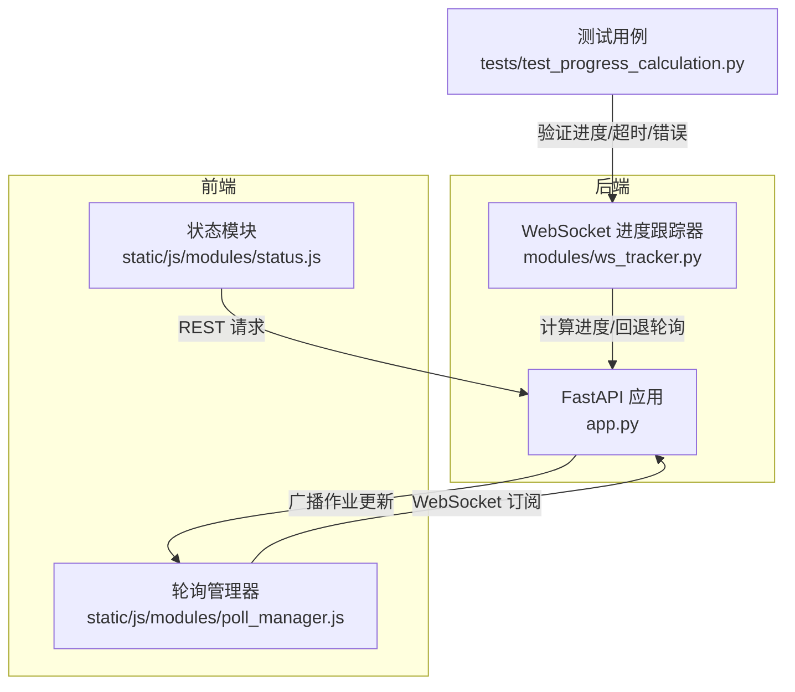
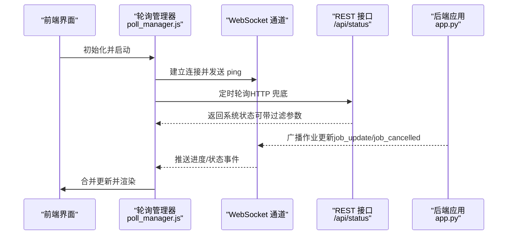
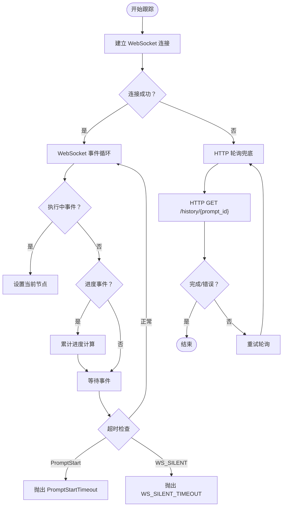
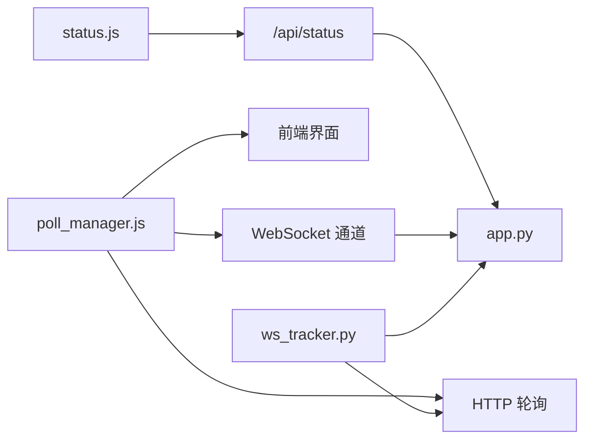

# 状态查询与进度跟踪

<cite>
**本文引用的文件**
- [app.py](file://app.py)
- [ws_tracker.py](file://modules/ws_tracker.py)
- [poll_manager.js](file://static/js/modules/poll_manager.js)
- [status.js](file://static/js/modules/status.js)
- [test_progress_calculation.py](file://tests/test_progress_calculation.py)
- [test_poll_manager_resume.py](file://tests/test_poll_manager_resume.py)
- [test_job_resume.py](file://tests/test_job_resume.py)
</cite>

## 目录
1. [简介](#简介)
2. [项目结构](#项目结构)
3. [核心组件](#核心组件)
4. [架构总览](#架构总览)
5. [详细组件分析](#详细组件分析)
6. [依赖关系分析](#依赖关系分析)
7. [性能考量](#性能考量)
8. [故障排查指南](#故障排查指南)
9. [结论](#结论)
10. [附录](#附录)

## 简介
本文件为 Ez ComfyUI Showcase 的“作业状态查询与进度跟踪”接口提供完整 API 文档。内容覆盖：
- 作业状态获取的 RESTful 接口规范（单个作业查询与批量状态查询）
- WebSocket 实时进度推送机制、消息格式与事件类型
- 作业状态枚举值、状态转换规则与超时处理策略
- 进度百分比计算、当前节点信息、采样器状态等进度数据
- 状态轮询最佳实践与 WebSocket 连接管理指南

## 项目结构
围绕状态查询与进度跟踪的关键文件分布如下：
- 后端服务：FastAPI 应用在 app.py 中定义了状态查询与节点管理相关接口，并通过 WebSocket 广播作业更新
- 进度跟踪器：modules/ws_tracker.py 提供基于 WebSocket 的进度跟踪与回退轮询逻辑
- 前端轮询管理：static/js/modules/poll_manager.js 统一管理 WebSocket 优先、HTTP 轮询兜底的数据源
- 前端状态模块：static/js/modules/status.js 提供按节点/实例过滤的状态查询能力
- 测试用例：tests/test_progress_calculation.py、tests/test_poll_manager_resume.py、tests/test_job_resume.py 验证进度计算、轮询恢复与作业状态治理

图表来源
- [app.py](file://app.py)
- [ws_tracker.py](file://modules/ws_tracker.py)
- [poll_manager.js](file://static/js/modules/poll_manager.js)
- [status.js](file://static/js/modules/status.js)
- [test_progress_calculation.py](file://tests/test_progress_calculation.py)

章节来源
- [app.py](file://app.py)
- [ws_tracker.py](file://modules/ws_tracker.py)
- [poll_manager.js](file://static/js/modules/poll_manager.js)
- [status.js](file://static/js/modules/status.js)
- [test_progress_calculation.py](file://tests/test_progress_calculation.py)

## 核心组件
- 后端 REST 接口
  - 系统状态查询：GET /api/status（支持按目标节点与实例过滤）
  - 节点与实例管理：/api/nodes 及其子路径（用于节点健康与实例重启）
- WebSocket 广播
  - 作业状态更新事件推送（如 job_update、job_cancelled），并按用户权限进行消息过滤
- 前端轮询与订阅
  - PollManager：统一管理 WebSocket 连接、心跳、HTTP 轮询兜底与计时器
  - status.js：封装按节点/实例过滤的状态查询请求
- 进度跟踪器
  - ws_tracker.py：负责 WebSocket 连接、进度事件解析、超时与错误处理、HTTP 轮询回退

章节来源
- [app.py](file://app.py)
- [ws_tracker.py](file://modules/ws_tracker.py)
- [poll_manager.js](file://static/js/modules/poll_manager.js)
- [status.js](file://static/js/modules/status.js)

## 架构总览
下图展示从前端到后端的交互流程，以及 WebSocket 广播与 HTTP 轮询的协同机制。

图表来源
- [poll_manager.js](file://static/js/modules/poll_manager.js)
- [status.js](file://static/js/modules/status.js)
- [app.py](file://app.py)

## 详细组件分析

### 后端 REST 接口：系统状态查询
- 路径与方法
  - GET /api/status
- 查询参数
  - target_node_id：目标节点 ID（可选）
  - target_instance：目标实例标识（可选）
- 响应字段（示例）
  - services：服务状态列表
  - gpu：GPU 使用情况
  - instances：节点实例状态数组（含运行/空闲/离线/死亡等）
- 权限与可见性
  - 当存在目标节点或实例过滤时，返回结果将受当前用户可见性限制；管理员可查看全部

章节来源
- [app.py](file://app.py)
- [status.js](file://static/js/modules/status.js)

### WebSocket 实时进度推送
- 连接与鉴权
  - 前端通过 PollManager 建立 WebSocket 连接，周期性发送 ping 保持心跳
  - 后端根据消息类型与作业拥有者进行权限校验，确保非拥有者无法接收他人作业的推送
- 事件类型
  - job_update：作业状态/进度更新
  - job_cancelled：作业被取消
- 消息过滤
  - 若消息无明确作业拥有者，则默认允许接收
  - 管理员可接收所有消息
  - 普通用户仅能接收其自身作业的消息

章节来源
- [app.py](file://app.py)
- [poll_manager.js](file://static/js/modules/poll_manager.js)

### 前端轮询与连接管理
- 启停控制
  - start()：建立 WebSocket 连接、启动 HTTP 轮询（3 秒）、启动 1 秒计时器
  - stop()：关闭连接、清理定时器与事件监听
- 心跳与重连
  - 每 30 秒发送 ping；异常时自动重连并触发一次 HTTP 轮询
- 可见性与恢复
  - 监听页面可见性与窗口焦点变化，恢复后触发一次 HTTP 轮询
- 事件处理
  - onJobUpdate(job)：统一处理作业状态变更，包括删除不可见作业、触发画廊刷新、同步服务按钮等

章节来源
- [poll_manager.js](file://static/js/modules/poll_manager.js)
- [test_poll_manager_resume.py](file://tests/test_poll_manager_resume.py)

### 进度跟踪器：WebSocket 优先与 HTTP 回退
- 工作流步骤计算
  - 基于工作流节点类型与权重计算总步数与节点权重，用于进度百分比计算
- 事件处理
  - 执行中事件：记录当前执行节点
  - 进度事件：按节点进度 value/max 更新累计进度
  - 超时与错误
    - PromptStartTimeout：等待执行开始超时
    - WS_SILENT_TIMEOUT：WebSocket 长时间无推送
    - HTTP 轮询兜底：在 WebSocket 不可用时使用 HTTP GET /history/{prompt_id} 获取执行状态
- 错误透传
  - 将 ComfyUI 执行错误消息（如异常类型与异常信息）透传给上层，便于前端提示

图表来源
- [ws_tracker.py](file://modules/ws_tracker.py)
- [test_progress_calculation.py](file://tests/test_progress_calculation.py)

章节来源
- [ws_tracker.py](file://modules/ws_tracker.py)
- [test_progress_calculation.py](file://tests/test_progress_calculation.py)

### 作业状态枚举与转换规则
- 状态枚举（常见）
  - queued：排队中
  - preparing：准备中
  - generating：生成中
  - downloading：下载中
  - done：已完成
  - error：发生错误
  - cancelled：已取消
  - retrying：重试中
  - history：历史态（不再实时跟踪）
- 转换规则
  - 从 queued/preparing/generating/downloading 到 done/error/cancelled/retrying/history 等终端状态视为终止
  - 终止作业会被前端轮询管理器清理，必要时触发历史加载刷新
- 可见性与权限
  - 非管理员用户仅能看到自身作业；若作业被取消或删除，前端会移除本地缓存并刷新界面

章节来源
- [poll_manager.js](file://static/js/modules/poll_manager.js)
- [test_job_resume.py](file://tests/test_job_resume.py)

### 进度百分比计算与当前节点信息
- 百分比计算
  - 基于工作流总步数与各节点权重，累计当前节点进度 value/max，得到整体进度百分比
- 当前节点信息
  - 执行中事件会记录当前正在执行的节点 ID，用于显示“当前节点”
- 采样器状态
  - 通过进度事件中的节点信息与 value/max，结合节点类型判断采样阶段（如首采样器开始、第二采样器开始等）

章节来源
- [test_progress_calculation.py](file://tests/test_progress_calculation.py)

## 依赖关系分析
- 前端依赖
  - PollManager 依赖 WebSocket 与定时器，同时作为 HTTP 轮询的兜底
  - status.js 依赖 API 基础路径与当前活动作业信息，支持按节点/实例过滤
- 后端依赖
  - app.py 提供 REST 接口与 WebSocket 广播；对作业拥有者进行消息过滤
- 进度跟踪器
  - ws_tracker.py 依赖工作流节点类型与权重、ComfyUI 历史接口、WebSocket 客户端

图表来源
- [poll_manager.js](file://static/js/modules/poll_manager.js)
- [status.js](file://static/js/modules/status.js)
- [app.py](file://app.py)
- [ws_tracker.py](file://modules/ws_tracker.py)

章节来源
- [poll_manager.js](file://static/js/modules/poll_manager.js)
- [status.js](file://static/js/modules/status.js)
- [app.py](file://app.py)
- [ws_tracker.py](file://modules/ws_tracker.py)

## 性能考量
- WebSocket 优先策略
  - 以 WebSocket 为主通道，减少 HTTP 轮询频率，降低服务器压力
- 心跳与断线重连
  - 30 秒 ping 保持连接活性；异常时立即重连并触发一次 HTTP 轮询，保证数据可达性
- 轮询间隔与抖动
  - HTTP 轮询间隔为 3 秒；避免集中请求导致瞬时压力
- 终端作业清理
  - 对已终止作业进行本地清理，避免内存膨胀与无效渲染

## 故障排查指南
- WebSocket 无推送
  - 检查网络与防火墙；确认 ping 是否正常发送；观察是否触发重连
  - 若长时间无推送，可能触发 WS_SILENT_TIMEOUT，前端将切换至 HTTP 轮询
- 作业长时间无进展
  - 确认工作流节点权重与总步数计算是否正确
  - 检查是否存在节点阻塞或执行错误，后端会将 ComfyUI 错误消息透传
- 权限问题
  - 非管理员用户仅能接收自身作业的推送；若看不到作业，请确认登录用户身份
- 终端作业未消失
  - 确认作业状态是否为 done/error/cancelled/retrying/history；前端会在检测到不在服务器映射中的作业时清理本地缓存

章节来源
- [test_progress_calculation.py](file://tests/test_progress_calculation.py)
- [poll_manager.js](file://static/js/modules/poll_manager.js)
- [app.py](file://app.py)

## 结论
Ez ComfyUI Showcase 的状态查询与进度跟踪采用“WebSocket 优先 + HTTP 轮询兜底”的设计，结合后端权限过滤与前端轮询管理器，实现了高效、稳定且可感知的作业状态与进度展示。通过明确的状态枚举、进度计算规则与超时处理策略，系统能够在复杂工作流场景下提供可靠的用户体验。

## 附录

### REST 接口清单（摘要）
- GET /api/status
  - 功能：获取系统状态与节点实例状态
  - 参数：target_node_id（可选）、target_instance（可选）
  - 响应：包含 services、gpu、instances 等字段
- GET /api/nodes
  - 功能：列出启用的节点及其实例状态
  - 响应：节点列表（含实例健康与运行状态）
- POST /api/nodes/{nid}/instances/{iid}/restart
  - 功能：重启指定实例（需管理权限）
- POST /api/nodes/{nid}/instances/{iid}/force-restart
  - 功能：强制重启指定实例（需管理权限）

章节来源
- [app.py](file://app.py)