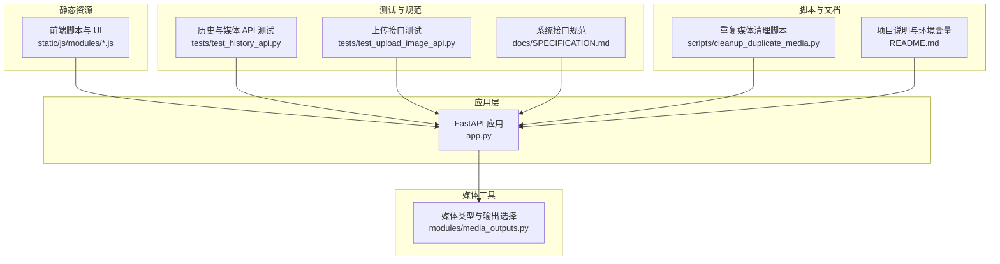
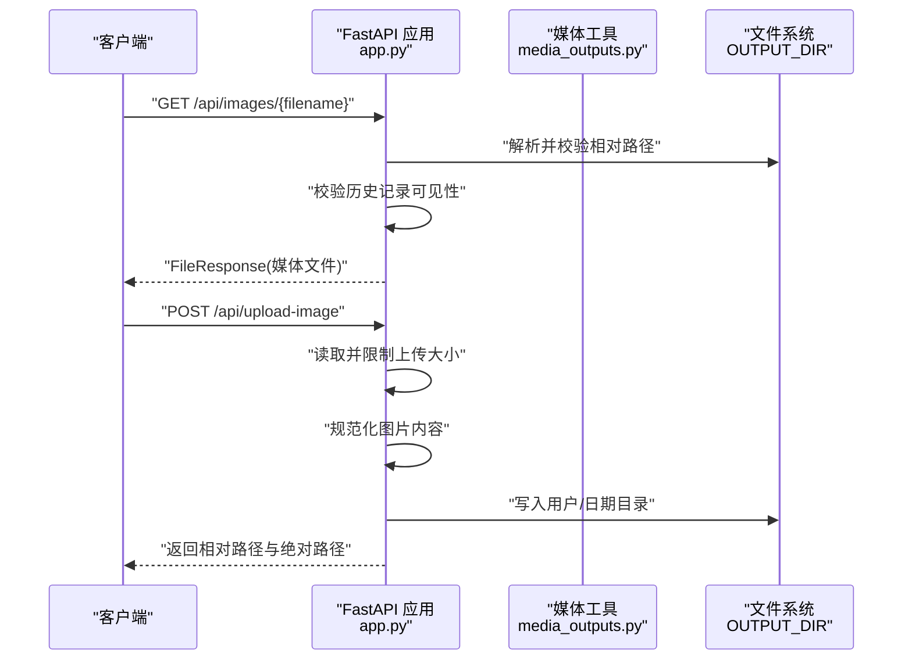
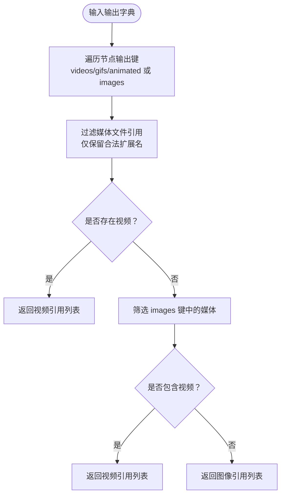
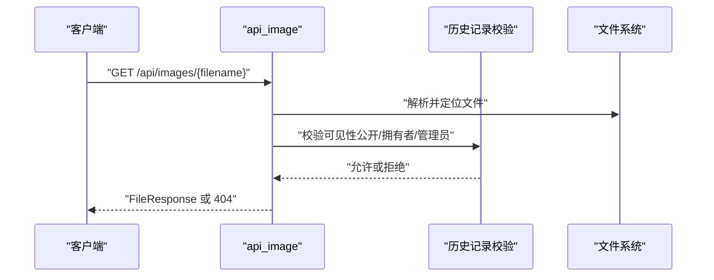
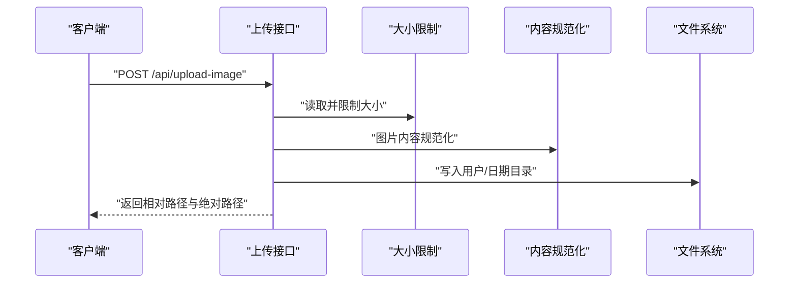
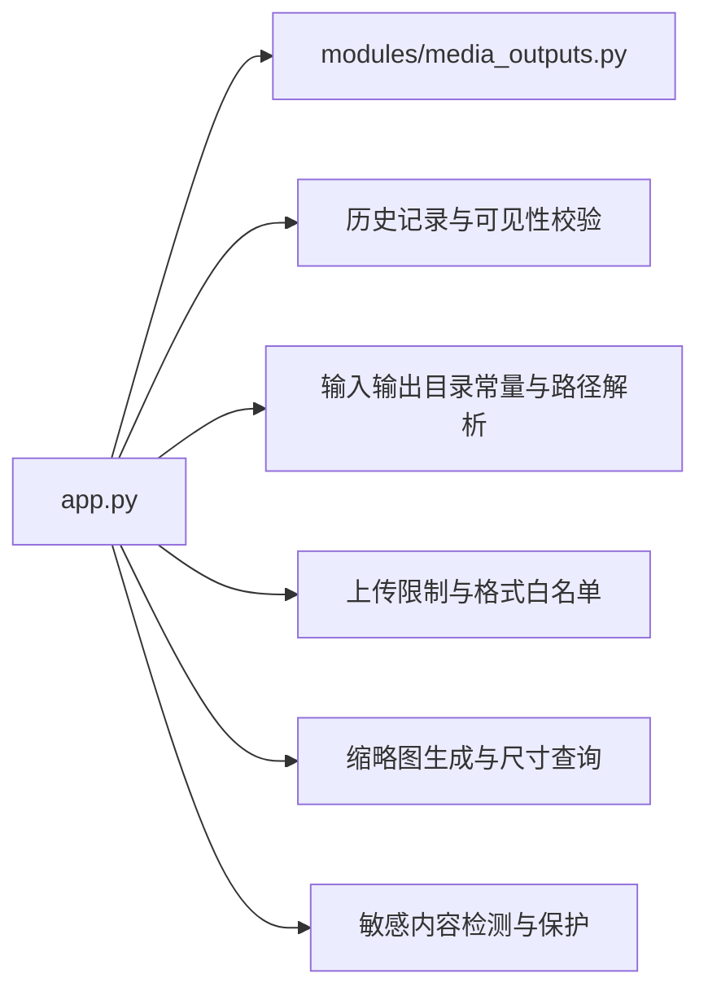

# 媒体 API

<cite>
**本文引用的文件**
- [app.py](file://app.py)
- [media_outputs.py](file://modules/media_outputs.py)
- [SPECIFICATION.md](file://docs/SPECIFICATION.md)
- [test_history_api.py](file://tests/test_history_api.py)
- [test_upload_image_api.py](file://tests/test_upload_image_api.py)
- [cleanup_duplicate_media.py](file://scripts/cleanup_duplicate_media.py)
- [README.md](file://README.md)
</cite>

## 目录
1. [简介](#简介)
2. [项目结构](#项目结构)
3. [核心组件](#核心组件)
4. [架构总览](#架构总览)
5. [详细组件分析](#详细组件分析)
6. [依赖分析](#依赖分析)
7. [性能考虑](#性能考虑)
8. [故障排查指南](#故障排查指南)
9. [结论](#结论)
10. [附录](#附录)

## 简介
本文件为 Ez ComfyUI Showcase 的媒体输出 API 接口文档，覆盖生成结果的存储、预览、下载、清理与批量管理等能力。重点说明以下方面：
- 输出媒体类型识别与选择策略（图像/视频）
- 输入媒体上传接口与限制
- 输出媒体与缩略图的访问控制与可见性校验
- 文件格式支持、尺寸与质量控制
- 批量媒体管理、文件组织与缓存策略
- 安全功能：敏感内容检测、访问控制与权限管理
- 生命周期管理、存储策略与清理机制
- 完整的上传/下载接口与错误处理方案

## 项目结构
媒体相关能力主要由后端 FastAPI 应用集中实现，并通过模块化工具辅助媒体类型判断与输出路径解析。

**图表来源**
- [app.py](file://app.py)
- [media_outputs.py](file://modules/media_outputs.py)
- [SPECIFICATION.md](file://docs/SPECIFICATION.md)
- [test_history_api.py](file://tests/test_history_api.py)
- [test_upload_image_api.py](file://tests/test_upload_image_api.py)
- [cleanup_duplicate_media.py](file://scripts/cleanup_duplicate_media.py)
- [README.md](file://README.md)

**章节来源**
- [app.py](file://app.py)
- [media_outputs.py](file://modules/media_outputs.py)
- [SPECIFICATION.md](file://docs/SPECIFICATION.md)

## 核心组件
- 媒体类型识别与输出选择：根据扩展名自动判定图像或视频，并在多类输出中优先选择视频，否则回退到图像。
- 输出目录与相对路径：统一使用输出根目录，对路径进行安全解析，避免越权访问。
- 访问控制与可见性：所有媒体访问均需满足“拥有者可见”或“公开”的条件，防止未授权访问。
- 输入媒体上传：支持图片与视频上传，带大小限制与格式白名单；上传后按用户/日期组织。
- 缩略图生成与尺寸：支持按需生成缩略图，提供尺寸查询与首帧提取能力。
- 批量管理与清理：提供历史记录的批量操作与重复媒体清理脚本。

**章节来源**
- [media_outputs.py](file://modules/media_outputs.py)
- [app.py](file://app.py)

## 架构总览
媒体 API 的调用链路如下：

**图表来源**
- [app.py](file://app.py)
- [media_outputs.py](file://modules/media_outputs.py)

## 详细组件分析

### 媒体类型识别与输出选择
- 支持的扩展名集合：图像（PNG/JPG/JPEG/WEBP/BMP）、视频（MP4/WEBM/MOV/M4V）。
- 优先级策略：若存在视频类输出则优先返回视频；否则返回图像输出。
- 相对路径解析：将子目录与文件名拼接为统一相对路径，避免路径穿越。

**图表来源**
- [media_outputs.py](file://modules/media_outputs.py)

**章节来源**
- [media_outputs.py](file://modules/media_outputs.py)

### 输出媒体访问接口
- 路径：GET /api/images/{filename}
- 行为：解析相对路径，校验文件存在性，进一步校验历史记录可见性（私有需登录且为拥有者或管理员；公开可匿名访问），返回 FileResponse。
- 媒体类型：根据扩展名自动设置 Content-Type。

**图表来源**
- [app.py](file://app.py)

**章节来源**
- [app.py](file://app.py)

### 缩略图访问接口
- 路径：GET /api/thumbs/{filename}
- 行为：与输出媒体一致的路径解析与可见性校验，返回缩略图文件。
- 默认媒体类型：JPEG。

**章节来源**
- [app.py](file://app.py)

### 输入媒体上传与访问
- 图片上传：POST /api/upload-image
  - 限制：最大大小由环境变量控制；内容会进行安全规范化（必要时转 PNG）。
  - 组织：按用户 ID/日期/时间戳命名，写入 ComfyUI 输入目录。
- 视频上传：POST /api/upload-video
  - 限制：最大大小由环境变量控制；扩展名必须在允许列表内。
- 输入媒体访问：
  - GET /api/input-image/{filename}：返回图片文件。
  - GET /api/input-video/{filename}：返回视频文件。

**图表来源**
- [app.py](file://app.py)

**章节来源**
- [app.py](file://app.py)

### 历史记录与可见性控制
- 历史接口：GET /api/history 及其相关批量操作接口。
- 可见性规则：
  - 私有媒体：仅拥有者或管理员可见。
  - 公开媒体：匿名可直接访问。
- 视频媒体类型持久化：历史记录中明确记录 media_type 字段，确保前端正确渲染。

**章节来源**
- [SPECIFICATION.md](file://docs/SPECIFICATION.md)
- [test_history_api.py](file://tests/test_history_api.py)

### 敏感内容检测与保护
- 在生成流程中集成敏感内容检测与保护策略，检测到风险时生成受保护的媒体与缩略图。
- 历史记录中记录 protection_status 与 protection_source，便于前端展示与审计。

**章节来源**
- [test_history_api.py](file://tests/test_history_api.py)

### 尺寸与质量控制
- 尺寸查询：支持查询图像与视频首帧的尺寸信息，用于前端预览与布局适配。
- 质量控制：上传图片时可进行安全规范化（如转 PNG），以保证兼容性与安全性。

**章节来源**
- [app.py](file://app.py)

### 批量媒体管理与文件组织
- 批量操作：历史接口提供批量软删除、恢复、永久删除、公开/隐藏等能力。
- 文件组织：输出与输入媒体按用户/日期分层组织，便于检索与清理。
- 重复媒体清理：提供重复媒体检测与清理脚本，支持生成清理清单与应用执行。

**章节来源**
- [SPECIFICATION.md](file://docs/SPECIFICATION.md)
- [cleanup_duplicate_media.py](file://scripts/cleanup_duplicate_media.py)

### 存储策略与生命周期管理
- 输出目录：默认位于 data/outputs，可通过环境变量覆盖。
- 生命周期：生成完成后写入历史记录，结合可见性策略决定访问范围；支持回收站与永久删除。
- 清理机制：定期维护与脚本清理相结合，避免磁盘膨胀。

**章节来源**
- [README.md](file://README.md)
- [app.py](file://app.py)

## 依赖分析
媒体 API 的关键依赖关系如下：

**图表来源**
- [app.py](file://app.py)
- [media_outputs.py](file://modules/media_outputs.py)

**章节来源**
- [app.py](file://app.py)
- [media_outputs.py](file://modules/media_outputs.py)

## 性能考虑
- 上传限速与分块读取：通过分块读取与大小限制，避免内存峰值过高。
- 缓存策略：缩略图与媒体文件采用静态文件响应，浏览器与代理层可缓存；建议在网关层开启缓存头。
- 并发与队列：生成任务与下载过程在后台队列中执行，避免阻塞主请求线程。
- 视频处理：视频生成耗时较长，建议在历史记录中记录预计耗时与阶段超时策略。

## 故障排查指南
- 404 未找到：确认 filename 是否为 OUTPUT_DIR 下的相对路径，且历史记录可见。
- 403 权限不足：检查当前用户是否为媒体拥有者或管理员；公开媒体可匿名访问。
- 413 请求实体过大：检查 EZ_UPLOAD_IMAGE_MAX_BYTES/EZ_UPLOAD_VIDEO_MAX_BYTES 环境变量与实际上传大小。
- 400 路径非法：确认上传路径未越权（仅允许 COMFYUI_INPUT 根目录内）。
- 视频无法播放：确认扩展名在允许列表内，且媒体文件完整可读。

**章节来源**
- [app.py](file://app.py)
- [test_upload_image_api.py](file://tests/test_upload_image_api.py)

## 结论
Ez ComfyUI Showcase 的媒体 API 通过清晰的类型识别、严格的访问控制与可见性校验、完善的上传限制与格式白名单，以及可扩展的批量管理与清理脚本，构建了安全、稳定、易用的媒体输出体系。配合敏感内容检测与生命周期管理策略，能够满足生产环境下的媒体管理需求。

## 附录

### 接口一览（按功能分组）
- 上传
  - POST /api/upload-image：上传参考图片（含大小限制与内容规范化）
  - POST /api/upload-video：上传参考视频（含大小限制与格式白名单）
- 输入媒体访问
  - GET /api/input-image/{filename}：获取输入图片
  - GET /api/input-video/{filename}：获取输入视频
- 输出媒体与缩略图
  - GET /api/images/{filename}：获取输出媒体（受历史记录可见性控制）
  - GET /api/thumbs/{filename}：获取缩略图（受历史记录可见性控制）
- 历史与批量管理
  - GET /api/history：历史列表（分页/筛选）
  - POST /api/history：手动添加历史
  - GET /api/history/summary：历史统计摘要
  - GET /api/history/user-counts：按用户统计
  - GET /api/history/{item_id}：单条详情
  - DELETE /api/history/{item_id}：软删除
  - POST /api/history/{item_id}/restore：恢复
  - POST /api/history/{item_id}/permanent-delete：永久删除
  - POST /api/history/{item_id}/share：公开/取消公开
  - POST /api/history/{item_id}/hide：隐藏
  - POST /api/history/{item_id}/video-frame：提取视频帧
  - POST /api/history/batch-*：批量操作
  - POST /api/history/trash/clear：清空回收站
  - DELETE /api/history：清空全部历史

**章节来源**
- [SPECIFICATION.md](file://docs/SPECIFICATION.md)