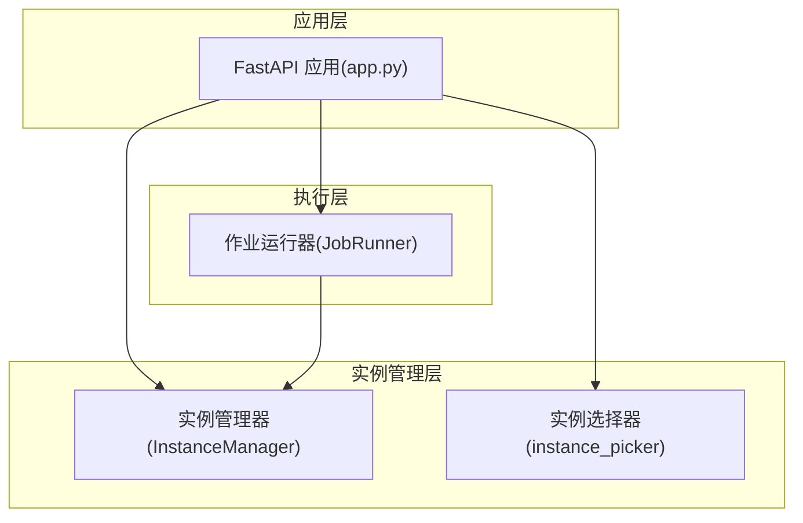
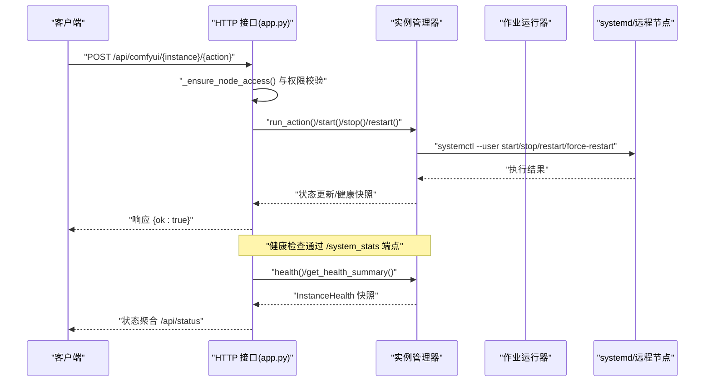
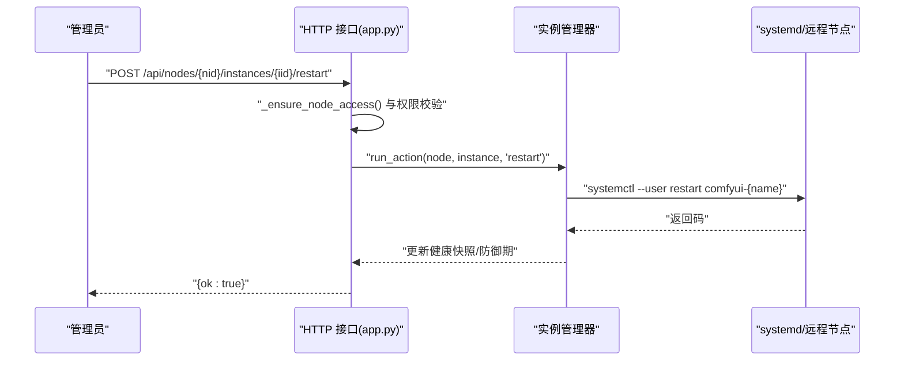
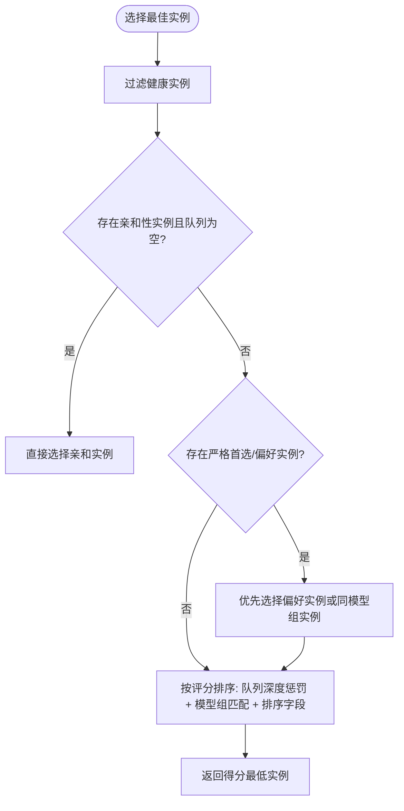
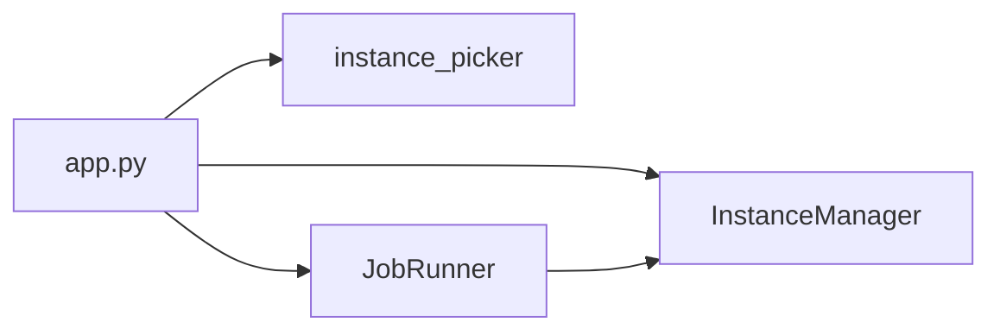

# 实例 API

<cite>
**本文档引用的文件**
- [app.py](file://app.py)
- [instance_manager.py](file://modules/instance_manager.py)
- [instance_picker.py](file://modules/instance_picker.py)
- [job_runner.py](file://modules/job_runner.py)
</cite>

## 目录
1. [简介](#简介)
2. [项目结构](#项目结构)
3. [核心组件](#核心组件)
4. [架构总览](#架构总览)
5. [详细组件分析](#详细组件分析)
6. [依赖分析](#依赖分析)
7. [性能考量](#性能考量)
8. [故障排查指南](#故障排查指南)
9. [结论](#结论)
10. [附录](#附录)

## 简介
本文件面向 Ez ComfyUI Showcase 的“实例管理 API”，系统化梳理与 ComfyUI 实例相关的能力边界：包括实例状态查询、健康检查、启动/停止/重启控制、配置管理、实例发现与连接管理、负载均衡与路由策略、监控与资源使用查询、故障诊断、实例分组与优先级、故障转移与空闲回收、以及与之配套的超时与连接池相关的设计要点。本文同时给出接口规范、调用流程图与排障建议，帮助开发者与运维人员快速落地与稳定运行。

## 项目结构
围绕实例管理的关键代码分布在以下模块：
- 应用入口与路由：app.py 提供实例控制与状态查询的 HTTP 接口，并集成实例健康检查、队列统计、GPU 监测等能力。
- 实例生命周期与健康：modules/instance_manager.py 提供统一的实例启动、停止、重启、强制重启、健康检查、空闲回收、死实例检测等能力。
- 实例选择与路由：modules/instance_picker.py 提供基于工作流类型、模型组、实例亲和性与队列深度的路由策略。
- 作业执行与实例交互：modules/job_runner.py 通过实例管理器与实例进行协作，驱动生成任务的调度与回退。

图表来源
- [app.py](file://app.py)
- [instance_manager.py](file://modules/instance_manager.py)
- [instance_picker.py](file://modules/instance_picker.py)
- [job_runner.py](file://modules/job_runner.py)

章节来源
- [app.py](file://app.py)
- [instance_manager.py](file://modules/instance_manager.py)
- [instance_picker.py](file://modules/instance_picker.py)
- [job_runner.py](file://modules/job_runner.py)

## 核心组件
- 实例管理器（InstanceManager）
  - 职责：统一管理实例的冷启动、健康检查、空闲回收、死实例检测；维护健康快照、启动/停止/重启状态机；提供幂等启动与强制重启能力。
  - 关键能力：健康检查缓存、防御期保护、后台死实例检测与空闲回收协程、systemctl 驱动的生命周期操作。
- 实例选择器（instance_picker）
  - 职责：根据工作流类型、模型组、实例亲和性与队列深度，对可用实例进行评分与排序，输出最佳实例。
  - 关键能力：严格首选实例、模型组匹配惩罚、队列深度惩罚、实例排序与亲和性优先。
- 作业运行器（JobRunner）
  - 职责：与实例管理器协作，执行生成任务的调度、实例动作触发、GPU 静止检测与自动重启、任务超时与中断处理。
  - 关键能力：任务状态机、GPU 活跃度监测、实例动作回调、日志与广播。

章节来源
- [instance_manager.py](file://modules/instance_manager.py)
- [instance_picker.py](file://modules/instance_picker.py)
- [job_runner.py](file://modules/job_runner.py)

## 架构总览
实例管理 API 的调用链路如下：
- 管理员/用户通过 HTTP 接口发起实例控制请求（启动/停止/重启/强制重启）。
- 应用层解析请求并调用内部实例动作执行函数，必要时通过 systemd 或远程节点执行。
- 实例管理器负责健康检查与状态缓存，保障“实例能否用”的权威判断。
- 作业运行器在生成过程中与实例交互，执行 GPU 静止检测与自动重启、任务超时处理。
- 状态查询接口聚合实例健康、队列、GPU 使用与任务状态，提供统一视图。

图表来源
- [app.py](file://app.py)
- [instance_manager.py](file://modules/instance_manager.py)

## 详细组件分析

### 实例状态查询与健康检查
- 接口
  - GET /api/status
    - 功能：返回节点与实例的实时状态、队列统计、GPU 使用、当前任务等聚合信息。
    - 参数：target_node_id、target_instance（可选，用于聚焦特定节点或实例）。
    - 返回：包含节点与实例状态、队列运行/等待数量、GPU 统计、当前任务等。
  - GET /api/nodes
    - 功能：列出所有启用节点及其实例状态概览（运行/空闲/离线/异常）。
- 健康检查机制
  - 实例健康通过访问 /system_stats 端点判断（超时与异常即视为不健康）。
  - 健康检查结果带缓存（默认 15 秒），可通过 force 刷新。
  - 实例进程 PID 与当前模型组会随健康快照返回，便于诊断。
- 资源使用与监控
  - GPU 使用率、显存占用、采样进度、当前节点等信息在状态接口中聚合展示。
  - 作业运行器具备 GPU 静止检测（连续 N 秒无波动）与自动重启策略。

章节来源
- [app.py](file://app.py)
- [instance_manager.py](file://modules/instance_manager.py)

### 实例控制接口（启动/停止/重启/强制重启）
- 管理端控制
  - POST /api/comfyui/start
    - 功能：启动全部启用的实例。
    - 权限：管理员。
  - POST /api/comfyui/stop
    - 功能：停止全部启用的实例。
    - 权限：管理员。
  - POST /api/comfyui/{instance}/{action}
    - 功能：对指定实例执行 start/stop。
    - 参数：instance（A/B）、action（start/stop）。
    - 权限：管理员。
  - POST /api/nodes/{nid}/instances/{iid}/start
    - 功能：在节点维度启动指定实例。
    - 权限：需要管理权限（或视访问策略而定）。
  - POST /api/nodes/{nid}/instances/{iid}/stop
    - 功能：在节点维度停止指定实例。
    - 权限：需要管理权限。
  - POST /api/nodes/{nid}/instances/{iid}/restart
    - 功能：在节点维度重启指定实例。
    - 权限：需要管理权限。
  - POST /api/nodes/{nid}/instances/{iid}/force-restart
    - 功能：在节点维度强制重启（先杀进程再启动）。
    - 权限：需要管理权限。
- 执行机制
  - 本地实例：通过 systemd --user 控制服务（需正确设置 DBUS_SESSION_BUS_ADDRESS/XDG_RUNTIME_DIR）。
  - 远程实例：通过节点配置的连接方式（如 SSH/远程 HTTP）执行实例动作（部分动作在远程 HTTP 模式下受限）。
  - 实例动作会清除健康缓存、更新防御期与活跃时间戳，确保后续健康检查与调度准确。

图表来源
- [app.py](file://app.py)
- [instance_manager.py](file://modules/instance_manager.py)

章节来源
- [app.py](file://app.py)
- [instance_manager.py](file://modules/instance_manager.py)

### 实例发现、连接管理与负载均衡
- 实例发现
  - 实例来源于节点配置（config/nodes.json），应用启动时加载并缓存，支持按用户权限过滤可见实例。
  - 实例 API 基础 URL 由节点访问配置决定（直连或代理模板），支持按端口替换。
- 连接管理
  - 本地实例通过 systemd 管理；远程实例通过节点连接方式（SSH/远程 HTTP）执行动作。
  - 远程 HTTP 模式下，部分实例动作受限（例如无法直接启动/停止）。
- 负载均衡与路由
  - 基于工作流类型（T2I/I2I/T2V/I2V/放大/种子 VR 等）与模型组进行偏好与惩罚评分。
  - 支持严格首选实例（不允许溢出）与亲和性实例（优先分配给固定实例）。
  - 综合考虑实例队列深度、模型组匹配、实例排序字段与评分权重，输出最优实例。

图表来源
- [instance_picker.py](file://modules/instance_picker.py)

章节来源
- [app.py](file://app.py)
- [instance_picker.py](file://modules/instance_picker.py)

### 实例分组管理、优先级与故障转移
- 实例分组
  - 实例当前加载的模型组来自健康快照；实例选择器支持按模型组匹配进行评分与惩罚。
- 优先级设置
  - 实例排序字段（sort_order）参与最终排序，数值越小优先级越高。
  - 工作流类型映射到偏好实例（如 T2I/I2I/视频/放大等），并设置压力系数影响惩罚幅度。
- 故障转移
  - 当实例健康检查失败且服务处于 active 状态时，后台死实例检测协程会尝试重启。
  - 作业运行器在 GPU 静止检测后，可触发实例重启并重新派发任务。
  - 实例停止时，针对“未提交至远端”的活动任务进行中断处理与重排。

章节来源
- [instance_manager.py](file://modules/instance_manager.py)
- [instance_picker.py](file://modules/instance_picker.py)
- [job_runner.py](file://modules/job_runner.py)

### 监控、资源使用与故障诊断
- 监控指标
  - 健康状态（up）、最后检查时间、模型组、进程 PID。
  - GPU 使用率、显存占用、采样进度、当前节点与当前任务。
  - 队列运行/等待数量、实例活跃时间、防御期状态。
- 故障诊断
  - 健康检查失败：检查 /system_stats 可达性、systemd 服务状态、进程 PID。
  - 实例停止导致任务中断：区分已提交远端的任务与本地未提交任务，前者保留等待恢复，后者中断并重排。
  - GPU 静止：连续 N 秒无波动，自动重启实例并重试任务。
  - 日志：状态变更、实例动作、任务超时、GPU 静止等均有日志记录，便于定位问题。

章节来源
- [app.py](file://app.py)
- [instance_manager.py](file://modules/instance_manager.py)
- [job_runner.py](file://modules/job_runner.py)

### 配置参数、连接池与超时设置
- 实例生命周期与健康检查
  - 启动超时：冷启动等待就绪的最大时间。
  - 防御期：刚启动后的保护窗口，避免误判死实例。
  - 健康检查缓存：默认 15 秒，可强制刷新。
  - 空闲回收：超过阈值未活跃则停止实例。
  - 死实例检测：周期性扫描 systemd active 且健康检查失败的实例，尝试重启。
- 连接与超时
  - 健康检查 HTTP 超时：默认 5 秒。
  - systemd 调用超时：默认 10 秒。
  - 远程节点动作超时：取决于具体实现（systemd 默认 10 秒）。
- 连接池与复用
  - 代码中未见专用连接池实现；健康检查与实例动作采用短连接方式，通过 systemd 与 HTTP 端点交互。
- 超时与重试
  - 生成任务阶段超时策略：不同阶段有不同的超时阈值；视频类任务有额外延长。
  - GPU 静止重试：最多 N 次，每次重试后重新派发任务。

章节来源
- [instance_manager.py](file://modules/instance_manager.py)
- [app.py](file://app.py)

## 依赖分析
- 模块耦合
  - app.py 依赖 InstanceManager 与 instance_picker，用于实例控制与路由决策。
  - job_runner 依赖 InstanceManager 与 app 层的实例动作回调，形成“调度—执行—实例动作”的闭环。
- 外部依赖
  - systemd --user：本地实例生命周期控制。
  - HTTP 端点：/system_stats 用于健康检查。
  - 数据持久化：SQLite 用户与历史记录、日志文件。

图表来源
- [app.py](file://app.py)
- [instance_manager.py](file://modules/instance_manager.py)
- [instance_picker.py](file://modules/instance_picker.py)
- [job_runner.py](file://modules/job_runner.py)

章节来源
- [app.py](file://app.py)
- [instance_manager.py](file://modules/instance_manager.py)
- [instance_picker.py](file://modules/instance_picker.py)
- [job_runner.py](file://modules/job_runner.py)

## 性能考量
- 健康检查缓存：减少频繁 HTTP 请求，降低对实例的压力。
- 后台协程：死实例检测与空闲回收以较低频率轮询，避免高频扫描。
- 队列深度与评分：通过评分惩罚避免热点实例过载，提升整体吞吐。
- GPU 静止检测：及时发现卡死实例并自动恢复，减少人工干预。

## 故障排查指南
- 实例无法启动
  - 检查 systemd 服务状态与日志；确认 DBUS_SESSION_BUS_ADDRESS/XDG_RUNTIME_DIR 设置正确。
  - 若冷启动超时，尝试强制重启（force-restart）以清理残留进程。
- 实例健康检查失败
  - 检查 /system_stats 可达性与网络连通性；查看健康快照中的 PID 与模型组。
  - 若 systemd 服务 active 但健康检查失败，后台协程会尝试重启；若无效，手动执行 restart/force-restart。
- 任务长时间无响应
  - 检查 GPU 使用率与采样进度；若出现静止，系统会自动重启实例并重试任务。
  - 对视频类任务，注意生成阶段超时阈值更高。
- 实例停止导致任务中断
  - 已提交远端的任务会保留等待恢复；未提交的任务会被中断并重新派发。
- 权限与节点访问
  - 远程 HTTP 模式下部分动作受限；确保节点连接方式与权限配置正确。

章节来源
- [app.py](file://app.py)
- [instance_manager.py](file://modules/instance_manager.py)
- [job_runner.py](file://modules/job_runner.py)

## 结论
实例管理 API 以 InstanceManager 为核心，结合 app.py 的路由与 job_runner 的执行闭环，提供了从健康检查、负载均衡、故障转移、资源监控到超时与重试的完整能力集。通过严格的权限控制、缓存与后台协程设计，系统在保证稳定性的同时兼顾了性能与可观测性。建议在生产环境中配合完善的日志与告警体系，持续优化实例分组与路由策略，以获得更优的吞吐与延迟表现。

## 附录
- 接口清单（摘要）
  - GET /api/status：实例与节点状态聚合
  - GET /api/nodes：节点与实例状态概览
  - POST /api/comfyui/start | /api/comfyui/stop：批量实例控制
  - POST /api/comfyui/{instance}/{action}：单实例控制
  - POST /api/nodes/{nid}/instances/{iid}/start | /stop | /restart | /force-restart：节点维度实例控制
- 关键术语
  - 健康检查：通过 /system_stats 端点判断实例可达性。
  - 防御期：实例刚启动后的保护窗口，避免误判。
  - 严格首选：工作流必须在指定实例上执行，不允许溢出。
  - GPU 静止：连续 N 秒无 GPU 波动，触发自动重启与重试。