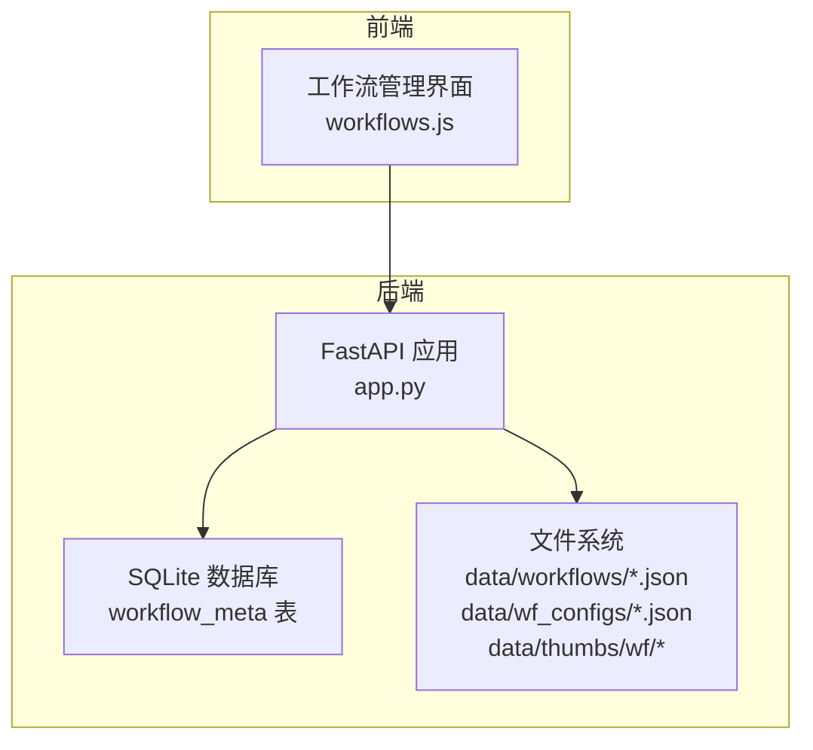
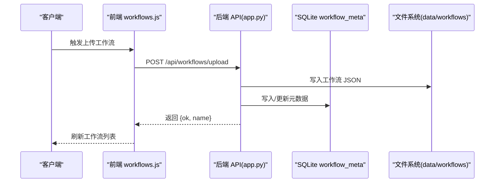
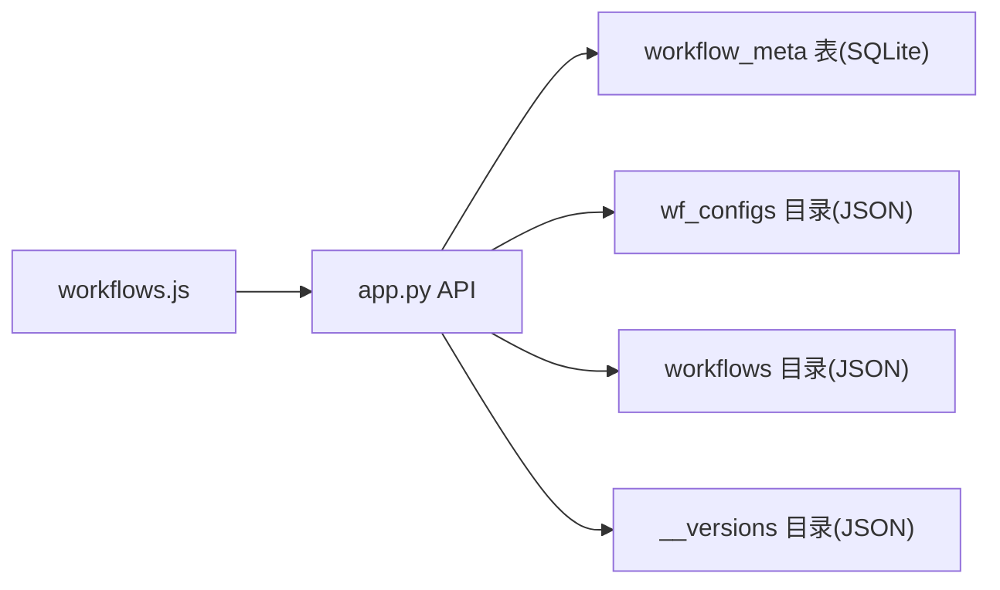

# 工作流 API

<cite>
**本文引用的文件**   
- [app.py](file://app.py)
- [workflows.js](file://static/js/modules/workflows.js)
- [workflow-storage-architecture-plan.md](file://docs/workflow-storage-architecture-plan.md)
- [gen_wf_configs.py](file://scripts/gen_wf_configs.py)
- [test_security_controls.py](file://tests/test_security_controls.py)
</cite>

## 目录
1. [简介](#简介)
2. [项目结构](#项目结构)
3. [核心组件](#核心组件)
4. [架构总览](#架构总览)
5. [详细组件分析](#详细组件分析)
6. [依赖分析](#依赖分析)
7. [性能考虑](#性能考虑)
8. [故障排查指南](#故障排查指南)
9. [结论](#结论)
10. [附录](#附录)

## 简介
本文件为 Ez ComfyUI Showcase 的工作流管理 API 完整接口文档，覆盖工作流的创建、读取、更新、删除；文件上传与下载；版本管理；共享与元数据；目录管理；配置文件格式；以及权限控制与访问限制。同时补充批量操作、导入导出、模板管理、状态管理与错误处理建议，帮助开发者与运维人员快速集成与维护。

## 项目结构
- 后端服务：基于 FastAPI 的应用，集中于 app.py，提供工作流相关 API。
- 前端交互：静态资源位于 static/js/modules/workflows.js，负责调用后端 API 并渲染界面。
- 数据存储：工作流元数据采用 SQLite 表 workflow_meta 存储，兼容旧版 wf_meta.json；工作流配置采用 data/wf_configs 目录下的 JSON 文件；版本文件存放在 data/workflows/__versions/<basename> 目录。
- 文档与脚本：docs/workflow-storage-architecture-plan.md 描述了未来数据库化迁移规划；scripts/gen_wf_configs.py 提供生成节点编辑器配置的工具。

图表来源
- [app.py](file://app.py)
- [workflows.js](file://static/js/modules/workflows.js)

章节来源
- [app.py](file://app.py)
- [workflows.js](file://static/js/modules/workflows.js)

## 核心组件
- 工作流元数据（workflow_meta）：包含名称、标签、所有者、共享状态、来源路径、排序、活动版本、版本映射等字段，支持按用户权限过滤可见性。
- 工作流配置（wf_configs）：每个工作流可有独立的编辑器配置 JSON，用于定义节点字段布局与默认值。
- 版本管理：以 __versions 目录存放历史版本，支持上传新版本、激活版本、列出版本。
- 目录管理：维护多个工作流根目录，支持增删目录并统计 JSON 数量。
- 权限控制：区分普通用户与管理员，部分操作（如共享切换、配置写入、版本管理）仅管理员可用。

章节来源
- [app.py](file://app.py)
- [workflow-storage-architecture-plan.md](file://docs/workflow-storage-architecture-plan.md)

## 架构总览
后端通过 RESTful API 暴露工作流能力，前端通过 workflows.js 调用这些接口。元数据持久化在 SQLite，配置与文件落盘到 data 目录，版本文件单独归档。

图表来源
- [app.py](file://app.py)
- [workflows.js](file://static/js/modules/workflows.js)

## 详细组件分析

### 1) 工作流文件上传与下载
- 上传工作流
  - 方法与路径：POST /api/workflows/upload
  - 请求体：multipart/form-data，字段 file（JSON 文件）
  - 限制：文件必须为 .json，大小不超过 EZ_UPLOAD_WORKFLOW_MAX_BYTES（默认 10MB），内容需为合法 JSON
  - 成功响应：返回 {ok: true, name: "xxx.json"}
  - 元数据：若首次上传，自动填充 name、tags、source、source_path、owner_id、shared=false，并写入数据库与导出镜像文件
- 下载工作流
  - 方法与路径：GET /api/workflows/{name}/download
  - 权限：需具备查看权限
  - 响应：返回 JSON 文件（application/json）

章节来源
- [app.py](file://app.py)
- [workflows.js](file://static/js/modules/workflows.js)

### 2) 工作流读取与分析
- 获取工作流字段（解析节点字段结构）
  - 方法与路径：GET /api/workflows/{name}/fields
  - 权限：需具备查看权限
- 分析工作流（计算节点依赖/执行计划等）
  - 方法与路径：GET /api/workflows/{name}/analyze
  - 权限：需具备查看权限

章节来源
- [app.py](file://app.py)

### 3) 工作流元数据管理
- 列表与自动补全
  - 方法与路径：GET /api/workflows/meta
  - 权限：可选登录（匿名时仅可见公开项）
  - 行为：扫描所有工作流目录，合并元数据，自动补全缺失的 name/tags，按权限过滤
- 更新元数据
  - 方法与路径：PUT /api/workflows/meta/{filename}
  - 权限：需具备管理权限
  - 支持字段：name、tags、shared（仅管理员）
  - 影响：写入数据库并导出镜像文件
- 删除元数据
  - 方法与路径：DELETE /api/workflows/meta/{filename}
  - 权限：需具备管理权限
  - 影响：删除条目并导出镜像文件

章节来源
- [app.py](file://app.py)

### 4) 工作流重命名
- 方法与路径：PUT /api/workflows/{filename}/rename
- 请求体：{ name: "新名称" }
- 权限：需具备管理权限
- 影响：更新元数据中的 name 字段并导出镜像文件

章节来源
- [app.py](file://app.py)

### 5) 工作流删除
- 方法与路径：DELETE /api/workflows/{name}
- 权限：需具备管理权限
- 行为：删除文件与对应元数据条目

章节来源
- [app.py](file://app.py)

### 6) 工作流缩略图
- 上传缩略图
  - 方法与路径：POST /api/workflows/meta/thumbnail
  - 请求体：multipart/form-data，字段 filename（目标工作流名）、file（图片）
  - 限制：支持 .png/.jpg/.jpeg/.webp/.bmp，大小不超过 EZ_UPLOAD_IMAGE_MAX_BYTES（默认 50MB）
  - 权限：需具备管理权限
  - 响应：返回 {ok: true, thumbnail: "相对路径"}
- 获取缩略图
  - 方法与路径：GET /api/workflows/thumbnail/{name:path}
  - 响应：返回图片文件，带无缓存头

章节来源
- [app.py](file://app.py)

### 7) 工作流配置管理
- 读取配置
  - 方法与路径：GET /api/workflows/{name}/config
  - 权限：可选登录（匿名时可能 404）
- 写入配置
  - 方法与路径：PUT /api/workflows/{name}/config
  - 权限：管理员
- 删除配置
  - 方法与路径：DELETE /api/workflows/{name}/config
  - 权限：管理员

说明
- 配置文件位于 data/wf_configs/<name>，由 scripts/gen_wf_configs.py 生成示例结构，包含 version、workflow、fields 等字段。

章节来源
- [app.py](file://app.py)
- [gen_wf_configs.py](file://scripts/gen_wf_configs.py)

### 8) 工作流目录管理
- 列出目录
  - 方法与路径：GET /api/workflow-dirs
  - 权限：管理员
  - 响应：数组，每项含 path、exists、count（递归统计 .json 数量）
- 新增目录
  - 方法与路径：POST /api/workflow-dirs
  - 请求体：{ path: "绝对或 ~ 展开路径" }
  - 权限：管理员
  - 限制：重复添加会 409；路径不存在会自动创建
- 删除目录
  - 方法与路径：DELETE /api/workflow-dirs
  - 请求体：查询参数 path
  - 权限：管理员
  - 限制：至少保留一个目录

章节来源
- [app.py](file://app.py)

### 9) 工作流版本管理
- 列出版本
  - 方法与路径：GET /api/workflows/{name}/versions
  - 响应：versions（版本名到文件路径的映射）、active_version、base（当前文件信息）
- 上传新版本
  - 方法与路径：POST /api/workflows/{name}/upload-version
  - 请求体：multipart/form-data，字段 file（JSON）
  - 限制：单次最大 1MB（MAX_WORKFLOW_SIZE），内容需为合法 JSON
  - 权限：管理员
  - 行为：生成 vN 版本号，写入 data/workflows/__versions/<basename>/vN.json，若无版本则复制当前文件作为 v1，并设置 active_version
- 激活版本
  - 方法与路径：POST /api/workflows/{name}/activate-version
  - 请求体：{ version: "vN" }
  - 权限：管理员
  - 行为：将指定版本文件复制回当前工作流文件，更新 active_version

章节来源
- [app.py](file://app.py)
- [test_security_controls.py](file://tests/test_security_controls.py)

### 10) 权限控制与访问限制
- 用户角色
  - 管理员：可执行共享开关、配置写入、版本管理、目录管理等敏感操作
  - 普通用户：可查看、上传、重命名（自身拥有）、删除（自身拥有）、上传缩略图（自身拥有）
- 访问控制
  - 查看/分析/下载：需具备查看权限
  - 管理：需具备管理权限
  - 共享开关：仅管理员可用
- 上传限制
  - 工作流上传：默认最大 10MB
  - 缩略图上传：默认最大 50MB
  - 版本上传：默认最大 1MB
  - 以上限制可通过环境变量覆盖

章节来源
- [app.py](file://app.py)
- [test_security_controls.py](file://tests/test_security_controls.py)

### 11) 批量操作、导入导出与模板管理
- 批量操作
  - 建议：基于现有单文件接口组合实现批量上传/删除/重命名/共享切换，前端 workflows.js 可参考单个操作的调用模式
- 导入导出
  - 导入：通过上传接口批量导入 JSON 文件
  - 导出：通过下载接口逐个导出 JSON 文件
- 模板管理
  - 建议：利用配置文件（wf_configs）与版本管理，为常用工作流提供“模板”与“版本”，通过共享与元数据标签进行分类

章节来源
- [app.py](file://app.py)
- [workflows.js](file://static/js/modules/workflows.js)

### 12) 工作流验证、冲突检测与依赖处理
- 验证
  - JSON 校验：上传与版本上传均要求合法 JSON
  - 大小校验：超过阈值返回 413
- 冲突检测
  - 版本命名：自动生成 vN，避免同名冲突
  - 目录去重：新增目录时检查重复
- 依赖处理
  - 建议：在 /api/workflows/{name}/analyze 中扩展依赖分析逻辑，返回节点依赖关系与执行顺序，前端据此提示

章节来源
- [app.py](file://app.py)
- [test_security_controls.py](file://tests/test_security_controls.py)

### 13) 状态管理与审计日志（建议）
- 现状：共享开关变更会写入日志
- 建议：扩展审计日志表（workflow_audit_log），记录共享、元数据编辑、配置编辑、版本激活等操作，便于追踪与合规

章节来源
- [workflow-storage-architecture-plan.md](file://docs/workflow-storage-architecture-plan.md)

## 依赖分析
- 组件耦合
  - workflows.js 依赖 app.py 的 API 约定
  - app.py 依赖 SQLite（workflow_meta）与文件系统（工作流与配置）
- 外部依赖
  - FastAPI、SQLite、Python 标准库
- 潜在循环依赖
  - 未见直接循环依赖；模块间通过函数调用解耦

图表来源
- [app.py](file://app.py)
- [workflows.js](file://static/js/modules/workflows.js)

## 性能考虑
- 上传分块：_UPLOAD_READ_CHUNK_BYTES 默认 1MB，避免一次性读取过大导致内存压力
- 目录扫描：/api/workflows/meta 会递归扫描所有目录，建议限制目录数量或启用缓存
- 版本文件：版本过多会增加磁盘占用，建议定期清理历史版本
- 缩略图：建议压缩与缓存策略，减少带宽与 CPU 占用

章节来源
- [app.py](file://app.py)

## 故障排查指南
- 400 错误
  - 非 .json 文件或非法 JSON：检查文件类型与内容
  - 缩略图格式不支持：确保为 .png/.jpg/.jpeg/.webp/.bmp
- 403 错误
  - 无权限：确认是否具备管理权限或管理员身份
- 404 错误
  - 工作流/版本不存在：确认 name 与版本名正确
- 413 错误
  - 文件过大：调整 EZ_UPLOAD_*_MAX_BYTES 或拆分文件
- 409 错误
  - 目录已存在：修改为唯一路径

章节来源
- [app.py](file://app.py)
- [test_security_controls.py](file://tests/test_security_controls.py)

## 结论
本文档梳理了 Ez ComfyUI Showcase 的工作流管理 API，覆盖从上传、下载、元数据、配置、版本到目录与权限控制的完整链路。建议在生产环境中结合审计日志、缓存与安全策略，持续优化性能与可观测性。

## 附录

### A. API 一览（按功能分组）
- 文件管理
  - POST /api/workflows/upload
  - GET /api/workflows/{name}/download
  - GET /api/workflows/{name}/fields
  - GET /api/workflows/{name}/analyze
- 元数据管理
  - GET /api/workflows/meta
  - PUT /api/workflows/meta/{filename}
  - DELETE /api/workflows/meta/{filename}
  - PUT /api/workflows/{filename}/rename
  - DELETE /api/workflows/{name}
- 缩略图
  - POST /api/workflows/meta/thumbnail
  - GET /api/workflows/thumbnail/{name:path}
- 配置
  - GET /api/workflows/{name}/config
  - PUT /api/workflows/{name}/config
  - DELETE /api/workflows/{name}/config
- 目录
  - GET /api/workflow-dirs
  - POST /api/workflow-dirs
  - DELETE /api/workflow-dirs
- 版本
  - GET /api/workflows/{name}/versions
  - POST /api/workflows/{name}/upload-version
  - POST /api/workflows/{name}/activate-version

章节来源
- [app.py](file://app.py)

### B. 请求与响应示例（路径引用）
- 上传工作流
  - 请求：multipart/form-data，字段 file
  - 响应：{"ok": true, "name": "..."}
  - 参考：[app.py](file://app.py)
- 获取版本列表
  - 请求：无
  - 响应：{"versions": {...}, "active_version": "...", "base": {...}}
  - 参考：[app.py](file://app.py)
- 上传缩略图
  - 请求：multipart/form-data，字段 filename, file
  - 响应：{"ok": true, "thumbnail": "..."}
  - 参考：[app.py](file://app.py)
- 更新元数据
  - 请求：{ name, tags, shared? }
  - 响应：标准化后的元数据对象
  - 参考：[app.py](file://app.py)

章节来源
- [app.py](file://app.py)