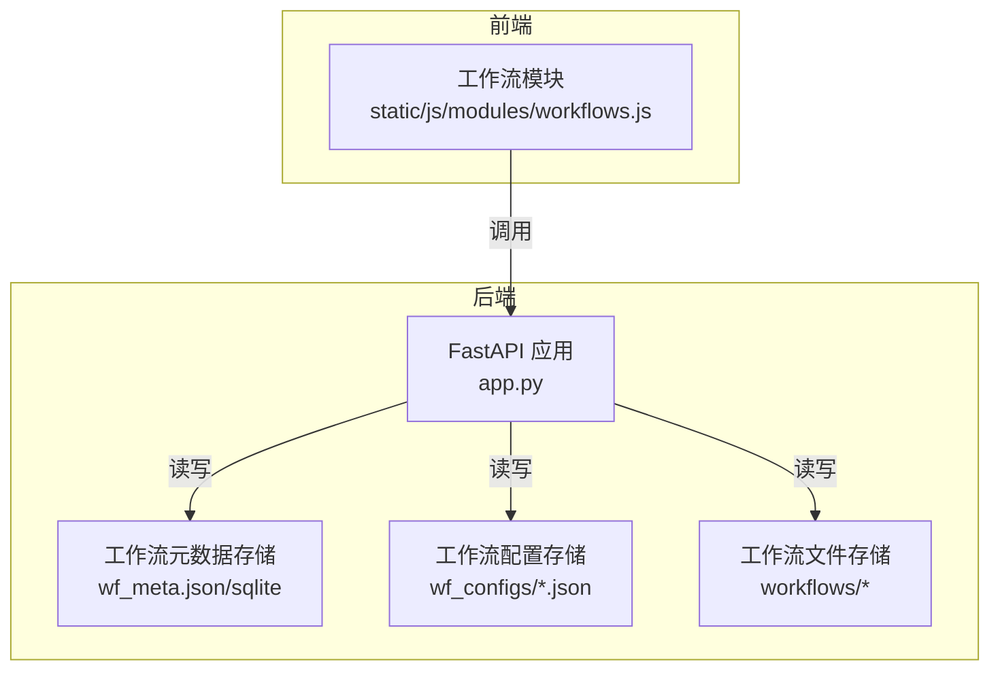
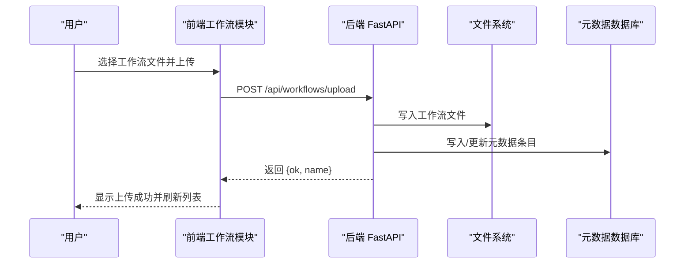
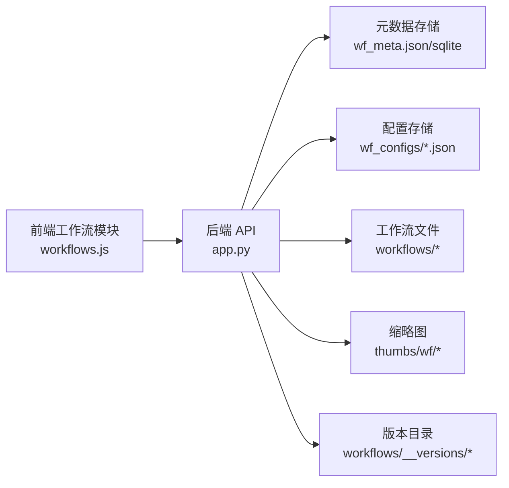

# 工作流 CRUD 操作

<cite>
**本文引用的文件**
- [app.py](file://app.py)
- [workflows.js](file://static/js/modules/workflows.js)
- [workflow_validation.py](file://modules/workflow_validation.py)
</cite>

## 目录
1. [简介](#简介)
2. [项目结构](#项目结构)
3. [核心组件](#核心组件)
4. [架构总览](#架构总览)
5. [详细组件分析](#详细组件分析)
6. [依赖分析](#依赖分析)
7. [性能考虑](#性能考虑)
8. [故障排查指南](#故障排查指南)
9. [结论](#结论)
10. [附录](#附录)

## 简介
本文件面向 Ez ComfyUI Showcase 的“工作流 CRUD 操作”，系统性梳理并规范以下能力：
- 工作流的创建、读取、更新、删除（CRUD）
- 工作流文件的上传、下载、删除接口及安全与校验策略
- 工作流元数据的管理接口（名称、描述、标签、分类、排序、共享等）
- 工作流配置文件的 JSON 结构与验证规则
- 版本化管理（版本列表、激活版本、上传新版本、删除版本）
- 权限控制、访问验证与错误处理策略
- 请求/响应示例与状态码说明

## 项目结构
围绕工作流 CRUD 的关键实现集中在后端应用入口与前端工作流模块中：
- 后端：FastAPI 应用在主入口中定义了大量工作流相关 API
- 前端：工作流管理界面通过 JS 模块调用后端 API 完成上传、编辑、删除、预览等操作
- 校验：工作流提示校验工具用于校验 ComfyUI API Prompt 的连通性与完整性

图表来源
- [app.py](file://app.py)
- [workflows.js](file://static/js/modules/workflows.js)

章节来源
- [app.py](file://app.py)
- [workflows.js](file://static/js/modules/workflows.js)

## 核心组件
- 后端 API 控制器：集中于主应用入口，覆盖工作流枚举、解析、下载、上传、删除、元数据管理、配置管理、版本管理、目录管理、缩略图上传与获取等
- 前端工作流模块：负责 UI 交互、鉴权请求、文件上传、元数据编辑、版本切换与删除等
- 工作流校验工具：对 ComfyUI API Prompt 的连通性进行校验，辅助前端/后端在提交前发现潜在问题

章节来源
- [app.py](file://app.py)
- [workflows.js](file://static/js/modules/workflows.js)
- [workflow_validation.py](file://modules/workflow_validation.py)

## 架构总览
后端采用 FastAPI 提供 REST 接口，前端通过 fetch 调用这些接口。工作流文件与元数据分别持久化到文件系统与数据库（SQLite），并导出为 JSON 便于同步与备份。

图表来源
- [app.py](file://app.py)
- [workflows.js](file://static/js/modules/workflows.js)

## 详细组件分析

### 1) 工作流枚举与查询
- GET /api/workflows
  - 功能：返回所有可见工作流的摘要信息（名称、摘要、模型、字段数量、所在目录、拥有者、是否共享）
  - 访问控制：匿名可访问，但受“可见性”规则约束（见权限控制）
  - 数据来源：扫描工作流目录树，合并元数据，过滤不可见项
  - 响应字段：name、summary、model、field_count、dir、owner_id、shared

- GET /api/workflows/find-closest
  - 功能：根据历史记录中的名称或标签，匹配当前可用工作流
  - 参数：workflow（文件名）、wf_id（元数据 ID）、wf_tags（JSON 数组字符串）
  - 返回：匹配文件名、匹配原因、匹配分数；若无足够匹配则 404

章节来源
- [app.py](file://app.py)

### 2) 工作流详情与分析
- GET /api/workflows/{name}/fields
  - 功能：解析并返回工作流字段定义（字段数量、字段列表等）
  - 权限：按可见性规则校验
  - 失败：404（文件不存在）

- GET /api/workflows/{name}/analyze
  - 功能：分析工作流结构与特性
  - 权限：按可见性规则校验
  - 失败：404（文件不存在）

- GET /api/workflows/{name}/download
  - 功能：下载指定工作流文件
  - 权限：按可见性规则校验
  - 失败：404（文件不存在）

章节来源
- [app.py](file://app.py)

### 3) 工作流上传与删除
- POST /api/workflows/upload
  - 功能：上传新的工作流文件
  - 参数：multipart/form-data，字段 file（.json）
  - 校验：
    - 文件扩展名必须为 .json
    - 读取并限制最大字节数（见上传限制）
    - JSON 解析必须合法
  - 元数据初始化：若元数据不存在，则自动填充 name、tags、source、source_path、owner_id、shared
  - 成功：返回 {ok, name}

- DELETE /api/workflows/{name}
  - 功能：删除工作流文件，并清理元数据
  - 权限：仅允许有管理权限的用户
  - 失败：404（文件不存在）、403（无权限）

章节来源
- [app.py](file://app.py)

### 4) 工作流元数据管理
- GET /api/workflows/meta
  - 功能：返回所有可见工作流的元数据映射
  - 自动补全：首次访问时自动补全缺失的 name/tags/source 等字段
  - 可见性：按用户权限过滤不可见条目

- PUT /api/workflows/meta/{filename}
  - 功能：更新元数据（name、tags、shared）
  - 权限：非管理员仅能更新自己拥有的工作流；shared 字段需管理员权限
  - 日志：记录共享状态变更

- DELETE /api/workflows/meta/{filename}
  - 功能：删除元数据条目
  - 权限：仅允许有管理权限的用户

- POST /api/workflows/meta/sort
  - 功能：批量设置工作流排序顺序
  - 参数：对象，键为文件名，值为排序序号
  - 校验：文件名必须存在且有管理权限

- POST /api/workflows/meta/thumbnail
  - 功能：上传工作流缩略图
  - 参数：multipart/form-data，字段 filename、file
  - 校验：仅允许 PNG/JPG/JPEG/WEBP/BMP；限制最大字节数；仅允许管理权限用户
  - 返回：{ok, thumbnail}

- GET /api/workflows/thumbnail/{name:path}
  - 功能：获取缩略图文件
  - 校验：相对路径安全检查；不存在返回 404
  - 响应：带缓存控制头

- PUT /api/workflows/{filename}/rename
  - 功能：重命名工作流显示名
  - 权限：仅允许有管理权限的用户

章节来源
- [app.py](file://app.py)

### 5) 工作流配置管理
- GET /api/workflows/{name}/config
  - 功能：读取工作流配置 JSON
  - 不存在：返回 404

- PUT /api/workflows/{name}/config
  - 功能：保存工作流配置 JSON
  - 权限：管理员

- DELETE /api/workflows/{name}/config
  - 功能：删除工作流配置
  - 权限：管理员

章节来源
- [app.py](file://app.py)

### 6) 工作流版本管理
- GET /api/workflows/{name}/versions
  - 功能：列出版本映射、活动版本、基础文件路径
  - 自动同步：扫描 __versions 子目录，补充缺失版本

- GET /api/workflows/{name}/version-download
  - 功能：下载指定版本文件（v1/base 为当前工作流，其余为独立版本）
  - 参数：version（默认 v1）
  - 失败：404（版本不存在）

- POST /api/workflows/{name}/upload-version
  - 功能：上传新版本
  - 校验：JSON 合法；限制最大字节数；自动生成版本号 vN
  - 行为：若无版本且存在当前工作流，会复制当前工作流为 v1

- POST /api/workflows/{name}/activate-version
  - 功能：激活某个版本，将该版本内容写回当前工作流文件
  - 权限：管理员

- DELETE /api/workflows/{name}/versions/{version}
  - 功能：删除指定版本
  - 限制：禁止删除 v1/base
  - 行为：若删除的是活动版本，自动回退到 v1

章节来源
- [app.py](file://app.py)

### 7) 工作流目录管理
- GET /api/workflow-dirs
  - 功能：返回已配置的工作流目录列表（是否存在、JSON 数量）

- POST /api/workflow-dirs
  - 功能：新增工作流目录
  - 校验：路径必填、去重、创建目录

- DELETE /api/workflow-dirs
  - 功能：删除工作流目录
  - 校验：路径必填、至少保留一个目录

章节来源
- [app.py](file://app.py)

### 8) 工作流预览与同步
- GET /api/workflows/previews
  - 功能：返回最近生成作业的预览信息（缩略图/输出图）
  - 用途：前端渲染工作流卡片预览

- POST /api/workflows/sync
  - 功能：手动触发远程工作流同步（管理员）
  - 行为：扫描远端节点的 workflow_dirs 并合并元数据

章节来源
- [app.py](file://app.py)

### 9) 前端工作流模块（JS）
- 上传工作流：上传 .json 文件，失败时弹窗提示
- 缩略图上传：表单上传，支持预览与刷新
- 元数据编辑：修改名称、标签、共享状态（管理员）
- 删除工作流：二次确认，删除后刷新网格
- 版本管理：上传新版本、切换活动版本、删除版本
- 目录管理：新增/删除工作流目录
- 预览加载：从后端获取最近预览，支持敏感内容标记

章节来源
- [workflows.js](file://static/js/modules/workflows.js)

### 10) 工作流提示校验（辅助）
- validate_api_prompt：检查 API Prompt 的节点连接与占位输入
- describe_api_prompt_issues：生成中文错误描述，帮助定位缺失节点或占位输入

章节来源
- [workflow_validation.py](file://modules/workflow_validation.py)

## 依赖分析
- 后端依赖
  - FastAPI：定义路由与响应类型
  - SQLite：持久化工作流元数据（通过数据库行转字典）
  - 文件系统：工作流文件、配置文件、缩略图、版本目录
  - 用户认证与权限：依赖 JWT Cookie 与角色（admin）

- 前端依赖
  - fetch：调用后端 API
  - 表单上传：multipart/form-data
  - 本地状态：维护工作流元数据映射与缩略图缓存戳

图表来源
- [app.py](file://app.py)
- [workflows.js](file://static/js/modules/workflows.js)

## 性能考虑
- 列表与元数据加载：扫描多目录并合并元数据，建议合理设置目录数量与层级，避免深度递归导致的 IO 压力
- 上传限制：对上传文件大小进行限制，防止大体积文件占用磁盘与内存
- 缓存控制：缩略图响应设置 no-store，避免浏览器缓存导致的预览不更新
- 版本管理：版本过多会增加磁盘占用，建议定期清理不再使用的版本

## 故障排查指南
- 400 错误
  - 上传文件不是 .json 或 JSON 不合法
  - 目录管理参数缺失或非法
  - 版本管理参数缺失或非法
- 403 错误
  - 无权限访问或管理某工作流（非拥有者或非管理员）
  - 尝试修改共享状态但非管理员
- 404 错误
  - 工作流文件不存在
  - 版本不存在或基础文件不存在
  - 目录不存在
- 409 错误
  - 目录重复添加
- 500/504 错误
  - 同步失败或提示词优化超时/失败

章节来源
- [app.py](file://app.py)

## 结论
本方案提供了完整的工作流 CRUD 能力，涵盖文件上传/下载/删除、元数据管理、配置管理、版本管理与目录管理，并通过权限控制确保安全性。前端模块与后端 API 协同良好，满足日常使用场景。建议在生产环境中结合监控与日志，持续优化扫描与上传性能，并定期清理历史版本与冗余文件。

## 附录

### A. API 规范与示例

- 获取工作流列表
  - 方法：GET
  - 路径：/api/workflows
  - 认证：可选
  - 响应：数组，元素包含 name、summary、model、field_count、dir、owner_id、shared

- 查找最接近的工作流
  - 方法：GET
  - 路径：/api/workflows/find-closest
  - 查询参数：workflow、wf_id、wf_tags
  - 响应：{filename, matched_by, score}

- 获取工作流字段
  - 方法：GET
  - 路径：/api/workflows/{name}/fields
  - 认证：可选
  - 响应：字段定义（数量与列表）

- 分析工作流
  - 方法：GET
  - 路径：/api/workflows/{name}/analyze
  - 认证：可选
  - 响应：分析结果

- 下载工作流
  - 方法：GET
  - 路径：/api/workflows/{name}/download
  - 认证：可选
  - 响应：application/json 文件

- 上传工作流
  - 方法：POST
  - 路径：/api/workflows/upload
  - 表单字段：file（.json）
  - 认证：登录用户
  - 响应：{ok, name}

- 删除工作流
  - 方法：DELETE
  - 路径：/api/workflows/{name}
  - 认证：有管理权限的用户
  - 响应：{ok}

- 获取工作流元数据
  - 方法：GET
  - 路径：/api/workflows/meta
  - 认证：可选
  - 响应：映射 {filename: 元数据}

- 更新工作流元数据
  - 方法：PUT
  - 路径：/api/workflows/meta/{filename}
  - 认证：登录用户
  - 请求体：name、tags、shared（可选，共享需管理员）
  - 响应：保存后的元数据

- 删除工作流元数据
  - 方法：DELETE
  - 路径：/api/workflows/meta/{filename}
  - 认证：有管理权限的用户
  - 响应：{ok}

- 设置工作流排序
  - 方法：POST
  - 路径：/api/workflows/meta/sort
  - 认证：登录用户
  - 请求体：{filename: order}
  - 响应：{ok, meta}

- 上传缩略图
  - 方法：POST
  - 路径：/api/workflows/meta/thumbnail
  - 表单字段：filename、file（PNG/JPG/JPEG/WEBP/BMP）
  - 认证：登录用户
  - 响应：{ok, thumbnail}

- 获取缩略图
  - 方法：GET
  - 路径：/api/workflows/thumbnail/{name:path}
  - 认证：可选
  - 响应：图片文件（带缓存控制）

- 重命名工作流
  - 方法：PUT
  - 路径：/api/workflows/{filename}/rename
  - 认证：有管理权限的用户
  - 请求体：{name}
  - 响应：更新后的元数据

- 获取工作流配置
  - 方法：GET
  - 路径：/api/workflows/{name}/config
  - 认证：可选
  - 响应：配置 JSON

- 更新工作流配置
  - 方法：PUT
  - 路径：/api/workflows/{name}/config
  - 认证：管理员
  - 请求体：配置 JSON
  - 响应：{ok}

- 删除工作流配置
  - 方法：DELETE
  - 路径：/api/workflows/{name}/config
  - 认证：管理员
  - 响应：{ok}

- 获取版本列表
  - 方法：GET
  - 路径：/api/workflows/{name}/versions
  - 认证：可选
  - 响应：{versions, active_version, base}

- 下载指定版本
  - 方法：GET
  - 路径：/api/workflows/{name}/version-download
  - 查询参数：version（默认 v1）
  - 认证：可选
  - 响应：application/json 文件

- 上传新版本
  - 方法：POST
  - 路径：/api/workflows/{name}/upload-version
  - 表单字段：file（.json）
  - 认证：管理员
  - 响应：{ok, version, versions}

- 激活版本
  - 方法：POST
  - 路径：/api/workflows/{name}/activate-version
  - 认证：管理员
  - 请求体：{version}
  - 响应：{ok, version}

- 删除版本
  - 方法：DELETE
  - 路径：/api/workflows/{name}/versions/{version}
  - 认证：管理员
  - 响应：{ok, deleted}

- 获取工作流目录列表
  - 方法：GET
  - 路径：/api/workflow-dirs
  - 认证：管理员
  - 响应：[{path, exists, count}]

- 新增工作流目录
  - 方法：POST
  - 路径：/api/workflow-dirs
  - 认证：管理员
  - 请求体：{path}
  - 响应：{ok, path}

- 删除工作流目录
  - 方法：DELETE
  - 路径：/api/workflow-dirs
  - 查询参数：path
  - 认证：管理员
  - 响应：{ok}

- 获取最近预览
  - 方法：GET
  - 路径：/api/workflows/previews
  - 认证：可选
  - 响应：预览项数组

- 手动同步工作流
  - 方法：POST
  - 路径：/api/workflows/sync
  - 认证：管理员
  - 响应：{ok, data}

章节来源
- [app.py](file://app.py)

### B. 权限控制与访问验证
- 可见性规则
  - GET /api/workflows、/api/workflows/{name}/fields、/api/workflows/{name}/analyze、/api/workflows/{name}/download、/api/workflows/meta、/api/workflows/previews：匿名可访问，但会按“可见性”过滤不可见条目
- 管理权限
  - DELETE /api/workflows/{name}、PUT /api/workflows/meta/{filename}、DELETE /api/workflows/meta/{filename}、PUT /api/workflows/{filename}/rename、POST /api/workflows/meta/thumbnail、POST /api/workflows/{name}/upload-version、POST /api/workflows/{name}/activate-version、DELETE /api/workflows/{name}/versions/{version}、POST /api/workflow-dirs、DELETE /api/workflow-dirs：需要登录用户
- 共享状态变更
  - PUT /api/workflows/meta/{filename} 中的 shared 字段仅管理员可更改
- 管理员同步
  - POST /api/workflows/sync：仅管理员

章节来源
- [app.py](file://app.py)

### C. 上传与安全检查要点
- 文件格式
  - 工作流上传：必须为 .json
  - 缩略图上传：仅允许 PNG/JPG/JPEG/WEBP/BMP
- 大小限制
  - 工作流上传：通过内部读取函数限制最大字节数
  - 缩略图上传：通过内部读取函数限制最大字节数
- 安全检查
  - 缩略图路径：相对路径安全检查（防止越权访问）
  - 删除操作：严格校验管理权限与文件存在性

章节来源
- [app.py](file://app.py)

### D. 工作流配置 JSON 结构与验证规则
- 结构位置
  - 配置文件位于 data/wf_configs/ 目录下，文件名为工作流名称（不含路径）
- 读取与保存
  - GET /api/workflows/{name}/config：读取对应配置
  - PUT /api/workflows/{name}/config：保存配置（管理员）
  - DELETE /api/workflows/{name}/config：删除配置（管理员）
- 验证规则
  - 由后端 JSON 解析与保存逻辑保证；前端上传前需确保 JSON 合法

章节来源
- [app.py](file://app.py)

### E. 批量操作与导入导出
- 批量排序
  - POST /api/workflows/meta/sort：一次提交多个文件的排序序号
- 导入导出
  - 上传：POST /api/workflows/upload
  - 下载：GET /api/workflows/{name}/download
  - 版本导入导出：POST /api/workflows/{name}/upload-version、GET /api/workflows/{name}/version-download
- 目录导入
  - POST /api/workflow-dirs：新增工作流目录，系统会扫描目录并合并元数据

章节来源
- [app.py](file://app.py)

### F. 错误处理策略
- 统一异常处理：后端捕获异常并返回 4xx/5xx 状态码与错误消息
- 常见错误：
  - 400：参数非法、JSON 不合法、上传文件不合规
  - 403：无权限
  - 404：资源不存在
  - 409：冲突（如目录重复）
  - 500/504：服务器内部错误或超时
- 前端提示：JS 模块在调用失败时弹窗提示错误信息

章节来源
- [app.py](file://app.py)
- [workflows.js](file://static/js/modules/workflows.js)