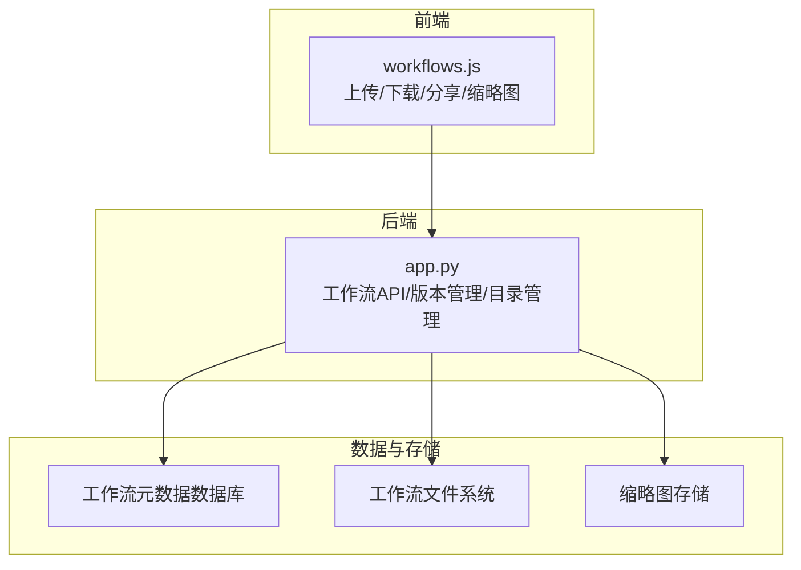
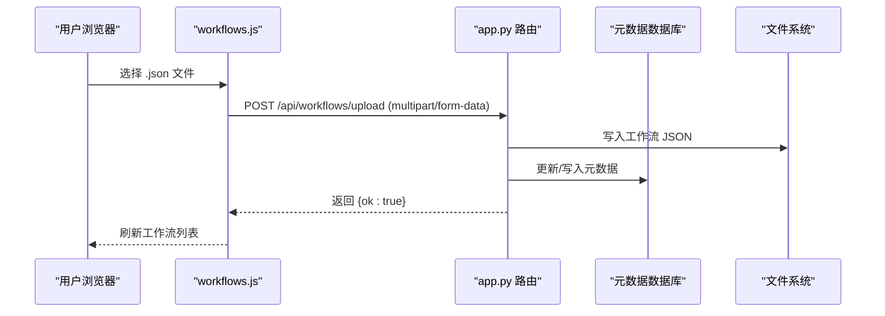
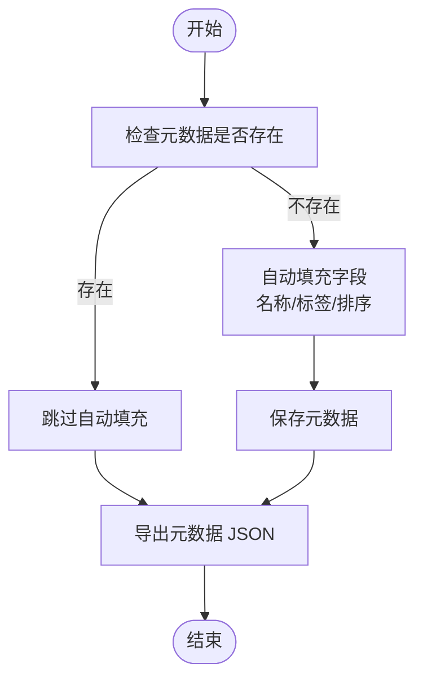
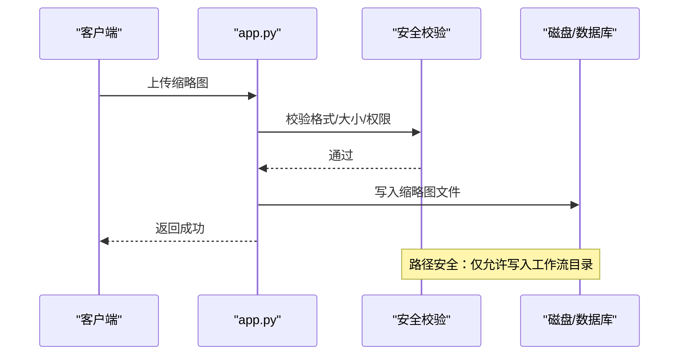
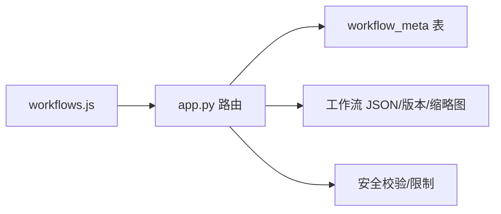

# 工作流批量操作与导入导出

<cite>
**本文引用的文件**
- [app.py](file://app.py)
- [workflows.js](file://static/js/modules/workflows.js)
- [test_security_controls.py](file://tests/test_security_controls.py)
</cite>

## 目录
1. [简介](#简介)
2. [项目结构](#项目结构)
3. [核心组件](#核心组件)
4. [架构总览](#架构总览)
5. [详细组件分析](#详细组件分析)
6. [依赖关系分析](#依赖关系分析)
7. [性能考虑](#性能考虑)
8. [故障排查指南](#故障排查指南)
9. [结论](#结论)
10. [附录](#附录)

## 简介
本文件面向 Ez ComfyUI Showcase 的工作流批量操作与导入导出能力，系统化梳理后端 API 设计与前端交互流程，覆盖以下主题：
- 工作流批量操作：批量创建、批量删除、批量更新、批量复制（基于现有接口的组合与扩展建议）
- 工作流导入接口：单文件上传、批量上传、版本增量上传、元数据同步
- 工作流导出接口：单文件下载、批量导出、压缩打包（建议）、格式转换（建议）
- 模板批量管理：模板批量应用、批量更新、批量删除（基于元数据与配置接口）
- 数据验证与错误处理：输入校验、大小限制、路径安全、权限控制
- 格式标准化与兼容性：JSON 结构、字段命名、版本管理
- 迁移工具与脚本：缩略图迁移、历史数据导入
- 性能优化策略与最佳实践：并发控制、缓存、分页、异步任务
- 权限控制与安全验证：用户角色、资源访问控制、文件上传限制

## 项目结构
围绕工作流导入导出与批量操作的关键模块与文件：
- 后端 API 定义与实现：app.py 中的 /api/workflows* 路由与版本管理路由
- 前端交互逻辑：static/js/modules/workflows.js 中的上传、下载、分享、缩略图上传等
- 测试用例：tests/test_security_controls.py 中的安全限制测试

图表来源
- [app.py](file://app.py)
- [workflows.js](file://static/js/modules/workflows.js)

章节来源
- [app.py](file://app.py)
- [workflows.js](file://static/js/modules/workflows.js)

## 核心组件
- 工作流元数据管理
  - 元数据加载、写入、导出、排序、共享状态更新、删除
- 工作流文件管理
  - 单文件下载、重命名、删除、缩略图上传与获取
- 工作流目录管理
  - 目录增删查、统计 JSON 数量
- 版本管理
  - 版本上传、激活、列表查询
- 导入/上传
  - 单文件上传（工作流 JSON）

章节来源
- [app.py](file://app.py)
- [workflows.js](file://static/js/modules/workflows.js)

## 架构总览
后端通过 FastAPI 提供 REST 接口，前端通过 AJAX 与表单上传与后端交互；元数据持久化在数据库中，工作流 JSON 存储于文件系统，缩略图按工作流同目录组织。

图表来源
- [workflows.js](file://static/js/modules/workflows.js)
- [app.py](file://app.py)

## 详细组件分析

### 工作流导入接口
- 单文件上传
  - 接口：POST /api/workflows/upload
  - 行为：接收 multipart/form-data，写入工作流 JSON，更新元数据
  - 前端调用：FormData + fetch
- 多文件/批量上传（建议）
  - 当前未提供直接的多文件上传接口，可通过前端循环调用单文件上传实现
  - 建议后端新增批量上传接口以减少往返与提升性能
- 增量导入（建议）
  - 可结合现有元数据接口，先检测重复再决定覆盖或跳过

章节来源
- [workflows.js](file://static/js/modules/workflows.js)
- [app.py](file://app.py)

### 工作流导出接口
- 单文件导出
  - 接口：GET /api/workflows/{name}/download
  - 行为：返回工作流 JSON 文件
- 批量导出（建议）
  - 建议新增：GET /api/workflows/export?names=a,b,c 或 POST /api/workflows/export-batch
  - 支持 ZIP 打包与格式转换（如转为特定版本或精简字段）
- 压缩打包（建议）
  - 返回压缩包，包含 JSON 与关联缩略图
- 格式转换（建议）
  - 支持导出时指定 ComfyUI 版本兼容字段集

章节来源
- [app.py](file://app.py)

### 工作流批量操作（基于现有接口的组合与扩展建议）
- 批量创建（建议）
  - 新增：POST /api/workflows/batch-create
  - 输入：数组 [{name, content, meta?}, ...]
  - 行为：逐个写入 JSON 并更新元数据，支持事务回滚
- 批量删除（建议）
  - 新增：POST /api/workflows/batch-delete
  - 输入：数组 [name,...]
  - 行为：逐个删除文件与元数据，带权限校验
- 批量更新（建议）
  - 新增：POST /api/workflows/batch-update
  - 输入：数组 [{name, meta?, content?}, ...]
  - 行为：逐个更新元数据与内容，支持部分字段更新
- 批量复制（建议）
  - 新增：POST /api/workflows/batch-copy
  - 输入：数组 [sourceName,...] + 目标前缀
  - 行为：复制 JSON 并生成新名称，保留元数据

章节来源
- [app.py](file://app.py)

### 工作流模板的批量管理（基于元数据与配置接口）
- 模板批量应用（建议）
  - 新增：POST /api/workflows/batch-apply-template
  - 输入：模板名 + 目标工作流列表
  - 行为：将模板字段合并到目标工作流元数据
- 模板批量更新（建议）
  - 新增：POST /api/workflows/batch-update-template
  - 输入：模板名 + 更新字段
  - 行为：对所有应用该模板的工作流批量更新
- 模板批量删除（建议）
  - 新增：POST /api/workflows/batch-remove-template
  - 输入：模板名 + 目标工作流列表
  - 行为：移除模板字段并恢复默认值

章节来源
- [app.py](file://app.py)

### 版本管理与迁移
- 版本上传与激活
  - 接口：POST /api/workflows/{name}/upload-version
  - 接口：POST /api/workflows/{name}/activate-version
  - 行为：生成版本号 vN，写入 __versions 目录，激活后覆盖当前 JSON
- 缩略图迁移
  - 后台迁移：将旧版缩略图移动到工作流同目录，并更新元数据相对路径
- 历史数据导入
  - 可通过脚本扫描目录并写入元数据，自动补全缺失字段

图表来源
- [app.py](file://app.py)

章节来源
- [app.py](file://app.py)

### 权限控制与安全验证
- 用户认证与授权
  - 非敏感接口：可匿名访问（如查看工作流字段/分析/下载）
  - 管理接口：需管理员角色（如配置 CRUD、目录管理、版本上传/激活）
- 资源访问控制
  - 每个操作均进行“能否查看/管理”判断，防止越权
- 文件上传限制
  - 图片缩略图大小限制、分块读取、格式白名单
  - 工作流 JSON 大小限制（版本上传）
- 路径安全
  - 严格限制缩略图与工作流文件必须位于工作流目录内
  - 相对路径解析与公共路径校验

图表来源
- [app.py](file://app.py)
- [test_security_controls.py](file://tests/test_security_controls.py)

章节来源
- [app.py](file://app.py)
- [test_security_controls.py](file://tests/test_security_controls.py)

## 依赖关系分析
- 前端 workflows.js 依赖后端 /api/workflows/* 与 /api/workflows/meta/*
- 后端 app.py 依赖数据库（workflow_meta 表）与文件系统（工作流 JSON、__versions、缩略图）
- 安全与限制依赖全局常量与工具函数（大小限制、路径安全、权限判断）

图表来源
- [workflows.js](file://static/js/modules/workflows.js)
- [app.py](file://app.py)

章节来源
- [workflows.js](file://static/js/modules/workflows.js)
- [app.py](file://app.py)

## 性能考虑
- 并发与批处理
  - 批量上传/删除/更新建议采用分批处理与进度反馈
- 异步与队列
  - 大文件上传与版本切换建议异步执行，避免阻塞请求线程
- 缓存与懒加载
  - 元数据与缩略图可加入缓存层，减少频繁 IO
- 分页与筛选
  - 列表接口支持分页与标签筛选，降低前端渲染压力
- I/O 优化
  - 使用流式写入与分块读取，避免大对象内存占用

## 故障排查指南
- 上传失败
  - 检查文件类型是否为 .json，确认大小未超过限制
  - 查看后端日志与异常状态码
- 下载 404
  - 确认工作流文件是否存在且路径正确
- 权限不足 403
  - 管理类操作需管理员身份；查看类操作需有相应权限
- 缩略图上传失败
  - 检查图片格式与大小限制；确认写入目录权限
- 版本上传失败
  - 确认 JSON 合法性；检查工作流是否存在；确认版本目录可写

章节来源
- [app.py](file://app.py)
- [test_security_controls.py](file://tests/test_security_controls.py)

## 结论
Ez ComfyUI Showcase 在工作流导入导出方面提供了基础能力：单文件上传、下载、元数据管理、版本管理与缩略图上传。建议在此基础上扩展批量操作与导出打包能力，并完善权限与安全校验细节，以满足大规模工作流管理场景的需求。

## 附录

### API 规范速览（基于现有实现）
- 工作流文件
  - GET /api/workflows/{name}/fields：获取工作流字段
  - GET /api/workflows/{name}/analyze：分析工作流
  - GET /api/workflows/{name}/download：下载工作流 JSON
  - PUT /api/workflows/{filename}/rename：重命名
  - DELETE /api/workflows/{name}：删除
- 工作流配置
  - GET /api/workflows/{name}/config：获取配置
  - PUT /api/workflows/{name}/config：更新配置（管理员）
  - DELETE /api/workflows/{name}/config：删除配置（管理员）
- 工作流元数据
  - GET /api/workflows/meta：列出元数据
  - PUT /api/workflows/meta/{filename}：更新元数据（含共享）
  - DELETE /api/workflows/meta/{filename}：删除元数据
  - POST /api/workflows/meta/thumbnail：上传缩略图（管理员）
  - GET /api/workflows/thumbnail/{name:path}：获取缩略图
  - POST /api/workflows/meta/sort：批量排序（管理员）
- 工作流目录
  - GET /api/workflow-dirs：列出目录
  - POST /api/workflow-dirs：添加目录（管理员）
  - DELETE /api/workflow-dirs：删除目录（管理员）
- 版本管理
  - GET /api/workflows/{name}/versions：查询版本
  - POST /api/workflows/{name}/upload-version：上传版本（管理员）
  - POST /api/workflows/{name}/activate-version：激活版本（管理员）

章节来源
- [app.py](file://app.py)