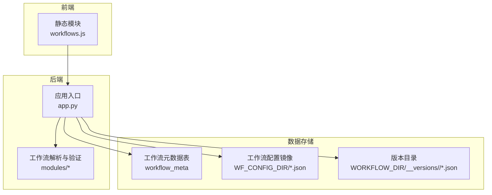
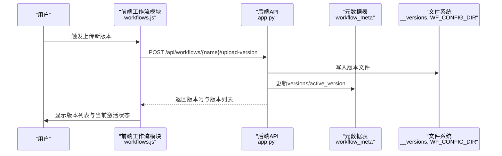
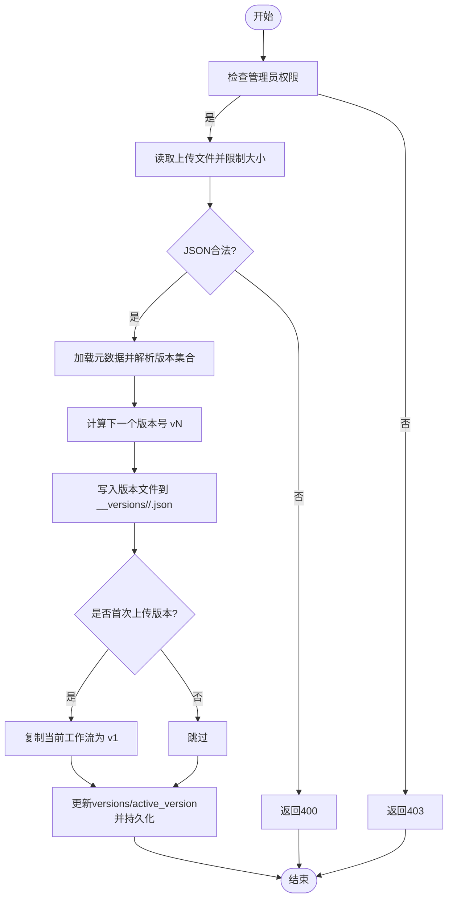
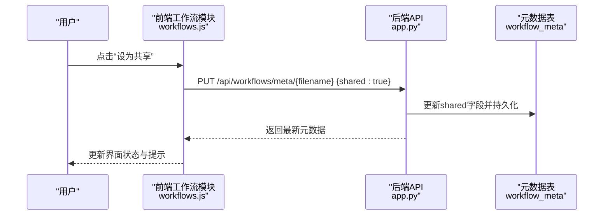
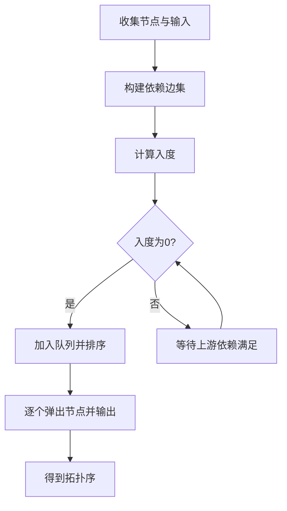
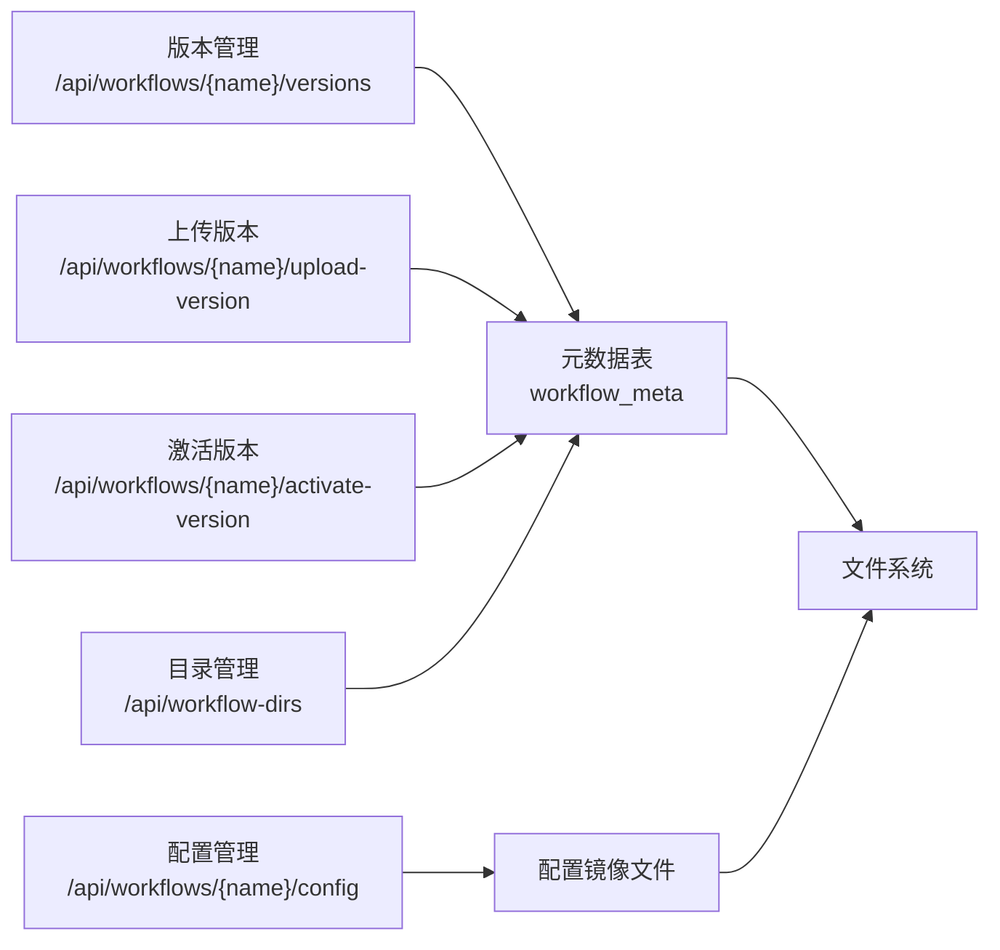

# 工作流版本管理与共享

<cite>
**本文引用的文件**
- [app.py](file://app.py)
- [workflows.js](file://static/js/modules/workflows.js)
- [step_calculator.py](file://modules/step_calculator.py)
- [test_workflow_validation.py](file://tests/test_workflow_validation.py)
</cite>

## 目录
1. [简介](#简介)
2. [项目结构](#项目结构)
3. [核心组件](#核心组件)
4. [架构总览](#架构总览)
5. [详细组件分析](#详细组件分析)
6. [依赖分析](#依赖分析)
7. [性能考虑](#性能考虑)
8. [故障排除指南](#故障排除指南)
9. [结论](#结论)
10. [附录](#附录)

## 简介
本文件面向 Ez ComfyUI Showcase 的“工作流版本管理与共享”能力，提供完整的 API 文档与实现机制说明。内容覆盖：
- 版本控制：版本创建、版本切换、版本列表与激活
- 工作流共享：公开分享、私有分享、权限控制与访问限制
- 工作流模板：模板创建、模板应用、模板更新（基于元数据与目录管理）
- 依赖关系：节点依赖、模型依赖、参数依赖的识别与处理
- 冲突检测与解决：版本冲突、配置冲突、依赖冲突的策略
- 备份与恢复：工作流备份与恢复的 API 接口
- 使用示例与最佳实践

## 项目结构
围绕工作流版本与共享的核心代码主要分布在以下位置：
- 后端服务：FastAPI 应用入口与路由定义
- 前端模块：工作流管理与 UI 交互逻辑
- 工作流解析与依赖计算：步骤计算器与工作流验证模块
- 测试：工作流验证与相关流程测试

图表来源
- [app.py](file://app.py)
- [workflows.js](file://static/js/modules/workflows.js)

章节来源
- [app.py](file://app.py)
- [workflows.js](file://static/js/modules/workflows.js)

## 核心组件
- 版本管理 API：版本列表查询、版本上传、版本激活
- 共享与权限 API：工作流元数据更新（含共享字段）、删除
- 目录管理 API：工作流目录增删查
- 配置管理 API：工作流配置读取、写入、删除
- 工作流分析与字段解析：字段提取、工作流分析
- 权限控制：基于用户角色与拥有者身份的访问控制

章节来源
- [app.py](file://app.py)

## 架构总览
后端通过 FastAPI 提供 REST 接口，前端通过静态 JS 模块调用这些接口完成工作流的版本管理与共享操作。元数据持久化于 SQLite 表，配置与版本文件分别落盘至本地目录。

图表来源
- [app.py](file://app.py)
- [workflows.js](file://static/js/modules/workflows.js)

## 详细组件分析

### 版本管理 API
- 获取版本列表
  - 方法与路径：GET /api/workflows/{name}/versions
  - 功能：返回指定工作流的所有版本映射、当前激活版本以及基础文件信息；若版本目录存在但元数据未同步，会自动补齐并持久化
  - 访问控制：需具备查看权限
- 上传新版本
  - 方法与路径：POST /api/workflows/{name}/upload-version
  - 功能：限制最大大小，校验 JSON，生成下一个版本号（vN），写入版本目录，必要时复制当前工作流作为 v1，更新元数据并激活新版本
  - 访问控制：管理员权限
- 激活指定版本
  - 方法与路径：POST /api/workflows/{name}/activate-version
  - 功能：将指定版本文件复制回当前工作流文件，更新 active_version 并持久化
  - 访问控制：管理员权限

图表来源
- [app.py](file://app.py)

章节来源
- [app.py](file://app.py)

### 共享与权限 API
- 更新工作流元数据（含共享字段）
  - 方法与路径：PUT /api/workflows/meta/{filename}
  - 功能：支持更新名称、标签、共享状态；仅管理员可修改共享状态；更新后导出元数据 JSON 并返回最新条目
  - 访问控制：非管理员仅允许管理自己拥有的工作流
- 删除工作流元数据
  - 方法与路径：DELETE /api/workflows/meta/{filename}
  - 功能：删除元数据条目；非管理员仅允许删除自己拥有的工作流
- 删除工作流文件
  - 方法与路径：DELETE /api/workflows/{name}
  - 功能：删除工作流文件并清理元数据；需具备管理权限

图表来源
- [app.py](file://app.py)
- [workflows.js](file://static/js/modules/workflows.js)

章节来源
- [app.py](file://app.py)
- [workflows.js](file://static/js/modules/workflows.js)

### 目录管理 API
- 查询目录
  - 方法与路径：GET /api/workflow-dirs
  - 功能：返回已配置的工作流目录列表、是否存在、子树内 .json 数量
  - 访问控制：管理员
- 新增目录
  - 方法与路径：POST /api/workflow-dirs
  - 功能：标准化路径、去重、创建目录、保存配置
  - 访问控制：管理员
- 删除目录
  - 方法与路径：DELETE /api/workflow-dirs
  - 功能：校验非空、执行删除、保存配置
  - 访问控制：管理员

章节来源
- [app.py](file://app.py)

### 配置管理 API
- 读取配置
  - 方法与路径：GET /api/workflows/{name}/config
  - 功能：从数据库镜像文件读取全局作用域配置
- 更新配置
  - 方法与路径：PUT /api/workflows/{name}/config
  - 功能：管理员写入配置并持久化
  - 访问控制：管理员
- 删除配置
  - 方法与路径：DELETE /api/workflows/{name}/config
  - 功能：管理员删除配置
  - 访问控制：管理员

章节来源
- [app.py](file://app.py)

### 工作流分析与字段解析
- 字段解析
  - 方法与路径：GET /api/workflows/{name}/fields
  - 功能：解析工作流字段（如节点输入、输出等），用于前端渲染与预览
- 工作流分析
  - 方法与路径：GET /api/workflows/{name}/analyze
  - 功能：对工作流进行分析（如节点依赖、采样步数等），用于生成进度估算与优化建议

章节来源
- [app.py](file://app.py)

### 权限控制与访问限制
- 查看权限：非公开工作流需登录用户具备查看权限
- 管理权限：删除、更新共享状态、上传/激活版本等操作需具备管理权限或管理员身份
- 共享状态：仅管理员可修改共享字段，并记录日志

章节来源
- [app.py](file://app.py)

### 依赖关系处理机制
- 节点依赖：通过拓扑排序与输入链接解析节点依赖关系，确定执行顺序与权重
- 模型依赖：通过节点类型与输入键识别模型加载节点与权重节点
- 参数依赖：递归解析 steps 等参数链路，支持分支与多层链接

图表来源
- [step_calculator.py](file://modules/step_calculator.py)

章节来源
- [step_calculator.py](file://modules/step_calculator.py)

### 冲突检测与解决策略
- 版本冲突：当上传版本与现有版本命名冲突时，系统按 vN 自动分配下一个版本号；若基础文件缺失，首次上传会复制当前文件作为 v1
- 配置冲突：配置写入采用管理员权限强制覆盖；建议在团队协作中通过版本切换与共享状态管理避免多人同时修改
- 依赖冲突：通过拓扑排序与依赖边检测环依赖；对不合法的输入链接返回错误或忽略无效节点，确保执行安全

章节来源
- [app.py](file://app.py)
- [step_calculator.py](file://modules/step_calculator.py)

### 备份与恢复 API
- 下载工作流
  - 方法与路径：GET /api/workflows/{name}/download
  - 功能：以 JSON 形式下载工作流文件，便于本地备份
- 导出配置镜像
  - 方法与路径：后端导出函数（内部调用）
  - 功能：将数据库中的全局作用域配置导出为本地 JSON 文件，便于备份与迁移

章节来源
- [app.py](file://app.py)

## 依赖分析
- 组件耦合
  - 版本管理与元数据表紧密耦合，版本路径写入与 active_version 更新均依赖元数据持久化
  - 目录管理影响工作流扫描与可见性，进而影响元数据初始化与视图展示
  - 配置管理与元数据表相互独立，但共同服务于工作流编辑体验
- 外部依赖
  - SQLite 数据库存储元数据与配置镜像
  - 文件系统存储版本目录与配置 JSON

图表来源
- [app.py](file://app.py)

章节来源
- [app.py](file://app.py)

## 性能考虑
- 版本文件大小限制：上传版本最大 1MB，防止过大文件影响存储与传输
- 目录扫描：目录管理接口统计 .json 数量，注意目录层级与数量对性能的影响
- 配置导出：配置镜像导出为一次性写入，避免频繁 I/O
- 依赖解析：拓扑排序与递归解析在大型工作流中可能带来计算开销，建议在前端缓存分析结果

## 故障排除指南
- 403 无权限
  - 现象：更新共享状态、删除元数据、上传/激活版本时报错
  - 原因：非管理员或非拥有者
  - 处理：确认当前用户角色与工作流拥有者
- 404 未找到
  - 现象：工作流或版本不存在
  - 原因：文件被删除或路径变更
  - 处理：检查目录配置与文件存在性
- 400 JSON 不合法
  - 现象：上传版本 JSON 格式错误
  - 原因：文件损坏或格式不正确
  - 处理：修复 JSON 或重新生成工作流
- 400 无法上传（大小限制）
  - 现象：上传版本被拒绝
  - 原因：超过 1MB 限制
  - 处理：压缩工作流或拆分节点

章节来源
- [app.py](file://app.py)

## 结论
Ez ComfyUI Showcase 的工作流版本管理与共享通过清晰的 API 设计与严格的权限控制，实现了版本创建、切换、共享与配置管理的闭环。结合依赖解析与冲突策略，系统能够在保证安全性的同时提升协作效率。建议在团队中配合版本切换与共享状态管理，减少配置冲突与依赖问题。

## 附录

### API 定义概览
- 版本管理
  - GET /api/workflows/{name}/versions：获取版本列表与当前激活版本
  - POST /api/workflows/{name}/upload-version：上传新版本（管理员）
  - POST /api/workflows/{name}/activate-version：激活指定版本（管理员）
- 共享与权限
  - PUT /api/workflows/meta/{filename}：更新元数据（含共享字段）
  - DELETE /api/workflows/meta/{filename}：删除元数据
  - DELETE /api/workflows/{name}：删除工作流文件
- 目录管理
  - GET /api/workflow-dirs：查询目录
  - POST /api/workflow-dirs：新增目录（管理员）
  - DELETE /api/workflow-dirs：删除目录（管理员）
- 配置管理
  - GET /api/workflows/{name}/config：读取配置
  - PUT /api/workflows/{name}/config：更新配置（管理员）
  - DELETE /api/workflows/{name}/config：删除配置（管理员）
- 工作流分析与字段
  - GET /api/workflows/{name}/fields：解析字段
  - GET /api/workflows/{name}/analyze：分析工作流

章节来源
- [app.py](file://app.py)

### 使用示例与最佳实践
- 版本管理
  - 在团队协作中，每次重大修改先上传版本，再激活目标版本，最后删除不需要的旧版本
  - 首次上传版本时，系统会自动复制当前工作流为 v1，确保历史可追溯
- 共享与权限
  - 将公共模板设为共享，但仅管理员可修改共享状态
  - 个人工作流保持私有，通过拥有者身份控制管理权限
- 目录管理
  - 将不同类型的模板放入不同目录，便于分类与检索
- 配置管理
  - 使用配置镜像文件备份全局设置，便于迁移与恢复
- 依赖与冲突
  - 在大型工作流中，优先使用拓扑排序后的节点顺序，避免环依赖
  - 对不合法的输入链接进行校验，及时修正

章节来源
- [app.py](file://app.py)
- [step_calculator.py](file://modules/step_calculator.py)