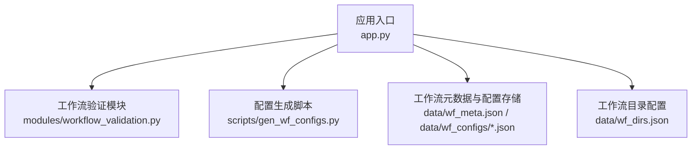
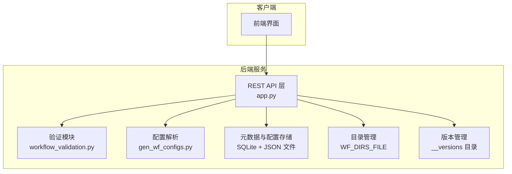
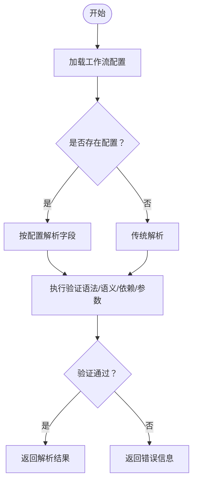
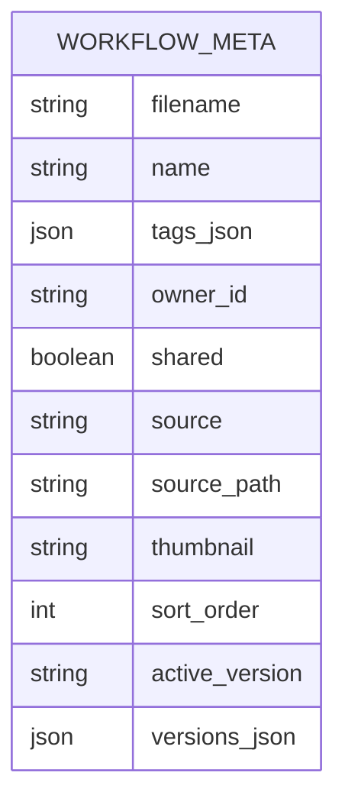
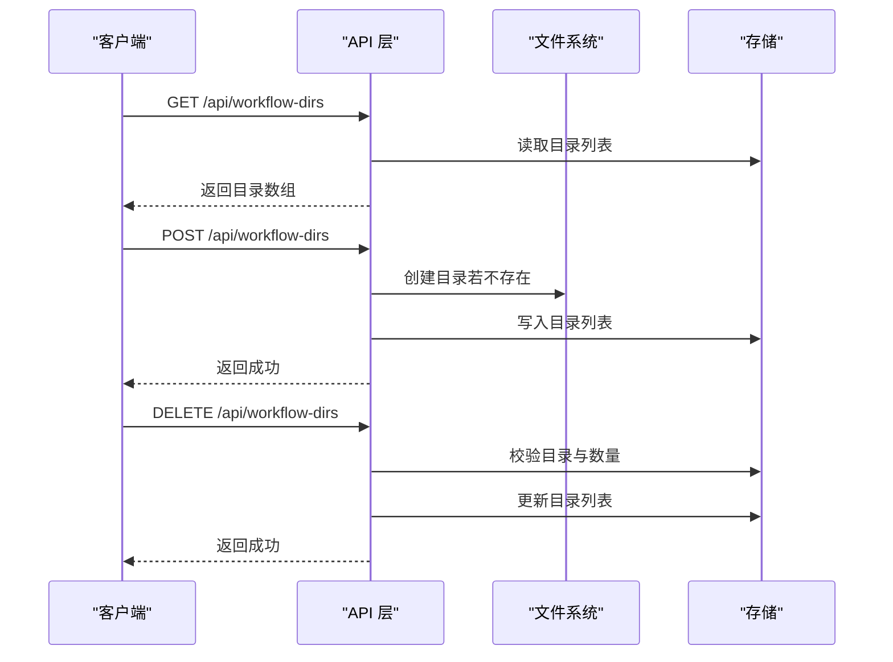
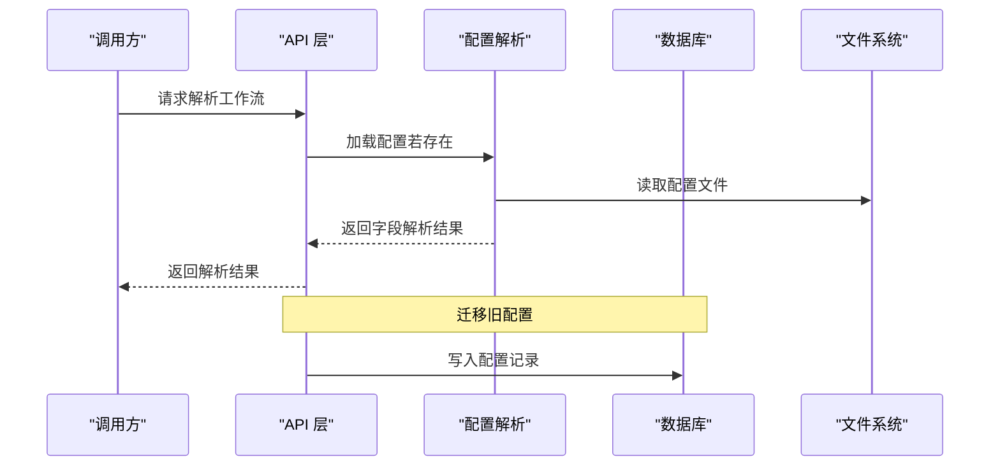
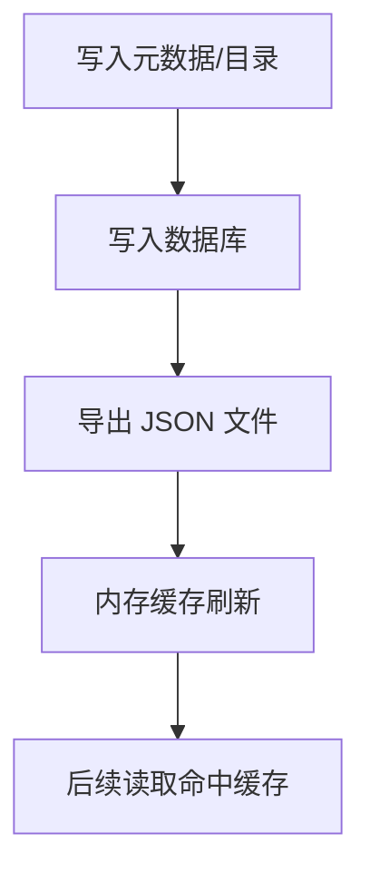
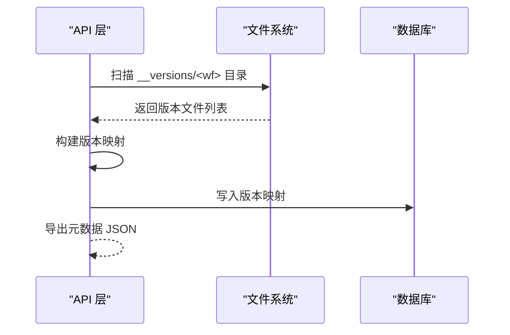
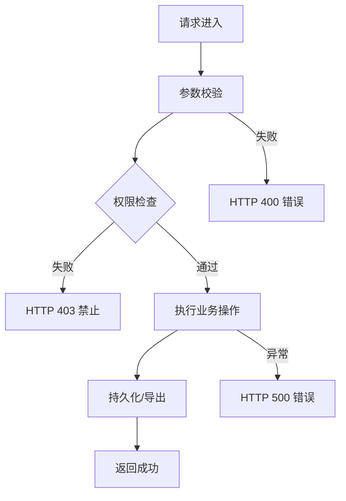
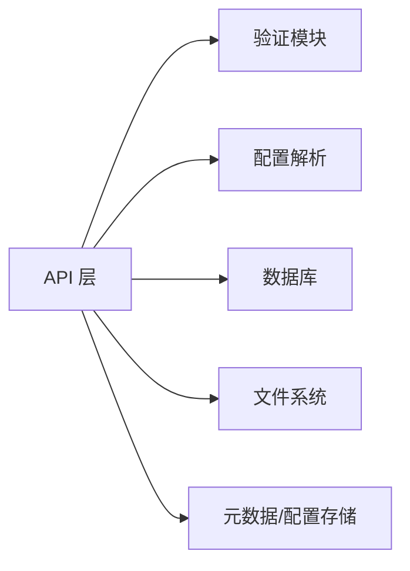

# 工作流验证与元数据管理

<cite>
**本文引用的文件**
- [app.py](file://app.py)
- [workflow_validation.py](file://modules/workflow_validation.py)
- [gen_wf_configs.py](file://scripts/gen_wf_configs.py)
- [README.md](file://README.md)
</cite>

## 目录
1. [简介](#简介)
2. [项目结构](#项目结构)
3. [核心组件](#核心组件)
4. [架构总览](#架构总览)
5. [详细组件分析](#详细组件分析)
6. [依赖关系分析](#依赖关系分析)
7. [性能考量](#性能考量)
8. [故障排查指南](#故障排查指南)
9. [结论](#结论)
10. [附录](#附录)

## 简介
本文件聚焦 Ez ComfyUI Showcase 的“工作流验证与元数据管理”能力，围绕以下目标展开：工作流验证机制（语法、语义、依赖、参数）、元数据结构与规则、目录管理接口、配置文件解析与序列化、缓存与索引搜索、版本迁移与兼容、以及错误处理与异常流程。文档以代码为依据，提供可追溯的章节来源与图示。

## 项目结构
- 后端入口与 API 实现集中在应用主文件中，负责工作流元数据的增删改查、目录管理、版本管理等。
- 验证逻辑位于独立模块，便于复用与扩展。
- 配置生成脚本用于从工作流自动生成编辑器配置，支撑解析与序列化。
- README 提供项目背景与总体说明。

**图表来源**
- [app.py](file://app.py)
- [workflow_validation.py](file://modules/workflow_validation.py)
- [gen_wf_configs.py](file://scripts/gen_wf_configs.py)

**章节来源**
- [app.py](file://app.py)
- [README.md](file://README.md)

## 核心组件
- 工作流验证模块：提供工作流语法、语义、节点依赖与参数的验证能力，支持与编辑器配置联动。
- 元数据管理服务：提供元数据的加载、规范化、持久化、导出与权限控制。
- 目录管理服务：提供工作流目录的添加、删除、统计与存在性检测。
- 配置解析与序列化：基于配置文件进行字段解析与覆盖，支持回退到传统解析。
- 版本管理与迁移：维护工作流历史版本、自动扫描与写入数据库、兼容旧版配置。
- 错误处理与权限控制：统一的 HTTP 异常与鉴权策略，确保操作安全与可观测性。

**章节来源**
- [app.py](file://app.py)
- [workflow_validation.py](file://modules/workflow_validation.py)
- [gen_wf_configs.py](file://scripts/gen_wf_configs.py)

## 架构总览
下图展示工作流验证与元数据管理在系统中的位置与交互：

**图表来源**
- [app.py](file://app.py)
- [workflow_validation.py](file://modules/workflow_validation.py)
- [gen_wf_configs.py](file://scripts/gen_wf_configs.py)

## 详细组件分析

### 工作流验证机制
- 语法验证：对工作流 JSON 结构进行合法性检查，确保必需字段存在且类型正确。
- 语义验证：检查节点连接、参数范围、必填项与互斥项约束。
- 依赖检查：验证节点间依赖链是否形成环路或断链。
- 参数验证：结合编辑器配置进行字段级校验，支持默认值注入与类型转换。
- 配置联动：优先使用配置文件覆盖解析结果，否则回退到传统解析。

**图表来源**
- [app.py](file://app.py)
- [workflow_validation.py](file://modules/workflow_validation.py)
- [gen_wf_configs.py](file://scripts/gen_wf_configs.py)

**章节来源**
- [app.py](file://app.py)
- [workflow_validation.py](file://modules/workflow_validation.py)
- [gen_wf_configs.py](file://scripts/gen_wf_configs.py)

### 工作流元数据结构与规则
- 存储介质：SQLite 表与 JSON 文件双轨存储，保证查询效率与可移植性。
- 字段定义与默认值：
  - 基础字段：名称、标签列表、所有者 ID、共享状态。
  - 可选字段：来源、来源路径、缩略图、排序序号、活动版本。
  - 版本映射：以版本名为键，文件路径为值的字典。
- 规范化流程：加载时将数据库行转为条目，填充默认值，合并可选字段，最终写回存储。
- 权限控制：仅管理员可修改共享状态；非所有者不可删除或修改元数据。

**图表来源**
- [app.py](file://app.py)

**章节来源**
- [app.py](file://app.py)

### 目录管理接口
- 列表查询：返回已配置目录的路径、存在性与子树内 JSON 文件数量。
- 添加目录：支持用户态路径展开与绝对化，去重并创建目录。
- 删除目录：限制至少保留一个目录，避免环境不可用。
- 权限要求：仅管理员可用。

**图表来源**
- [app.py](file://app.py)

**章节来源**
- [app.py](file://app.py)

### 配置文件解析与序列化
- 解析策略：优先根据工作流名加载配置文件，按字段定义解析；若无配置则回退到传统解析。
- 序列化输出：生成标准化的配置对象，包含版本号、工作流名与字段清单。
- 迁移兼容：支持将旧版配置目录迁移至数据库表，保持向后兼容。

**图表来源**
- [app.py](file://app.py)
- [gen_wf_configs.py](file://scripts/gen_wf_configs.py)

**章节来源**
- [app.py](file://app.py)
- [gen_wf_configs.py](file://scripts/gen_wf_configs.py)

### 缓存与索引搜索
- 缓存策略：元数据与目录列表采用内存缓存与文件落盘双重保障，减少重复 IO。
- 缓存失效：写入操作后主动导出 JSON 并刷新数据库记录。
- 搜索接口：目录遍历统计文件数，支持按目录聚合检索；可扩展为基于元数据的全文/标签搜索（当前实现以目录聚合为主）。

**图表来源**
- [app.py](file://app.py)

**章节来源**
- [app.py](file://app.py)

### 版本管理与迁移
- 版本目录：每个工作流在专用目录下保存历史版本文件，元数据中维护版本映射。
- 自动扫描：启动时扫描版本目录，缺失映射自动补全并持久化。
- 迁移兼容：旧版配置目录迁移至数据库，避免丢失历史配置。

**图表来源**
- [app.py](file://app.py)

**章节来源**
- [app.py](file://app.py)

### 错误处理与异常机制
- 统一异常：对无效输入、权限不足、资源不存在、冲突等情况抛出标准 HTTP 异常。
- 权限控制：元数据修改与共享状态变更需管理员权限；非所有者不可操作他人工作流。
- 日志记录：关键操作（如共享状态变更）记录日志以便审计。

**图表来源**
- [app.py](file://app.py)

**章节来源**
- [app.py](file://app.py)

## 依赖关系分析
- API 层依赖验证模块与配置解析模块，同时访问数据库与文件系统。
- 元数据与配置通过 SQLite 与 JSON 文件双向同步，确保一致性。
- 目录管理与版本管理作为辅助能力，服务于工作流发现与演进。

**图表来源**
- [app.py](file://app.py)
- [workflow_validation.py](file://modules/workflow_validation.py)
- [gen_wf_configs.py](file://scripts/gen_wf_configs.py)

**章节来源**
- [app.py](file://app.py)

## 性能考量
- IO 优化：批量写入数据库，减少事务次数；目录统计使用一次性遍历。
- 缓存命中：读多写少场景下，优先读取内存缓存与 JSON 文件，降低数据库压力。
- 大小限制：工作流文件大小上限控制，防止异常文件影响系统稳定性。
- 可扩展性：目录与版本扫描可按需异步化，避免阻塞主线程。

## 故障排查指南
- 元数据不生效：确认 JSON 导出是否成功、数据库记录是否更新、缓存是否刷新。
- 目录未被识别：检查目录是否存在、权限是否正确、是否已加入目录列表。
- 配置解析失败：核对配置文件格式与字段定义，必要时回退到传统解析。
- 版本缺失：检查版本目录命名与文件后缀，触发一次扫描以自动补全映射。
- 权限问题：确认当前用户角色与工作流归属，管理员方可修改共享状态。

**章节来源**
- [app.py](file://app.py)

## 结论
该系统通过模块化的验证与元数据管理，实现了工作流的全生命周期治理：从解析、验证、存储到版本演进与权限控制，均具备清晰的接口与稳健的错误处理机制。建议在生产环境中配合监控与日志审计，持续优化缓存与扫描策略，以提升大规模工作流场景下的响应性能与可靠性。

## 附录
- API 路由概览（节选）
  - 元数据管理：GET/PUT/DELETE /api/workflows/meta/{filename}
  - 目录管理：GET /api/workflow-dirs, POST /api/workflow-dirs, DELETE /api/workflow-dirs
  - 版本管理：GET /api/workflows/{name}/versions
- 关键常量与阈值：工作流最大尺寸限制、管理员权限校验、目录数量下限等

**章节来源**
- [app.py](file://app.py)