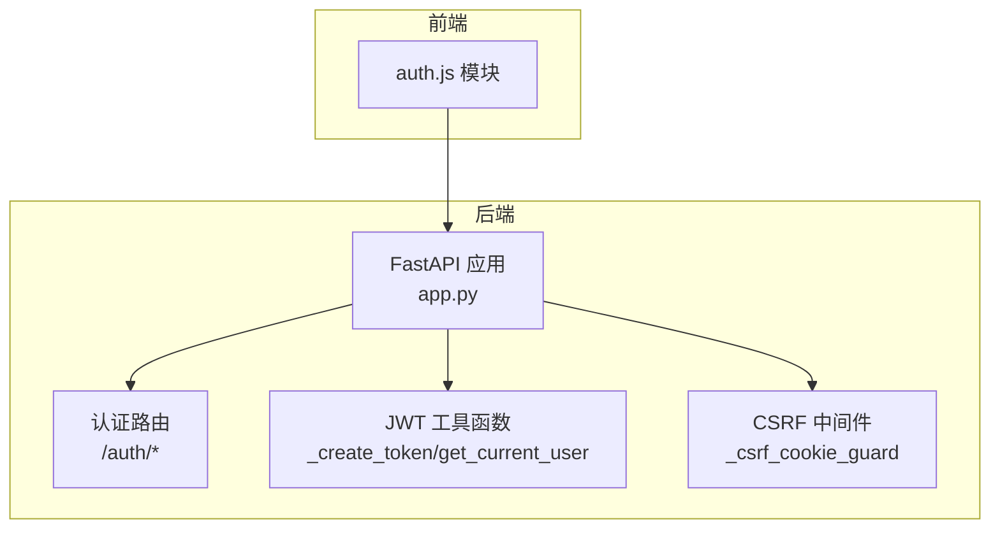
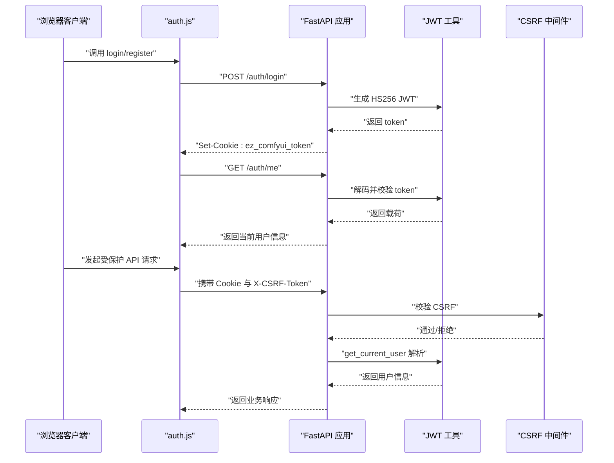
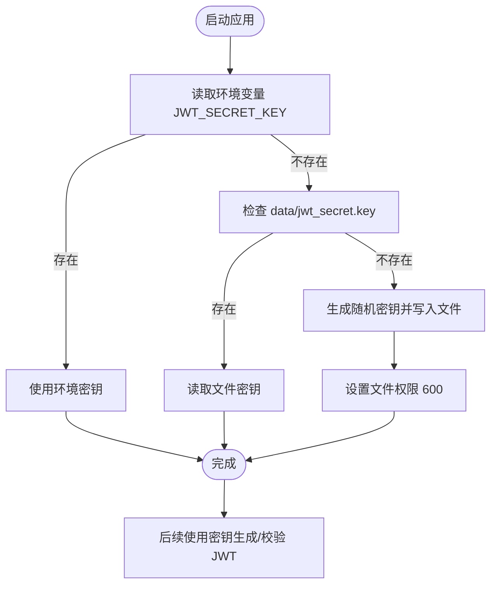
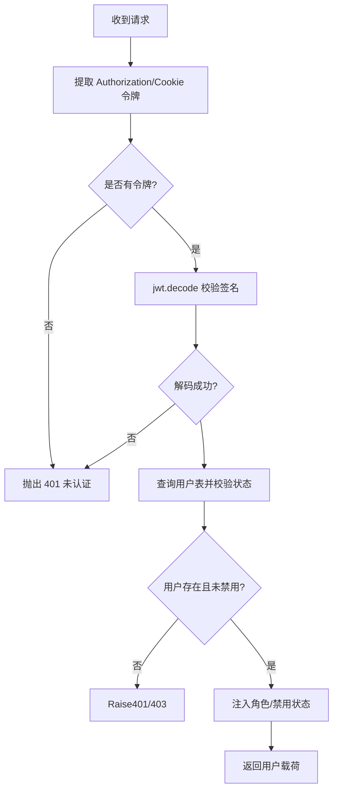
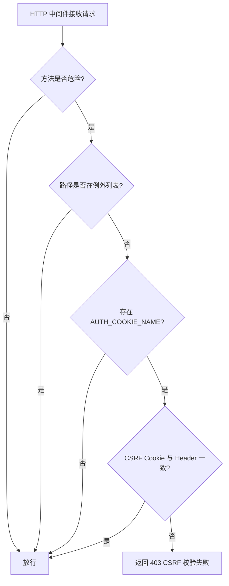
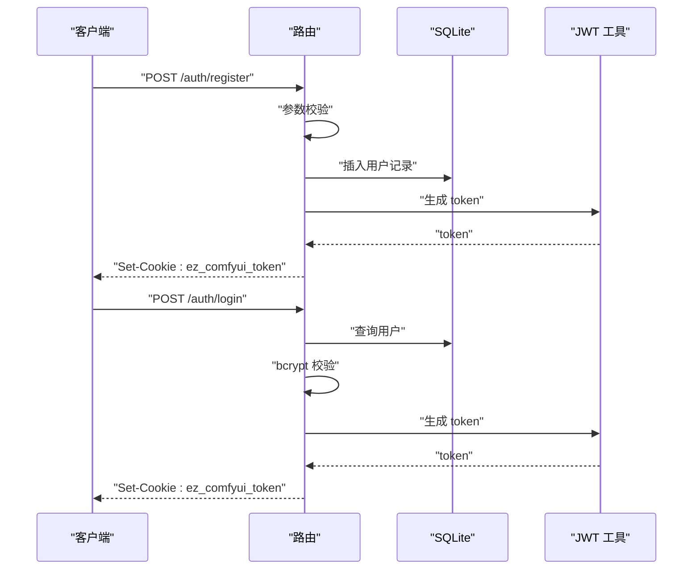
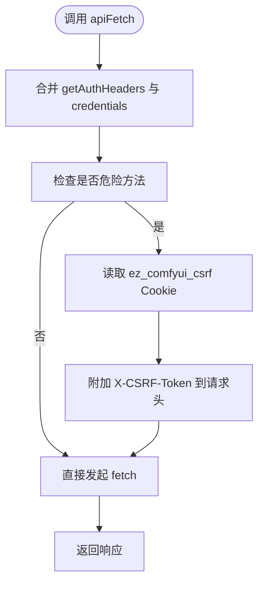
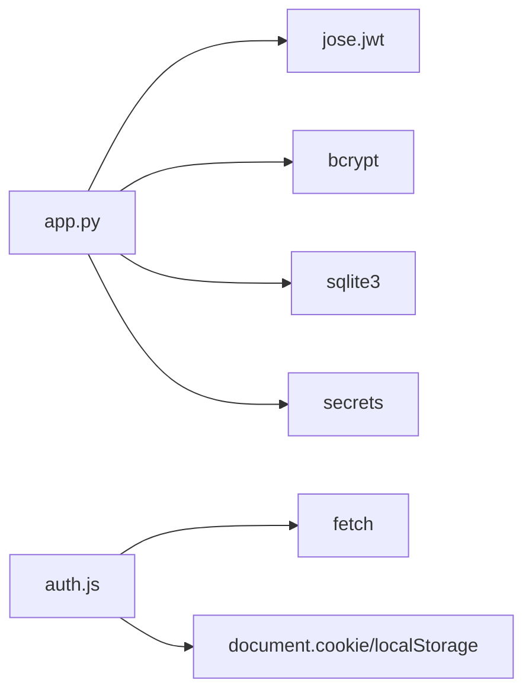

# JWT 认证机制

<cite>
**本文档引用的文件**
- [app.py](file://app.py)
- [auth.js](file://static/js/modules/auth.js)
</cite>

## 目录
1. [简介](#简介)
2. [项目结构](#项目结构)
3. [核心组件](#核心组件)
4. [架构总览](#架构总览)
5. [详细组件分析](#详细组件分析)
6. [依赖分析](#依赖分析)
7. [性能考量](#性能考量)
8. [故障排除指南](#故障排除指南)
9. [结论](#结论)
10. [附录](#附录)

## 简介
本文件面向 Ez ComfyUI Showcase 的 JWT 认证机制，提供从算法、密钥管理、过期时间、令牌格式与存储，到中间件实现、请求头解析、验证流程与异常处理的完整技术说明。同时覆盖前端自动附加 Authorization 头、本地存储策略、CSRF 保护、跨域认证处理及移动端适配建议，并给出安全配置建议与常见问题解决方案。

## 项目结构
认证相关的关键位置：
- 后端：FastAPI 应用中的认证路由、JWT 工具函数、CSRF 中间件与速率限制
- 前端：auth.js 模块负责登录/注册、会话恢复、API 请求拦截与 CSRF 头附加

图表来源
- [app.py:3286-3299](file://app.py#L3286-L3299)
- [app.py:8450-8521](file://app.py#L8450-L8521)
- [app.py:2470-2597](file://app.py#L2470-L2597)
- [auth.js:179-185](file://static/js/modules/auth.js#L179-L185)

章节来源
- [app.py:3286-3299](file://app.py#L3286-L3299)
- [app.py:8450-8521](file://app.py#L8450-L8521)
- [app.py:2470-2597](file://app.py#L2470-L2597)
- [auth.js:179-185](file://static/js/modules/auth.js#L179-L185)

## 核心组件
- JWT 算法与密钥管理
  - HS256 算法，密钥来源优先级：环境变量 > 本地文件 > 临时生成
  - 默认过期时间：31 天（后端常量），前端默认使用 Cookie 存储，不强制刷新
- 认证中间件与请求解析
  - 支持 Authorization: Bearer <token> 与 Cookie 中的令牌
  - CSRF 保护：对非 GET/HEAD/OPTIONS 的危险方法进行校验
- 前端存储与请求拦截
  - 使用 Cookie 存储令牌与 CSRF Token，自动附加 X-CSRF-Token
  - 统一 fetch 包装器 apiFetch，统一携带凭据与 CSRF 头

章节来源
- [app.py:82-107](file://app.py#L82-L107)
- [app.py:2494-2503](file://app.py#L2494-L2503)
- [app.py:3286-3299](file://app.py#L3286-L3299)
- [auth.js:74-105](file://static/js/modules/auth.js#L74-L105)
- [auth.js:179-185](file://static/js/modules/auth.js#L179-L185)

## 架构总览
下图展示认证流程：注册/登录获取令牌并写入 Cookie，后续请求由 CSRF 中间件与 get_current_user 解析并验证，前端自动附加 CSRF 头。

图表来源
- [app.py:8477-8500](file://app.py#L8477-L8500)
- [app.py:2470-2479](file://app.py#L2470-L2479)
- [app.py:2561-2579](file://app.py#L2561-L2579)
- [app.py:3286-3299](file://app.py#L3286-L3299)
- [auth.js:297-313](file://static/js/modules/auth.js#L297-L313)
- [auth.js:338-373](file://static/js/modules/auth.js#L338-L373)
- [auth.js:95-105](file://static/js/modules/auth.js#L95-L105)

## 详细组件分析

### 后端：JWT 生成与密钥管理
- 算法与过期时间
  - HS256 算法，ACCESS_TOKEN_EXPIRE_DAYS=31
  - 载荷包含 sub、username、role、exp
- 密钥加载策略
  - 优先读取环境变量 JWT_SECRET_KEY
  - 若不可用，尝试 data/jwt_secret.key 文件
  - 若仍不可用，生成随机密钥并写入文件，权限设为 600
  - 若均失败，使用临时密钥（仅用于开发）
- Cookie 设置
  - ez_comfyui_token：httponly=true，secure 根据协议，SameSite=Lax
  - CSRF Cookie：ez_comfyui_csrf，非 httponly，SameSite=Lax

图表来源
- [app.py:82-102](file://app.py#L82-L102)
- [app.py:105-107](file://app.py#L105-L107)
- [app.py:2470-2479](file://app.py#L2470-L2479)
- [app.py:2506-2517](file://app.py#L2506-L2517)
- [app.py:2520-2531](file://app.py#L2520-L2531)

章节来源
- [app.py:82-102](file://app.py#L82-L102)
- [app.py:105-107](file://app.py#L105-L107)
- [app.py:2470-2479](file://app.py#L2470-L2479)
- [app.py:2506-2517](file://app.py#L2506-L2517)
- [app.py:2520-2531](file://app.py#L2520-L2531)

### 后端：认证中间件与请求解析
- 令牌提取顺序
  - Authorization 头以 Bearer 开头优先
  - 否则从 Cookie 中读取 AUTH_COOKIE_NAME（ez_comfyui_token）
- 用户解析
  - jwt.decode 校验签名与算法
  - 查询 SQLite 用户表，校验是否存在与未禁用
  - 将角色与禁用状态注入载荷
- 可选解析
  - get_current_user_optional：在无令牌或无效时返回 None

图表来源
- [app.py:2494-2503](file://app.py#L2494-L2503)
- [app.py:2561-2579](file://app.py#L2561-L2579)
- [app.py:2582-2597](file://app.py#L2582-L2597)

章节来源
- [app.py:2494-2503](file://app.py#L2494-L2503)
- [app.py:2561-2579](file://app.py#L2561-L2579)
- [app.py:2582-2597](file://app.py#L2582-L2597)

### 后端：CSRF 保护中间件
- 仅对非安全方法（POST/PUT/PATCH/DELETE）生效
- 例外路径：/auth/login、/auth/register
- 保护逻辑：要求 Cookie 中存在 AUTH_COOKIE_NAME 且与请求头 X-CSRF-Token 一致（恒等比较）

图表来源
- [app.py:3286-3299](file://app.py#L3286-L3299)
- [app.py:2534-2537](file://app.py#L2534-L2537)

章节来源
- [app.py:3286-3299](file://app.py#L3286-L3299)
- [app.py:2534-2537](file://app.py#L2534-L2537)

### 后端：认证路由与速率限制
- /auth/register
  - 参数校验、bcrypt 哈希、SQLite 插入、首次用户赋予 admin 角色
  - 生成 token 并写入 Cookie
- /auth/login
  - 查找用户、校验禁用状态、bcrypt 校验密码
  - 生成 token 并写入 Cookie
- /auth/logout
  - 删除两个 Cookie（令牌与 CSRF）
- /auth/me
  - 依赖 get_current_user 获取当前用户信息
- 速率限制
  - register/login 在 300 秒内最多 8 次尝试，超过触发 429

图表来源
- [app.py:8451-8475](file://app.py#L8451-L8475)
- [app.py:8477-8499](file://app.py#L8477-L8499)
- [app.py:8502-8506](file://app.py#L8502-L8506)
- [app.py:8509-8520](file://app.py#L8509-L8520)
- [app.py:2545-2554](file://app.py#L2545-L2554)

章节来源
- [app.py:8451-8475](file://app.py#L8451-L8475)
- [app.py:8477-8499](file://app.py#L8477-L8499)
- [app.py:8502-8506](file://app.py#L8502-L8506)
- [app.py:8509-8520](file://app.py#L8509-L8520)
- [app.py:2545-2554](file://app.py#L2545-L2554)

### 前端：auth.js 模块
- 令牌存储与读取
  - 当前实现中，getToken/setToken/_clearToken 为空操作，未使用 localStorage 存储 token
- CSRF 头附加
  - 对非安全方法自动从 Cookie 读取 CSRF Token 并附加到 X-CSRF-Token
- API 请求拦截
  - apiFetch 自动合并 getAuthHeaders、credentials: include，并附加 CSRF 头
- 登录/注册/登出/会话恢复
  - login/register 调用 /auth/*，随后调用 /auth/me 更新当前用户
  - logout 删除 Cookie 并刷新页面

图表来源
- [auth.js:74-76](file://static/js/modules/auth.js#L74-L76)
- [auth.js:95-105](file://static/js/modules/auth.js#L95-L105)
- [auth.js:179-185](file://static/js/modules/auth.js#L179-L185)

章节来源
- [auth.js:68-76](file://static/js/modules/auth.js#L68-L76)
- [auth.js:95-105](file://static/js/modules/auth.js#L95-L105)
- [auth.js:179-185](file://static/js/modules/auth.js#L179-L185)
- [auth.js:297-313](file://static/js/modules/auth.js#L297-L313)
- [auth.js:338-373](file://static/js/modules/auth.js#L338-L373)

## 依赖分析
- 后端依赖
  - jose: jwt 编解码与错误类型
  - bcrypt: 密码哈希
  - sqlite3: 用户表存取
  - secrets: CSRF/密钥生成
- 前端依赖
  - fetch: API 请求
  - document.cookie/localStorage: Cookie 读取与本地存储占位

图表来源
- [app.py](file://app.py#L26)
- [app.py](file://app.py#L27)
- [auth.js:179-185](file://static/js/modules/auth.js#L179-L185)

章节来源
- [app.py:26-27](file://app.py#L26-L27)
- [auth.js:179-185](file://static/js/modules/auth.js#L179-L185)

## 性能考量
- JWT 解码与用户查询均为 O(1)/O(n) 常量级与单行查询，开销极低
- CSRF 中间件仅对危险方法进行校验，避免对 GET/HEAD/OPTIONS 的额外负担
- 速率限制基于内存字典计数，窗口短、阈值低，有效抑制暴力破解

## 故障排除指南
- 401 未认证
  - 检查请求头 Authorization 是否为 Bearer <token>
  - 检查 Cookie 中 ez_comfyui_token 是否存在且未过期
- 401 无效令牌
  - 确认 JWT_SECRET_KEY 一致且未变更
  - 检查 ACCESS_TOKEN_EXPIRE_DAYS 是否过期
- 403 CSRF 校验失败
  - 确保请求携带 Cookie ez_comfyui_csrf
  - 确保请求头 X-CSRF-Token 与 Cookie 值一致
- 429 太多认证尝试
  - 等待窗口结束或降低请求频率
- 前端无法携带令牌
  - 当前 auth.js 未使用 localStorage 存储 token，需在 getToken/setToken 中实现持久化逻辑

章节来源
- [app.py:2561-2579](file://app.py#L2561-L2579)
- [app.py:3286-3299](file://app.py#L3286-L3299)
- [app.py:2545-2554](file://app.py#L2545-L2554)
- [auth.js:68-76](file://static/js/modules/auth.js#L68-L76)

## 结论
Ez ComfyUI Showcase 的认证体系采用 HS256 JWT，结合 Cookie 存储与 CSRF 中间件，提供了简洁可靠的认证与防护能力。后端通过严格的速率限制与用户状态校验，前端通过统一的请求拦截器与 CSRF 头附加，形成完整的认证闭环。建议在生产环境中固定 JWT_SECRET_KEY 并妥善保管，同时根据业务需求完善前端令牌持久化与刷新策略。

## 附录

### 令牌格式与存储方式
- 令牌格式
  - HS256 签名，载荷包含 sub、username、role、exp
- 存储方式
  - 后端：Set-Cookie ez_comfyui_token（httponly=true，secure 根据协议，SameSite=Lax）
  - CSRF：Set-Cookie ez_comfyui_csrf（非 httponly，SameSite=Lax）
  - 前端：当前未使用 localStorage 存储 token（占位函数为空实现）

章节来源
- [app.py:2470-2479](file://app.py#L2470-L2479)
- [app.py:2506-2517](file://app.py#L2506-L2517)
- [app.py:2520-2531](file://app.py#L2520-L2531)
- [auth.js:68-76](file://static/js/modules/auth.js#L68-L76)

### 前端自动附加 Authorization 头与本地存储策略
- 自动附加 Authorization 头
  - 当前实现中，getAuthHeaders 返回空对象，未自动附加 Authorization
  - 如需自动附加，可在 getAuthHeaders 中读取 localStorage 中的 token 并返回 { Authorization: "Bearer ..." }
- 本地存储策略
  - 当前未使用 localStorage 存储 token，建议在 getToken/setToken 中实现
  - 登录成功后将 token 写入 localStorage，并在登出时清理

章节来源
- [auth.js:74-76](file://static/js/modules/auth.js#L74-L76)
- [auth.js:68-70](file://static/js/modules/auth.js#L68-L70)

### 令牌刷新机制
- 当前实现未提供自动刷新机制
- 建议方案
  - 在登录成功后，将 token 与 exp 时间写入 localStorage
  - 在请求前检查 exp 是否接近过期，若接近则重新登录并更新 Cookie
  - 或采用短期访问令牌 + 长期刷新令牌的双令牌模式（需后端配合）

章节来源
- [app.py](file://app.py#L107)
- [auth.js:338-373](file://static/js/modules/auth.js#L338-L373)

### CSRF 保护机制
- 仅对危险方法启用
- 例外路径：/auth/login、/auth/register
- 校验逻辑：Cookie ez_comfyui_csrf 与请求头 X-CSRF-Token 必须一致

章节来源
- [app.py:3286-3299](file://app.py#L3286-L3299)
- [app.py:2534-2537](file://app.py#L2534-L2537)

### 跨域认证处理
- 当前前端 fetch 默认携带 credentials: 'include'，可随域传递 Cookie
- 若部署在不同子域，需确保 SameSite/Lax 与 secure 配置满足跨域场景
- 建议在生产环境使用 HTTPS，确保 secure Cookie 正常传输

章节来源
- [auth.js:181-183](file://static/js/modules/auth.js#L181-L183)
- [app.py:2507-2514](file://app.py#L2507-L2514)

### 移动端适配考虑
- Cookie 在移动端 WebView 中可能受限，建议结合 localStorage 与自定义请求头
- CSRF 头在移动端同样适用，确保 Cookie 与请求头同步
- 登录后尽快调用 /auth/me 进行会话恢复，减少重复登录

章节来源
- [auth.js:338-373](file://static/js/modules/auth.js#L338-L373)
- [auth.js:95-105](file://static/js/modules/auth.js#L95-L105)