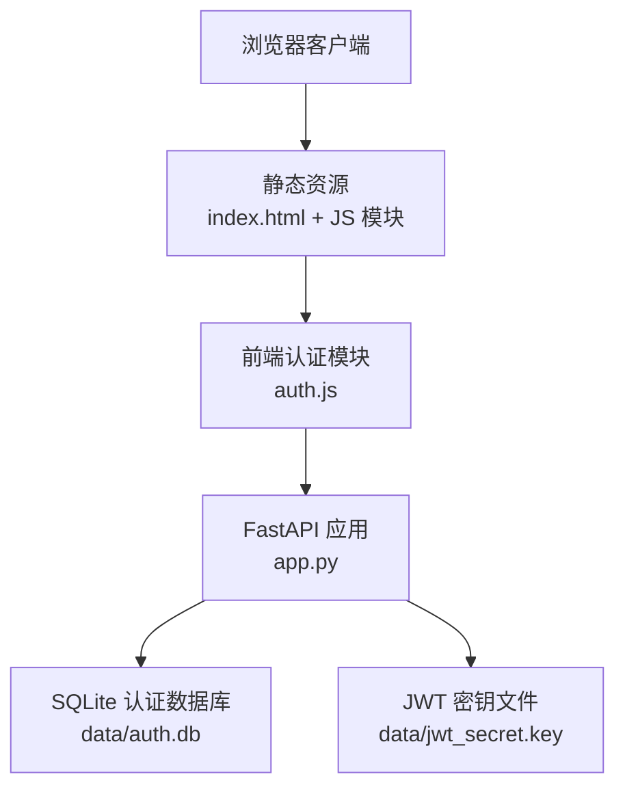
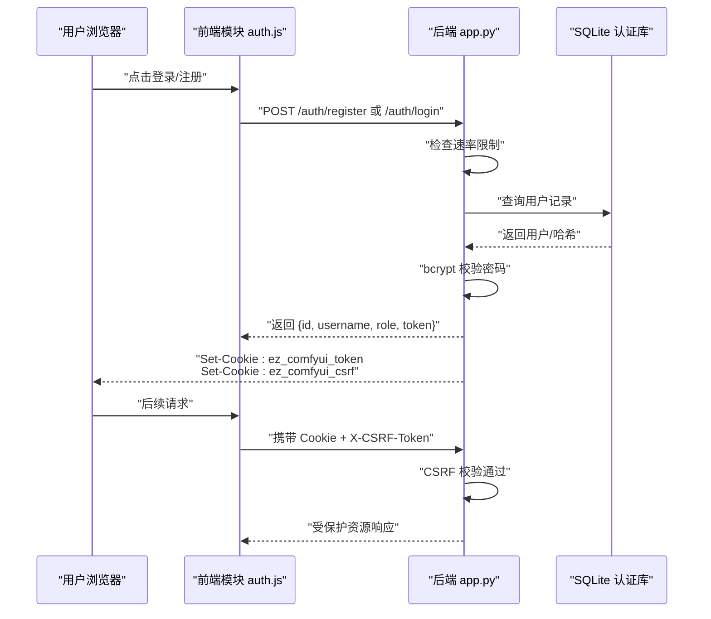
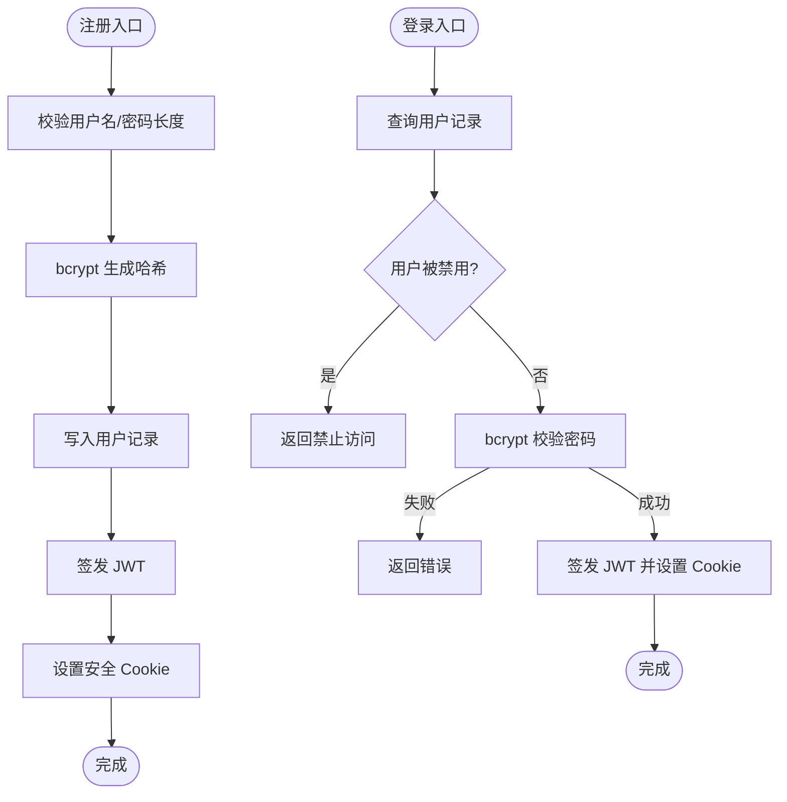
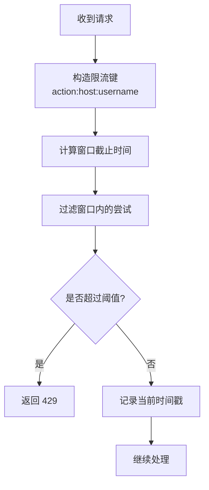
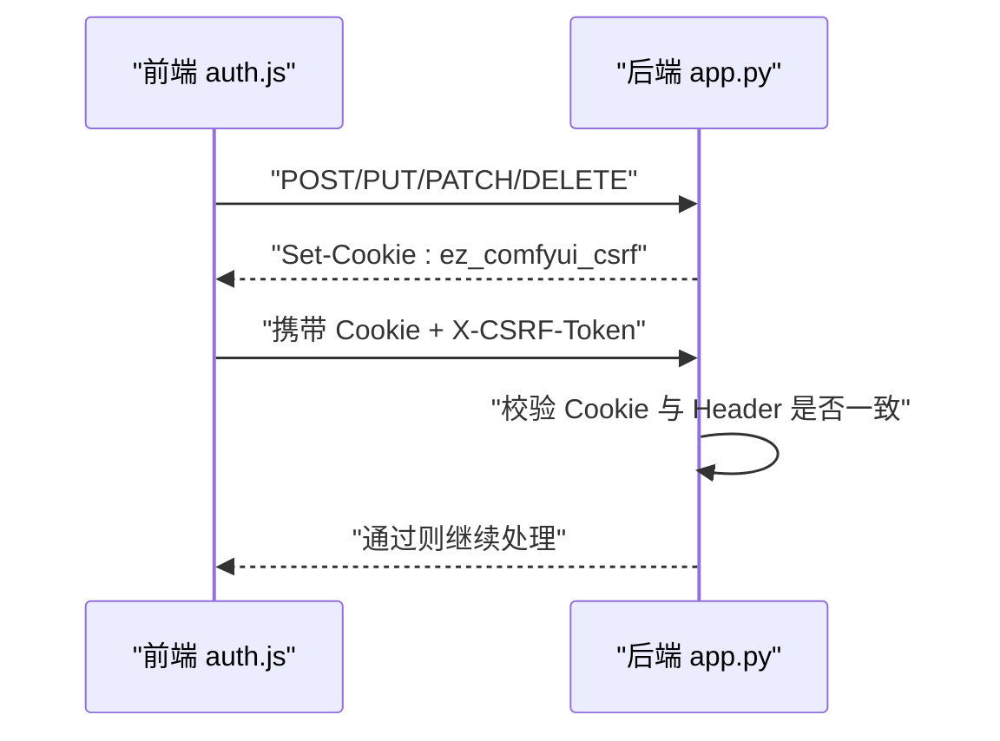
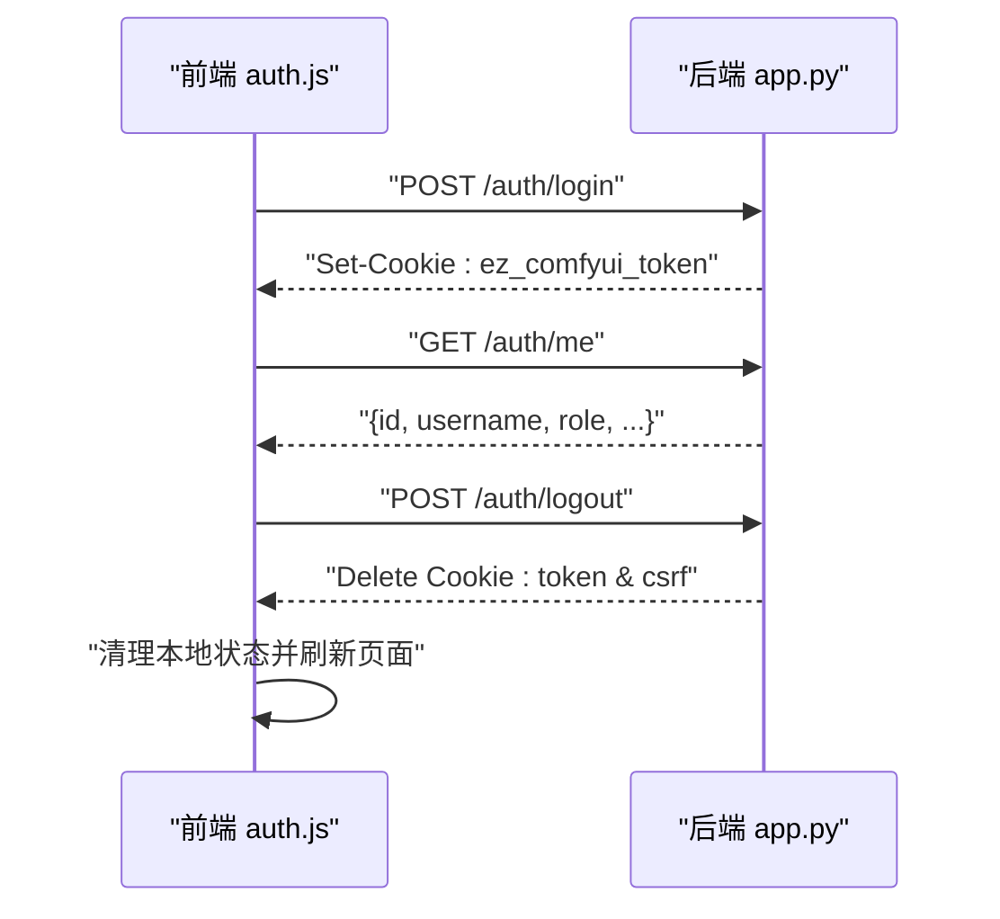
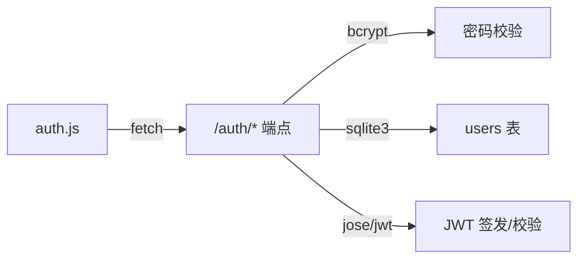

# 安全考虑

<cite>
**本文引用的文件**
- [app.py](file://app.py)
- [auth.js](file://static/js/modules/auth.js)
- [test_security_controls.py](file://tests/test_security_controls.py)
</cite>

## 目录
1. [简介](#简介)
2. [项目结构](#项目结构)
3. [核心组件](#核心组件)
4. [架构总览](#架构总览)
5. [详细组件分析](#详细组件分析)
6. [依赖分析](#依赖分析)
7. [性能考虑](#性能考虑)
8. [故障排查指南](#故障排查指南)
9. [结论](#结论)
10. [附录](#附录)

## 简介
本文件面向 Ez ComfyUI Showcase 的认证与安全机制，系统化梳理后端密码安全策略（bcrypt 哈希、最小长度要求）、速率限制（注册/登录频率限制）、CSRF 保护、会话管理与 Cookie 安全属性，并结合前端实现说明本地存储与跨站脚本防护要点。同时给出安全配置要求、攻击防护建议、最佳实践与审计清单，帮助在生产环境中安全落地。

## 项目结构
认证与安全相关的关键位置如下：
- 后端入口与认证逻辑：app.py
- 前端认证模块：static/js/modules/auth.js
- 安全测试用例：tests/test_security_controls.py

图表来源
- [app.py:77-115](file://app.py#L77-L115)
- [auth.js:1-120](file://static/js/modules/auth.js#L1-L120)

章节来源
- [app.py:77-115](file://app.py#L77-L115)
- [auth.js:1-120](file://static/js/modules/auth.js#L1-L120)

## 核心组件
- 密码安全策略
  - 使用 bcrypt 对明文密码进行哈希存储，验证时采用 bcrypt 校验。
  - 注册与登录对用户名与密码长度进行校验（最小长度要求）。
- 速率限制
  - 基于主机/IP 与用户名维度的滑动窗口计数，限制注册/登录尝试次数。
- CSRF 保护
  - 服务端生成 CSRF Cookie，前端仅在不安全方法（POST/PUT/PATCH/DELETE）时附加 X-CSRF-Token 请求头。
- 会话与 Cookie 安全
  - JWT 令牌通过 HttpOnly、Secure、SameSite=Lax 的 Cookie 存储；CSRF Cookie 用于跨站请求校验。
- 前端安全实现
  - 统一的 fetch 封装自动附加 CSRF 头；登出流程包含页面强制刷新与状态清理；错误消息本地化映射。

章节来源
- [app.py:8451-8506](file://app.py#L8451-L8506)
- [app.py:2506-2542](file://app.py#L2506-L2542)
- [auth.js:279-373](file://static/js/modules/auth.js#L279-L373)

## 架构总览
下图展示认证与安全相关的关键交互：前端发起注册/登录请求，后端进行速率限制与密码校验，成功后签发 JWT 并设置安全 Cookie，后续请求携带 Cookie 与 CSRF 头以通过 CSRF 校验。

图表来源
- [app.py:8451-8506](file://app.py#L8451-L8506)
- [app.py:2506-2542](file://app.py#L2506-L2542)
- [auth.js:279-373](file://static/js/modules/auth.js#L279-L373)

## 详细组件分析

### 密码安全策略
- 哈希算法：bcrypt
  - 注册时对明文密码使用 bcrypt 生成哈希并持久化。
  - 登录时使用 bcrypt 校验输入密码与存储哈希。
- 最小长度要求
  - 注册：用户名至少 2 个字符，密码至少 6 个字符。
  - 修改密码：新密码长度不得少于 6。
- 数据库字段
  - 用户表包含 id、username、password_hash、role、disabled、avatar、created_at 等字段。

图表来源
- [app.py:8451-8506](file://app.py#L8451-L8506)
- [app.py:8523-8540](file://app.py#L8523-L8540)

章节来源
- [app.py:8451-8506](file://app.py#L8451-L8506)
- [app.py:8523-8540](file://app.py#L8523-L8540)

### 速率限制实现（注册/登录频率限制）
- 限流策略
  - 滑动窗口：固定时间窗口内统计同一主机/IP 与用户名的尝试次数。
  - 触发阈值：超过最大允许尝试次数将返回 429 Too Many Requests。
- 清理与键构造
  - 成功注册/登录后清除对应键的计数缓存。
  - 键格式包含动作类型、主机/IP 与标准化后的用户名，避免大小写差异导致绕过。

图表来源
- [app.py:2545-2554](file://app.py#L2545-L2554)
- [app.py:2557-2558](file://app.py#L2557-L2558)

章节来源
- [app.py:2545-2554](file://app.py#L2545-L2554)
- [app.py:2557-2558](file://app.py#L2557-L2558)
- [test_security_controls.py:26-34](file://tests/test_security_controls.py#L26-L34)

### CSRF 保护机制
- CSRF Cookie 与请求头
  - 服务端在响应中设置 CSRF Cookie；前端仅在不安全方法时附加 X-CSRF-Token 请求头。
  - 校验时比较 Cookie 与请求头的 CSRF 值，使用恒等比较以降低时序攻击风险。
- Cookie 属性
  - CSRF Cookie：非 HttpOnly、SameSite=Lax、按需 Secure（HTTPS 时启用）。
  - 认证 Cookie：HttpOnly、SameSite=Lax、按需 Secure（HTTPS 时启用），用于承载 JWT。

图表来源
- [app.py:2520-2537](file://app.py#L2520-L2537)
- [auth.js:95-105](file://static/js/modules/auth.js#L95-L105)

章节来源
- [app.py:2520-2537](file://app.py#L2520-L2537)
- [auth.js:95-105](file://static/js/modules/auth.js#L95-L105)
- [test_security_controls.py:15-24](file://tests/test_security_controls.py#L15-L24)

### 会话安全管理
- 令牌与 Cookie
  - JWT 通过 HttpOnly Cookie 传输，降低 XSS 风险；SameSite=Lax 平衡跨站场景与防护。
  - 登出时删除两个 Cookie，确保会话失效。
- 前端会话恢复与登出
  - 登录成功后调用 /auth/me 获取用户信息并更新 UI。
  - 登出流程包含页面状态清理、异步触发后端登出并强制刷新页面，防止残留状态。

图表来源
- [app.py:8477-8506](file://app.py#L8477-L8506)
- [auth.js:231-373](file://static/js/modules/auth.js#L231-L373)

章节来源
- [app.py:8477-8506](file://app.py#L8477-L8506)
- [auth.js:231-373](file://static/js/modules/auth.js#L231-L373)

### 安全配置要求
- JWT 密钥管理
  - 优先从环境变量读取密钥；若未提供且无法写入文件，则生成 per-install 密钥并设置严格权限。
  - 生产环境务必使用强随机、保密存储的密钥，避免硬编码。
- HTTPS 强制
  - Cookie 的 Secure 属性由请求协议决定；建议在网关或反向代理层强制 HTTPS。
- Cookie 安全属性
  - 认证 Cookie：HttpOnly + SameSite=Lax + Secure（HTTPS）。
  - CSRF Cookie：SameSite=Lax + Secure（HTTPS），非 HttpOnly 以便前端读取。
- 数据库与密钥文件
  - 认证数据库与 JWT 密钥文件应限制文件系统权限，仅允许应用进程读写。

章节来源
- [app.py:82-102](file://app.py#L82-L102)
- [app.py:2506-2531](file://app.py#L2506-L2531)

### 攻击防护措施与最佳实践
- 暴力破解防护
  - 速率限制与错误反馈最小化：统一返回通用错误，避免泄露“用户不存在”与“密码错误”的差异。
- 账户锁定策略
  - 当前实现未内置账户级锁定；建议在失败次数接近阈值时引入临时冻结与验证码挑战。
- 前端本地存储
  - 令牌存储于 HttpOnly Cookie，避免使用 localStorage；前端仅使用 CSRF Cookie 与请求头配合。
- 跨站脚本防护（XSS）
  - 后端渲染与前端输出均需进行合适的转义；模板与 DOM 操作避免直接拼接不可信数据。
- 输入校验与最小权限
  - 对所有外部输入进行长度与格式校验；受保护端点仅依赖 JWT 载荷与数据库查询结果。

章节来源
- [app.py:8451-8506](file://app.py#L8451-L8506)
- [auth.js:192-203](file://static/js/modules/auth.js#L192-L203)

### 前端安全实现、本地存储与跨站脚本防护
- 统一请求封装
  - apiFetch 自动附加认证头与 CSRF 头；credentials 默认 include，确保 Cookie 跨域发送。
- 登录/注册 UI
  - 模态框输入校验与错误提示本地化；注册时二次密码校验。
- 本地存储
  - 当前未使用 localStorage 存储敏感令牌；建议保持现状，避免 XSS 暴露。
- 跨站脚本防护
  - 输出转义与最小暴露面；避免在 DOM 中直接插入未经转义的用户输入。

章节来源
- [auth.js:179-185](file://static/js/modules/auth.js#L179-L185)
- [auth.js:279-313](file://static/js/modules/auth.js#L279-L313)
- [auth.js:448-482](file://static/js/modules/auth.js#L448-L482)

## 依赖分析
- 后端依赖
  - FastAPI：路由与中间件；JWT 解析；Cookie 设置与删除。
  - bcrypt：密码哈希与校验。
  - sqlite3：用户数据持久化。
- 前端依赖
  - fetch：统一 API 调用；自动携带 Cookie。
  - Cookie 读取：CSRF 校验与状态恢复。

图表来源
- [app.py:24-27](file://app.py#L24-L27)
- [app.py:8451-8506](file://app.py#L8451-L8506)
- [auth.js:279-313](file://static/js/modules/auth.js#L279-L313)

章节来源
- [app.py:24-27](file://app.py#L24-L27)
- [app.py:8451-8506](file://app.py#L8451-L8506)
- [auth.js:279-313](file://static/js/modules/auth.js#L279-L313)

## 性能考虑
- 速率限制
  - 内存中的滑动窗口计数，注意高并发下的内存占用与清理策略；可考虑引入 Redis 等外部存储以跨进程共享。
- 密码哈希
  - bcrypt 的成本因子默认由库选择，建议在部署环境评估 CPU 与延迟后进行基准测试。
- Cookie 与 CSRF
  - CSRF Cookie 仅在不安全方法时附加，减少不必要的头部开销。

## 故障排查指南
- 登录失败
  - 检查用户名/密码长度是否满足最小要求；确认用户未被禁用；核对 bcrypt 校验是否通过。
- CSRF 校验失败
  - 确认前端在不安全方法时附加 X-CSRF-Token；核对 CSRF Cookie 是否随请求发送。
- 速率限制触发
  - 确认同一主机/IP 与用户名的尝试次数是否超过阈值；等待窗口期或联系管理员清理。
- 登出无效
  - 确认后端已删除两个 Cookie；前端是否强制刷新页面；检查是否有后台任务仍在运行。

章节来源
- [app.py:8477-8506](file://app.py#L8477-L8506)
- [app.py:2534-2537](file://app.py#L2534-L2537)
- [test_security_controls.py:15-34](file://tests/test_security_controls.py#L15-L34)
- [auth.js:315-336](file://static/js/modules/auth.js#L315-L336)

## 结论
本项目在认证与安全方面具备较为完善的基线能力：bcrypt 哈希、最小长度校验、速率限制、CSRF 保护与安全 Cookie 策略。建议在生产环境中进一步强化密钥管理、强制 HTTPS、引入账户锁定与验证码挑战、以及对前端输出与本地存储进行更严格的 XSS 防护与审计。

## 附录
- 安全审计要点
  - 密钥与证书轮换流程与权限控制。
  - HTTPS 强制与 HSTS 配置。
  - 日志与告警：异常登录、频繁失败、CSRF 失败。
  - 前端最小暴露面与输出转义。
  - 定期安全扫描与渗透测试。