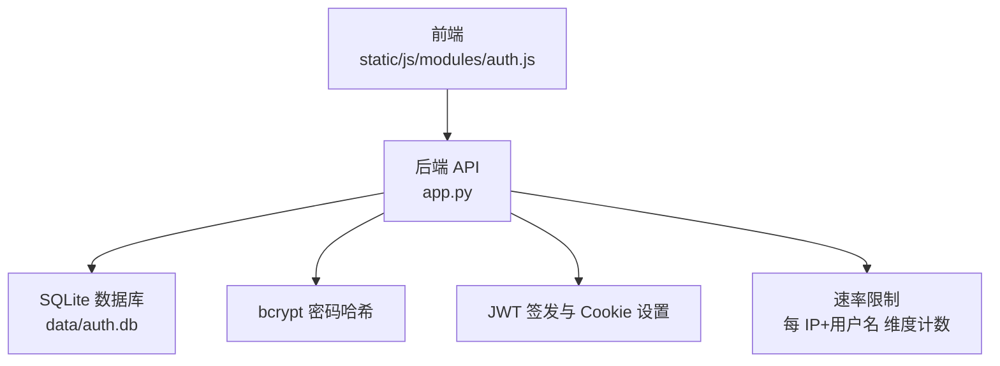
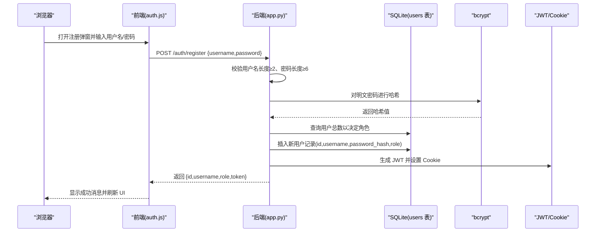
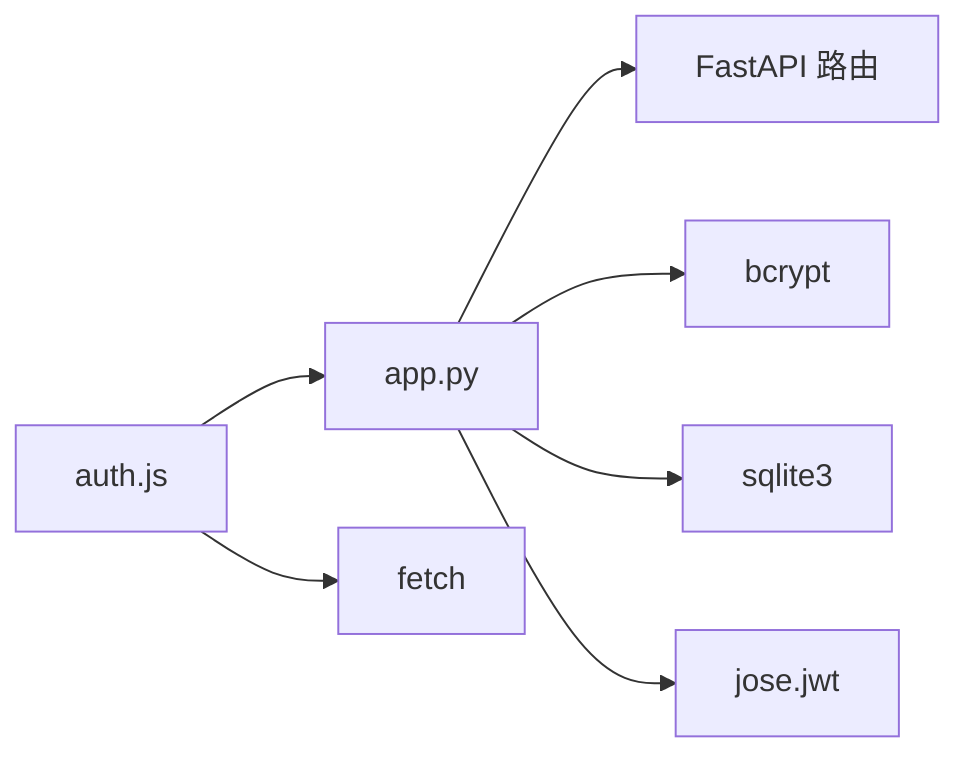

# 用户注册

<cite>
**本文引用的文件**
- [app.py](file://app.py)
- [auth.js](file://static/js/modules/auth.js)
</cite>

## 目录
1. [简介](#简介)
2. [项目结构](#项目结构)
3. [核心组件](#核心组件)
4. [架构总览](#架构总览)
5. [详细组件分析](#详细组件分析)
6. [依赖关系分析](#依赖关系分析)
7. [性能考量](#性能考量)
8. [故障排查指南](#故障排查指南)
9. [结论](#结论)
10. [附录](#附录)

## 简介
本章节面向 Ez ComfyUI Showcase 的“用户注册”能力，聚焦于 POST /auth/register 接口的请求参数、响应格式、错误处理机制，并结合前端实现细节，给出完整的请求/响应示例与错误响应格式。同时覆盖以下关键点：
- 用户名长度验证（至少2个字符）
- 密码强度要求（至少6个字符）
- 重复用户名检查
- bcrypt 密码哈希处理
- 首次注册用户的自动角色分配（第一个用户为 admin，后续用户为 user）
- 速率限制策略
- 安全考虑事项
- 前端注册表单的实现要点

## 项目结构
与用户注册相关的关键位置：
- 后端 FastAPI 应用位于 app.py，其中定义了 /auth/register 路由及认证相关逻辑（含 bcrypt、SQLite 数据库、JWT Cookie、速率限制等）
- 前端认证模块位于 static/js/modules/auth.js，负责发起注册请求、处理错误映射与 UI 更新

图表来源
- [app.py:8451-8475](file://app.py#L8451-L8475)
- [app.py:2545-2558](file://app.py#L2545-L2558)
- [auth.js:279-295](file://static/js/modules/auth.js#L279-L295)

章节来源
- [app.py:8451-8475](file://app.py#L8451-L8475)
- [app.py:2545-2558](file://app.py#L2545-L2558)
- [auth.js:279-295](file://static/js/modules/auth.js#L279-L295)

## 核心组件
- 注册路由与业务逻辑：POST /auth/register
- 请求体校验：用户名长度、密码长度
- 哈希与存储：bcrypt 哈希写入 SQLite users 表
- 角色分配：首个用户为 admin，其余为 user
- 会话与响应：签发 JWT 并通过 Cookie 返回 token
- 错误处理：重复用户名、参数不足、速率限制等
- 前端交互：auth.js 发起注册请求、错误文案映射、UI 切换

章节来源
- [app.py:8451-8475](file://app.py#L8451-L8475)
- [app.py:8376-8386](file://app.py#L8376-L8386)
- [auth.js:279-295](file://static/js/modules/auth.js#L279-L295)

## 架构总览
下图展示从浏览器到后端、再到数据库与安全组件的整体流程。

图表来源
- [app.py:8451-8475](file://app.py#L8451-L8475)
- [auth.js:279-295](file://static/js/modules/auth.js#L279-L295)

## 详细组件分析

### 接口定义：POST /auth/register
- 方法与路径：POST /auth/register
- 请求体字段
  - username: 字符串，必填
  - password: 字符串，必填
- 成功响应字段
  - id: 新用户短 ID
  - username: 用户名
  - role: 角色（admin 或 user）
  - token: 登录后用于会话的 JWT
- 响应类型：JSON
- 认证方式：注册接口本身不强制要求已登录；成功后通过 Set-Cookie 返回会话令牌

章节来源
- [app.py:8451-8475](file://app.py#L8451-L8475)
- [app.py:8376-8386](file://app.py#L8376-L8386)

### 请求参数与校验
- 用户名长度：至少2个字符
- 密码长度：至少6个字符
- 参数不足时返回 400 错误，错误详情包含“用户名至少 2 位，密码至少 6 位”的中文提示

章节来源
- [app.py:8456-8457](file://app.py#L8456-L8457)
- [auth.js:192-203](file://static/js/modules/auth.js#L192-L203)

### 重复用户名检查
- 写入 users 表时若违反唯一约束，捕获 IntegrityError 并返回 409 错误，错误详情为“用户名已存在”

章节来源
- [app.py:8472-8474](file://app.py#L8472-L8474)
- [auth.js:192-203](file://static/js/modules/auth.js#L192-L203)

### bcrypt 密码哈希处理
- 使用 bcrypt.gensalt() 生成盐并计算哈希，将哈希值存入数据库 users.password_hash 字段
- 前端不接收或显示明文密码；后端仅在注册与修改密码时进行哈希

章节来源
- [app.py:8458](file://app.py#L8458)
- [app.py:8536](file://app.py#L8536)
- [app.py:8613](file://app.py#L8613)

### 自动角色分配
- 首个注册用户：role=admin
- 其他用户：role=user
- 实现依据：查询 users 表当前用户数量，0 则分配 admin，否则分配 user

章节来源
- [app.py:8462-8463](file://app.py#L8462-L8463)

### 会话与响应
- 成功注册后签发 JWT 并通过 Cookie 返回 token（名称见应用常量），随后返回 JSON 包含 id、username、role、token
- 前端收到响应后调用会话恢复逻辑，更新 UI 并提示成功

章节来源
- [app.py:8467-8468](file://app.py#L8467-L8468)
- [auth.js:231-277](file://static/js/modules/auth.js#L231-L277)

### 速率限制策略
- 维度：action + 客户端 IP + 用户名（小写去空白）
- 窗口：固定秒数
- 阈值：固定次数
- 触发：超过阈值返回 429 Too Many Requests
- 成功/失败后分别清理或更新计数

章节来源
- [app.py:2540-2558](file://app.py#L2540-L2558)

### 安全考虑事项
- 密码必须经 bcrypt 哈希存储，不落盘明文
- 注册成功后通过 Cookie 返回 token，配合 CSRF Cookie 与安全头策略（详见应用常量与 Cookie 设置）
- 速率限制防止暴力尝试
- 前端错误文案本地化，便于用户理解

章节来源
- [app.py:26-27](file://app.py#L26-L27)
- [app.py:105-114](file://app.py#L105-L114)
- [auth.js:192-203](file://static/js/modules/auth.js#L192-L203)

### 前端注册表单实现要点
- 发起请求：auth.register(username, password) -> POST /auth/register
- 输入校验：前端还进行“两次密码一致”校验（仅前端）
- 错误映射：将后端 detail 映射为中文提示
- 成功处理：调用 /auth/me 恢复会话并刷新 UI

章节来源
- [auth.js:279-295](file://static/js/modules/auth.js#L279-L295)
- [auth.js:457-467](file://static/js/modules/auth.js#L457-L467)
- [auth.js:192-203](file://static/js/modules/auth.js#L192-L203)

## 依赖关系分析
- 后端依赖
  - FastAPI：路由与请求/响应模型
  - bcrypt：密码哈希
  - sqlite3：用户数据持久化
  - jose.jwt：JWT 编解码
  - cookies：Set-Cookie 管理
- 前端依赖
  - fetch：HTTP 请求
  - auth.js：封装注册/登录/会话逻辑

图表来源
- [app.py:18-27](file://app.py#L18-L27)
- [auth.js:179-185](file://static/js/modules/auth.js#L179-L185)

章节来源
- [app.py:18-27](file://app.py#L18-L27)
- [auth.js:179-185](file://static/js/modules/auth.js#L179-L185)

## 性能考量
- bcrypt 哈希成本较高，建议在高并发场景下配合限流与异步处理
- SQLite 在单机部署下足够使用，若需扩展可考虑外部数据库
- 速率限制基于内存字典计数，进程重启后清零；如需跨进程持久化，可替换为 Redis 等

## 故障排查指南
- 400 参数不足
  - 现象：用户名长度不足2或密码长度不足6
  - 处理：补齐参数后重试
- 409 用户名已存在
  - 现象：用户名冲突
  - 处理：更换用户名或前往登录
- 429 太多尝试
  - 现象：短时间内多次失败
  - 处理：等待冷却或更换 IP/用户名
- 5xx 数据库异常
  - 现象：SQLite 写入失败
  - 处理：检查磁盘空间与权限，重试或联系管理员

章节来源
- [app.py:8456-8457](file://app.py#L8456-L8457)
- [app.py:8472-8474](file://app.py#L8472-L8474)
- [app.py:2550-2552](file://app.py#L2550-L2552)

## 结论
POST /auth/register 提供了简洁可靠的用户注册能力：严格的参数校验、安全的密码哈希、自动的角色分配、完善的错误映射与速率限制。前后端协同确保用户体验与安全性兼顾。建议在生产环境进一步完善日志审计与监控告警，以提升可观测性与可维护性。

## 附录

### 请求与响应示例

- 请求示例
  - 方法：POST
  - 路径：/auth/register
  - 头部：Content-Type: application/json
  - 示例负载：
    {
      "username": "example_user",
      "password": "secure_password"
    }

- 成功响应示例
  {
    "id": "abcd1234",
    "username": "example_user",
    "role": "user",
    "token": "eyJhbGciOiJIUzI1NiIsInR5cCI6IkpXVCJ9..."
  }

- 错误响应示例
  - 参数不足（400）
  {
    "detail": "用户名至少 2 位，密码至少 6 位"
  }
  - 重复用户名（409）
  {
    "detail": "用户名已存在"
  }
  - 太多尝试（429）
  {
    "detail": "Too many authentication attempts"
  }

章节来源
- [auth.js:279-295](file://static/js/modules/auth.js#L279-L295)
- [auth.js:192-203](file://static/js/modules/auth.js#L192-L203)
- [app.py:8456-8457](file://app.py#L8456-L8457)
- [app.py:8472-8474](file://app.py#L8472-L8474)
- [app.py:2550-2552](file://app.py#L2550-L2552)