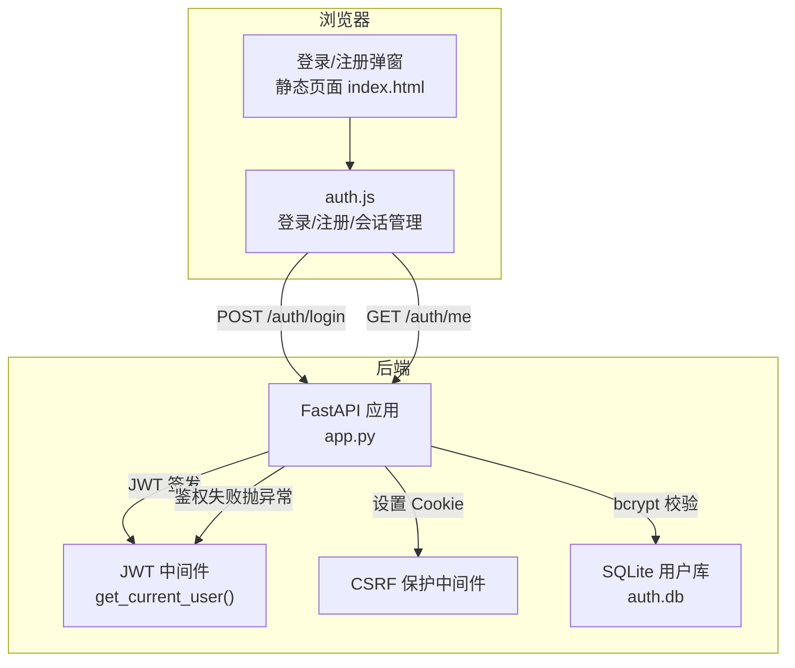
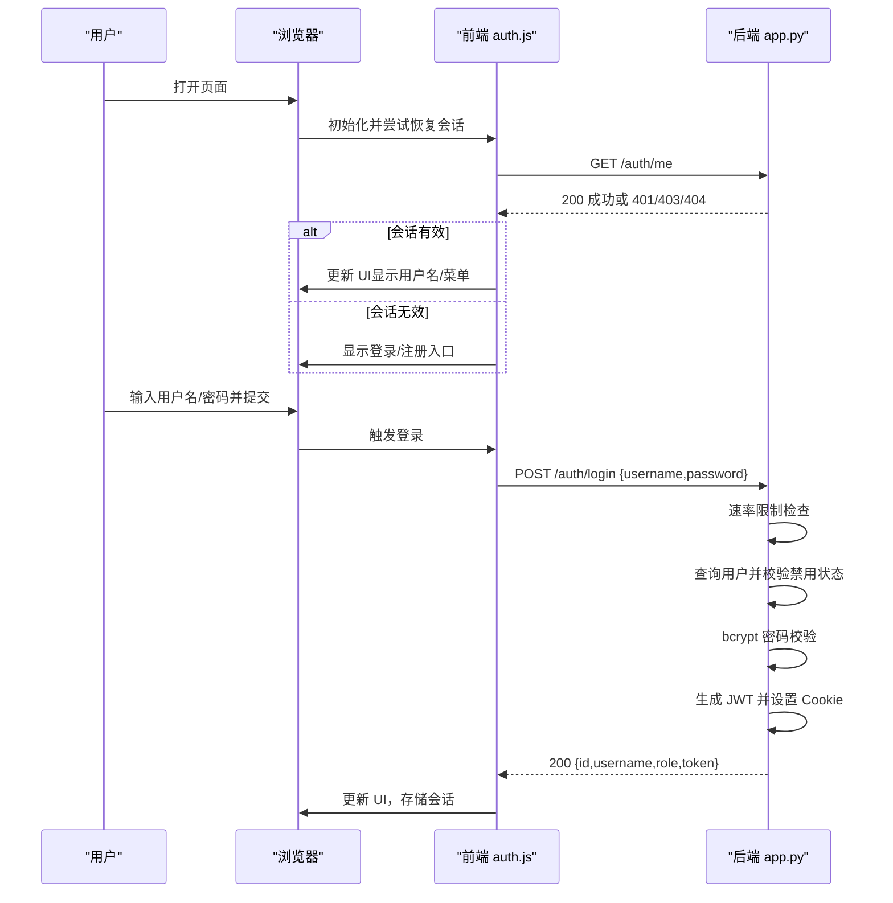
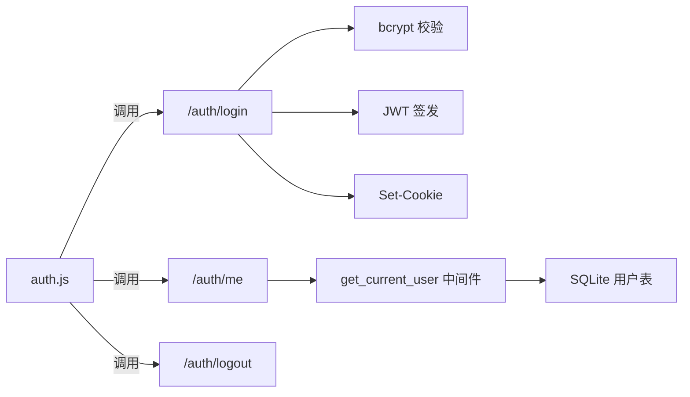

# 用户登录

<cite>
**本文引用的文件**
- [app.py](file://app.py)
- [auth.js](file://static/js/modules/auth.js)
- [index.html](file://static/index.html)
- [V4_PHASE1_IMPLEMENTATION.md](file://docs/archive/root-md-2026-06-03/V4_PHASE1_IMPLEMENTATION.md)
</cite>

## 目录
1. [简介](#简介)
2. [项目结构](#项目结构)
3. [核心组件](#核心组件)
4. [架构总览](#架构总览)
5. [详细组件分析](#详细组件分析)
6. [依赖关系分析](#依赖关系分析)
7. [性能考量](#性能考量)
8. [故障排查指南](#故障排查指南)
9. [结论](#结论)
10. [附录](#附录)

## 简介
本文件面向 Ez ComfyUI Showcase 的“用户登录”能力，提供完整的 API 文档与前端集成说明。重点覆盖：
- POST /auth/login 接口的请求参数、响应格式与认证流程
- 用户名密码校验、bcrypt 密码匹配检查、用户状态验证（禁用用户拒绝登录）
- JWT 令牌生成与 Cookie 设置
- 登录失败的速率限制机制、会话管理与安全防护
- 前端登录表单实现、自动登录状态检查与认证中间件使用

## 项目结构
围绕登录功能的关键文件与职责如下：
- 后端 FastAPI 应用（app.py）：定义 /auth/* 端点、JWT 中间件、CSRF 保护、速率限制、SQLite 用户库
- 前端模块（static/js/modules/auth.js）：封装登录/注册/登出、会话状态检查、API 请求拦截器
- 前端页面（static/index.html）：标题栏挂载登录/注册/退出 UI 入口
- 设计文档（docs/archive/root-md-2026-06-03/V4_PHASE1_IMPLEMENTATION.md）：提供早期实现要点与约定

图表来源
- [app.py](file://app.py)
- [auth.js](file://static/js/modules/auth.js)
- [index.html](file://static/index.html)

章节来源
- [app.py](file://app.py)
- [auth.js](file://static/js/modules/auth.js)
- [index.html](file://static/index.html)

## 核心组件
- 登录接口：POST /auth/login
- 会话查询：GET /auth/me
- 会话清理：POST /auth/logout
- 认证中间件：get_current_user（从 Authorization 头解析 JWT，并校验用户是否存在且未被禁用）
- CSRF 保护：对非 GET/HEAD/OPTIONS 请求在特定路径强制校验 CSRF Cookie
- 速率限制：针对登录与注册的窗口化尝试次数限制
- 前端模块：auth.js 提供登录/注册/登出、自动会话恢复、错误映射与 UI 更新

章节来源
- [app.py](file://app.py)
- [auth.js](file://static/js/modules/auth.js)

## 架构总览
登录流程涉及前后端协作：前端收集凭据并发起登录请求，后端进行校验与速率限制，通过 bcrypt 验证密码，查询用户状态，签发 JWT 并通过 Set-Cookie 返回；随后前端可调用 /auth/me 获取当前用户信息。

图表来源
- [app.py](file://app.py)
- [auth.js](file://static/js/modules/auth.js)

## 详细组件分析

### 后端接口：POST /auth/login
- 请求体
  - 字段：username（必填，将去除首尾空白）、password（必填）
  - Content-Type：application/json
- 行为流程
  1) 速率限制检查（同一用户名在 300 秒内最多 8 次尝试）
  2) 参数校验（用户名/密码均不能为空）
  3) 查询 SQLite 用户表 users，若不存在返回 404
  4) 若用户 disabled=true，返回 403
  5) 使用 bcrypt 校验密码哈希，失败返回 401
  6) 生成 JWT（含 sub、username、role 等），设置安全 Cookie（ez_comfyui_token），并返回 {id, username, role, token}
- 响应
  - 200 OK：{id, username, role, token}
  - 400 Bad Request：用户名或密码为空
  - 401 Unauthorized：密码错误
  - 403 Forbidden：用户被禁用
  - 404 Not Found：用户名不存在
  - 429 Too Many Requests：超过速率限制
- 安全要点
  - 密码使用 bcrypt 哈希存储与校验
  - 登录成功后通过 Set-Cookie 返回令牌 Cookie
  - CSRF 保护中间件对非安全方法在 /auth/login 与 /auth/register 放行，其余受保护路径需携带 CSRF Cookie

章节来源
- [app.py](file://app.py)

### 会话查询：GET /auth/me
- 用途：前端在页面初始化时调用，以恢复登录状态
- 认证方式：依赖 JWT 中间件 get_current_user，从 Authorization 头提取并解码 JWT，再查询用户是否存在且未被禁用
- 响应：返回当前用户信息（id, username, role, disabled, avatar, created_at）

章节来源
- [app.py](file://app.py)

### 会话清理：POST /auth/logout
- 行为：删除两个 Cookie（ez_comfyui_token 与 CSRF Cookie），返回 {"ok": true}
- 前端：调用后触发页面重载，确保客户端状态清理

章节来源
- [app.py](file://app.py)
- [auth.js](file://static/js/modules/auth.js)

### 认证中间件：get_current_user
- 作用：从 Authorization 头解析 Bearer Token，解码 JWT，查询用户是否存在且未被禁用，附加 role 信息
- 异常：未认证（401）、无效令牌（401）、用户不存在（401）、用户被禁用（403）

章节来源
- [app.py](file://app.py)

### CSRF 保护中间件
- 仅对非安全方法（POST/PUT/PATCH/DELETE）生效
- 对 /auth/login 与 /auth/register 放行
- 对 /api/* 与 /auth/* 路径在缺少有效 CSRF Cookie 时拒绝请求（403）

章节来源
- [app.py](file://app.py)

### 速率限制机制
- 窗口：300 秒
- 上限：每用户名最多 8 次尝试
- 触发：超过上限返回 429
- 清理：登录/注册成功后清除对应键的计数

章节来源
- [app.py](file://app.py)

### 前端登录表单与会话管理
- 登录弹窗：包含用户名/密码输入、提交按钮、错误提示
- 登录流程：构造 JSON 请求体，发送 POST /auth/login，解析响应，调用 /auth/me 获取完整用户信息，更新 UI
- 自动登录状态检查：页面加载时调用 /auth/me，根据返回结果决定显示登录/注册或用户菜单
- 会话清理：调用 /auth/logout，删除 Cookie 并刷新页面
- 错误映射：将后端错误消息映射为中文提示

章节来源
- [auth.js](file://static/js/modules/auth.js)
- [index.html](file://static/index.html)

## 依赖关系分析
- 后端依赖
  - FastAPI：路由定义、依赖注入、异常处理
  - python-jose：JWT 编解码
  - bcrypt：密码哈希与校验
  - sqlite3：用户数据持久化
  - uvicorn：ASGI 服务器（由项目生命周期管理）
- 前端依赖
  - fetch：HTTP 请求
  - localStorage：令牌与偏好存储
  - 模态框与 UI 组件：登录/注册弹窗、下拉菜单

图表来源
- [app.py](file://app.py)
- [auth.js](file://static/js/modules/auth.js)

章节来源
- [app.py](file://app.py)
- [auth.js](file://static/js/modules/auth.js)

## 性能考量
- 速率限制基于内存字典计数，重启后清空；部署多实例时需考虑共享缓存策略
- bcrypt 校验与 SQLite 查询均为 O(1) 级别，整体延迟取决于数据库 I/O
- JWT 解析与 CSRF 校验开销极小
- 建议：生产环境启用数据库连接池与索引优化（username 唯一索引）

## 故障排查指南
- 400 参数错误
  - 现象：用户名或密码为空
  - 处理：检查前端表单校验与请求体
- 401 未认证/无效令牌
  - 现象：Authorization 头缺失或无效
  - 处理：确认前端是否正确设置 Authorization 头或 Cookie；检查 CSRF 中间件放行路径
- 401 密码错误
  - 现象：bcrypt 校验失败
  - 处理：确认密码正确；检查速率限制是否触发
- 403 用户被禁用
  - 现象：用户 disabled=true
  - 处理：联系管理员启用账户
- 404 用户不存在
  - 现象：SQLite 查询无结果
  - 处理：确认用户名拼写；检查用户是否已注册
- 429 尝试过多
  - 现象：短时间内多次失败
  - 处理：等待窗口期结束或联系管理员

章节来源
- [app.py](file://app.py)
- [auth.js](file://static/js/modules/auth.js)

## 结论
Ez ComfyUI Showcase 的登录体系以 FastAPI + JWT 为核心，结合 bcrypt 密码校验、SQLite 用户表与 CSRF 保护，提供了安全可控的认证流程。前端通过 auth.js 实现了完整的登录/注册/登出与会话恢复能力，配合页面 UI 自动切换，提升了用户体验。建议在生产环境中完善速率限制的分布式共享、强化日志审计与令牌刷新策略。

## 附录

### API 定义与示例

- POST /auth/login
  - 请求体
    - username: string（必填，将去除首尾空白）
    - password: string（必填）
  - 成功响应
    - 200: {id: string, username: string, role: string, token: string}
  - 常见错误
    - 400: 用户名或密码为空
    - 401: 密码错误
    - 403: 用户被禁用
    - 404: 用户名不存在
    - 429: 超过速率限制

- GET /auth/me
  - 成功响应
    - 200: {id: string, username: string, role: string, disabled: boolean, avatar: string, created_at: string}

- POST /auth/logout
  - 成功响应
    - 200: {ok: true}

章节来源
- [app.py](file://app.py)

### 前端实现要点
- 登录弹窗：用户名/密码输入、提交按钮、错误提示
- 登录流程：fetch 发送 POST /auth/login，解析响应后调用 /auth/me，更新 UI
- 自动登录状态检查：页面加载时调用 /auth/me，根据返回结果切换 UI
- 会话清理：调用 /auth/logout，删除 Cookie 并刷新页面
- 错误映射：将后端错误消息映射为中文提示

章节来源
- [auth.js](file://static/js/modules/auth.js)
- [index.html](file://static/index.html)

### 安全与合规
- 密码最小长度：6 位
- 用户名唯一性：SQLite 唯一约束
- JWT 密钥：通过环境变量或本地文件生成，建议生产环境使用强随机密钥并妥善保管
- CSRF 保护：对非安全方法强制校验 CSRF Cookie
- 令牌存储：后端通过 Cookie 返回，前端无需自行持久化令牌

章节来源
- [V4_PHASE1_IMPLEMENTATION.md](file://docs/archive/root-md-2026-06-03/V4_PHASE1_IMPLEMENTATION.md)
- [app.py](file://app.py)