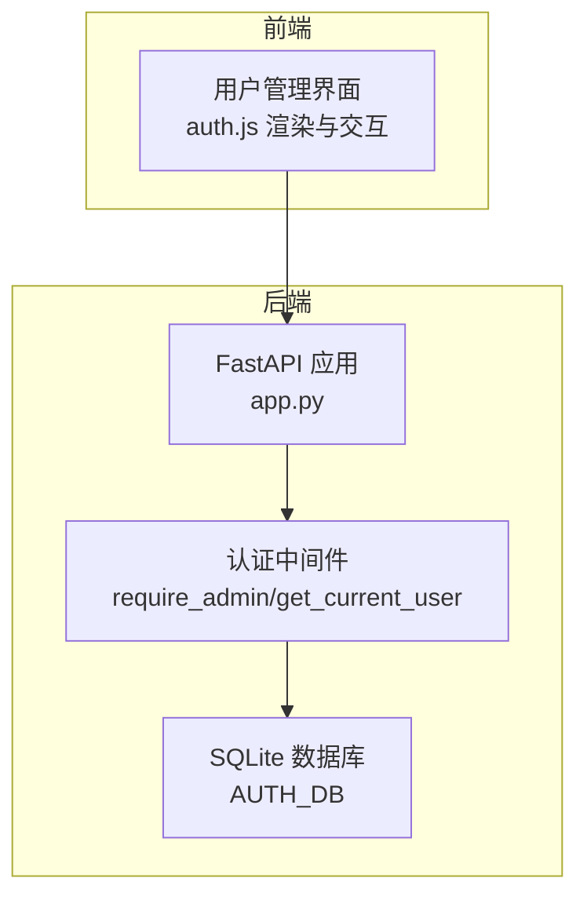
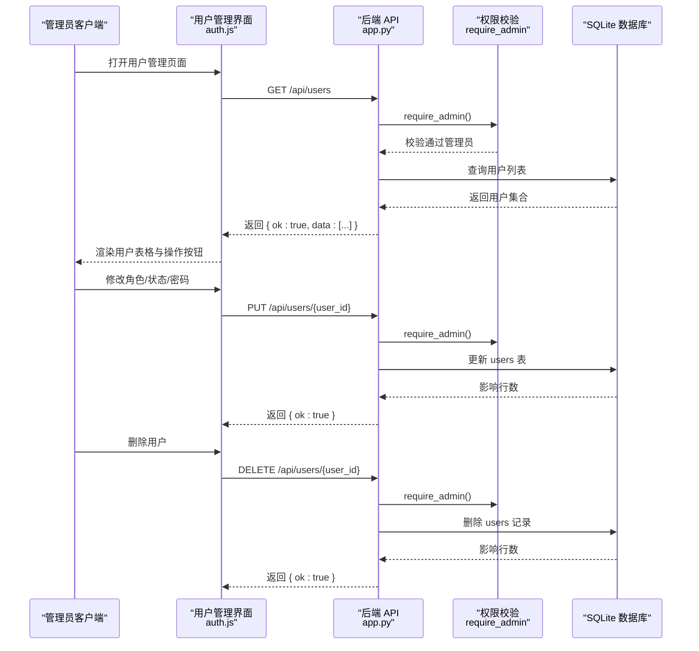
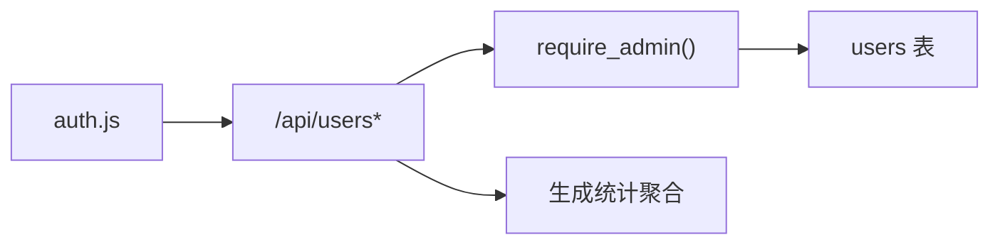

# 用户管理

<cite>
**本文引用的文件**
- [app.py](file://app.py)
- [auth.js](file://static/js/modules/auth.js)
- [style.css](file://static/css/style.css)
- [SECURITY_REVIEW.md](file://docs/archive/root-md-2026-06-03/SECURITY_REVIEW.md)
- [V4_PHASE1_IMPLEMENTATION.md](file://docs/archive/root-md-2026-06-03/V4_PHASE1_IMPLEMENTATION.md)
</cite>

## 目录
1. [简介](#简介)
2. [项目结构](#项目结构)
3. [核心组件](#核心组件)
4. [架构总览](#架构总览)
5. [详细组件分析](#详细组件分析)
6. [依赖分析](#依赖分析)
7. [性能考量](#性能考量)
8. [故障排查指南](#故障排查指南)
9. [结论](#结论)
10. [附录](#附录)

## 简介
本文件为 Ez ComfyUI Showcase 的“用户管理”功能提供完整、可操作的 API 文档与最佳实践说明。内容覆盖管理员对用户进行的增删改查、角色与状态变更、批量操作支持、权限校验、错误处理以及与系统其他模块的集成关系。文档同时给出安全建议与操作限制，帮助管理员在保障安全的前提下高效管理用户。

## 项目结构
用户管理相关能力主要由后端 FastAPI 应用提供，前端通过静态 JS 模块调用后端 API 并渲染界面。数据库采用 SQLite，认证与授权基于 JWT 令牌与管理员权限校验。

图表来源
- [app.py](file://app.py)
- [auth.js](file://static/js/modules/auth.js)

章节来源
- [app.py](file://app.py)
- [auth.js](file://static/js/modules/auth.js)

## 核心组件
- 管理员权限校验：require_admin 依赖注入，确保仅管理员可访问受保护的用户管理接口。
- 用户列表查询：返回用户基础信息及生成统计。
- 用户创建：管理员创建新用户并设置初始角色与密码。
- 用户更新：支持修改角色、启用/禁用、重置密码。
- 用户删除：管理员删除指定用户，禁止自我删除。
- 前端渲染：auth.js 负责拉取用户列表、渲染行项、触发保存与删除操作。
- 样式支持：style.css 提供用户管理界面的网格布局与状态样式。

章节来源
- [app.py](file://app.py)
- [auth.js](file://static/js/modules/auth.js)
- [style.css](file://static/css/style.css)

## 架构总览
管理员用户管理的端到端流程如下：

图表来源
- [app.py](file://app.py)
- [auth.js](file://static/js/modules/auth.js)

## 详细组件分析

### 接口清单与规范

- 获取用户列表
  - 方法与路径：GET /api/users
  - 权限要求：管理员
  - 请求参数：无
  - 响应字段：ok、data（数组），每项包含 id、username、role、disabled、avatar、created_at、generation_count
  - 错误码：403（非管理员）、404（用户不存在）
  - 备注：generation_count 由生成记录表聚合得出

- 创建用户
  - 方法与路径：POST /api/users
  - 权限要求：管理员
  - 请求体字段：username（必填，长度≥2）、password（必填，长度≥6）、role（可选，admin 或 user，默认 user）
  - 响应字段：ok、data（包含 id、username、role、disabled=false）
  - 错误码：400（用户名过短/密码过短/角色非法）、409（用户名冲突）

- 更新用户
  - 方法与路径：PUT /api/users/{user_id}
  - 权限要求：管理员
  - 路径参数：user_id（目标用户 ID）
  - 请求体字段：role（可选，admin 或 user）、disabled（可选，布尔）、new_password（可选，长度≥6）
  - 限制：不可自我禁用；当仅提供 new_password 时无需 role/disabled
  - 响应字段：ok
  - 错误码：400（角色非法/密码过短/试图禁用自己）、404（用户不存在）

- 删除用户
  - 方法与路径：DELETE /api/users/{user_id}
  - 权限要求：管理员
  - 路径参数：user_id
  - 限制：不可自我删除
  - 响应字段：ok
  - 错误码：400（试图删除自己）、404（用户不存在）

- 认证相关（用于理解上下文）
  - 登录：POST /auth/login（用户名、密码）
  - 注册：POST /auth/register（用户名、密码）
  - 当前用户：GET /auth/me
  - 修改密码：POST /auth/change-password（当前密码、新密码）

章节来源
- [app.py](file://app.py)

### 权限与角色管理
- 角色类型：admin（管理员）、user（普通用户）
- 管理员判定：require_admin 会检查当前用户是否为 admin，否则拒绝访问
- 自我限制：更新用户时，若目标用户与当前管理员是同一人，则禁止将其禁用
- 首个注册用户：系统初始化时，首个注册用户将被赋予 admin 角色

章节来源
- [app.py](file://app.py)

### 前端集成与交互
- 列表加载：auth.js 发起 GET /api/users，缓存结果并同步 generation_count 后渲染
- 行内操作：
  - 角色下拉：渲染用户角色选择框
  - 状态按钮：启用/禁用切换，禁用自身时按钮置灰
  - 重置密码输入框：输入新密码并保存
  - 删除按钮：点击触发 DELETE /api/users/{user_id}
- 样式支持：style.css 提供用户管理网格布局、行高亮（当前账户）、按钮状态样式

章节来源
- [auth.js](file://static/js/modules/auth.js)
- [style.css](file://static/css/style.css)

### 数据模型与存储
- users 表关键列：id、username（唯一）、password_hash、role（默认 user）、disabled（默认 0）、avatar、created_at
- 初始化逻辑：首次启动时如未存在 admin，将最早用户提升为 admin
- 生成统计：通过生成记录表按 user_id 聚合计算 generation_count，并合并入用户列表响应

章节来源
- [app.py](file://app.py)

### 批量操作支持
- 当前接口未提供专门的“批量删除/批量禁用”端点
- 建议：如需批量操作，可在前端循环调用单条更新/删除接口，或在后端扩展批量端点以减少往返次数

章节来源
- [app.py](file://app.py)
- [auth.js](file://static/js/modules/auth.js)

### 错误处理与安全
- 错误处理：
  - 参数校验失败：400（如角色非法、密码过短、用户名过短）
  - 资源不存在：404（用户不存在）
  - 权限不足：403（非管理员访问受保护接口）
  - 冲突：409（用户名已存在）
- 安全要点：
  - 密码使用 bcrypt 哈希存储
  - JWT 密钥通过环境变量配置
  - 所有受限接口均依赖 require_admin
  - 前端对自身禁用/删除按钮进行 UI 层限制

章节来源
- [app.py](file://app.py)
- [SECURITY_REVIEW.md](file://docs/archive/root-md-2026-06-03/SECURITY_REVIEW.md)
- [V4_PHASE1_IMPLEMENTATION.md](file://docs/archive/root-md-2026-06-03/V4_PHASE1_IMPLEMENTATION.md)

## 依赖分析
- 组件耦合：
  - 用户管理 API 依赖 require_admin 进行权限校验
  - 用户列表接口依赖生成统计聚合逻辑
  - 前端 auth.js 依赖用户管理 API 提供的数据与操作
- 外部依赖：
  - bcrypt：密码哈希
  - sqlite3：本地数据库访问
  - jwt：令牌解析与签发

图表来源
- [app.py](file://app.py)
- [auth.js](file://static/js/modules/auth.js)

章节来源
- [app.py](file://app.py)
- [auth.js](file://static/js/modules/auth.js)

## 性能考量
- 列表查询：当前为一次性读取所有用户并附加生成统计，适合中小规模用户集
- 扩展建议：
  - 分页：为 /api/users 增加分页参数
  - 缓存：对只读列表结果进行短期缓存
  - 聚合优化：在数据库侧完成 generation_count 聚合，避免应用层二次遍历

## 故障排查指南
- 无法访问用户管理接口
  - 检查当前登录用户是否为管理员
  - 确认请求头携带有效 JWT Cookie
- 更新用户失败
  - 确认请求体字段合法（role、disabled、new_password）
  - 确认未尝试禁用自身
- 删除用户失败
  - 确认非自我删除
- 用户名冲突
  - 更换用户名或确认是否已被占用
- 密码修改失败
  - 确认新密码长度≥6
  - 确认当前密码正确

章节来源
- [app.py](file://app.py)

## 结论
Ez ComfyUI Showcase 的用户管理功能以管理员权限为核心，提供了完整的用户生命周期管理能力。通过前后端协作，管理员可便捷地创建、查询、更新与删除用户，并对角色与状态进行灵活控制。建议在生产环境中结合分页、缓存与批量接口扩展，进一步提升性能与易用性。

## 附录

### 最佳实践
- 新建用户时强制设置强密码
- 定期审查管理员账户，避免长期保留 admin 权限
- 对敏感操作（删除、禁用）增加二次确认
- 使用 HTTPS 与安全 Cookie 配置，防止令牌泄露

### 安全考虑
- 密码最小长度与哈希策略已在实现中落实
- JWT 密钥需来自环境变量
- 所有受保护接口均需管理员权限

章节来源
- [SECURITY_REVIEW.md](file://docs/archive/root-md-2026-06-03/SECURITY_REVIEW.md)
- [V4_PHASE1_IMPLEMENTATION.md](file://docs/archive/root-md-2026-06-03/V4_PHASE1_IMPLEMENTATION.md)