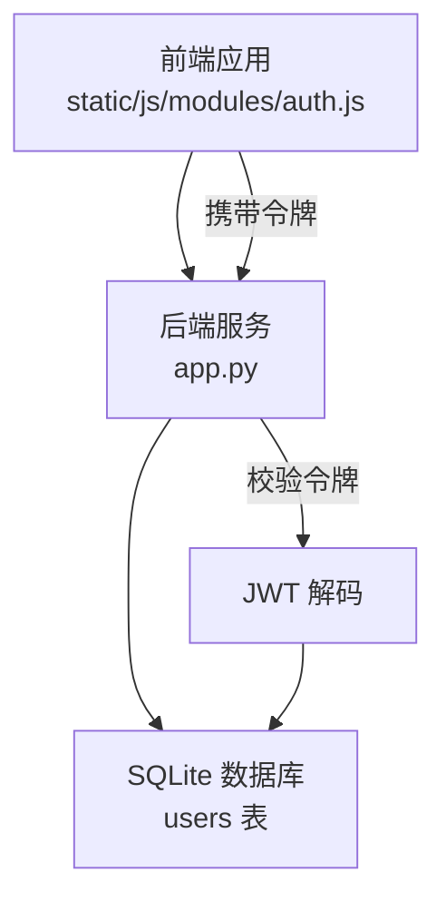
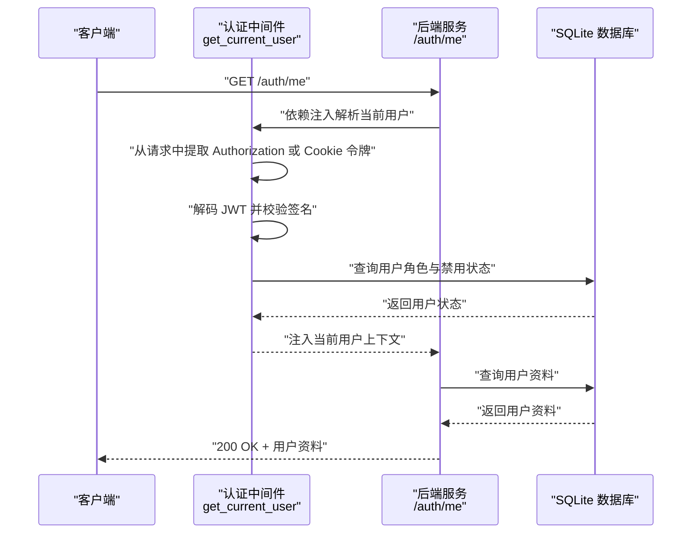
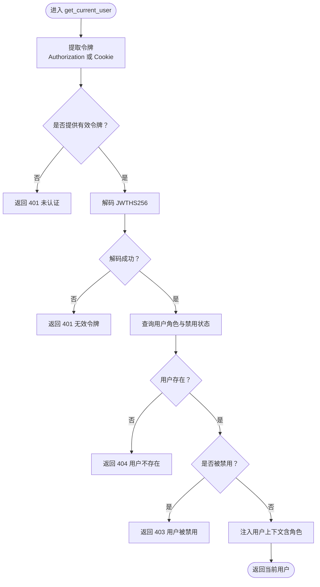
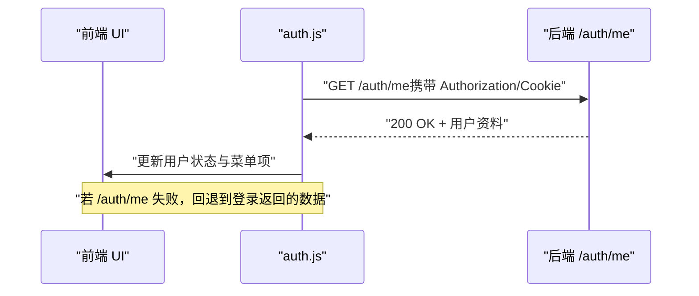
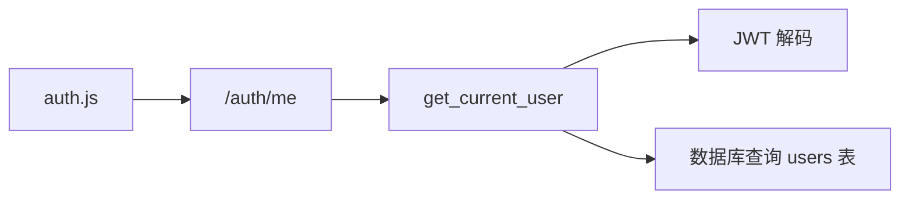

# 用户资料

<cite>
**本文引用的文件**
- [app.py](file://app.py)
- [auth.js](file://static/js/modules/auth.js)
- [V4_PHASE1_IMPLEMENTATION.md](file://docs/archive/root-md-2026-06-03/V4_PHASE1_IMPLEMENTATION.md)
</cite>

## 目录
1. [简介](#简介)
2. [项目结构](#项目结构)
3. [核心组件](#核心组件)
4. [架构总览](#架构总览)
5. [详细组件分析](#详细组件分析)
6. [依赖关系分析](#依赖关系分析)
7. [性能考量](#性能考量)
8. [故障排查指南](#故障排查指南)
9. [结论](#结论)
10. [附录](#附录)

## 简介
本文件为 Ez ComfyUI Showcase 的“用户资料”接口文档，聚焦于 GET /auth/me 的认证要求、请求头格式、响应数据结构、JWT 令牌验证流程、用户信息获取与角色权限检查、错误处理策略以及安全性考虑。文档同时给出请求与响应示例、常见问题排查建议，并对前端如何在登录后调用该接口进行说明。

## 项目结构
- 后端服务位于 app.py，提供 /auth/me 端点及 JWT 认证中间件。
- 前端模块 static/js/modules/auth.js 在登录成功后会自动调用 /auth/me 获取当前用户信息并更新 UI。
- 历史实现文档 docs/archive/root-md-2026-06-03/V4_PHASE1_IMPLEMENTATION.md 提供了早期设计与端点规范参考。

图表来源
- [app.py](file://app.py)
- [auth.js](file://static/js/modules/auth.js)

章节来源
- [app.py](file://app.py)
- [auth.js](file://static/js/modules/auth.js)
- [V4_PHASE1_IMPLEMENTATION.md](file://docs/archive/root-md-2026-06-03/V4_PHASE1_IMPLEMENTATION.md)

## 核心组件
- GET /auth/me：返回当前已认证用户的资料，受 JWT 保护。
- 认证中间件 get_current_user：从请求中提取并校验 JWT，检查用户是否存在且未被禁用，附加角色信息后注入路由依赖。
- 前端 auth.js：在登录成功后自动调用 /auth/me 并更新界面状态。

章节来源
- [app.py](file://app.py)
- [auth.js](file://static/js/modules/auth.js)

## 架构总览
下图展示了客户端、后端与数据库之间的交互，以及 JWT 校验与用户信息查询的关键步骤。

图表来源
- [app.py](file://app.py)

## 详细组件分析

### 接口定义：GET /auth/me
- 方法与路径：GET /auth/me
- 认证方式：需要携带有效的 JWT 令牌
- 访问权限：仅已认证用户可用；若用户被禁用则拒绝访问
- 响应体字段：
  - id：用户唯一标识（字符串）
  - username：用户名（字符串）
  - role：用户角色（字符串，如 user、admin）
  - disabled：是否被禁用（布尔值）
  - avatar：头像链接或空字符串（字符串）
  - created_at：账户创建时间（字符串，遵循数据库存储格式）

请求示例（不含具体令牌内容）
- 请求头
  - Authorization: Bearer <你的JWT令牌>
- 响应示例
  - 200 OK
  - 响应体字段按上文“响应体字段”说明

错误处理
- 401 未认证：缺少或无效的 Authorization 头部、Cookie 中的令牌，或 JWT 解码失败
- 403 用户被禁用：用户存在但处于禁用状态
- 404 用户不存在：用户 ID 在数据库中找不到
- 5xx 服务器内部错误：数据库连接或查询异常

安全与保护机制
- 令牌来源：支持 Authorization: Bearer <token> 与 Cookie（默认 Cookie 名称见配置）
- 令牌验证：使用 HS256 算法与服务端密钥解码，校验签名与过期时间
- 角色与状态：在获取用户上下文时同步检查角色与禁用状态
- CSRF 保护：非安全方法需携带 CSRF 校验（与 /auth/me 无直接关联，但整体安全策略的一部分）

章节来源
- [app.py](file://app.py)

### 认证中间件：get_current_user
- 令牌提取：优先从 Authorization 头部提取 Bearer 令牌；若无，则从指定 Cookie 中提取
- 令牌校验：使用 HS256 算法与服务端密钥解码；解码失败或签名不匹配即返回 401
- 用户状态检查：查询用户是否存在、是否被禁用；禁用用户返回 403
- 上下文注入：将用户信息（含角色）注入到路由依赖中，供后续处理器使用

图表来源
- [app.py](file://app.py)

章节来源
- [app.py](file://app.py)

### 前端调用流程：登录后自动获取用户资料
- 登录成功后，前端会发起 /auth/me 请求以刷新当前用户状态
- 若 /auth/me 成功，前端将使用返回的用户信息更新 UI（例如显示用户名、角色等）
- 若 /auth/me 失败，前端回退到登录时返回的数据并继续初始化模块

图表来源
- [auth.js](file://static/js/modules/auth.js)

章节来源
- [auth.js](file://static/js/modules/auth.js)

### 历史实现参考
- 早期设计文档中明确了 /auth/me 的请求头格式与响应字段，便于对照当前实现的一致性。

章节来源
- [V4_PHASE1_IMPLEMENTATION.md](file://docs/archive/root-md-2026-06-03/V4_PHASE1_IMPLEMENTATION.md)

## 依赖关系分析
- /auth/me 依赖 get_current_user 中间件完成认证与上下文注入
- get_current_user 依赖 JWT 解码与 SQLite 用户表查询
- 前端 auth.js 依赖后端 /auth/me 以完成登录后的状态同步

图表来源
- [app.py](file://app.py)
- [auth.js](file://static/js/modules/auth.js)

章节来源
- [app.py](file://app.py)
- [auth.js](file://static/js/modules/auth.js)

## 性能考量
- 查询复杂度：/auth/me 为单行查询，索引建议在 users.id 上保证高效检索
- 连接管理：每次请求建立一次数据库连接，注意在高并发场景下的连接池配置
- 缓存策略：对于频繁读取的用户资料，可在应用层引入轻量缓存（需评估一致性）

## 故障排查指南
- 401 未认证
  - 检查请求头 Authorization 是否为 Bearer <token> 格式
  - 检查 Cookie 中是否包含令牌（默认 Cookie 名称见配置）
  - 确认 JWT 密钥与算法一致（HS256），且未被篡改
- 403 用户被禁用
  - 确认用户在数据库中未被标记为禁用
- 404 用户不存在
  - 确认用户 ID 与令牌中的 sub 匹配
- 500 服务器错误
  - 检查数据库连接与查询语句
  - 查看服务日志定位异常堆栈

章节来源
- [app.py](file://app.py)

## 结论
GET /auth/me 是 Ez ComfyUI Showcase 的核心用户信息查询接口，采用 JWT 令牌进行认证与授权，结合后端中间件完成用户状态校验与角色注入。前端在登录后自动调用该接口以刷新用户状态。为确保稳定运行，建议严格遵循令牌格式、妥善管理密钥与 Cookie，并在生产环境中启用 HTTPS 与 CSRF 校验。

## 附录

### 字段定义与业务含义
- id：用户唯一标识，用于区分不同用户
- username：用户登录名，用于展示与识别
- role：用户角色（如 user、admin），用于控制访问权限
- disabled：布尔值，表示用户是否被禁用
- avatar：用户头像资源地址或空字符串
- created_at：账户创建时间，用于排序与统计

章节来源
- [app.py](file://app.py)