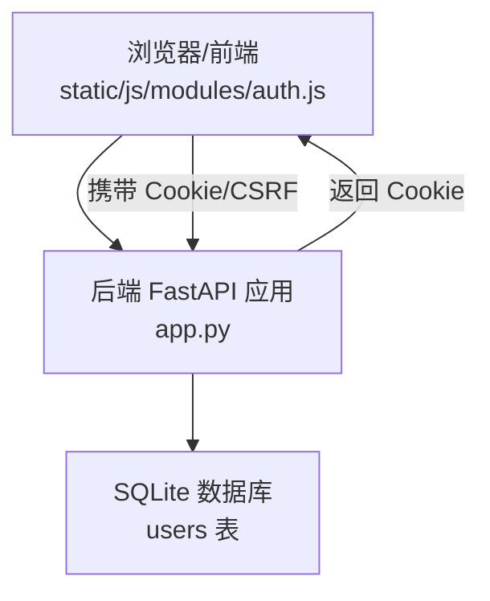
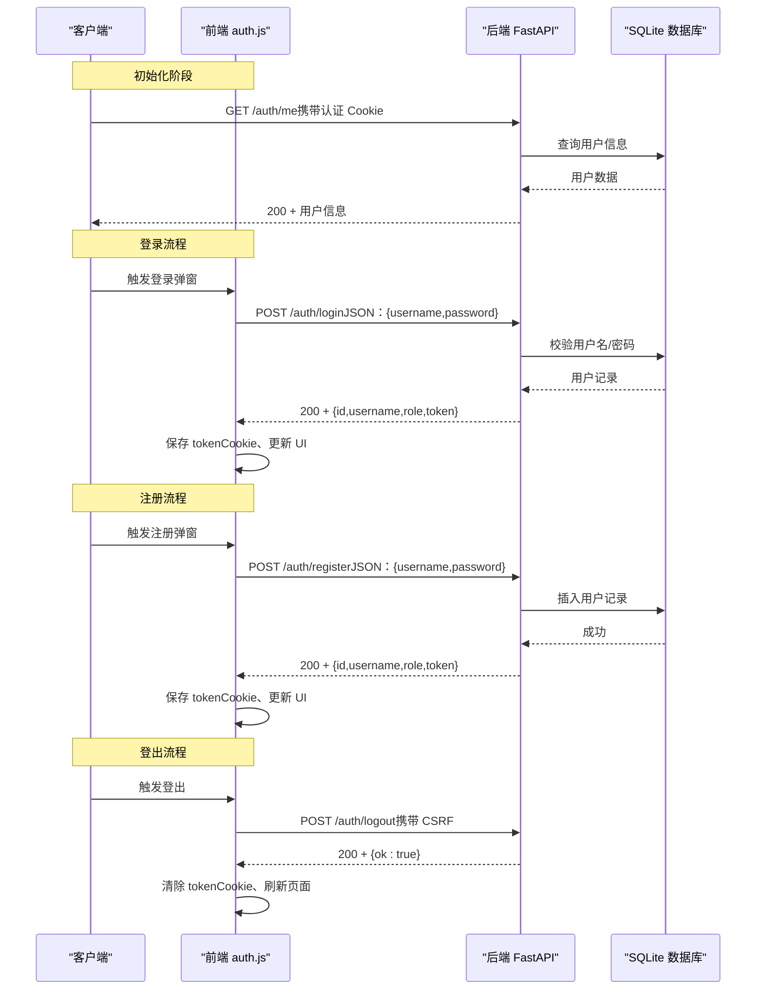
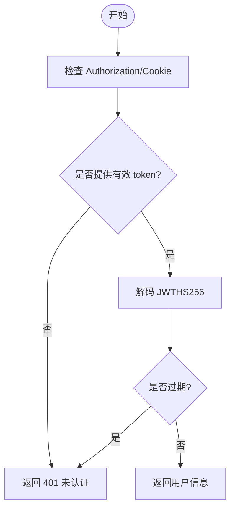
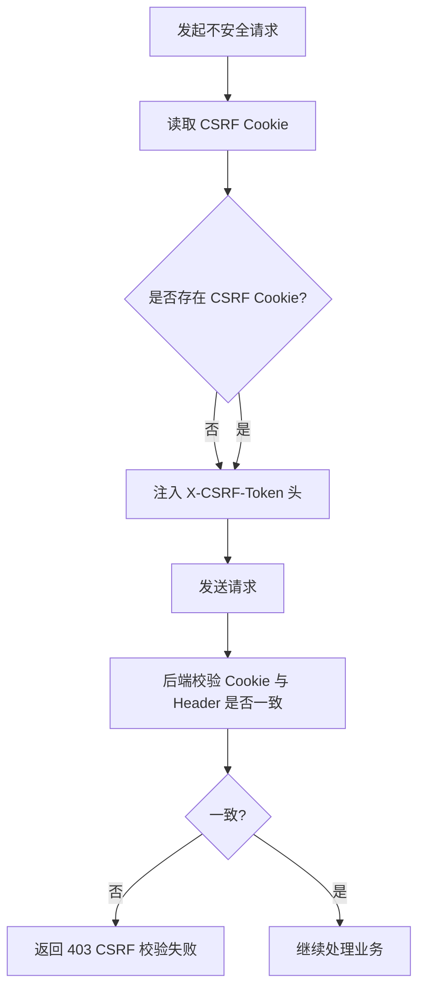
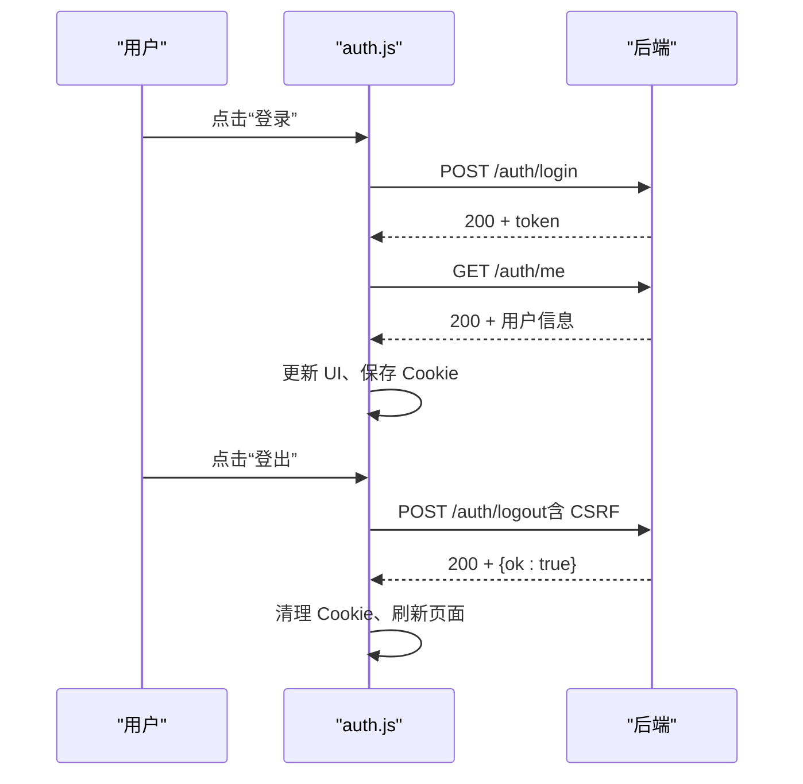
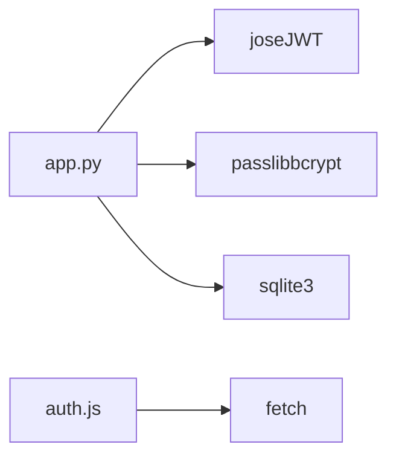

# 认证 API

<cite>
**本文引用的文件**   
- [app.py](file://app.py)
- [auth.js](file://static/js/modules/auth.js)
- [test_security_controls.py](file://tests/test_security_controls.py)
- [V4_PHASE1_IMPLEMENTATION.md](file://docs/archive/root-md-2026-06-03/V4_PHASE1_IMPLEMENTATION.md)
</cite>

## 目录
1. [简介](#简介)
2. [项目结构](#项目结构)
3. [核心组件](#核心组件)
4. [架构总览](#架构总览)
5. [详细组件分析](#详细组件分析)
6. [依赖关系分析](#依赖关系分析)
7. [性能与安全考量](#性能与安全考量)
8. [故障排查指南](#故障排查指南)
9. [结论](#结论)

## 简介
本文件为 Ez ComfyUI Showcase 的认证 API 提供完整接口文档，覆盖用户注册、登录、登出、当前用户信息查询、密码修改以及用户管理（仅管理员）等能力。文档同时说明 JWT 令牌的签发、校验与 Cookie 存储机制，前端如何附带 CSRF 令牌与认证凭据，以及后端的 CSRF 校验、速率限制策略与安全注意事项。为便于不同技术背景读者理解，文档采用逐层递进的方式组织内容，并辅以流程与时序图。

## 项目结构
认证相关的核心代码分布在后端应用与前端模块中：
- 后端：FastAPI 应用定义认证与用户管理接口，负责 JWT 签发与校验、CSRF Cookie 设置与校验、速率限制、数据库访问等。
- 前端：auth.js 模块封装登录/注册弹窗、会话恢复、登出流程、CSRF 注入、API 请求拦截与错误映射等。

图表来源
- [app.py](file://app.py)
- [auth.js](file://static/js/modules/auth.js)

章节来源
- [app.py](file://app.py)
- [auth.js](file://static/js/modules/auth.js)

## 核心组件
- 认证接口
  - POST /auth/register：注册新用户并返回 token
  - POST /auth/login：登录并返回 token
  - POST /auth/logout：清除认证与 CSRF Cookie
  - GET /auth/me：获取当前登录用户信息
  - POST /auth/change-password：修改当前用户密码
  - GET /api/users：管理员列出用户
  - POST /api/users：管理员创建用户
  - PUT /api/users/{user_id}：管理员更新用户（含禁用/改密）
  - DELETE /api/users/{user_id}：管理员删除用户
- 前端模块
  - auth.js：封装登录/注册弹窗、会话恢复、登出、CSRF 注入、API 请求拦截与错误映射
- 安全与中间件
  - JWT 签发与校验（HS256）
  - CSRF Cookie 与 Header 校验
  - 认证相关速率限制（每 5 分钟最多 8 次尝试）

章节来源
- [app.py](file://app.py)
- [auth.js](file://static/js/modules/auth.js)
- [test_security_controls.py](file://tests/test_security_controls.py)

## 架构总览
下图展示认证流程在前后端之间的交互，包括 JWT Cookie 设置、CSRF Cookie 设置、请求时的 CSRF 校验与速率限制。

图表来源
- [app.py](file://app.py)
- [auth.js](file://static/js/modules/auth.js)

章节来源
- [app.py](file://app.py)
- [auth.js](file://static/js/modules/auth.js)

## 详细组件分析

### 接口清单与规范

- 注册
  - 方法与路径：POST /auth/register
  - 请求头：Content-Type: application/json
  - 请求体字段：username, password
  - 成功响应：200，返回 id, username, role, token
  - 错误响应：400（用户名/密码长度不足），409（用户名已存在），429（速率限制）
  - 示例请求（示意）：POST /auth/register，Body: { "username": "...", "password": "..." }
  - 示例响应（示意）：{ "id": "...", "username": "...", "role": "user|admin", "token": "..." }

- 登录
  - 方法与路径：POST /auth/login
  - 请求头：Content-Type: application/json
  - 请求体字段：username, password
  - 成功响应：200，返回 id, username, role, token
  - 错误响应：400（缺少用户名/密码），401（密码错误），403（用户被禁用），404（用户不存在），429（速率限制）
  - 示例请求（示意）：POST /auth/login，Body: { "username": "...", "password": "..." }

- 登出
  - 方法与路径：POST /auth/logout
  - 请求头：X-CSRF-Token: <cookie 中的 CSRF 值>（仅对不安全方法）
  - 成功响应：200，返回 { ok: true }
  - 行为：删除认证 Cookie 与 CSRF Cookie

- 当前用户信息
  - 方法与路径：GET /auth/me
  - 认证方式：Authorization: Bearer <token> 或 Cookie 中的认证 token
  - 成功响应：200，返回 id, username, role, disabled, avatar, created_at
  - 错误响应：401（未认证/无效 token），404（用户不存在）

- 修改密码
  - 方法与路径：POST /auth/change-password
  - 请求头：Content-Type: application/json
  - 请求体字段：current_password, new_password
  - 成功响应：200，返回 { ok: true }
  - 错误响应：400（新密码过短），403（当前密码错误），404（用户不存在）

- 用户管理（管理员）
  - 列表：GET /api/users，返回 { ok: true, data: [...] }
  - 创建：POST /api/users，请求体 { username, password, role? }，返回 { ok: true, data: { id, username, role, disabled } }
  - 更新：PUT /api/users/{user_id}，请求体 { role?, disabled?, new_password? }，返回 { ok: true }
  - 删除：DELETE /api/users/{user_id}，返回 { ok: true }

章节来源
- [app.py](file://app.py)

### JWT 令牌机制
- 生成
  - 载荷包含 sub（用户 id）、username、role、exp（过期时间，默认 31 天）
  - 使用 HS256 算法签名，密钥来自环境变量或本地文件
- 校验
  - 支持从 Authorization: Bearer <token> 或 Cookie 中提取 token
  - 未提供有效 token 时返回 401
- 存储
  - 登录成功后，后端通过 Set-Cookie 返回认证 Cookie（HttpOnly、Secure、SameSite=Lax）
  - 同时下发 CSRF Cookie，用于后续不安全方法请求的 CSRF 校验

图表来源
- [app.py](file://app.py)

章节来源
- [app.py](file://app.py)

### CSRF 保护机制
- Cookie 与 Header 校验
  - 后端设置 CSRF Cookie（非 HttpOnly，SameSite=Lax）
  - 对于 POST/PUT/PATCH/DELETE 等不安全方法，要求请求头 X-CSRF-Token 与 Cookie 中的 CSRF 值一致
  - 使用常量比较函数确保时间安全
- 前端集成
  - auth.js 在发起不安全请求前自动读取 CSRF Cookie 并注入 X-CSRF-Token 请求头
  - 登出与会话恢复流程同样遵循 CSRF 校验

图表来源
- [app.py](file://app.py)
- [auth.js](file://static/js/modules/auth.js)

章节来源
- [app.py](file://app.py)
- [auth.js](file://static/js/modules/auth.js)
- [test_security_controls.py](file://tests/test_security_controls.py)

### 速率限制策略
- 作用范围
  - 针对注册与登录接口，按 {动作}:{客户端IP}:{标准化用户名} 维度计数
- 配置
  - 时间窗口：300 秒
  - 最大尝试次数：8 次
- 行为
  - 超限时返回 429 Too Many Requests
  - 成功登录/注册后清理对应键的计数

章节来源
- [app.py](file://app.py)
- [test_security_controls.py](file://tests/test_security_controls.py)

### 前端认证流程与最佳实践
- 登录/注册弹窗
  - 前端提供模态框，收集用户名与密码，调用相应后端接口
  - 成功后自动拉取 /auth/me 获取当前用户信息并更新 UI
- CSRF 注入
  - 对不安全方法自动附加 X-CSRF-Token
- 会话恢复
  - 页面加载时尝试 /auth/me 恢复登录状态；若失败则清空本地状态
- 登出
  - 发送 /auth/logout，删除本地 token，强制刷新页面，清理页面内状态

图表来源
- [auth.js](file://static/js/modules/auth.js)
- [app.py](file://app.py)

章节来源
- [auth.js](file://static/js/modules/auth.js)
- [app.py](file://app.py)

### 用户权限与访问控制
- 角色
  - user：普通用户
  - admin：管理员（具备用户管理与系统设置权限）
- 访问控制
  - /auth/me：任意已登录用户
  - /auth/change-password：当前登录用户
  - /api/users：require_admin
  - /api/users/*：require_admin
- 特殊规则
  - 管理员不可禁用/删除自身
  - 首个注册用户默认为 admin，其余为 user

章节来源
- [app.py](file://app.py)

## 依赖关系分析
- 后端依赖
  - jose：JWT 编解码
  - passlib bcrypt：密码哈希
  - sqlite3：用户与站点通知等数据持久化
- 前端依赖
  - fetch：HTTP 请求
  - 本地存储：用户偏好与收藏等（与认证无直接耦合）

图表来源
- [app.py](file://app.py)
- [auth.js](file://static/js/modules/auth.js)

章节来源
- [app.py](file://app.py)
- [auth.js](file://static/js/modules/auth.js)

## 性能与安全考量
- 性能
  - JWT 解码为 O(1)，数据库查询为单行读取，开销极低
  - 会话恢复 /auth/me 在页面初始化时调用，建议结合缓存与节流
- 安全
  - JWT 密钥通过环境变量或本地文件管理，首次运行自动生成并限制权限
  - 认证 Cookie 使用 HttpOnly、Secure、SameSite=Lax，降低 XSS 与 CSRF 风险
  - CSRF Cookie 与 Header 必须严格匹配，避免跨站请求伪造
  - 速率限制防止暴力破解与撞库攻击
  - 密码使用 bcrypt 哈希，最小长度约束

章节来源
- [app.py](file://app.py)
- [test_security_controls.py](file://tests/test_security_controls.py)

## 故障排查指南
- 401 未认证
  - 检查请求是否携带有效的 Authorization: Bearer <token> 或 Cookie 中的认证 token
  - 确认 JWT 未过期
- 403 CSRF 校验失败
  - 确保对不安全方法请求头包含 X-CSRF-Token，且与 CSRF Cookie 值一致
  - 检查 SameSite/Lax 是否影响 Cookie 传递
- 403 用户被禁用
  - 管理员需先启用用户
- 404 用户不存在
  - 确认用户名正确或先执行注册
- 409 用户名已存在
  - 更换用户名后重试
- 429 过多尝试
  - 等待窗口结束或减少重试频率
- 登录/注册后无法获取用户信息
  - 检查 /auth/me 是否正常返回；确认前端已正确保存 Cookie

章节来源
- [app.py](file://app.py)
- [auth.js](file://static/js/modules/auth.js)
- [test_security_controls.py](file://tests/test_security_controls.py)

## 结论
Ez ComfyUI Showcase 的认证体系以 JWT 为核心，结合 CSRF 保护与速率限制，提供了基础而稳健的用户认证与授权能力。前端通过 auth.js 将认证流程与 UI 紧密集成，后端通过中间件与装饰器实现统一的访问控制。建议在生产环境中：
- 明确配置 JWT_SECRET_KEY，确保密钥安全
- 使用 HTTPS 以启用 Secure Cookie
- 对管理员操作增加审计日志
- 持续监控认证相关错误与异常