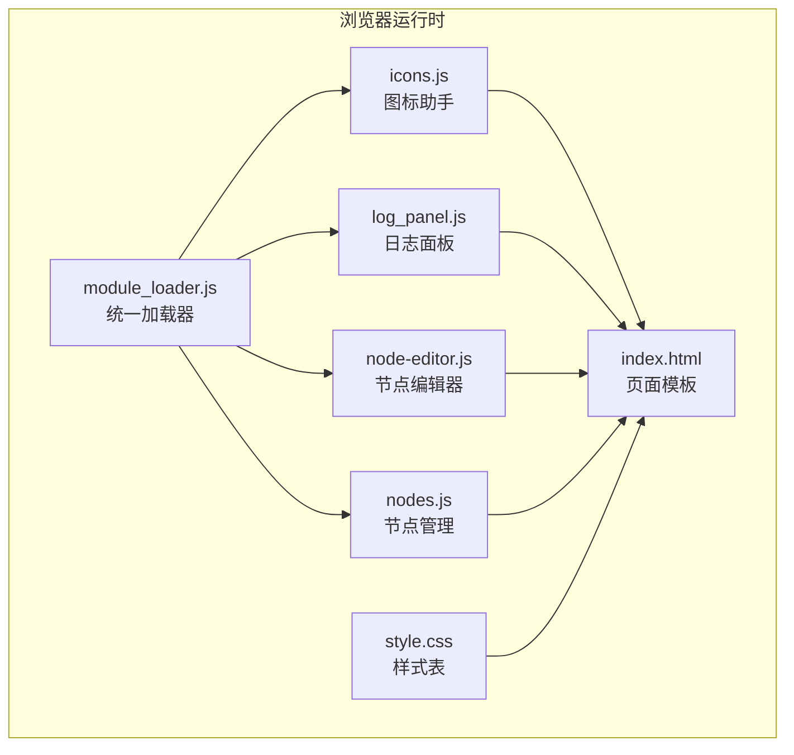
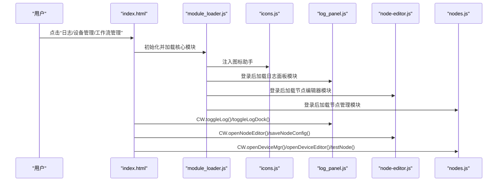
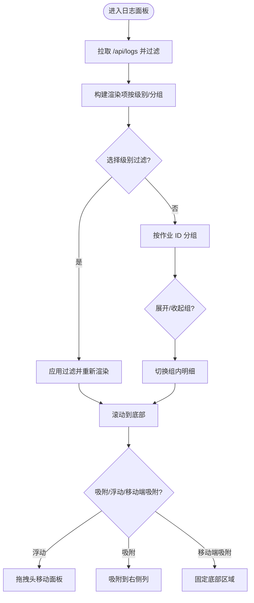
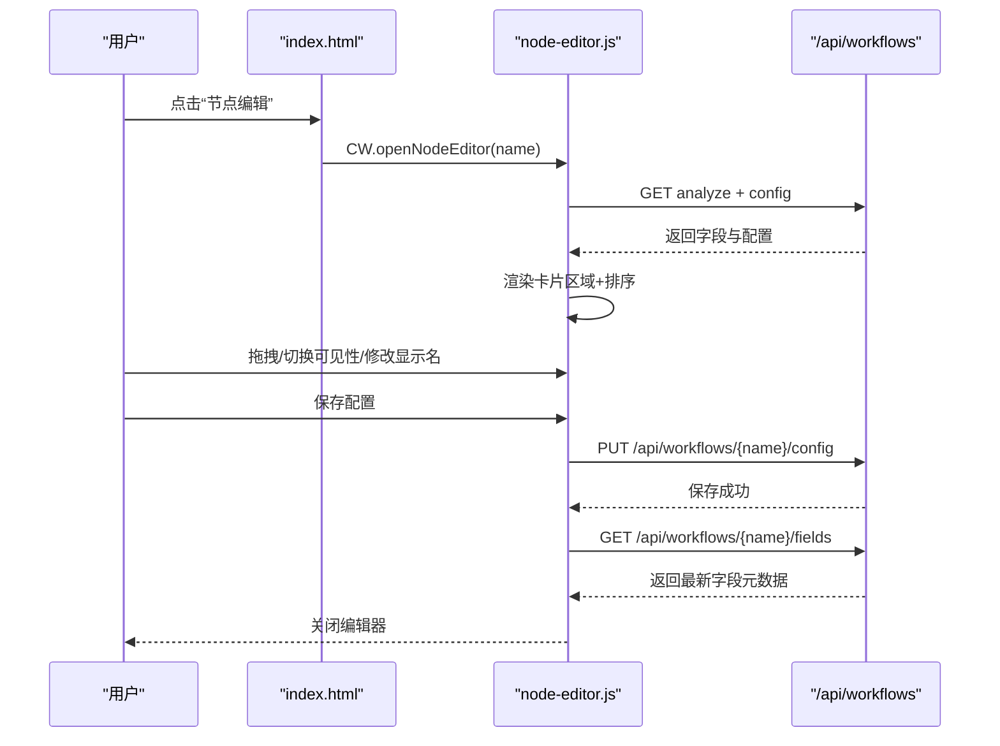
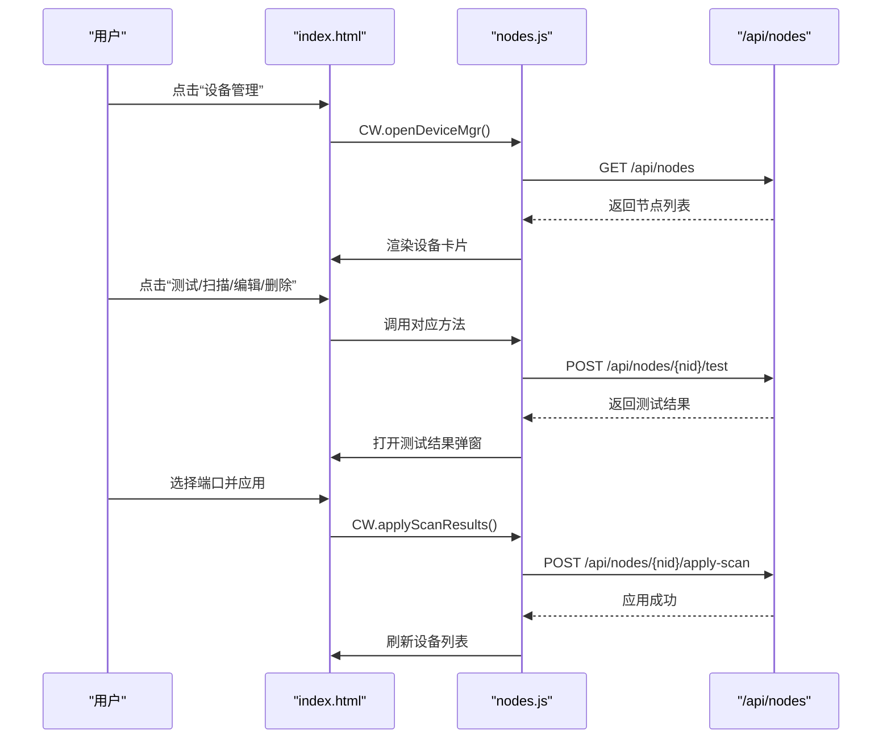
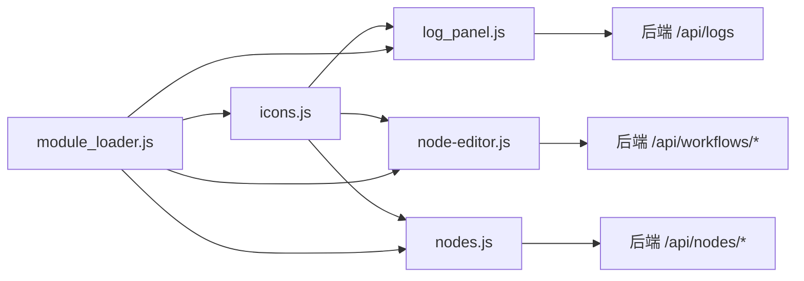

# 专业功能模块

<cite>
**本文档引用的文件**
- [log_panel.js](file://static/js/modules/log_panel.js)
- [node-editor.js](file://static/js/modules/node-editor.js)
- [nodes.js](file://static/js/modules/nodes.js)
- [icons.js](file://static/js/modules/icons.js)
- [index.html](file://static/index.html)
- [module_loader.js](file://static/js/module_loader.js)
- [style.css](file://static/css/style.css)
- [SPECIFICATION.md](file://docs/SPECIFICATION.md)
- [test_log_panel_ui.py](file://tests/test_log_panel_ui.py)
</cite>

## 目录
1. [简介](#简介)
2. [项目结构](#项目结构)
3. [核心组件](#核心组件)
4. [架构总览](#架构总览)
5. [详细组件分析](#详细组件分析)
6. [依赖关系分析](#依赖关系分析)
7. [性能考量](#性能考量)
8. [故障排查指南](#故障排查指南)
9. [结论](#结论)
10. [附录](#附录)

## 简介
本文件面向 Ez ComfyUI Showcase 的专业功能模块，系统化梳理以下四个前端模块：
- 日志面板（log_panel.js）：负责日志采集、过滤与渲染，支持浮动/吸附/移动端吸附三种布局模式，并提供按用户会话清理历史日志的能力。
- 节点编辑器（node-editor.js）：提供工作流节点字段的可视化编辑界面，支持拖拽排序、可见性切换、标签重命名与配置持久化。
- 节点管理（nodes.js）：负责 ComfyUI 节点（本地/SSH/HTTP）的生命周期管理，包括设备发现、实例启停、连通测试、SSH 信息展示等。
- 图标系统（icons.js）：提供统一的 SVG 图标助手，通过内联 SVG Sprite 在模板中以 CW.icon() 方式使用。

上述模块与核心应用协同工作，通过模块加载器按需加载，确保登录态下的功能完整性与性能表现。

## 项目结构
专业功能模块位于 static/js/modules 目录，配合静态资源与模板在运行时注入到页面中。模块加载顺序与条件加载由 module_loader.js 控制，图标资源通过 sprite.svg 内联至页面。

图表来源
- [module_loader.js:14-30](file://static/js/module_loader.js#L14-L30)
- [index.html:17-18](file://static/index.html#L17-L18)
- [icons.js:10-19](file://static/js/modules/icons.js#L10-L19)
- [log_panel.js:6-10](file://static/js/modules/log_panel.js#L6-L10)
- [node-editor.js:5-9](file://static/js/modules/node-editor.js#L5-L9)
- [nodes.js:4-8](file://static/js/modules/nodes.js#L4-L8)
- [style.css:7151-7153](file://static/css/style.css#L7151-L7153)

章节来源
- [module_loader.js:14-30](file://static/js/module_loader.js#L14-L30)
- [index.html:17-18](file://static/index.html#L17-L18)

## 核心组件
- 日志面板（log_panel.js）
  - 功能要点：日志拉取与渲染、按级别过滤、分组展示、拖拽移动、吸附/浮动/移动端吸附布局、按用户会话清理历史。
  - 关键接口：toggleLog、toggleLogDock、closeLog、applyLogFilter、clearLog、toggleLogGroup、_onLog。
  - 数据存储：localStorage 保存“清空时间戳”，仅影响前端展示，不影响服务器日志。
- 节点编辑器（node-editor.js）
  - 功能要点：工作流字段分析、按区域（用户输入/高级/输出/隐藏）可视化排列、拖拽排序、可见性切换、标签重命名、配置持久化。
  - 关键接口：openNodeEditor、closeNodeEditor、saveNodeConfig、resetNodeConfig。
  - 数据来源：/api/workflows/{name}/analyze 与 /api/workflows/{name}/config。
- 节点管理（nodes.js）
  - 功能要点：节点列表渲染、设备连接开关、实例启停/重启/强制重启、连通测试、SSH 信息展示、设备扫描与应用。
  - 关键接口：openDeviceMgr、closeDeviceMgr、openDeviceEditor、saveDevice、testNode、scanNode、applyScanResults、startInstance、stopInstance、restartInstance、forceRestartInstance、toggleDeviceConnection。
  - 数据来源：/api/nodes、/api/nodes/{nid}、/api/nodes/{nid}/discover、/api/nodes/{nid}/test、/api/nodes/{nid}/apply-scan。
- 图标系统（icons.js）
  - 功能要点：通过 CW.icon(name, size?, color?) 生成带 use href 的 SVG 片段，依赖内联 SVG Sprite。
  - 使用场景：标题栏按钮、覆盖层头部、卡片操作按钮等。

章节来源
- [log_panel.js:242-364](file://static/js/modules/log_panel.js#L242-L364)
- [node-editor.js:534-557](file://static/js/modules/node-editor.js#L534-L557)
- [nodes.js:562-707](file://static/js/modules/nodes.js#L562-L707)
- [icons.js:10-19](file://static/js/modules/icons.js#L10-L19)

## 架构总览
四个模块通过 window.CW 命名空间暴露方法，供 index.html 中的按钮与覆盖层调用。模块加载器在应用初始化后，依据用户角色决定是否加载登录态专用模块。

图表来源
- [module_loader.js:95-108](file://static/js/module_loader.js#L95-L108)
- [index.html:28-30](file://static/index.html#L28-L30)
- [log_panel.js:298-325](file://static/js/modules/log_panel.js#L298-L325)
- [node-editor.js:560-564](file://static/js/modules/node-editor.js#L560-L564)
- [nodes.js:697-707](file://static/js/modules/nodes.js#L697-L707)

## 详细组件分析

### 日志面板（log_panel.js）
- 数据模型与渲染
  - 日志条目包含时间戳、级别、阶段、消息、详情等字段；支持按工作流类型与作业 ID 归组展示。
  - 渲染时对采样进度进行百分比计算并附加显示，对特定关键词（如采样、VAE）进行语义高亮。
- 过滤与分组
  - 支持按级别过滤（全部/INFO/WARN/ERROR），过滤逻辑在构建渲染项时生效。
  - 完成标记（包含“工作流完成”字样）作为分组边界，同一作业的连续日志自动聚合为组。
- 状态管理与布局
  - 提供隐藏/浮动/吸附/移动端吸附四种状态，通过 CSS 类名切换实现，零内联样式。
  - 移动端 viewport 下自动切换为移动端吸附布局，并在窗口尺寸变化时动态调整。
- 交互与事件
  - 拖拽头可移动浮动面板；点击“展开/收起”按钮切换组内明细；清空按钮基于 localStorage 时间戳过滤历史。
- API 与后端协作
  - 首次打开面板时拉取 /api/logs，按用户权限过滤可见日志；实时推送通过 CW._onLog 注入并去重渲染。

图表来源
- [log_panel.js:46-77](file://static/js/modules/log_panel.js#L46-L77)
- [log_panel.js:184-209](file://static/js/modules/log_panel.js#L184-L209)
- [log_panel.js:211-240](file://static/js/modules/log_panel.js#L211-L240)
- [log_panel.js:242-296](file://static/js/modules/log_panel.js#L242-L296)
- [log_panel.js:313-325](file://static/js/modules/log_panel.js#L313-L325)
- [log_panel.js:367-399](file://static/js/modules/log_panel.js#L367-L399)

章节来源
- [log_panel.js:14-40](file://static/js/modules/log_panel.js#L14-L40)
- [log_panel.js:46-77](file://static/js/modules/log_panel.js#L46-L77)
- [log_panel.js:184-240](file://static/js/modules/log_panel.js#L184-L240)
- [log_panel.js:242-325](file://static/js/modules/log_panel.js#L242-L325)
- [log_panel.js:327-364](file://static/js/modules/log_panel.js#L327-L364)
- [log_panel.js:367-413](file://static/js/modules/log_panel.js#L367-L413)
- [style.css:7158-7207](file://static/css/style.css#L7158-L7207)
- [style.css:7242-7349](file://static/css/style.css#L7242-L7349)

### 节点编辑器（node-editor.js）
- 字段分析与配置
  - 从 /api/workflows/{name}/analyze 获取节点字段元数据，结合 /api/workflows/{name}/config 的保存配置进行排序与区域分配。
  - 支持用户输入/高级/输出/隐藏四个区域，卡片包含节点元信息、字段名、可见性切换、自定义显示名称等。
- 可视化编辑与拖拽
  - 支持鼠标与触摸拖拽，通过拖拽目标容器与插入位置计算实现卡片排序；移动端紧凑模式下点击展开详情。
  - 可见性切换会将卡片移动到对应区域并更新 prevZone 以便恢复。
- 保存与重置
  - 保存时遍历各区域卡片，合并类型信息（type/options/step/min/max）与用户配置，PUT 到 /api/workflows/{name}/config。
  - 重置会删除保存配置并重新打开编辑器。

图表来源
- [node-editor.js:534-557](file://static/js/modules/node-editor.js#L534-L557)
- [node-editor.js:269-331](file://static/js/modules/node-editor.js#L269-L331)
- [node-editor.js:332-528](file://static/js/modules/node-editor.js#L332-L528)

章节来源
- [node-editor.js:93-122](file://static/js/modules/node-editor.js#L93-L122)
- [node-editor.js:160-188](file://static/js/modules/node-editor.js#L160-L188)
- [node-editor.js:190-267](file://static/js/modules/node-editor.js#L190-L267)
- [node-editor.js:269-331](file://static/js/modules/node-editor.js#L269-L331)
- [node-editor.js:332-528](file://static/js/modules/node-editor.js#L332-L528)
- [node-editor.js:529-557](file://static/js/modules/node-editor.js#L529-L557)

### 节点管理（nodes.js）
- 设备与实例管理
  - 渲染设备卡片，展示连接方式、实例数量、状态与队列；支持连接/断开、实例启停/重启/强制重启。
  - 通过 /api/nodes 获取列表，/api/nodes/{nid} 获取详情，/api/nodes/{nid}/discover 发现实例，/api/nodes/{nid}/test 进行连通测试。
- 表单与编辑
  - 设备编辑表单支持连接方式切换（SSH/HTTP/本地）、SSH 认证方式切换、访问 URL 模板、默认端口列表与工作流目录等。
  - 保存时解析表单数据并 PUT/POST 到后端；扫描结果弹窗支持批量选择端口并应用。
- 交互与状态更新
  - 实例启停采用乐观更新策略：先更新 UI，再轮询真实状态；失败时回退刷新。

图表来源
- [nodes.js:59-76](file://static/js/modules/nodes.js#L59-L76)
- [nodes.js:145-175](file://static/js/modules/nodes.js#L145-L175)
- [nodes.js:243-311](file://static/js/modules/nodes.js#L243-L311)
- [nodes.js:332-398](file://static/js/modules/nodes.js#L332-L398)
- [nodes.js:415-463](file://static/js/modules/nodes.js#L415-L463)
- [nodes.js:465-554](file://static/js/modules/nodes.js#L465-L554)

章节来源
- [nodes.js:18-47](file://static/js/modules/nodes.js#L18-L47)
- [nodes.js:59-142](file://static/js/modules/nodes.js#L59-L142)
- [nodes.js:145-311](file://static/js/modules/nodes.js#L145-L311)
- [nodes.js:332-398](file://static/js/modules/nodes.js#L332-L398)
- [nodes.js:415-463](file://static/js/modules/nodes.js#L415-L463)
- [nodes.js:465-554](file://static/js/modules/nodes.js#L465-L554)
- [SPECIFICATION.md:616-636](file://docs/SPECIFICATION.md#L616-L636)

### 图标系统（icons.js）
- 统一接口
  - CW.icon(name, size?, color?) 生成带 use href 的 SVG 片段，size 默认 16，color 默认 currentColor。
- 模板使用
  - 在 index.html 的按钮与覆盖层头部广泛使用 CW.icon() 生成图标，确保主题色一致。
- 性能与一致性
  - 通过内联 SVG Sprite 减少请求次数，避免跨域问题；图标尺寸与颜色通过 CSS 变量与类名控制。

章节来源
- [icons.js:10-19](file://static/js/modules/icons.js#L10-L19)
- [index.html:28-30](file://static/index.html#L28-L30)
- [style.css:7151-7153](file://static/css/style.css#L7151-L7153)

## 依赖关系分析
- 模块耦合
  - 四个模块均通过 window.CW 暴露方法，彼此低耦合；日志面板与节点编辑器依赖图标系统；节点管理依赖认证模块（authFetch）。
- 外部依赖
  - 后端 API：/api/logs、/api/workflows/{name}/analyze、/api/workflows/{name}/config、/api/nodes 等。
  - 浏览器特性：matchMedia、localStorage、requestAnimationFrame、fetch、SVG Sprite。
- 条件加载
  - module_loader.js 仅在用户具备角色时加载登录态模块，避免不必要的脚本加载。

图表来源
- [module_loader.js:26-30](file://static/js/module_loader.js#L26-L30)
- [log_panel.js:46-56](file://static/js/modules/log_panel.js#L46-L56)
- [node-editor.js:538-548](file://static/js/modules/node-editor.js#L538-L548)
- [nodes.js:60-76](file://static/js/modules/nodes.js#L60-L76)

章节来源
- [module_loader.js:95-108](file://static/js/module_loader.js#L95-L108)
- [log_panel.js:46-56](file://static/js/modules/log_panel.js#L46-L56)
- [node-editor.js:538-548](file://static/js/modules/node-editor.js#L538-L548)
- [nodes.js:60-76](file://static/js/modules/nodes.js#L60-L76)

## 性能考量
- 渲染优化
  - 日志面板采用“增量渲染 + 键控复用”策略，仅对新增/变更项进行 DOM 更新，避免全量重绘。
  - 节点编辑器在拖拽过程中延迟更新统计，减少频繁重排。
- 网络与缓存
  - 日志面板按用户会话清理历史仅影响前端展示，不重复拉取服务器日志；节点管理的实例状态轮询间隔为 5 秒，避免过度请求。
- 移动端体验
  - 日志面板在窄屏下自动切换为移动端吸附布局，提升可读性与可触达性。
  - 节点编辑器在移动端启用紧凑模式，减少卡片高度与间距。

## 故障排查指南
- 日志面板
  - 症状：清空后历史日志仍可见
  - 原因：localStorage 存储的清空时间戳未正确写入
  - 处理：检查 _setLogClearAfter 与 _getLogClearAfter 的调用链，确认用户上下文可用
  - 参考测试：[test_log_panel_ui.py:108-133](file://tests/test_log_panel_ui.py#L108-L133)
- 节点编辑器
  - 症状：保存配置后字段顺序未生效
  - 原因：sortFieldsBySavedConfig 未正确应用保存的 order/zone
  - 处理：核对配置字段的 order 与 zone 映射逻辑
- 节点管理
  - 症状：实例启停按钮显示“处理中”但状态未更新
  - 原因：轮询超时或后端状态未及时变更
  - 处理：检查 updateInstanceRow 的乐观更新与轮询逻辑
- 图标显示
  - 症状：图标不显示或颜色异常
  - 原因：SVG Sprite 未内联或 use href 未指向正确 id
  - 处理：确认 index.html 中存在 #cwIconSprite，且 CW.icon() 生成的 href 正确

章节来源
- [test_log_panel_ui.py:8-133](file://tests/test_log_panel_ui.py#L8-L133)
- [log_panel.js:14-32](file://static/js/modules/log_panel.js#L14-L32)
- [node-editor.js:93-122](file://static/js/modules/node-editor.js#L93-L122)
- [nodes.js:512-554](file://static/js/modules/nodes.js#L512-L554)
- [index.html:20-21](file://static/index.html#L20-L21)

## 结论
四个专业功能模块围绕“可视化、可编辑、可观测”的目标设计：日志面板提供高效可观测性，节点编辑器提升工作流可维护性，节点管理保障多实例稳定性，图标系统统一视觉语言。它们通过模块化加载与清晰的接口契约，与核心应用无缝集成，既满足专业用户的深度需求，又兼顾易用性与性能。

## 附录
- 配置参数与事件处理清单
  - 日志面板
    - 参数：localStorage 清空时间戳、日志级别过滤器、面板状态（隐藏/浮动/吸附/移动端吸附）
    - 事件：toggleLog、toggleLogDock、closeLog、applyLogFilter、clearLog、toggleLogGroup、_onLog
  - 节点编辑器
    - 参数：字段元数据、保存配置、区域映射、拖拽状态
    - 事件：openNodeEditor、closeNodeEditor、saveNodeConfig、resetNodeConfig、拖拽开始/移动/结束
  - 节点管理
    - 参数：设备/实例状态、SSH 配置、扫描结果、访问 URL 模板
    - 事件：openDeviceMgr、closeDeviceMgr、openDeviceEditor、saveDevice、testNode、scanNode、applyScanResults、startInstance、stopInstance、restartInstance、forceRestartInstance、toggleDeviceConnection
  - 图标系统
    - 参数：name、size、color
    - 事件：无（纯函数）

章节来源
- [log_panel.js:242-364](file://static/js/modules/log_panel.js#L242-L364)
- [node-editor.js:529-573](file://static/js/modules/node-editor.js#L529-L573)
- [nodes.js:678-707](file://static/js/modules/nodes.js#L678-L707)
- [icons.js:10-19](file://static/js/modules/icons.js#L10-L19)