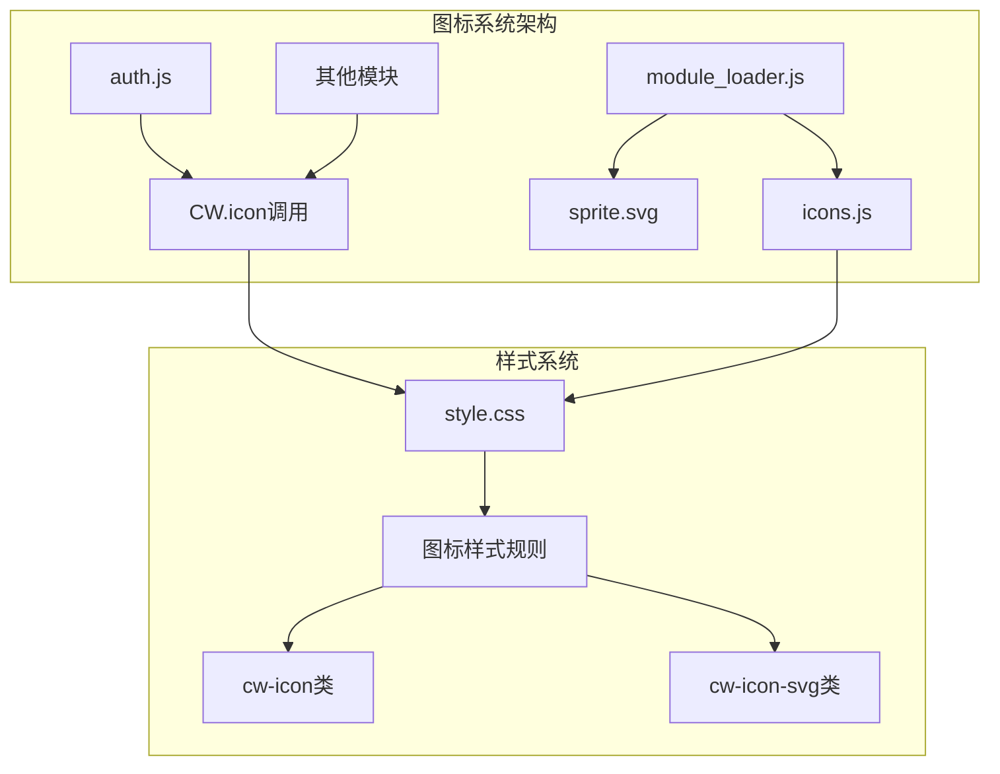
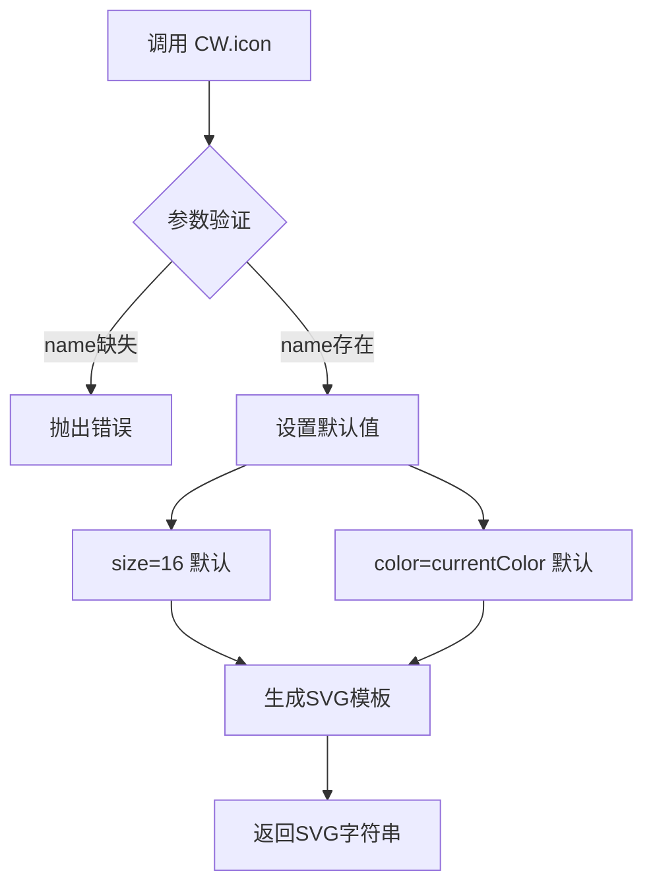
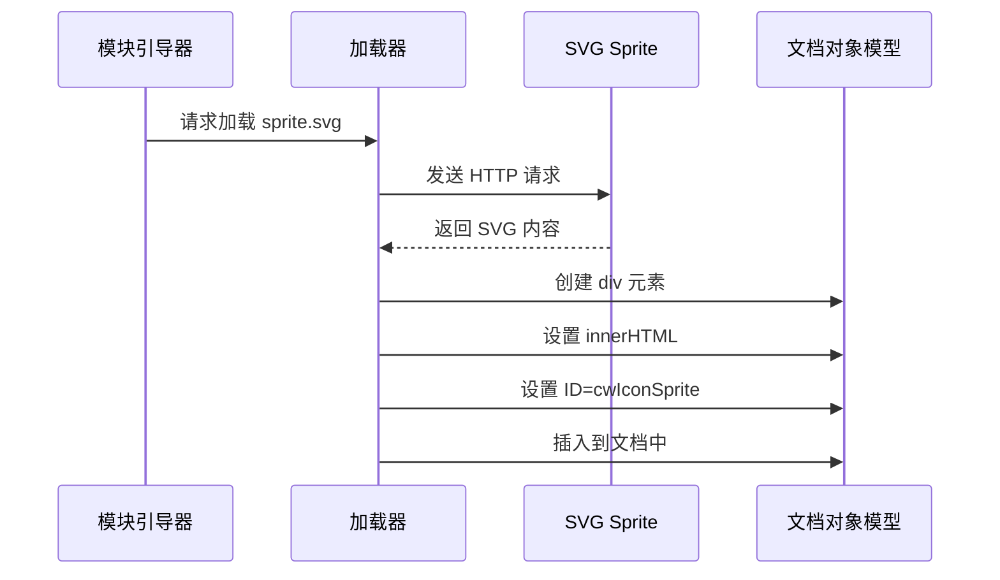
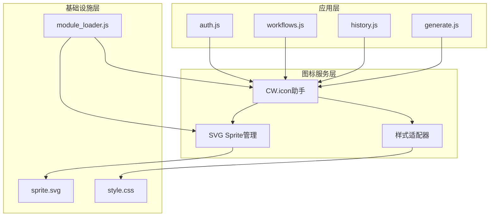
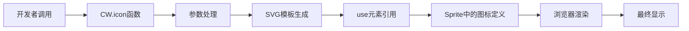
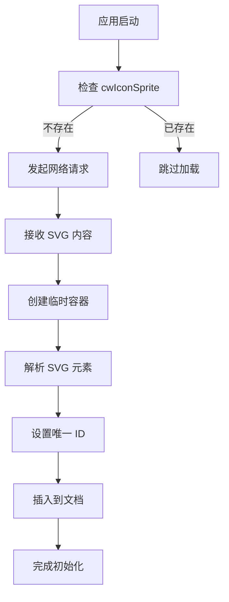
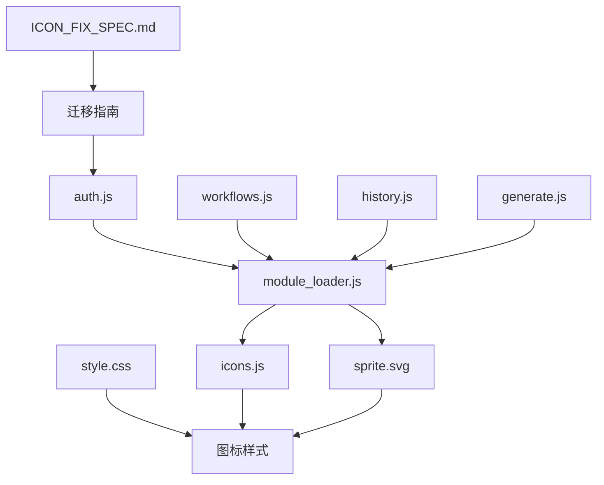
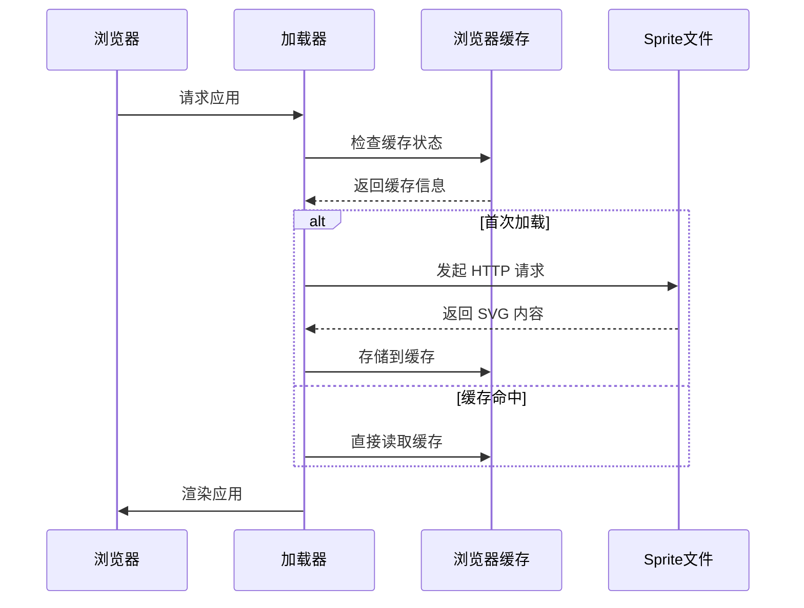

# 图标系统模块

<cite>
**本文档引用的文件**
- [icons.js](file://static/js/modules/icons.js)
- [module_loader.js](file://static/js/module_loader.js)
- [style.css](file://static/css/style.css)
- [ICON_FIX_SPEC.md](file://docs/archive/root-md-2026-06-03/ICON_FIX_SPEC.md)
- [auth.js](file://static/js/modules/auth.js)
</cite>

## 目录
1. [简介](#简介)
2. [项目结构](#项目结构)
3. [核心组件](#核心组件)
4. [架构概览](#架构概览)
5. [详细组件分析](#详细组件分析)
6. [依赖关系分析](#依赖关系分析)
7. [性能考虑](#性能考虑)
8. [故障排除指南](#故障排除指南)
9. [结论](#结论)
10. [附录](#附录)

## 简介

Ez ComfyUI Showcase 的图标系统是一个基于 SVG Sprite 的轻量级图标管理模块。该系统通过统一的图标助手函数提供可复用的 SVG 图标，支持动态尺寸调整、颜色主题适配和响应式显示。

图标系统的核心设计理念是：
- **SVG Sprite 技术**：将所有图标内联到单一 SVG 文件中，减少 HTTP 请求
- **模板字符串渲染**：通过 JavaScript 动态生成 SVG HTML
- **主题适配**：支持 CSS 变量和当前文本颜色继承
- **性能优化**：避免重复下载相同图标资源

## 项目结构

图标系统在项目中的组织结构如下：



**图表来源**
- [module_loader.js:79-123](file://static/js/module_loader.js#L79-L123)
- [icons.js:10-19](file://static/js/modules/icons.js#L10-L19)

**章节来源**
- [module_loader.js:1-151](file://static/js/module_loader.js#L1-L151)
- [icons.js:1-20](file://static/js/modules/icons.js#L1-L20)

## 核心组件

### 图标助手函数 (CW.icon)

图标系统的核心是 `CW.icon` 函数，它提供了简洁的图标调用接口：



**图表来源**
- [icons.js:11-15](file://static/js/modules/icons.js#L11-L15)

### SVG Sprite 加载器

模块加载器负责在应用启动时加载和内联 SVG Sprite：



**图表来源**
- [module_loader.js:79-93](file://static/js/module_loader.js#L79-L93)

**章节来源**
- [icons.js:10-19](file://static/js/modules/icons.js#L10-L19)
- [module_loader.js:79-123](file://static/js/module_loader.js#L79-L123)

## 架构概览

图标系统采用分层架构设计，确保高内聚低耦合：



**图表来源**
- [auth.js:393-399](file://static/js/modules/auth.js#L393-L399)
- [module_loader.js:14-25](file://static/js/module_loader.js#L14-L25)

### 数据流分析

图标数据在系统中的流转过程：



**图表来源**
- [icons.js:11-15](file://static/js/modules/icons.js#L11-L15)

**章节来源**
- [ICON_FIX_SPEC.md:1-55](file://docs/archive/root-md-2026-06-03/ICON_FIX_SPEC.md#L1-L55)

## 详细组件分析

### 图标助手函数实现

#### 函数签名与参数处理

图标助手函数支持三种调用方式：

| 调用方式 | 参数说明 | 默认行为 |
|---------|---------|---------|
| `CW.icon('play')` | 仅名称参数 | 尺寸: 16px<br/>颜色: currentColor |
| `CW.icon('trash-2', 20)` | 名称 + 尺寸 | 颜色: currentColor |
| `CW.icon('check', 14, 'var(--green)')` | 名称 + 尺寸 + 颜色 | 自定义颜色 |

#### SVG 模板结构

生成的 SVG 结构具有以下特点：
- 固定视口尺寸: 24x24
- 使用 `use` 元素引用 Sprite 中的具体图标
- 支持 CSS 类名 `cw-icon` 和 `cw-icon-svg`
- 符合 SVG 标准的 stroke 属性配置

### SVG Sprite 管理

#### 加载机制

Sprite 加载器采用异步加载策略：
1. **HTTP 请求**：从 `static/icons/sprite.svg` 获取 SVG 内容
2. **DOM 操作**：创建临时元素解析 SVG 内容
3. **元素替换**：将解析后的 SVG 替换到文档中
4. **缓存机制**：避免重复加载相同的 Sprite

#### 内联策略



**图表来源**
- [module_loader.js:79-93](file://static/js/module_loader.js#L79-L93)

### 样式系统集成

#### CSS 类定义

图标样式通过以下类名进行控制：

| 类名 | 作用域 | 特性 |
|------|--------|------|
| `.cw-icon` | 基础图标容器 | 垂直对齐、内联块级元素 |
| `.cw-icon-svg` | SVG 图标元素 | 垂直居中、弹性收缩 |
| `.gi-* .cw-icon` | 各功能区域图标 | 区域特定样式覆盖 |

#### 响应式适配

样式系统支持多种响应式场景：
- **网格布局**：图标在卡片中正确对齐
- **列表展示**：图标与文本垂直居中
- **工具栏**：紧凑空间内的图标显示
- **模态框**：大尺寸图标展示

**章节来源**
- [style.css:7151-7152](file://static/css/style.css#L7151-L7152)
- [style.css:321-325](file://static/css/style.css#L321-L325)

## 依赖关系分析

### 模块间依赖



**图表来源**
- [module_loader.js:14-25](file://static/js/module_loader.js#L14-L25)
- [auth.js:393-399](file://static/js/modules/auth.js#L393-L399)

### 外部依赖

图标系统对外部依赖的最小化设计：
- **无第三方库**：纯原生 JavaScript 实现
- **浏览器兼容**：基于标准 SVG API
- **CDN 依赖**：字体加载（可选）
- **本地资源**：完全本地化的图标资源

**章节来源**
- [module_loader.js:55-77](file://static/js/module_loader.js#L55-L77)

## 性能考虑

### 加载优化策略

#### 预加载机制



#### 内存管理

- **一次性加载**：Sprite 在应用启动时加载一次
- **字符串复用**：生成的 SVG 字符串在 DOM 中复用
- **事件委托**：通过事件冒泡处理图标交互
- **垃圾回收**：移除不再使用的图标元素

### 渲染性能

#### 批量渲染

图标系统支持批量渲染以提高性能：
- **模板字符串拼接**：减少 DOM 操作次数
- **Fragment 使用**：批量插入多个图标
- **虚拟 DOM 概念**：先生成 HTML 字符串再插入

#### 缓存策略

- **Sprite 缓存**：避免重复下载 SVG 文件
- **样式缓存**：CSS 规则只定义一次
- **函数缓存**：参数组合有限的图标调用

## 故障排除指南

### 常见问题诊断

#### 图标不显示

**症状**：图标显示为方框或空白

**可能原因**：
1. Sprite 文件加载失败
2. 图标名称拼写错误
3. CSS 样式被覆盖

**解决方案**：
1. 检查网络面板确认 sprite.svg 加载状态
2. 验证图标名称是否存在于 Sprite 中
3. 检查 CSS 优先级和样式冲突

#### 颜色异常

**症状**：图标颜色不符合预期

**可能原因**：
1. CSS 变量未定义
2. 主题切换后颜色未更新
3. 内联样式覆盖

**解决方案**：
1. 确认 CSS 变量 `--primary-color` 等已正确定义
2. 检查主题切换逻辑
3. 避免直接设置内联颜色属性

#### 尺寸问题

**症状**：图标过大或过小

**可能原因**：
1. 传入的尺寸参数无效
2. CSS 样式影响最终显示尺寸
3. 媒体查询导致的响应式变化

**解决方案**：
1. 确保传入有效的数字参数
2. 检查父容器的 `font-size` 设置
3. 验证媒体查询规则

### 调试技巧

#### 开发者工具检查

1. **Elements 面板**：查看生成的 SVG 元素结构
2. **Network 面板**：监控 sprite.svg 的加载状态
3. **Console 面板**：检查是否有 JavaScript 错误
4. **Styles 面板**：验证应用的样式规则

#### 日志输出

在开发环境中可以添加简单的日志来跟踪图标加载：

```javascript
console.log('图标加载:', name, '尺寸:', size, '颜色:', color);
```

**章节来源**
- [ICON_FIX_SPEC.md:49-54](file://docs/archive/root-md-2026-06-03/ICON_FIX_SPEC.md#L49-L54)

## 结论

Ez ComfyUI Showcase 的图标系统通过精心设计的架构实现了高效、可维护的图标管理方案。其主要优势包括：

### 技术优势

- **性能优异**：SVG Sprite 技术显著减少 HTTP 请求
- **维护简便**：统一的图标管理接口
- **样式灵活**：深度集成 CSS 系统
- **兼容性强**：基于标准 Web API

### 设计亮点

- **模块化设计**：清晰的职责分离
- **可扩展性**：易于添加新图标和功能
- **主题适配**：完整的 CSS 变量支持
- **响应式友好**：适应各种屏幕尺寸

### 改进建议

1. **类型安全**：添加 TypeScript 支持
2. **国际化**：支持多语言图标描述
3. **无障碍**：增强屏幕阅读器支持
4. **性能监控**：添加加载性能指标

## 附录

### 图标使用示例

#### 基本用法

```javascript
// 默认尺寸和颜色
const playIcon = CW.icon('play');

// 指定尺寸
const largeTrash = CW.icon('trash-2', 20);

// 自定义颜色
const coloredCheck = CW.icon('check', 16, 'var(--accent-color)');
```

#### 在模板中使用

```javascript
// HTML 模板中的使用
const template = `
  <button class="action-btn">
    ${CW.icon('settings-2')}
    <span>设置</span>
  </button>
`;
```

### 开发最佳实践

#### 图标命名规范

- 使用小写字母和短横线分隔
- 语义化命名，避免缩写
- 保持命名一致性
- 添加功能前缀区分用途

#### 性能优化建议

- 避免在同一页面中重复定义相同图标
- 合理使用图标尺寸，避免过度缩放
- 利用 CSS 变量统一管理颜色
- 考虑图标懒加载策略

#### 主题适配指南

```css
/* 深色主题 */
[data-theme="dark"] .cw-icon {
  stroke: var(--text-primary);
}

/* 浅色主题 */
[data-theme="light"] .cw-icon {
  stroke: var(--text-secondary);
}
```

**章节来源**
- [auth.js:393-399](file://static/js/modules/auth.js#L393-L399)
- [ICON_FIX_SPEC.md:11-28](file://docs/archive/root-md-2026-06-03/ICON_FIX_SPEC.md#L11-L28)