# 日志面板模块

<cite>
**本文档引用的文件**
- [log_panel.js](file://static/js/modules/log_panel.js)
- [style.css](file://static/css/style.css)
- [index.html](file://static/index.html)
- [poll_manager.js](file://static/js/modules/poll_manager.js)
- [test_log_panel_ui.py](file://tests/test_log_panel_ui.py)
</cite>

## 目录
1. [简介](#简介)
2. [项目结构](#项目结构)
3. [核心组件](#核心组件)
4. [架构概览](#架构概览)
5. [详细组件分析](#详细组件分析)
6. [依赖关系分析](#依赖关系分析)
7. [性能考虑](#性能考虑)
8. [故障排除指南](#故障排除指南)
9. [结论](#结论)
10. [附录](#附录)

## 简介

Ez ComfyUI Showcase 的日志面板模块是一个独立的日志管理系统，提供了实时日志监控、工作流分组显示、日志级别过滤、拖拽定位等功能。该模块采用纯 CSS 类切换的方式进行状态管理，避免了内联样式的使用，确保了代码的可维护性和可扩展性。

日志面板支持多种显示状态：浮动、停靠、移动端停靠和隐藏状态，能够根据不同的屏幕尺寸自动调整布局。模块还实现了智能的日志分组功能，将同一工作流的任务日志自动归类，便于用户追踪和分析。

## 项目结构

日志面板模块位于项目的静态资源目录中，与主应用逻辑分离，通过独立的 JavaScript 文件实现：

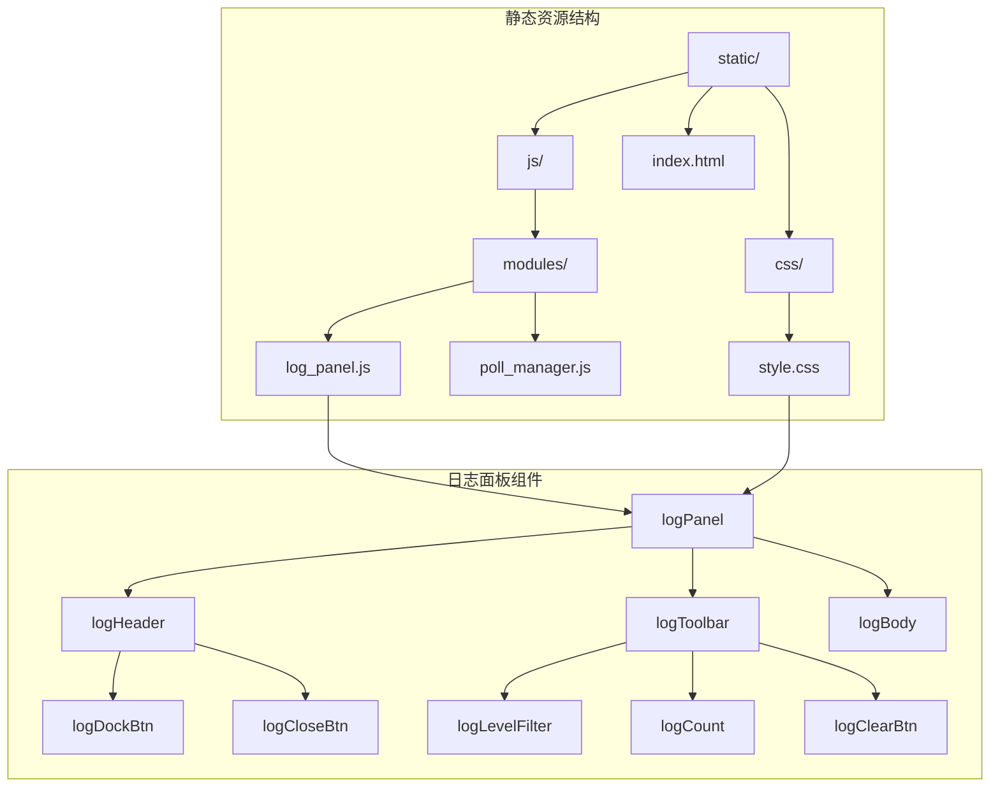

**图表来源**
- [log_panel.js:1-416](file://static/js/modules/log_panel.js#L1-L416)
- [style.css:7158-7352](file://static/css/style.css#L7158-L7352)
- [index.html:456-475](file://static/index.html#L456-L475)

**章节来源**
- [log_panel.js:1-416](file://static/js/modules/log_panel.js#L1-L416)
- [style.css:7158-7352](file://static/css/style.css#L7158-L7352)
- [index.html:456-475](file://static/index.html#L456-L475)

## 核心组件

### 日志面板状态管理

日志面板采用四种主要状态管理模式：

1. **隐藏状态 (hidden)** - 面板完全不可见，从 DOM 中移除或设置为 display: none
2. **浮动状态 (floating)** - 独立悬浮在页面上，可自由拖拽定位
3. **停靠状态 (docked)** - 固定在右侧边栏，占据整个高度
4. **移动端停靠状态 (mobile-docked)** - 在移动设备上优化的停靠模式

### 日志条目渲染机制

系统实现了高效的日志条目渲染机制，支持以下特性：

- **智能分组** - 自动将同一工作流的任务日志归类
- **百分比进度显示** - 从日志消息中提取采样进度信息
- **工作流类型着色** - 不同的工作流类型使用不同的颜色主题
- **增量更新** - 只更新变化的日志条目，提高渲染性能

### 实时日志接收

通过 WebSocket 实现日志的实时推送，支持断线重连和错误处理机制。

**章节来源**
- [log_panel.js:242-296](file://static/js/modules/log_panel.js#L242-L296)
- [log_panel.js:128-151](file://static/js/modules/log_panel.js#L128-L151)
- [log_panel.js:327-341](file://static/js/modules/log_panel.js#L327-L341)

## 架构概览

日志面板模块采用模块化设计，与主应用解耦合：

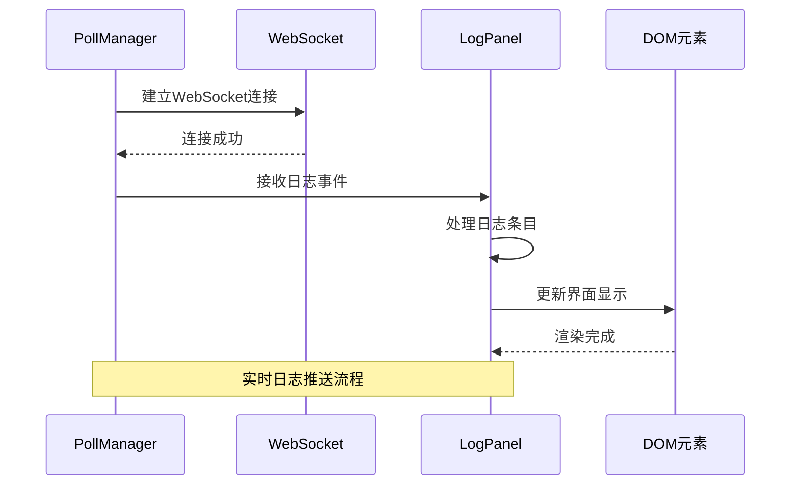

**图表来源**
- [poll_manager.js:187-194](file://static/js/modules/poll_manager.js#L187-L194)
- [log_panel.js:327-341](file://static/js/modules/log_panel.js#L327-L341)

### 数据流架构

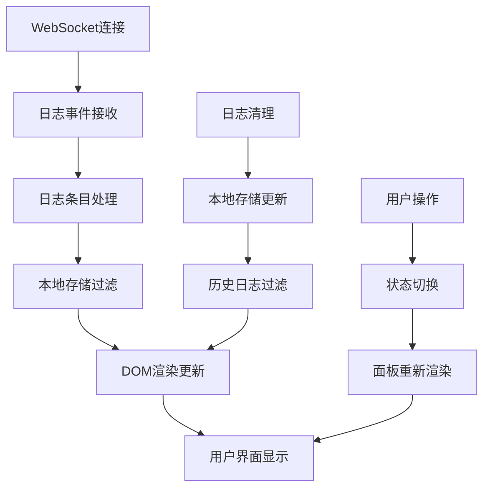

**图表来源**
- [poll_manager.js:166-209](file://static/js/modules/poll_manager.js#L166-L209)
- [log_panel.js:357-364](file://static/js/modules/log_panel.js#L357-L364)

## 详细组件分析

### 日志面板状态管理器

日志面板状态管理器负责控制面板的各种显示状态：

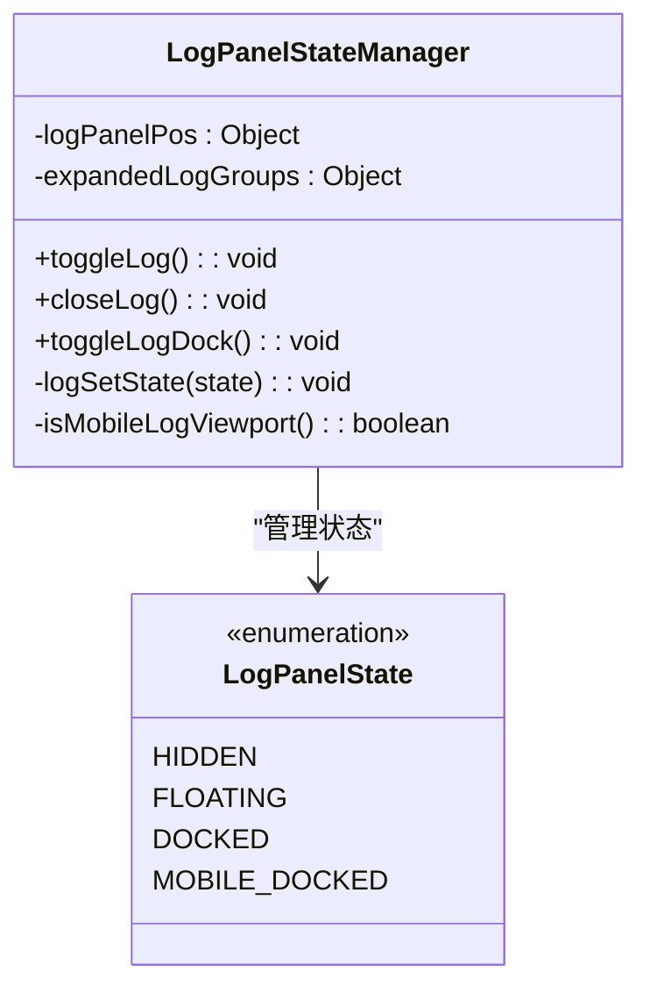

**图表来源**
- [log_panel.js:298-325](file://static/js/modules/log_panel.js#L298-L325)

#### 状态切换机制

状态切换通过 CSS 类的添加和移除实现，确保了平滑的过渡效果：

| 状态 | CSS 类 | 特性 |
|------|--------|------|
| 隐藏 | log-panel--hidden | display: none |
| 浮动 | log-panel--floating | position: fixed |
| 停靠 | log-panel--docked | position: static |
| 移动端停靠 | log-panel--mobile-docked | 移动端优化 |

**章节来源**
- [log_panel.js:242-296](file://static/js/modules/log_panel.js#L242-L296)
- [style.css:7167-7202](file://static/css/style.css#L7167-L7202)

### 日志条目渲染引擎

日志条目渲染引擎实现了复杂的数据处理和界面生成逻辑：

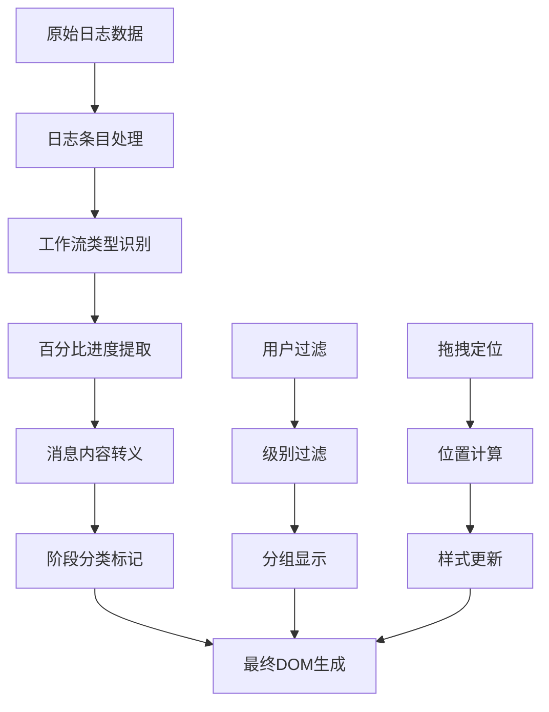

**图表来源**
- [log_panel.js:128-151](file://static/js/modules/log_panel.js#L128-L151)
- [log_panel.js:184-209](file://static/js/modules/log_panel.js#L184-L209)

#### 工作流分类规则

系统根据工作流类型自动分配颜色主题：

| 工作流类型 | 颜色主题 | CSS 类 |
|------------|----------|---------|
| 文生图 | 主题色 | log-flow-t2i |
| 图生图 | 紫色 | log-flow-i2i |
| 文生视频 | 橙色 | log-flow-t2v |
| 图生视频 | 绿色 | log-flow-i2v |
| 放大 | 蓝色 | log-flow-cat |
| 其他 | 动态色 | log-flow-0-7 |

**章节来源**
- [log_panel.js:79-91](file://static/js/modules/log_panel.js#L79-L91)
- [style.css:7263-7271](file://static/css/style.css#L7263-L7271)

### 日志分组显示系统

日志分组系统将相关的日志条目组织成逻辑分组，提供更好的可读性：

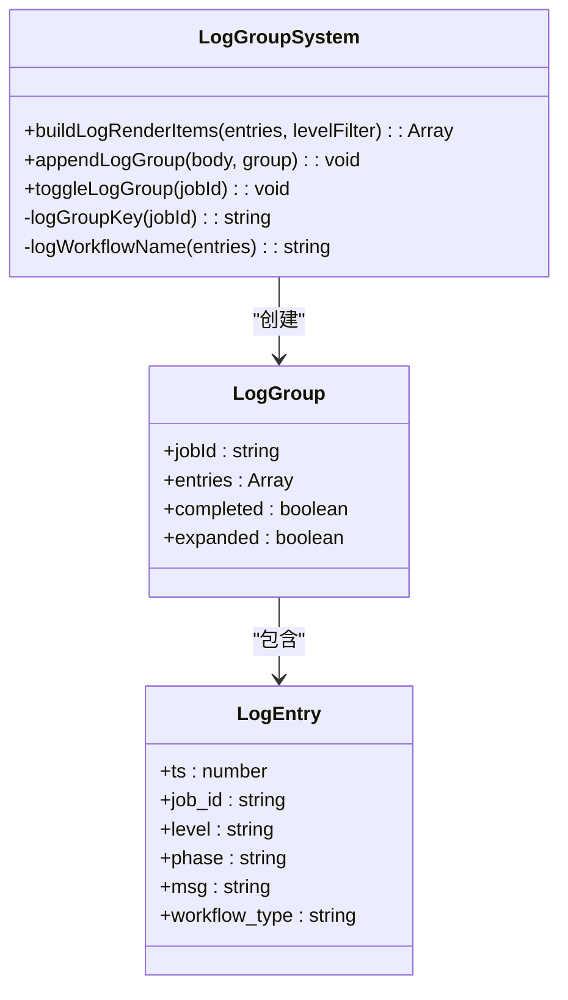

**图表来源**
- [log_panel.js:184-209](file://static/js/modules/log_panel.js#L184-L209)
- [log_panel.js:153-182](file://static/js/modules/log_panel.js#L153-L182)

#### 分组算法流程

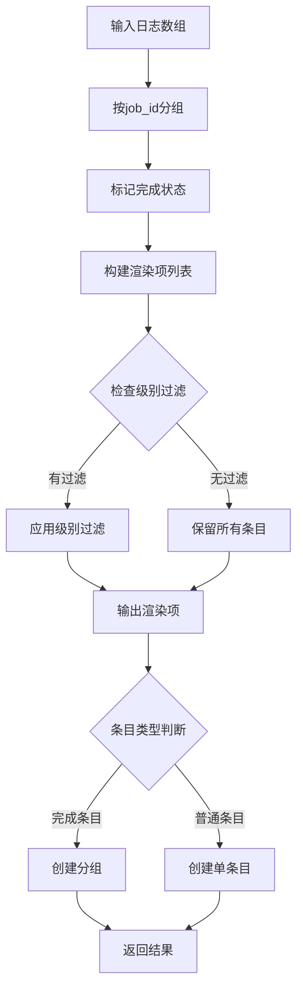

**图表来源**
- [log_panel.js:184-209](file://static/js/modules/log_panel.js#L184-L209)

**章节来源**
- [log_panel.js:184-209](file://static/js/modules/log_panel.js#L184-L209)
- [log_panel.js:153-182](file://static/js/modules/log_panel.js#L153-L182)

### 百分比进度显示机制

系统能够从日志消息中自动提取采样进度信息并显示百分比：

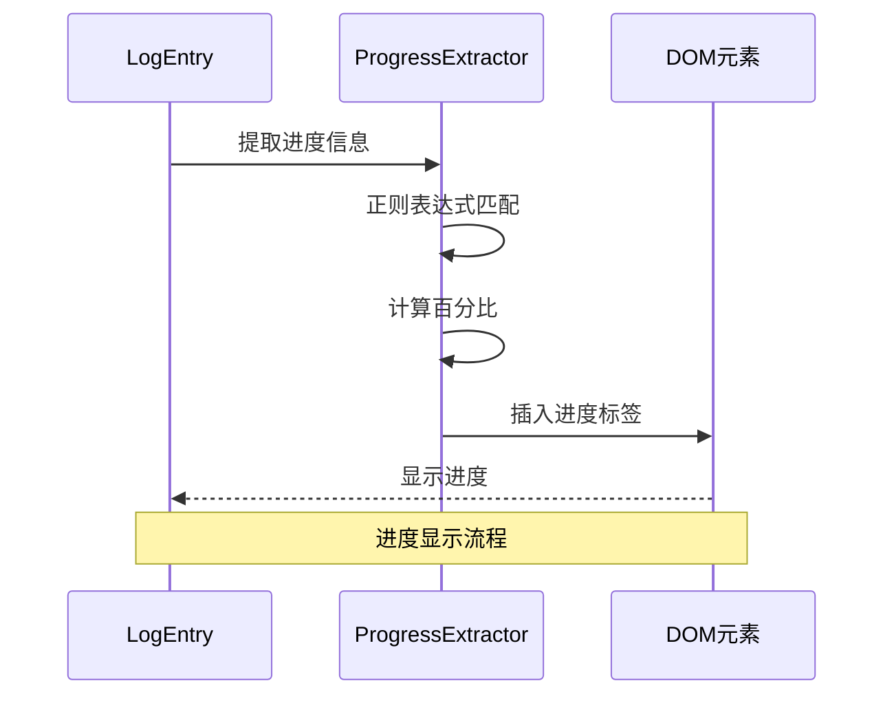

**图表来源**
- [log_panel.js:136-142](file://static/js/modules/log_panel.js#L136-L142)

#### 进度提取算法

系统支持多种进度格式的匹配：

| 匹配模式 | 示例 | 解释 |
|----------|------|------|
| 采样格式 | "采样 5/10" | 中文格式 |
| Sampling格式 | "Sampling 3/8" | 英文格式 |
| 百分比计算 | (当前/总数)*100 | 自动计算 |

**章节来源**
- [log_panel.js:136-142](file://static/js/modules/log_panel.js#L136-L142)

### 拖拽定位系统

拖拽定位系统允许用户自由调整浮动日志面板的位置：

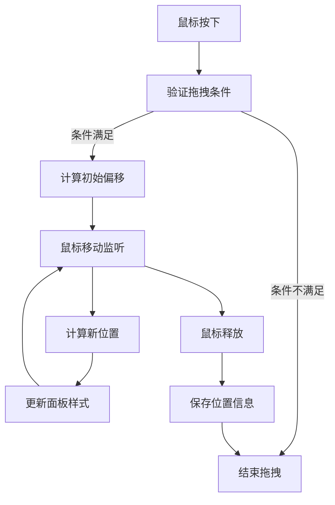

**图表来源**
- [log_panel.js:367-399](file://static/js/modules/log_panel.js#L367-L399)

#### 拖拽约束条件

拖拽系统实现了严格的约束条件以确保良好的用户体验：

| 条件 | 验证 | 作用 |
|------|------|------|
| 面板状态 | 必须是浮动状态 | 防止在其他状态下拖拽 |
| 父容器 | 必须在右侧栏外 | 避免影响停靠状态 |
| 用户交互 | 鼠标不在表单元素上 | 防止误触 |

**章节来源**
- [log_panel.js:367-399](file://static/js/modules/log_panel.js#L367-L399)

### 移动端适配系统

移动端适配系统针对不同屏幕尺寸提供了优化的显示方案：

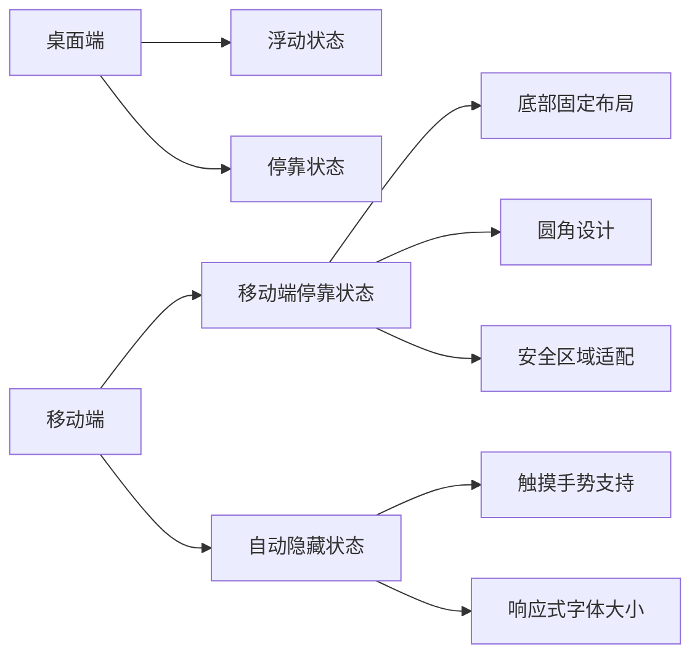

**图表来源**
- [log_panel.js:42-44](file://static/js/modules/log_panel.js#L42-L44)
- [style.css:7184-7202](file://static/css/style.css#L7184-L7202)

#### 响应式设计特性

| 断点 | 屏幕宽度 | 特性 |
|------|----------|------|
| 移动端 | ≤ 900px | 自动移动端停靠 |
| 小屏 | ≤ 600px | 浮动面板自适应 |
| 标准 | > 900px | 完整功能支持 |

**章节来源**
- [log_panel.js:42-44](file://static/js/modules/log_panel.js#L42-L44)
- [style.css:7203-7259](file://static/css/style.css#L7203-L7259)

## 依赖关系分析

日志面板模块与其他系统组件的依赖关系：

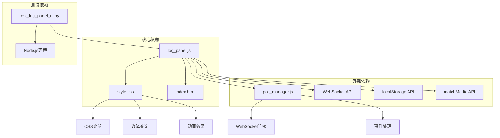

**图表来源**
- [log_panel.js:1-416](file://static/js/modules/log_panel.js#L1-L416)
- [poll_manager.js:166-209](file://static/js/modules/poll_manager.js#L166-L209)
- [test_log_panel_ui.py:1-137](file://tests/test_log_panel_ui.py#L1-L137)

### 外部接口依赖

日志面板模块依赖以下浏览器原生 API：

| API | 用途 | 依赖版本 |
|-----|------|----------|
| WebSocket | 实时日志传输 | HTML5 |
| localStorage | 本地存储 | HTML5 |
| matchMedia | 媒体查询 | HTML5 |
| requestAnimationFrame | 平滑滚动 | HTML5 |
| classList | CSS 类管理 | HTML5 |

**章节来源**
- [log_panel.js:14-32](file://static/js/modules/log_panel.js#L14-L32)
- [log_panel.js:42-44](file://static/js/modules/log_panel.js#L42-L44)
- [log_panel.js:395-399](file://static/js/modules/log_panel.js#L395-L399)

## 性能考虑

### 渲染优化策略

日志面板采用了多项性能优化措施：

1. **增量渲染** - 只更新发生变化的日志条目，避免全量重绘
2. **虚拟滚动** - 对大量日志采用分页加载策略
3. **防抖处理** - 对频繁的 DOM 操作进行节流
4. **内存管理** - 及时清理不再使用的 DOM 节点

### 内存使用优化

系统实现了智能的内存管理机制：

- **日志清理** - 支持按时间戳清理过期日志
- **DOM 复用** - 重用已存在的 DOM 节点
- **事件委托** - 减少事件监听器的数量

## 故障排除指南

### 常见问题及解决方案

#### WebSocket 连接失败

**症状**: 日志无法实时更新，面板显示连接错误

**解决方案**:
1. 检查网络连接是否正常
2. 验证服务器端 WebSocket 服务状态
3. 查看浏览器控制台的错误信息
4. 确认防火墙设置允许 WebSocket 连接

#### 日志显示异常

**症状**: 日志条目重复显示或丢失

**解决方案**:
1. 检查日志条目的唯一性标识
2. 验证时间戳的准确性
3. 确认过滤器设置是否正确
4. 清除浏览器缓存后重试

#### 移动端显示问题

**症状**: 移动设备上日志面板显示不正常

**解决方案**:
1. 检查 viewport 设置
2. 验证 CSS 媒体查询是否正确
3. 确认触摸事件处理
4. 测试不同分辨率下的显示效果

**章节来源**
- [poll_manager.js:175-209](file://static/js/modules/poll_manager.js#L175-L209)
- [log_panel.js:357-364](file://static/js/modules/log_panel.js#L357-L364)

### 调试工具和方法

#### 开发者工具使用

1. **Network 面板**: 监控 WebSocket 连接状态
2. **Console 面板**: 查看错误日志和调试信息
3. **Elements 面板**: 检查 DOM 结构和 CSS 类状态
4. **Application 面板**: 查看 localStorage 数据

#### 日志清理测试

系统提供了专门的测试用例验证日志清理功能：

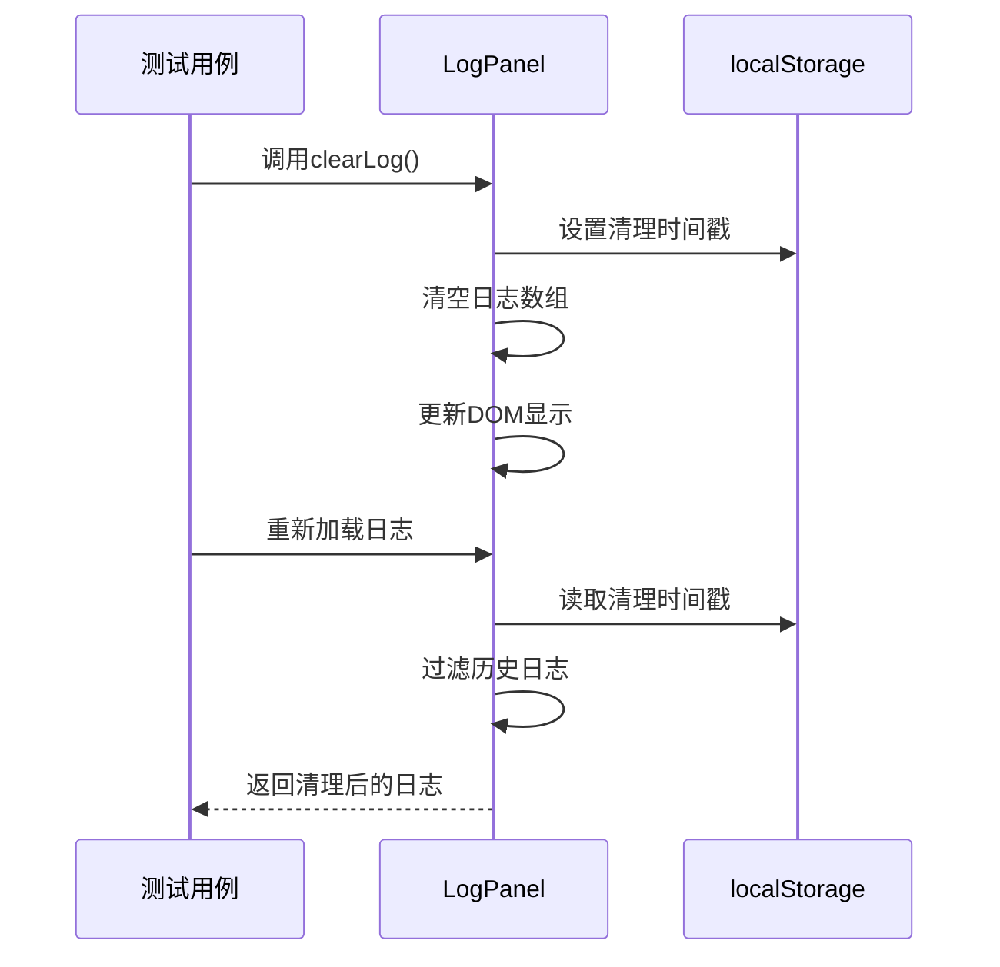

**图表来源**
- [test_log_panel_ui.py:8-134](file://tests/test_log_panel_ui.py#L8-L134)

**章节来源**
- [test_log_panel_ui.py:8-134](file://tests/test_log_panel_ui.py#L8-L134)

## 结论

Ez ComfyUI Showcase 的日志面板模块展现了优秀的前端工程实践，通过模块化设计、状态管理和性能优化实现了功能丰富且用户体验良好的日志管理系统。模块的主要优势包括：

1. **模块化设计** - 独立的 JavaScript 文件，易于维护和扩展
2. **状态管理** - 基于 CSS 类的状态切换，简洁高效
3. **实时通信** - WebSocket 实现实时日志推送
4. **响应式设计** - 完善的移动端适配
5. **性能优化** - 增量渲染和内存管理策略

该模块为用户提供了直观的日志监控界面，支持多种工作流类型的可视化展示，是 Ez ComfyUI Showcase 项目的重要组成部分。

## 附录

### 配置选项参考

| 选项 | 默认值 | 说明 |
|------|--------|------|
| 日志级别过滤 | 全部 | 支持 INFO/WARN/ERROR 三种级别 |
| 面板状态 | 隐藏 | 支持浮动/停靠/移动端停靠/隐藏四种状态 |
| 清理策略 | 按用户 | 基于用户 ID 的本地存储隔离 |
| 拖拽限制 | 仅浮动 | 仅在浮动状态下允许拖拽 |

### API 接口说明

| 方法 | 参数 | 返回值 | 说明 |
|------|------|--------|------|
| CW.toggleLog() | 无 | void | 切换日志面板显示状态 |
| CW.closeLog() | 无 | void | 关闭日志面板 |
| CW.toggleLogDock() | 无 | void | 切换停靠状态 |
| CW.toggleLogGroup(jobId) | jobId | void | 切换日志分组展开状态 |
| CW.applyLogFilter() | 无 | void | 应用日志级别过滤 |
| CW.clearLog() | 无 | void | 清理历史日志 |

### 集成指南

#### 基本集成步骤

1. **引入依赖文件**
   ```html
   <script src="static/js/modules/log_panel.js"></script>
   ```

2. **初始化日志面板**
   ```javascript
   // 确保 DOM 加载完成后初始化
   document.addEventListener('DOMContentLoaded', function() {
       // 日志面板会自动检测并初始化
   });
   ```

3. **配置 WebSocket 连接**
   ```javascript
   // 在 poll_manager.js 中配置
   var wsTarget = 'ws://localhost:8000/ws';
   ```

#### 自定义配置

1. **修改样式主题**
   ```css
   .log-entry.log-flow-custom {
       --log-flow: #your-color;
   }
   ```

2. **调整响应式断点**
   ```css
   @media (max-width: 900px) {
       .log-panel--mobile-docked {
           max-height: 50vh;
       }
   }
   ```

3. **扩展过滤功能**
   ```javascript
   // 在 log_panel.js 中添加新的过滤选项
   document.getElementById('logLevelFilter').innerHTML += 
       '<option value="debug">DEBUG</option>';
   ```