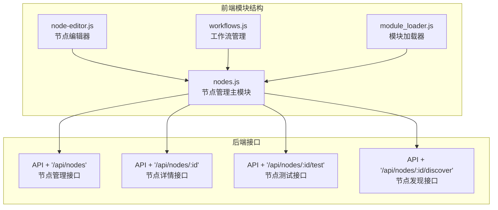
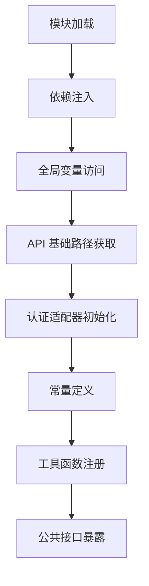
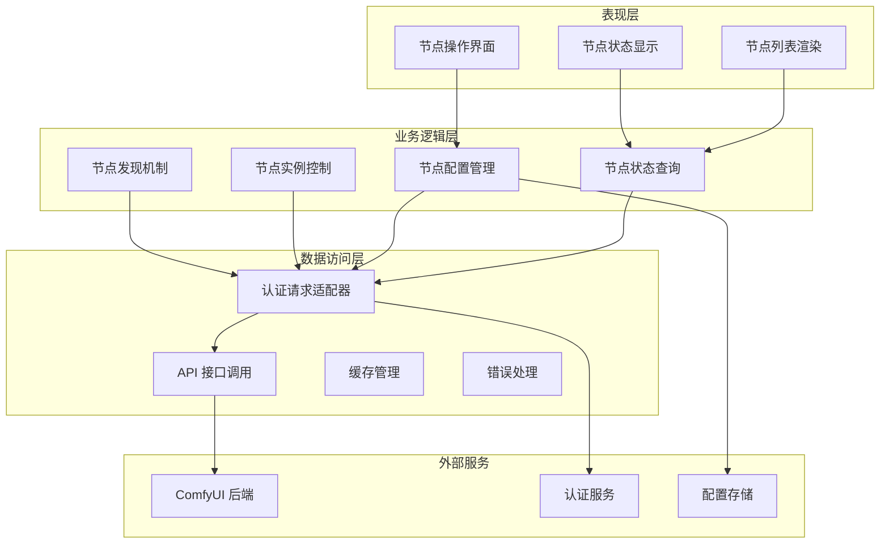
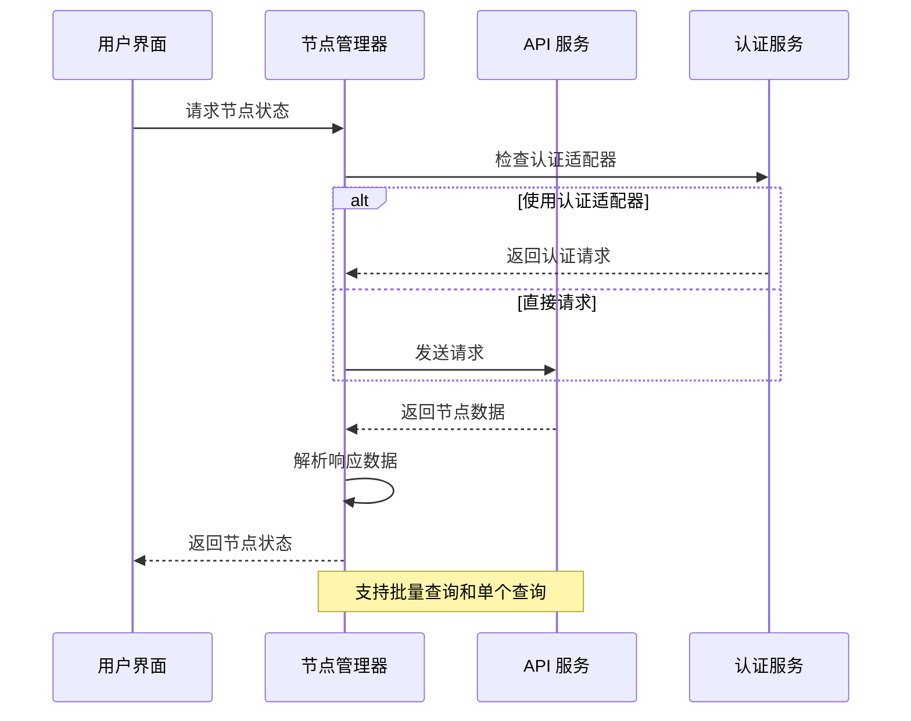
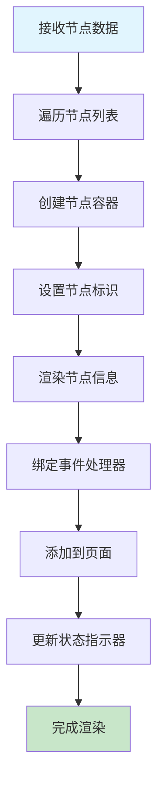
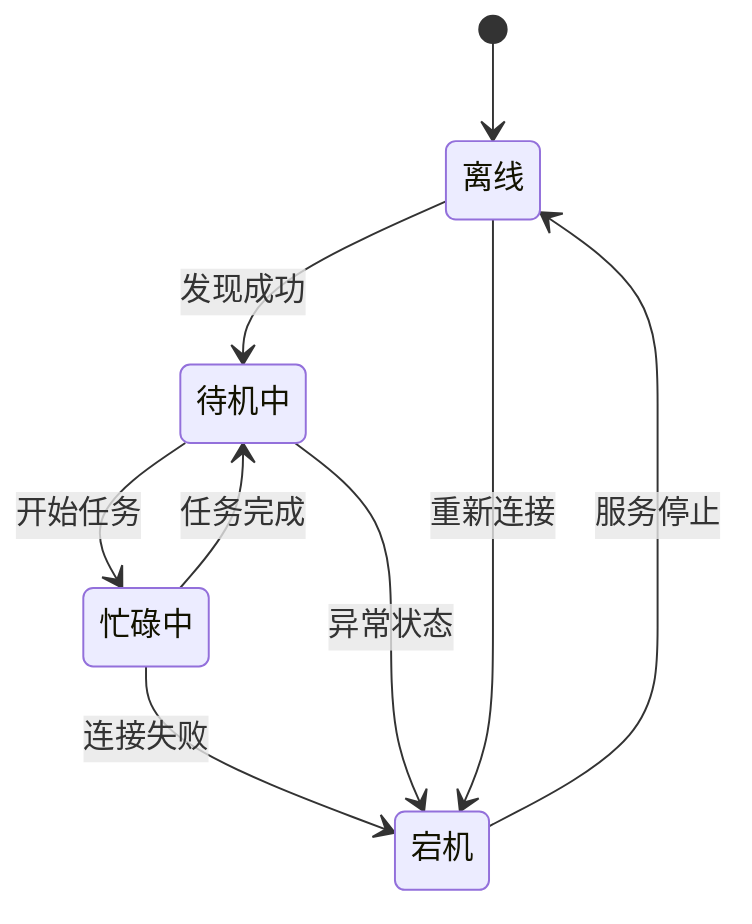
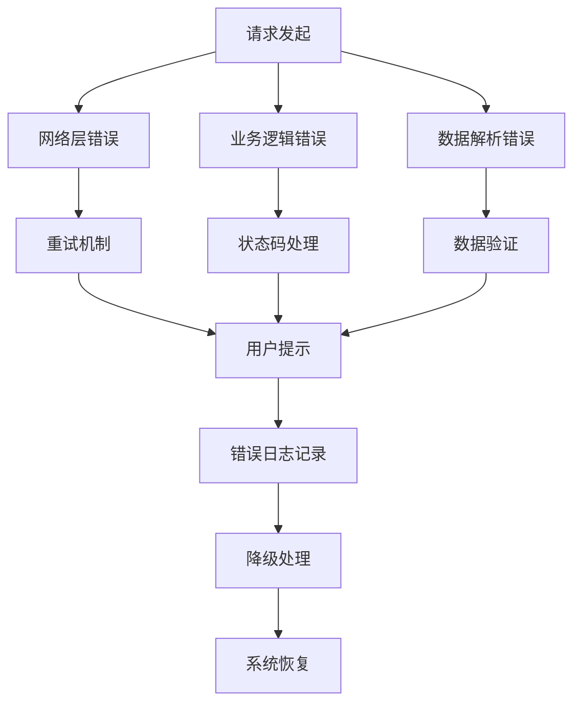
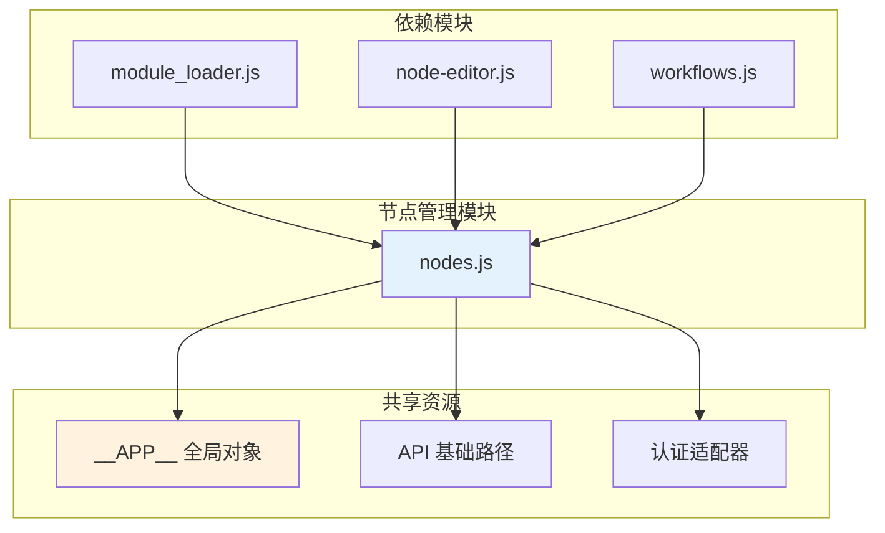
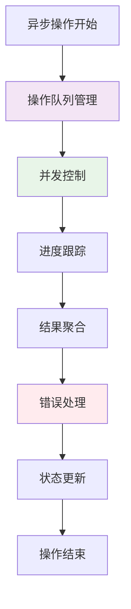

# 节点管理模块

<cite>
**本文档引用的文件**
- [nodes.js](file://static/js/modules/nodes.js)
- [module_loader.js](file://static/js/module_loader.js)
- [node-editor.js](file://static/js/modules/node-editor.js)
- [workflows.js](file://static/js/modules/workflows.js)
- [app.js](file://app.py)
</cite>

## 目录
1. [简介](#简介)
2. [项目结构](#项目结构)
3. [核心组件](#核心组件)
4. [架构概览](#架构概览)
5. [详细组件分析](#详细组件分析)
6. [依赖关系分析](#依赖关系分析)
7. [性能考虑](#性能考虑)
8. [故障排除指南](#故障排除指南)
9. [结论](#结论)
10. [附录](#附录)

## 简介

节点管理模块是 Ez ComfyUI Showcase 的核心功能组件，负责管理 ComfyUI 运行节点（本地、SSH、HTTP）的完整生命周期。该模块提供了节点列表获取、节点信息查询、节点参数配置、节点状态监控等核心功能，是整个系统与 ComfyUI 后端交互的重要桥梁。

该模块采用模块化设计，通过统一的 API 接口与后端服务通信，支持多种认证方式，并提供了完善的错误处理和状态管理机制。模块设计充分考虑了生产环境的需求，包括节点发现、实例管理、配置应用等功能。

## 项目结构

节点管理模块位于前端静态资源目录中，采用标准的模块化组织方式：

**图表来源**
- [nodes.js:1-50](file://static/js/modules/nodes.js#L1-L50)
- [module_loader.js:28](file://static/js/module_loader.js#L28)

**章节来源**
- [nodes.js:1-100](file://static/js/modules/nodes.js#L1-L100)
- [module_loader.js:28](file://static/js/module_loader.js#L28)

## 核心组件

### 模块初始化与依赖注入

节点管理模块通过立即执行函数模式创建独立的作用域，确保模块的封装性和安全性：

**图表来源**
- [nodes.js:4-21](file://static/js/modules/nodes.js#L4-L21)

模块的核心依赖包括：
- **全局应用对象**：通过 `window.__APP__` 访问应用上下文
- **DOM 操作库**：`$` 和 `$$` 选择器函数
- **转义函数**：`escH` 和 `escA` HTML 和属性转义
- **API 基础路径**：从应用配置中获取 API 根路径

### 状态管理与显示映射

模块实现了完整的节点状态管理系统，包括状态标签、颜色映射和队列值计算：

| 状态类型 | 中文标签 | 颜色类名 | 队列显示 |
|---------|---------|---------|---------|
| running | 忙碌中 | dot-orange | 实际队列数 |
| idle | 待机中 | dot-green | 实际队列数 |
| dead | 宕机 | dot-red | '-' |
| offline | 未启动 | dot-gray | '-' |

**章节来源**
- [nodes.js:17-21](file://static/js/modules/nodes.js#L17-L21)

## 架构概览

节点管理模块采用分层架构设计，各层职责清晰分离：

**图表来源**
- [nodes.js:10-15](file://static/js/modules/nodes.js#L10-L15)
- [nodes.js:23-31](file://static/js/modules/nodes.js#L23-L31)

## 详细组件分析

### 节点状态查询组件

节点状态查询是模块的核心功能之一，提供了高效的节点状态获取机制：

**图表来源**
- [nodes.js:23-31](file://static/js/modules/nodes.js#L23-L31)
- [nodes.js:10-15](file://static/js/modules/nodes.js#L10-L15)

#### 查询流程特点

1. **认证适配**：自动检测并使用合适的认证方式
2. **数据解析**：支持 JSON 响应格式和错误状态检查
3. **结果匹配**：通过节点 ID 精确匹配目标节点
4. **空值处理**：优雅处理未找到或错误的情况

**章节来源**
- [nodes.js:23-31](file://static/js/modules/nodes.js#L23-L31)

### 节点渲染组件

节点渲染组件负责将节点数据转换为用户友好的界面元素：

**图表来源**
- [nodes.js:77-120](file://static/js/modules/nodes.js#L77-L120)

#### 渲染组件功能特性

1. **模板生成**：动态创建节点显示元素
2. **事件绑定**：为每个节点绑定相应的交互事件
3. **状态更新**：实时反映节点的当前状态
4. **样式应用**：根据节点状态应用相应的视觉样式

**章节来源**
- [nodes.js:77-120](file://static/js/modules/nodes.js#L77-L120)

### 节点操作组件

节点操作组件提供了完整的节点生命周期管理功能：

**图表来源**
- [nodes.js:18-21](file://static/js/modules/nodes.js#L18-L21)

#### 操作类型分类

| 操作类型 | 接口路径 | 功能描述 |
|---------|---------|---------|
| 测试连接 | `/api/nodes/:id/test` | 验证节点连通性 |
| 删除节点 | `/api/nodes/:id` | 移除节点配置 |
| 发现节点 | `/api/nodes/:id/discover` | 自动发现节点信息 |
| 应用扫描 | `/api/nodes/:id/apply-scan` | 应用扫描结果 |
| 实例操作 | `/api/nodes/:id/instances/:iid/:action` | 管理节点实例 |

**章节来源**
- [nodes.js:303-466](file://static/js/modules/nodes.js#L303-L466)

### 错误处理组件

模块实现了多层次的错误处理机制，确保系统的稳定性和用户体验：

**图表来源**
- [nodes.js:10-15](file://static/js/modules/nodes.js#L10-L15)

#### 错误处理策略

1. **认证错误**：自动切换到基础认证方式
2. **网络异常**：提供重试和超时处理
3. **数据异常**：进行数据验证和清理
4. **状态异常**：维护一致的状态显示

**章节来源**
- [nodes.js:10-15](file://static/js/modules/nodes.js#L10-L15)

## 依赖关系分析

节点管理模块与其他前端模块存在紧密的依赖关系：

**图表来源**
- [module_loader.js:28](file://static/js/module_loader.js#L28)
- [node-editor.js:282-338](file://static/js/modules/node-editor.js#L282-L338)
- [workflows.js:696](file://static/js/modules/workflows.js#L696)

### 模块间交互模式

1. **数据共享**：通过全局对象共享节点状态数据
2. **事件驱动**：使用事件机制实现模块间通信
3. **接口调用**：统一的 API 接口访问后端服务
4. **状态同步**：保持多个模块间的状态一致性

**章节来源**
- [module_loader.js:28](file://static/js/module_loader.js#L28)
- [node-editor.js:282-338](file://static/js/modules/node-editor.js#L282-L338)
- [workflows.js:696](file://static/js/modules/workflows.js#L696)

## 性能考虑

节点管理模块在设计时充分考虑了性能优化需求：

### 缓存策略

模块实现了智能的缓存机制来提升性能：

1. **状态缓存**：缓存节点状态以减少重复查询
2. **配置缓存**：缓存节点配置信息避免频繁请求
3. **渲染缓存**：缓存已渲染的 DOM 元素
4. **认证缓存**：缓存认证令牌和会话信息

### 异步操作管理

**图表来源**
- [nodes.js:23-31](file://static/js/modules/nodes.js#L23-L31)

### 内存管理

1. **事件监听器清理**：及时移除不再使用的事件监听器
2. **DOM 元素回收**：合理管理动态创建的 DOM 元素
3. **定时器管理**：避免内存泄漏的定时器清理
4. **数据结构优化**：使用高效的数据结构存储节点信息

## 故障排除指南

### 常见问题诊断

| 问题类型 | 症状表现 | 可能原因 | 解决方案 |
|---------|---------|---------|---------|
| 节点离线 | 状态显示为离线 | 网络连接问题 | 检查网络连接和防火墙设置 |
| 认证失败 | 操作被拒绝 | 凭据过期或错误 | 更新认证信息并重新登录 |
| 数据加载缓慢 | 页面响应慢 | API 响应时间长 | 检查服务器性能和网络延迟 |
| 状态不同步 | 显示状态与实际不符 | 缓存问题 | 刷新页面或清除缓存 |

### 调试技巧

1. **开发者工具**：使用浏览器开发者工具监控网络请求
2. **日志分析**：查看控制台输出的错误信息
3. **状态检查**：验证节点状态数据的完整性
4. **接口测试**：直接调用 API 接口验证后端服务

**章节来源**
- [nodes.js:10-15](file://static/js/modules/nodes.js#L10-L15)

## 结论

节点管理模块作为 Ez ComfyUI Showcase 的核心组件，展现了优秀的架构设计和实现质量。模块通过清晰的分层结构、完善的错误处理机制和高效的性能优化策略，为用户提供了一个稳定可靠的节点管理解决方案。

模块的主要优势包括：
- **模块化设计**：良好的代码组织和职责分离
- **扩展性强**：支持多种认证方式和节点类型
- **用户体验**：直观的界面设计和实时状态反馈
- **稳定性**：完善的错误处理和状态管理

未来可以考虑的功能增强包括：
- 更详细的节点监控指标
- 批量操作功能
- 更丰富的节点配置选项
- 增强的日志和审计功能

## 附录

### API 接口规范

节点管理模块主要使用以下 API 接口：

| 接口名称 | 方法 | 路径 | 功能描述 |
|---------|------|------|---------|
| 获取节点列表 | GET | `/api/nodes` | 获取所有节点的列表信息 |
| 获取节点详情 | GET | `/api/nodes/:id` | 获取指定节点的详细信息 |
| 测试节点连接 | POST | `/api/nodes/:id/test` | 验证节点的连通性和可用性 |
| 删除节点 | DELETE | `/api/nodes/:id` | 移除指定的节点配置 |
| 发现节点 | POST | `/api/nodes/:id/discover` | 自动发现节点的详细信息 |
| 应用扫描结果 | POST | `/api/nodes/:id/apply-scan` | 应用扫描到的节点信息 |
| 实例操作 | POST | `/api/nodes/:id/instances/:iid/:action` | 对节点实例执行特定操作 |

### 配置选项

模块支持以下配置选项：

| 选项名称 | 类型 | 默认值 | 描述 |
|---------|------|--------|------|
| statusLabels | 对象 | 状态标签映射 | 节点状态的中文标签 |
| dotColors | 对象 | 状态颜色映射 | 不同状态对应的显示颜色 |
| queueVal | 函数 | 队列值计算 | 根据状态计算队列显示值 |
| authFetch | 函数 | 认证适配器 | 统一的请求认证处理 |

### 开发指南

#### 新增节点类型支持

要为新的节点类型添加支持，需要：

1. 在状态标签映射中添加新状态
2. 在颜色映射中添加对应的颜色类名
3. 更新队列值计算逻辑
4. 添加相应的 API 接口调用

#### 自定义认证方式

模块支持自定义认证方式的扩展：

1. 实现认证适配器接口
2. 在认证适配器中处理认证逻辑
3. 更新认证检测逻辑
4. 测试认证流程的正确性

#### 性能优化建议

1. 合理使用缓存机制
2. 优化 DOM 操作频率
3. 实现懒加载和虚拟滚动
4. 使用 Web Workers 处理重型计算
5. 实施请求去重和合并策略