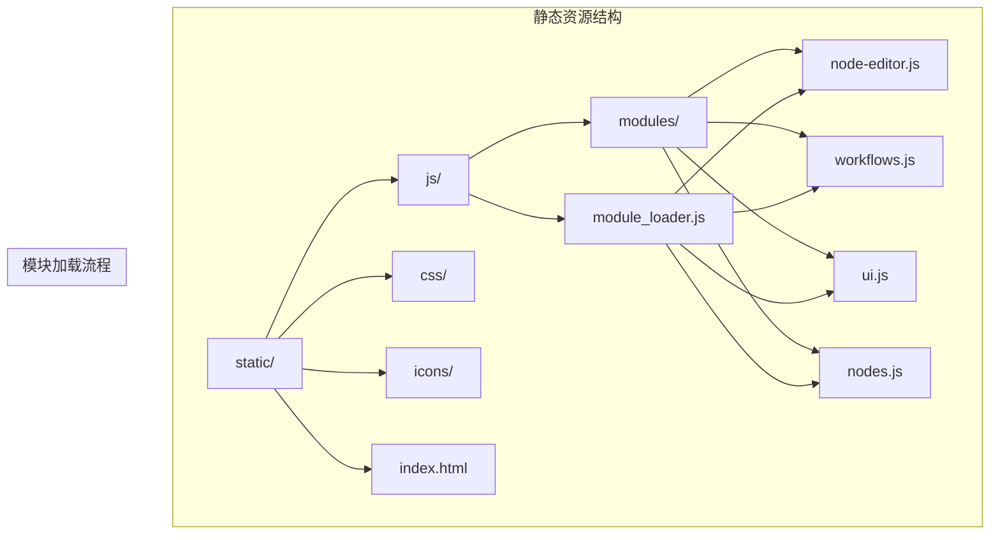
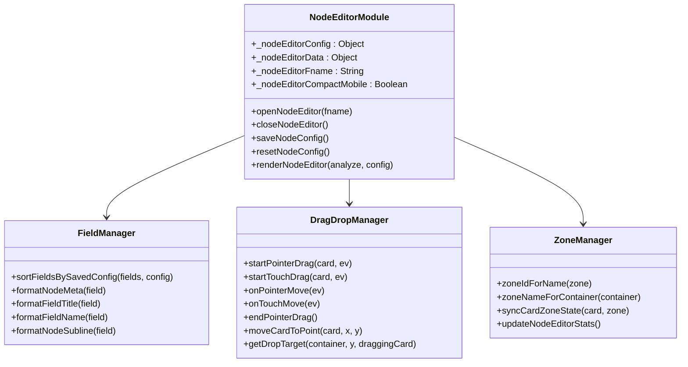
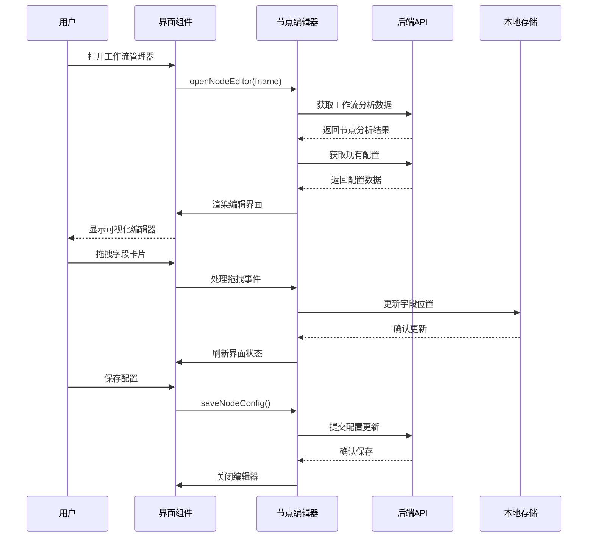
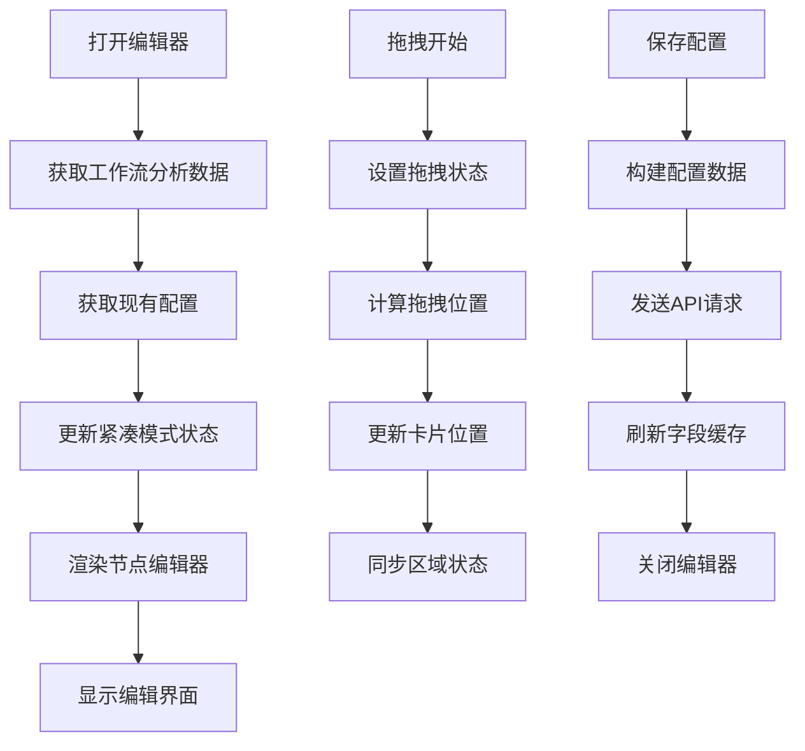
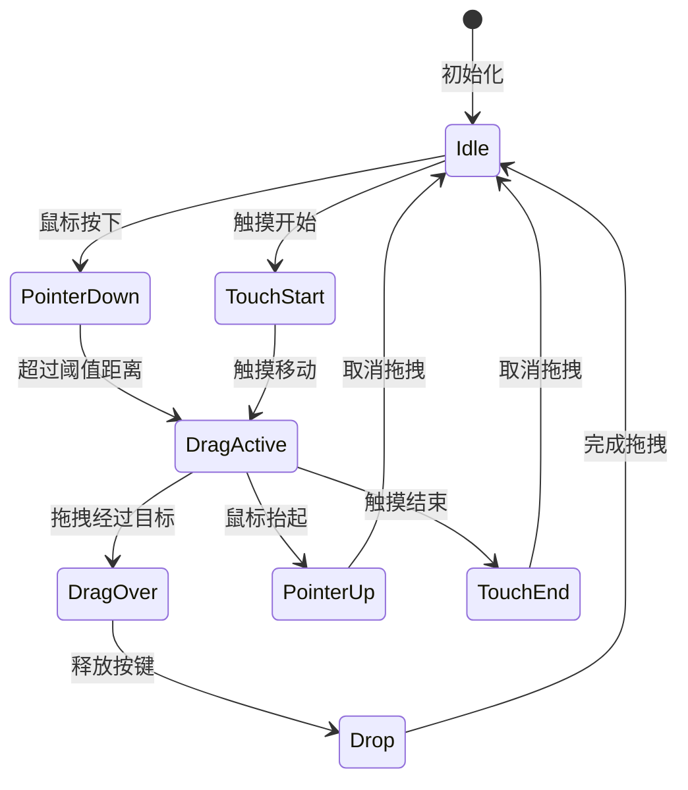
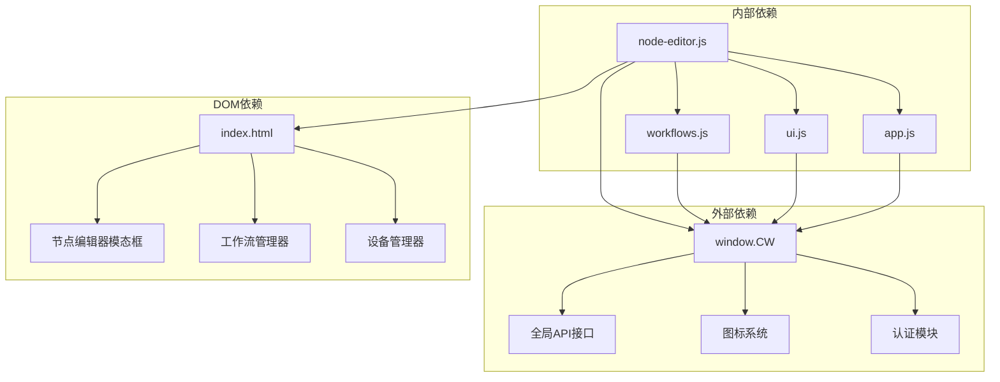

# 节点编辑器模块

<cite>
**本文档引用的文件**
- [node-editor.js](file://static/js/modules/node-editor.js)
- [workflows.js](file://static/js/modules/workflows.js)
- [index.html](file://static/index.html)
- [module_loader.js](file://static/js/module_loader.js)
- [app.js](file://static/js/app.js)
- [ui.js](file://static/js/modules/ui.js)
</cite>

## 目录
1. [简介](#简介)
2. [项目结构](#项目结构)
3. [核心组件](#核心组件)
4. [架构概览](#架构概览)
5. [详细组件分析](#详细组件分析)
6. [依赖关系分析](#依赖关系分析)
7. [性能考虑](#性能考虑)
8. [故障排除指南](#故障排除指南)
9. [结论](#结论)

## 简介

节点编辑器模块是 Ez ComfyUI Showcase 的核心功能组件之一，负责提供可视化的节点工作流编辑界面。该模块基于原生 JavaScript 实现，无需额外框架依赖，提供了完整的节点属性编辑、拖拽操作、连线绘制等高级功能。

该模块的主要目标是为用户提供直观的节点工作流编辑体验，支持节点的创建、连接、删除、移动等核心操作，同时提供强大的配置管理功能，允许用户自定义节点属性的显示和组织方式。

## 项目结构

节点编辑器模块位于静态资源目录中，采用模块化设计，与其他系统组件协同工作：



**图表来源**
- [module_loader.js:14-30](file://static/js/module_loader.js#L14-L30)
- [index.html:205-248](file://static/index.html#L205-L248)

**章节来源**
- [module_loader.js:1-151](file://static/js/module_loader.js#L1-L151)
- [index.html:1-659](file://static/index.html#L1-L659)

## 核心组件

节点编辑器模块由多个核心组件构成，每个组件都有特定的功能职责：

### 主要组件架构



**图表来源**
- [node-editor.js:17-573](file://static/js/modules/node-editor.js#L17-L573)

### 数据结构设计

节点编辑器使用标准化的数据结构来表示工作流节点和字段：

| 数据类型 | 结构定义 | 字段说明 |
|---------|----------|----------|
| 节点分析数据 | `{nodes: Array}` | 包含工作流中所有节点的分析结果 |
| 字段元数据 | `{key: String, node_id: String, field: String}` | 标识单个字段的唯一键值 |
| 配置对象 | `{version: Number, workflow: String, fields: Array}` | 存储用户自定义的字段配置 |
| 卡片元素 | `{dataset: Object, classList: Object}` | DOM 元素的卡片表示 |

**章节来源**
- [node-editor.js:332-528](file://static/js/modules/node-editor.js#L332-L528)

## 架构概览

节点编辑器模块采用事件驱动的架构模式，通过统一的事件系统协调各个子组件的工作：



**图表来源**
- [node-editor.js:534-557](file://static/js/modules/node-editor.js#L534-L557)
- [workflows.js:520-541](file://static/js/modules/workflows.js#L520-L541)

### 交互模式设计

节点编辑器支持多种交互模式以适应不同的使用场景：

| 交互模式 | 触发条件 | 功能特性 | 适用场景 |
|---------|----------|----------|----------|
| 桌面端拖拽 | 鼠标拖拽 | 支持拖拽到任意区域 | 桌面浏览器，精确控制 |
| 移动端触摸 | 触摸滑动 | 支持触摸手势操作 | 移动设备，便捷操作 |
| 键盘导航 | 键盘快捷键 | 支持键盘操作 | 辅助功能，无障碍访问 |
| 批量操作 | 组合键操作 | 支持多选和批量编辑 | 高效工作流管理 |

**章节来源**
- [node-editor.js:190-267](file://static/js/modules/node-editor.js#L190-L267)
- [node-editor.js:230-250](file://static/js/modules/node-editor.js#L230-L250)

## 详细组件分析

### 节点编辑器主控制器

节点编辑器的核心控制器负责管理整个编辑流程，包括数据获取、界面渲染、事件处理等：

#### 核心方法实现



**图表来源**
- [node-editor.js:534-557](file://static/js/modules/node-editor.js#L534-L557)
- [node-editor.js:278-331](file://static/js/modules/node-editor.js#L278-L331)

#### 配置管理系统

节点编辑器实现了灵活的配置管理机制，支持用户自定义字段的显示和组织：

| 配置类型 | 描述 | 默认行为 |
|---------|------|----------|
| 字段可见性 | 控制字段在界面中的显示状态 | 默认显示所有字段 |
| 字段分组 | 将相关字段归类到不同区域 | 支持用户输入、高级参数、输出、隐藏 |
| 字段顺序 | 定义字段在界面中的排列顺序 | 按配置的顺序显示 |
| 字段标签 | 自定义字段的显示名称 | 使用原始字段名称 |

**章节来源**
- [node-editor.js:278-331](file://static/js/modules/node-editor.js#L278-L331)
- [node-editor.js:93-122](file://static/js/modules/node-editor.js#L93-L122)

### 拖拽操作实现

拖拽系统是节点编辑器的核心交互功能，提供了流畅的用户体验：

#### 拖拽事件处理流程



**图表来源**
- [node-editor.js:190-267](file://static/js/modules/node-editor.js#L190-L267)
- [node-editor.js:230-250](file://static/js/modules/node-editor.js#L230-L250)

#### 区域管理机制

节点编辑器将字段按照用途分为四个主要区域：

| 区域名称 | 用途 | 特性 |
|---------|------|------|
| 用户输入 | 首屏关键参数 | 最重要的字段，优先显示 |
| 高级参数 | 进阶控制项 | 不常用的高级选项 |
| 输出 | 生成结果相关 | 与输出相关的字段 |
| 隐藏 | 保留但不展示 | 不希望用户看到的字段 |

**章节来源**
- [node-editor.js:52-64](file://static/js/modules/node-editor.js#L52-L64)
- [node-editor.js:160-172](file://static/js/modules/node-editor.js#L160-L172)

### 字段格式化系统

节点编辑器实现了智能的字段格式化功能，确保用户界面显示最佳的字段信息：

#### 字段标题格式化规则

| 字段类型 | 格式化规则 | 示例输出 |
|---------|-----------|----------|
| 节点标题 | 去除括号内容，保留主要名称 | "加载模型" |
| 字段标签 | 显示字段名称和节点标题 | "CFG [采样器]" |
| 字段键名 | 保留原始字段名称 | "cfg" |
| 节点副标题 | 用方括号显示节点标题 | "[采样器]" |

**章节来源**
- [node-editor.js:70-91](file://static/js/modules/node-editor.js#L70-L91)

### 界面响应式设计

节点编辑器支持响应式设计，能够适配不同屏幕尺寸的设备：

#### 移动端优化特性

| 特性 | 实现方式 | 用户体验 |
|------|----------|----------|
| 紧凑模式 | 基于媒体查询检测 | 减少空间占用 |
| 折叠展开 | 点击卡片展开详情 | 提供更多信息 |
| 触摸优化 | 放大触摸目标区域 | 改善触摸精度 |
| 简化布局 | 隐藏次要元素 | 突出核心功能 |

**章节来源**
- [node-editor.js:30-35](file://static/js/modules/node-editor.js#L30-L35)
- [node-editor.js:450-459](file://static/js/modules/node-editor.js#L450-L459)

## 依赖关系分析

节点编辑器模块与其他系统组件存在紧密的依赖关系：



**图表来源**
- [node-editor.js:7-10](file://static/js/modules/node-editor.js#L7-L10)
- [module_loader.js:26-30](file://static/js/module_loader.js#L26-L30)

### 模块间协作机制

节点编辑器通过统一的 `window.CW` 对象与系统其他模块进行协作：

| 模块 | 协作方式 | 功能集成 |
|------|----------|----------|
| workflows.js | 通过按钮触发 | 打开节点编辑器 |
| ui.js | 事件监听和状态管理 | 界面交互支持 |
| app.js | 全局状态共享 | 应用程序状态 |
| index.html | DOM结构提供 | 界面容器和模板 |

**章节来源**
- [workflows.js:520-541](file://static/js/modules/workflows.js#L520-L541)
- [index.html:520-541](file://static/js/modules/workflows.js#L520-L541)

## 性能考虑

节点编辑器在设计时充分考虑了性能优化，采用了多种策略来确保流畅的用户体验：

### 内存管理策略

- **事件委托**: 使用事件委托减少事件处理器数量
- **DOM复用**: 通过模板系统复用DOM元素
- **懒加载**: 按需加载工作流数据和配置
- **垃圾回收**: 及时清理不再使用的事件监听器

### 渲染优化技术

- **虚拟滚动**: 对大量字段进行虚拟化处理
- **防抖节流**: 优化拖拽和窗口调整事件
- **增量更新**: 只更新发生变化的部分
- **CSS动画**: 使用硬件加速的CSS过渡效果

### 网络请求优化

- **并行加载**: 同时获取分析数据和配置
- **缓存策略**: 缓存工作流元数据
- **错误处理**: 容错机制防止页面崩溃
- **超时控制**: 设置合理的请求超时时间

## 故障排除指南

### 常见问题及解决方案

#### 编辑器无法打开

**问题症状**: 点击"节点"按钮无响应

**可能原因**:
1. 工作流文件不存在
2. API服务未启动
3. 权限不足

**解决步骤**:
1. 检查工作流文件路径
2. 验证API服务状态
3. 确认用户权限

#### 拖拽功能失效

**问题症状**: 字段卡片无法拖拽

**可能原因**:
1. 触摸事件冲突
2. CSS样式影响
3. JavaScript错误

**解决步骤**:
1. 检查控制台错误信息
2. 验证CSS样式冲突
3. 测试基本拖拽功能

#### 配置保存失败

**问题症状**: 修改后无法保存配置

**可能原因**:
1. 网络连接问题
2. 服务器端验证失败
3. 权限不足

**解决步骤**:
1. 检查网络连接状态
2. 查看服务器响应
3. 确认用户权限

### 调试技巧

#### 开发者工具使用

- **控制台**: 监控JavaScript错误和警告
- **网络面板**: 检查API请求和响应
- **元素检查**: 验证DOM结构和样式
- **性能面板**: 分析渲染性能瓶颈

#### 日志记录

节点编辑器会在关键操作时输出调试信息，便于问题诊断：

```javascript
// 示例：拖拽开始日志
console.log('拖拽开始:', {card: card.dataset.key, position: {x, y}});

// 示例：配置保存日志
console.log('配置保存:', {workflow: _nodeEditorFname, fields: fields.length});
```

**章节来源**
- [node-editor.js:155-157](file://static/js/modules/node-editor.js#L155-L157)

## 结论

节点编辑器模块是 Ez ComfyUI Showcase 的重要组成部分，它提供了强大而直观的节点工作流编辑功能。通过精心设计的架构和优化的实现，该模块能够在各种设备和环境下提供优秀的用户体验。

### 主要优势

1. **跨平台兼容**: 支持桌面和移动端设备
2. **性能优化**: 采用多种优化技术确保流畅体验
3. **易用性强**: 直观的拖拽操作和清晰的界面设计
4. **扩展性好**: 模块化设计便于功能扩展和维护

### 技术特色

- 无框架依赖的轻量级实现
- 响应式设计适配多种设备
- 智能的字段管理和格式化
- 完善的错误处理和调试支持

该模块为 Ez ComfyUI Showcase 提供了坚实的基础，使得用户能够高效地创建和管理工作流节点，提升了整体的使用体验和生产效率。