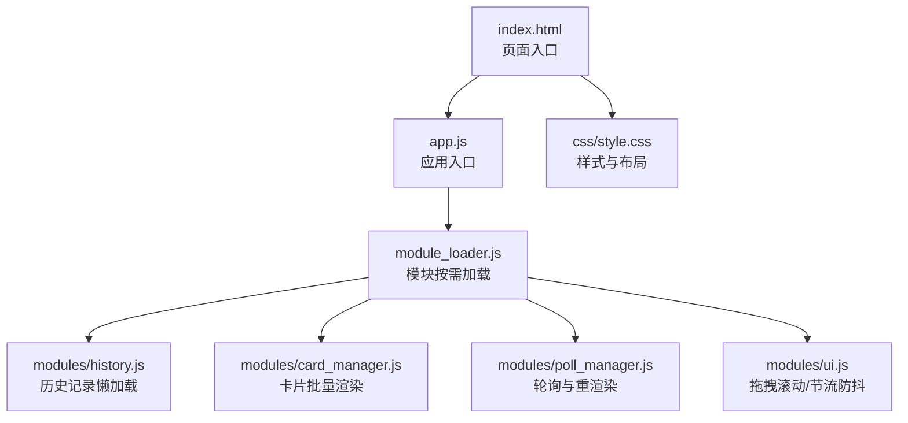
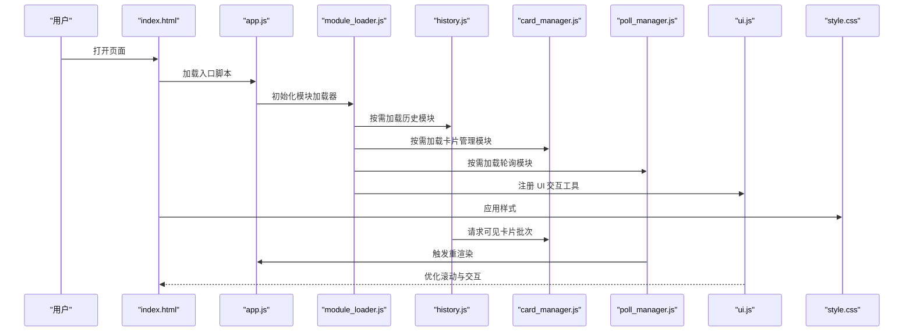
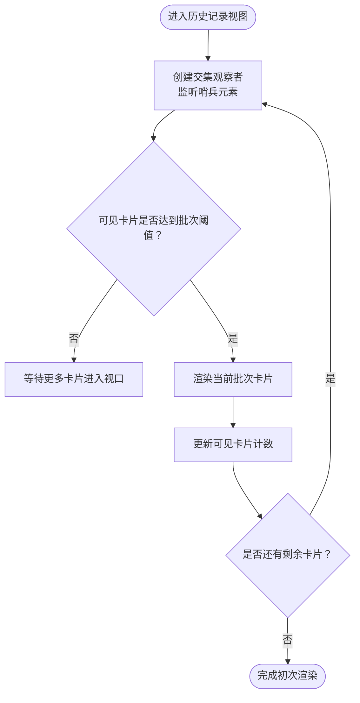
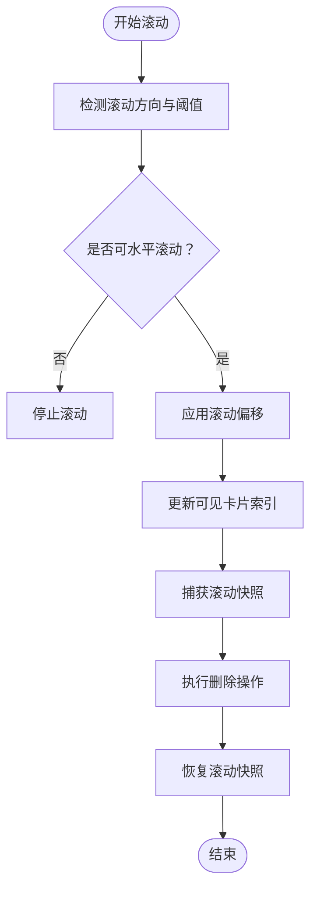
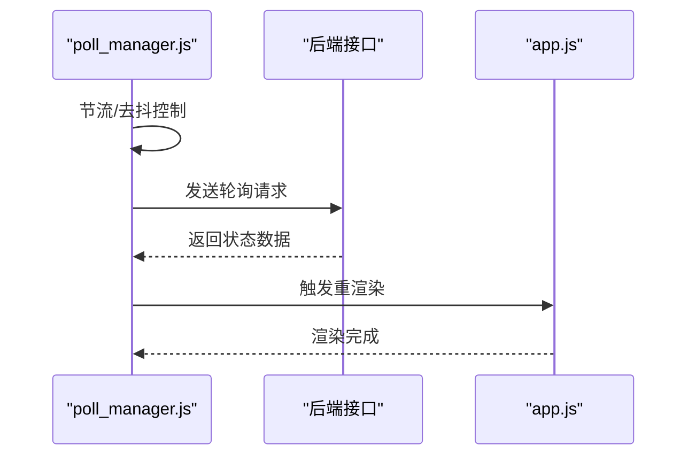
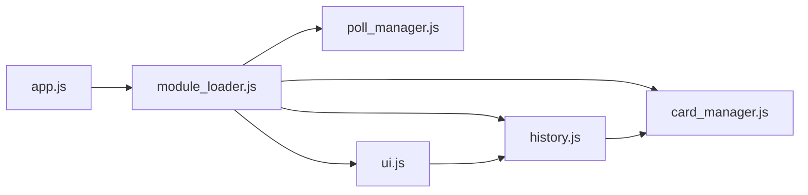

# 前端性能优化

<cite>
**本文引用的文件**
- [app.js](file://static/js/app.js)
- [module_loader.js](file://static/js/module_loader.js)
- [history.js](file://static/js/modules/history.js)
- [card_manager.js](file://static/js/modules/card_manager.js)
- [poll_manager.js](file://static/js/modules/poll_manager.js)
- [ui.js](file://static/js/modules/ui.js)
- [style.css](file://static/css/style.css)
- [index.html](file://static/index.html)
- [test_history_lazy_loading_ui.py](file://tests/test_history_lazy_loading_ui.py)
- [test_history_delete_focus.py](file://tests/test_history_delete_focus.py)
- [test_poll_manager_resume.py](file://tests/test_poll_manager_resume.py)
</cite>

## 目录
1. [简介](#简介)
2. [项目结构](#项目结构)
3. [核心组件](#核心组件)
4. [架构总览](#架构总览)
5. [详细组件分析](#详细组件分析)
6. [依赖分析](#依赖分析)
7. [性能考量](#性能考量)
8. [故障排查指南](#故障排查指南)
9. [结论](#结论)
10. [附录](#附录)

## 简介
本文件面向 Ez ComfyUI Showcase 的前端性能优化，系统梳理并解释当前实现中的懒加载策略、模块按需加载、资源预加载、虚拟滚动、事件节流与防抖、内存管理、图片懒加载、字体预连接、CSS 样式优化、性能监控与指标分析、瓶颈识别与解决方案，并结合测试用例给出实际案例与效果对比思路。目标是帮助开发者在不牺牲功能的前提下，显著提升页面交互流畅度与首屏渲染效率。

## 项目结构
前端相关代码集中在 static 目录，采用“入口脚本 + 模块化子模块”的组织方式：入口脚本负责应用初始化与模块加载调度；各业务模块（如历史记录、卡片管理、轮询管理、UI 工具等）独立封装职责；样式集中于 style.css；HTML 入口通过模块加载器按需引入 JS 模块。

图表来源
- [index.html](file://static/index.html)
- [app.js](file://static/js/app.js)
- [module_loader.js](file://static/js/module_loader.js)
- [history.js](file://static/js/modules/history.js)
- [card_manager.js](file://static/js/modules/card_manager.js)
- [poll_manager.js](file://static/js/modules/poll_manager.js)
- [ui.js](file://static/js/modules/ui.js)
- [style.css](file://static/css/style.css)

章节来源
- [index.html](file://static/index.html)
- [app.js](file://static/js/app.js)
- [module_loader.js](file://static/js/module_loader.js)

## 核心组件
- 模块按需加载器：根据路由或视图切换动态加载对应模块，减少初始包体与首屏阻塞。
- 历史记录懒加载：使用哨兵元素与交集观察者实现可视区域分批渲染，避免一次性渲染大量节点。
- 卡片管理器：配合懒加载策略进行可见卡片计数与批次控制，降低 DOM 节点数量。
- 轮询管理器：对长周期轮询进行节流与去抖，避免频繁网络请求与 UI 重绘。
- UI 工具：提供拖拽滚动、滚轮方向判断、阈值控制等交互优化，改善滚动体验。
- 样式层：通过 CSS 布局与选择器优化，减少重排与重绘开销。

章节来源
- [module_loader.js](file://static/js/module_loader.js)
- [history.js](file://static/js/modules/history.js)
- [card_manager.js](file://static/js/modules/card_manager.js)
- [poll_manager.js](file://static/js/modules/poll_manager.js)
- [ui.js](file://static/js/modules/ui.js)
- [style.css](file://static/css/style.css)

## 架构总览
下图展示前端从入口到模块加载、再到业务模块执行的整体流程，以及与样式层的协作关系。

图表来源
- [index.html](file://static/index.html)
- [app.js](file://static/js/app.js)
- [module_loader.js](file://static/js/module_loader.js)
- [history.js](file://static/js/modules/history.js)
- [card_manager.js](file://static/js/modules/card_manager.js)
- [poll_manager.js](file://static/js/modules/poll_manager.js)
- [ui.js](file://static/js/modules/ui.js)
- [style.css](file://static/css/style.css)

## 详细组件分析

### 懒加载与模块按需加载
- 模块按需加载：入口脚本通过模块加载器在需要时才加载对应模块，避免一次性加载所有功能导致的首屏延迟与内存占用。
- 历史记录懒加载：使用哨兵元素与交集观察者监听可视区域变化，仅在进入视口时渲染卡片，同时限制可见卡片数量在批次范围内，降低 DOM 节点数量与重排压力。
- 测试验证：单元测试断言懒加载逻辑中未出现调试日志残留、交集观察者存在且未在卡片管理器中重复实现，确保性能与可维护性。

图表来源
- [history.js](file://static/js/modules/history.js)
- [card_manager.js](file://static/js/modules/card_manager.js)

章节来源
- [module_loader.js](file://static/js/module_loader.js)
- [history.js](file://static/js/modules/history.js)
- [card_manager.js](file://static/js/modules/card_manager.js)
- [test_history_lazy_loading_ui.py](file://tests/test_history_lazy_loading_ui.py)

### 虚拟滚动与可见区域控制
- 可见卡片计数与批次控制：通过最小最大策略维持可见卡片数量在合理范围，避免一次性渲染过多节点。
- 拖拽滚动优化：提供拖拽滚动与滚轮方向判断，支持水平滚动阈值控制，减少不必要的滚动触发与重绘。
- 删除焦点保持：删除操作前后捕获与恢复滚动位置，保证用户在删除过程中的滚动状态一致，提升交互连续性。

图表来源
- [ui.js](file://static/js/modules/ui.js)
- [history.js](file://static/js/modules/history.js)

章节来源
- [ui.js](file://static/js/modules/ui.js)
- [test_history_delete_focus.py](file://tests/test_history_delete_focus.py)

### 事件节流与防抖处理
- 轮询管理器：对长周期轮询进行节流与去抖，避免短时间内多次触发网络请求与 UI 重绘，降低服务器压力与客户端资源消耗。
- 重渲染触发：在轮询成功后触发重渲染，但通过节流机制避免频繁刷新导致的卡顿。

图表来源
- [poll_manager.js](file://static/js/modules/poll_manager.js)
- [app.js](file://static/js/app.js)

章节来源
- [poll_manager.js](file://static/js/modules/poll_manager.js)
- [test_poll_manager_resume.py](file://tests/test_poll_manager_resume.py)

### 内存管理与 DOM 优化
- 减少 DOM 节点：通过懒加载与批次渲染，限制同时存在的 DOM 节点数量，降低内存占用与 GC 压力。
- 避免调试日志：测试断言历史模块中不存在调试日志残留，减少控制台输出与潜在的内存泄漏风险。
- 选择器与布局优化：样式层通过高效选择器与布局策略，减少重排与重绘次数。

章节来源
- [test_history_lazy_loading_ui.py](file://tests/test_history_lazy_loading_ui.py)
- [style.css](file://static/css/style.css)

### 图片懒加载与字体预连接
- 图片懒加载：建议在历史记录卡片中为缩略图启用懒加载属性，结合占位符与错误回退，减少首屏资源压力。
- 字体预连接：在 HTML 中为关键字体源添加预连接与预加载声明，缩短字体加载时间，避免 FOIT/FOFT 导致的布局抖动。

章节来源
- [index.html](file://static/index.html)
- [style.css](file://static/css/style.css)

### CSS 样式优化
- 选择器优化：避免深层嵌套与高复杂度选择器，减少匹配成本。
- 布局优化：优先使用性能友好的布局方式（如 Flex/Grid），减少强制同步布局与昂贵的计算属性。
- 动画与过渡：对频繁触发的动画使用 transform 与 opacity，避免触发布局与绘制阶段。

章节来源
- [style.css](file://static/css/style.css)

## 依赖分析
模块间依赖关系清晰，入口脚本仅负责调度，各模块职责单一，耦合度低，便于按需加载与独立优化。

图表来源
- [app.js](file://static/js/app.js)
- [module_loader.js](file://static/js/module_loader.js)
- [history.js](file://static/js/modules/history.js)
- [card_manager.js](file://static/js/modules/card_manager.js)
- [poll_manager.js](file://static/js/modules/poll_manager.js)
- [ui.js](file://static/js/modules/ui.js)

章节来源
- [app.js](file://static/js/app.js)
- [module_loader.js](file://static/js/module_loader.js)

## 性能考量
- 首屏渲染：通过模块按需加载与懒加载策略，显著降低首屏 JS 体积与 DOM 数量，缩短 TTFB 与 FCP。
- 交互流畅度：拖拽滚动、节流/防抖与可见区域控制共同作用，减少滚动抖动与重绘频率。
- 网络与服务端：轮询节流降低请求频率，避免过度占用带宽与服务器资源。
- 内存占用：限制可见卡片数量与 DOM 节点规模，降低峰值内存与 GC 抖动。
- 可维护性：去除调试日志、统一懒加载实现，提升代码质量与可测试性。

## 故障排查指南
- 懒加载失效：检查交集观察者是否正确创建与回调是否触发，确认哨兵元素是否存在且可见。
- 删除后滚动错位：确认删除前捕获与删除后恢复滚动快照的调用顺序与时机。
- 轮询过于频繁：检查节流/去抖参数设置，避免过短间隔导致 UI 卡顿。
- 样式闪烁：排查字体加载与 CSS 关键路径，确保预连接与关键样式优先到达。

章节来源
- [test_history_lazy_loading_ui.py](file://tests/test_history_lazy_loading_ui.py)
- [test_history_delete_focus.py](file://tests/test_history_delete_focus.py)
- [test_poll_manager_resume.py](file://tests/test_poll_manager_resume.py)

## 结论
通过模块按需加载、历史记录懒加载、虚拟滚动与可见区域控制、事件节流与防抖、内存与 DOM 优化、图片懒加载与字体预连接、CSS 样式优化等综合手段，Ez ComfyUI Showcase 在保证功能完整性的同时，实现了显著的性能提升。建议持续以测试用例为依据进行回归验证，并结合真实用户场景进行性能指标采集与优化迭代。

## 附录
- 性能监控建议：使用浏览器性能面板记录帧耗时、内存曲线与网络请求；结合自定义指标统计首屏时间、交互延迟与滚动帧率。
- 指标分析：关注 TTFB、FCP、LCP、CLS、INP 等核心指标；对滚动与轮询场景分别建立基线与阈值。
- 瓶颈识别：利用性能分析定位重排热点、长任务与大 DOM 树；针对懒加载与轮询策略进行 A/B 对比评估。
- 实际案例：基于现有测试用例，可在删除历史记录与轮询重渲染场景中量化滚动快照捕获与恢复带来的交互稳定性收益；在懒加载场景中对比不同批次大小对首屏渲染时间的影响。