# 前端架构文档

<cite>
**本文档引用的文件**
- [app.js](file://static/js/app.js)
- [module_loader.js](file://static/js/module_loader.js)
- [auth.js](file://static/js/modules/auth.js)
- [generate.js](file://static/js/modules/generate.js)
- [history.js](file://static/js/modules/history.js)
- [workflows.js](file://static/js/modules/workflows.js)
- [status.js](file://static/js/modules/status.js)
- [node-editor.js](file://static/js/modules/node-editor.js)
- [poll_manager.js](file://static/js/modules/poll_manager.js)
- [card_manager.js](file://static/js/modules/card_manager.js)
- [log_panel.js](file://static/js/modules/log_panel.js)
- [nodes.js](file://static/js/modules/nodes.js)
- [ui.js](file://static/js/modules/ui.js)
- [icons.js](file://static/js/modules/icons.js)
- [index.html](file://static/index.html)
- [style.css](file://static/css/style.css)
</cite>

## 目录
1. [简介](#简介)
2. [项目结构](#项目结构)
3. [核心组件](#核心组件)
4. [架构总览](#架构总览)
5. [详细组件分析](#详细组件分析)
6. [依赖关系分析](#依赖关系分析)
7. [性能考虑](#性能考虑)
8. [故障排除指南](#故障排除指南)
9. [结论](#结论)
10. [附录](#附录)

## 简介
本文件面向 Ez ComfyUI Showcase 的前端架构，围绕基于 ES6 模块的前端体系进行系统化技术说明。重点涵盖模块加载机制、依赖管理、组件化开发范式；深入解析模块化系统设计理念，包括模块加载器的工作原理、模块间通信机制与状态共享策略；逐项说明认证、生成界面、历史记录、工作流管理、状态监控、节点编辑等核心前端模块的功能与实现；阐述前端与后端的交互模式（API 调用、WebSocket 连接、实时数据同步）；总结前端状态管理策略（全局状态维护、组件状态隔离、数据缓存机制）；提供性能优化技术（懒加载、虚拟滚动、事件节流）与开发最佳实践及调试技巧。

## 项目结构
前端代码位于 static/js 目录下，采用 ES6 模块化组织方式，入口文件为 app.js，模块加载器为 module_loader.js。各功能模块按职责划分在 static/js/modules 子目录中，HTML 入口为 static/index.html，样式位于 static/css/style.css。

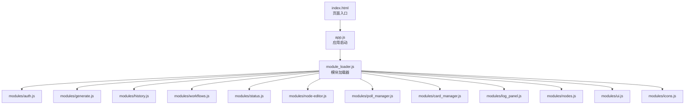

**图表来源**
- [index.html](file://static/index.html)
- [app.js](file://static/js/app.js)
- [module_loader.js](file://static/js/module_loader.js)
- [auth.js](file://static/js/modules/auth.js)
- [generate.js](file://static/js/modules/generate.js)
- [history.js](file://static/js/modules/history.js)
- [workflows.js](file://static/js/modules/workflows.js)
- [status.js](file://static/js/modules/status.js)
- [node-editor.js](file://static/js/modules/node-editor.js)
- [poll_manager.js](file://static/js/modules/poll_manager.js)
- [card_manager.js](file://static/js/modules/card_manager.js)
- [log_panel.js](file://static/js/modules/log_panel.js)
- [nodes.js](file://static/js/modules/nodes.js)
- [ui.js](file://static/js/modules/ui.js)
- [icons.js](file://static/js/modules/icons.js)

**章节来源**
- [index.html](file://static/index.html)
- [app.js](file://static/js/app.js)
- [module_loader.js](file://static/js/module_loader.js)

## 核心组件
- 应用入口与初始化：app.js 负责初始化应用、挂载根组件、注册事件监听与路由钩子，并协调模块加载器完成模块装配。
- 模块加载器：module_loader.js 提供模块注册、依赖解析、按需加载与实例化能力，支持模块间的弱耦合与延迟绑定。
- 认证模块：auth.js 处理用户登录、登出、令牌管理与权限控制，向其他模块暴露认证状态与安全上下文。
- 生成界面：generate.js 负责生成流程的 UI 控制、参数收集、提交与进度反馈。
- 历史记录：history.js 管理作业历史列表的渲染、分页、筛选与详情查看。
- 工作流管理：workflows.js 提供工作流配置的加载、保存、切换与元数据管理。
- 状态监控：status.js 实时展示系统状态、GPU/内存信息与运行指标。
- 节点编辑：node-editor.js 提供节点级编辑能力，支持节点连线、参数调整与可视化布局。
- 轮询管理：poll_manager.js 统一处理后台任务轮询、重试与取消逻辑。
- 卡片管理：card_manager.js 负责作业卡片的渲染、更新与交互行为。
- 日志面板：log_panel.js 展示实时日志与错误信息，支持过滤与滚动控制。
- 节点模型：nodes.js 定义节点数据结构与操作接口，为编辑器与渲染提供统一抽象。
- UI 组件库：ui.js 封装通用 UI 组件与交互行为，提升复用性与一致性。
- 图标资源：icons.js 提供图标映射与动态加载能力。

**章节来源**
- [app.js](file://static/js/app.js)
- [module_loader.js](file://static/js/module_loader.js)
- [auth.js](file://static/js/modules/auth.js)
- [generate.js](file://static/js/modules/generate.js)
- [history.js](file://static/js/modules/history.js)
- [workflows.js](file://static/js/modules/workflows.js)
- [status.js](file://static/js/modules/status.js)
- [node-editor.js](file://static/js/modules/node-editor.js)
- [poll_manager.js](file://static/js/modules/poll_manager.js)
- [card_manager.js](file://static/js/modules/card_manager.js)
- [log_panel.js](file://static/js/modules/log_panel.js)
- [nodes.js](file://static/js/modules/nodes.js)
- [ui.js](file://static/js/modules/ui.js)
- [icons.js](file://static/js/modules/icons.js)

## 架构总览
前端采用“模块化 + 组件化”的双层架构。模块层通过 ES6 模块与自定义加载器实现解耦与按需加载；组件层以功能模块为核心，围绕业务场景构建可复用的 UI 组件与服务层。模块间通过事件总线、回调函数与共享状态对象进行通信；全局状态由认证模块与轮询管理器集中维护，其他模块通过订阅/发布模式获取所需数据。

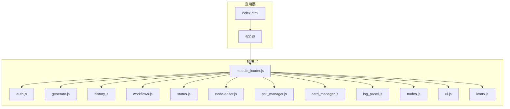

**图表来源**
- [app.js](file://static/js/app.js)
- [module_loader.js](file://static/js/module_loader.js)
- [auth.js](file://static/js/modules/auth.js)
- [generate.js](file://static/js/modules/generate.js)
- [history.js](file://static/js/modules/history.js)
- [workflows.js](file://static/js/modules/workflows.js)
- [status.js](file://static/js/modules/status.js)
- [node-editor.js](file://static/js/modules/node-editor.js)
- [poll_manager.js](file://static/js/modules/poll_manager.js)
- [card_manager.js](file://static/js/modules/card_manager.js)
- [log_panel.js](file://static/js/modules/log_panel.js)
- [nodes.js](file://static/js/modules/nodes.js)
- [ui.js](file://static/js/modules/ui.js)
- [icons.js](file://static/js/modules/icons.js)

## 详细组件分析

### 模块加载器（module_loader.js）
- 设计理念：提供模块注册表、依赖声明与按需加载能力，避免全局污染，支持模块间弱耦合与延迟初始化。
- 关键职责：
  - 模块注册与命名空间管理
  - 依赖解析与加载顺序控制
  - 实例化与生命周期钩子（如 init/onDestroy）
  - 错误捕获与模块卸载
- 与应用集成：app.js 在启动阶段调用加载器，传入模块清单与初始化参数，随后将已加载模块注入到应用上下文中。

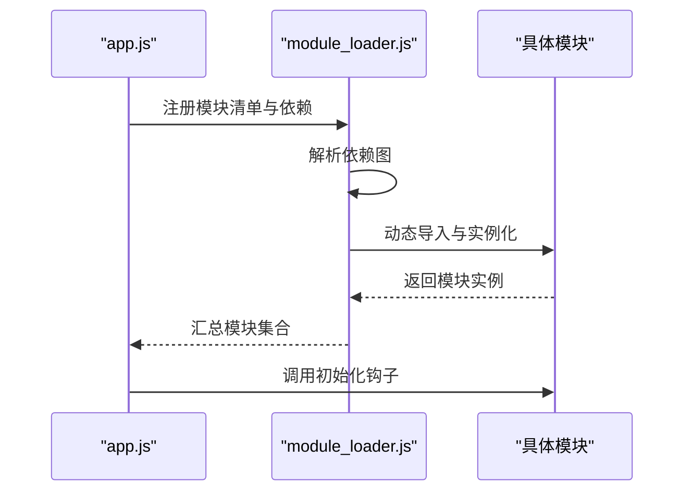

**图表来源**
- [app.js](file://static/js/app.js)
- [module_loader.js](file://static/js/module_loader.js)

**章节来源**
- [module_loader.js](file://static/js/module_loader.js)
- [app.js](file://static/js/app.js)

### 认证模块（auth.js）
- 功能概述：负责用户身份验证、会话管理、权限控制与安全上下文维护。
- 关键流程：
  - 登录/登出：触发后端认证接口，接收令牌并持久化存储
  - 权限校验：在模块间通信前检查令牌有效性
  - 上下文暴露：向其他模块提供认证状态与安全头
- 与其他模块的关系：被 generate、history、workflows 等模块依赖，用于保护敏感操作与数据访问。

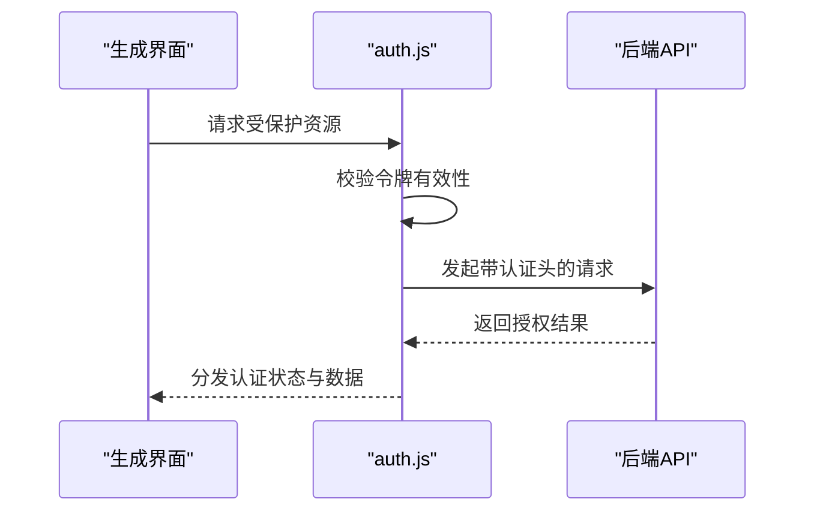

**图表来源**
- [auth.js](file://static/js/modules/auth.js)
- [generate.js](file://static/js/modules/generate.js)

**章节来源**
- [auth.js](file://static/js/modules/auth.js)
- [generate.js](file://static/js/modules/generate.js)

### 生成界面（generate.js）
- 功能概述：封装生成流程的 UI 控制、参数收集、提交与进度反馈。
- 关键流程：
  - 参数构建：从表单与工作流配置组装生成参数
  - 提交任务：调用后端接口提交生成任务
  - 进度跟踪：结合轮询管理器与状态模块获取实时进度
  - 结果展示：将生成结果渲染至历史记录或预览区域
- 与模块协作：依赖认证模块进行权限校验，依赖工作流模块获取配置，依赖状态模块显示运行指标。

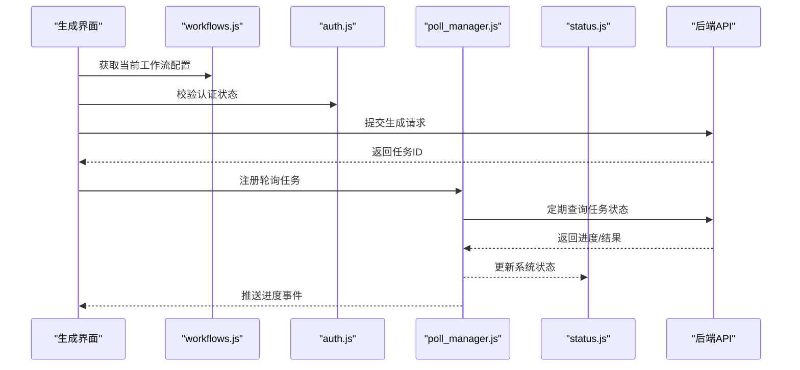

**图表来源**
- [generate.js](file://static/js/modules/generate.js)
- [workflows.js](file://static/js/modules/workflows.js)
- [auth.js](file://static/js/modules/auth.js)
- [poll_manager.js](file://static/js/modules/poll_manager.js)
- [status.js](file://static/js/modules/status.js)

**章节来源**
- [generate.js](file://static/js/modules/generate.js)
- [workflows.js](file://static/js/modules/workflows.js)
- [auth.js](file://static/js/modules/auth.js)
- [poll_manager.js](file://static/js/modules/poll_manager.js)
- [status.js](file://static/js/modules/status.js)

### 历史记录（history.js）
- 功能概述：管理作业历史列表的渲染、分页、筛选与详情查看。
- 关键流程：
  - 列表加载：分页拉取历史数据并渲染卡片
  - 筛选与搜索：根据关键词、时间范围、状态进行过滤
  - 详情查看：点击卡片打开详情面板，展示任务参数与输出
- 性能优化：采用懒加载与虚拟滚动减少 DOM 压力，事件节流降低频繁交互的开销。

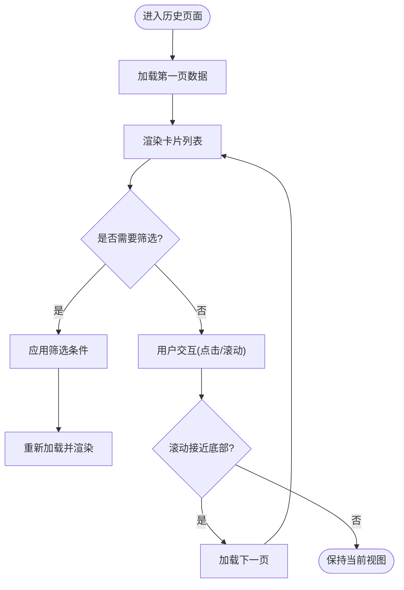

**图表来源**
- [history.js](file://static/js/modules/history.js)
- [card_manager.js](file://static/js/modules/card_manager.js)

**章节来源**
- [history.js](file://static/js/modules/history.js)
- [card_manager.js](file://static/js/modules/card_manager.js)

### 工作流管理（workflows.js）
- 功能概述：提供工作流配置的加载、保存、切换与元数据管理。
- 关键流程：
  - 配置加载：从本地或远端加载工作流 JSON 并解析
  - 切换与应用：在编辑器与生成界面之间切换当前工作流
  - 元数据管理：维护工作流名称、描述、标签与版本信息
- 数据结构：以标准化的 JSON Schema 描述节点连接与参数，便于跨模块共享。

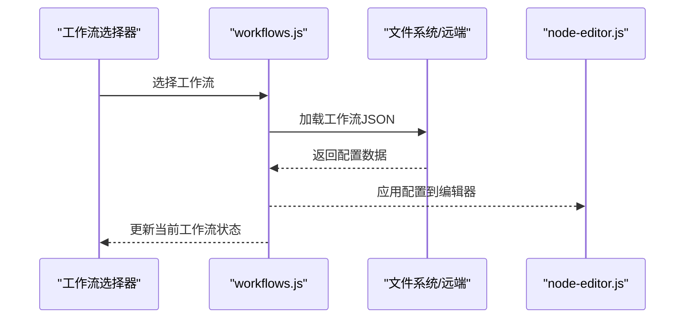

**图表来源**
- [workflows.js](file://static/js/modules/workflows.js)
- [node-editor.js](file://static/js/modules/node-editor.js)

**章节来源**
- [workflows.js](file://static/js/modules/workflows.js)
- [node-editor.js](file://static/js/modules/node-editor.js)

### 状态监控（status.js）
- 功能概述：实时展示系统状态、GPU/内存信息与运行指标。
- 关键流程：
  - 数据采集：通过轮询管理器定期拉取状态数据
  - 渲染更新：将指标渲染到状态栏或面板
  - 异常告警：检测异常状态并触发通知
- 与模块协作：为生成界面提供运行状态提示，为日志面板提供上下文信息。

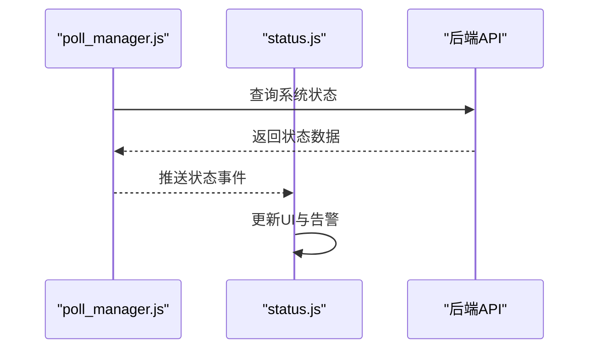

**图表来源**
- [status.js](file://static/js/modules/status.js)
- [poll_manager.js](file://static/js/modules/poll_manager.js)

**章节来源**
- [status.js](file://static/js/modules/status.js)
- [poll_manager.js](file://static/js/modules/poll_manager.js)

### 节点编辑（node-editor.js）
- 功能概述：提供节点级编辑能力，支持节点连线、参数调整与可视化布局。
- 关键流程：
  - 节点渲染：基于 nodes.js 的数据结构绘制节点与连线
  - 交互处理：响应拖拽、连线、删除、参数修改等事件
  - 配置同步：将编辑后的配置写回工作流模块
- 与模块协作：依赖 nodes.js 的数据模型，与 workflows.js 协同更新配置。

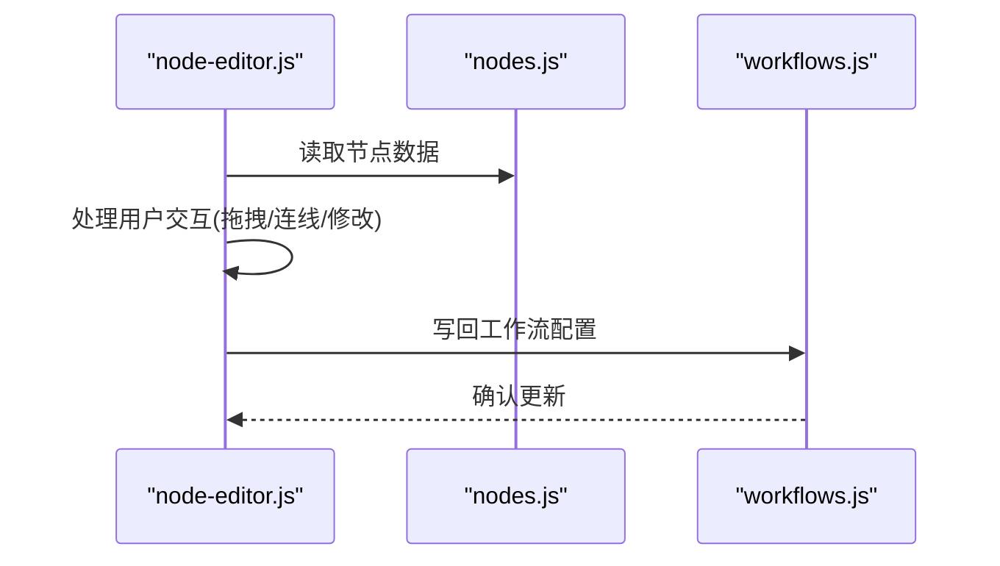

**图表来源**
- [node-editor.js](file://static/js/modules/node-editor.js)
- [nodes.js](file://static/js/modules/nodes.js)
- [workflows.js](file://static/js/modules/workflows.js)

**章节来源**
- [node-editor.js](file://static/js/modules/node-editor.js)
- [nodes.js](file://static/js/modules/nodes.js)
- [workflows.js](file://static/js/modules/workflows.js)

### 轮询管理（poll_manager.js）
- 功能概述：统一处理后台任务轮询、重试与取消逻辑。
- 关键流程：
  - 任务注册：接收任务ID与回调函数
  - 轮询调度：定时发起请求并处理响应
  - 重试与取消：根据状态自动重试或终止轮询
- 与模块协作：为生成界面与状态模块提供统一的轮询能力。

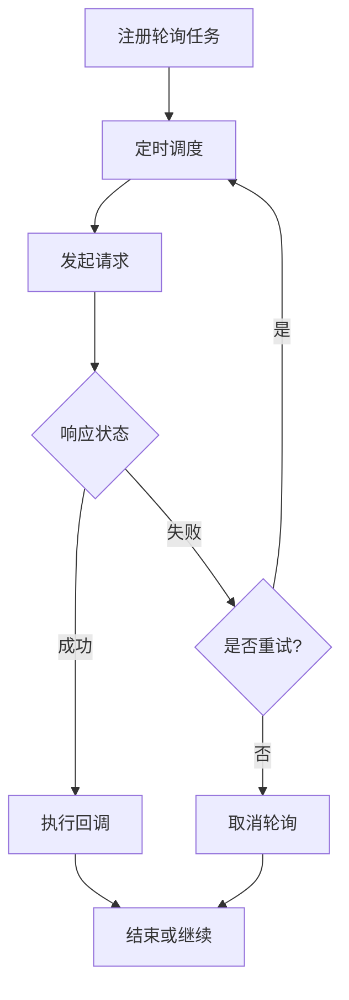

**图表来源**
- [poll_manager.js](file://static/js/modules/poll_manager.js)

**章节来源**
- [poll_manager.js](file://static/js/modules/poll_manager.js)

### 卡片管理（card_manager.js）
- 功能概述：负责作业卡片的渲染、更新与交互行为。
- 关键流程：
  - 渲染模板：根据数据结构生成卡片 DOM
  - 事件绑定：为卡片绑定点击、删除、查看详情等事件
  - 动态更新：根据状态变化刷新卡片内容

**章节来源**
- [card_manager.js](file://static/js/modules/card_manager.js)

### 日志面板（log_panel.js）
- 功能概述：展示实时日志与错误信息，支持过滤与滚动控制。
- 关键流程：
  - 日志接收：订阅来自各模块的日志事件
  - 过滤与排序：按级别、关键词进行过滤与排序
  - 自动滚动：新日志到达时自动滚动到底部

**章节来源**
- [log_panel.js](file://static/js/modules/log_panel.js)

### 节点模型（nodes.js）
- 功能概述：定义节点数据结构与操作接口，为编辑器与渲染提供统一抽象。
- 关键流程：
  - 数据建模：标准化节点属性、输入输出与连接关系
  - 操作接口：提供增删改查与序列化/反序列化能力

**章节来源**
- [nodes.js](file://static/js/modules/nodes.js)

### UI 组件库（ui.js）
- 功能概述：封装通用 UI 组件与交互行为，提升复用性与一致性。
- 关键流程：
  - 组件注册：将常用控件注册为可复用模块
  - 行为封装：统一事件处理、样式与动画

**章节来源**
- [ui.js](file://static/js/modules/ui.js)

### 图标资源（icons.js）
- 功能概述：提供图标映射与动态加载能力。
- 关键流程：
  - 图标注册：维护图标名称与路径映射
  - 动态加载：按需加载图标资源并渲染

**章节来源**
- [icons.js](file://static/js/modules/icons.js)

## 依赖关系分析
- 模块内聚与耦合：模块加载器作为中心枢纽，其他模块仅通过其暴露的接口进行交互，降低直接依赖带来的耦合风险。
- 外部依赖：依赖浏览器原生 API（fetch、WebSocket、localStorage）、第三方库（如图表库、编辑器库）与后端提供的 REST/WS 接口。
- 循环依赖规避：通过模块加载器的依赖解析与延迟初始化避免循环引用问题。

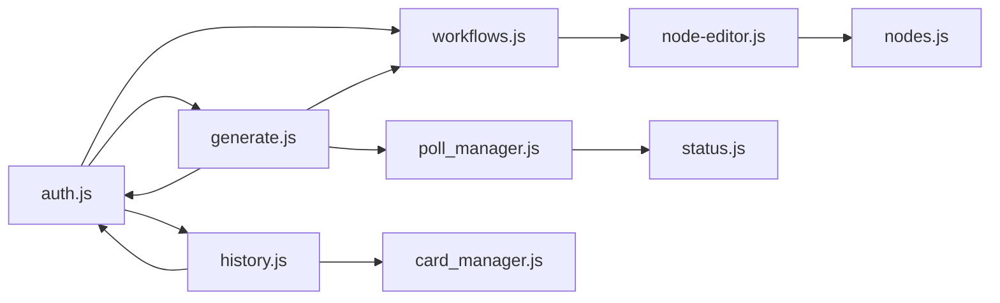

**图表来源**
- [auth.js](file://static/js/modules/auth.js)
- [generate.js](file://static/js/modules/generate.js)
- [history.js](file://static/js/modules/history.js)
- [workflows.js](file://static/js/modules/workflows.js)
- [node-editor.js](file://static/js/modules/node-editor.js)
- [poll_manager.js](file://static/js/modules/poll_manager.js)
- [status.js](file://static/js/modules/status.js)
- [card_manager.js](file://static/js/modules/card_manager.js)
- [nodes.js](file://static/js/modules/nodes.js)

**章节来源**
- [auth.js](file://static/js/modules/auth.js)
- [generate.js](file://static/js/modules/generate.js)
- [history.js](file://static/js/modules/history.js)
- [workflows.js](file://static/js/modules/workflows.js)
- [node-editor.js](file://static/js/modules/node-editor.js)
- [poll_manager.js](file://static/js/modules/poll_manager.js)
- [status.js](file://static/js/modules/status.js)
- [card_manager.js](file://static/js/modules/card_manager.js)
- [nodes.js](file://static/js/modules/nodes.js)

## 性能考虑
- 懒加载：通过模块加载器按需加载模块，减少初始包体与首屏阻塞。
- 虚拟滚动：在历史记录等长列表场景中采用虚拟滚动，仅渲染可视区域元素。
- 事件节流：对高频事件（如滚动、窗口 resize）进行节流处理，降低重绘频率。
- 缓存策略：对静态资源与配置数据进行本地缓存，减少重复请求。
- WebSocket 优化：合理设置心跳与重连策略，避免频繁断线重连造成的抖动。

## 故障排除指南
- 模块加载失败：检查模块加载器的依赖声明与路径配置，确认模块导出格式正确。
- 认证失效：检查令牌存储与过期时间，确保在请求头中正确携带认证信息。
- 轮询异常：检查轮询管理器的任务注册与回调逻辑，确认后端接口可用性。
- 状态不同步：检查状态模块的数据推送与订阅机制，确保事件传递链路完整。
- 日志缺失：确认日志面板的事件订阅与过滤规则，排查日志源模块是否正常推送。

**章节来源**
- [module_loader.js](file://static/js/module_loader.js)
- [auth.js](file://static/js/modules/auth.js)
- [poll_manager.js](file://static/js/modules/poll_manager.js)
- [status.js](file://static/js/modules/status.js)
- [log_panel.js](file://static/js/modules/log_panel.js)

## 结论
该前端架构以 ES6 模块为基础，结合模块加载器实现了高内聚、低耦合的模块化体系；通过统一的状态管理与轮询机制，保障了多模块协同工作的稳定性与实时性。在性能方面，采用懒加载、虚拟滚动与事件节流等策略有效提升了用户体验。建议在后续迭代中进一步完善模块间契约与错误边界处理，增强可观测性与可维护性。

## 附录
- 开发最佳实践：
  - 使用模块加载器统一管理依赖，避免直接 import 导致的耦合。
  - 对外暴露清晰的接口与事件，内部实现细节尽量封装。
  - 为关键流程编写单元测试与集成测试，覆盖常见异常分支。
- 调试技巧：
  - 利用浏览器开发者工具的网络面板与性能面板定位瓶颈。
  - 通过日志面板与状态模块快速定位异常来源。
  - 对高频事件添加节流与防抖，减少调试干扰。