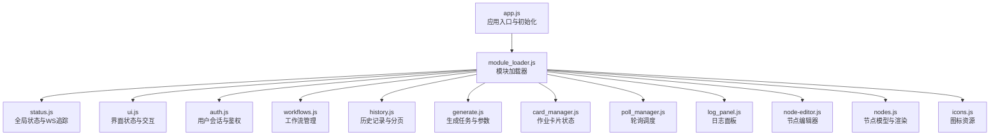
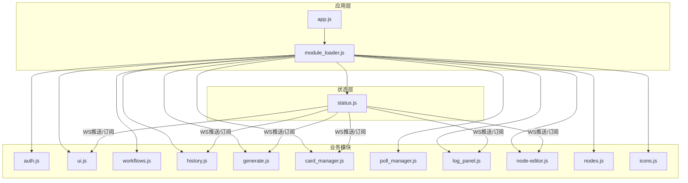
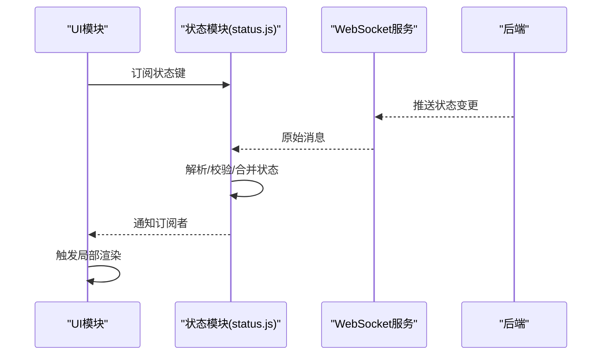
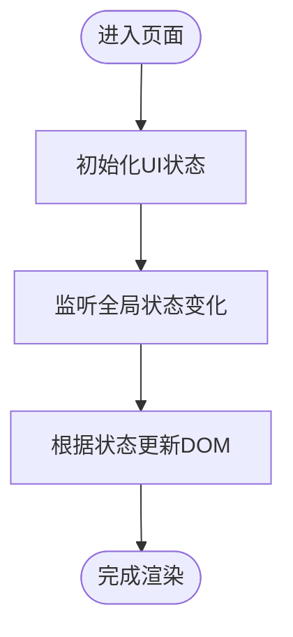
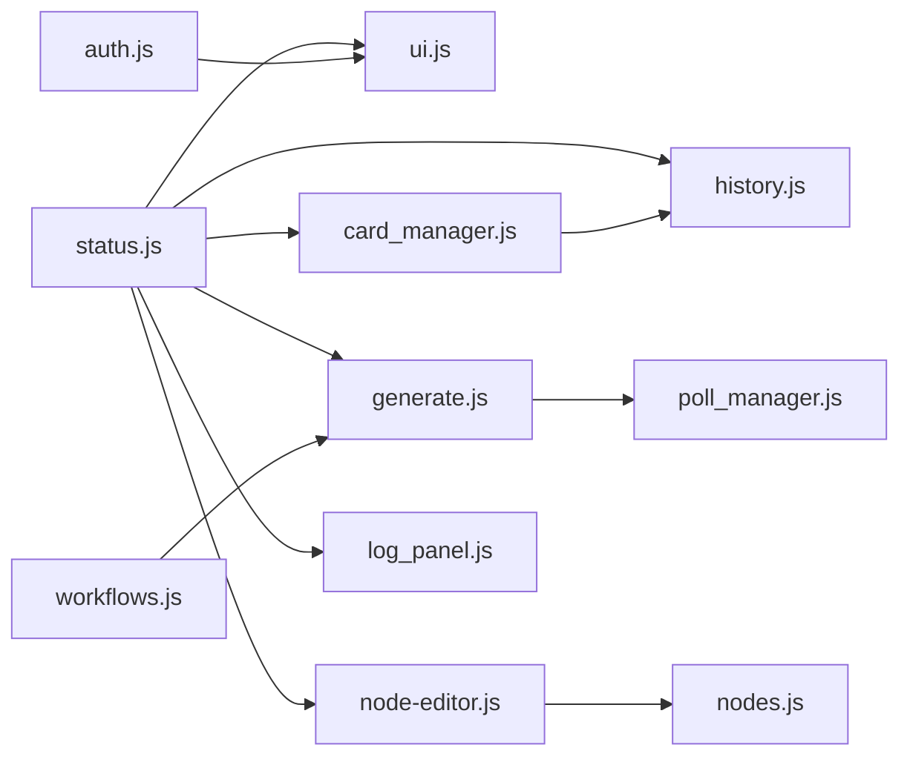

# 前端状态管理

<cite>
**本文引用的文件**
- [static/js/app.js](file://static/js/app.js)
- [static/js/module_loader.js](file://static/js/module_loader.js)
- [static/js/modules/auth.js](file://static/js/modules/auth.js)
- [static/js/modules/status.js](file://static/js/modules/status.js)
- [static/js/modules/ui.js](file://static/js/modules/ui.js)
- [static/js/modules/workflows.js](file://static/js/modules/workflows.js)
- [static/js/modules/history.js](file://static/js/modules/history.js)
- [static/js/modules/generate.js](file://static/js/modules/generate.js)
- [static/js/modules/card_manager.js](file://static/js/modules/card_manager.js)
- [static/js/modules/poll_manager.js](file://static/js/modules/poll_manager.js)
- [static/js/modules/log_panel.js](file://static/js/modules/log_panel.js)
- [static/js/modules/node-editor.js](file://static/js/modules/node-editor.js)
- [static/js/modules/nodes.js](file://static/js/modules/nodes.js)
- [static/js/modules/icons.js](file://static/js/modules/icons.js)
</cite>

## 目录
1. [简介](#简介)
2. [项目结构](#项目结构)
3. [核心组件](#核心组件)
4. [架构总览](#架构总览)
5. [详细组件分析](#详细组件分析)
6. [依赖关系分析](#依赖关系分析)
7. [性能考量](#性能考量)
8. [故障排查指南](#故障排查指南)
9. [结论](#结论)
10. [附录](#附录)

## 简介
本文件系统性梳理 Ez ComfyUI Showcase 前端状态管理的设计与实现，覆盖全局状态架构、组件状态隔离策略、数据流管理模式、实时同步机制、用户会话管理、界面状态维护、状态持久化、更新触发器、监听与响应模式，并给出最佳实践、性能优化与调试方法。文档以模块化视角呈现，结合架构图与数据流图帮助读者快速理解与落地。

## 项目结构
前端采用“应用入口 + 模块化加载”的组织方式：应用入口负责初始化与模块装配；模块加载器统一管理各功能模块的加载顺序与版本缓存；各业务模块（如认证、状态、UI、工作流、历史、生成、卡片管理、轮询、日志、节点编辑器、节点、图标等）各自封装职责，通过事件与回调进行协作。

图表来源
- [static/js/app.js](file://static/js/app.js)
- [static/js/module_loader.js](file://static/js/module_loader.js)
- [static/js/modules/status.js](file://static/js/modules/status.js)
- [static/js/modules/ui.js](file://static/js/modules/ui.js)
- [static/js/modules/auth.js](file://static/js/modules/auth.js)
- [static/js/modules/workflows.js](file://static/js/modules/workflows.js)
- [static/js/modules/history.js](file://static/js/modules/history.js)
- [static/js/modules/generate.js](file://static/js/modules/generate.js)
- [static/js/modules/card_manager.js](file://static/js/modules/card_manager.js)
- [static/js/modules/poll_manager.js](file://static/js/modules/poll_manager.js)
- [static/js/modules/log_panel.js](file://static/js/modules/log_panel.js)
- [static/js/modules/node-editor.js](file://static/js/modules/node-editor.js)
- [static/js/modules/nodes.js](file://static/js/modules/nodes.js)
- [static/js/modules/icons.js](file://static/js/modules/icons.js)

章节来源
- [static/js/app.js](file://static/js/app.js)
- [static/js/module_loader.js](file://static/js/module_loader.js)

## 核心组件
- 全局状态与WebSocket追踪：集中管理运行时状态、连接状态、任务进度与错误信息，提供订阅/发布接口供其他模块消费。
- 界面状态：负责标题栏、侧边栏、模态框、布局切换、主题与可见性等UI状态。
- 用户会话：处理登录、登出、令牌存储与刷新、会话过期处理。
- 工作流管理：加载、保存、验证、选择工作流配置，驱动生成流程。
- 历史记录：分页加载、聚焦项、删除、懒加载与本地缓存。
- 生成任务：参数构建、提交、轮询结果、媒体预览与下载。
- 卡片管理：作业卡片的创建、更新、动画、重试与删除。
- 轮询管理：统一的任务状态轮询策略、并发控制与退避。
- 日志面板：实时日志展示、过滤、滚动与持久化。
- 节点编辑器与节点：节点树渲染、连线、选中与拖拽、参数面板联动。
- 图标资源：图标库与动态加载。

章节来源
- [static/js/modules/status.js](file://static/js/modules/status.js)
- [static/js/modules/ui.js](file://static/js/modules/ui.js)
- [static/js/modules/auth.js](file://static/js/modules/auth.js)
- [static/js/modules/workflows.js](file://static/js/modules/workflows.js)
- [static/js/modules/history.js](file://static/js/modules/history.js)
- [static/js/modules/generate.js](file://static/js/modules/generate.js)
- [static/js/modules/card_manager.js](file://static/js/modules/card_manager.js)
- [static/js/modules/poll_manager.js](file://static/js/modules/poll_manager.js)
- [static/js/modules/log_panel.js](file://static/js/modules/log_panel.js)
- [static/js/modules/node-editor.js](file://static/js/modules/node-editor.js)
- [static/js/modules/nodes.js](file://static/js/modules/nodes.js)
- [static/js/modules/icons.js](file://static/js/modules/icons.js)

## 架构总览
整体采用“模块化单页应用”架构：app.js 作为 IIFE 初始化入口，负责注册全局对象、绑定事件、启动模块；module_loader.js 统一加载各模块并注入版本参数，避免缓存问题；各模块通过事件总线或回调函数进行解耦协作；状态通过 status.js 集中管理并通过 WS 推送保持实时同步。

图表来源
- [static/js/app.js](file://static/js/app.js)
- [static/js/module_loader.js](file://static/js/module_loader.js)
- [static/js/modules/status.js](file://static/js/modules/status.js)
- [static/js/modules/ui.js](file://static/js/modules/ui.js)
- [static/js/modules/auth.js](file://static/js/modules/auth.js)
- [static/js/modules/workflows.js](file://static/js/modules/workflows.js)
- [static/js/modules/history.js](file://static/js/modules/history.js)
- [static/js/modules/generate.js](file://static/js/modules/generate.js)
- [static/js/modules/card_manager.js](file://static/js/modules/card_manager.js)
- [static/js/modules/poll_manager.js](file://static/js/modules/poll_manager.js)
- [static/js/modules/log_panel.js](file://static/js/modules/log_panel.js)
- [static/js/modules/node-editor.js](file://static/js/modules/node-editor.js)
- [static/js/modules/nodes.js](file://static/js/modules/nodes.js)
- [static/js/modules/icons.js](file://static/js/modules/icons.js)

## 详细组件分析

### 全局状态与WebSocket追踪（status.js）
- 设计要点
  - 集中式状态存储：维护运行时状态、连接状态、任务进度、错误信息、实例信息等。
  - 实时同步：通过 WebSocket 接收后端推送，更新状态并触发订阅者回调。
  - 订阅/发布：提供 subscribe/unsubscribe 接口，模块可按需订阅感兴趣的状态键。
  - 错误与重连：内置连接失败、断线重连策略与错误上报。
- 数据结构与复杂度
  - 状态对象为扁平键值映射，读写复杂度 O(1)；订阅者列表在高频更新场景下需注意去重与清理。
- 依赖链
  - 依赖 ws_tracker（来自模块外部，用于建立与维护 WS 连接）。
- 性能与优化
  - 批量更新：聚合多次变更后一次性通知订阅者，减少渲染抖动。
  - 深拷贝与不可变更新：对外暴露只读视图，内部使用浅拷贝+必要深拷贝，降低内存压力。
- 错误处理
  - 连接异常：自动退避重连，超限后降级为轮询兜底。
  - 数据异常：校验消息格式与字段完整性，异常时回滚到上一次有效状态。

图表来源
- [static/js/modules/status.js](file://static/js/modules/status.js)

章节来源
- [static/js/modules/status.js](file://static/js/modules/status.js)

### 界面状态（ui.js）
- 设计要点
  - 标题栏、侧边栏、模态框、布局切换、主题切换、可见性控制等。
  - 通过 getter/setter 暴露可观察状态，便于跨模块读取与更新。
  - 与全局状态解耦：仅维护 UI 层状态，不承载业务数据。
- 状态隔离
  - 使用独立命名空间与私有变量，避免与业务状态混淆。
- 性能与优化
  - 变更节流：对频繁 UI 事件（如窗口大小变化）进行节流。
  - 条件渲染：基于状态精确控制 DOM 更新范围。

图表来源
- [static/js/modules/ui.js](file://static/js/modules/ui.js)

章节来源
- [static/js/modules/ui.js](file://static/js/modules/ui.js)

### 用户会话（auth.js）
- 设计要点
  - 登录/登出：调用后端接口，处理令牌存储与刷新。
  - 会话过期：拦截 401，触发登出与提示。
  - 会话持久化：使用浏览器存储保存令牌与用户信息。
- 状态隔离
  - 会话状态与业务状态分离，仅在认证相关模块内访问。
- 最佳实践
  - 令牌刷新：在请求前检查过期时间，必要时静默刷新。
  - 安全性：敏感操作前二次确认，避免令牌泄露。

章节来源
- [static/js/modules/auth.js](file://static/js/modules/auth.js)

### 工作流管理（workflows.js）
- 设计要点
  - 工作流加载与解析：从本地或远端加载配置，校验结构与参数。
  - 选择与应用：支持多工作流并行管理，提供当前工作流上下文。
  - 与生成模块协作：向生成模块传递参数与节点图。
- 状态隔离
  - 工作流状态为只读上下文，避免被其他模块直接修改。
- 性能与优化
  - 缓存最近工作流：减少重复加载开销。
  - 参数默认值与校验：提前收敛参数，降低运行时错误。

章节来源
- [static/js/modules/workflows.js](file://static/js/modules/workflows.js)

### 历史记录（history.js）
- 设计要点
  - 分页加载：支持懒加载与本地缓存，提升大列表性能。
  - 聚焦与删除：支持聚焦到特定条目、批量删除与清空。
  - 与状态模块集成：订阅任务状态变化，自动刷新历史项。
- 状态隔离
  - 历史状态为纯 UI/业务数据集合，不包含渲染细节。
- 性能与优化
  - 虚拟滚动：长列表场景使用虚拟滚动减少 DOM 数量。
  - 增量更新：仅更新变化项，避免整表重绘。

章节来源
- [static/js/modules/history.js](file://static/js/modules/history.js)

### 生成任务（generate.js）
- 设计要点
  - 参数构建：从工作流与用户输入合成最终参数。
  - 提交与轮询：提交后启动轮询，获取进度与结果。
  - 多媒体预览：支持图片/视频/音频预览与下载。
- 状态隔离
  - 生成状态为任务级上下文，包含参数、进度、结果与错误。
- 性能与优化
  - 并发限制：限制同时进行的生成任务数量。
  - 轮询退避：指数退避与最大等待时间，避免风暴。

章节来源
- [static/js/modules/generate.js](file://static/js/modules/generate.js)

### 卡片管理（card_manager.js）
- 设计要点
  - 卡片生命周期：创建、更新、动画、重试、删除。
  - 与轮询模块协作：接收进度更新，驱动卡片状态变化。
  - 与历史模块协作：同步历史项与卡片状态。
- 状态隔离
  - 卡片状态为局部状态，仅在卡片容器内传播。
- 性能与优化
  - 动画节流：动画帧率限制，避免卡顿。
  - 批量更新：同一帧内合并多个卡片更新。

章节来源
- [static/js/modules/card_manager.js](file://static/js/modules/card_manager.js)

### 轮询管理（poll_manager.js）
- 设计要点
  - 统一轮询策略：集中管理任务 ID 列表、轮询间隔、并发与退避。
  - 任务调度：按优先级与资源占用调度轮询任务。
- 状态隔离
  - 轮询状态为调度层状态，不包含业务数据。
- 性能与优化
  - 合理间隔：根据任务类型设置不同轮询间隔。
  - 资源回收：停止不再活跃的任务轮询。

章节来源
- [static/js/modules/poll_manager.js](file://static/js/modules/poll_manager.js)

### 日志面板（log_panel.js）
- 设计要点
  - 实时日志：接收状态模块推送的日志事件，增量追加。
  - 过滤与滚动：支持关键字过滤、自动滚动到底部。
  - 持久化：本地存储日志片段，刷新后恢复。
- 状态隔离
  - 日志状态为纯 UI 状态，不参与业务计算。
- 性能与优化
  - 截断策略：超过阈值时截断旧日志，避免内存膨胀。
  - 虚拟化：超长日志使用虚拟化渲染。

章节来源
- [static/js/modules/log_panel.js](file://static/js/modules/log_panel.js)

### 节点编辑器与节点（node-editor.js、nodes.js）
- 设计要点
  - 节点树渲染：基于状态中的节点图渲染节点与连线。
  - 交互能力：选中、拖拽、连线、参数面板联动。
  - 与工作流协作：将编辑后的节点图回写到工作流上下文。
- 状态隔离
  - 编辑器状态为局部状态，不污染全局业务状态。
- 性能与优化
  - 渲染优化：仅重绘变化区域，使用 requestAnimationFrame。
  - 事件去抖：对高频交互事件进行去抖处理。

章节来源
- [static/js/modules/node-editor.js](file://static/js/modules/node-editor.js)
- [static/js/modules/nodes.js](file://static/js/modules/nodes.js)

### 图标资源（icons.js）
- 设计要点
  - 图标库：集中管理图标名称与 SVG 资源。
  - 动态加载：按需加载图标，减少初始包体积。
- 状态隔离
  - 图标状态为静态资源，不参与运行时状态。

章节来源
- [static/js/modules/icons.js](file://static/js/modules/icons.js)

## 依赖关系分析
- 模块耦合
  - app.js 与 module_loader.js 强耦合：前者负责初始化，后者负责加载。
  - status.js 与各模块弱耦合：通过订阅/发布接口通信，降低直接依赖。
  - UI 与业务模块松耦合：UI 仅消费状态，不直接修改业务数据。
- 直接与间接依赖
  - status.js 间接依赖 ws_tracker（外部模块），用于建立 WS 连接。
  - generate.js 与 poll_manager.js 存在协作关系，共同管理任务轮询。
  - card_manager.js 与 history.js 存在数据一致性需求，需通过状态模块协调。
- 循环依赖
  - 当前设计避免循环依赖：模块间通过状态中心与事件总线通信。
- 外部依赖与集成点
  - WebSocket：状态同步与实时事件推送。
  - 浏览器存储：会话与日志持久化。
  - 后端 API：认证、历史、生成、工作流等接口。

图表来源
- [static/js/modules/status.js](file://static/js/modules/status.js)
- [static/js/modules/ui.js](file://static/js/modules/ui.js)
- [static/js/modules/auth.js](file://static/js/modules/auth.js)
- [static/js/modules/workflows.js](file://static/js/modules/workflows.js)
- [static/js/modules/history.js](file://static/js/modules/history.js)
- [static/js/modules/generate.js](file://static/js/modules/generate.js)
- [static/js/modules/card_manager.js](file://static/js/modules/card_manager.js)
- [static/js/modules/poll_manager.js](file://static/js/modules/poll_manager.js)
- [static/js/modules/log_panel.js](file://static/js/modules/log_panel.js)
- [static/js/modules/node-editor.js](file://static/js/modules/node-editor.js)
- [static/js/modules/nodes.js](file://static/js/modules/nodes.js)

章节来源
- [static/js/app.js](file://static/js/app.js)
- [static/js/module_loader.js](file://static/js/module_loader.js)

## 性能考量
- 状态更新优化
  - 批量更新：聚合多次状态变更，减少订阅者回调次数。
  - 不可变更新：对外暴露只读视图，内部使用浅拷贝+必要深拷贝。
  - 变更追踪：记录变更键集合，仅通知受影响的订阅者。
- 渲染性能
  - 虚拟滚动：历史与日志长列表使用虚拟化。
  - 动画节流：卡片动画与窗口事件节流。
  - 按需渲染：条件渲染与延迟初始化。
- 网络与轮询
  - 轮询退避：指数退避与最大等待时间。
  - 并发限制：生成任务并发数上限。
  - 缓存策略：工作流与日志本地缓存。
- 内存管理
  - 截断与清理：超阈值日志截断，停止不再活跃任务的轮询。
  - 对象池：复用临时对象，减少 GC 压力。

## 故障排查指南
- WebSocket 断线
  - 现象：状态不更新、任务无进度。
  - 排查：检查 WS 连接状态与重连日志；确认后端服务可用。
  - 处置：触发手动重连，必要时降级为轮询。
- 认证失败
  - 现象：401 未授权、登出跳转。
  - 排查：检查令牌是否过期或被撤销；查看刷新流程。
  - 处置：静默刷新或引导重新登录。
- 生成任务卡住
  - 现象：进度长时间不变。
  - 排查：检查轮询策略与任务 ID 是否正确；查看后端队列状态。
  - 处置：调整轮询间隔，必要时重试或取消。
- 历史列表异常
  - 现象：加载失败、重复项、空白。
  - 排查：检查分页参数与缓存一致性；确认状态模块推送是否正常。
  - 处置：清理缓存，重新加载。
- UI 卡顿
  - 现象：渲染缓慢、动画掉帧。
  - 排查：定位高频更新与重绘热点；检查虚拟化与节流配置。
  - 处置：启用虚拟滚动、增加节流、减少不必要的重渲染。

章节来源
- [static/js/modules/status.js](file://static/js/modules/status.js)
- [static/js/modules/auth.js](file://static/js/modules/auth.js)
- [static/js/modules/generate.js](file://static/js/modules/generate.js)
- [static/js/modules/history.js](file://static/js/modules/history.js)
- [static/js/modules/ui.js](file://static/js/modules/ui.js)

## 结论
Ez ComfyUI Showcase 的前端状态管理以模块化为核心，通过集中式状态与订阅/发布模式实现跨模块解耦，配合 WebSocket 实现实时同步与用户会话管理。组件状态隔离策略清晰，数据流可控，具备良好的扩展性与可维护性。建议在现有基础上进一步完善状态快照与回放能力、增强错误边界与可观测性，并持续优化渲染与网络层性能。

## 附录
- 状态持久化清单
  - 会话：令牌与用户信息（浏览器存储）。
  - 日志：日志片段（浏览器存储）。
  - 工作流：最近工作流与参数（浏览器存储）。
- 状态更新触发器
  - 用户交互：点击、输入、拖拽等。
  - 系统事件：窗口大小变化、焦点切换等。
  - 业务事件：WS 推送、轮询结果、历史变更等。
- 监听与响应模式
  - 订阅者模式：模块订阅感兴趣的状态键，收到变更后执行响应逻辑。
  - 回调链：在状态变更后按顺序执行一系列回调，确保副作用一致。