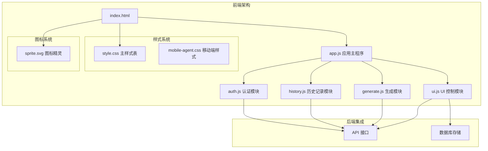
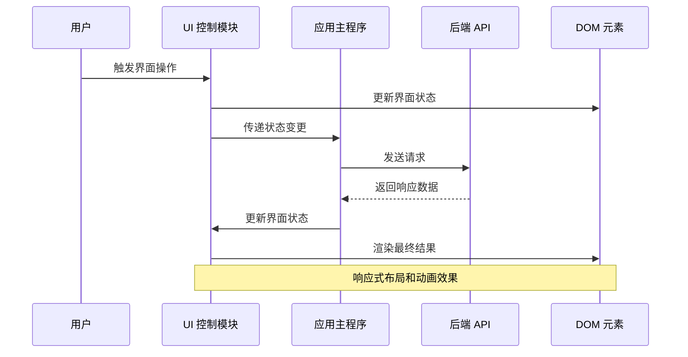
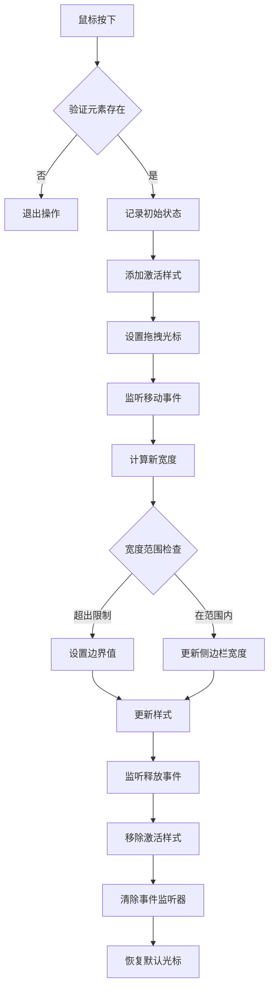
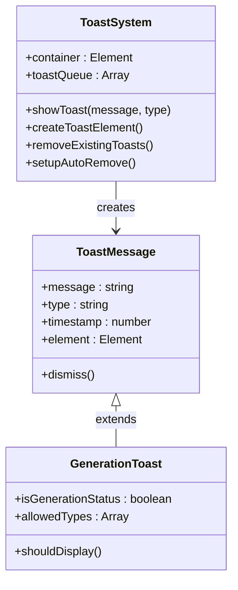
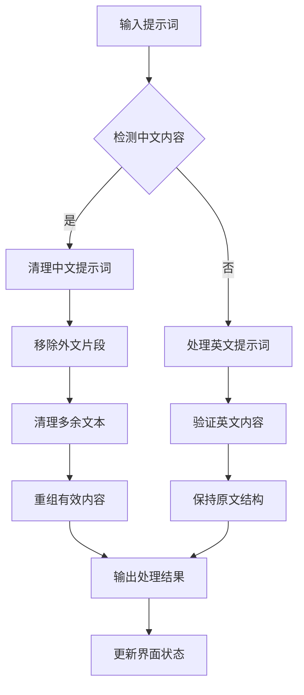
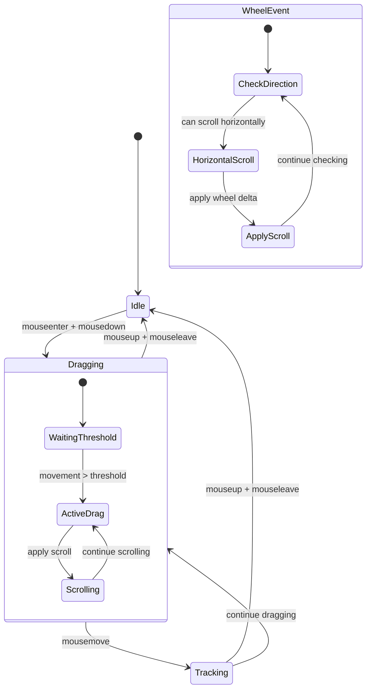
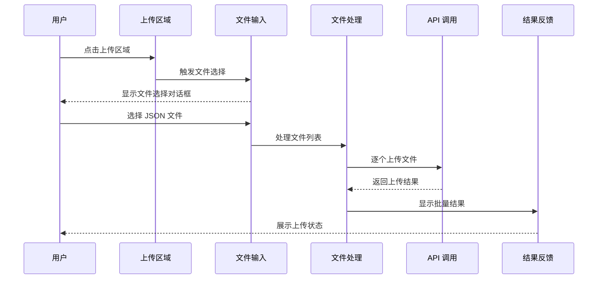
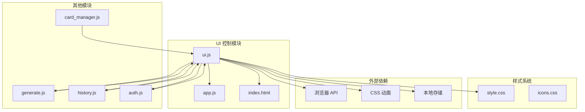

# UI 控制模块 (ui.js) 技术文档

<cite>
**本文档引用的文件**
- [ui.js](file://static/js/modules/ui.js)
- [app.js](file://static/js/app.js)
- [index.html](file://static/index.html)
- [style.css](file://static/css/style.css)
- [module_loader.js](file://static/js/module_loader.js)
- [generate.js](file://static/js/modules/generate.js)
- [history.js](file://static/js/modules/history.js)
- [auth.js](file://static/js/modules/auth.js)
</cite>

## 目录
1. [简介](#简介)
2. [项目结构](#项目结构)
3. [核心组件](#核心组件)
4. [架构概览](#架构概览)
5. [详细组件分析](#详细组件分析)
6. [依赖关系分析](#依赖关系分析)
7. [性能考虑](#性能考虑)
8. [故障排除指南](#故障排除指南)
9. [结论](#结论)

## 简介

UI 控制模块 (ui.js) 是 Ez ComfyUI Showcase 项目中的核心前端模块，负责管理用户界面的布局、交互和状态控制。该模块实现了响应式设计、主题切换、组件状态管理等功能，为用户提供流畅的图像生成和管理工作流体验。

该模块采用模块化设计，通过 window.CW 对象暴露接口，与应用主程序和其他模块进行协作。模块涵盖了从基础 UI 控制到复杂交互场景的完整功能集。

## 项目结构

Ez ComfyUI Showcase 采用模块化的前端架构，UI 控制模块位于静态资源目录中：



**图表来源**
- [index.html:1-659](file://static/index.html#L1-L659)
- [app.js:1-927](file://static/js/app.js#L1-L927)

**章节来源**
- [index.html:1-659](file://static/index.html#L1-L659)
- [app.js:1-927](file://static/js/app.js#L1-L927)

## 核心组件

UI 控制模块包含以下主要功能组件：

### 1. 布局管理组件
- **侧边栏调整器**：实现可拖拽的侧边栏宽度调整
- **工作流网格**：动态工作流卡片布局
- **历史记录瀑布流**：响应式图片展示网格

### 2. 交互控制组件
- **提示词处理**：智能提示词清理和优化
- **拖拽滚动**：水平滚动容器的拖拽支持
- **模态对话框**：多层覆盖界面管理

### 3. 状态管理组件
- **Toast 通知系统**：浮动消息提示
- **进度状态监控**：生成任务状态跟踪
- **设备状态管理**：GPU 和服务状态显示

**章节来源**
- [ui.js:1-808](file://static/js/modules/ui.js#L1-L808)
- [app.js:630-728](file://static/js/app.js#L630-L728)

## 架构概览

UI 控制模块采用事件驱动的架构模式，通过统一的事件系统协调各个组件：



**图表来源**
- [ui.js:21-56](file://static/js/modules/ui.js#L21-L56)
- [app.js:630-728](file://static/js/app.js#L630-L728)

## 详细组件分析

### 1. 侧边栏调整器 (Resize Handle)

侧边栏调整器是 UI 模块的核心布局组件，提供了直观的拖拽调整功能：



**图表来源**
- [ui.js:21-56](file://static/js/modules/ui.js#L21-L56)

**实现特点：**
- 支持最小宽度限制 (280px)
- 最大宽度限制为窗口宽度的 50%
- 移动端自动重置内联样式
- 平滑的拖拽体验和视觉反馈

**章节来源**
- [ui.js:21-56](file://static/js/modules/ui.js#L21-L56)

### 2. Toast 通知系统

Toast 系统提供了灵活的消息提示功能，支持多种状态类型：



**图表来源**
- [ui.js:10-19](file://static/js/modules/ui.js#L10-L19)
- [ui.js:617-665](file://static/js/modules/ui.js#L617-L665)

**功能特性：**
- 自动去重机制
- 生成状态专用提示
- 支持多种提示类型 (info, done, error, warn)
- 自动定时移除
- 持续性提示支持

**章节来源**
- [ui.js:10-19](file://static/js/modules/ui.js#L10-L19)
- [ui.js:617-665](file://static/js/modules/ui.js#L617-L665)

### 3. 提示词处理系统

提示词处理系统提供了智能的提示词清理和优化功能：



**图表来源**
- [ui.js:112-153](file://static/js/modules/ui.js#L112-L153)
- [ui.js:191-615](file://static/js/modules/ui.js#L191-L615)

**处理逻辑：**
- 中文提示词：移除外文干扰内容
- 英文提示词：保持原有结构
- 专家模式：支持 JSON 格式输出
- 多语言切换：动态语言切换支持

**章节来源**
- [ui.js:112-153](file://static/js/modules/ui.js#L112-L153)
- [ui.js:191-615](file://static/js/modules/ui.js#L191-L615)

### 4. 拖拽滚动功能

拖拽滚动功能为水平滚动容器提供了直观的操作体验：



**图表来源**
- [ui.js:667-727](file://static/js/modules/ui.js#L667-L727)

**实现细节：**
- 阈值检测防止误触发
- 支持鼠标拖拽和滚轮滚动
- 智能方向检测
- 性能优化的事件处理

**章节来源**
- [ui.js:667-727](file://static/js/modules/ui.js#L667-L727)

### 5. 工作流上传功能

工作流上传功能提供了便捷的文件上传和处理机制：



**图表来源**
- [ui.js:734-761](file://static/js/modules/ui.js#L734-L761)
- [app.js:797-808](file://static/js/app.js#L797-L808)

**功能特性：**
- 支持多文件同时上传
- JSON 文件格式验证
- 实时上传进度反馈
- 错误处理和重试机制

**章节来源**
- [ui.js:734-761](file://static/js/modules/ui.js#L734-L761)

## 依赖关系分析

UI 控制模块与其他系统组件的依赖关系如下：



**图表来源**
- [ui.js:1-808](file://static/js/modules/ui.js#L1-L808)
- [app.js:86-111](file://static/js/app.js#L86-L111)

**依赖特点：**
- 单向依赖：ui.js 依赖 app.js 提供的全局状态
- 松耦合设计：通过 window.CW 对象进行接口暴露
- 事件驱动：基于 DOM 事件和自定义事件进行通信
- 模块化：每个功能模块独立封装，职责明确

**章节来源**
- [ui.js:1-808](file://static/js/modules/ui.js#L1-L808)
- [app.js:86-111](file://static/js/app.js#L86-L111)

## 性能考虑

UI 控制模块在设计时充分考虑了性能优化：

### 1. 内存管理
- 使用事件委托减少内存占用
- 及时清理事件监听器
- 避免内存泄漏的闭包引用

### 2. 渲染优化
- 使用 requestAnimationFrame 进行动画
- 防抖和节流处理高频事件
- 懒加载和延迟初始化策略

### 3. 网络优化
- 批量处理 API 请求
- 缓存重复的数据
- 智能的错误重试机制

### 4. 移动端优化
- 响应式布局适配
- 触摸友好的交互设计
- 性能敏感操作的降级处理

## 故障排除指南

### 常见问题及解决方案

#### 1. 侧边栏调整失效
**症状**：拖拽调整器无法正常工作
**可能原因**：
- DOM 元素不存在
- 事件绑定失败
- CSS 样式冲突

**解决方法**：
```javascript
// 检查元素是否存在
const handle = $('#resizeHandle');
const colLeft = $('#colLeft');

if (!handle || !colLeft) {
    console.warn('侧边栏元素未找到');
    return;
}

// 重新初始化
initResizeHandle();
```

#### 2. Toast 通知不显示
**症状**：调用 showToast() 无反应
**可能原因**：
- 容器元素创建失败
- 样式被覆盖
- 浏览器兼容性问题

**解决方法**：
```javascript
// 手动创建容器
function ensureToastContainer() {
    let container = document.getElementById('toastContainer');
    if (!container) {
        container = document.createElement('div');
        container.id = 'toastContainer';
        container.className = 'toast-container';
        document.body.appendChild(container);
    }
    return container;
}
```

#### 3. 提示词处理异常
**症状**：提示词清理功能失效
**可能原因**：
- 正则表达式匹配失败
- 文本编码问题
- 专家模式数据格式错误

**解决方法**：
```javascript
// 检查中文检测
function hasChinese(text) {
    return /[\u3400-\u9fff]/.test(String(text || ''));
}

// 验证 JSON 格式
function validateStructuredData(data) {
    try {
        return JSON.parse(data);
    } catch (e) {
        return null;
    }
}
```

**章节来源**
- [ui.js:10-19](file://static/js/modules/ui.js#L10-L19)
- [ui.js:112-153](file://static/js/modules/ui.js#L112-L153)

## 结论

UI 控制模块 (ui.js) 作为 Ez ComfyUI Showcase 的核心前端组件，展现了优秀的模块化设计和工程实践。该模块通过精心设计的架构，实现了：

1. **完整的功能覆盖**：从基础布局管理到复杂交互处理
2. **优秀的用户体验**：响应式设计和流畅的动画效果
3. **良好的可维护性**：清晰的代码结构和模块化设计
4. **强大的扩展性**：灵活的接口设计和事件系统

模块的关键优势包括：
- 智能的状态管理和事件处理
- 优雅的响应式布局适配
- 高效的性能优化策略
- 完善的错误处理和故障恢复机制

通过持续的代码审查和测试验证，UI 控制模块为整个应用提供了稳定可靠的基础框架，为用户提供了优质的交互体验。