# 卡片管理模块 (card_manager.js) 技术文档

<cite>
**本文档引用的文件**
- [card_manager.js](file://static/js/modules/card_manager.js)
- [history.js](file://static/js/modules/history.js)
- [poll_manager.js](file://static/js/modules/poll_manager.js)
- [module_loader.js](file://static/js/module_loader.js)
- [app.js](file://static/js/app.js)
- [test_gallery_job_patch_stability.py](file://tests/test_gallery_job_patch_stability.py)
- [test_gallery_job_isolation.py](file://tests/test_gallery_job_isolation.py)
</cite>

## 目录
1. [简介](#简介)
2. [项目结构](#项目结构)
3. [核心组件](#核心组件)
4. [架构概览](#架构概览)
5. [详细组件分析](#详细组件分析)
6. [依赖关系分析](#依赖关系分析)
7. [性能考虑](#性能考虑)
8. [故障排除指南](#故障排除指南)
9. [结论](#结论)

## 简介

Ez ComfyUI Showcase 的卡片管理模块是整个作业展示系统的核心组件之一。该模块负责作业卡片的渲染、交互、状态管理和性能优化，为用户提供流畅的作业进度跟踪体验。

卡片管理模块采用轻量级适配器模式设计，通过 `CardManager` 类提供统一的接口，将具体的渲染逻辑委托给历史记录模块中的渲染器。这种设计实现了模块间的松耦合，便于维护和扩展。

## 项目结构

卡片管理模块在项目中的位置和依赖关系如下：

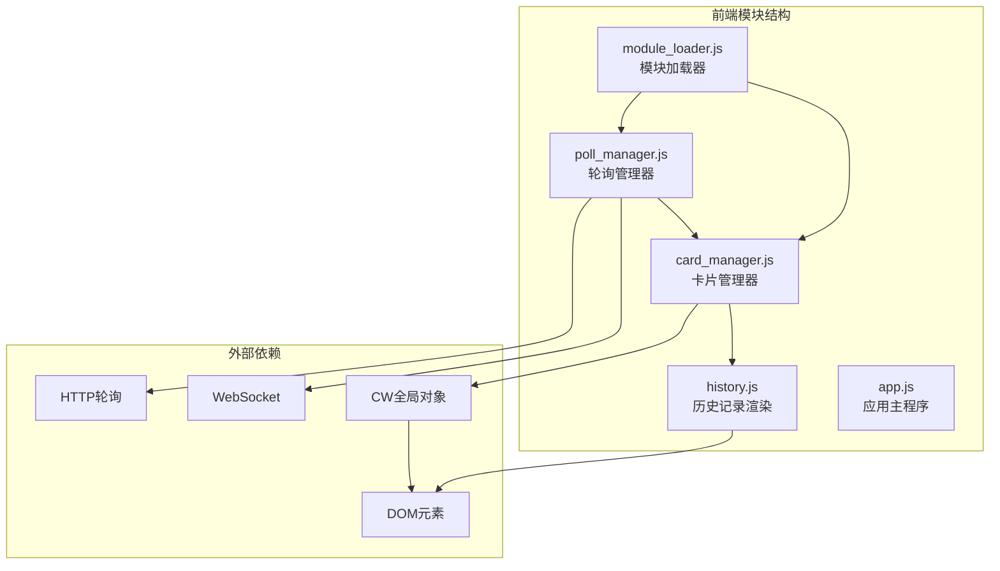

**图表来源**
- [card_manager.js:1-89](file://static/js/modules/card_manager.js#L1-L89)
- [history.js:514-713](file://static/js/modules/history.js#L514-L713)
- [poll_manager.js:1-509](file://static/js/modules/poll_manager.js#L1-L509)

**章节来源**
- [card_manager.js:1-89](file://static/js/modules/card_manager.js#L1-L89)
- [module_loader.js:110-143](file://static/js/module_loader.js#L110-L143)

## 核心组件

### CardManager 类

`CardManager` 是卡片管理模块的核心类，提供了作业卡片管理的完整接口：

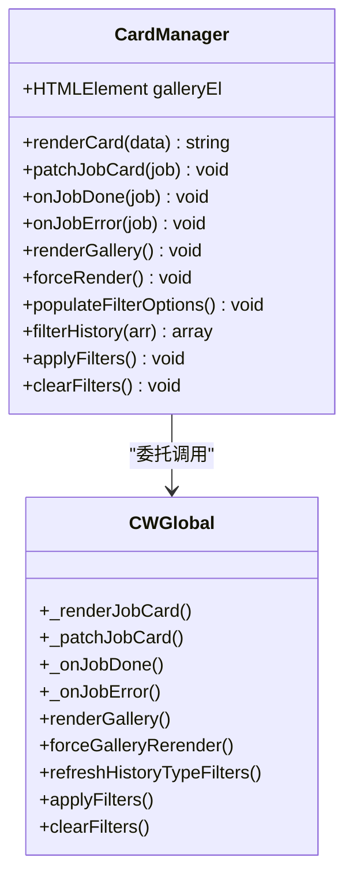

**图表来源**
- [card_manager.js:11-89](file://static/js/modules/card_manager.js#L11-L89)

### 关键方法详解

#### 渲染方法
- `renderCard(data)`: 渲染单个作业卡片
- `renderGallery()`: 渲染整个画廊
- `forceRender()`: 强制重新渲染

#### 状态更新方法
- `patchJobCard(job)`: 在不重建整个画廊的情况下更新作业状态
- `onJobDone(job)`: 处理作业完成事件
- `onJobError(job)`: 处理作业错误事件

#### 过滤器方法
- `populateFilterOptions()`: 填充过滤选项
- `applyFilters()`: 应用当前过滤条件
- `clearFilters()`: 清除所有过滤条件

**章节来源**
- [card_manager.js:15-89](file://static/js/modules/card_manager.js#L15-L89)

## 架构概览

卡片管理模块在整个系统架构中的位置和职责分工：

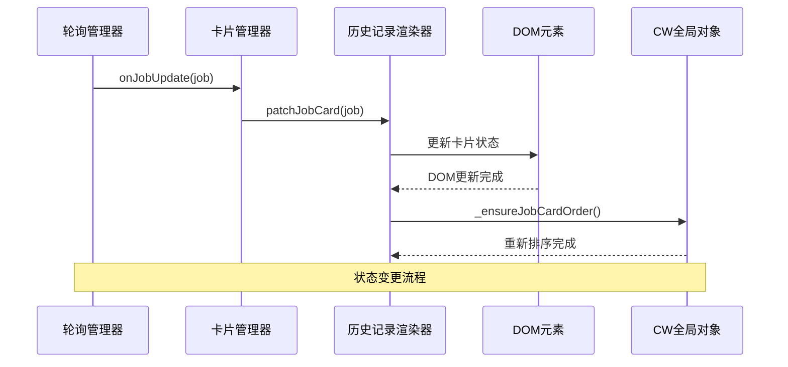

**图表来源**
- [poll_manager.js:235-307](file://static/js/modules/poll_manager.js#L235-L307)
- [card_manager.js:23-30](file://static/js/modules/card_manager.js#L23-L30)
- [history.js:591-655](file://static/js/modules/history.js#L591-L655)

### 数据流架构

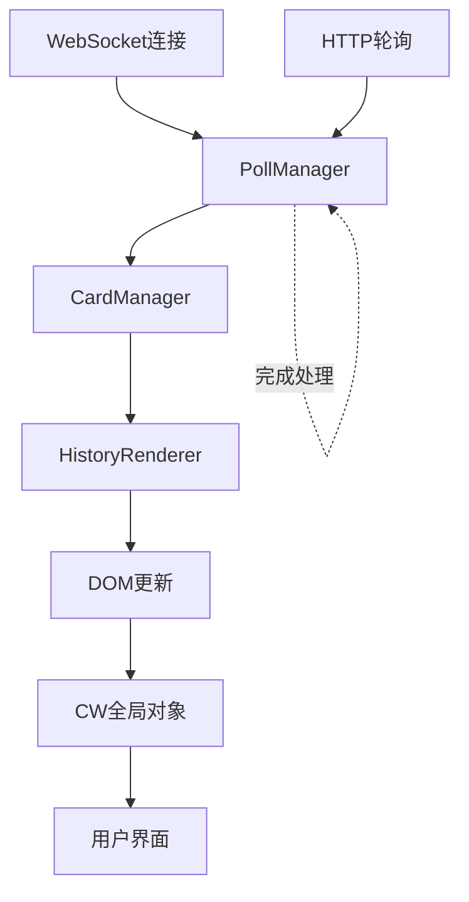

**图表来源**
- [poll_manager.js:161-218](file://static/js/modules/poll_manager.js#L161-L218)
- [card_manager.js:32-42](file://static/js/modules/card_manager.js#L32-L42)

## 详细组件分析

### 作业卡片渲染机制

作业卡片的渲染过程采用模板字符串方式，支持多种媒体类型的显示：

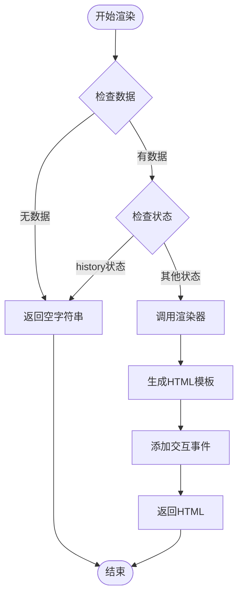

**图表来源**
- [card_manager.js:15-21](file://static/js/modules/card_manager.js#L15-L21)
- [history.js:514-588](file://static/js/modules/history.js#L514-L588)

#### 渲染特性

1. **多状态支持**: 支持排队、准备、生成、下载、检查等多种状态
2. **媒体类型检测**: 自动识别图片和视频类型
3. **懒加载优化**: 图片使用懒加载减少初始加载时间
4. **响应式设计**: 支持不同设备的显示需求

**章节来源**
- [history.js:514-588](file://static/js/modules/history.js#L514-L588)

### DOM补丁机制

卡片管理模块实现了高效的DOM补丁机制，避免了整页重渲染：

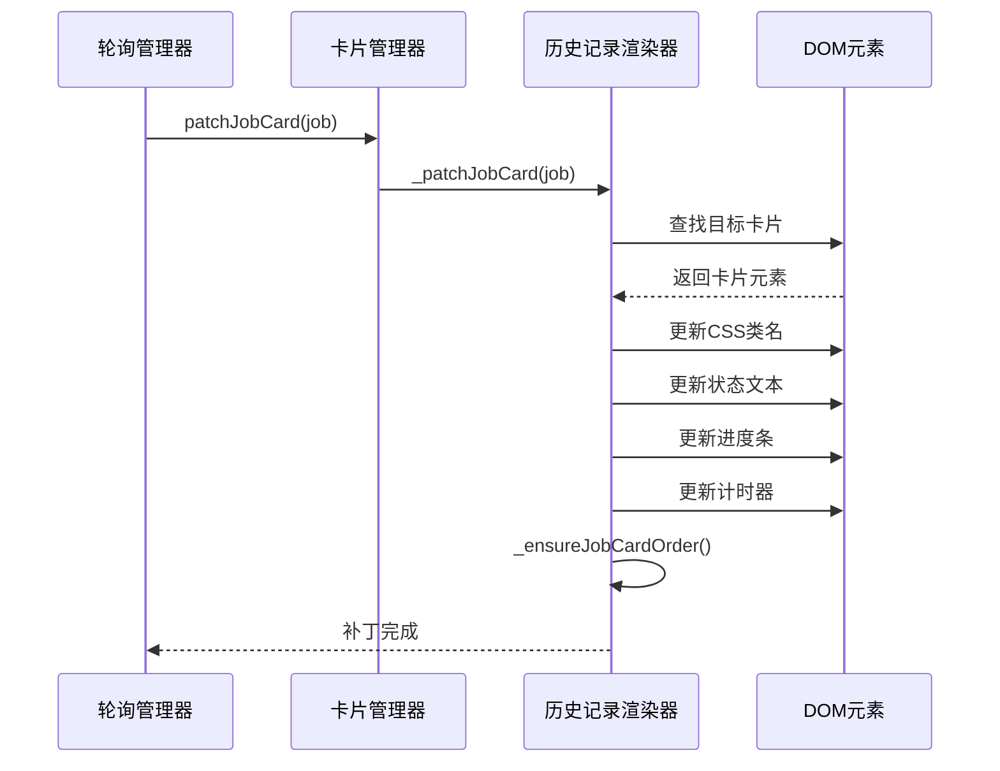

**图表来源**
- [card_manager.js:23-30](file://static/js/modules/card_manager.js#L23-L30)
- [history.js:591-655](file://static/js/modules/history.js#L591-L655)

#### 补丁策略

1. **就地更新**: 只更新变化的部分，保持DOM结构稳定
2. **状态感知**: 根据作业状态动态调整显示内容
3. **性能优化**: 避免不必要的DOM操作和重排

**章节来源**
- [history.js:591-655](file://static/js/modules/history.js#L591-L655)

### 状态管理机制

作业状态的实时同步通过轮询管理器实现：

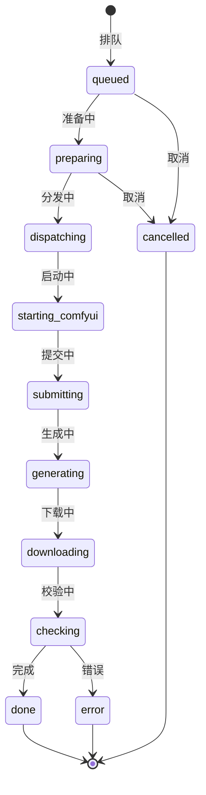

**图表来源**
- [history.js:795-802](file://static/js/modules/history.js#L795-L802)

#### 状态处理流程

1. **实时更新**: 通过WebSocket接收状态变更
2. **降级处理**: HTTP轮询作为WebSocket的后备方案
3. **本地存储**: 将作业状态保存在内存中
4. **用户反馈**: 通过Toast通知用户状态变化

**章节来源**
- [poll_manager.js:235-307](file://static/js/modules/poll_manager.js#L235-L307)

### 过滤器系统

卡片管理模块支持多种过滤器来帮助用户管理大量作业：

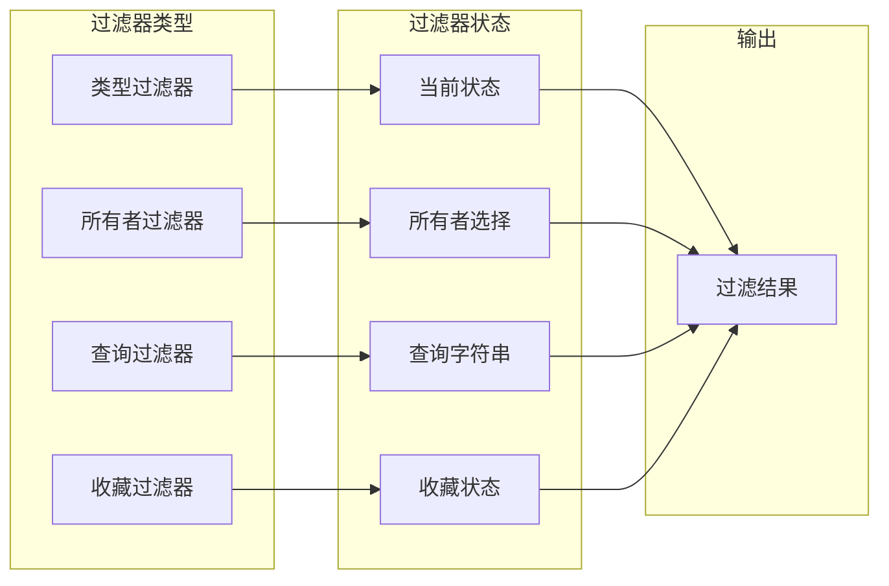

**图表来源**
- [history.js:1295-1404](file://static/js/modules/history.js#L1295-L1404)

#### 过滤器实现

1. **类型过滤**: 按作业类型（文生图、图生图等）过滤
2. **所有者过滤**: 按作业创建者过滤
3. **查询过滤**: 按关键词搜索作业
4. **收藏过滤**: 显示收藏的作业

**章节来源**
- [history.js:1295-1404](file://static/js/modules/history.js#L1295-L1404)

## 依赖关系分析

### 模块间依赖

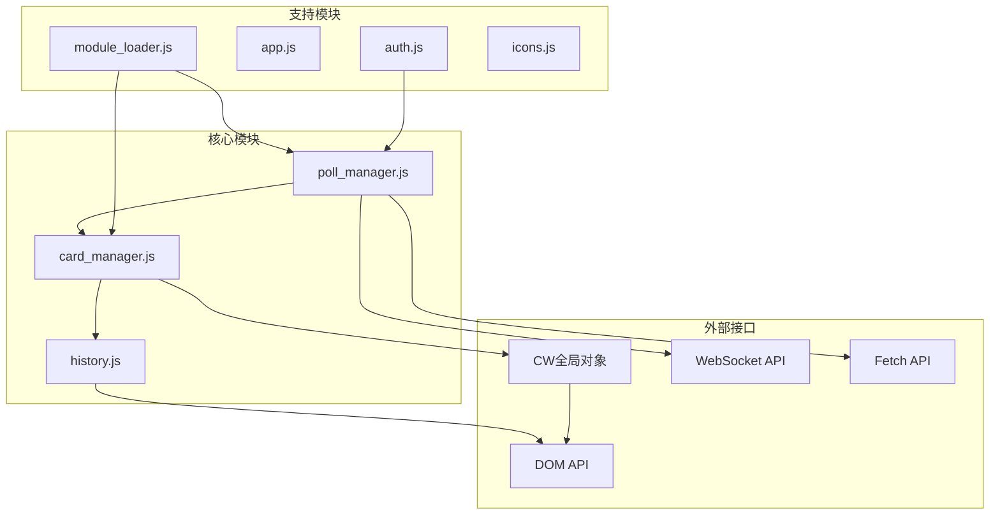

**图表来源**
- [module_loader.js:14-25](file://static/js/module_loader.js#L14-L25)
- [card_manager.js:80-87](file://static/js/modules/card_manager.js#L80-L87)

### 关键依赖点

1. **CW全局对象**: 所有渲染和更新操作都依赖于CW对象的方法
2. **DOM元素**: 通过查询选择器访问和更新页面元素
3. **WebSocket**: 实时接收作业状态更新
4. **HTTP轮询**: 作为WebSocket的后备方案

**章节来源**
- [card_manager.js:17-47](file://static/js/modules/card_manager.js#L17-L47)
- [poll_manager.js:161-218](file://static/js/modules/poll_manager.js#L161-L218)

## 性能考虑

### 内存管理

卡片管理模块采用了多项内存优化策略：

1. **弱引用模式**: 避免循环引用导致的内存泄漏
2. **事件监听器清理**: 在适当时候移除不再使用的事件监听器
3. **DOM节点复用**: 通过补丁机制复用现有DOM节点
4. **延迟加载**: 图片和视频采用懒加载策略

### 渲染优化

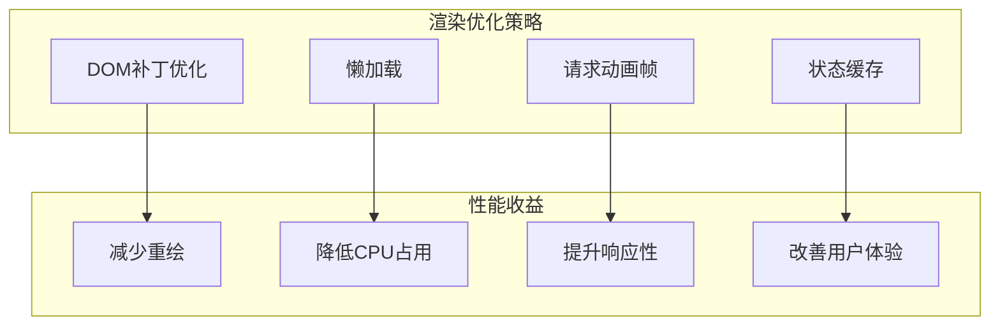

#### 优化技术

1. **就地DOM补丁**: 避免整页重渲染，只更新变化部分
2. **节流和防抖**: 控制频繁的状态更新频率
3. **虚拟滚动**: 对大量作业进行分页显示
4. **资源预加载**: 提前加载可能需要的资源

**章节来源**
- [history.js:815-853](file://static/js/modules/history.js#L815-L853)
- [poll_manager.js:467-491](file://static/js/modules/poll_manager.js#L467-L491)

### 网络优化

1. **WebSocket优先**: 实时双向通信减少延迟
2. **HTTP轮询降级**: 在WebSocket不可用时自动切换
3. **缓存策略**: 合理使用浏览器缓存机制
4. **连接池管理**: 复用网络连接减少开销

## 故障排除指南

### 常见问题诊断

#### 卡片不更新问题

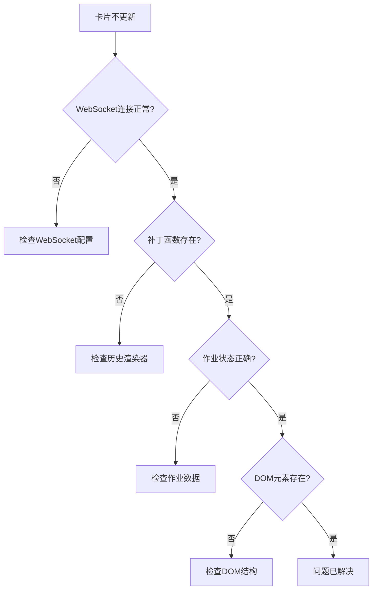

#### 解决方案

1. **WebSocket连接问题**: 检查服务器连接和防火墙设置
2. **补丁函数缺失**: 确认历史渲染器正确加载
3. **作业状态异常**: 验证作业数据格式和完整性
4. **DOM元素不存在**: 检查页面结构和选择器

**章节来源**
- [poll_manager.js:161-218](file://static/js/modules/poll_manager.js#L161-L218)
- [card_manager.js:23-30](file://static/js/modules/card_manager.js#L23-L30)

### 调试工具

1. **控制台日志**: 使用浏览器开发者工具监控状态变化
2. **网络监控**: 检查WebSocket和HTTP请求
3. **DOM检查**: 验证DOM结构和样式应用
4. **性能分析**: 使用性能面板分析渲染性能

## 结论

Ez ComfyUI Showcase 的卡片管理模块通过精心设计的架构和优化策略，为用户提供了高效、流畅的作业卡片管理体验。模块的主要优势包括：

1. **模块化设计**: 通过适配器模式实现了良好的模块解耦
2. **性能优化**: 采用就地DOM补丁和多种优化技术
3. **实时同步**: 通过WebSocket实现实时状态更新
4. **用户友好**: 提供丰富的过滤器和交互功能

该模块的设计充分考虑了可维护性和扩展性，为后续的功能增强奠定了坚实的基础。通过持续的性能监控和优化，可以进一步提升用户体验和系统稳定性。