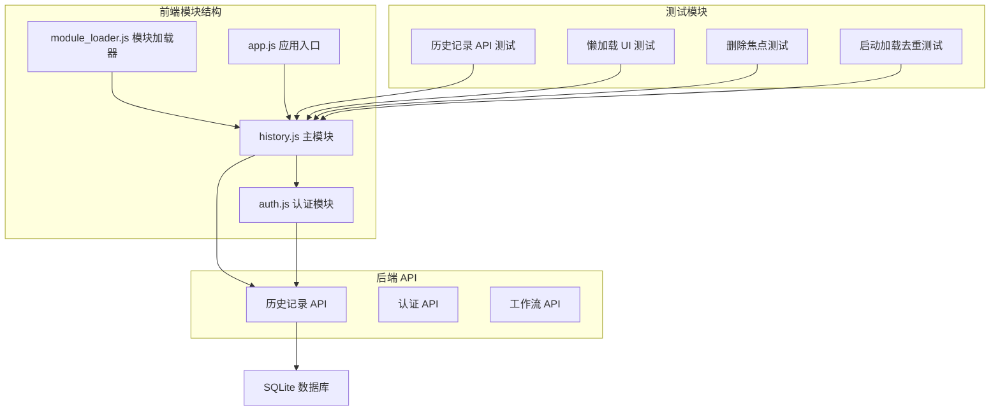
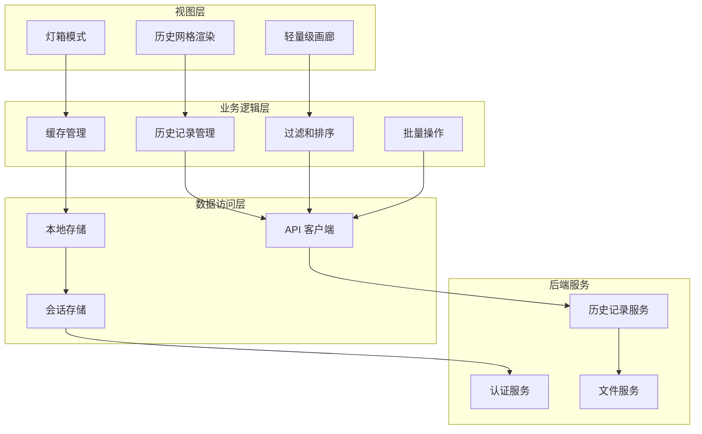
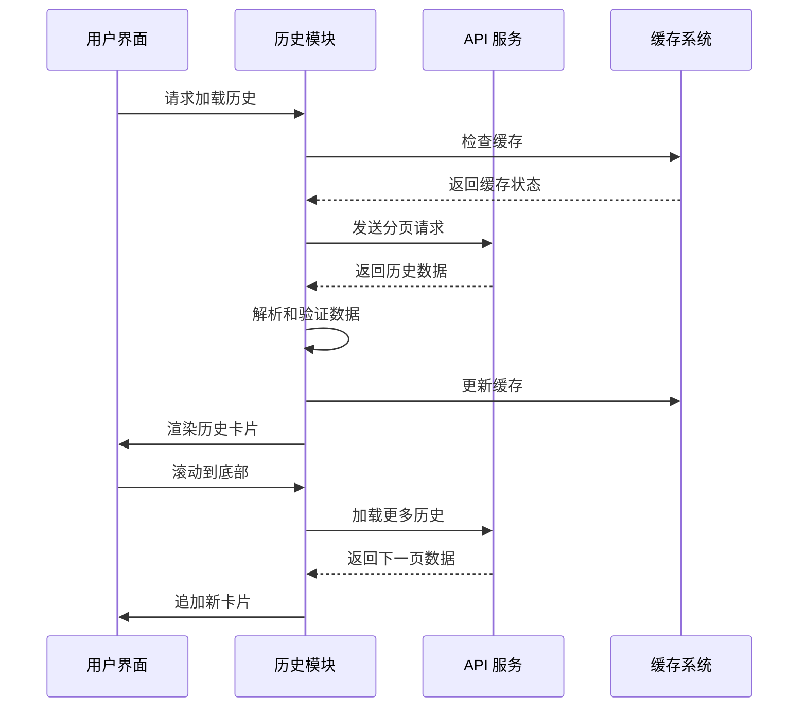
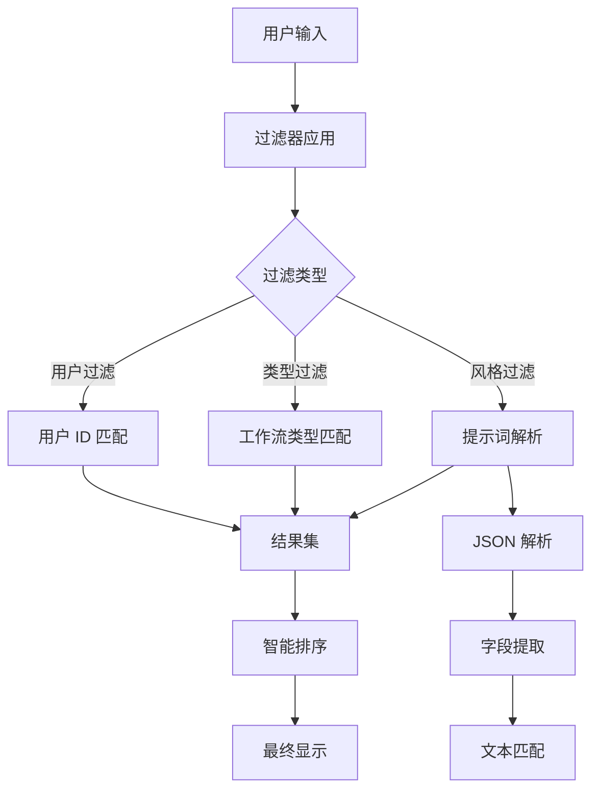
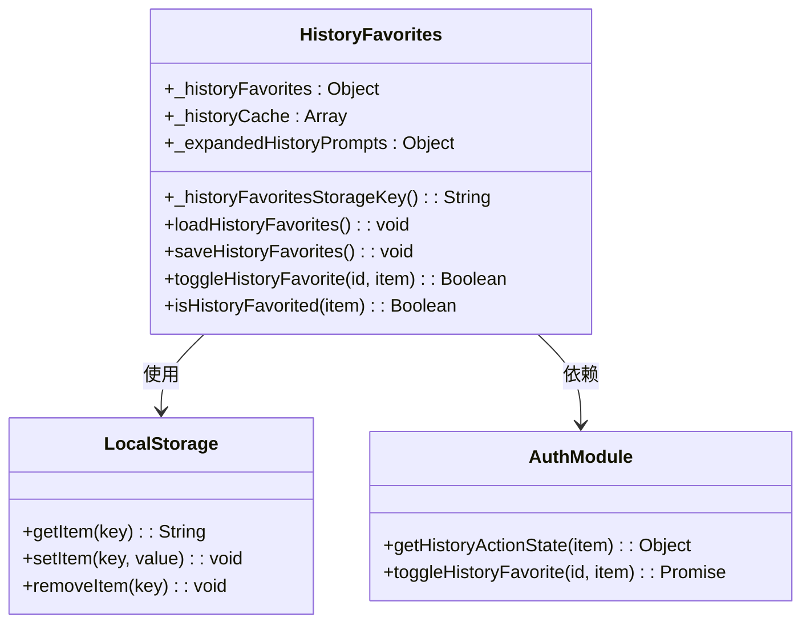
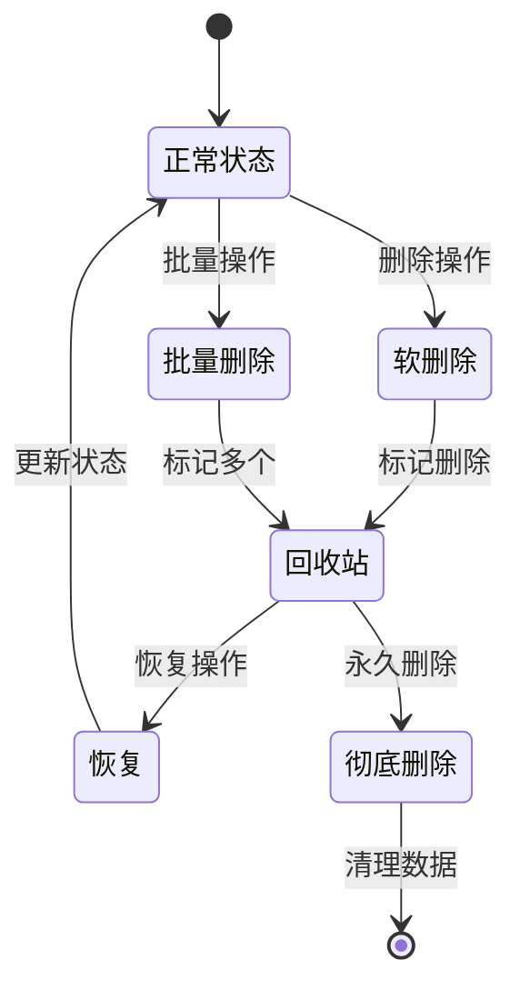
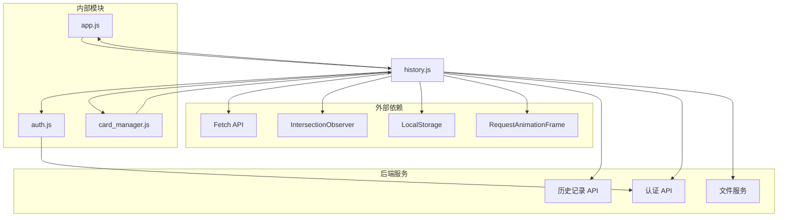

# 历史记录模块 (history.js)

<cite>
**本文档引用的文件**
- [history.js](file://static/js/modules/history.js)
- [auth.js](file://static/js/modules/auth.js)
- [module_loader.js](file://static/js/module_loader.js)
- [app.py](file://app.py)
- [test_history_api.py](file://tests/test_history_api.py)
- [test_history_lazy_loading_ui.py](file://tests/test_history_lazy_loading_ui.py)
- [test_history_delete_focus.py](file://tests/test_history_delete_focus.py)
- [test_startup_load_dedup_ui.py](file://tests/test_startup_load_dedup_ui.py)
</cite>

## 目录
1. [简介](#简介)
2. [项目结构](#项目结构)
3. [核心组件](#核心组件)
4. [架构概览](#架构概览)
5. [详细组件分析](#详细组件分析)
6. [依赖关系分析](#依赖关系分析)
7. [性能考虑](#性能考虑)
8. [故障排除指南](#故障排除指南)
9. [结论](#结论)

## 简介

Ez ComfyUI Showcase 的历史记录模块是一个功能完整的任务历史管理系统，负责展示和管理用户的生成历史记录。该模块实现了完整的 CRUD 操作、实时状态同步、智能缓存策略以及丰富的用户交互功能。

该模块主要负责：
- 历史记录的加载、过滤、排序和分页显示
- 搜索机制和筛选条件管理
- 收藏管理和用户偏好存储
- 批量操作和回收站功能
- 与后端 API 的数据交互和状态同步
- 性能优化的缓存策略和懒加载实现

## 项目结构

历史记录模块位于前端静态资源目录中，采用模块化设计：

**图表来源**
- [history.js:1-50](file://static/js/modules/history.js#L1-50)
- [module_loader.js:15-25](file://static/js/module_loader.js#L15-L25)

**章节来源**
- [history.js:1-50](file://static/js/modules/history.js#L1-50)
- [module_loader.js:15-25](file://static/js/module_loader.js#L15-L25)

## 核心组件

历史记录模块包含以下核心组件：

### 1. 历史记录数据管理
- **历史记录数组**: `historyItems` 存储所有历史记录
- **过滤历史记录**: `_filteredHistory` 存储筛选后的记录
- **可见历史记录**: `_histVisibleCount` 控制当前可见数量

### 2. 缓存系统
- **详情缓存**: `_historyDetailCache` 缓存完整历史记录详情
- **删除标记**: `_deletedHistoryIds` 管理软删除的记录
- **乐观更新**: `_optimisticHistoryById` 处理实时更新

### 3. 过滤和排序系统
- **多维过滤**: 用户、类型、风格过滤器
- **智能排序**: 时间戳和排序索引排序
- **固定排序**: `_pinnedHistoryIds` 支持置顶功能

### 4. 性能优化
- **懒加载**: IntersectionObserver 实现无限滚动
- **虚拟滚动**: 批量渲染优化
- **缓存策略**: 多级缓存减少网络请求

**章节来源**
- [history.js:10-50](file://static/js/modules/history.js#L10-L50)
- [history.js:145-160](file://static/js/modules/history.js#L145-L160)

## 架构概览

历史记录模块采用分层架构设计，实现了清晰的职责分离：

**图表来源**
- [history.js:1702-1768](file://static/js/modules/history.js#L1702-L1768)
- [history.js:3288-3301](file://static/js/modules/history.js#L3288-L3301)

## 详细组件分析

### 历史记录加载系统

历史记录加载系统实现了智能的分页加载和缓存机制：

**图表来源**
- [history.js:3383-3437](file://static/js/modules/history.js#L3383-L3437)
- [history.js:3330-3381](file://static/js/modules/history.js#L3330-L3381)

#### 关键特性
- **智能分页**: 默认每页 80 条记录
- **缓存策略**: 详情缓存限制 24 条
- **错误处理**: 完善的异常捕获和用户提示
- **状态管理**: 加载状态和错误状态跟踪

**章节来源**
- [history.js:45-49](file://static/js/modules/history.js#L45-L49)
- [history.js:3288-3301](file://static/js/modules/history.js#L3288-L3301)

### 过滤和搜索系统

过滤系统提供了多维度的搜索能力：

**图表来源**
- [history.js:1904-1937](file://static/js/modules/history.js#L1904-L1937)

#### 过滤器类型
- **用户过滤**: 支持 "全部"、"我的"、"收藏"、"他人"
- **类型过滤**: 文生图、图生图、放大、视频制作等
- **风格过滤**: 基于提示词的智能搜索

**章节来源**
- [history.js:1285-1404](file://static/js/modules/history.js#L1285-L1404)
- [history.js:1904-1937](file://static/js/modules/history.js#L1904-L1937)

### 收藏和用户偏好管理

收藏系统实现了本地持久化的用户偏好存储：

**图表来源**
- [auth.js:10-63](file://static/js/modules/auth.js#L10-L63)

#### 功能特性
- **本地存储**: 使用 localStorage 存储用户偏好
- **跨会话持久化**: 自动迁移和版本兼容
- **实时同步**: 与后端状态保持同步
- **批量操作**: 支持批量收藏和取消收藏

**章节来源**
- [auth.js:10-63](file://static/js/modules/auth.js#L10-L63)

### 批量操作和回收站

批量操作系统提供了高效的历史记录管理：

**图表来源**
- [history.js:3214-3286](file://static/js/modules/history.js#L3214-L3286)

#### 批量操作功能
- **批量删除**: 支持单个和批量删除操作
- **软删除机制**: 不立即物理删除，保留恢复可能
- **回收站管理**: 集中管理已删除的记录
- **权限控制**: 严格的用户权限验证

**章节来源**
- [history.js:3214-3286](file://static/js/modules/history.js#L3214-L3286)

### 性能优化策略

历史记录模块采用了多种性能优化技术：

#### 懒加载实现
- **IntersectionObserver**: 实现智能的可视区域检测
- **批量渲染**: 每次渲染 2-4 行的记录
- **可见性限制**: 最大保留 320 条可见记录

#### 缓存策略
- **详情缓存**: 限制 24 条最近访问的记录
- **删除标记**: 5 分钟 TTL 的墓碑标记
- **乐观更新**: 即时显示新生成的记录

#### DOM 操作优化
- **增量更新**: 只更新变化的部分
- **虚拟滚动**: 减少 DOM 元素数量
- **请求动画帧**: 使用 requestAnimationFrame 优化渲染

**章节来源**
- [history.js:440-458](file://static/js/modules/history.js#L440-L458)
- [history.js:1947-1955](file://static/js/modules/history.js#L1947-L1955)

## 依赖关系分析

历史记录模块的依赖关系如下：

**图表来源**
- [history.js:1-10](file://static/js/modules/history.js#L1-L10)
- [module_loader.js:15-25](file://static/js/module_loader.js#L15-L25)

### 关键依赖说明

#### 外部 API 依赖
- **Fetch API**: 用于 HTTP 请求
- **IntersectionObserver**: 实现懒加载
- **LocalStorage**: 本地数据存储
- **RequestAnimationFrame**: 优化动画性能

#### 内部模块依赖
- **auth.js**: 提供认证和权限检查
- **app.js**: 应用程序主入口
- **card_manager.js**: 卡片管理功能

**章节来源**
- [history.js:1-10](file://static/js/modules/history.js#L1-L10)
- [module_loader.js:15-25](file://static/js/module_loader.js#L15-L25)

## 性能考虑

历史记录模块在性能方面采用了多项优化措施：

### 内存管理
- **对象池**: 复用 DOM 元素和历史记录对象
- **垃圾回收**: 及时清理不再使用的缓存数据
- **内存泄漏防护**: 确保事件监听器正确清理

### 网络优化
- **请求合并**: 合并相似的 API 请求
- **缓存策略**: 多级缓存减少网络往返
- **超时处理**: 合理的请求超时和重试机制

### 渲染优化
- **虚拟滚动**: 只渲染可见区域的内容
- **增量更新**: 避免全量重新渲染
- **批处理**: 将多个 DOM 操作合并执行

### 用户体验优化
- **加载指示器**: 提供明确的加载状态反馈
- **错误处理**: 友好的错误提示和恢复选项
- **响应式设计**: 适配不同屏幕尺寸

## 故障排除指南

### 常见问题和解决方案

#### 历史记录加载失败
**症状**: 历史记录无法加载或显示空白
**原因**: 网络连接问题或 API 错误
**解决方法**: 
1. 检查网络连接状态
2. 查看浏览器开发者工具中的网络请求
3. 重试加载或刷新页面

#### 过滤功能异常
**症状**: 过滤器无法正常工作
**原因**: 过滤器状态不同步或数据格式错误
**解决方法**:
1. 清除浏览器缓存
2. 重新应用过滤器
3. 检查过滤器参数格式

#### 收藏功能失效
**症状**: 收藏按钮无响应或状态不更新
**原因**: 本地存储权限问题或认证状态异常
**解决方法**:
1. 检查浏览器是否阻止了本地存储
2. 重新登录认证系统
3. 清除相关存储数据

#### 性能问题
**症状**: 页面卡顿或加载缓慢
**原因**: 大量历史记录或内存泄漏
**解决方法**:
1. 清理历史记录或使用更严格的过滤器
2. 检查浏览器性能监控
3. 重启浏览器进程

**章节来源**
- [history.js:3371-3380](file://static/js/modules/history.js#L3371-L3380)
- [history.js:3425-3432](file://static/js/modules/history.js#L3425-L3432)

## 结论

Ez ComfyUI Showcase 的历史记录模块是一个设计精良、功能完整的任务历史管理系统。它通过以下关键特性实现了优秀的用户体验：

### 技术优势
- **模块化设计**: 清晰的职责分离和依赖管理
- **性能优化**: 多层次的缓存和懒加载策略
- **用户体验**: 流畅的交互和及时的状态反馈
- **扩展性**: 灵活的过滤和排序机制

### 核心价值
- **高效管理**: 支持大量历史记录的快速浏览和管理
- **智能搜索**: 多维度的过滤和搜索功能
- **安全保障**: 完整的权限控制和数据保护
- **开发友好**: 清晰的代码结构和完善的测试覆盖

该模块为用户提供了直观、高效的图像生成历史管理体验，是整个 Ez ComfyUI Showcase 系统的重要组成部分。