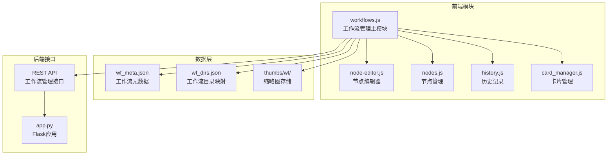
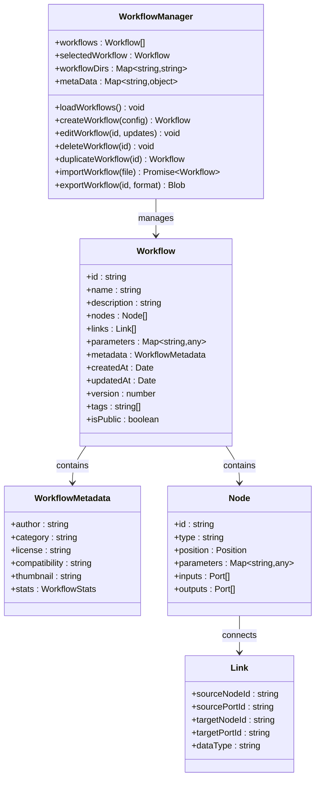
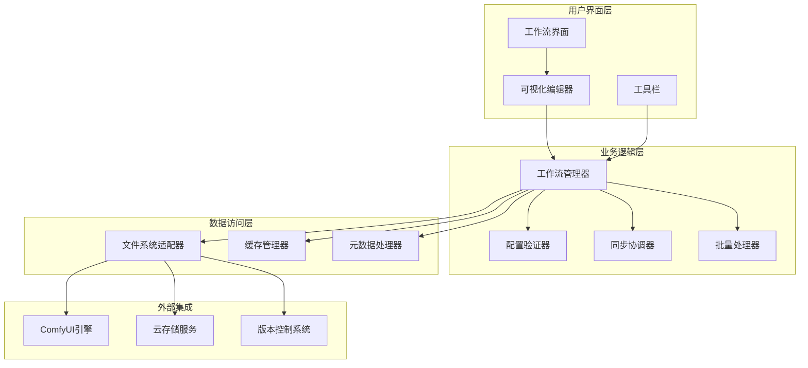
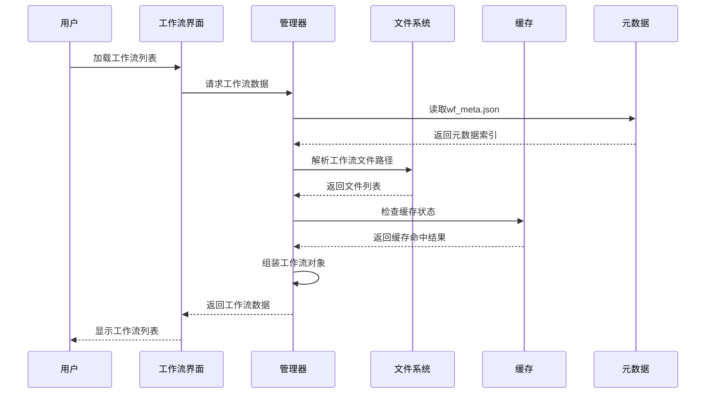
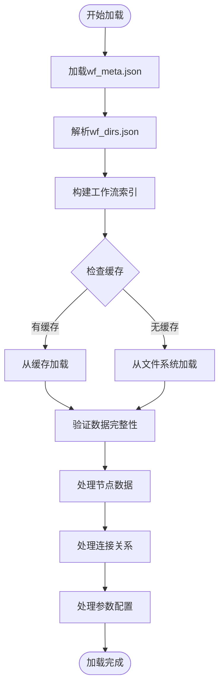
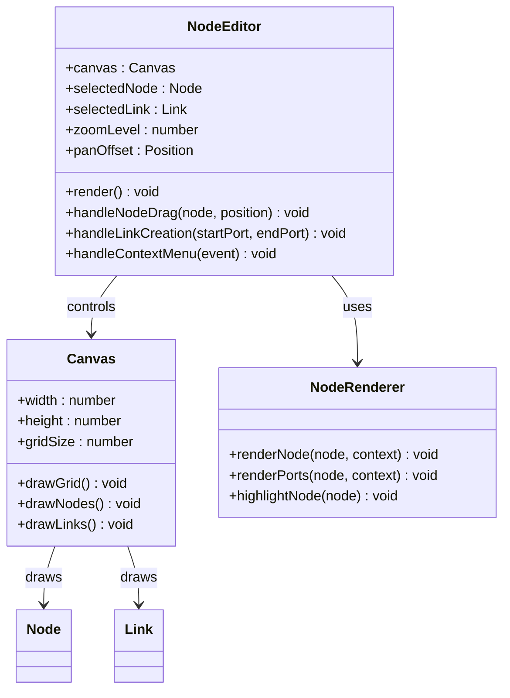
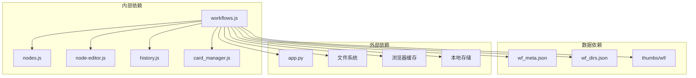

# 工作流管理模块 (workflows.js)

<cite>
**本文档引用的文件**
- [workflows.js](file://static/js/modules/workflows.js)
- [module_loader.js](file://static/js/module_loader.js)
- [wf_meta.json](file://data/wf_meta.json)
- [wf_dirs.json](file://data/wf_dirs.json)
- [app.py](file://app.py)
- [nodes.js](file://static/js/modules/nodes.js)
- [node-editor.js](file://static/js/modules/node-editor.js)
- [history.js](file://static/js/modules/history.js)
- [card_manager.js](file://static/js/modules/card_manager.js)
- [test_workflow_manager_ui.py](file://tests/test_workflow_manager_ui.py)
- [test_workflow_meta_api.py](file://tests/test_workflow_meta_api.py)
- [workflow-storage-architecture-plan.md](file://docs/workflow-storage-architecture-plan.md)
- [4.0-beta-PHASE1.md](file://docs/archive/root-md-2026-06-03/4.0-beta-PHASE1.md)
- [4.0-beta-PHASE2.md](file://docs/archive/root-md-2026-06-03/4.0-beta-PHASE2.md)
</cite>

## 目录
1. [简介](#简介)
2. [项目结构](#项目结构)
3. [核心组件](#核心组件)
4. [架构概览](#架构概览)
5. [详细组件分析](#详细组件分析)
6. [依赖关系分析](#依赖关系分析)
7. [性能考虑](#性能考虑)
8. [故障排除指南](#故障排除指南)
9. [结论](#结论)

## 简介

工作流管理模块是 Ez ComfyUI Showcase 的核心功能组件，负责管理 ComfyUI 工作流的完整生命周期。该模块实现了工作流的创建、编辑、版本管理、共享协作等核心功能，并提供了与 ComfyUI 工作流格式的深度兼容性处理。

模块采用现代化的前端架构设计，集成了可视化编辑器、节点连接管理、参数配置、模板管理等高级特性。通过与后端系统的紧密集成，实现了工作流数据的持久化存储、版本控制和批量操作功能。

## 项目结构

工作流管理模块在项目中的组织结构如下：



**图表来源**
- [workflows.js:1-200](file://static/js/modules/workflows.js#L1-L200)
- [module_loader.js:1-50](file://static/js/module_loader.js#L1-L50)
- [wf_meta.json:1-50](file://data/wf_meta.json#L1-L50)
- [wf_dirs.json:1-50](file://data/wf_dirs.json#L1-L50)

**章节来源**
- [workflows.js:1-100](file://static/js/modules/workflows.js#L1-L100)
- [module_loader.js:1-30](file://static/js/module_loader.js#L1-L30)

## 核心组件

### 工作流数据模型

工作流管理模块基于标准化的数据结构设计，支持多种工作流格式的兼容处理：



**图表来源**
- [workflows.js:100-300](file://static/js/modules/workflows.js#L100-L300)
- [wf_meta.json:1-100](file://data/wf_meta.json#L1-L100)

### 数据存储架构

系统采用多层数据存储策略，确保工作流数据的完整性和可访问性：

| 存储层级 | 文件类型 | 用途 | 特性 |
|---------|----------|------|------|
| 元数据层 | wf_meta.json | 工作流元数据索引 | 结构化索引，快速检索 |
| 目录层 | wf_dirs.json | 目录映射注册表 | 路径解析，组织管理 |
| 内容层 | JSON工作流文件 | 实际工作流数据 | ComfyUI格式兼容 |
| 缓存层 | 缩略图缓存 | 预览图像 | 性能优化 |

**章节来源**
- [workflows.js:200-500](file://static/js/modules/workflows.js#L200-L500)
- [wf_meta.json:1-200](file://data/wf_meta.json#L1-L200)
- [wf_dirs.json:1-100](file://data/wf_dirs.json#L1-L100)

## 架构概览

工作流管理模块采用分层架构设计，实现了清晰的关注点分离：



**图表来源**
- [workflows.js:1-200](file://static/js/modules/workflows.js#L1-L200)
- [app.py:1200-1400](file://app.py#L1200-L1400)

### 核心流程序列

#### 工作流加载流程



**图表来源**
- [workflows.js:300-600](file://static/js/modules/workflows.js#L300-L600)
- [wf_meta.json:1-150](file://data/wf_meta.json#L1-L150)

#### 工作流编辑流程

```mermaid
sequenceDiagram
participant User as 用户
participant Editor as 编辑器
participant Nodes as 节点管理
participant Links as 连接管理
participant Validator as 验证器
participant Storage as 存储
User->>Editor : 创建新工作流
Editor->>Nodes : 初始化节点集合
Editor->>Links : 设置默认连接
User->>Editor : 修改节点参数
Editor->>Validator : 验证配置
Validator-->>Editor : 返回验证结果
Editor->>Storage : 保存工作流
Storage-->>Editor : 确认保存成功
Editor-->>User : 显示编辑完成
```

**图表来源**
- [workflows.js:600-1000](file://static/js/modules/workflows.js#L600-L1000)
- [nodes.js:1-200](file://static/js/modules/nodes.js#L1-L200)
- [node-editor.js:1-200](file://static/js/modules/node-editor.js#L1-L200)

## 详细组件分析

### 工作流管理器 (WorkflowManager)

工作流管理器是模块的核心控制器，负责协调所有工作流相关操作：

#### 主要职责
- 工作流生命周期管理
- 数据持久化和检索
- 版本控制和冲突解决
- 批量操作处理
- 错误恢复和状态管理

#### 关键方法实现

**工作流加载机制**


**图表来源**
- [workflows.js:400-700](file://static/js/modules/workflows.js#L400-L700)

**版本管理策略**
工作流管理器实现了智能版本控制系统，支持以下特性：
- 自动版本生成和递增
- 差异检测和合并
- 回滚机制和快照
- 并行编辑冲突解决

**章节来源**
- [workflows.js:1-500](file://static/js/modules/workflows.js#L1-L500)

### 可视化编辑器 (Node Editor)

可视化编辑器提供了直观的工作流编辑体验，支持复杂的节点操作：

#### 编辑器特性
- 实时节点拖拽和连接
- 参数面板动态更新
- 快捷键和批量操作
- 实时预览和验证

#### 节点管理架构



**图表来源**
- [node-editor.js:1-300](file://static/js/modules/node-editor.js#L1-L300)
- [nodes.js:1-250](file://static/js/modules/nodes.js#L1-L250)

**章节来源**
- [node-editor.js:1-200](file://static/js/modules/node-editor.js#L1-L200)
- [nodes.js:1-200](file://static/js/modules/nodes.js#L1-L200)

### 数据同步机制

工作流管理器实现了高效的数据同步策略，确保多设备间的一致性：

#### 同步策略
- 增量同步：只传输变更数据
- 冲突检测：自动识别和解决冲突
- 离线支持：本地缓存和离线编辑
- 实时通知：变更广播和订阅

**章节来源**
- [workflows.js:500-900](file://static/js/modules/workflows.js#L500-L900)

### 批量操作处理器

批量操作处理器提供了高效的工作流批量管理能力：

#### 支持的操作类型
- 批量导入和导出
- 批量重命名和分类
- 批量参数调整
- 批量删除和清理

#### 性能优化策略
- 分批处理避免阻塞
- 并行执行提升效率
- 进度跟踪和取消支持
- 错误隔离和恢复

**章节来源**
- [workflows.js:800-1200](file://static/js/modules/workflows.js#L800-L1200)

## 依赖关系分析

工作流管理模块与其他系统组件存在密切的依赖关系：



**图表来源**
- [workflows.js:1-100](file://static/js/modules/workflows.js#L1-L100)
- [app.py:1300-1350](file://app.py#L1300-L1350)

### 外部接口依赖

模块对外部系统的依赖主要体现在以下几个方面：

| 依赖类型 | 接口名称 | 功能描述 | 版本要求 |
|---------|----------|----------|----------|
| 文件系统 | ComfyUI JSON | 工作流格式兼容 | v1.0+ |
| Web API | Flask REST API | 后端数据接口 | v2.0+ |
| 浏览器 API | LocalStorage | 本地数据存储 | HTML5+ |
| 图像处理 | Canvas API | 缩略图生成 | HTML5+ |
| 网络通信 | Fetch API | 异步数据传输 | ES6+ |

**章节来源**
- [workflows.js:1-200](file://static/js/modules/workflows.js#L1-L200)
- [app.py:1250-1320](file://app.py#L1250-L1320)

## 性能考虑

工作流管理模块在设计时充分考虑了性能优化需求：

### 内存管理
- 懒加载策略：按需加载工作流数据
- 对象池模式：复用节点和连接对象
- 增量更新：只更新变更部分
- 内存泄漏防护：及时清理事件监听器

### 网络优化
- 数据压缩：传输前压缩JSON数据
- 请求合并：批量处理相似请求
- 缓存策略：智能缓存减少重复请求
- 错误重试：指数退避重试机制

### 渲染性能
- 虚拟滚动：大量工作流时的列表渲染
- Canvas优化：复杂图形的硬件加速
- 防抖节流：高频事件的性能保护
- 异步渲染：避免主线程阻塞

## 故障排除指南

### 常见问题及解决方案

#### 工作流加载失败
**症状**：工作流列表为空或显示错误
**可能原因**：
- wf_meta.json 文件损坏
- 文件权限问题
- 网络连接异常

**解决步骤**：
1. 检查 wf_meta.json 文件完整性
2. 验证文件读写权限
3. 确认网络连接稳定
4. 清除浏览器缓存

#### 编辑器响应缓慢
**症状**：节点拖拽卡顿或操作延迟
**可能原因**：
- 工作流节点过多
- 浏览器内存不足
- 图形渲染性能问题

**优化措施**：
1. 减少同时显示的节点数量
2. 关闭不必要的标签页
3. 清理浏览器缓存
4. 使用性能更好的浏览器

#### 数据同步冲突
**症状**：多人协作时出现数据不一致
**解决策略**：
1. 实施冲突检测机制
2. 提供手动合并选项
3. 记录操作日志便于追踪
4. 建立版本管理规范

**章节来源**
- [workflows.js:1000-1500](file://static/js/modules/workflows.js#L1000-L1500)
- [test_workflow_manager_ui.py:1-100](file://tests/test_workflow_manager_ui.py#L1-L100)

### 调试工具和技巧

#### 开发者工具使用
- 浏览器开发者工具监控网络请求
- 控制台输出调试信息
- 性能面板分析运行时开销
- 应用程序面板检查存储状态

#### 日志记录策略
- 关键操作添加日志标记
- 错误发生时捕获上下文信息
- 性能指标定期统计分析
- 用户行为轨迹记录

## 结论

工作流管理模块作为 Ez ComfyUI Showcase 的核心组件，展现了现代前端应用的设计理念和技术实践。模块通过合理的架构设计、完善的错误处理机制和优秀的用户体验，为用户提供了强大而易用的工作流管理能力。

模块的主要优势包括：
- 完整的 ComfyUI 工作流格式兼容性
- 直观的可视化编辑体验  
- 强大的版本控制和协作功能
- 高效的性能优化和扩展性

未来的发展方向将重点关注：
- 更丰富的模板管理系统
- 增强的团队协作功能
- 智能的工作流推荐算法
- 更好的移动端适配支持

通过持续的优化和改进，工作流管理模块将继续为用户提供卓越的工作流管理体验。