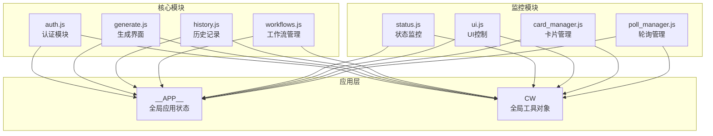
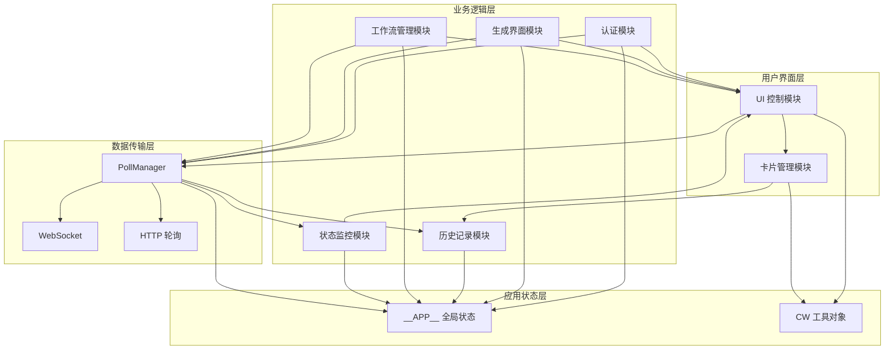
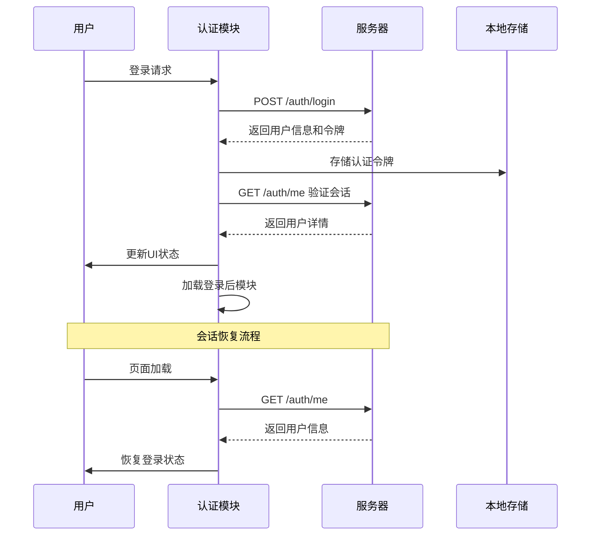
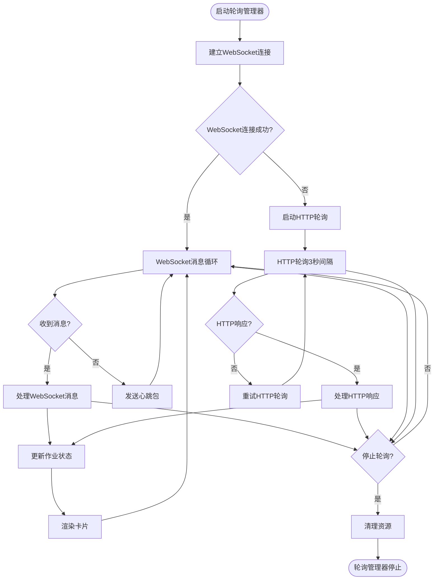
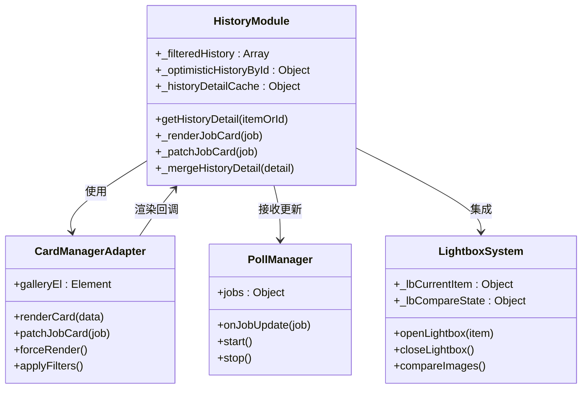
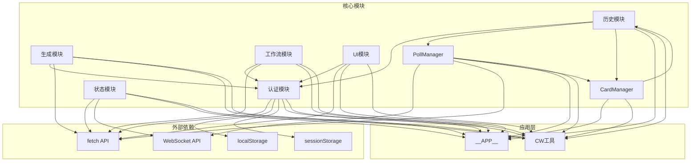

# 核心前端模块

<cite>
**本文档引用的文件**
- [auth.js](file://static/js/modules/auth.js)
- [generate.js](file://static/js/modules/generate.js)
- [history.js](file://static/js/modules/history.js)
- [workflows.js](file://static/js/modules/workflows.js)
- [status.js](file://static/js/modules/status.js)
- [ui.js](file://static/js/modules/ui.js)
- [card_manager.js](file://static/js/modules/card_manager.js)
- [poll_manager.js](file://static/js/modules/poll_manager.js)
</cite>

## 目录
1. [简介](#简介)
2. [项目结构](#项目结构)
3. [核心组件](#核心组件)
4. [架构概览](#架构概览)
5. [详细组件分析](#详细组件分析)
6. [依赖关系分析](#依赖关系分析)
7. [性能考虑](#性能考虑)
8. [故障排除指南](#故障排除指南)
9. [结论](#结论)

## 简介

Ez ComfyUI Showcase 是一个基于 Web 的 ComfyUI 图像生成平台，提供了完整的前端模块化架构。本文档深入分析了八个核心前端模块的设计与实现，包括认证模块、生成界面、历史记录管理、工作流管理、状态监控、UI 控制、卡片管理和轮询管理。

该系统采用模块化设计，通过统一的状态管理和事件驱动机制实现了高效的前后端数据同步。所有模块都遵循相同的命名约定和接口规范，确保了系统的可维护性和扩展性。

## 项目结构

系统采用模块化架构，主要文件组织如下：

**图表来源**
- [auth.js:1-50](file://static/js/modules/auth.js#L1-L50)
- [generate.js:1-50](file://static/js/modules/generate.js#L1-L50)
- [history.js:1-50](file://static/js/modules/history.js#L1-L50)
- [workflows.js:1-50](file://static/js/modules/workflows.js#L1-L50)
- [status.js:1-50](file://static/js/modules/status.js#L1-L50)
- [ui.js:1-50](file://static/js/modules/ui.js#L1-L50)
- [card_manager.js:1-50](file://static/js/modules/card_manager.js#L1-L50)
- [poll_manager.js:1-50](file://static/js/modules/poll_manager.js#L1-L50)

**章节来源**
- [auth.js:1-100](file://static/js/modules/auth.js#L1-L100)
- [generate.js:1-100](file://static/js/modules/generate.js#L1-L100)
- [history.js:1-100](file://static/js/modules/history.js#L1-L100)
- [workflows.js:1-100](file://static/js/modules/workflows.js#L1-L100)
- [status.js:1-100](file://static/js/modules/status.js#L1-L100)
- [ui.js:1-100](file://static/js/modules/ui.js#L1-L100)
- [card_manager.js:1-50](file://static/js/modules/card_manager.js#L1-L50)
- [poll_manager.js:1-100](file://static/js/modules/poll_manager.js#L1-L100)

## 核心组件

### 认证模块 (auth.js)

认证模块负责用户身份验证、权限管理和会话状态维护。它提供了完整的用户认证流程，包括登录、注册、注销和会话恢复功能。

**核心功能特性：**
- 用户身份验证和权限管理
- 会话状态持久化和自动恢复
- CSRF 令牌安全机制
- 用户界面动态更新
- 系统设置管理（管理员）

**关键接口：**
- `login(username, password)` - 用户登录
- `register(username, password)` - 用户注册
- `logout()` - 用户登出
- `restoreSession()` - 会话恢复
- `apiFetch(url, opts)` - 带认证的 API 请求

**章节来源**
- [auth.js:279-373](file://static/js/modules/auth.js#L279-L373)
- [auth.js:375-410](file://static/js/modules/auth.js#L375-L410)
- [auth.js:412-491](file://static/js/modules/auth.js#L412-L491)

### 生成界面模块 (generate.js)

生成界面模块负责图像生成的交互控制和参数管理。它提供了智能的尺寸限制、风格预设和提示词优化功能。

**核心功能特性：**
- 智能尺寸限制和比例计算
- 风格预设系统
- 提示词翻译缓存
- 视频工作流支持
- 参数验证和优化

**关键接口：**
- `_workflowSizeLimits(fields)` - 工作流尺寸限制
- `_stylePresetOptionsHtml()` - 风格预设选项
- `_promptWithStylePreset(prompt, styleInfo)` - 应用风格预设
- `_promptOptimizeMode(fields)` - 提示词优化模式

**章节来源**
- [generate.js:330-350](file://static/js/modules/generate.js#L330-L350)
- [generate.js:274-329](file://static/js/modules/generate.js#L274-L329)
- [generate.js:518-529](file://static/js/modules/generate.js#L518-L529)

### 历史记录模块 (history.js)

历史记录模块管理用户的生成历史、图片预览和批量操作。它提供了高效的数据缓存和智能的懒加载机制。

**核心功能特性：**
- 历史记录分页加载
- 图片预览和缩略图
- 批量操作支持
- 数据缓存和清理
- 轻量盒（Lightbox）集成

**关键接口：**
- `getHistoryDetail(itemOrId)` - 获取历史详情
- `_renderJobCard(job)` - 渲染作业卡片
- `_patchJobCard(job)` - 就地更新卡片
- `_mergeHistoryDetail(detail)` - 合并历史详情

**章节来源**
- [history.js:236-255](file://static/js/modules/history.js#L236-L255)
- [history.js:514-588](file://static/js/modules/history.js#L514-L588)
- [history.js:591-655](file://static/js/modules/history.js#L591-L655)

### 工作流管理模块 (workflows.js)

工作流管理模块负责工作流的浏览、编辑和版本控制。它提供了直观的工作流管理界面和强大的元数据编辑功能。

**核心功能特性：**
- 工作流网格视图
- 元数据编辑和标签管理
- 缩略图上传和预览
- 版本控制和上传
- 共享状态管理

**关键接口：**
- `openWfEdit(fname)` - 打开工作流编辑器
- `saveWfEdit()` - 保存工作流元数据
- `downloadWf(fname)` - 下载工作流
- `toggleWfShare(fname, shared)` - 切换共享状态

**章节来源**
- [workflows.js:305-364](file://static/js/modules/workflows.js#L305-L364)
- [workflows.js:213-239](file://static/js/modules/workflows.js#L213-L239)
- [workflows.js:165-175](file://static/js/modules/workflows.js#L165-L175)

### 状态监控模块 (status.js)

状态监控模块提供实时的服务状态显示和 GPU 资源监控。它通过 WebSocket 和 HTTP 轮询实现双通道数据同步。

**核心功能特性：**
- 实时服务状态监控
- GPU 资源使用情况
- 多实例状态管理
- 进度条和队列显示
- 弹窗管理界面

**关键接口：**
- `pollStatus()` - 轮询状态更新
- `updateServices(d)` - 更新服务状态
- `updateGPU(g, instances)` - 更新 GPU 信息
- `openInstPopup(mode)` - 打开实例弹窗

**章节来源**
- [status.js:330-343](file://static/js/modules/status.js#L330-L343)
- [status.js:345-387](file://static/js/modules/status.js#L345-L387)
- [status.js:389-427](file://static/js/modules/status.js#L389-L427)

### UI 控制模块 (ui.js)

UI 控制模块提供通用的用户界面功能和交互控制。它包含了多种实用的 UI 组件和工具函数。

**核心功能特性：**
- 提示词优化和翻译
- 消息提示系统
- 拖拽调整布局
- 批量操作工具
- 响应式设计支持

**关键接口：**
- `showToast(message, type)` - 显示消息提示
- `initResizeHandle()` - 初始化调整手柄
- `clearPrompt()` - 清空提示词
- `wfUploadOverlay(files)` - 工作流上传覆盖层

**章节来源**
- [ui.js:617-665](file://static/js/modules/ui.js#L617-L665)
- [ui.js:21-56](file://static/js/modules/ui.js#L21-L56)
- [ui.js:58-62](file://static/js/modules/ui.js#L58-L62)

### 卡片管理模块 (card_manager.js)

卡片管理模块是一个轻量级的适配器，用于协调历史记录模块和轮询管理模块之间的卡片渲染。

**核心功能特性：**
- 作业卡片渲染适配
- 就地卡片更新
- 历史记录过滤
- 动态内容刷新

**关键接口：**
- `renderCard(data)` - 渲染卡片
- `patchJobCard(job)` - 更新作业卡片
- `forceRender()` - 强制重新渲染
- `applyFilters()` - 应用过滤器

**章节来源**
- [card_manager.js:15-42](file://static/js/modules/card_manager.js#L15-L42)
- [card_manager.js:44-78](file://static/js/modules/card_manager.js#L44-L78)

### 轮询管理模块 (poll_manager.js)

轮询管理模块实现了 WebSocket 优先的实时数据同步机制，提供 HTTP 轮询作为后备方案。

**核心功能特性：**
- WebSocket 连接管理
- HTTP 轮询后备机制
- 实时作业状态更新
- 心跳保持和重连
- 性能优化的增量更新

**关键接口：**
- `start()` - 启动轮询管理器
- `stop()` - 停止轮询管理器
- `onJobUpdate(job)` - 处理作业更新
- `reconnect()` - 重新连接

**章节来源**
- [poll_manager.js:41-58](file://static/js/modules/poll_manager.js#L41-L58)
- [poll_manager.js:235-307](file://static/js/modules/poll_manager.js#L235-L307)
- [poll_manager.js:312-435](file://static/js/modules/poll_manager.js#L312-L435)

## 架构概览

系统采用分层架构设计，各模块之间通过统一的事件驱动机制进行通信：

**图表来源**
- [poll_manager.js:16-58](file://static/js/modules/poll_manager.js#L16-L58)
- [auth.js:4-10](file://static/js/modules/auth.js#L4-L10)
- [ui.js:6-9](file://static/js/modules/ui.js#L6-L9)

**章节来源**
- [poll_manager.js:16-58](file://static/js/modules/poll_manager.js#L16-L58)
- [auth.js:4-10](file://static/js/modules/auth.js#L4-L10)
- [ui.js:6-9](file://static/js/modules/ui.js#L6-L9)

## 详细组件分析

### 认证模块深度分析

认证模块实现了完整的用户身份验证生命周期管理：

**图表来源**
- [auth.js:297-313](file://static/js/modules/auth.js#L297-L313)
- [auth.js:338-373](file://static/js/modules/auth.js#L338-L373)

**章节来源**
- [auth.js:279-373](file://static/js/modules/auth.js#L279-L373)
- [auth.js:375-410](file://static/js/modules/auth.js#L375-L410)

### 轮询管理器工作流程

轮询管理器实现了复杂的实时数据同步机制：

**图表来源**
- [poll_manager.js:41-58](file://static/js/modules/poll_manager.js#L41-L58)
- [poll_manager.js:161-218](file://static/js/modules/poll_manager.js#L161-L218)
- [poll_manager.js:312-435](file://static/js/modules/poll_manager.js#L312-L435)

**章节来源**
- [poll_manager.js:41-97](file://static/js/modules/poll_manager.js#L41-L97)
- [poll_manager.js:161-218](file://static/js/modules/poll_manager.js#L161-L218)
- [poll_manager.js:312-435](file://static/js/modules/poll_manager.js#L312-L435)

### 历史记录渲染优化

历史记录模块采用了高效的渲染优化策略：

**图表来源**
- [history.js:514-588](file://static/js/modules/history.js#L514-L588)
- [card_manager.js:15-42](file://static/js/modules/card_manager.js#L15-L42)
- [poll_manager.js:235-307](file://static/js/modules/poll_manager.js#L235-L307)

**章节来源**
- [history.js:514-588](file://static/js/modules/history.js#L514-L588)
- [card_manager.js:15-42](file://static/js/modules/card_manager.js#L15-L42)
- [poll_manager.js:235-307](file://static/js/modules/poll_manager.js#L235-L307)

## 依赖关系分析

模块间依赖关系呈现清晰的单向依赖结构：

**图表来源**
- [auth.js:179-185](file://static/js/modules/auth.js#L179-L185)
- [poll_manager.js:166-174](file://static/js/modules/poll_manager.js#L166-L174)
- [generate.js:521-529](file://static/js/modules/generate.js#L521-L529)

**章节来源**
- [auth.js:179-185](file://static/js/modules/auth.js#L179-L185)
- [poll_manager.js:166-174](file://static/js/modules/poll_manager.js#L166-L174)
- [generate.js:521-529](file://static/js/modules/generate.js#L521-L529)

## 性能考虑

系统在多个层面实现了性能优化：

### 内存管理
- **历史记录缓存**：使用 LRU 缓存策略管理历史详情
- **提示词翻译缓存**：限制缓存大小避免内存泄漏
- **卡片就地更新**：避免全量重新渲染

### 网络优化
- **WebSocket 优先**：实时数据传输减少延迟
- **HTTP 轮询后备**：确保网络异常时的可靠性
- **增量更新**：只更新变化的数据项

### 渲染优化
- **虚拟滚动**：无限滚动配合哨兵元素
- **懒加载**：图片和缩略图的延迟加载
- **防抖节流**：输入事件的性能优化

## 故障排除指南

### 常见问题及解决方案

**认证相关问题：**
- **会话过期**：检查 `restoreSession()` 方法的实现
- **CSRF 错误**：确认 `_attachCsrfHeader()` 函数正确附加令牌
- **登录失败**：查看 `_mapAuthError()` 的错误映射

**实时数据同步问题：**
- **WebSocket 断开**：检查 `_connectWS()` 的重连逻辑
- **轮询失效**：验证 `_doHTTPPoll()` 的执行状态
- **数据不同步**：确认 `onJobUpdate()` 的处理流程

**性能问题：**
- **页面卡顿**：检查 `_tickTimers()` 的执行频率
- **内存泄漏**：验证缓存清理机制
- **渲染延迟**：优化 `forceGalleryRerender()` 的调用

**章节来源**
- [auth.js:192-203](file://static/js/modules/auth.js#L192-L203)
- [poll_manager.js:161-218](file://static/js/modules/poll_manager.js#L161-L218)
- [poll_manager.js:467-491](file://static/js/modules/poll_manager.js#L467-L491)

## 结论

Ez ComfyUI Showcase 的核心前端模块展现了优秀的软件工程实践。通过模块化设计、事件驱动架构和性能优化策略，系统实现了高效、可靠且易于维护的图像生成平台。

各模块职责明确，接口规范统一，通过统一的应用状态管理和事件机制实现了良好的模块间协作。WebSocket 优先的实时数据同步机制确保了用户体验的流畅性，而 HTTP 轮询作为后备方案保证了系统的可靠性。

该架构为后续的功能扩展和性能优化奠定了坚实的基础，是现代 Web 应用开发的优秀范例。