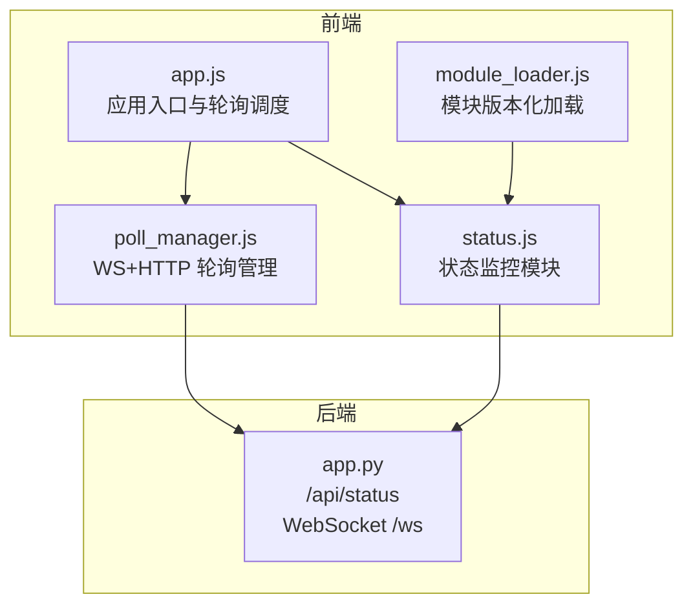
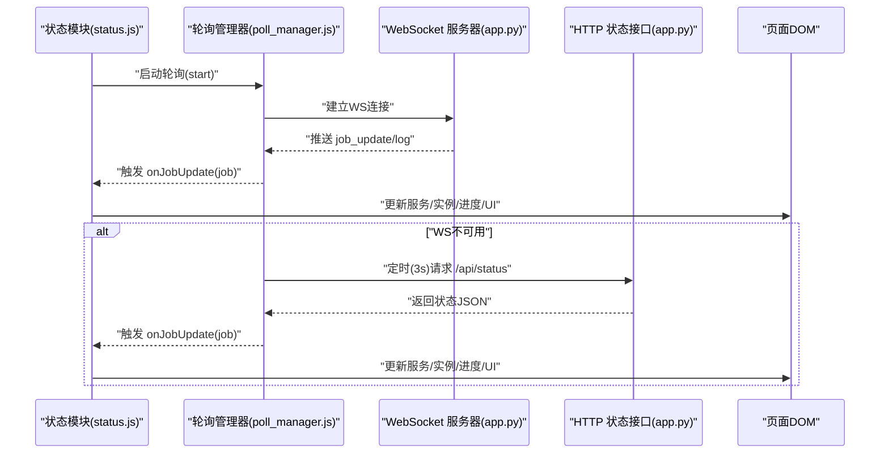
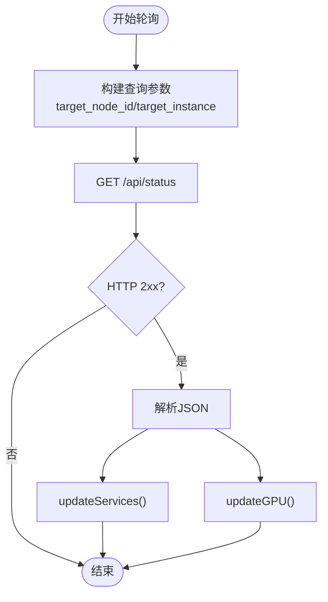
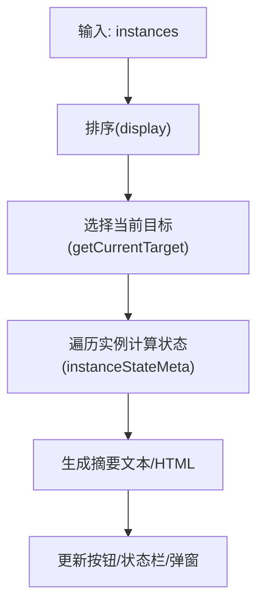
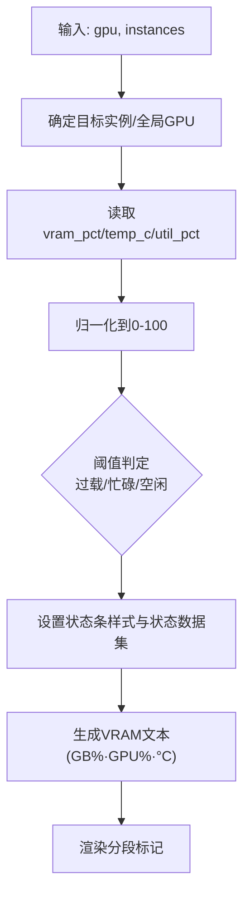
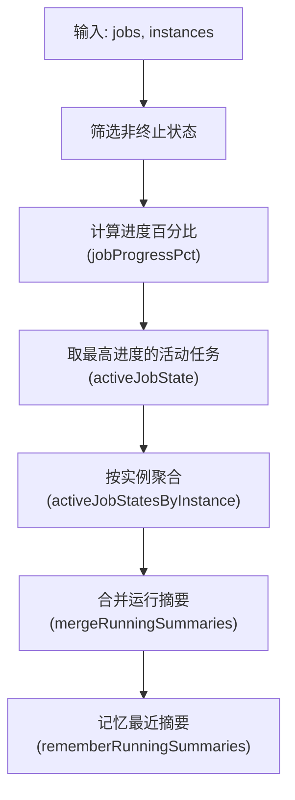
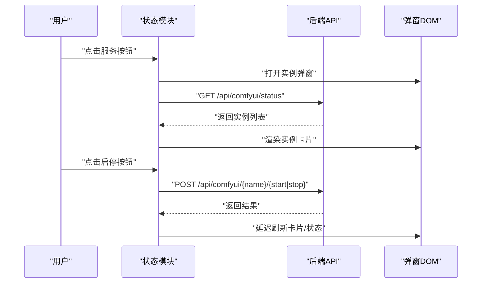
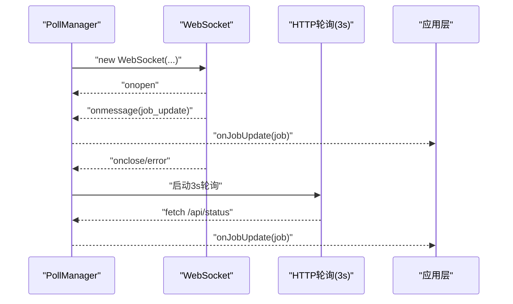
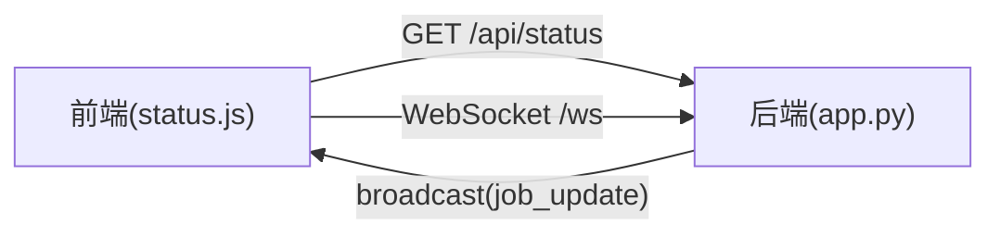
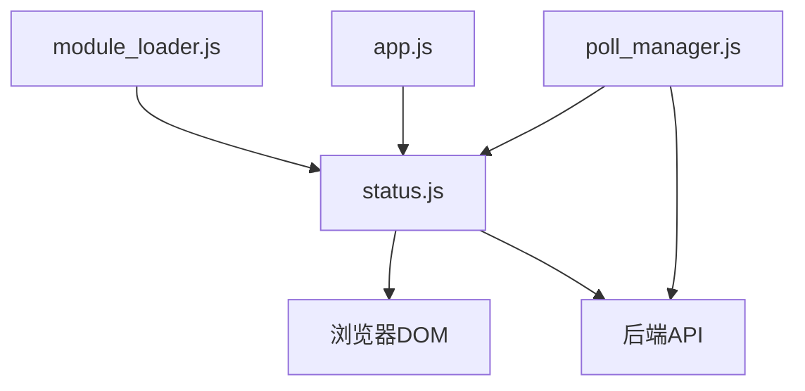

# 状态监控模块 (status.js)

<cite>
**本文档引用的文件**
- [status.js](file://static/js/modules/status.js)
- [poll_manager.js](file://static/js/modules/poll_manager.js)
- [app.js](file://static/js/app.js)
- [module_loader.js](file://static/js/module_loader.js)
- [app.py](file://app.py)
- [test_status_button_runtime.py](file://tests/test_status_button_runtime.py)
- [test_status_gpu_message.py](file://tests/test_status_gpu_message.py)
</cite>

## 目录
1. [简介](#简介)
2. [项目结构](#项目结构)
3. [核心组件](#核心组件)
4. [架构总览](#架构总览)
5. [详细组件分析](#详细组件分析)
6. [依赖关系分析](#依赖关系分析)
7. [性能考虑](#性能考虑)
8. [故障排除指南](#故障排除指南)
9. [结论](#结论)

## 简介
本文件为 Ez ComfyUI Showcase 的状态监控模块（status.js）提供深入的技术文档，重点覆盖以下方面：
- 实时状态监控的实现机制：包括 GPU 使用情况、实例健康状态、任务进度跟踪等
- WebSocket 连接管理与 HTTP 轮询的协同策略
- 状态数据的接收与处理流程、UI 实时更新与图表展示
- 状态数据的缓存策略、更新频率控制、异常处理与性能优化
- 与后端实时通信协议、数据格式转换、用户界面响应的实现方案

该模块通过周期性轮询后端状态接口，结合 WebSocket 推送与回退轮询，实现对 ComfyUI 实例队列、GPU 资源占用、任务进度等信息的统一展示与交互。

## 项目结构
状态监控模块位于前端静态资源目录下，与应用入口、轮询管理器、模块加载器共同构成完整的前端状态体系；后端提供状态 API 与 WebSocket 广播服务。

**图示来源**
- [app.js:147-158](file://static/js/app.js#L147-L158)
- [status.js:330-343](file://static/js/modules/status.js#L330-L343)
- [poll_manager.js:16-95](file://static/js/modules/poll_manager.js#L16-L95)
- [module_loader.js](file://static/js/module_loader.js#L16)
- [app.py:6334-6340](file://app.py#L6334-L6340)

**章节来源**
- [status.js:1-659](file://static/js/modules/status.js#L1-L659)
- [poll_manager.js:1-209](file://static/js/modules/poll_manager.js#L1-L209)
- [app.js:147-158](file://static/js/app.js#L147-L158)
- [module_loader.js](file://static/js/module_loader.js#L16)
- [app.py:6334-6340](file://app.py#L6334-L6340)

## 核心组件
- 状态轮询函数：根据当前活动任务或目标实例动态构造查询参数，拉取后端状态并更新 UI
- 服务实例状态更新：解析实例列表，计算运行/排队/空闲状态，生成汇总文本与 HTML
- GPU 状态更新：渲染 VRAM 使用率、温度、利用率，设置状态条颜色与提示文本
- 弹窗与交互：实例卡片弹窗、GPU 进程卡片弹窗、实例启停操作、GPU 进程终止
- 事件绑定：服务按钮点击打开实例选择弹窗
- 数据合并与记忆：合并实例基础进度与活动任务进度，记忆最近一次运行摘要

**章节来源**
- [status.js:330-343](file://static/js/modules/status.js#L330-L343)
- [status.js:345-387](file://static/js/modules/status.js#L345-L387)
- [status.js:389-427](file://static/js/modules/status.js#L389-L427)
- [status.js:429-641](file://static/js/modules/status.js#L429-L641)
- [status.js:643-658](file://static/js/modules/status.js#L643-L658)

## 架构总览
前端采用“WS 优先 + HTTP 轮询兜底”的混合架构：
- WebSocket：由 PollManager 统一管理连接、消息解析与重连
- HTTP 轮询：在 WS 不可用时以固定间隔回退拉取状态
- 状态模块：负责 UI 更新、数据聚合与交互

**图示来源**
- [poll_manager.js:41-58](file://static/js/modules/poll_manager.js#L41-L58)
- [poll_manager.js:183-198](file://static/js/modules/poll_manager.js#L183-L198)
- [app.py:6334-6340](file://app.py#L6334-L6340)

## 详细组件分析

### 状态轮询与数据拉取
- 动态查询参数：优先使用当前活动任务的目标节点与实例，否则回退到全局目标
- 请求路径：/api/status，支持查询参数 target_node_id 与 target_instance
- 成功后分别调用 updateServices 与 updateGPU 更新 UI

**图示来源**
- [status.js:330-343](file://static/js/modules/status.js#L330-L343)

**章节来源**
- [status.js:330-343](file://static/js/modules/status.js#L330-L343)

### 服务实例状态更新
- 实例排序：按节点与名称进行稳定排序，确保显示一致性
- 当前目标选择：优先使用上次选中的实例，否则选择首个实例
- 状态计算：依据 up、queue_running、queue_pending、progress 等字段综合判断
- 汇总文本与 HTML：生成多实例状态摘要，支持富文本高亮

**图示来源**
- [status.js:63-81](file://static/js/modules/status.js#L63-L81)
- [status.js:19-33](file://static/js/modules/status.js#L19-L33)
- [status.js:232-262](file://static/js/modules/status.js#L232-L262)
- [status.js:264-280](file://static/js/modules/status.js#L264-L280)

**章节来源**
- [status.js:63-81](file://static/js/modules/status.js#L63-L81)
- [status.js:19-33](file://static/js/modules/status.js#L19-L33)
- [status.js:232-262](file://static/js/modules/status.js#L232-L262)
- [status.js:264-280](file://static/js/modules/status.js#L264-L280)

### GPU 状态更新与 UI 展示
- 目标选择：优先使用当前活动任务对应实例的 GPU，否则回退到全局 GPU
- 数值处理：VRAM 百分比、温度、利用率规范化到 0-100 区间
- 颜色分级：空闲/忙碌/过载三档，过载优先保留以避免低占用误判
- 文本提示：在不同屏幕宽度下切换紧凑/完整显示模式
- 分段标记：在状态条上绘制 25%/50%/75% 参考线

**图示来源**
- [status.js:389-427](file://static/js/modules/status.js#L389-L427)

**章节来源**
- [status.js:389-427](file://static/js/modules/status.js#L389-L427)

### 任务进度与运行摘要
- 活动任务状态：遍历作业，过滤终止状态，取进度最高的作为当前活动任务
- 运行摘要：合并实例基础进度与活动任务进度，记忆最近一次运行摘要
- 文本描述：多实例时拼接，单实例且未知远程任务时显示特殊文案

**图示来源**
- [status.js:83-115](file://static/js/modules/status.js#L83-L115)
- [status.js:117-139](file://static/js/modules/status.js#L117-L139)
- [status.js:203-221](file://static/js/modules/status.js#L203-L221)

**章节来源**
- [status.js:83-115](file://static/js/modules/status.js#L83-L115)
- [status.js:117-139](file://static/js/modules/status.js#L117-L139)
- [status.js:203-221](file://static/js/modules/status.js#L203-L221)

### 弹窗与交互
- 实例卡片弹窗：按节点分组展示实例状态、运行中/排队数量、当前工作流等
- GPU 进程弹窗：展示其他占用显存的进程及其内存占用，支持终止进程
- 实例启停：调用后端接口切换实例启停状态，并延时刷新卡片与状态

**图示来源**
- [status.js:429-558](file://static/js/modules/status.js#L429-L558)
- [status.js:605-620](file://static/js/modules/status.js#L605-L620)

**章节来源**
- [status.js:429-558](file://static/js/modules/status.js#L429-L558)
- [status.js:605-620](file://static/js/modules/status.js#L605-L620)

### WebSocket 连接管理与回退轮询
- WS 连接：由 PollManager 统一创建，监听 onopen/onmessage/onclose/onerror
- 消息类型：job_update 用于作业更新，log 用于日志推送
- 回退策略：WS 断开或不可用时，以 3 秒间隔发起 HTTP 轮询
- 计时器：1 秒步进的计时器用于实时计时显示

**图示来源**
- [poll_manager.js:166-209](file://static/js/modules/poll_manager.js#L166-L209)
- [poll_manager.js:41-58](file://static/js/modules/poll_manager.js#L41-L58)

**章节来源**
- [poll_manager.js:16-95](file://static/js/modules/poll_manager.js#L16-L95)
- [poll_manager.js:166-209](file://static/js/modules/poll_manager.js#L166-L209)

### 与后端的实时通信协议
- HTTP 接口：/api/status 支持查询参数 target_node_id 与 target_instance
- WebSocket：/ws，消息类型包括 job_update 与 log
- 后端广播：向所有有效客户端发送标准化数据包

**图示来源**
- [app.py:6334-6340](file://app.py#L6334-L6340)
- [poll_manager.js:166-174](file://static/js/modules/poll_manager.js#L166-L174)

**章节来源**
- [app.py:6334-6340](file://app.py#L6334-L6340)
- [poll_manager.js:166-174](file://static/js/modules/poll_manager.js#L166-L174)

## 依赖关系分析
- 模块耦合
  - status.js 依赖全局应用对象（jobs、API、当前目标等）
  - 与 poll_manager.js 协同，后者负责 WS 与 HTTP 轮询
  - 通过 module_loader.js 加载带版本号的脚本，保证缓存失效
- 外部依赖
  - 后端 API 提供状态数据与 WebSocket 广播
  - 浏览器 DOM 与 fetch API

**图示来源**
- [module_loader.js](file://static/js/module_loader.js#L16)
- [app.js:147-158](file://static/js/app.js#L147-L158)
- [status.js:643-658](file://static/js/modules/status.js#L643-L658)
- [poll_manager.js:41-58](file://static/js/modules/poll_manager.js#L41-L58)

**章节来源**
- [module_loader.js](file://static/js/module_loader.js#L16)
- [app.js:147-158](file://static/js/app.js#L147-L158)
- [status.js:643-658](file://static/js/modules/status.js#L643-L658)
- [poll_manager.js:41-58](file://static/js/modules/poll_manager.js#L41-L58)

## 性能考虑
- 更新频率控制
  - WS 推送优先，减少不必要的 HTTP 轮询
  - HTTP 轮询间隔为 3 秒，避免频繁请求
- 数据缓存与降级
  - 后端对 GPU 统计进行缓存与过期判定，失败时返回“缓存值”提示
  - 前端记忆最近一次运行摘要，避免闪烁
- UI 渲染优化
  - 批量更新 DOM，使用 dataset 传递状态，减少样式重排
  - 在小屏下简化 VRAM 文本，降低渲染负担
- 错误处理
  - 轮询与网络错误被吞并，避免影响主流程
  - GPU 文本对 SSH/网络错误进行安全裁剪，防止敏感信息泄露

**章节来源**
- [poll_manager.js:48-58](file://static/js/modules/poll_manager.js#L48-L58)
- [status.js:389-427](file://static/js/modules/status.js#L389-L427)
- [app.py:3498-3531](file://app.py#L3498-L3531)
- [status.js:282-288](file://static/js/modules/status.js#L282-L288)

## 故障排除指南
- 症状：VRAM 文本显示“暂不可用”
  - 可能原因：SSH/网络错误导致无法获取 GPU 详情
  - 处理：查看后端 GPU 查询返回的 detail 字段，确认具体错误类型
- 症状：状态条颜色不变化
  - 可能原因：数值未规范化或阈值未达到
  - 处理：检查 vram_pct/temp_c/util_pct 是否在合理范围
- 症状：实例弹窗为空
  - 可能原因：后端 /api/comfyui/status 返回空列表
  - 处理：确认实例配置与网络可达性
- 症状：WS 连接频繁断开
  - 可能原因：网络不稳定或服务端限制
  - 处理：查看 PollManager 的 onclose/onerror 日志，确认自动重连是否生效

**章节来源**
- [status.js:282-288](file://static/js/modules/status.js#L282-L288)
- [status.js:389-427](file://static/js/modules/status.js#L389-L427)
- [poll_manager.js:183-209](file://static/js/modules/poll_manager.js#L183-L209)
- [test_status_gpu_message.py:1-33](file://tests/test_status_gpu_message.py#L1-L33)

## 结论
状态监控模块通过“WS 优先 + HTTP 轮询兜底”的策略，在保证实时性的前提下兼顾稳定性；通过对实例状态、任务进度与 GPU 资源的统一聚合与可视化呈现，为用户提供清晰的状态反馈。配合后端的缓存与广播机制，系统在弱网与异常场景下仍能保持良好的用户体验。建议后续可引入更细粒度的增量更新与本地持久化策略，进一步提升性能与可靠性。