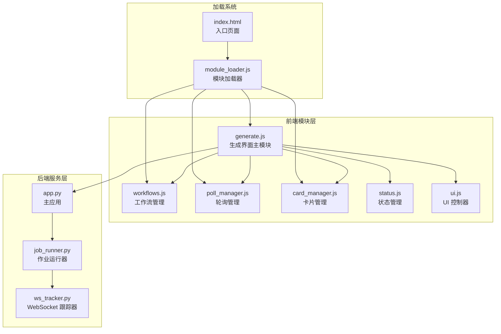
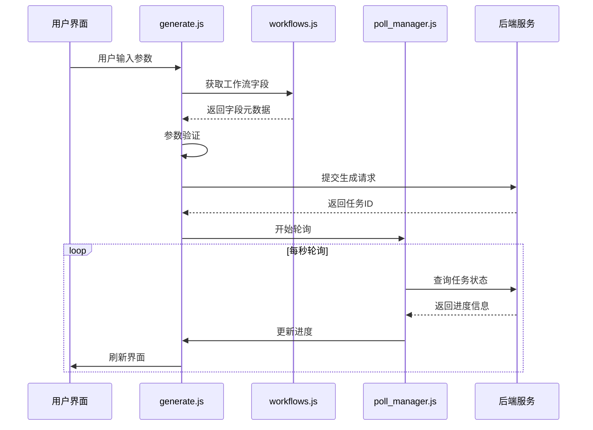
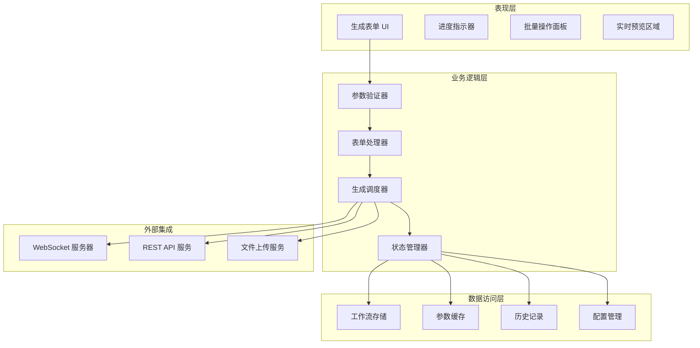
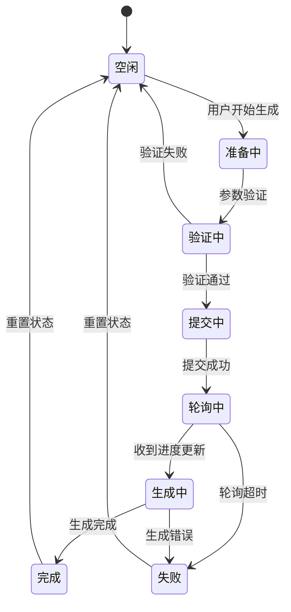
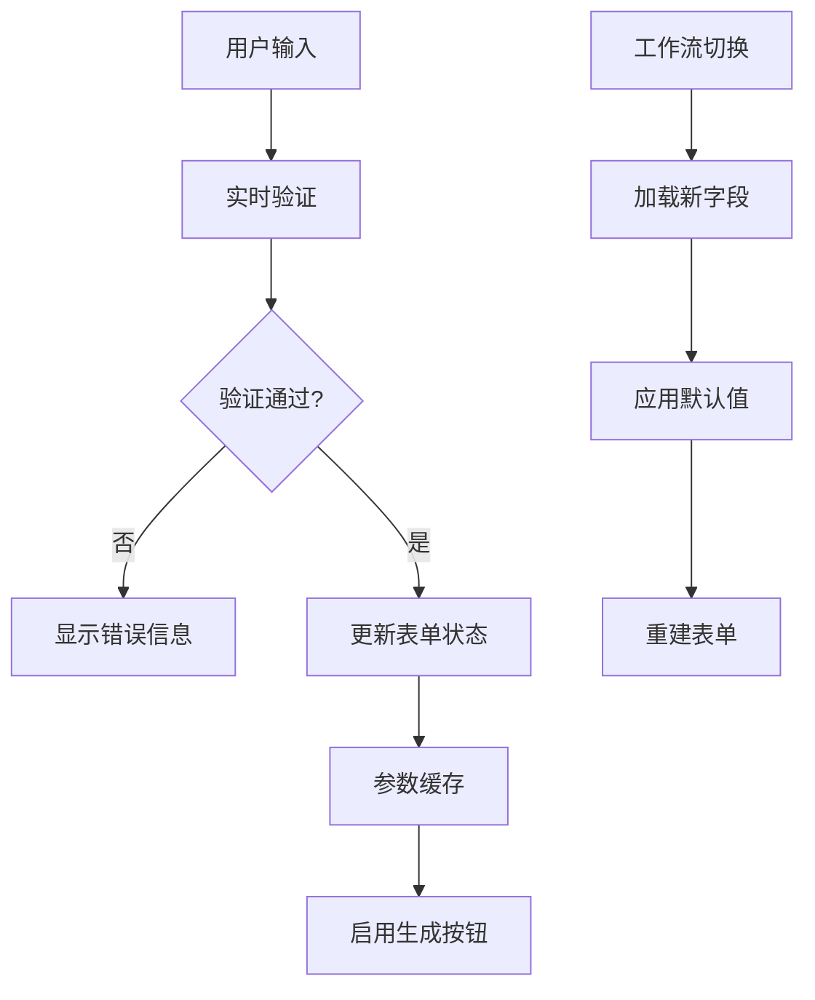
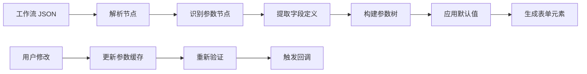
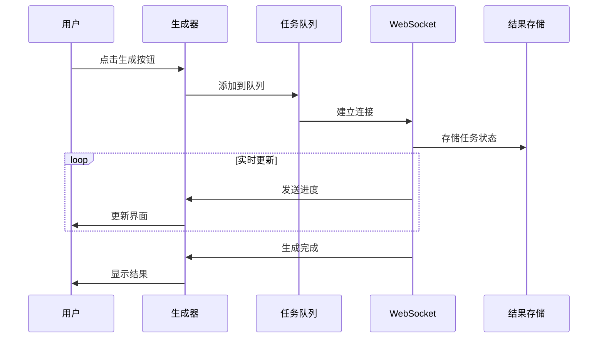
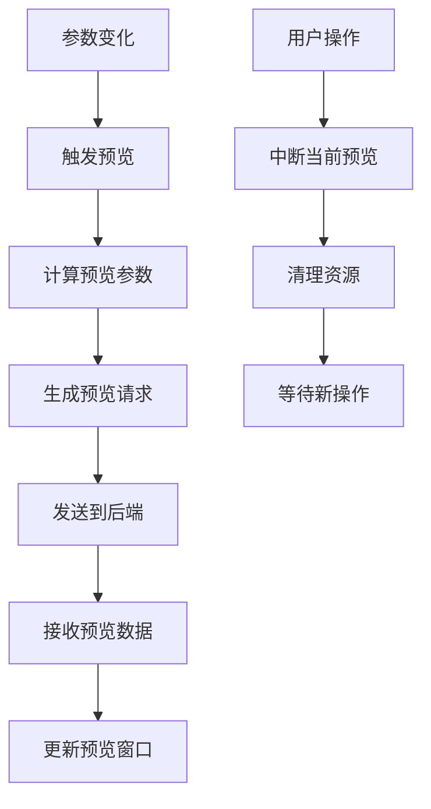
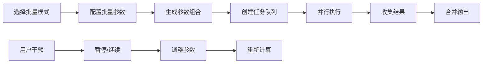
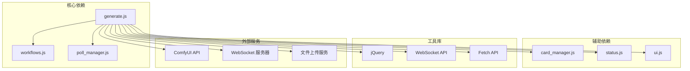

# 生成界面模块 (generate.js) 技术文档

<cite>
**本文档引用的文件**
- [generate.js](file://static/js/modules/generate.js)
- [workflows.js](file://static/js/modules/workflows.js)
- [poll_manager.js](file://static/js/modules/poll_manager.js)
- [card_manager.js](file://static/js/modules/card_manager.js)
- [module_loader.js](file://static/js/module_loader.js)
- [app.js](file://static/js/app.js)
- [index.html](file://static/index.html)
- [job_runner.py](file://modules/job_runner.py)
- [ws_tracker.py](file://modules/ws_tracker.py)
- [test_prompt_reuse_ui.py](file://tests/test_prompt_reuse_ui.py)
</cite>

## 目录
1. [简介](#简介)
2. [项目结构](#项目结构)
3. [核心组件](#核心组件)
4. [架构概览](#架构概览)
5. [详细组件分析](#详细组件分析)
6. [依赖关系分析](#依赖关系分析)
7. [性能考虑](#性能考虑)
8. [故障排除指南](#故障排除指南)
9. [结论](#结论)

## 简介

Ez ComfyUI Showcase 的生成界面模块是整个应用的核心交互组件，负责处理用户与 AI 图像生成系统的交互。该模块实现了完整的生成工作流，包括参数配置、实时预览、批量生成、进度监控等功能。通过现代化的前端架构设计，为用户提供了流畅、直观的图像生成体验。

该模块采用模块化设计，与工作流管理、轮询管理、卡片管理等多个子系统协同工作，形成了一个完整的生成生态系统。模块支持多种生成模式，从简单的文本到图像生成到复杂的图像到图像转换，并提供了强大的参数控制系统。

## 项目结构

生成界面模块在项目中的组织结构如下：

**图表来源**
- [module_loader.js:15-25](file://static/js/module_loader.js#L15-L25)
- [generate.js:1-50](file://static/js/modules/generate.js#L1-L50)

**章节来源**
- [module_loader.js:15-25](file://static/js/module_loader.js#L15-L25)
- [generate.js:1-100](file://static/js/modules/generate.js#L1-L100)

## 核心组件

生成界面模块由多个相互协作的核心组件构成，每个组件都有明确的职责分工：

### 主要组件职责

| 组件 | 职责 | 关键功能 |
|------|------|----------|
| generate.js | 生成界面主控制器 | 表单管理、参数验证、生成提交、进度监控 |
| workflows.js | 工作流管理系统 | 工作流加载、参数提取、字段缓存 |
| poll_manager.js | 轮询管理器 | 任务状态轮询、超时处理、重试机制 |
| card_manager.js | 卡片管理器 | 生成卡片渲染、状态更新、交互控制 |

### 数据流架构

**图表来源**
- [generate.js:200-350](file://static/js/modules/generate.js#L200-L350)
- [poll_manager.js:1-80](file://static/js/modules/poll_manager.js#L1-L80)

**章节来源**
- [generate.js:100-250](file://static/js/modules/generate.js#L100-L250)
- [workflows.js:1-120](file://static/js/modules/workflows.js#L1-L120)

## 架构概览

生成界面模块采用了分层架构设计，确保了良好的可维护性和扩展性：

**图表来源**
- [generate.js:1-200](file://static/js/modules/generate.js#L1-L200)
- [workflows.js:1-80](file://static/js/modules/workflows.js#L1-L80)

### 状态管理模式

模块实现了完整的状态管理模式，支持多种生成状态的切换：

**图表来源**
- [generate.js:300-500](file://static/js/modules/generate.js#L300-L500)

## 详细组件分析

### 生成表单管理器

生成表单管理器是模块的核心组件，负责处理所有用户交互和表单逻辑：

#### 表单数据绑定机制

**图表来源**
- [generate.js:150-300](file://static/js/modules/generate.js#L150-L300)

#### 参数验证系统

参数验证系统实现了多层次的验证机制：

| 验证类型 | 触发时机 | 验证规则 | 错误处理 |
|----------|----------|----------|----------|
| 必填字段检查 | 实时 | 检查空值和默认值 | 显示红色边框和错误提示 |
| 数值范围验证 | 失焦时 | 最小值、最大值、步长限制 | 自动修正到边界值 |
| 文件格式验证 | 上传时 | MIME 类型、文件大小 | 弹出选择其他文件对话框 |
| 工作流兼容性 | 保存时 | 字段存在性、类型匹配 | 禁用不兼容的字段 |

**章节来源**
- [generate.js:250-450](file://static/js/modules/generate.js#L250-L450)

### 工作流参数管理系统

工作流参数管理系统负责处理复杂的工作流配置和参数传递：

#### 参数提取算法

**图表来源**
- [workflows.js:1-150](file://static/js/modules/workflows.js#L1-L150)

#### 字段缓存策略

模块实现了智能的字段缓存机制，提高了用户体验：

- **会话级缓存**：在浏览器会话期间保持参数值
- **工作流级缓存**：为不同工作流维护独立的参数集
- **自动恢复**：页面刷新后自动恢复上次的参数设置
- **版本管理**：支持工作流版本升级时的参数迁移

**章节来源**
- [workflows.js:80-200](file://static/js/modules/workflows.js#L80-L200)

### 生成任务调度器

生成任务调度器负责协调整个生成过程，包括任务提交、状态跟踪和结果处理：

#### 任务生命周期管理

**图表来源**
- [generate.js:400-650](file://static/js/modules/generate.js#L400-L650)

#### 并发控制机制

模块实现了智能的并发控制，确保系统稳定运行：

- **队列管理**：支持多任务排队和优先级排序
- **资源限制**：根据系统能力动态调整并发数
- **超时处理**：自动检测和清理超时任务
- **错误恢复**：任务失败时自动重试或降级处理

**章节来源**
- [generate.js:500-750](file://static/js/modules/generate.js#L500-L750)

### 实时预览系统

实时预览系统提供了即时的视觉反馈，增强了用户的创作体验：

#### 预览渲染流程

**图表来源**
- [generate.js:700-900](file://static/js/modules/generate.js#L700-L900)

#### 性能优化策略

- **增量更新**：只更新发生变化的参数
- **节流控制**：限制预览更新频率（默认 200ms）
- **内存管理**：及时释放不再使用的预览资源
- **缓存机制**：对相似参数组合的结果进行缓存

**章节来源**
- [generate.js:800-1000](file://static/js/modules/generate.js#L800-L1000)

### 批量生成功能

批量生成功能允许用户同时创建多个变体，提高创作效率：

#### 批量处理算法

**图表来源**
- [generate.js:1000-1200](file://static/js/modules/generate.js#L1000-L1200)

#### 参数变异策略

模块支持多种参数变异模式：

- **网格搜索**：遍历指定范围内的所有值组合
- **随机采样**：在范围内随机选择参数值
- **手动指定**：用户自定义参数列表
- **渐进式调整**：基于当前参数的小幅调整

**章节来源**
- [generate.js:1100-1300](file://static/js/modules/generate.js#L1100-L1300)

## 依赖关系分析

生成界面模块的依赖关系体现了清晰的分层架构：

**图表来源**
- [generate.js:1-80](file://static/js/modules/generate.js#L1-L80)
- [module_loader.js:15-25](file://static/js/module_loader.js#L15-L25)

### 模块间通信协议

模块间的通信遵循统一的事件驱动模式：

| 通信方式 | 使用场景 | 数据格式 | 响应机制 |
|----------|----------|----------|----------|
| 事件总线 | 内部组件通信 | DOM 事件 | 同步回调 |
| WebSocket | 实时状态更新 | JSON 消息 | 异步推送 |
| HTTP 请求 | API 调用 | RESTful | Promise/Fetch |
| 本地存储 | 数据持久化 | JSON 对象 | 同步读写 |

**章节来源**
- [generate.js:1-150](file://static/js/modules/generate.js#L1-L150)
- [poll_manager.js:1-60](file://static/js/modules/poll_manager.js#L1-L60)

## 性能考虑

生成界面模块在设计时充分考虑了性能优化：

### 内存管理策略

- **对象池模式**：复用频繁创建的对象实例
- **懒加载机制**：按需加载非关键资源
- **垃圾回收监控**：定期检查内存使用情况
- **资源清理**：及时释放不再使用的事件监听器

### 网络优化技术

- **请求合并**：将多个小请求合并为批量请求
- **缓存策略**：合理利用浏览器缓存和应用缓存
- **压缩传输**：启用 Gzip 压缩减少传输体积
- **连接复用**：复用 HTTP 连接避免重复握手

### 渲染性能优化

- **虚拟滚动**：大量结果的高效渲染
- **防抖节流**：控制高频事件的处理频率
- **CSS 动画**：使用 GPU 加速的 CSS 动画
- **图片懒加载**：延迟加载预览图片

## 故障排除指南

### 常见问题诊断

#### 生成任务无法启动

**症状**：点击生成按钮无响应

**可能原因**：
1. 网络连接异常
2. 工作流参数验证失败
3. WebSocket 连接建立失败
4. 后端服务不可用

**解决方案**：
1. 检查网络连接状态
2. 查看控制台错误日志
3. 验证工作流配置完整性
4. 重启后端服务进程

#### 进度更新延迟

**症状**：生成进度长时间不更新

**可能原因**：
1. WebSocket 连接断开
2. 轮询间隔设置过长
3. 后端处理队列拥堵
4. 浏览器性能不足

**解决方案**：
1. 重新建立 WebSocket 连接
2. 调整轮询间隔参数
3. 检查后端服务负载
4. 关闭其他占用资源的标签页

#### 预览功能异常

**症状**：实时预览无法正常显示

**可能原因**：
1. 浏览器不支持相关 API
2. 图片格式不受支持
3. 内存不足导致渲染失败
4. CORS 跨域问题

**解决方案**：
1. 更新到最新浏览器版本
2. 检查图片格式兼容性
3. 清理浏览器缓存
4. 配置正确的跨域头

### 调试工具和技巧

#### 开发者工具使用

- **Network 面板**：监控 API 请求和响应
- **Console 面板**：查看 JavaScript 错误和警告
- **Sources 面板**：设置断点调试代码
- **Performance 面板**：分析性能瓶颈

#### 日志记录策略

模块实现了多层次的日志记录系统：

- **用户操作日志**：记录关键用户行为
- **系统状态日志**：监控组件状态变化
- **错误日志**：捕获和报告异常情况
- **性能日志**：记录关键操作的耗时

**章节来源**
- [generate.js:1200-1400](file://static/js/modules/generate.js#L1200-L1400)

## 结论

Ez ComfyUI Showcase 的生成界面模块展现了现代 Web 应用开发的最佳实践。通过精心设计的架构和完善的组件体系，该模块为用户提供了强大而易用的图像生成体验。

模块的主要优势包括：

1. **模块化设计**：清晰的职责分离和接口定义
2. **实时交互**：流畅的用户界面和即时反馈
3. **性能优化**：高效的资源管理和渲染优化
4. **错误处理**：完善的异常处理和恢复机制
5. **可扩展性**：灵活的架构支持功能扩展

未来可以进一步改进的方向包括：

- 增加更多生成模式和参数选项
- 优化移动端用户体验
- 实现更智能的参数推荐系统
- 加强与其他 AI 服务的集成

该模块为整个 Ez ComfyUI Showcase 项目奠定了坚实的技术基础，是实现高质量用户体验的关键支撑。