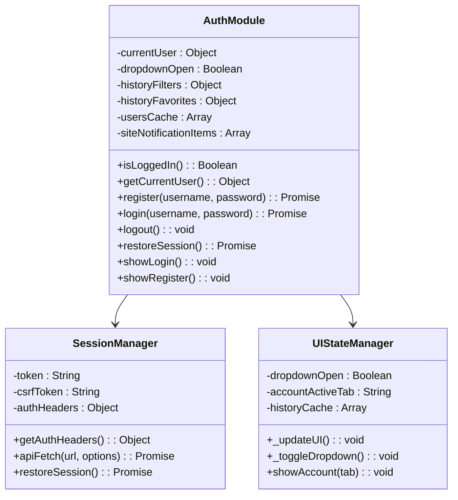
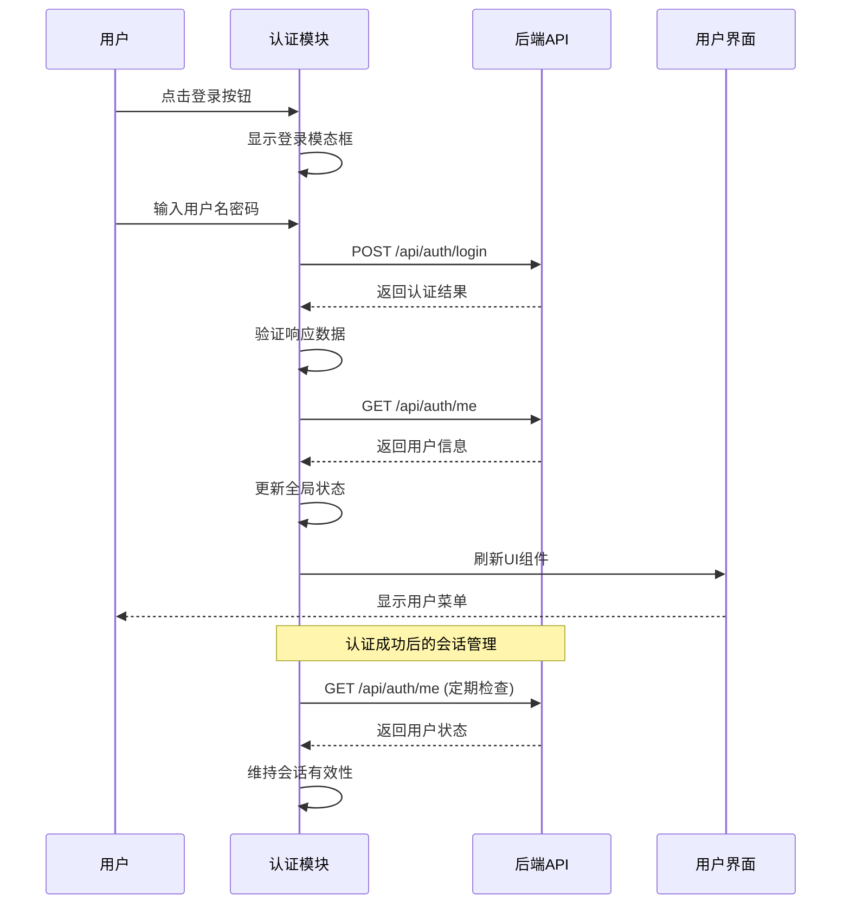
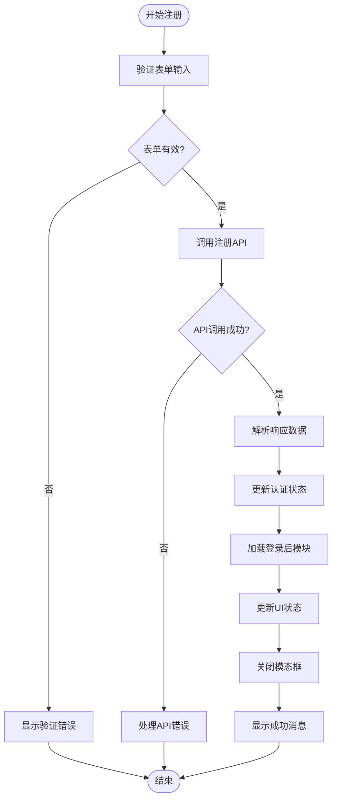
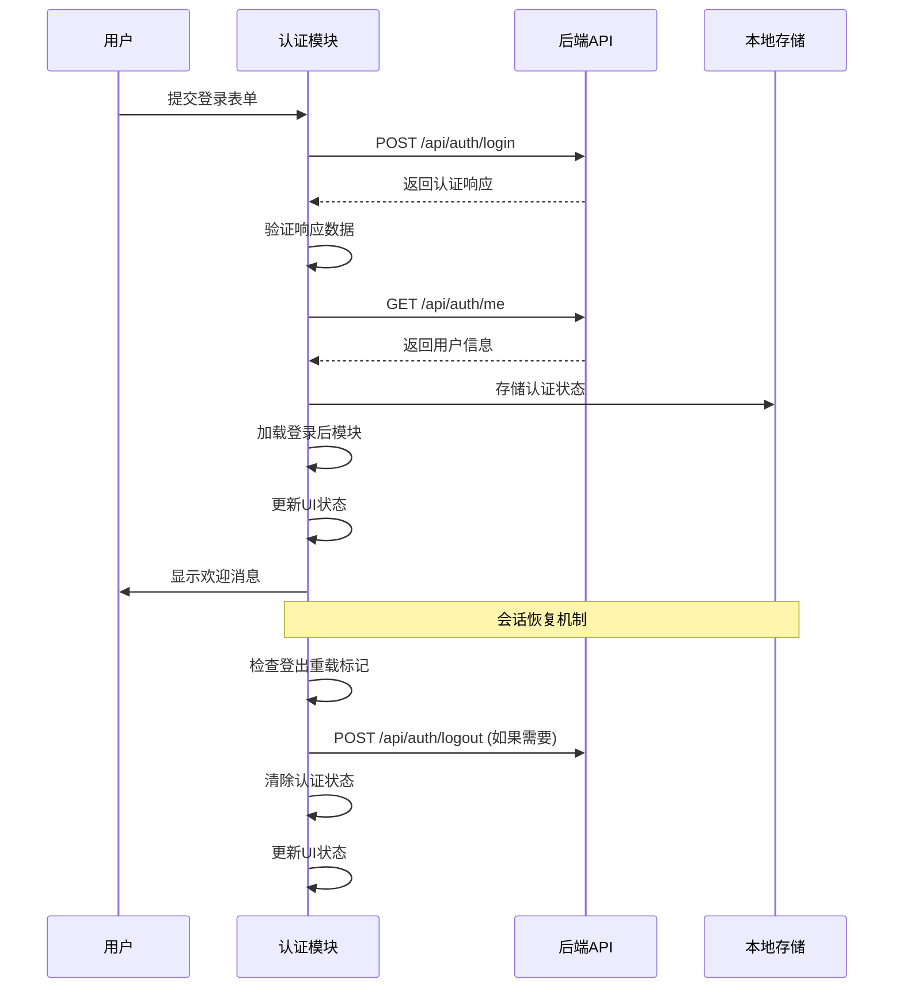
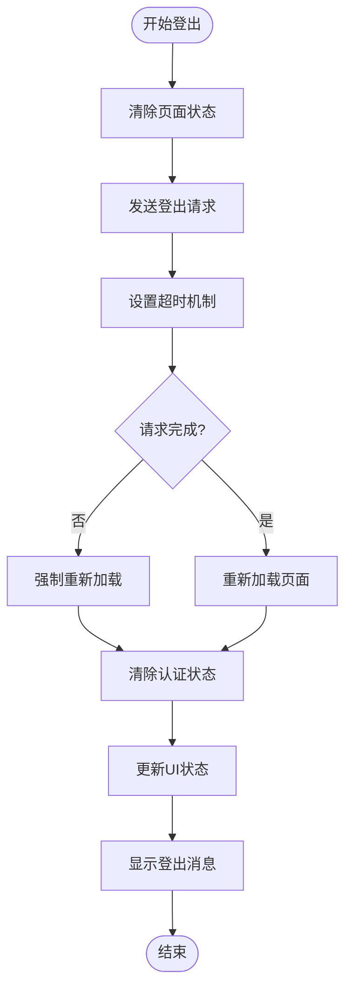
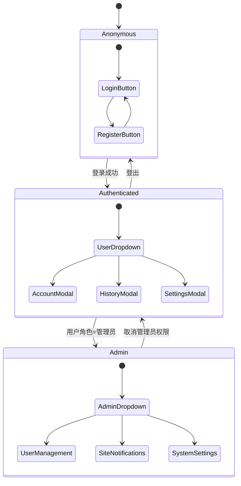
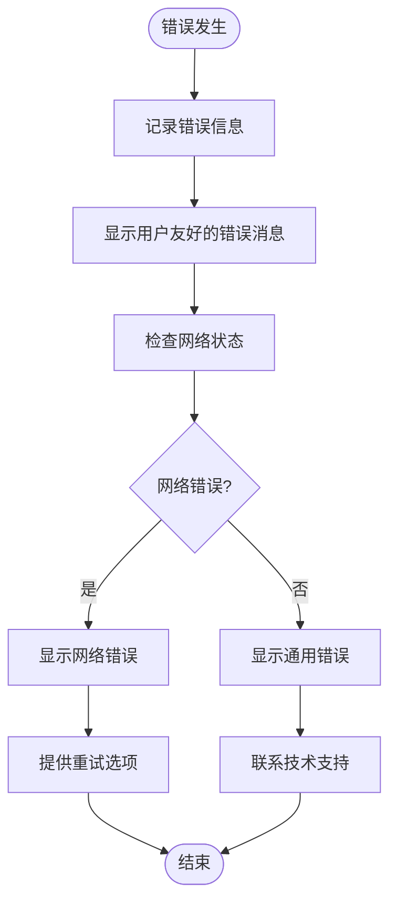

# 认证模块 (auth.js)

<cite>
**本文档引用的文件**
- [auth.js](file://static/js/modules/auth.js)
- [app.js](file://static/js/app.js)
- [module_loader.js](file://static/js/module_loader.js)
- [index.html](file://static/index.html)
- [style.css](file://static/css/style.css)
</cite>

## 目录
1. [简介](#简介)
2. [项目结构](#项目结构)
3. [核心组件](#核心组件)
4. [架构概览](#架构概览)
5. [详细组件分析](#详细组件分析)
6. [依赖关系分析](#依赖关系分析)
7. [性能考虑](#性能考虑)
8. [故障排除指南](#故障排除指南)
9. [结论](#结论)

## 简介

Ez ComfyUI Showcase 的认证模块是整个应用程序的核心安全组件，负责处理用户身份验证、授权管理和会话状态维护。该模块实现了完整的用户认证生命周期，包括用户注册、登录、登出功能，以及基于 JWT 的令牌管理机制。

该认证模块采用现代化的前端架构设计，集成了 CSRF 保护、会话恢复、UI 状态管理、模态框交互等多种安全和用户体验特性。模块通过统一的 API 接口与后端服务通信，确保了系统的安全性和可靠性。

## 项目结构

认证模块位于静态资源目录的模块化架构中，采用 IIFE（立即执行函数表达式）模式封装，提供了完整的认证功能实现。

```mermaid
graph TB
subgraph "客户端架构"
A[module_loader.js] --> B[app.js]
B --> C[auth.js]
C --> D[index.html]
D --> E[认证UI组件]
end
subgraph "样式系统"
F[style.css] --> G[认证模态框样式]
F --> H[下拉菜单样式]
F --> I[响应式设计]
end
subgraph "API接口"
J[/api/auth/register]
K[/api/auth/login]
L[/api/auth/logout]
M[/api/auth/me]
end
C --> J
C --> K
C --> L
C --> M
```

**图表来源**
- [module_loader.js:14-30](file://static/js/module_loader.js#L14-L30)
- [auth.js:279-336](file://static/js/modules/auth.js#L279-L336)
- [index.html:31](file://static/index.html#L31)

**章节来源**
- [module_loader.js:14-30](file://static/js/module_loader.js#L14-L30)
- [auth.js:1-100](file://static/js/modules/auth.js#L1-L100)
- [index.html:1-50](file://static/index.html#L1-L50)

## 核心组件

### 认证状态管理

认证模块维护着完整的用户状态信息，包括当前登录用户、会话状态、UI 状态等关键数据结构：



**图表来源**
- [auth.js:9-32](file://static/js/modules/auth.js#L9-L32)
- [auth.js:2125-2179](file://static/js/modules/auth.js#L2125-L2179)

### 安全机制

模块实现了多层次的安全保护机制：

1. **CSRF 保护**：自动从 Cookie 中读取并附加 CSRF Token
2. **会话管理**：基于 Cookie 的会话持久化
3. **令牌管理**：JWT 令牌的存储和验证
4. **权限控制**：基于用户角色的访问控制

**章节来源**
- [auth.js:68-105](file://static/js/modules/auth.js#L68-L105)
- [auth.js:179-185](file://static/js/modules/auth.js#L179-L185)
- [auth.js:338-373](file://static/js/modules/auth.js#L338-L373)

## 架构概览

认证模块采用模块化设计，通过统一的接口与应用程序其他部分集成：



**图表来源**
- [auth.js:297-313](file://static/js/modules/auth.js#L297-L313)
- [auth.js:231-277](file://static/js/modules/auth.js#L231-L277)
- [auth.js:354-372](file://static/js/modules/auth.js#L354-L372)

## 详细组件分析

### 用户注册流程

用户注册流程实现了完整的表单验证和错误处理机制：



**图表来源**
- [auth.js:279-295](file://static/js/modules/auth.js#L279-L295)
- [auth.js:464-474](file://static/js/modules/auth.js#L464-L474)

**章节来源**
- [auth.js:279-295](file://static/js/modules/auth.js#L279-L295)
- [auth.js:464-474](file://static/js/modules/auth.js#L464-L474)

### 用户登录流程

登录流程包含了完整的安全验证和会话恢复机制：



**图表来源**
- [auth.js:297-313](file://static/js/modules/auth.js#L297-L313)
- [auth.js:338-373](file://static/js/modules/auth.js#L338-L373)

**章节来源**
- [auth.js:297-313](file://static/js/modules/auth.js#L297-L313)
- [auth.js:338-373](file://static/js/modules/auth.js#L338-L373)

### 登出流程

登出流程确保了安全的会话终止和状态清理：



**图表来源**
- [auth.js:315-336](file://static/js/modules/auth.js#L315-L336)
- [auth.js:107-177](file://static/js/modules/auth.js#L107-L177)

**章节来源**
- [auth.js:315-336](file://static/js/modules/auth.js#L315-L336)
- [auth.js:107-177](file://static/js/modules/auth.js#L107-L177)

### CSRF 保护机制

模块实现了自动化的 CSRF 保护，确保所有危险操作都受到保护：

```mermaid
classDiagram
class CSRFProtection {
+readCookie(name) : String
+isUnsafeMethod(method) : Boolean
+attachCsrfHeader(options) : Object
+apiFetch(url, options) : Promise
}
class SafeRequest {
+headers : Object
+credentials : String
+keepalive : Boolean
}
CSRFProtection --> SafeRequest : "附加CSRF头"
note for CSRFProtection : "自动检测危险方法\n从Cookie读取CSRF Token\n附加到请求头"
```

**图表来源**
- [auth.js:78-105](file://static/js/modules/auth.js#L78-L105)
- [auth.js:179-185](file://static/js/modules/auth.js#L179-L185)

**章节来源**
- [auth.js:78-105](file://static/js/modules/auth.js#L78-L105)
- [auth.js:179-185](file://static/js/modules/auth.js#L179-L185)

### UI 状态管理

认证模块提供了完整的 UI 状态管理功能，包括下拉菜单、模态框和用户界面的动态更新：



**图表来源**
- [auth.js:375-410](file://static/js/modules/auth.js#L375-L410)
- [auth.js:493-534](file://static/js/modules/auth.js#L493-L534)

**章节来源**
- [auth.js:375-410](file://static/js/modules/auth.js#L375-L410)
- [auth.js:493-534](file://static/js/modules/auth.js#L493-L534)

## 依赖关系分析

认证模块与应用程序其他组件的依赖关系如下：

```mermaid
graph TB
subgraph "认证模块依赖"
A[auth.js] --> B[module_loader.js]
A --> C[app.js]
A --> D[index.html]
A --> E[style.css]
end
subgraph "外部依赖"
F[fetch API]
G[localStorage]
H[document.cookie]
I[window.CW]
end
subgraph "后端API"
J[/api/auth/*]
K[/api/users/*]
L[/api/history/*]
M[/api/site-notifications/*]
end
A --> F
A --> G
A --> H
A --> I
A --> J
A --> K
A --> L
A --> M
```

**图表来源**
- [module_loader.js:22](file://static/js/module_loader.js#L22)
- [auth.js:2125-2179](file://static/js/modules/auth.js#L2125-L2179)

**章节来源**
- [module_loader.js:22](file://static/js/module_loader.js#L22)
- [auth.js:2125-2179](file://static/js/modules/auth.js#L2125-L2179)

## 性能考虑

认证模块在设计时充分考虑了性能优化：

### 缓存策略
- **会话缓存**：使用 localStorage 存储认证状态
- **历史缓存**：缓存用户历史记录和收藏状态
- **模块延迟加载**：仅在用户登录后加载高级功能模块

### 网络优化
- **请求去重**：避免重复的认证检查请求
- **超时处理**：合理的请求超时和重试机制
- **批量操作**：支持批量历史记录操作

### 内存管理
- **状态清理**：登出时清理所有认证相关状态
- **DOM 优化**：智能的 DOM 元素创建和销毁
- **事件监听**：适当的事件监听器管理和清理

## 故障排除指南

### 常见问题诊断

**认证失败**
- 检查网络连接和 API 可用性
- 验证用户名和密码格式
- 查看浏览器控制台错误信息

**会话丢失**
- 检查 Cookie 设置和存储权限
- 验证服务器会话配置
- 确认跨域请求设置

**UI 不更新**
- 刷新页面强制重新加载
- 检查 JavaScript 错误
- 验证模块加载顺序

### 调试工具

认证模块提供了完善的调试和错误处理机制：



**章节来源**
- [auth.js:192-203](file://static/js/modules/auth.js#L192-L203)
- [auth.js:275-277](file://static/js/modules/auth.js#L275-L277)

## 结论

Ez ComfyUI Showcase 的认证模块是一个功能完整、安全性高的用户身份验证系统。该模块通过以下关键特性确保了系统的安全性和用户体验：

### 核心优势
- **完整的认证生命周期**：从注册到登出的全流程支持
- **多层次安全保护**：CSRF 保护、会话管理和权限控制
- **优秀的用户体验**：响应式设计、模态框交互和状态管理
- **模块化架构**：清晰的代码组织和依赖管理

### 技术亮点
- **现代化的前端架构**：基于 ES6+ 和现代浏览器 API
- **完善的错误处理**：用户友好的错误消息和恢复机制
- **性能优化**：智能缓存、延迟加载和内存管理
- **可扩展性**：模块化设计便于功能扩展和维护

该认证模块为 Ez ComfyUI Showcase 提供了坚实的安全基础，确保了用户数据的安全性和应用程序的稳定性。通过持续的代码审查和安全评估，该模块能够满足生产环境的严格要求。