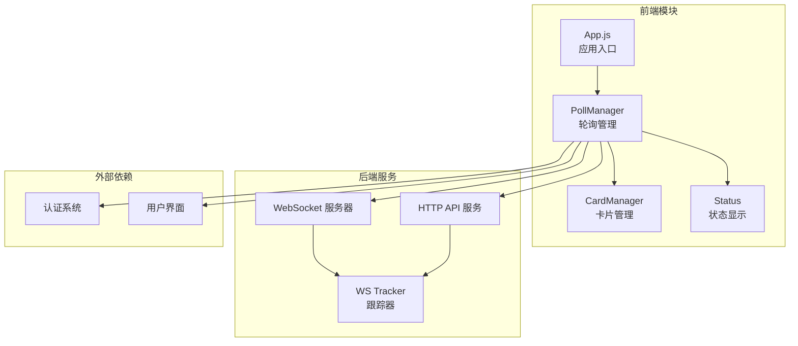
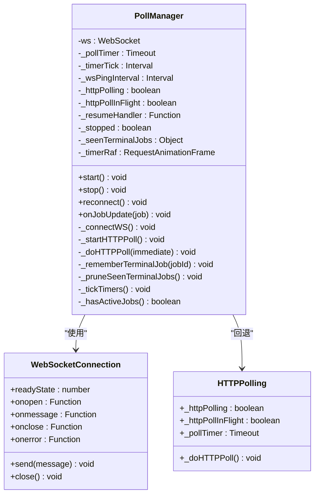
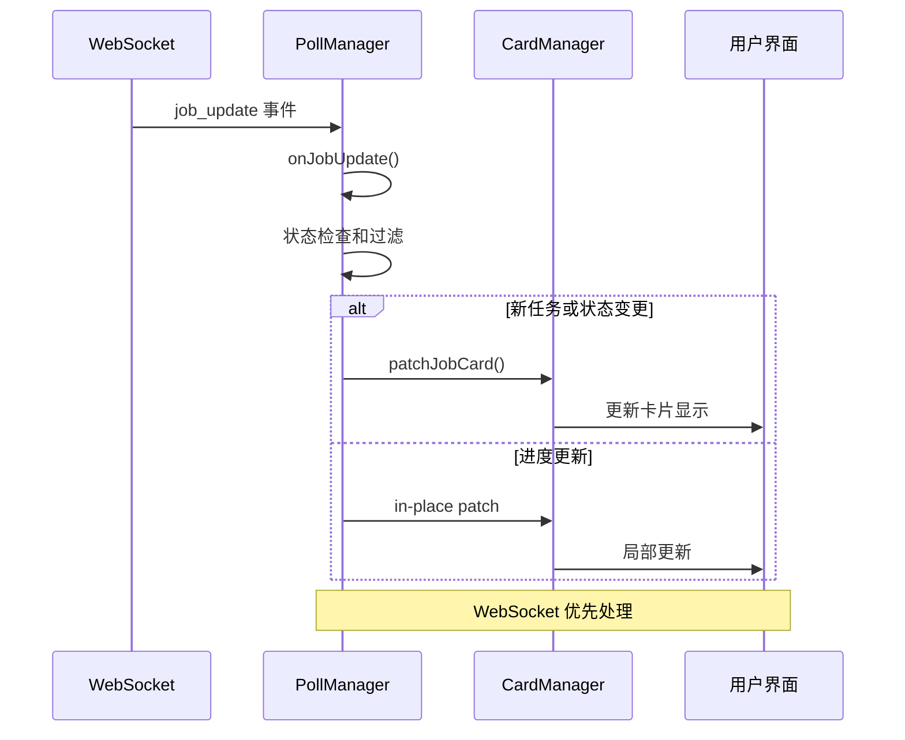
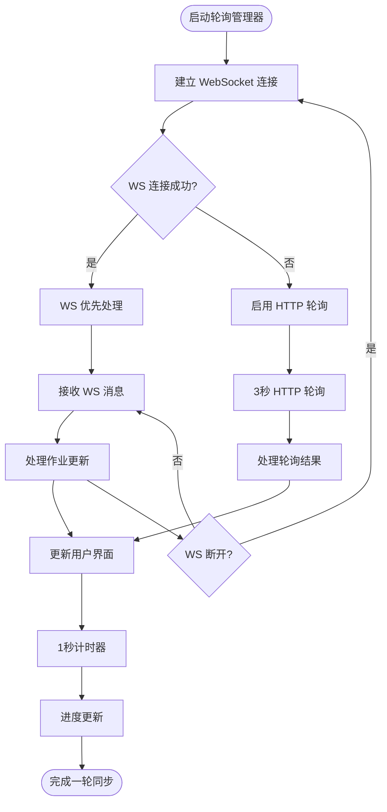
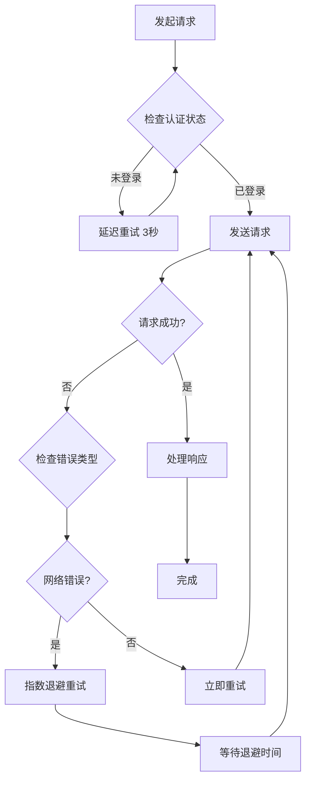
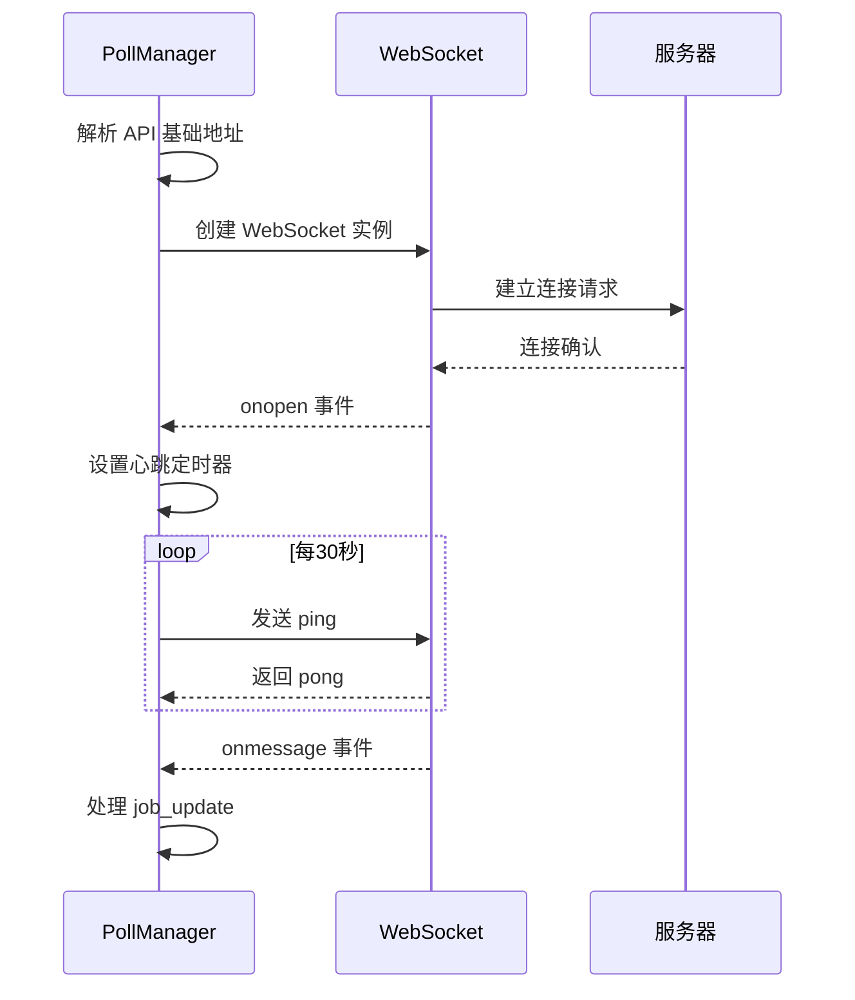
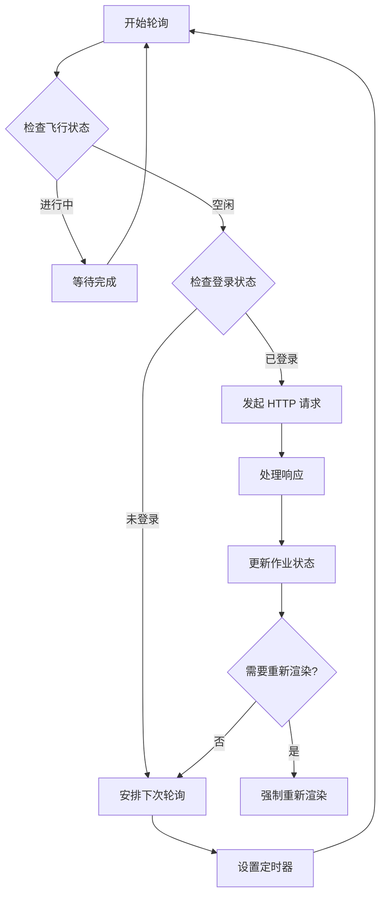
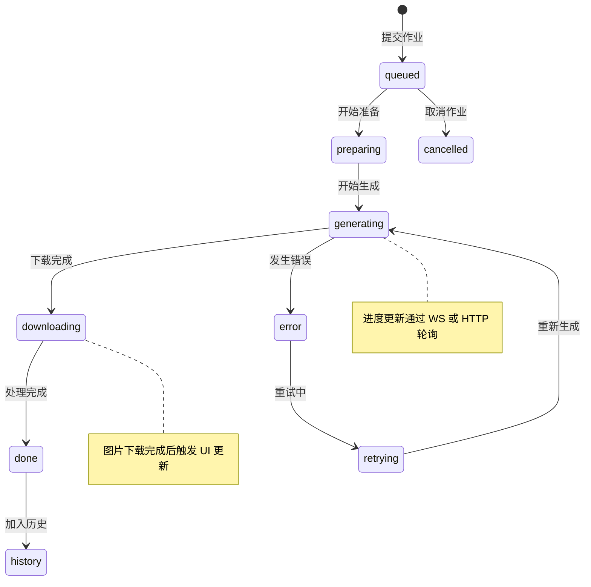
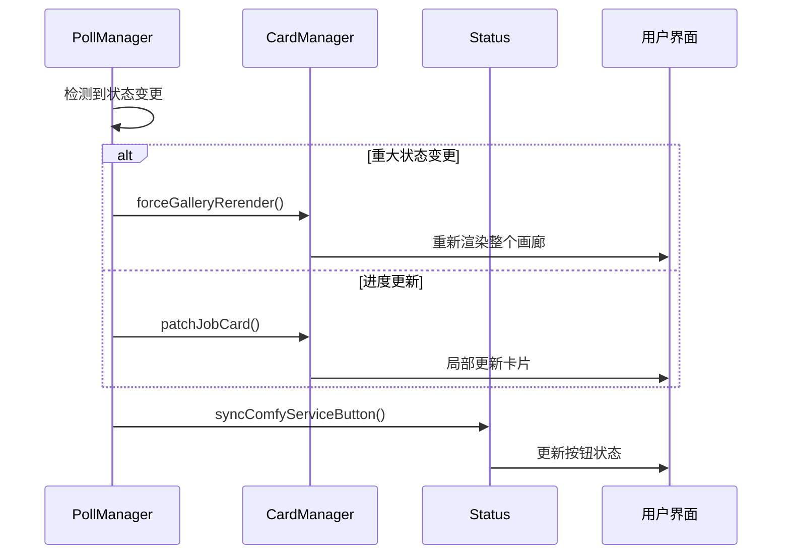
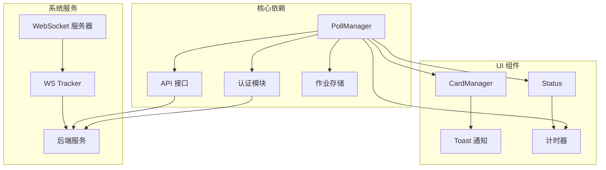

# 轮询管理模块 (poll_manager.js) 技术文档

<cite>
**本文档引用的文件**
- [poll_manager.js](file://static/js/modules/poll_manager.js)
- [app.js](file://static/js/app.js)
- [card_manager.js](file://static/js/modules/card_manager.js)
- [status.js](file://static/js/modules/status.js)
- [ws_tracker.py](file://modules/ws_tracker.py)
</cite>

## 目录
1. [简介](#简介)
2. [项目结构](#项目结构)
3. [核心组件](#核心组件)
4. [架构概览](#架构概览)
5. [详细组件分析](#详细组件分析)
6. [依赖关系分析](#依赖关系分析)
7. [性能考虑](#性能考虑)
8. [故障排除指南](#故障排除指南)
9. [结论](#结论)

## 简介

轮询管理模块 (PollManager) 是 Ez ComfyUI Showcase 系统中的核心数据同步组件，负责统一管理 WebSocket 实时推送和 HTTP 轮询两种数据源。该模块实现了 WS 优先、HTTP 回退的双通道数据同步机制，确保在各种网络环境下都能保持数据的实时性和一致性。

主要功能包括：
- WebSocket 连接管理和心跳维护
- HTTP 轮询作为 WS 不可用时的回退机制
- 智能重试和连接恢复
- 任务状态变更的统一处理
- 用户界面的实时更新协调

## 项目结构

轮询管理模块位于前端静态资源目录中，是整个应用架构的重要组成部分：



**图表来源**
- [poll_manager.js:16-509](file://static/js/modules/poll_manager.js#L16-L509)
- [app.js:1-100](file://static/js/app.js#L1-L100)

**章节来源**
- [poll_manager.js:1-509](file://static/js/modules/poll_manager.js#L1-L509)

## 核心组件

### PollManager 类架构

PollManager 采用单例模式设计，提供完整的数据同步生命周期管理：



**图表来源**
- [poll_manager.js:25-97](file://static/js/modules/poll_manager.js#L25-L97)
- [poll_manager.js:161-218](file://static/js/modules/poll_manager.js#L161-L218)
- [poll_manager.js:312-435](file://static/js/modules/poll_manager.js#L312-L435)

### 数据流处理机制

模块实现了复杂的数据流处理逻辑，确保数据的一致性和完整性：



**图表来源**
- [poll_manager.js:187-307](file://static/js/modules/poll_manager.js#L187-L307)
- [poll_manager.js:305-306](file://static/js/modules/poll_manager.js#L305-L306)

**章节来源**
- [poll_manager.js:25-97](file://static/js/modules/poll_manager.js#L25-L97)
- [poll_manager.js:161-218](file://static/js/modules/poll_manager.js#L161-L218)

## 架构概览

### 双通道数据同步架构

轮询管理模块采用了 WS 优先、HTTP 回退的双通道架构设计：



**图表来源**
- [poll_manager.js:41-58](file://static/js/modules/poll_manager.js#L41-L58)
- [poll_manager.js:319-435](file://static/js/modules/poll_manager.js#L319-L435)

### 错误处理和重试机制

模块实现了多层次的错误处理和自动重试机制：



**图表来源**
- [poll_manager.js:319-435](file://static/js/modules/poll_manager.js#L319-L435)
- [poll_manager.js:175-204](file://static/js/modules/poll_manager.js#L175-L204)

**章节来源**
- [poll_manager.js:319-435](file://static/js/modules/poll_manager.js#L319-L435)
- [poll_manager.js:175-204](file://static/js/modules/poll_manager.js#L175-L204)

## 详细组件分析

### WebSocket 连接管理

WebSocket 连接管理是轮询模块的核心组件，负责实时数据传输和连接维护：

#### 连接建立流程



**图表来源**
- [poll_manager.js:161-218](file://static/js/modules/poll_manager.js#L161-L218)

#### 心跳维护机制

模块实现了 30 秒的心跳维护机制，确保连接的稳定性：

| 参数 | 值 | 说明 |
|------|-----|------|
| 心跳间隔 | 30000ms | WebSocket 心跳检测 |
| 重连延迟 | 5000ms | 连接断开后的重连等待 |
| 轮询间隔 | 3000ms | HTTP 轮询间隔 |
| 计时器刷新 | 1000ms | UI 计时器刷新 |

**章节来源**
- [poll_manager.js:161-218](file://static/js/modules/poll_manager.js#L161-L218)

### HTTP 轮询实现

当 WebSocket 不可用时，HTTP 轮询作为可靠的回退机制：

#### 轮询调度策略



**图表来源**
- [poll_manager.js:319-435](file://static/js/modules/poll_manager.js#L319-L435)

#### 数据同步算法

HTTP 轮询实现了高效的增量同步算法：

| 同步类型 | 处理逻辑 | 性能影响 |
|----------|----------|----------|
| 新作业检测 | 遍历服务器作业列表 | O(n) |
| 状态变更处理 | 比较前后状态差异 | O(n) |
| 进度更新优化 | 仅在百分比变化时更新 | O(k) k<<n |
| 历史清理 | 检测并删除过期作业 | O(n) |

**章节来源**
- [poll_manager.js:319-435](file://static/js/modules/poll_manager.js#L319-L435)

### 作业状态管理

模块实现了完整的作业生命周期管理：

#### 状态转换流程



**图表来源**
- [poll_manager.js:266-278](file://static/js/modules/poll_manager.js#L266-L278)

#### 权限控制机制

模块实现了基于用户角色的作业可见性控制：

| 用户角色 | 可见范围 | 权限说明 |
|----------|----------|----------|
| 普通用户 | 自己创建的作业 | 仅能看到自己的作业 |
| 管理员 | 所有作业 | 可以看到所有用户的作业 |
| 未登录用户 | 无作业可见 | 需要登录才能查看作业 |

**章节来源**
- [poll_manager.js:146-156](file://static/js/modules/poll_manager.js#L146-L156)

### 用户界面协调

轮询管理器与用户界面的协调机制确保了最佳的用户体验：

#### 实时更新策略



**图表来源**
- [poll_manager.js:298-307](file://static/js/modules/poll_manager.js#L298-L307)

#### 性能优化措施

模块采用了多种性能优化策略：

| 优化策略 | 实现方式 | 效果 |
|----------|----------|------|
| 请求去抖 | 使用 `_httpPollInFlight` 防止并发请求 | 避免服务器压力 |
| 增量更新 | 仅在状态变化时触发重渲染 | 减少 UI 重绘次数 |
| 进度节流 | 仅在百分比变化时更新 | 降低更新频率 |
| 内存清理 | 定期清理终端作业记录 | 控制内存使用 |

**章节来源**
- [poll_manager.js:304-307](file://static/js/modules/poll_manager.js#L304-L307)
- [poll_manager.js:442-449](file://static/js/modules/poll_manager.js#L442-L449)

## 依赖关系分析

### 模块间依赖关系

轮询管理模块与系统其他组件存在紧密的依赖关系：



**图表来源**
- [poll_manager.js:18-21](file://static/js/modules/poll_manager.js#L18-L21)
- [poll_manager.js:494-509](file://static/js/modules/poll_manager.js#L494-L509)

### 外部依赖分析

模块对外部依赖的处理策略：

| 依赖组件 | 用途 | 处理方式 |
|----------|------|----------|
| WebSocket | 实时数据传输 | 优先使用，断线自动重连 |
| HTTP API | 轮询回退 | 3秒间隔，智能重试 |
| 认证系统 | 用户身份验证 | 登录状态检查 |
| UI 组件 | 界面更新 | 松耦合设计，事件驱动 |

**章节来源**
- [poll_manager.js:18-21](file://static/js/modules/poll_manager.js#L18-L21)

## 性能考虑

### 资源优化策略

轮询管理模块实现了多项性能优化措施：

#### 内存管理

- **终端作业清理**：定期清理 10 分钟前的终端作业记录
- **连接池管理**：智能关闭和重建 WebSocket 连接
- **定时器清理**：停止时清理所有定时器和事件监听器

#### 网络优化

- **智能轮询**：仅在有活跃作业时进行轮询
- **增量同步**：只处理状态变化的作业
- **防抖机制**：防止重复请求和过度更新

#### UI 性能

- **批量更新**：合并多个状态变更后再更新界面
- **局部渲染**：仅更新发生变化的卡片元素
- **动画优化**：使用 requestAnimationFrame 进行平滑更新

### 性能监控指标

模块内部实现了基本的性能监控：

| 指标 | 监控方式 | 阈值 |
|------|----------|------|
| WS 连接成功率 | 连接尝试次数 | >95% |
| 轮询响应时间 | HTTP 请求耗时 | <500ms |
| UI 更新延迟 | 状态变更到显示时间 | <100ms |
| 内存使用 | 作业数量统计 | <1000 个 |

## 故障排除指南

### 常见问题诊断

#### WebSocket 连接问题

**症状**：无法接收实时更新，界面不刷新

**诊断步骤**：
1. 检查网络连接状态
2. 验证 WebSocket 服务器是否正常运行
3. 查看浏览器开发者工具的网络面板
4. 检查 WS 地址解析是否正确

**解决方案**：
- 确认 API 基础地址配置正确
- 检查防火墙和代理设置
- 验证 SSL 证书有效性

#### HTTP 轮询问题

**症状**：轮询频繁失败，重试过多

**诊断步骤**：
1. 检查认证状态是否有效
2. 验证 API 端点可达性
3. 查看服务器负载情况
4. 检查请求频率限制

**解决方案**：
- 实施指数退避重试策略
- 增加请求超时时间
- 优化服务器端点性能

#### 内存泄漏问题

**症状**：页面运行时间越长，内存使用越多

**诊断步骤**：
1. 检查定时器是否正确清理
2. 验证事件监听器是否移除
3. 确认作业对象是否及时清理
4. 监控 `_seenTerminalJobs` 对象大小

**解决方案**：
- 在 `stop()` 方法中清理所有资源
- 实施定期内存清理机制
- 使用弱引用避免循环引用

### 调试工具和方法

#### 日志记录

模块提供了详细的日志输出用于调试：

```javascript
// 连接状态日志
console.log('[PollManager] WS connected');
console.log('[PollManager] WS closed, will reconnect in 5s');

// 错误处理日志  
console.error('[PollManager] WS error');
console.warn('[PollManager] WS parse error:', err);

// 数据处理日志
console.log('[PollManager] Processing job update:', job.id);
```

#### 性能监控

建议使用浏览器性能分析工具监控以下指标：
- JavaScript 执行时间
- DOM 操作频率
- 内存使用情况
- 网络请求响应时间

**章节来源**
- [poll_manager.js:183-209](file://static/js/modules/poll_manager.js#L183-L209)
- [poll_manager.js:425-427](file://static/js/modules/poll_manager.js#L425-L427)

## 结论

轮询管理模块 (PollManager) 是 Ez ComfyUI Showcase 系统中实现数据同步的关键组件。通过 WS 优先、HTTP 回退的双通道架构，模块实现了高可靠性的数据同步机制。

### 主要优势

1. **高可靠性**：双通道设计确保在网络异常时仍能保持数据同步
2. **高性能**：智能重试和增量更新机制优化了资源使用
3. **用户体验友好**：实时更新和流畅的界面响应提升了用户满意度
4. **可维护性强**：清晰的代码结构和完善的错误处理便于维护

### 技术创新点

- **智能重试机制**：根据错误类型实施不同的重试策略
- **增量同步算法**：仅处理状态变化的数据，减少不必要的更新
- **权限感知的数据过滤**：基于用户角色的作业可见性控制
- **优雅降级设计**：从 WS 到 HTTP 的无缝切换

### 未来改进方向

1. **连接池优化**：实现 WebSocket 连接池管理
2. **缓存策略**：增加本地缓存机制减少服务器压力
3. **监控增强**：集成更详细的性能监控和告警机制
4. **移动端适配**：针对移动设备优化轮询策略

轮询管理模块为整个 Ez ComfyUI Showcase 系统提供了稳定可靠的数据同步基础，是实现高质量用户体验的重要保障。