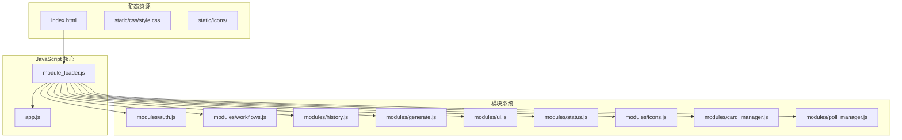
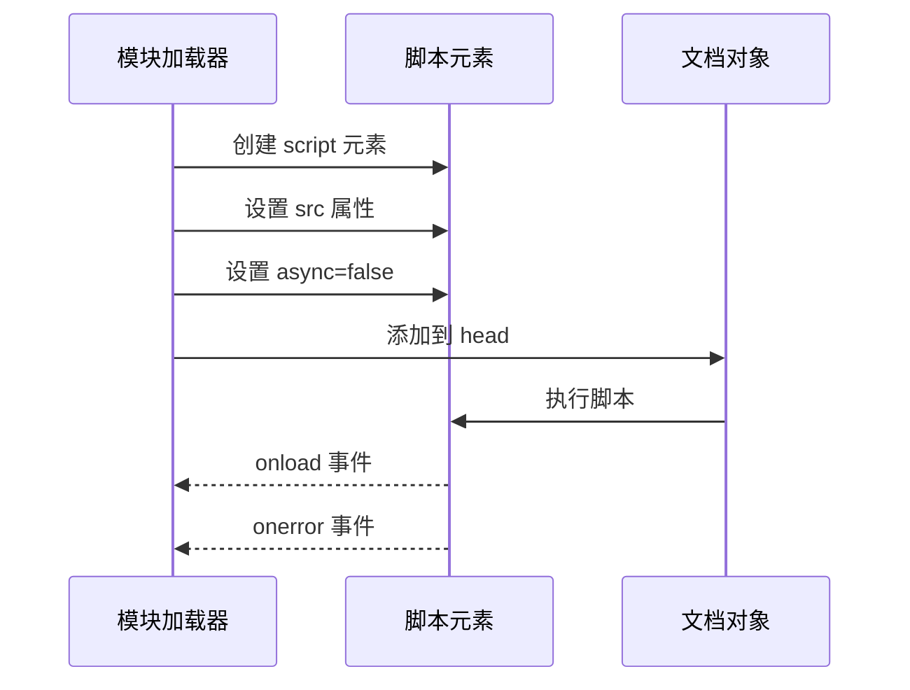
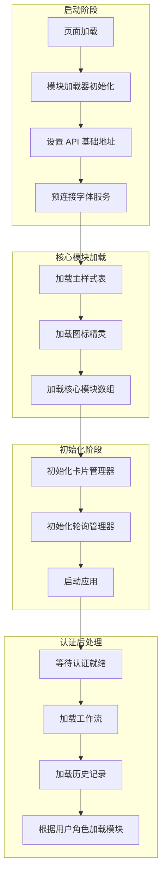
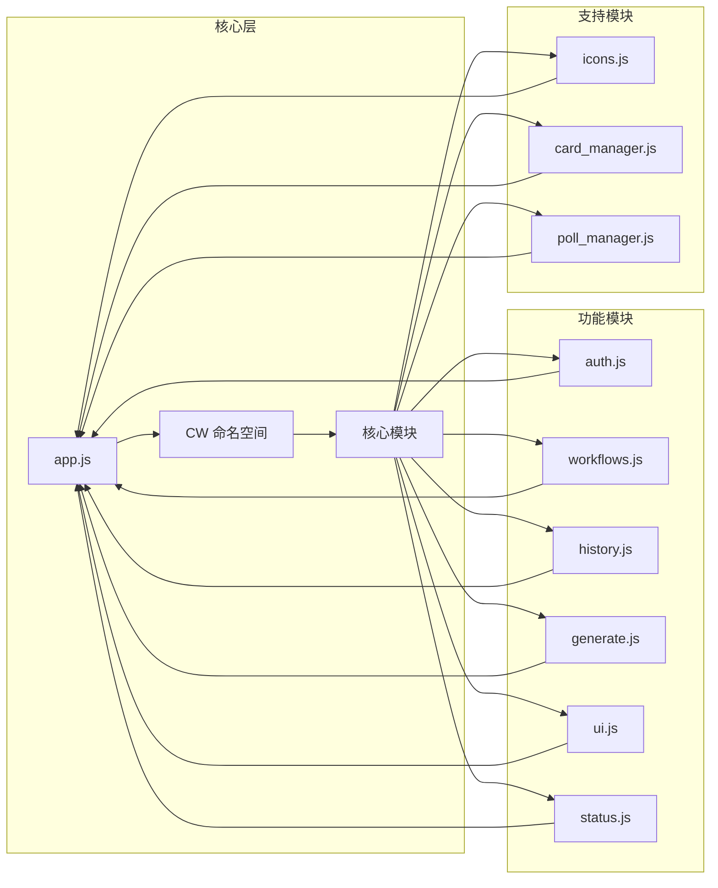
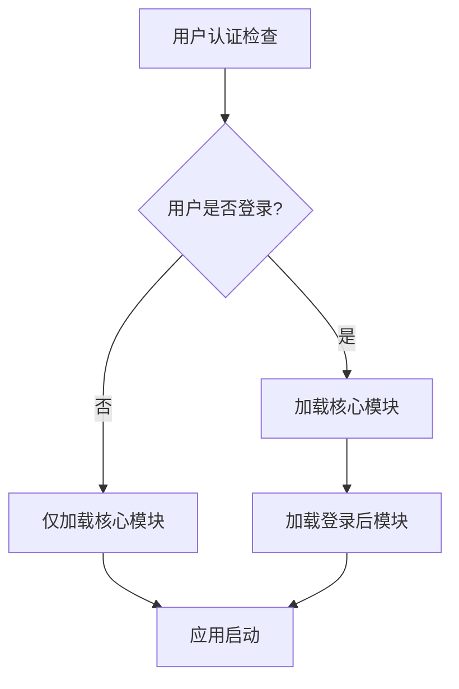
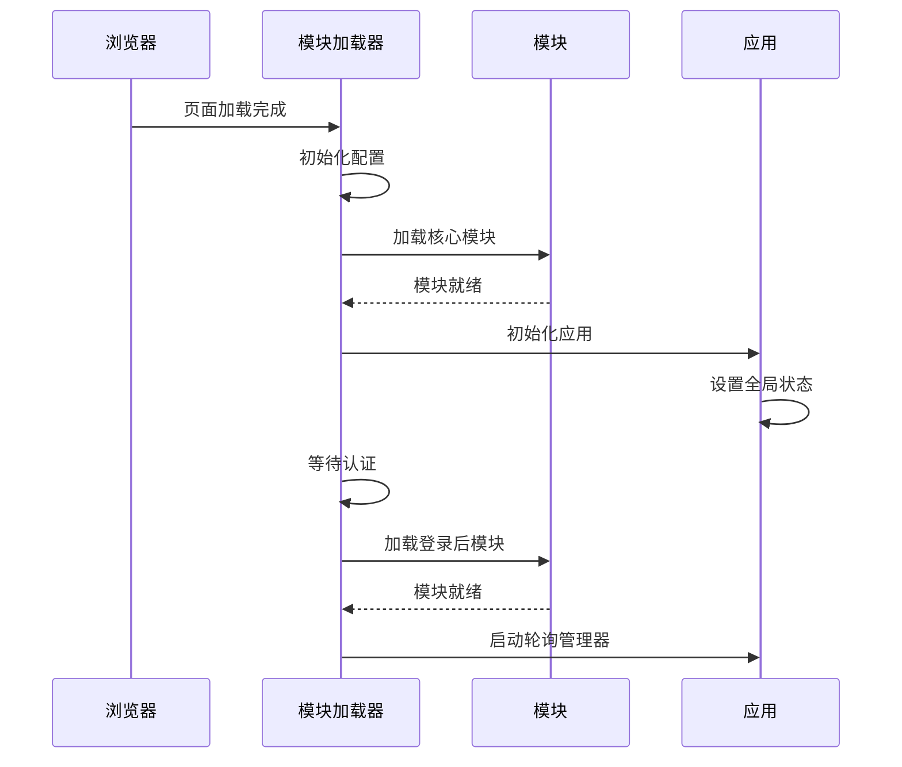
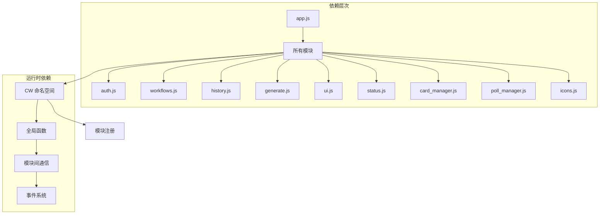

# 模块加载器系统

<cite>
**本文档引用的文件**
- [module_loader.js](file://static/js/module_loader.js)
- [app.js](file://static/js/app.js)
- [auth.js](file://static/js/modules/auth.js)
- [workflows.js](file://static/js/modules/workflows.js)
- [history.js](file://static/js/modules/history.js)
- [generate.js](file://static/js/modules/generate.js)
- [card_manager.js](file://static/js/modules/card_manager.js)
- [poll_manager.js](file://static/js/modules/poll_manager.js)
- [ui.js](file://static/js/modules/ui.js)
- [icons.js](file://static/js/modules/icons.js)
- [status.js](file://static/js/modules/status.js)
- [index.html](file://static/index.html)
- [test_startup_load_dedup_ui.py](file://tests/test_startup_load_dedup_ui.py)
- [test_css_loading.py](file://tests/test_css_loading.py)
</cite>

## 目录
1. [简介](#简介)
2. [项目结构](#项目结构)
3. [核心组件](#核心组件)
4. [架构概览](#架构概览)
5. [详细组件分析](#详细组件分析)
6. [依赖分析](#依赖分析)
7. [性能考虑](#性能考虑)
8. [故障排除指南](#故障排除指南)
9. [结论](#结论)
10. [附录](#附录)

## 简介

Ez ComfyUI Showcase 的模块加载器系统是一个精心设计的前端模块管理系统，负责统一加载和初始化应用的核心功能模块。该系统采用延迟加载策略，确保模块按照特定的顺序加载，同时支持条件加载和错误处理机制。

该加载器系统的核心目标是：
- 提供统一的模块加载策略
- 实现动态脚本加载和样式表管理
- 支持字体预连接优化
- 实现模块间依赖关系管理
- 提供条件加载机制（基于用户角色）
- 确保模块加载顺序控制
- 实现健壮的错误处理和版本控制

## 项目结构

项目的前端架构采用模块化设计，主要文件组织如下：



**图表来源**
- [module_loader.js:1-151](file://static/js/module_loader.js#L1-L151)
- [app.js:1-888](file://static/js/app.js#L1-L888)

**章节来源**
- [module_loader.js:1-151](file://static/js/module_loader.js#L1-L151)
- [index.html](file://static/index.html)

## 核心组件

### 模块加载器核心功能

模块加载器系统包含以下核心组件：

#### 1. 统一加载策略
- **核心模块**: 始终加载的基础模块集合
- **登录后模块**: 仅在用户登录时加载的高级功能模块
- **版本控制**: 通过查询参数实现缓存控制

#### 2. 动态资源加载
- **脚本加载**: 异步加载 JavaScript 模块
- **样式表管理**: 动态注入 CSS 样式
- **字体优化**: 预连接 Google Fonts 服务

#### 3. 条件加载机制
- **用户角色检查**: 基于用户权限的模块加载
- **延迟初始化**: 按需加载非关键功能

**章节来源**
- [module_loader.js:9-31](file://static/js/module_loader.js#L9-L31)
- [module_loader.js:95-108](file://static/js/module_loader.js#L95-L108)

### 资源类型处理

系统能够处理多种类型的资源：

#### JS 脚本加载


**图表来源**
- [module_loader.js:33-42](file://static/js/module_loader.js#L33-L42)

#### 样式表管理
- **主样式**: 静态样式表优先加载
- **动态样式**: 模块特定样式按需加载
- **字体优化**: 预连接 Google Fonts 服务

#### SVG 图标处理
- **图标精灵**: 单一 SVG 文件包含所有图标
- **运行时注入**: 通过 fetch 获取并注入到页面

**章节来源**
- [module_loader.js:44-53](file://static/js/module_loader.js#L44-L53)
- [module_loader.js:55-77](file://static/js/module_loader.js#L55-L77)
- [module_loader.js:79-93](file://static/js/module_loader.js#L79-L93)

## 架构概览

### 整体架构设计



**图表来源**
- [module_loader.js:110-143](file://static/js/module_loader.js#L110-L143)

### 模块依赖关系



**图表来源**
- [module_loader.js:14-31](file://static/js/module_loader.js#L14-L31)
- [app.js:86-111](file://static/js/app.js#L86-L111)

**章节来源**
- [module_loader.js:110-143](file://static/js/module_loader.js#L110-L143)

## 详细组件分析

### 模块加载器实现

#### 核心加载策略

模块加载器采用数组驱动的加载策略，定义了严格的加载顺序：

```javascript
var coreModules = [
    base + '/app.js?v=' + version,
    base + '/modules/icons.js?v=' + version,
    base + '/modules/status.js?v=' + version,
    // ... 其他核心模块
];

var loggedInModules = [
    base + '/modules/log_panel.js?v=' + version,
    base + '/modules/node-editor.js?v=' + version,
    // ... 登录后模块
];
```

#### 条件加载机制

系统实现了基于用户角色的条件加载：



**图表来源**
- [module_loader.js:95-108](file://static/js/module_loader.js#L95-L108)

#### 错误处理策略

```javascript
function loadScript(src) {
    return new Promise(function(resolve, reject) {
        var el = document.createElement('script');
        el.src = src;
        el.async = false;
        el.onload = function() { resolve(src); };
        el.onerror = function() { 
            reject(new Error('Failed to load ' + src)); 
        };
        document.head.appendChild(el);
    });
}
```

**章节来源**
- [module_loader.js:33-42](file://static/js/module_loader.js#L33-L42)
- [module_loader.js:95-108](file://static/js/module_loader.js#L95-L108)

### 应用初始化流程

#### 启动序列



**图表来源**
- [module_loader.js:110-143](file://static/js/module_loader.js#L110-L143)

#### 模块生命周期管理

每个模块都遵循相同的生命周期模式：

```javascript
(function() {
    'use strict';
    // 模块初始化代码
    // 导出公共接口
    if (!window.CW) window.CW = {};
    window.CW.moduleName = moduleFunction;
})();
```

**章节来源**
- [app.js:1-20](file://static/js/app.js#L1-L20)
- [auth.js:1-10](file://static/js/modules/auth.js#L1-L10)

### 资源管理机制

#### 字体预连接优化

```javascript
function loadFontPreconnects() {
    var urls = [
        'https://fonts.googleapis.com',
        'https://fonts.gstatic.com'
    ];
    // 预连接优化
    // 避免字体加载阻塞渲染
}
```

#### SVG 图标系统

```javascript
function loadSprite(href) {
    return fetch(href).then(function(r) { 
        return r.text(); 
    }).then(function(svg) {
        // 注入图标精灵到页面
    });
}
```

**章节来源**
- [module_loader.js:55-77](file://static/js/module_loader.js#L55-L77)
- [module_loader.js:79-93](file://static/js/module_loader.js#L79-L93)

## 依赖分析

### 模块间依赖关系



**图表来源**
- [app.js:86-111](file://static/js/app.js#L86-L111)
- [module_loader.js:110-129](file://static/js/module_loader.js#L110-L129)

### 并发加载优化

系统实现了智能的并发加载策略：

```javascript
// 核心模块串行加载确保依赖关系
for (var i = 0; i < coreModules.length; i++) {
    await loadScript(coreModules[i]);
}

// 登录后模块并行加载提升性能
await Promise.all(loggedInModules.map(loadScript));
```

**章节来源**
- [module_loader.js:124-126](file://static/js/module_loader.js#L124-L126)
- [module_loader.js:98-101](file://static/js/module_loader.js#L98-L101)

## 性能考虑

### 加载性能优化

1. **缓存控制**: 通过版本参数实现强制缓存失效
2. **预连接优化**: 提前建立字体服务连接
3. **懒加载策略**: 非关键功能延迟加载
4. **并发优化**: 合理的并行加载策略

### 内存管理

- 模块卸载机制
- 事件监听器清理
- 定时器管理

## 故障排除指南

### 常见问题诊断

#### 模块加载失败

```javascript
// 检查模块加载状态
console.log('加载进度:', loadedModules.length, '/', totalModules);

// 检查网络请求
fetch('/api/modules/auth.js')
    .then(response => response.ok ? response.text() : Promise.reject('Network error'))
    .catch(error => console.error('模块加载失败:', error));
```

#### 认证相关问题

```javascript
// 检查认证状态
if (window.CW.authReady) {
    window.CW.authReady.then(user => {
        if (user && user.role) {
            // 用户已登录，加载登录后模块
        }
    });
}
```

**章节来源**
- [module_loader.js:134-142](file://static/js/module_loader.js#L134-L142)
- [test_startup_load_dedup_ui.py:18-28](file://tests/test_startup_load_dedup_ui.py#L18-L28)

### 调试技巧

1. **浏览器开发者工具**: 监控网络请求和加载时间
2. **控制台日志**: 添加详细的加载状态日志
3. **性能面板**: 分析模块加载性能瓶颈
4. **内存分析**: 检查模块卸载和内存泄漏

## 结论

Ez ComfyUI Showcase 的模块加载器系统展现了现代前端架构的最佳实践：

1. **统一的加载策略**: 通过集中式的模块加载器实现了清晰的依赖管理和加载顺序控制
2. **灵活的条件加载**: 基于用户角色的智能加载机制提升了用户体验
3. **健壮的错误处理**: 完善的错误捕获和恢复机制确保了系统的稳定性
4. **性能优化**: 多层次的性能优化策略保证了良好的加载体验
5. **可维护性**: 清晰的模块边界和标准化的接口设计便于后续维护和扩展

该系统为复杂的单页应用提供了可靠的前端基础设施，为后续的功能扩展奠定了坚实的基础。

## 附录

### 配置选项

| 选项 | 类型 | 默认值 | 描述 |
|------|------|--------|------|
| version | string | '1780506200' | 缓存版本控制参数 |
| runtimeApiBase | string | '' | 运行时 API 基础地址 |
| base | string | 'static/js' | 模块基础路径 |

### 扩展方法

1. **添加新模块**: 在相应数组中添加模块路径
2. **自定义加载逻辑**: 扩展 loadScript 函数
3. **条件加载**: 实现新的条件判断逻辑
4. **错误处理**: 自定义错误处理策略

### 最佳实践

1. **模块设计**: 遵循 IIFE 模式，避免全局污染
2. **依赖管理**: 明确模块间的依赖关系
3. **错误处理**: 实现完善的异常处理机制
4. **性能监控**: 添加加载性能监控和日志记录