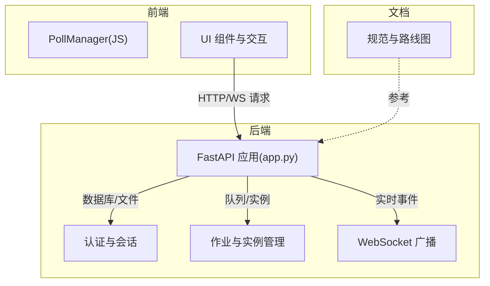
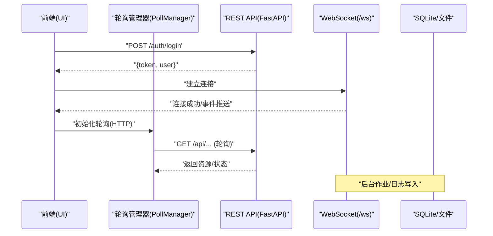
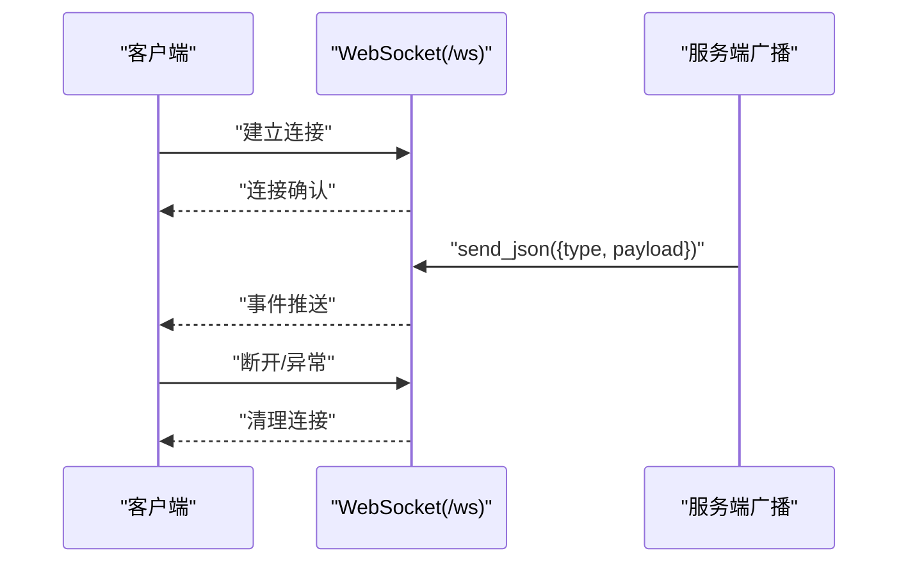
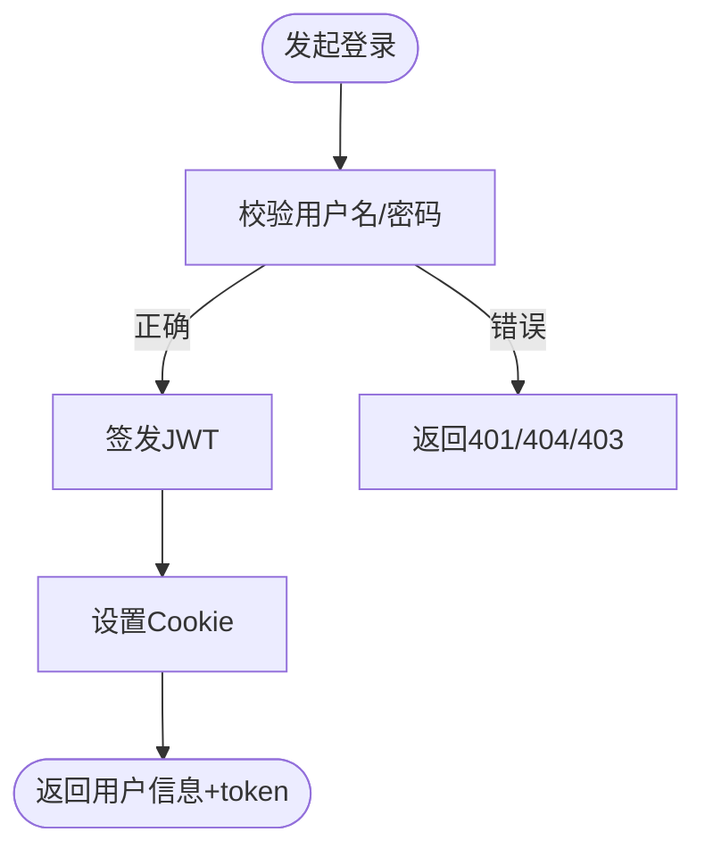
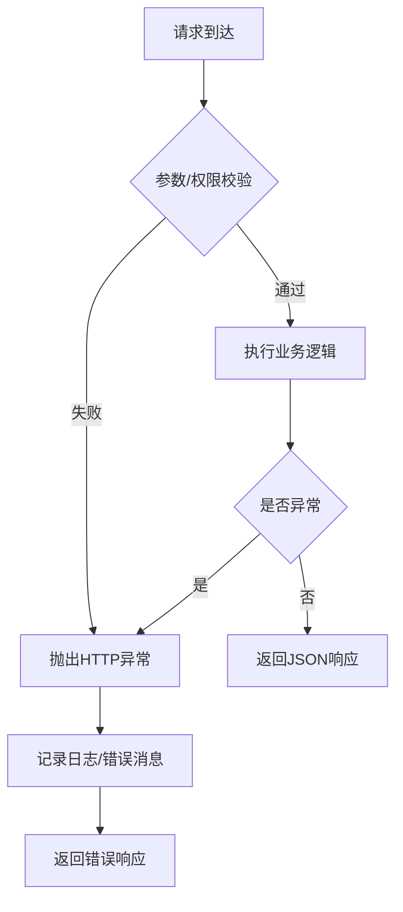
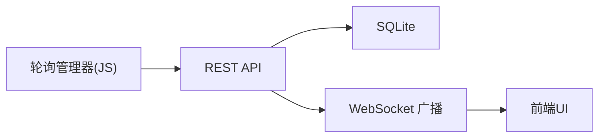

# API 设计规范

<cite>
**本文引用的文件**
- [app.py](file://app.py)
- [ws_tracker.py](file://modules/ws_tracker.py)
- [poll_manager.js](file://static/js/modules/poll_manager.js)
- [review-fixes-2026-05-16.md](file://docs/review-fixes-2026-05-16.md)
</cite>

## 目录
1. [引言](#引言)
2. [项目结构](#项目结构)
3. [核心组件](#核心组件)
4. [架构总览](#架构总览)
5. [详细组件分析](#详细组件分析)
6. [依赖分析](#依赖分析)
7. [性能考虑](#性能考虑)
8. [故障排查指南](#故障排查指南)
9. [结论](#结论)
10. [附录](#附录)

## 引言
本规范面向 Ez ComfyUI Showcase 的 API 设计与实现，系统化阐述 RESTful API 设计原则、WebSocket 通信协议、认证与授权、版本管理策略、错误处理与异常管理、API 文档与测试、以及客户端集成实践。内容基于仓库现有实现进行提炼与扩展，确保可操作、可落地。

## 项目结构
- 后端基于 FastAPI，主入口为应用模块，集中定义路由、认证、业务逻辑与广播通道。
- 前端静态资源位于 static/，包含与后端交互的模块化 JS，如轮询管理器用于在 WebSocket 不可用时回退 HTTP 轮询。
- 文档目录包含项目规范、路线图与审查修复记录，可用于理解 API 的演进与约束。

**章节来源**
- [app.py:6319-6334](file://app.py#L6319-L6334)
- [poll_manager.js:48-97](file://static/js/modules/poll_manager.js#L48-L97)

## 核心组件
- RESTful API 路由：以“/api”为前缀的资源路径，遵循资源命名与 HTTP 方法约定；部分管理类接口采用“/auth”和“/admin”前缀。
- 认证与授权：基于 SQLite 用户表与 JWT Cookie，支持登录、登出、当前用户查询、密码修改与管理员用户管理。
- WebSocket 通信：统一的“/ws”端点，支持心跳与事件广播，具备降级回退机制。
- 日志与监控：统一的日志缓冲与持久化，支持按时间窗口裁剪与前端订阅。
- 错误处理：HTTP 异常与友好提示，结合前端轮询回退策略。

**章节来源**
- [app.py:8372-8646](file://app.py#L8372-L8646)
- [app.py:5081-5098](file://app.py#L5081-L5098)
- [app.py:8804-8804](file://app.py#L8804-L8804)

## 架构总览
下图展示后端与前端之间的典型交互：前端通过 REST API 获取资源、登录认证，随后建立 WebSocket 接收实时事件；当 WebSocket 不可用时，前端自动切换到 HTTP 轮询。

**图表来源**
- [app.py:8477-8520](file://app.py#L8477-L8520)
- [app.py:8804-8804](file://app.py#L8804-L8804)
- [poll_manager.js:48-97](file://static/js/modules/poll_manager.js#L48-L97)

**章节来源**
- [app.py:8477-8520](file://app.py#L8477-L8520)
- [app.py:8804-8804](file://app.py#L8804-L8804)
- [poll_manager.js:48-97](file://static/js/modules/poll_manager.js#L48-L97)

## 详细组件分析

### RESTful API 设计原则
- 资源命名规范
  - 使用名词复数形式表达资源集合，如“/api/users”、“/api/workflows”。
  - 使用层级路径表达资源关系，如“/api/workflows/{name}/config”。
  - 文件与媒体资源通过“/api/thumbs/{filename:path}”提供受可见性控制的访问。
- HTTP 方法使用
  - GET：获取资源或列表，如“/api/version”、“/api/status”、“/api/gpu”。
  - POST：提交创建或触发动作，如“/auth/login”、“/auth/logout”、“/api/comfyui/{action}”。
  - PUT/DELETE：更新或删除资源，如“/api/system-settings”、“/api/users/{user_id}”。
- 状态码标准
  - 成功：200 OK、201 Created、204 No Content。
  - 客户端错误：400 Bad Request、401 Unauthorized、403 Forbidden、404 Not Found。
  - 服务器错误：500 Internal Server Error。
- 请求/响应格式
  - 统一使用 JSON；成功响应包含“ok”布尔字段与数据体；错误响应包含明确的消息文本。
  - 部分接口返回二进制文件（如缩略图），需设置正确的 Content-Type。

**章节来源**
- [app.py:8361-8369](file://app.py#L8361-L8369)
- [app.py:6325-6334](file://app.py#L6325-L6334)
- [app.py:6334-6397](file://app.py#L6334-L6397)
- [app.py:6397-6406](file://app.py#L6397-L6406)
- [app.py:8644-8646](file://app.py#L8644-L8646)

### WebSocket 通信协议设计
- 连接建立
  - 端点：/ws；客户端在登录后建立连接，服务端维护连接池与用户权限过滤。
- 消息格式
  - 事件对象包含“type”字段与“payload”；服务端广播时对事件进行增强与权限过滤。
- 事件类型
  - 包含“log”等事件类型，用于向前端推送日志条目；其他业务事件由具体模块产生。
- 错误处理
  - 发送异常时清理无效连接；客户端断开时移除连接与用户映射。
- 回退机制
  - 前端在 WebSocket 不可用时自动启用 HTTP 轮询，周期性拉取状态。

**图表来源**
- [app.py:5081-5098](file://app.py#L5081-L5098)
- [app.py:8804-8804](file://app.py#L8804-L8804)

**章节来源**
- [app.py:5081-5098](file://app.py#L5081-L5098)
- [app.py:8804-8804](file://app.py#L8804-L8804)
- [poll_manager.js:48-97](file://static/js/modules/poll_manager.js#L48-L97)

### 认证与授权机制
- 登录与会话
  - 使用 SQLite 存储用户信息，bcrypt 校验密码；登录成功签发 JWT，并通过 Cookie 返回 token。
  - 支持登出清除 Cookie。
- 权限验证
  - 当前用户依赖 JWT 解析；管理员接口需要管理员角色。
  - 密码修改要求当前密码正确。
- CSRF 保护
  - 定义了 CSRF Cookie 名称与头部键名，用于跨站请求防护。

**图表来源**
- [app.py:8477-8520](file://app.py#L8477-L8520)

**章节来源**
- [app.py:8477-8520](file://app.py#L8477-L8520)
- [app.py:8523-8540](file://app.py#L8523-L8540)
- [app.py:8543-8636](file://app.py#L8543-L8636)

### API 版本管理策略
- 当前版本
  - 提供“/api/version”接口返回应用版本字符串，便于客户端识别后端版本。
- 版本演进建议
  - 采用语义化版本号；在路径中引入版本前缀（如“/api/v1/...”）以保持向后兼容。
  - 对废弃接口提供迁移指引与过渡期公告。
  - 重大变更前发布预发布版本与弃用计划。

**章节来源**
- [app.py:6325-6334](file://app.py#L6325-L6334)

### 错误处理与异常管理
- HTTP 异常
  - 明确的错误码与错误消息；例如用户名不存在、密码错误、用户被禁用、当前密码不正确等。
- 友好错误提示
  - 生成器连接失败与超时场景提供中文友好提示。
- 日志记录
  - 统一日志缓冲与持久化，支持按时间窗口裁剪；日志事件通过 WebSocket 推送至前端。
- 前端回退
  - WebSocket 断连时，轮询管理器自动切换到 HTTP 轮询，保障状态可见性。

**图表来源**
- [app.py:296-303](file://app.py#L296-L303)
- [app.py:5081-5098](file://app.py#L5081-L5098)
- [poll_manager.js:48-97](file://static/js/modules/poll_manager.js#L48-L97)

**章节来源**
- [app.py:296-303](file://app.py#L296-L303)
- [app.py:5081-5098](file://app.py#L5081-L5098)
- [poll_manager.js:48-97](file://static/js/modules/poll_manager.js#L48-L97)

### API 文档生成与维护
- 自动化文档
  - 使用 FastAPI 内置的自动文档（Swagger/OpenAPI）能力，路由定义即文档。
- 文档一致性
  - 通过审查清单确保路由导入与实现一致，避免遗漏或重复。
- 规范参考
  - 文档目录中的规范与路线图可作为 API 设计与演进的依据。

**章节来源**
- [review-fixes-2026-05-16.md:104-114](file://docs/review-fixes-2026-05-16.md#L104-L114)

### 客户端集成示例与最佳实践
- 登录流程
  - POST /auth/login 获取 token 并设置 Cookie；后续请求携带 Cookie。
- 实时状态
  - 建立 /ws 连接接收事件；若不可用，使用轮询管理器定时拉取状态。
- 文件访问
  - 通过 /api/thumbs/{filename:path} 获取缩略图，注意访问权限与路径安全。
- 最佳实践
  - 统一错误处理与日志上报；对敏感操作增加二次确认；对长耗时任务采用分页/增量拉取。

**章节来源**
- [app.py:8477-8520](file://app.py#L8477-L8520)
- [app.py:8361-8369](file://app.py#L8361-L8369)
- [poll_manager.js:48-97](file://static/js/modules/poll_manager.js#L48-L97)

## 依赖分析
- 组件耦合
  - WebSocket 广播依赖用户权限过滤，避免越权事件推送。
  - 前端轮询管理器与后端 REST API 强耦合，需保持接口稳定性。
- 外部依赖
  - FastAPI、websockets、bcrypt、jose（JWT）、SQLite。

**图表来源**
- [poll_manager.js:48-97](file://static/js/modules/poll_manager.js#L48-L97)
- [app.py:5081-5098](file://app.py#L5081-L5098)

**章节来源**
- [poll_manager.js:48-97](file://static/js/modules/poll_manager.js#L48-L97)
- [app.py:5081-5098](file://app.py#L5081-L5098)

## 性能考虑
- WebSocket 与 HTTP 轮询并存，降低单点压力；WebSocket 断连时自动回退。
- 日志缓冲与持久化分离，避免阻塞主流程。
- 任务超时与卡死检测，及时中断无进展任务并释放资源。

[本节为通用指导，无需特定文件引用]

## 故障排查指南
- WebSocket 无法连接
  - 检查 /ws 是否可达；查看浏览器网络面板与后端日志；确认 Cookie 与 CSRF 设置。
- 登录失败
  - 核对用户名/密码；确认用户未被禁用；检查 JWT 密钥与 Cookie 设置。
- 任务长时间无响应
  - 查看任务状态与日志；确认实例健康与 GPU 活跃度；必要时触发中断或重启。
- 文件访问 404
  - 确认缩略图路径与历史记录可见性；检查输出目录与相对路径解析。

**章节来源**
- [app.py:5081-5098](file://app.py#L5081-L5098)
- [app.py:8477-8520](file://app.py#L8477-L8520)
- [app.py:8361-8369](file://app.py#L8361-L8369)

## 结论
本规范总结了 Ez ComfyUI Showcase 的 API 设计与实现要点，涵盖 RESTful 资源组织、认证授权、WebSocket 通信、错误与日志、版本管理与客户端集成。建议在后续迭代中完善 OpenAPI 文档、引入更细粒度的鉴权与审计日志，并持续优化前端回退策略与任务可观测性。

## 附录
- 关键路由速览
  - 认证：/auth/login、/auth/logout、/auth/me、/auth/change-password
  - 用户：/api/users、/api/users/{user_id}
  - 系统：/api/system-settings
  - 工作流：/api/workflows、/api/workflows/{name}/config、/api/workflows/upload
  - 实例与 GPU：/api/comfyui/{action}、/api/gpu、/api/gpu-processes
  - 其他：/api/version、/api/status、/api/logs、/api/thumbs/{filename:path}

**章节来源**
- [app.py:6325-6334](file://app.py#L6325-L6334)
- [app.py:6334-6397](file://app.py#L6334-L6397)
- [app.py:6397-6406](file://app.py#L6397-L6406)
- [app.py:8361-8646](file://app.py#L8361-L8646)