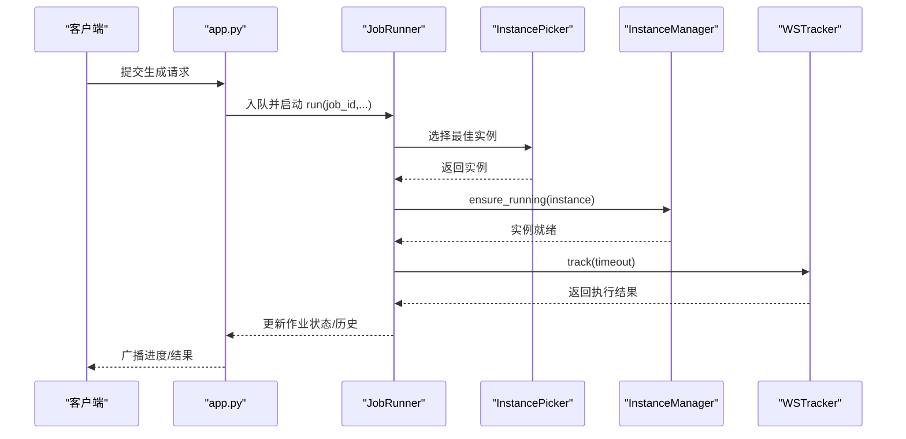
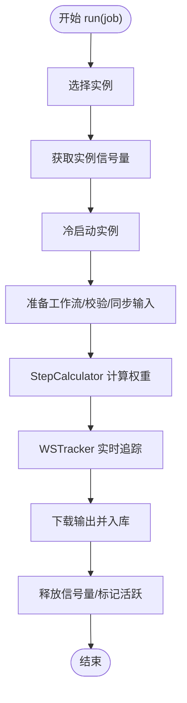
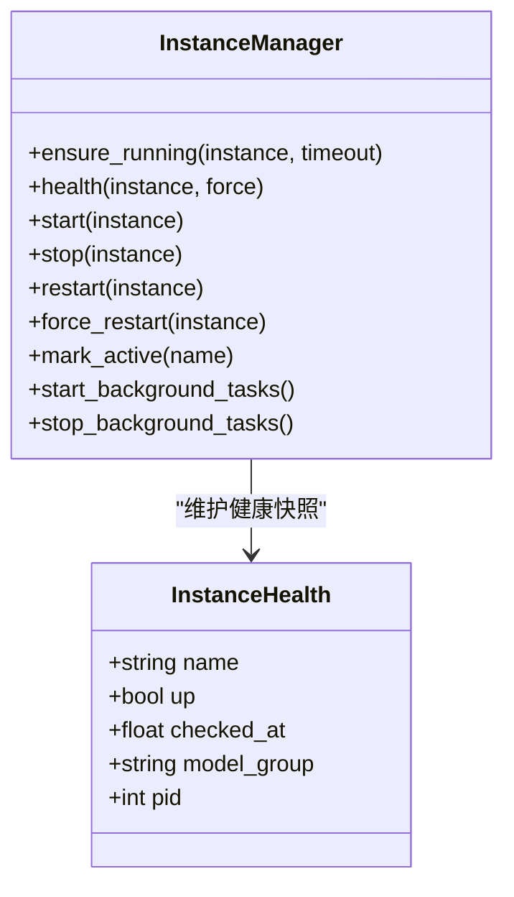
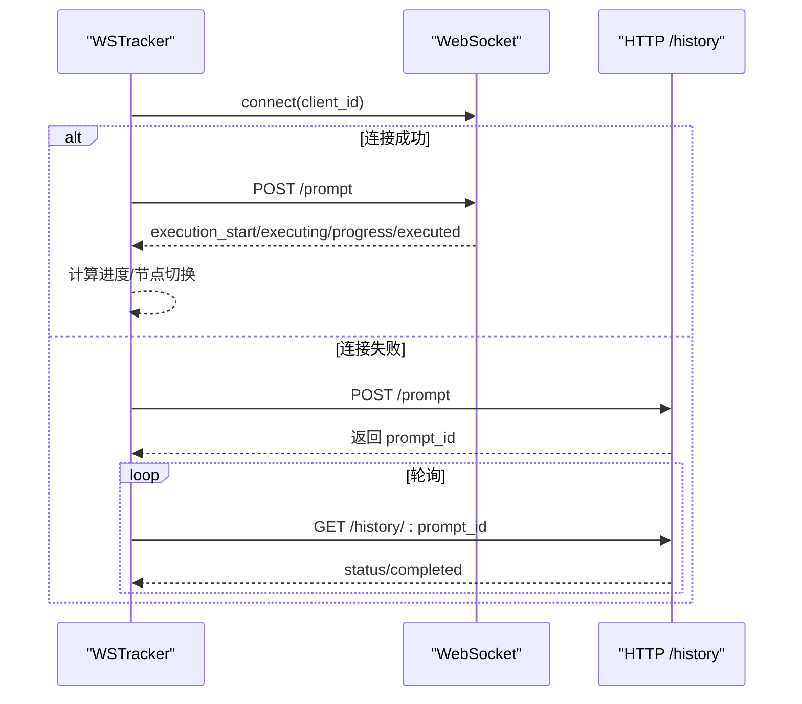
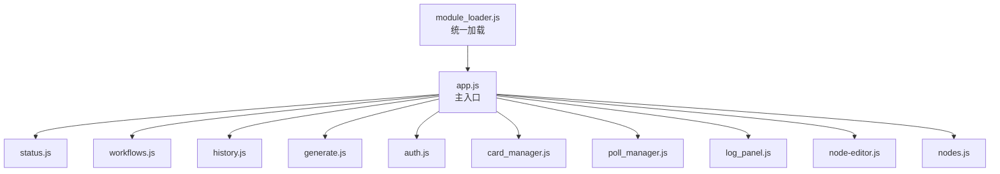
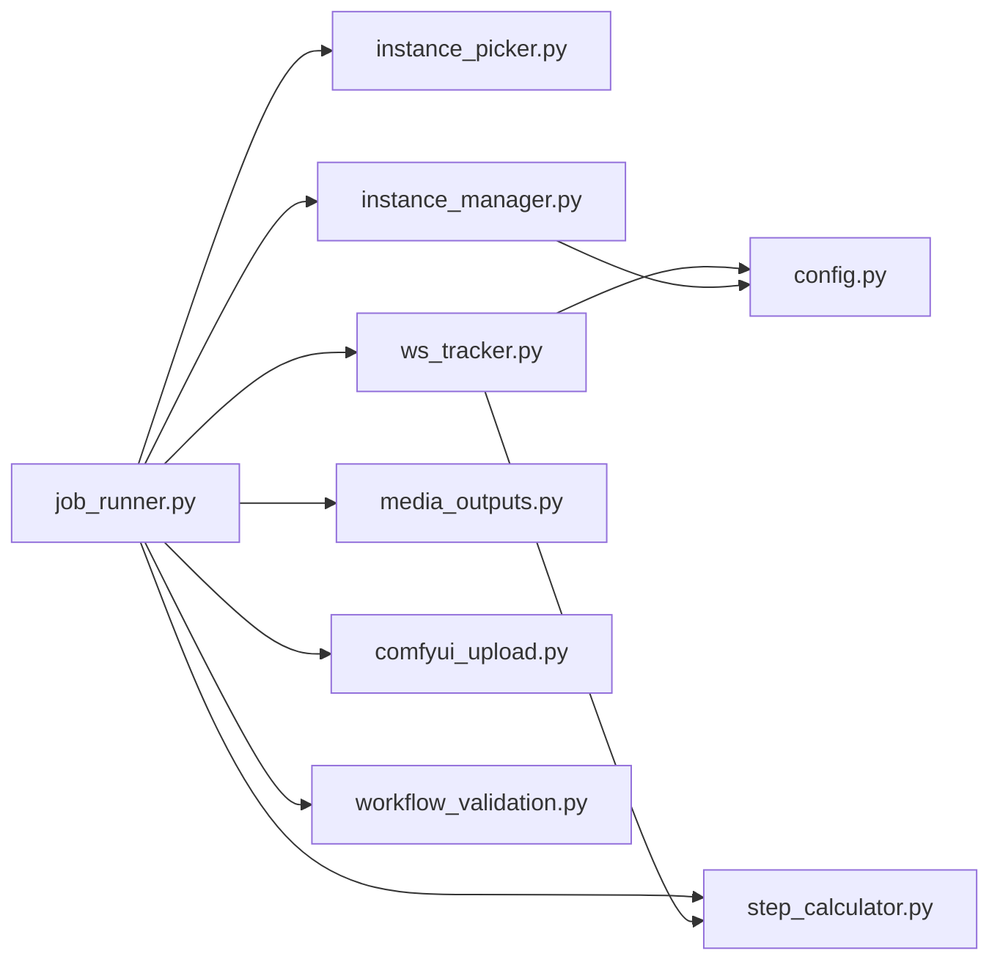

# 代码结构与组织

<cite>
**本文档引用的文件**
- [app.py](file://app.py)
- [job_runner.py](file://modules/job_runner.py)
- [instance_manager.py](file://modules/instance_manager.py)
- [ws_tracker.py](file://modules/ws_tracker.py)
- [config.py](file://modules/config.py)
- [instance_picker.py](file://modules/instance_picker.py)
- [step_calculator.py](file://modules/step_calculator.py)
- [media_outputs.py](file://modules/media_outputs.py)
- [comfyui_upload.py](file://modules/comfyui_upload.py)
- [workflow_validation.py](file://modules/workflow_validation.py)
- [module_loader.js](file://static/js/module_loader.js)
- [app.js](file://static/js/app.js)
- [PROJECT_STANDARDS.md](file://PROJECT_STANDARDS.md)
</cite>

## 目录
1. [简介](#简介)
2. [项目结构](#项目结构)
3. [核心组件](#核心组件)
4. [架构总览](#架构总览)
5. [详细组件分析](#详细组件分析)
6. [依赖分析](#依赖分析)
7. [性能考量](#性能考量)
8. [故障排查指南](#故障排查指南)
9. [结论](#结论)
10. [附录](#附录)

## 简介
本文件面向 Ez ComfyUI Showcase 项目，系统梳理其代码结构与组织方式，重点覆盖后端 Python 模块（modules 目录）、前端 JavaScript 模块（static/js/modules/）、配置与数据目录（config/、data/）等，并深入解析核心业务模块之间的职责分工、依赖关系与调用链，包括作业编排（job_runner）、实例管理（instance_manager）、实时通信（ws_tracker）等。同时提供代码组织最佳实践、文件命名规范、模块划分原则与代码复用策略，并总结关键类与函数的设计模式应用。

## 项目结构
项目采用“前后端分离 + 模块化后端”的组织方式：
- 后端核心：FastAPI 应用入口位于根目录 app.py，核心业务逻辑以模块形式分布在 modules/ 目录，按功能域拆分，职责清晰、边界明确。
- 前端核心：静态资源位于 static/，其中 static/js/modules/ 下按功能模块组织 JS 文件，通过 static/js/module_loader.js 统一加载与引导。
- 配置与数据：config/ 存放节点与常量配置，data/ 存放运行时数据、历史记录、缓存与备份等。
- 文档与脚本：docs/ 提供设计文档与规范，scripts/ 提供运维与迁移脚本，tests/ 提供测试用例。

```mermaid
graph TB
subgraph "后端"
A["app.py<br/>FastAPI 应用入口"]
M1["modules/job_runner.py<br/>作业编排"]
M2["modules/instance_manager.py<br/>实例管理"]
M3["modules/ws_tracker.py<br/>实时通信"]
M4["modules/config.py<br/>常量与分类"]
M5["modules/instance_picker.py<br/>实例选择"]
M6["modules/step_calculator.py<br/>进度计算"]
M7["modules/media_outputs.py<br/>媒体输出"]
M8["modules/comfyui_upload.py<br/>上传与同步"]
M9["modules/workflow_validation.py<br/>工作流校验"]
end
subgraph "前端"
J1["static/js/module_loader.js<br/>模块加载器"]
J2["static/js/app.js<br/>主入口与状态"]
J3["static/js/modules/*.js<br/>功能模块"]
end
subgraph "配置与数据"
C1["config/nodes.json<br/>节点配置"]
D1["data/jobs.json<br/>作业持久化"]
D2["data/history/history.json<br/>历史记录"]
D3["data/wf_configs/*.json<br/>工作流配置"]
end
A --> M1
A --> M2
A --> M3
A --> M4
A --> M5
A --> M6
A --> M7
A --> M8
A --> M9
J1 --> J2
J2 --> J3
A --- C1
A --- D1
A --- D2
A --- D3
```

**图表来源**
- [app.py](file://app.py)
- [job_runner.py](file://modules/job_runner.py)
- [instance_manager.py](file://modules/instance_manager.py)
- [ws_tracker.py](file://modules/ws_tracker.py)
- [config.py](file://modules/config.py)
- [instance_picker.py](file://modules/instance_picker.py)
- [step_calculator.py](file://modules/step_calculator.py)
- [media_outputs.py](file://modules/media_outputs.py)
- [comfyui_upload.py](file://modules/comfyui_upload.py)
- [workflow_validation.py](file://modules/workflow_validation.py)
- [module_loader.js](file://static/js/module_loader.js)
- [app.js](file://static/js/app.js)

**章节来源**
- [app.py](file://app.py)
- [module_loader.js](file://static/js/module_loader.js)
- [app.js](file://static/js/app.js)

## 核心组件
本节聚焦后端核心模块及其职责与协作关系：
- job_runner：负责从队列取出作业，串联实例选择、实例管理、进度计算、实时追踪、输出下载与历史入库等全流程。
- instance_manager：统一管理 ComfyUI 实例的生命周期，包括健康检查、冷启动、空闲回收、死实例检测与后台监控。
- ws_tracker：封装 WebSocket 与 HTTP 回退的实时进度追踪，处理执行事件、错误与超时。
- instance_picker：基于工作流类型与实例状态选择最佳实例，支持亲和性与队列深度策略。
- step_calculator：解析工作流拓扑，计算节点权重与总进度单元，支撑进度展示与估算。
- media_outputs：识别与筛选输出媒体类型，决定首选输出。
- comfyui_upload：将本地输入媒体同步到远端 ComfyUI 实例，支持旋转与裁剪等增强。
- workflow_validation：校验 API Prompt 的连接完整性，提前发现潜在提交失败问题。
- config：集中管理节点分类、模型分组与状态映射等常量。

这些模块通过依赖注入与回调机制解耦，避免直接耦合 app.py 的具体实现，便于测试与扩展。

**章节来源**
- [job_runner.py](file://modules/job_runner.py)
- [instance_manager.py](file://modules/instance_manager.py)
- [ws_tracker.py](file://modules/ws_tracker.py)
- [instance_picker.py](file://modules/instance_picker.py)
- [step_calculator.py](file://modules/step_calculator.py)
- [media_outputs.py](file://modules/media_outputs.py)
- [comfyui_upload.py](file://modules/comfyui_upload.py)
- [workflow_validation.py](file://modules/workflow_validation.py)
- [config.py](file://modules/config.py)

## 架构总览
后端采用“模块化编排 + 事件驱动”的架构风格：
- app.py 作为应用入口，负责路由、鉴权、日志、广播与状态聚合，向各模块注入回调与共享状态。
- job_runner 作为编排器，串行调用 instance_picker、instance_manager、step_calculator、ws_tracker 等模块，形成稳定的执行管线。
- ws_tracker 与 ComfyUI 实例通过 WebSocket 实时通信，必要时回退到 HTTP 轮询，确保稳定性。
- instance_manager 通过后台任务持续监控实例健康与空闲状态，保障资源利用率与可用性。

**图表来源**
- [app.py](file://app.py)
- [job_runner.py](file://modules/job_runner.py)
- [instance_picker.py](file://modules/instance_picker.py)
- [instance_manager.py](file://modules/instance_manager.py)
- [ws_tracker.py](file://modules/ws_tracker.py)

## 详细组件分析

### 作业编排器 JobRunner
- 职责：从队列取出作业，串行执行实例选择、实例冷启动、工作流准备、进度计算、实时追踪、输出下载与历史入库。
- 关键流程：
  - 实例选择：结合工作流类型、队列深度、模型组亲和性与健康状态，选择最佳实例。
  - 实例管理：通过信号量与后台任务协调并发，必要时暂停/恢复 vLLM 以释放显存。
  - 进度计算：StepCalculator 计算总单元与节点权重，支撑百分比与节点级进度。
  - 实时追踪：WSTracker 通过 WebSocket 获取实时事件，必要时回退 HTTP 轮询。
  - 输出与历史：下载输出媒体，生成缩略图，更新历史记录。
- 错误处理：对提交停滞、实例无响应、执行错误等场景进行自动纠错与重试，必要时重启实例并恢复任务。

**图表来源**
- [job_runner.py](file://modules/job_runner.py)
- [step_calculator.py](file://modules/step_calculator.py)
- [ws_tracker.py](file://modules/ws_tracker.py)

**章节来源**
- [job_runner.py](file://modules/job_runner.py)

### 实例管理器 InstanceManager
- 职责：集中管理 ComfyUI 实例生命周期，提供健康检查、冷启动、空闲回收、死实例检测与后台监控。
- 关键能力：
  - 健康快照：缓存实例健康状态，减少重复探测。
  - 冷启动去重：并发启动去重锁，避免重复冷启动。
  - 后台任务：定期检测死实例与空闲实例，自动重启或停止。
  - 与 app.py 解耦：通过回调注入启动/停止动作，保持边界清晰。

**图表来源**
- [instance_manager.py](file://modules/instance_manager.py)

**章节来源**
- [instance_manager.py](file://modules/instance_manager.py)

### 实时通信追踪器 WSTracker
- 职责：通过 WebSocket 与 ComfyUI 实例建立连接，订阅执行事件，计算进度并回退 HTTP 轮询。
- 关键机制：
  - WebSocket 连接重试与断线恢复。
  - 执行事件处理：executing/progress/executed/execution_error 等。
  - 超时与静默检测：无消息超时自动回退 HTTP。
  - PromptStartTimeout 与 PromptSubmitError 的语义化异常。

**图表来源**
- [ws_tracker.py](file://modules/ws_tracker.py)

**章节来源**
- [ws_tracker.py](file://modules/ws_tracker.py)

### 实例选择器 InstancePicker
- 职责：根据工作流类型与实例状态选择最佳实例，支持严格亲和与队列深度惩罚策略。
- 关键策略：
  - 亲和性：根据工作流关键词匹配实例名称或模型组。
  - 队列深度：综合远端队列与本地等待队列，避免热点实例过载。
  - 模型组：同组实例优先，不同组实例惩罚，提升跨实例均衡。

**章节来源**
- [instance_picker.py](file://modules/instance_picker.py)

### 进度计算引擎 StepCalculator
- 职责：解析工作流拓扑，计算节点权重与总进度单元，支撑百分比与节点级进度。
- 关键算法：
  - 节点分类：采样器、超分器、FREE、LOADER、WEIGHT_1 等。
  - 权重分配：采样/超分固定占比，其他节点按权重比例分配。
  - 链路解析：递归解析 PrimitiveInt/ComfySwitchNode 等节点的 steps 链路。
  - 拓扑排序：基于 inputs 连接关系的确定性排序。

**章节来源**
- [step_calculator.py](file://modules/step_calculator.py)

### 媒体输出与上传
- 媒体输出：识别图像/视频输出，优先返回视频，否则返回图片。
- 上传同步：扫描工作流引用的本地输入媒体，上传至远端 ComfyUI 实例，支持旋转与尺寸限制等增强。

**章节来源**
- [media_outputs.py](file://modules/media_outputs.py)
- [comfyui_upload.py](file://modules/comfyui_upload.py)

### 工作流校验
- 校验 API Prompt 的连接完整性，提前发现缺失节点与占位值，避免提交后被拒。

**章节来源**
- [workflow_validation.py](file://modules/workflow_validation.py)

### 前端模块组织
- 模块加载器 module_loader.js：统一加载核心与登录后模块，注入版本号与运行时 API 基址，确保稳定顺序与缓存控制。
- 主入口 app.js：初始化全局状态、轮询服务状态、绑定交互事件、暴露跨模块接口。
- 功能模块：icons.js、status.js、ui.js、workflows.js、history.js、generate.js、auth.js、card_manager.js、poll_manager.js、log_panel.js、node-editor.js、nodes.js 等，均通过 IIFE 模块化，通过 window.CW/window.__APP__ 共享接口。

**图表来源**
- [module_loader.js](file://static/js/module_loader.js)
- [app.js](file://static/js/app.js)

**章节来源**
- [module_loader.js](file://static/js/module_loader.js)
- [app.js](file://static/js/app.js)

## 依赖分析
- 模块内聚与耦合：
  - job_runner 依赖 instance_picker、instance_manager、step_calculator、ws_tracker、media_outputs、comfyui_upload、workflow_validation 等模块，通过依赖注入与回调解耦，避免强耦合。
  - ws_tracker 依赖 step_calculator 与 config 的节点分类与状态映射，独立于 app.py。
  - instance_manager 通过回调注入启动/停止动作，避免直接依赖 app.py 的具体实现。
- 外部依赖：
  - FastAPI、websockets、urllib、asyncio、PIL 等标准库与第三方库。
- 数据与配置：
  - config/nodes.json 提供节点与访问模板，data/ 存储作业、历史与系统设置等。

**图表来源**
- [job_runner.py](file://modules/job_runner.py)
- [instance_picker.py](file://modules/instance_picker.py)
- [instance_manager.py](file://modules/instance_manager.py)
- [ws_tracker.py](file://modules/ws_tracker.py)
- [step_calculator.py](file://modules/step_calculator.py)
- [media_outputs.py](file://modules/media_outputs.py)
- [comfyui_upload.py](file://modules/comfyui_upload.py)
- [workflow_validation.py](file://modules/workflow_validation.py)
- [config.py](file://modules/config.py)

**章节来源**
- [job_runner.py](file://modules/job_runner.py)
- [ws_tracker.py](file://modules/ws_tracker.py)
- [instance_manager.py](file://modules/instance_manager.py)
- [instance_picker.py](file://modules/instance_picker.py)
- [step_calculator.py](file://modules/step_calculator.py)
- [media_outputs.py](file://modules/media_outputs.py)
- [comfyui_upload.py](file://modules/comfyui_upload.py)
- [workflow_validation.py](file://modules/workflow_validation.py)
- [config.py](file://modules/config.py)

## 性能考量
- 并发与资源竞争：
  - 使用 asyncio.Semaphore 控制实例并发，避免多任务争抢显存。
  - 实例冷启动去重锁，避免重复冷启动带来的抖动。
- 进度计算精度：
  - StepCalculator 基于拓扑与权重分配，减少误差累积，提升 UI 体验。
- 通信与回退：
  - WebSocket 为主、HTTP 轮询为辅，降低网络波动影响。
- 后台监控：
  - 死实例检测与空闲回收，提升资源利用率与系统稳定性。

[本节为通用指导，无需特定文件引用]

## 故障排查指南
- 提交无响应/停滞：
  - 检查实例健康状态与队列深度，必要时重启实例。
  - 观察 ws_tracker 的 PromptStartTimeout 与 PromptSubmitError，定位提交阶段问题。
- 执行错误：
  - 查看 /history 返回的 execution_error 详情，结合日志定位节点与参数问题。
- 超时与静默：
  - WebSocket 静默超过阈值会自动回退 HTTP 轮询，确认 /history 可达性。
- GPU 静止：
  - 检测到 GPU 连续无波动将自动重启任务，必要时检查显存占用与驱动状态。

**章节来源**
- [ws_tracker.py](file://modules/ws_tracker.py)
- [job_runner.py](file://modules/job_runner.py)

## 结论
Ez ComfyUI Showcase 通过模块化设计与清晰的职责划分，实现了高内聚、低耦合的后端架构。核心模块围绕作业编排、实例管理与实时通信协同工作，配合前端模块化组织与统一加载器，形成了稳定、可扩展且易维护的系统。建议在后续迭代中持续完善错误诊断与可观测性，进一步优化并发与资源调度策略。

[本节为总结性内容，无需特定文件引用]

## 附录

### 代码组织最佳实践
- 文件命名规范：
  - 后端模块：小写、下划线分隔，如 job_runner.py、instance_manager.py。
  - 前端模块：小写、下划线分隔，如 status.js、workflows.js。
- 模块划分原则：
  - 单一职责：每个模块聚焦一个领域或能力。
  - 可测试性：通过依赖注入与回调解耦，便于单元测试。
  - 可复用性：公共逻辑抽取为工具模块，避免重复实现。
- 代码复用策略：
  - 抽象通用工具（如 HTTP 请求、进度计算、媒体处理）。
  - 统一错误处理与日志格式，便于集中治理。

**章节来源**
- [PROJECT_STANDARDS.md](file://PROJECT_STANDARDS.md)

### 关键类与函数的设计模式
- 工厂模式：
  - NodeCategory 与 ModelGroup 通过集中定义实现节点分类与模型分组的“工厂式”注册与查询。
- 观察者模式：
  - app.py 的广播机制与前端模块的局部更新，形成事件驱动的 UI 同步。
- 策略模式：
  - 实例选择策略（亲和性、队列深度、模型组）通过注入函数实现可插拔策略。
- 责任链/编排模式：
  - JobRunner 将多个子任务串联为流水线，统一处理错误与回退。

**章节来源**
- [config.py](file://modules/config.py)
- [instance_picker.py](file://modules/instance_picker.py)
- [job_runner.py](file://modules/job_runner.py)