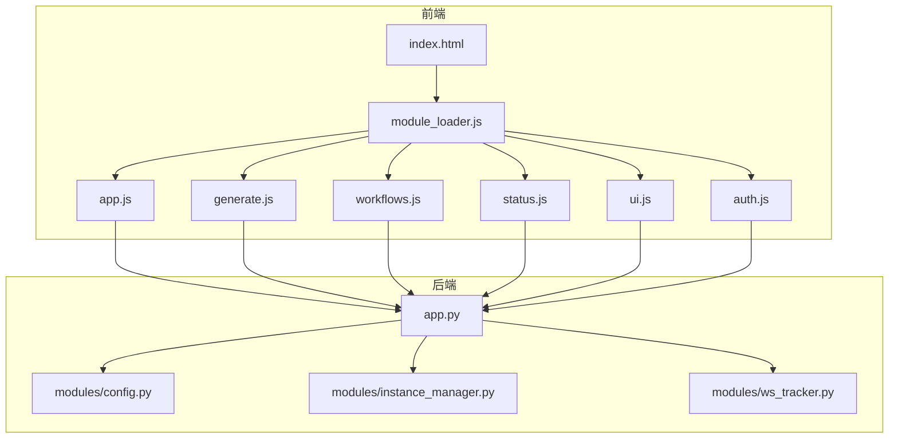
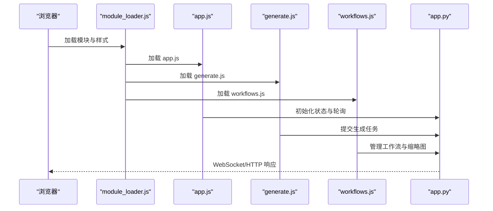
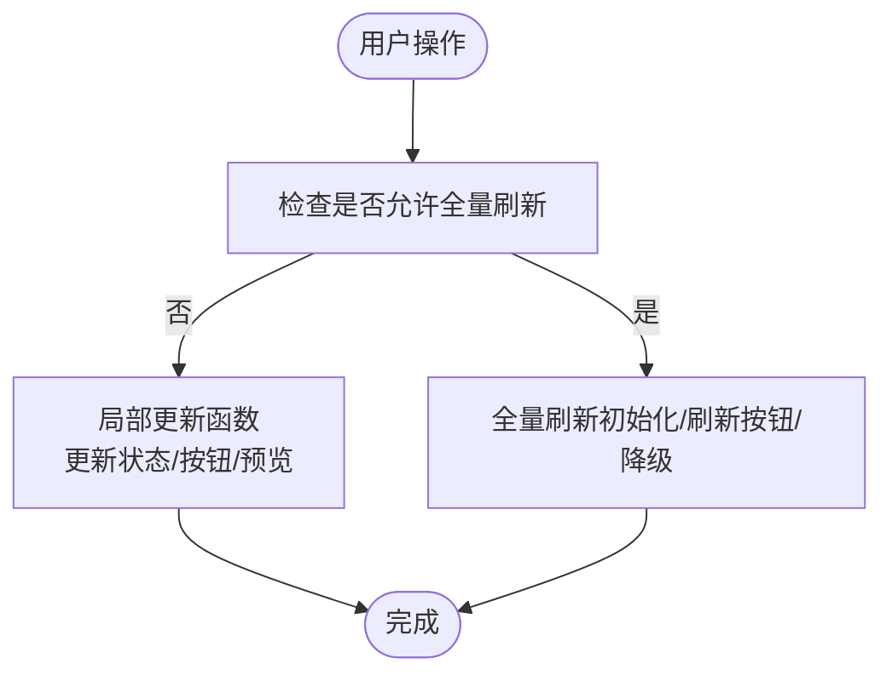
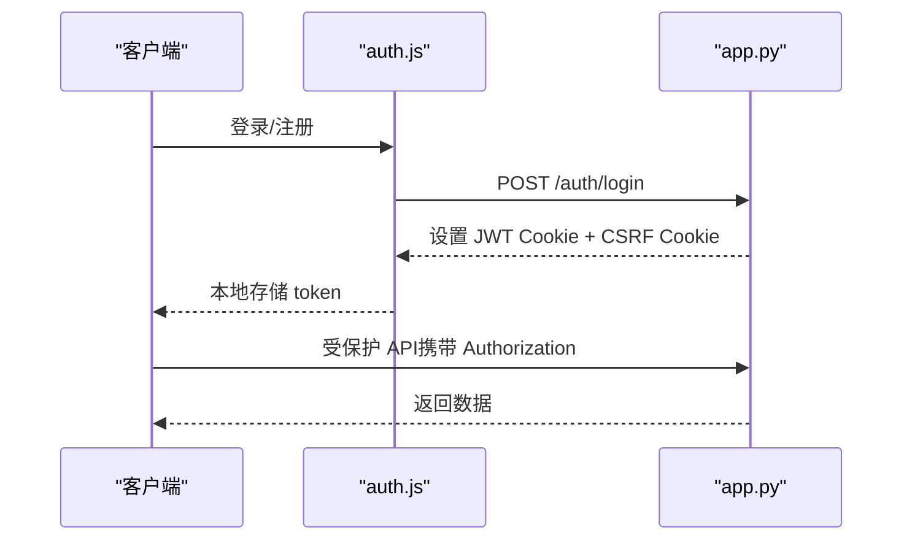
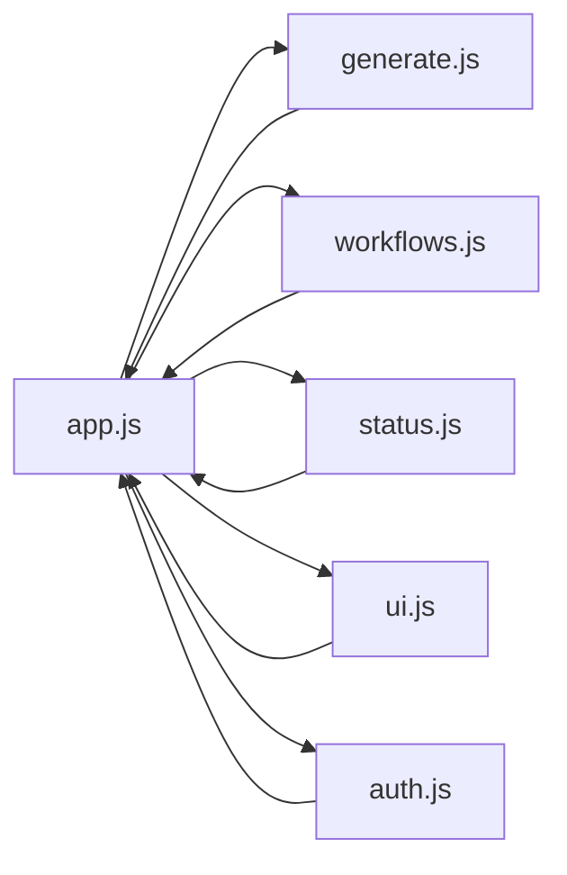
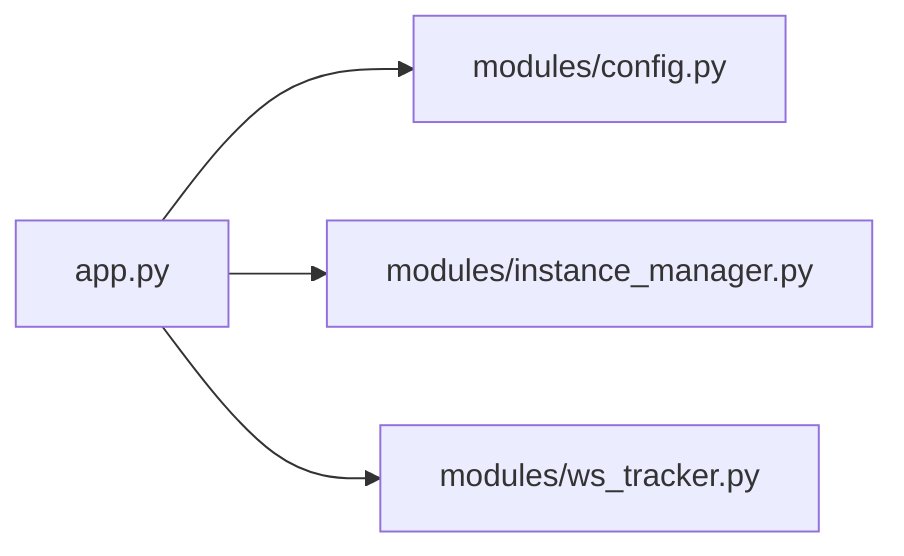

# 代码规范与最佳实践

<cite>
**本文档引用的文件**
- [PROJECT_STANDARDS.md](file://PROJECT_STANDARDS.md)
- [README.md](file://README.md)
- [app.py](file://app.py)
- [module_loader.js](file://static/js/module_loader.js)
- [app.js](file://static/js/app.js)
- [workflows.js](file://static/js/modules/workflows.js)
- [generate.js](file://static/js/modules/generate.js)
- [config.py](file://modules/config.py)
- [instance_manager.py](file://modules/instance_manager.py)
- [ws_tracker.py](file://modules/ws_tracker.py)
- [test_css_loading.py](file://tests/test_css_loading.py)
- [test_security_controls.py](file://tests/test_security_controls.py)
- [test_status_button_runtime.py](file://tests/test_status_button_runtime.py)
- [test_poll_manager_resume.py](file://tests/test_poll_manager_resume.py)
- [V4_PHASE1_IMPLEMENTATION.md](file://docs/archive/root-md-2026-06-03/V4_PHASE1_IMPLEMENTATION.md)
</cite>

## 目录
1. [引言](#引言)
2. [项目结构](#项目结构)
3. [核心组件](#核心组件)
4. [架构概览](#架构概览)
5. [详细组件分析](#详细组件分析)
6. [依赖关系分析](#依赖关系分析)
7. [性能考虑](#性能考虑)
8. [故障排查指南](#故障排查指南)
9. [结论](#结论)
10. [附录](#附录)

## 引言
本文件面向 Ez ComfyUI Showcase 项目的开发者与维护者，系统化梳理并制定代码规范与最佳实践，覆盖 Python 后端与 JavaScript 前端两部分，同时结合项目既有规范与测试用例，形成可落地的工程化标准。目标是统一风格、提升可维护性、保障安全性与性能。

## 项目结构
项目采用前后端分离的单页应用（SPA）架构：
- 后端：FastAPI 应用，提供 REST API、WebSocket 推送、静态资源托管
- 前端：Vanilla JS 模块化架构，通过模块加载器统一加载与初始化
- 模块化组织：前端以 ES6 IIFE 模块形式组织，后端以 Python 模块化组织

**图表来源**
- [module_loader.js:14-31](file://static/js/module_loader.js#L14-L31)
- [app.js:630-728](file://static/js/app.js#L630-L728)
- [app.py:18-28](file://app.py#L18-L28)

**章节来源**
- [README.md:40-59](file://README.md#L40-L59)
- [module_loader.js:14-31](file://static/js/module_loader.js#L14-L31)
- [app.js:630-728](file://static/js/app.js#L630-L728)

## 核心组件
- 前端模块化与加载
  - 模块加载顺序与版本控制：通过模块加载器统一加载核心模块与登录后模块，确保样式与脚本加载顺序正确
  - 全局状态共享：通过 window.__APP__ 暴露共享工具与状态，模块间通过 window.CW 导出公开接口
- 后端模块化与职责
  - 配置与常量：集中定义节点分类、模型分组与状态映射
  - 实例管理：负责实例生命周期、健康检查、空闲回收与死实例检测
  - WebSocket 追踪：封装 WebSocket 通信、进度追踪与 HTTP 回退机制

**章节来源**
- [module_loader.js:14-31](file://static/js/module_loader.js#L14-L31)
- [app.js:86-111](file://static/js/app.js#L86-L111)
- [config.py:11-152](file://modules/config.py#L11-L152)
- [instance_manager.py:43-215](file://modules/instance_manager.py#L43-L215)
- [ws_tracker.py:160-280](file://modules/ws_tracker.py#L160-L280)

## 架构概览
系统采用“后端 API + 前端模块化”的分层设计，前端通过模块加载器统一初始化，后端通过 FastAPI 提供 REST 与 WebSocket 服务。

**图表来源**
- [module_loader.js:110-143](file://static/js/module_loader.js#L110-L143)
- [app.js:630-728](file://static/js/app.js#L630-L728)
- [generate.js:1-50](file://static/js/modules/generate.js#L1-L50)
- [workflows.js:1-50](file://static/js/modules/workflows.js#L1-L50)
- [app.py:18-28](file://app.py#L18-L28)

## 详细组件分析

### 前端模块化与加载规范
- 模块结构
  - 使用 IIFE 包裹，严格模式，从 window.__APP__ 获取共享工具，通过 window.CW 导出公开接口
  - 私有函数以下划线开头，禁止模块间直接引用对方的私有变量
- 加载顺序
  - 样式优先于脚本加载，确保 UI 渲染一致性
  - 模块加载顺序固定，登录后模块按需加载
- DOM 更新策略
  - 局部刷新：用户操作触发的 UI 更新不得全量刷新页面，仅更新受影响区域
  - 数据定位：每个可操作元素设置 data-* 属性用于 DOM 定位
  - 例外：页面初始化、用户点击刷新、局部更新失败时的异常降级允许全量刷新

**图表来源**
- [PROJECT_STANDARDS.md:8-44](file://PROJECT_STANDARDS.md#L8-L44)

**章节来源**
- [PROJECT_STANDARDS.md:52-94](file://PROJECT_STANDARDS.md#L52-L94)
- [module_loader.js:110-143](file://static/js/module_loader.js#L110-L143)
- [app.js:86-111](file://static/js/app.js#L86-L111)
- [workflows.js:459-491](file://static/js/modules/workflows.js#L459-L491)

### JavaScript 代码规范
- ES6+ 语法与模块化
  - 使用 IIFE 组织模块，严格模式，避免全局污染
  - 通过 window.CW 暴露公共接口，模块间通过命名空间通信
- DOM 操作最佳实践
  - 禁止行内样式，样式统一在 CSS 中定义
  - 使用类名切换替代内联样式属性
  - 通过 data-* 属性进行元素定位与交互
- 图标系统
  - 使用项目内置 SVG 图标系统 CW.icon()，不得使用 emoji/unicode 字符作为图标
- 事件与交互
  - 使用 requestAnimationFrame 优化动画与过渡
  - 通过 escH/escA 对用户输入进行安全转义

**章节来源**
- [PROJECT_STANDARDS.md:96-162](file://PROJECT_STANDARDS.md#L96-L162)
- [app.js:38-77](file://static/js/app.js#L38-L77)

### Python 后端代码规范
- 模块化与职责
  - config.py：集中管理常量、节点分类、模型分组与状态映射
  - instance_manager.py：实例生命周期管理、健康检查、空闲回收、死实例检测
  - ws_tracker.py：WebSocket 通信、进度追踪、HTTP 回退与断线重连
- 异步与并发
  - 使用 asyncio 提供异步能力，合理使用信号量控制实例并发
  - 通过后台任务处理死实例检测与空闲回收
- 错误处理与可观测性
  - 统一的日志缓冲与持久化，支持错误与进度追踪
  - 对外暴露友好的错误信息，屏蔽内部细节

**章节来源**
- [config.py:11-152](file://modules/config.py#L11-L152)
- [instance_manager.py:43-215](file://modules/instance_manager.py#L43-L215)
- [ws_tracker.py:160-280](file://modules/ws_tracker.py#L160-L280)
- [app.py:116-176](file://app.py#L116-L176)

### 安全编程实践
- 前端安全
  - 禁止行内样式，避免 XSS 风险
  - 使用转义函数（escH/escA）处理用户输入
  - 图标系统统一使用 SVG，避免字符注入风险
- 后端安全
  - JWT 认证与 CSRF 令牌校验，Cookie 安全属性配置
  - 登录速率限制，防暴力破解
  - 上传文件大小限制与读取器保护

**图表来源**
- [V4_PHASE1_IMPLEMENTATION.md:31-58](file://docs/archive/root-md-2026-06-03/V4_PHASE1_IMPLEMENTATION.md#L31-L58)
- [app.py:2506-2538](file://app.py#L2506-L2538)
- [test_security_controls.py:15-34](file://tests/test_security_controls.py#L15-L34)

**章节来源**
- [PROJECT_STANDARDS.md:96-162](file://PROJECT_STANDARDS.md#L96-L162)
- [V4_PHASE1_IMPLEMENTATION.md:31-58](file://docs/archive/root-md-2026-06-03/V4_PHASE1_IMPLEMENTATION.md#L31-L58)
- [app.py:2506-2538](file://app.py#L2506-L2538)
- [test_security_controls.py:15-34](file://tests/test_security_controls.py#L15-L34)

### 性能优化指南
- 前端性能
  - 局部刷新减少 DOM 重绘与回流
  - 使用 requestAnimationFrame 优化动画与过渡
  - 样式与脚本加载顺序优化，避免阻塞渲染
- 后端性能
  - 实例信号量与并发控制，避免资源争用
  - WebSocket 与 HTTP 双通道回退，提升稳定性
  - 健康检查缓存与空闲回收，降低无效负载

**章节来源**
- [PROJECT_STANDARDS.md:8-44](file://PROJECT_STANDARDS.md#L8-L44)
- [instance_manager.py:51-84](file://modules/instance_manager.py#L51-L84)
- [ws_tracker.py:176-189](file://modules/ws_tracker.py#L176-L189)

### 可维护性设计原则
- 单一职责：模块职责清晰，接口稳定
- 解耦合：通过 window.__APP__ 与 window.CW 进行松耦合通信
- 可测试性：前端与后端均提供测试用例，覆盖关键路径

**章节来源**
- [module_loader.js:110-143](file://static/js/module_loader.js#L110-L143)
- [test_css_loading.py:8-21](file://tests/test_css_loading.py#L8-L21)
- [test_poll_manager_resume.py:43-83](file://tests/test_poll_manager_resume.py#L43-L83)

### 重构指导原则
- 代码异味识别
  - 全量刷新页面、行内样式、硬编码字符串、重复逻辑
- 重构时机
  - 影响范围小、风险可控的模块优先
- 测试驱动
  - 先写测试，再重构，确保行为不变

**章节来源**
- [PROJECT_STANDARDS.md:8-44](file://PROJECT_STANDARDS.md#L8-L44)
- [test_status_button_runtime.py:42-56](file://tests/test_status_button_runtime.py#L42-L56)

### 文档编写规范
- API 文档
  - 使用 OpenAPI 风格描述端点、请求体、响应体与错误码
- 架构文档
  - 以图示方式展示模块关系与数据流
- 用户文档
  - 以用户视角描述功能与操作流程

**章节来源**
- [README.md:87-98](file://README.md#L87-L98)
- [V4_PHASE1_IMPLEMENTATION.md:31-58](file://docs/archive/root-md-2026-06-03/V4_PHASE1_IMPLEMENTATION.md#L31-L58)

## 依赖关系分析
前端模块依赖关系如下：

**图表来源**
- [module_loader.js:14-31](file://static/js/module_loader.js#L14-L31)
- [app.js:630-728](file://static/js/app.js#L630-L728)

后端模块依赖关系如下：

**图表来源**
- [app.py:29-58](file://app.py#L29-L58)

**章节来源**
- [module_loader.js:14-31](file://static/js/module_loader.js#L14-L31)
- [app.py:29-58](file://app.py#L29-L58)

## 性能考虑
- 前端
  - 局部刷新与 requestAnimationFrame 优化渲染性能
  - 样式与脚本加载顺序优化，减少阻塞
- 后端
  - 实例信号量与健康检查缓存，降低资源争用与网络开销
  - WebSocket 与 HTTP 双通道回退，提升稳定性与吞吐

**章节来源**
- [PROJECT_STANDARDS.md:8-44](file://PROJECT_STANDARDS.md#L8-L44)
- [instance_manager.py:51-84](file://modules/instance_manager.py#L51-L84)
- [ws_tracker.py:176-189](file://modules/ws_tracker.py#L176-L189)

## 故障排查指南
- 前端
  - 检查模块加载顺序与版本号，确保样式在脚本之前加载
  - 使用测试用例验证状态按钮运行时行为
- 后端
  - 检查 JWT 与 CSRF 校验是否通过
  - 验证上传文件大小限制与读取器保护

**章节来源**
- [test_css_loading.py:8-21](file://tests/test_css_loading.py#L8-L21)
- [test_status_button_runtime.py:42-56](file://tests/test_status_button_runtime.py#L42-L56)
- [test_security_controls.py:15-34](file://tests/test_security_controls.py#L15-L34)

## 结论
本规范在现有项目实践基础上，明确了前后端的编码风格、模块化组织、安全与性能策略，并提供了可落地的测试与故障排查建议。遵循本规范有助于提升代码质量、可维护性与用户体验。

## 附录
- 术语
  - IIFE：立即执行函数表达式
  - CSRF：跨站请求伪造
  - JWT：JSON Web Token
- 参考
  - 项目技术栈与目录结构说明

**章节来源**
- [README.md:30-59](file://README.md#L30-L59)