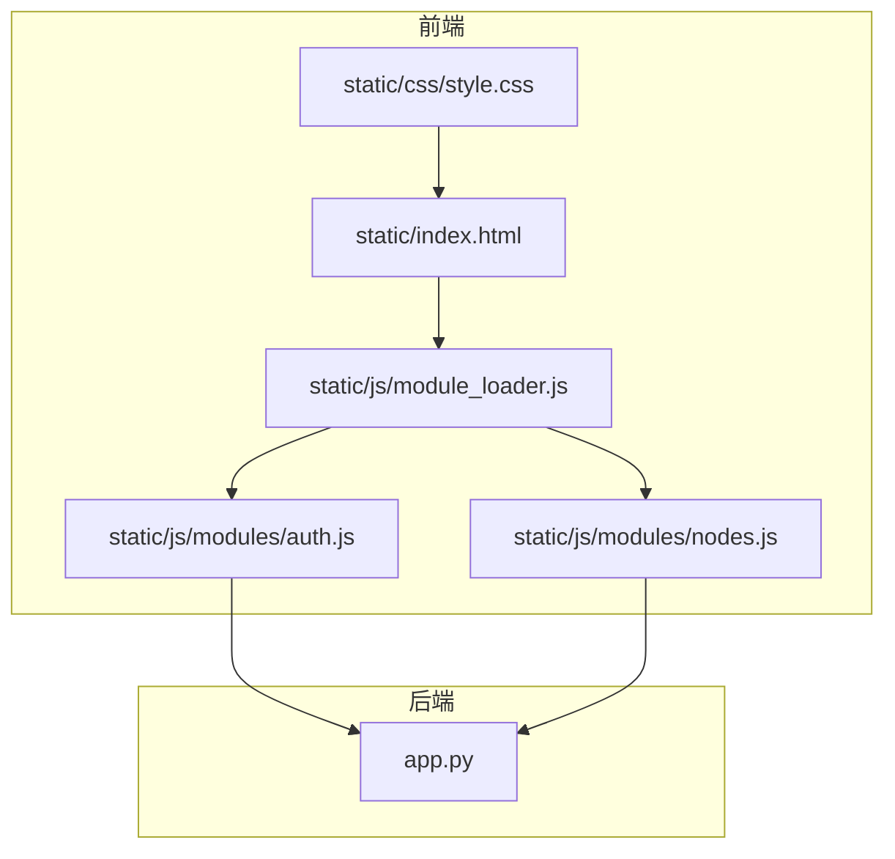
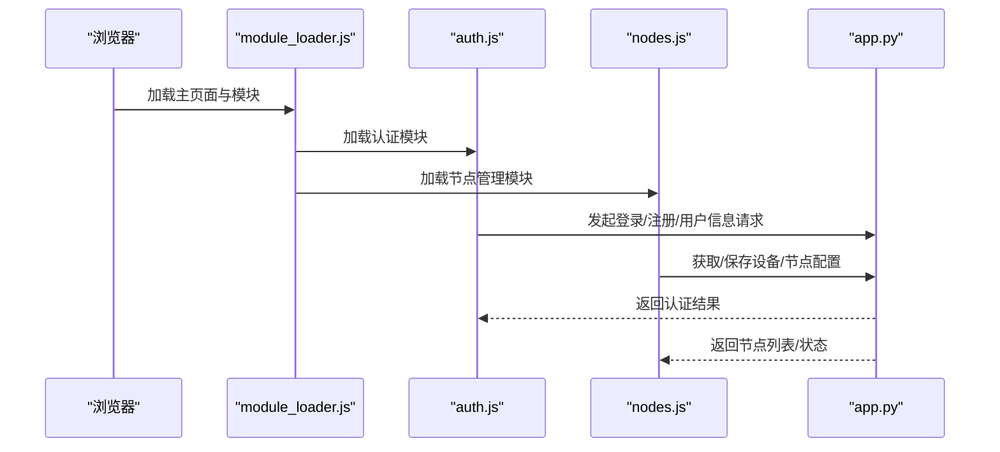
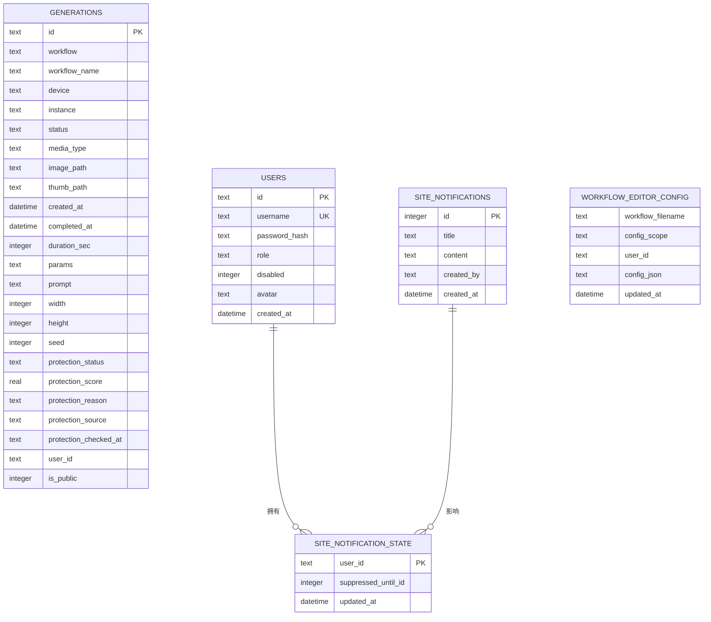
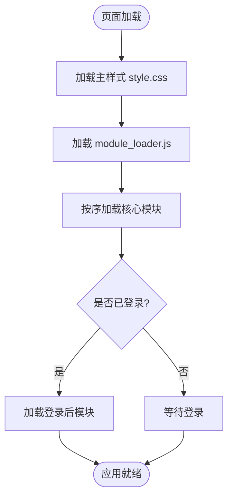
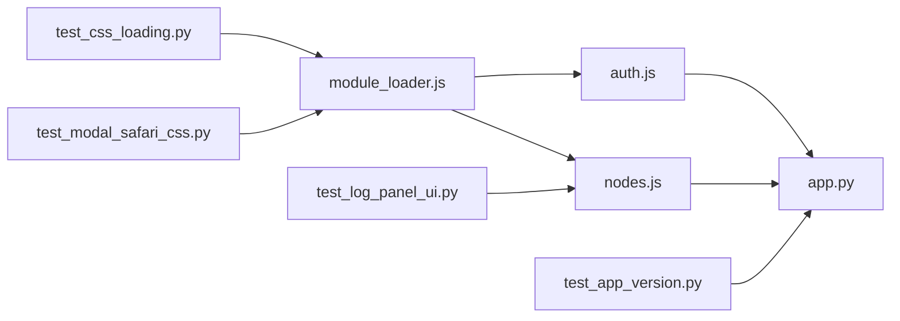

# 开发环境搭建

<cite>
**本文引用的文件**
- [app.py](file://app.py)
- [module_loader.js](file://static/js/module_loader.js)
- [index.html](file://static/index.html)
- [style.css](file://static/css/style.css)
- [auth.js](file://static/js/modules/auth.js)
- [nodes.js](file://static/js/modules/nodes.js)
- [test_app_version.py](file://tests/test_app_version.py)
- [test_css_loading.py](file://tests/test_css_loading.py)
- [test_modal_safari_css.py](file://tests/test_modal_safari_css.py)
- [test_log_panel_ui.py](file://tests/test_log_panel_ui.py)
- [V4_PHASE1_IMPLEMENTATION.md](file://docs/archive/root-md-2026-06-03/V4_PHASE1_IMPLEMENTATION.md)
- [USER_GUIDE.md](file://docs/USER_GUIDE.md)
- [import_v3_history.py](file://scripts/import_v3_history.py)
</cite>

## 目录
1. [简介](#简介)
2. [项目结构](#项目结构)
3. [核心组件](#核心组件)
4. [架构总览](#架构总览)
5. [详细组件分析](#详细组件分析)
6. [依赖关系分析](#依赖关系分析)
7. [性能考虑](#性能考虑)
8. [故障排查指南](#故障排查指南)
9. [结论](#结论)
10. [附录](#附录)

## 简介
本指南面向 Ez ComfyUI Showcase 项目的开发者，提供从零到一的开发环境搭建与运行流程，涵盖：
- Python 3.14 环境配置与虚拟环境
- 依赖安装与版本约束
- VS Code 开发工具与调试配置
- 本地开发服务器启动与热重载
- 数据库初始化（SQLite）与历史数据迁移
- 前端开发环境与静态资源加载
- 常用开发命令与脚本

## 项目结构
项目采用前后端分离的单页应用架构：
- 后端基于 Python（FastAPI），提供 API 服务与工作流管理
- 前端为纯静态资源（HTML/CSS/JS），通过统一模块加载器按需加载功能模块
- 数据存储以 SQLite 为主，包含生成记录、用户认证、站点通知等表

图表来源
- [index.html](file://static/index.html)
- [module_loader.js](file://static/js/module_loader.js)
- [auth.js](file://static/js/modules/auth.js)
- [nodes.js](file://static/js/modules/nodes.js)
- [app.py](file://app.py)

章节来源
- [index.html](file://static/index.html)
- [module_loader.js](file://static/js/module_loader.js)
- [app.py](file://app.py)

## 核心组件
- 后端应用与数据库初始化：负责生成记录、认证、站点通知等数据库表的创建与迁移
- 前端模块加载器：统一加载核心与登录后的模块，确保加载顺序与缓存版本号一致
- 认证模块：提供登录/注册/令牌管理与请求拦截
- 设备与节点管理：提供设备编辑、连接测试、实例启停等能力
- 版本与测试：版本号校验与前端资源加载契约测试

章节来源
- [app.py](file://app.py)
- [module_loader.js](file://static/js/module_loader.js)
- [auth.js](file://static/js/modules/auth.js)
- [nodes.js](file://static/js/modules/nodes.js)
- [test_app_version.py](file://tests/test_app_version.py)
- [test_css_loading.py](file://tests/test_css_loading.py)
- [test_modal_safari_css.py](file://tests/test_modal_safari_css.py)

## 架构总览
后端通过 FastAPI 暴露 REST API，前端通过模块加载器动态加载 JS 模块并与后端交互。静态资源通过版本查询参数进行缓存控制。

图表来源
- [module_loader.js](file://static/js/module_loader.js)
- [auth.js](file://static/js/modules/auth.js)
- [nodes.js](file://static/js/modules/nodes.js)
- [app.py](file://app.py)

## 详细组件分析

### 后端应用与数据库初始化
- 生成记录表（generations）：用于存储生成任务的状态、媒体路径、提示词、尺寸、种子等
- 认证表（users、site_notifications、site_notification_state）：用户、站点通知与状态
- 工作流配置表（workflow_editor_config）：全局工作流编辑器配置
- 历史数据迁移脚本：将 V3 历史记录导入 V4 SQLite

图表来源
- [app.py](file://app.py)
- [import_v3_history.py](file://scripts/import_v3_history.py)

章节来源
- [app.py](file://app.py)
- [import_v3_history.py](file://scripts/import_v3_history.py)

### 前端模块加载器与静态资源
- 模块加载顺序：核心模块（如状态、UI、工作流、历史、生成、认证、卡片管理、轮询）优先加载；登录后加载日志面板、节点编辑器、节点管理等
- 版本号控制：通过查询参数对模块与样式进行缓存失效控制
- 样式加载契约：主样式在模块加载器之前加载，保证 UI 渲染一致性

图表来源
- [module_loader.js](file://static/js/module_loader.js)
- [index.html](file://static/index.html)
- [style.css](file://static/css/style.css)

章节来源
- [module_loader.js](file://static/js/module_loader.js)
- [test_css_loading.py](file://tests/test_css_loading.py)
- [test_modal_safari_css.py](file://tests/test_modal_safari_css.py)

### 认证模块与系统设置
- 认证模块负责登录/注册弹窗、令牌持久化、请求拦截器（自动附加 Authorization 头）
- 系统设置包含 LLM API 配置与图像保护策略，前端通过系统设置接口读写

章节来源
- [auth.js](file://static/js/modules/auth.js)
- [app.py](file://app.py)

### 设备与节点管理
- 提供设备编辑器、连接测试、实例启停、扫描与应用扫描结果等功能
- 支持 SSH 连接配置（用户、端口、认证方式）

章节来源
- [nodes.js](file://static/js/modules/nodes.js)
- [index.html](file://static/index.html)

## 依赖关系分析
- 前端模块依赖：module_loader.js 统一调度各模块；auth.js 与 nodes.js 依赖后端 API
- 后端依赖：app.py 负责路由、数据库初始化与业务逻辑
- 测试依赖：单元测试验证版本号、样式加载契约、日志面板 UI 行为

图表来源
- [module_loader.js](file://static/js/module_loader.js)
- [auth.js](file://static/js/modules/auth.js)
- [nodes.js](file://static/js/modules/nodes.js)
- [app.py](file://app.py)
- [test_app_version.py](file://tests/test_app_version.py)
- [test_css_loading.py](file://tests/test_css_loading.py)
- [test_modal_safari_css.py](file://tests/test_modal_safari_css.py)
- [test_log_panel_ui.py](file://tests/test_log_panel_ui.py)

章节来源
- [test_app_version.py](file://tests/test_app_version.py)
- [test_css_loading.py](file://tests/test_css_loading.py)
- [test_modal_safari_css.py](file://tests/test_modal_safari_css.py)
- [test_log_panel_ui.py](file://tests/test_log_panel_ui.py)

## 性能考虑
- 前端缓存控制：通过版本查询参数避免浏览器缓存导致的样式/脚本不一致
- 日志面板渲染优化：按组与条目增量更新，减少 DOM 重排
- GPU/内存监控：后端通过 nvidia-smi 或系统内存接口获取资源使用情况，便于诊断性能瓶颈

章节来源
- [module_loader.js](file://static/js/module_loader.js)
- [style.css](file://static/css/style.css)
- [app.py](file://app.py)

## 故障排查指南
- 版本不一致：若前端显示版本与后端不一致，检查 VERSION 文件与后端版本暴露逻辑
- 样式未加载：确认主样式在模块加载器之前加载，并检查版本查询参数
- 日志面板异常：检查日志面板 DOM 结构与过滤器状态，确认模块加载顺序
- 浏览器兼容性：参考用户指南中的浏览器支持说明，优先使用最新版 Chrome/Edge/Firefox

章节来源
- [test_app_version.py](file://tests/test_app_version.py)
- [test_css_loading.py](file://tests/test_css_loading.py)
- [test_modal_safari_css.py](file://tests/test_modal_safari_css.py)
- [test_log_panel_ui.py](file://tests/test_log_panel_ui.py)
- [USER_GUIDE.md](file://docs/USER_GUIDE.md)

## 结论
本指南提供了从环境准备到项目运行的完整路径，结合后端数据库初始化、前端模块加载与认证系统，帮助开发者快速上手 Ez ComfyUI Showcase 的开发与调试。

## 附录

### 环境准备与虚拟环境
- Python 版本：使用 Python 3.14 创建隔离环境
- 虚拟环境：建议使用 venv 或 conda 创建独立环境
- 安装依赖：后端使用 FastAPI，前端为静态资源，无需额外打包

章节来源
- [app.py](file://app.py)

### 开发工具与 VS Code 配置
- 推荐插件：Python、Pylance、ESLint、Prettier、Live Server（用于本地预览）
- 调试配置：使用 Python 启动后端 FastAPI 应用；前端使用 Live Server 打开 static/index.html
- 代码格式化：前端 JS 使用 Prettier，后端 Python 使用 black/pytest 风格

章节来源
- [module_loader.js](file://static/js/module_loader.js)
- [auth.js](file://static/js/modules/auth.js)
- [nodes.js](file://static/js/modules/nodes.js)

### 本地开发服务器与热重载
- 后端：使用 uvicorn 或直接运行 app.py 启动 FastAPI 服务
- 前端：使用 Live Server 或简易 HTTP 服务器打开 static/index.html
- 热重载：前端静态资源变更即时生效；后端 Python 变更需重启服务

章节来源
- [app.py](file://app.py)
- [index.html](file://static/index.html)

### 数据库配置与初始化
- SQLite 数据库：生成记录、认证、站点通知、工作流配置等表由后端初始化
- 历史数据迁移：使用 scripts/import_v3_history.py 将历史记录导入新数据库

章节来源
- [app.py](file://app.py)
- [import_v3_history.py](file://scripts/import_v3_history.py)

### 前端开发环境配置
- 静态资源加载：主样式 style.css 在模块加载器之前加载，模块通过版本查询参数缓存控制
- 模块依赖管理：通过 module_loader.js 统一管理加载顺序
- 兼容性测试：参考用户指南中的浏览器支持说明

章节来源
- [module_loader.js](file://static/js/module_loader.js)
- [style.css](file://static/css/style.css)
- [USER_GUIDE.md](file://docs/USER_GUIDE.md)

### 常用开发命令与脚本
- 启动后端：运行后端应用文件
- 运行测试：使用 pytest 执行 tests 目录下的测试用例
- 代码检查：前端使用 ESLint/Prettier，后端使用 Python 风格检查工具
- 历史数据导入：执行 scripts/import_v3_history.py

章节来源
- [test_app_version.py](file://tests/test_app_version.py)
- [import_v3_history.py](file://scripts/import_v3_history.py)