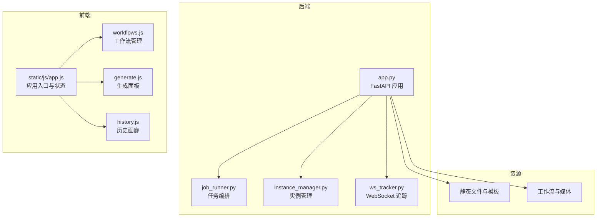
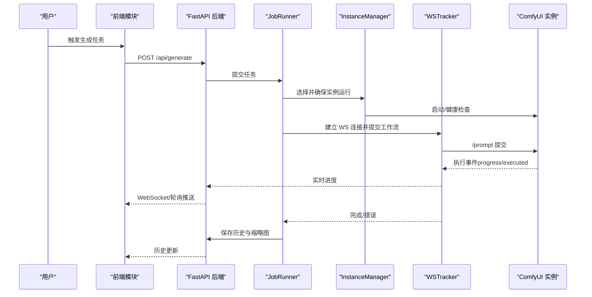
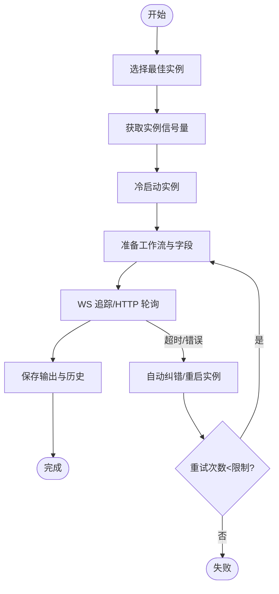
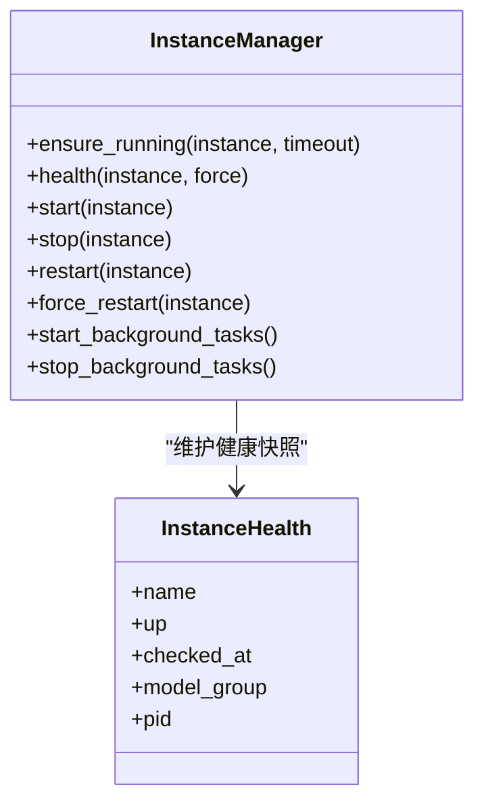
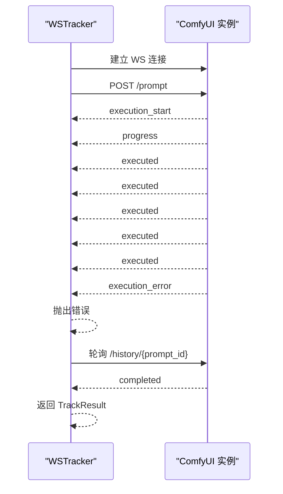
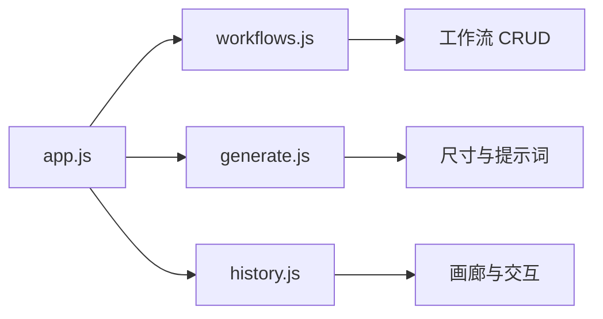
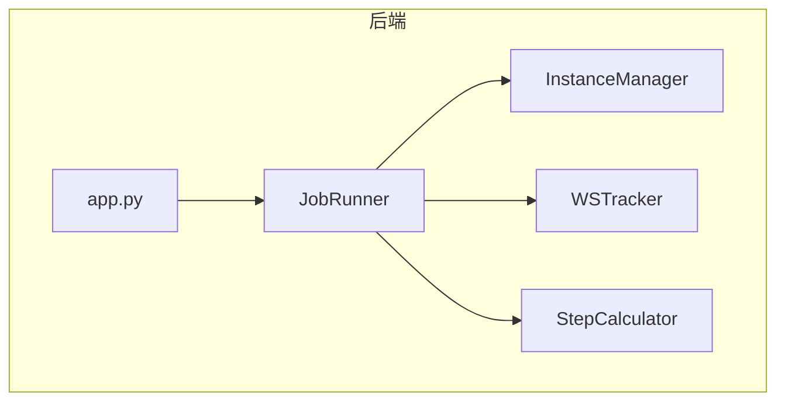

# 开发者指南

<cite>
**本文档引用的文件**
- [app.py](file://app.py)
- [README.md](file://README.md)
- [PROJECT_STANDARDS.md](file://PROJECT_STANDARDS.md)
- [BRANCHING.md](file://BRANCHING.md)
- [modules/job_runner.py](file://modules/job_runner.py)
- [modules/instance_manager.py](file://modules/instance_manager.py)
- [modules/ws_tracker.py](file://modules/ws_tracker.py)
- [static/js/app.js](file://static/js/app.js)
- [static/js/modules/workflows.js](file://static/js/modules/workflows.js)
- [static/js/modules/generate.js](file://static/js/modules/generate.js)
- [static/js/modules/history.js](file://static/js/modules/history.js)
</cite>

## 目录
1. [简介](#简介)
2. [项目结构](#项目结构)
3. [核心组件](#核心组件)
4. [架构概览](#架构概览)
5. [详细组件分析](#详细组件分析)
6. [依赖关系分析](#依赖关系分析)
7. [性能考虑](#性能考虑)
8. [故障排查指南](#故障排查指南)
9. [结论](#结论)
10. [附录](#附录)

## 简介
Ez ComfyUI Showcase 是一个基于 Python FastAPI 的 ComfyUI Web 管理与生成平台，支持多实例调度、实时进度追踪、GPU 监控、工作流管理与历史画廊等功能。项目采用前后端分离架构，后端负责任务编排、实例管理、WebSocket 追踪与持久化，前端以 ES6 模块化方式组织，提供三段式 UI（工作流管理、生成面板、历史画廊）。

## 项目结构
项目采用模块化分层设计：
- 后端核心：FastAPI 应用入口与路由、任务编排、实例管理、WebSocket 追踪、日志与监控
- 前端模块：ES6 模块化 JavaScript，通过 app.js 注册与共享状态，各模块职责清晰
- 数据与资源：工作流 JSON、缩略图、输出媒体、配置与版本信息
- 文档与规范：项目开发规范、分支策略、变更记录与版本管理

**图表来源**
- [app.py](file://app.py)
- [modules/job_runner.py](file://modules/job_runner.py)
- [modules/instance_manager.py](file://modules/instance_manager.py)
- [modules/ws_tracker.py](file://modules/ws_tracker.py)
- [static/js/app.js](file://static/js/app.js)
- [static/js/modules/workflows.js](file://static/js/modules/workflows.js)
- [static/js/modules/generate.js](file://static/js/modules/generate.js)
- [static/js/modules/history.js](file://static/js/modules/history.js)

**章节来源**
- [README.md](file://README.md)
- [app.py](file://app.py)

## 核心组件
- 任务编排器（JobRunner）：串联实例选择、实例管理、进度计算、WebSocket 追踪、输出保存与历史入库，统一处理提交超时、实例重启与恢复
- 实例管理器（InstanceManager）：负责实例健康检查、冷启动、空闲回收、死实例检测与后台监控
- WebSocket 追踪器（WSTracker）：建立 WebSocket 连接、提交工作流、实时进度追踪、断线退化 HTTP 轮询与超时处理
- 前端模块系统：app.js 作为入口与状态中心，workflows.js、generate.js、history.js 分别负责工作流管理、生成面板与历史画廊

**章节来源**
- [modules/job_runner.py](file://modules/job_runner.py)
- [modules/instance_manager.py](file://modules/instance_manager.py)
- [modules/ws_tracker.py](file://modules/ws_tracker.py)
- [static/js/app.js](file://static/js/app.js)

## 架构概览
系统采用事件驱动与模块化设计，后端通过 FastAPI 提供 REST API，前端通过 WebSocket 与轮询获取实时状态，形成“任务编排-实例管理-进度追踪-前端渲染”的闭环。

**图表来源**
- [app.py](file://app.py)
- [modules/job_runner.py](file://modules/job_runner.py)
- [modules/instance_manager.py](file://modules/instance_manager.py)
- [modules/ws_tracker.py](file://modules/ws_tracker.py)

## 详细组件分析

### 任务编排器（JobRunner）
- 职责：从队列取出任务，串行执行实例选择、实例冷启动、工作流准备、进度计算、WS 追踪、输出保存与历史入库
- 关键流程：实例信号量获取、提交超时自动纠错、WS 断线退化 HTTP 轮询、GPU 静止检测与自动重启
- 错误处理：区分瞬时网络错误与执行错误，提供友好错误提示与重试策略

**图表来源**
- [modules/job_runner.py](file://modules/job_runner.py)

**章节来源**
- [modules/job_runner.py](file://modules/job_runner.py)

### 实例管理器（InstanceManager）
- 职责：统一管理实例生命周期，提供健康检查、冷启动、空闲回收、死实例检测与后台监控
- 关键机制：健康快照缓存、启动去重锁、防御期跳过误判、后台死实例检测与空闲回收

**图表来源**
- [modules/instance_manager.py](file://modules/instance_manager.py)

**章节来源**
- [modules/instance_manager.py](file://modules/instance_manager.py)

### WebSocket 追踪器（WSTracker）
- 职责：建立 WebSocket 连接、提交工作流、实时进度追踪、断线退化 HTTP 轮询、超时与错误处理
- 关键机制：进度计算（StepInfo）、节点权重与采样器特殊处理、时长推算节点刷新、错误提取与上报

**图表来源**
- [modules/ws_tracker.py](file://modules/ws_tracker.py)

**章节来源**
- [modules/ws_tracker.py](file://modules/ws_tracker.py)

### 前端模块系统
- app.js：应用入口，初始化共享状态（jobs、historyItems 等）、全局 UI 与服务状态轮询、模块注册
- workflows.js：工作流管理（增删改查、缩略图上传、标签与排序、目录管理）
- generate.js：生成面板（尺寸限制、提示词优化、多模型尺寸预设、相机角度控制、视频脚本上下文）
- history.js：历史画廊（懒加载、过滤、收藏、分享、删除与隐藏、图片对比）

**图表来源**
- [static/js/app.js](file://static/js/app.js)
- [static/js/modules/workflows.js](file://static/js/modules/workflows.js)
- [static/js/modules/generate.js](file://static/js/modules/generate.js)
- [static/js/modules/history.js](file://static/js/modules/history.js)

**章节来源**
- [static/js/app.js](file://static/js/app.js)
- [static/js/modules/workflows.js](file://static/js/modules/workflows.js)
- [static/js/modules/generate.js](file://static/js/modules/generate.js)
- [static/js/modules/history.js](file://static/js/modules/history.js)

## 依赖关系分析
- 后端模块耦合：app.py 通过依赖注入将广播、日志、保存等函数注入 JobRunner；JobRunner 依赖 InstanceManager、WSTracker、StepCalculator 等
- 前端模块耦合：各模块通过 window.__APP__ 共享状态，通过 window.CW 导出公共接口，避免直接互相引用
- 外部依赖：FastAPI、websockets、uvicorn、bcrypt、jose（JWT）、Pillow、aiofiles 等

**图表来源**
- [app.py](file://app.py)
- [modules/job_runner.py](file://modules/job_runner.py)
- [modules/instance_manager.py](file://modules/instance_manager.py)
- [modules/ws_tracker.py](file://modules/ws_tracker.py)

**章节来源**
- [app.py](file://app.py)
- [modules/job_runner.py](file://modules/job_runner.py)
- [modules/instance_manager.py](file://modules/instance_manager.py)
- [modules/ws_tracker.py](file://modules/ws_tracker.py)

## 性能考虑
- 实例信号量与并发控制：通过 asyncio.Semaphore 限制同时出图实例数量，避免显存争用
- 健康检查缓存：InstanceManager 对健康状态进行缓存，减少频繁 HTTP 请求
- 进度计算与节点权重：WSTracker 使用 StepInfo 与节点权重估算进度，降低轮询频率
- 前端局部更新：遵循项目规范，仅对受影响元素进行 DOM 更新，避免全量刷新
- GPU 静止检测与自动重启：当 GPU 在一段时间内无波动时自动重启任务，提升稳定性

## 故障排查指南
- WebSocket 连接失败：检查实例 URL 与端口、防火墙与代理配置；查看 WS 追踪器日志与错误信息
- 提交超时与无响应：关注 PromptStartTimeout 与 SubmitStallRetry 机制，必要时手动重启实例
- 实例冷启动失败：确认 systemd 服务配置、DBUS 与 XDG_RUNTIME_DIR 环境变量、强制重启策略
- 历史保存超时：检查输出目录权限与磁盘空间，确认下载与缩略图生成流程
- 前端 UI 闪烁与卡顿：确认是否全量刷新，遵循局部更新规范；检查网络轮询频率与 WebSocket 重连

**章节来源**
- [modules/ws_tracker.py](file://modules/ws_tracker.py)
- [modules/job_runner.py](file://modules/job_runner.py)
- [modules/instance_manager.py](file://modules/instance_manager.py)
- [PROJECT_STANDARDS.md](file://PROJECT_STANDARDS.md)

## 结论
Ez ComfyUI Showcase 通过模块化与事件驱动的设计，实现了稳定的多实例调度与实时进度追踪。后端以 JobRunner 为核心编排任务，结合 InstanceManager 与 WSTracker 提升可靠性；前端以 ES6 模块化组织，提供流畅的用户体验。建议在开发中遵循项目规范与分支策略，持续完善测试与文档。

## 附录

### 开发环境搭建
- 依赖安装：pip 安装 fastapi、uvicorn、aiofiles、pillow、bcrypt、jose 等
- 启动方式：python3 app.py 或指定端口 python3 app.py --port 9091
- 环境变量：WORKFLOW_DIR、COMFYUI_A_PORT、COMFYUI_B_PORT、OUTPUT_DIR 等

**章节来源**
- [README.md](file://README.md)

### API 接口设计规范
- RESTful 设计：GET/POST/DELETE 等方法对应资源操作，JSON 响应携带 ok 与 data/detai
- WebSocket 协议：/ws?clientId=...，支持 execution_start/progress/executed/execution_error 等事件
- 错误处理：统一返回 {ok: false, detail: "..."}，前端根据状态码与 detail 提示用户

**章节来源**
- [app.py](file://app.py)

### 测试策略与质量保证
- 单元测试：针对模块函数与边界条件（如尺寸限制、提示词优化、图像保护）
- 集成测试：覆盖任务编排、实例管理、WS 追踪与历史入库流程
- 端到端测试：模拟用户操作（生成、历史浏览、工作流管理），验证 UI 与后端交互
- 质量门禁：变更需更新 CHANGELOG 与版本号，确保最小适用版本一致

**章节来源**
- [tests/](file://tests/)
- [README.md](file://README.md)

### 代码规范与最佳实践
- 局部刷新：禁止全量刷新，仅更新受影响元素
- 模块化设计：每个 JS 文件为独立模块，通过 window.CW 共享接口
- 禁止行内样式：样式统一在 CSS 中定义
- SVG 图标系统：使用 CW.icon(name) 替代 emoji/unicode

**章节来源**
- [PROJECT_STANDARDS.md](file://PROJECT_STANDARDS.md)

### 扩展开发指南
- 添加新功能：后端通过模块化扩展（如新的技能模块），前端通过 ES6 模块注册与 UI 组合
- 集成第三方服务：通过 app.py 的依赖注入机制接入（如 LLM、存储服务）
- 插件开发：遵循模块边界与接口契约，避免直接引用内部状态

**章节来源**
- [app.py](file://app.py)
- [static/js/app.js](file://static/js/app.js)

### 贡献指南与分支管理
- 分支策略：main（稳定发布）、design（样式）、feature（功能）、hotfix（紧急修复）
- 合并与部署：hotfix 从 main 创建，合并回 main 后打 tag 发布

**章节来源**
- [BRANCHING.md](file://BRANCHING.md)