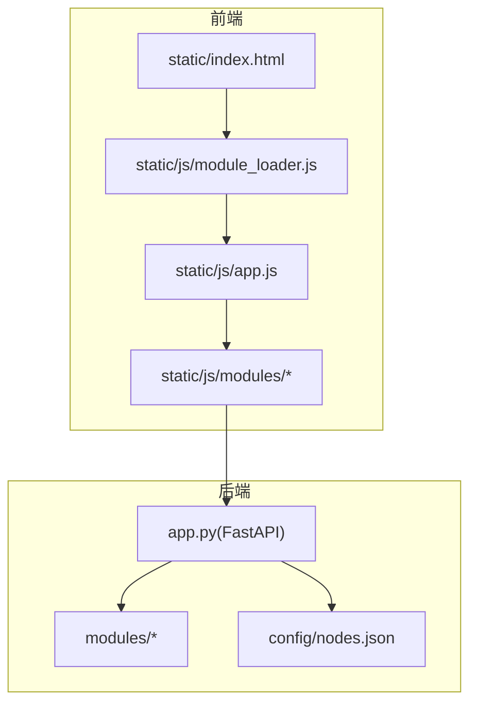
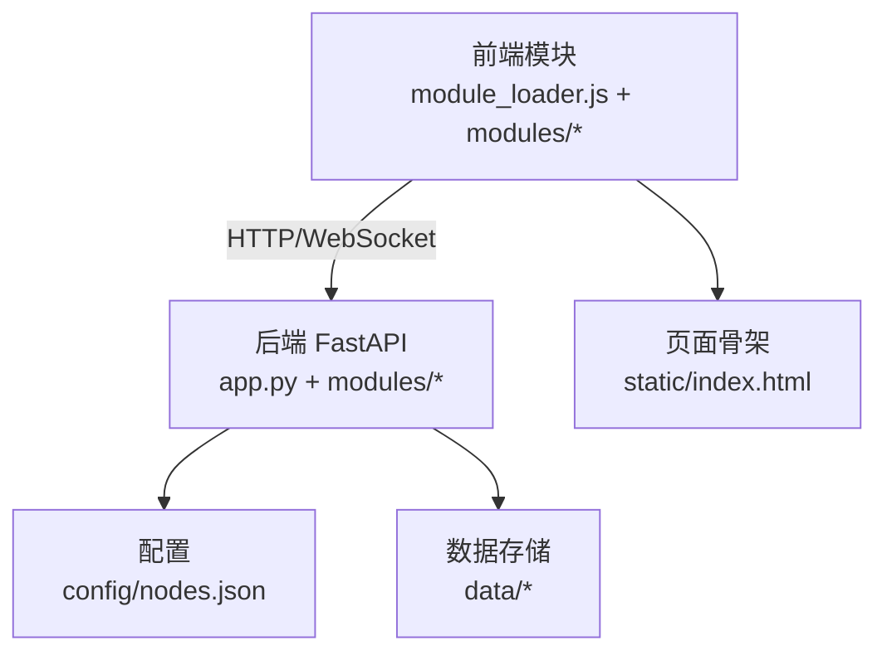
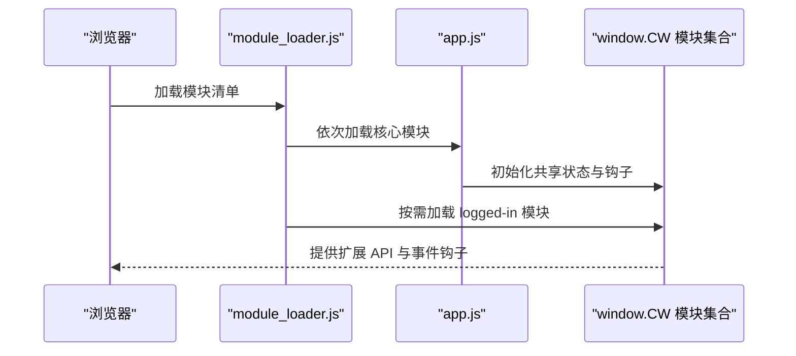
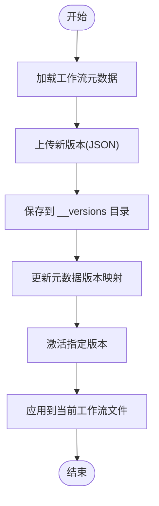
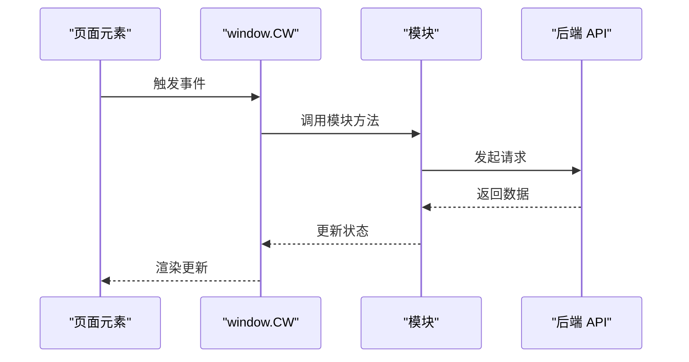
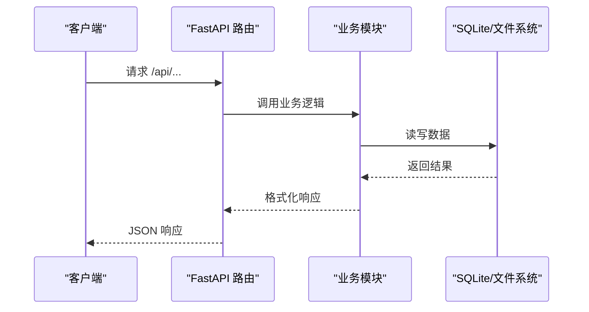
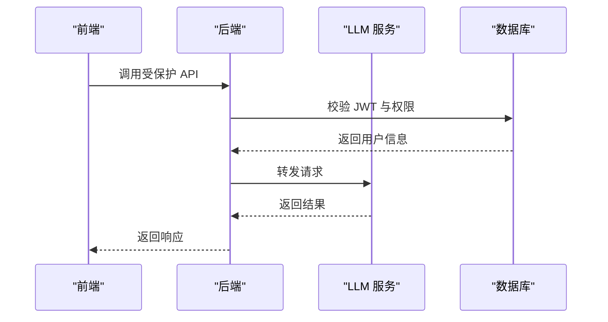
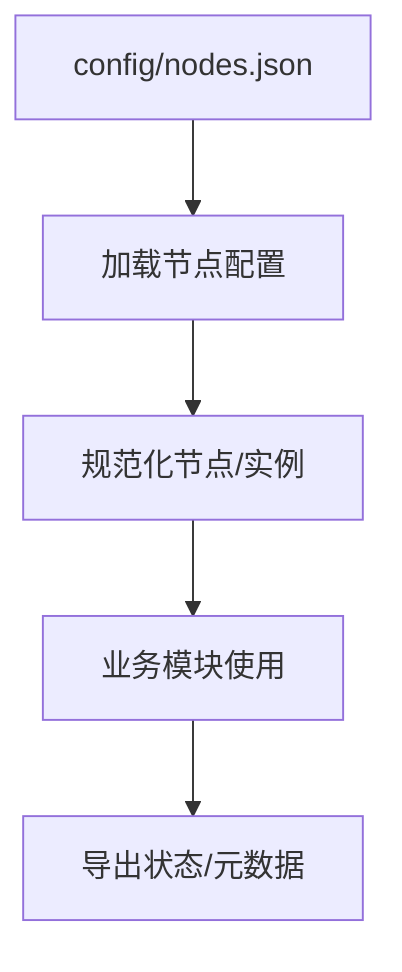
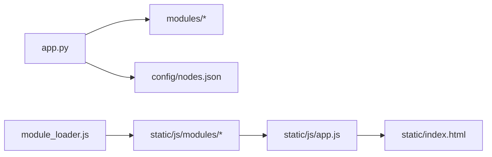

# 扩展开发指南

<cite>
**本文档引用的文件**
- [app.py](file://app.py)
- [modules/config.py](file://modules/config.py)
- [static/js/module_loader.js](file://static/js/module_loader.js)
- [static/js/app.js](file://static/js/app.js)
- [static/index.html](file://static/index.html)
- [config/nodes.json](file://config/nodes.json)
- [scripts/gen_wf_configs.py](file://scripts/gen_wf_configs.py)
- [modules/workflow_validation.py](file://modules/workflow_validation.py)
- [modules/instance_manager.py](file://modules/instance_manager.py)
- [modules/instance_picker.py](file://modules/instance_picker.py)
- [modules/job_runner.py](file://modules/job_runner.py)
- [modules/ws_tracker.py](file://modules/ws_tracker.py)
- [modules/media_outputs.py](file://modules/media_outputs.py)
- [modules/llm_client.py](file://modules/llm_client.py)
- [modules/prompt_interrogator.py](file://modules/prompt_interrogator.py)
- [modules/prompt_optimizer.py](file://modules/prompt_optimizer.py)
- [modules/prompt_labels.py](file://modules/prompt_labels.py)
- [modules/step_calculator.py](file://modules/step_calculator.py)
- [modules/time_estimator.py](file://modules/time_estimator.py)
- [modules/comfyui_upload.py](file://modules/comfyui_upload.py)
- [modules/image_protection.py](file://modules/image_protection.py)
- [modules/image_reverse_skill.py](file://modules/image_reverse_skill.py)
- [modules/image_reverse/parser.py](file://modules/image_reverse/parser.py)
- [modules/image_reverse/pipelines.py](file://modules/image_reverse/pipelines.py)
- [modules/image_reverse/prompts.py](file://modules/image_reverse/prompts.py)
- [modules/image_reverse/schemas.py](file://modules/image_reverse/schemas.py)
- [modules/image_reverse/contracts.py](file://modules/image_reverse/contracts.py)
- [modules/image_reverse/legacy_adapter.py](file://modules/image_reverse/legacy_adapter.py)
- [tests/test_workflow_validation.py](file://tests/test_workflow_validation.py)
- [tests/test_instance_picker.py](file://tests/test_instance_picker.py)
- [tests/test_job_runner_queue.py](file://tests/test_job_runner_queue.py)
- [tests/test_prompt_interrogator.py](file://tests/test_prompt_interrogator.py)
- [tests/test_prompt_optimizer.py](file://tests/test_prompt_optimizer.py)
- [tests/test_media_outputs.py](file://tests/test_media_outputs.py)
- [tests/test_comfyui_upload.py](file://tests/test_comfyui_upload.py)
- [tests/test_image_reverse_pipelines.py](file://tests/test_image_reverse_pipelines.py)
- [tests/test_image_reverse_contracts.py](file://tests/test_image_reverse_contracts.py)
- [docs/superpowers/plans/2026-05-24-mobile-agent-creator.md](file://docs/superpowers/plans/2026-05-24-mobile-agent-creator.md)
</cite>

## 目录
1. [简介](#简介)
2. [项目结构](#项目结构)
3. [核心组件](#核心组件)
4. [架构总览](#架构总览)
5. [详细组件分析](#详细组件分析)
6. [依赖分析](#依赖分析)
7. [性能考虑](#性能考虑)
8. [故障排查指南](#故障排查指南)
9. [结论](#结论)
10. [附录](#附录)

## 简介
本指南面向希望在 Ez ComfyUI Showcase 中进行扩展开发的工程师，系统阐述插件系统设计原理、扩展点识别、钩子机制、插件注册流程；并提供工作流模块、前端模块、后端 API、第三方服务集成、配置系统扩展、调试与测试、发布与部署等完整开发与运维实践路径。

## 项目结构
Ez ComfyUI Showcase 采用前后端分离与模块化组织相结合的结构：
- 后端基于 FastAPI，核心入口为 app.py，模块化分布在 modules/ 下，包含节点管理、实例调度、作业执行、媒体输出、LLM 辅助、图像保护等能力。
- 前端以静态资源为主，通过 module_loader.js 统一加载核心模块，index.html 作为页面骨架，各功能模块以 IIFE 形式注入到 window.CW 命名空间。
- 配置与数据：config/nodes.json 描述节点与实例，data/ 存储历史、作业、系统设置、工作流元数据与版本备份等。

图表来源
- [static/index.html:1-659](file://static/index.html#L1-L659)
- [static/js/module_loader.js:1-151](file://static/js/module_loader.js#L1-L151)
- [static/js/app.js:1-927](file://static/js/app.js#L1-L927)
- [app.py:1-9367](file://app.py#L1-L9367)
- [config/nodes.json:1-97](file://config/nodes.json#L1-L97)

章节来源
- [static/index.html:1-659](file://static/index.html#L1-L659)
- [static/js/module_loader.js:1-151](file://static/js/module_loader.js#L1-L151)
- [static/js/app.js:1-927](file://static/js/app.js#L1-L927)
- [app.py:1-9367](file://app.py#L1-L9367)
- [config/nodes.json:1-97](file://config/nodes.json#L1-L97)

## 核心组件
- 插件系统与扩展点
  - 前端通过 module_loader.js 统一加载核心模块，支持按需加载 logged-in 模块，形成“模块即插件”的扩展模式。
  - 后端通过模块化导入与函数依赖注入实现扩展点，如认证中间件、作业调度、实例管理等。
- 节点与实例管理
  - 节点配置由 config/nodes.json 提供，支持 SSH/HTTP/本地三种连接方式，实例端口扫描与代理访问。
- 工作流与配置
  - 工作流元数据与版本管理由后端维护，前端通过 workflows.js 与后端 API 协作。
  - 工作流配置生成脚本 scripts/gen_wf_configs.py 可自动生成字段配置。
- 业务模块
  - 作业执行、实例调度、媒体输出、LLM 辅助、图像保护、反向技能等均以模块形式提供扩展接口。

章节来源
- [static/js/module_loader.js:1-151](file://static/js/module_loader.js#L1-L151)
- [config/nodes.json:1-97](file://config/nodes.json#L1-L97)
- [scripts/gen_wf_configs.py:139-174](file://scripts/gen_wf_configs.py#L139-L174)
- [modules/config.py:1-152](file://modules/config.py#L1-L152)

## 架构总览
系统采用“前端模块化 + 后端模块化”的双层扩展架构：
- 前端：module_loader.js 负责模块加载顺序与按需加载；各模块通过 window.CW 暴露 API，形成钩子与扩展点。
- 后端：FastAPI 应用通过模块导入与装饰器注册路由，模块内部提供业务能力，统一通过 app.py 汇聚。

图表来源
- [static/js/module_loader.js:1-151](file://static/js/module_loader.js#L1-L151)
- [static/index.html:1-659](file://static/index.html#L1-L659)
- [app.py:1-9367](file://app.py#L1-L9367)
- [config/nodes.json:1-97](file://config/nodes.json#L1-L97)

## 详细组件分析

### 插件系统与扩展点
- 前端扩展点
  - 模块注册：module_loader.js 将 coreModules 与 loggedInModules 有序加载，新增模块只需加入相应数组并确保依赖顺序。
  - 钩子机制：模块通过 window.CW 暴露方法，其他模块可通过 window.CW.xxx 调用，形成松耦合扩展。
  - 条件加载：根据用户登录状态决定是否加载 logged-in 模块，便于按需扩展。
- 后端扩展点
  - 模块导入：app.py 通过 from modules.* import 实现能力注入，新增模块只需在此处导入并使用。
  - 路由扩展：通过 FastAPI 装饰器注册新路由，遵循现有鉴权与响应格式规范。
  - 配置扩展：通过 modules/config.py 集中管理常量与分类映射，新增节点类型或状态映射在此维护。

图表来源
- [static/js/module_loader.js:1-151](file://static/js/module_loader.js#L1-L151)
- [static/js/app.js:87-111](file://static/js/app.js#L87-L111)

章节来源
- [static/js/module_loader.js:1-151](file://static/js/module_loader.js#L1-L151)
- [static/js/app.js:87-111](file://static/js/app.js#L87-L111)
- [modules/config.py:1-152](file://modules/config.py#L1-L152)

### 工作流模块开发
- 工作流配置格式
  - 元数据：名称、标签、所有者、共享、排序、缩略图、版本映射、活动版本等。
  - 版本管理：通过 /api/workflows/{name}/upload-version 上传新版本，/api/workflows/{name}/activate-version 激活版本。
- 字段配置生成
  - 使用 scripts/gen_wf_configs.py 对目标工作流自动生成字段配置，包含字段顺序、类型与默认值。
- 参数验证
  - 后端提供 validate_api_prompt 与 describe_api_prompt_issues，前端 workflows.js 与后端协同进行参数校验与错误提示。

图表来源
- [app.py:9279-9316](file://app.py#L9279-L9316)
- [app.py:9319-9339](file://app.py#L9319-L9339)
- [scripts/gen_wf_configs.py:139-174](file://scripts/gen_wf_configs.py#L139-L174)

章节来源
- [app.py:9279-9339](file://app.py#L9279-L9339)
- [scripts/gen_wf_configs.py:139-174](file://scripts/gen_wf_configs.py#L139-L174)
- [modules/workflow_validation.py](file://modules/workflow_validation.py)

### 前端模块扩展方法
- 新页面开发
  - 在 static/index.html 中添加容器与触发按钮，参考 mobile-agent-creator 的规划文档，新增根节点与样式加载。
- 组件封装
  - 以 IIFE 形式封装模块，通过 window.CW 暴露方法，避免全局污染；与现有模块共享 __APP__ 状态。
- 状态管理
  - 通过 window.__APP__ 暴露 jobs、jobFields、historyItems 等共享状态，模块间通过 getter/setter 访问，保持一致性。

图表来源
- [static/index.html:1-659](file://static/index.html#L1-L659)
- [static/js/app.js:87-111](file://static/js/app.js#L87-L111)
- [docs/superpowers/plans/2026-05-24-mobile-agent-creator.md:759-962](file://docs/superpowers/plans/2026-05-24-mobile-agent-creator.md#L759-L962)

章节来源
- [static/index.html:1-659](file://static/index.html#L1-L659)
- [static/js/app.js:87-111](file://static/js/app.js#L87-L111)
- [docs/superpowers/plans/2026-05-24-mobile-agent-creator.md:759-962](file://docs/superpowers/plans/2026-05-24-mobile-agent-creator.md#L759-L962)

### 后端 API 扩展指南
- 新路由添加
  - 在 app.py 中使用 @app.get/@app.post 等装饰器注册路由，遵循现有鉴权依赖与响应格式。
- 业务逻辑扩展
  - 将新能力封装为模块，通过 from modules.* import 引入，复用现有工具函数（如日志、鉴权、WebSocket 跟踪）。
- 数据模型更新
  - 若涉及持久化，优先使用现有 SQLite 表结构或在模块内提供迁移脚本；确保字段命名与索引规范。

图表来源
- [app.py:8626-8646](file://app.py#L8626-L8646)

章节来源
- [app.py:8626-8646](file://app.py#L8626-L8646)

### 第三方服务集成
- 外部 API 调用
  - 使用 modules/llm_client.py 提供的 LLM 客户端能力，统一处理认证与请求封装。
- 认证集成
  - 基于 JWT 的认证流程，支持注册、登录、变更密码与管理员操作，认证中间件通过 require_admin 依赖注入。
- 数据同步
  - 通过 modules/comfyui_upload.py 等模块实现工作流与媒体数据的上传与同步，结合 WebSocket 跟踪模块监控进度。

图表来源
- [modules/llm_client.py](file://modules/llm_client.py)
- [modules/comfyui_upload.py](file://modules/comfyui_upload.py)
- [modules/ws_tracker.py](file://modules/ws_tracker.py)

章节来源
- [modules/llm_client.py](file://modules/llm_client.py)
- [modules/comfyui_upload.py](file://modules/comfyui_upload.py)
- [modules/ws_tracker.py](file://modules/ws_tracker.py)

### 配置系统扩展
- 新配置项添加
  - 在 config/nodes.json 中添加节点与实例配置，支持 SSH 密码/密钥、代理访问、端口扫描等。
  - 在 modules/config.py 中维护节点分类与状态映射，新增节点类型需同步更新。
- 配置验证
  - 后端对上传的 JSON 进行解码校验，前端通过 workflows.js 与后端协作进行参数校验。
- 默认值管理
  - 通过模块内的默认值与环境变量（如 env:DGX_SPARK_SSH_PASSWORD）实现安全配置。

图表来源
- [config/nodes.json:1-97](file://config/nodes.json#L1-L97)
- [modules/config.py:1-152](file://modules/config.py#L1-L152)

章节来源
- [config/nodes.json:1-97](file://config/nodes.json#L1-L97)
- [modules/config.py:1-152](file://modules/config.py#L1-L152)

### 调试与测试扩展功能
- 单元测试
  - tests/ 目录包含大量测试用例，覆盖工作流验证、实例选择、作业队列、提示优化、媒体输出、图像反推等多个模块。
- 集成测试
  - 通过 app.py 中的路由与模块协作，模拟真实场景（如生成、历史、日志、设备管理）。
- 性能测试
  - 结合作业执行、GPU 监控与超时处理，评估系统在高并发下的稳定性与吞吐。

章节来源
- [tests/test_workflow_validation.py](file://tests/test_workflow_validation.py)
- [tests/test_instance_picker.py](file://tests/test_instance_picker.py)
- [tests/test_job_runner_queue.py](file://tests/test_job_runner_queue.py)
- [tests/test_prompt_interrogator.py](file://tests/test_prompt_interrogator.py)
- [tests/test_prompt_optimizer.py](file://tests/test_prompt_optimizer.py)
- [tests/test_media_outputs.py](file://tests/test_media_outputs.py)
- [tests/test_comfyui_upload.py](file://tests/test_comfyui_upload.py)
- [tests/test_image_reverse_pipelines.py](file://tests/test_image_reverse_pipelines.py)
- [tests/test_image_reverse_contracts.py](file://tests/test_image_reverse_contracts.py)

### 发布与部署扩展功能
- 版本管理
  - 通过 VERSION 文件与 app.py 中的版本读取逻辑统一管理版本号，前端通过 /api/version 暴露版本信息。
- 向后兼容性
  - 通过模块化设计与配置映射（如 NODE_STATUS_MAP），新增节点类型不影响既有功能。
- 用户迁移
  - 通过工作流版本管理与元数据迁移脚本，确保升级过程中用户数据与配置的平滑过渡。

章节来源
- [tests/test_app_version.py:1-21](file://tests/test_app_version.py#L1-L21)
- [modules/config.py:115-151](file://modules/config.py#L115-L151)

## 依赖分析
- 前端模块依赖
  - module_loader.js 依赖 coreModules 与 loggedInModules 的加载顺序，新增模块需遵循依赖链。
- 后端模块依赖
  - app.py 通过模块导入聚合能力，新增模块需在 app.py 中引入并注册路由。
- 外部依赖
  - WebSocket、SQLite、bcrypt、JTW 等，均在 app.py 中集中初始化与使用。

图表来源
- [app.py:1-9367](file://app.py#L1-L9367)
- [modules/config.py:1-152](file://modules/config.py#L1-L152)
- [static/js/module_loader.js:1-151](file://static/js/module_loader.js#L1-L151)
- [static/js/app.js:1-927](file://static/js/app.js#L1-L927)
- [static/index.html:1-659](file://static/index.html#L1-L659)

章节来源
- [app.py:1-9367](file://app.py#L1-L9367)
- [modules/config.py:1-152](file://modules/config.py#L1-L152)
- [static/js/module_loader.js:1-151](file://static/js/module_loader.js#L1-L151)
- [static/js/app.js:1-927](file://static/js/app.js#L1-L927)
- [static/index.html:1-659](file://static/index.html#L1-L659)

## 性能考虑
- 前端
  - 模块懒加载与按需渲染，减少初始包体与首屏阻塞。
- 后端
  - 作业队列与实例调度采用异步与超时控制，避免长尾任务影响整体吞吐。
  - GPU 监控与空闲回收策略，提升资源利用率。

## 故障排查指南
- 常见问题定位
  - 日志系统：后端通过 add_log 与持久化日志文件记录关键阶段与错误信息，前端通过日志面板查看实时日志。
  - 作业超时：根据 JOB_STAGE_TIMEOUTS 与 GPU_STALL 机制，检查实例状态与进度。
- 建议排查步骤
  - 检查节点连接状态与实例健康度。
  - 查看作业队列与 WebSocket 追踪状态。
  - 核对工作流配置与字段映射。

章节来源
- [app.py:117-292](file://app.py#L117-L292)
- [app.py:319-342](file://app.py#L319-L342)
- [app.py:600-736](file://app.py#L600-L736)

## 结论
通过模块化与钩子机制，Ez ComfyUI Showcase 提供了清晰的扩展路径：前端以模块加载为核心，后端以模块导入与路由注册为核心。开发者可按本文档指引，快速实现工作流模块、前端页面、后端 API、第三方服务集成与配置扩展，并结合测试与性能优化保障上线质量。

## 附录
- 关键文件与职责
  - app.py：后端主入口，路由注册与业务编排。
  - modules/config.py：节点分类与状态映射常量。
  - static/js/module_loader.js：前端模块加载与按需加载。
  - static/js/app.js：前端共享状态与钩子初始化。
  - static/index.html：页面骨架与覆盖层容器。
  - config/nodes.json：节点与实例配置。
  - scripts/gen_wf_configs.py：工作流字段配置生成。
  - tests/*：覆盖多模块的测试用例。